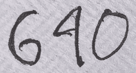
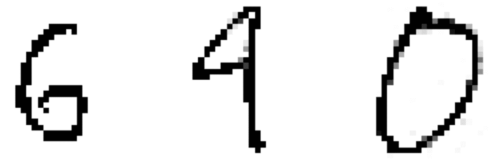

# 3 初尝应用机器学习

> 原文：[`mlbook.explained.ai/first-taste.html`](https://mlbook.explained.ai/first-taste.html)

[特伦斯·帕尔](http://parrt.cs.usfca.edu) 和 [杰里米·霍华德](http://www.fast.ai/about/#jeremy)

版权所有 © 2018-2019 特伦斯·帕尔。保留所有权利。

*请勿在网络上复制或以任何方式分发。*

本书由 markup+markdown+python+latex 源代码生成，使用 [Bookish](https://github.com/parrt/bookish)。

您可以通过访问此页面的注释版本来对此页进行**注释或标注**。您会看到现有的标注部分以黄色突出显示。它们是**公开可见的**。或者，您可以直接向特伦斯发送评论、建议或修正。

目录

+   计算机环境检查

+   预测纽约市公寓租金

    +   加载和嗅探训练数据

    +   训练随机森林模型

    +   模型是否捕捉到训练数据关系？

    +   检查模型泛化能力

    +   调整模型超参数

    +   模型对数据的描述

+   预测乳腺癌

+   手写数字分类

    +   表示和加载图像数据

    +   分类测试数字 6-4-0

    +   比较数字分类器的性能与线性模型

+   总结

“*我们信仰上帝；其他人带来数据。*” —— 据说是 W. 爱德华兹·戴明和乔治·博克斯所说 [Attributed](https://blog.deming.org/w-edwards-deming-quotes/large-list-of-quotes-by-w-edwards-deming)

让我们深入了解将机器学习应用于几个实际问题的实际机制。你可能会惊讶于所需代码的少之又少！对于本章中的 Python 代码片段，请随意盲目地复制粘贴，不必担心细节。我们将在接下来的章节中再次讲解这些内容。主要收获是基本的回归和分类建模过程以及机器学习代码的大致样子。在我们开始之前，让我们确保我们都有相同的 Python 3 版本和必要的库。

## 3.1 计算机环境检查

由于我们假设您知道如何用 Python 编程，我们假设您的机器已经合理地设置好了用于编辑和执行 Python 代码。然而，我们需要确保您需要的所有机器学习库都已安装，并且 Python 3 是您系统上的默认版本。最简单的方法是下载并安装[Anaconda](https://anaconda.org)用于 Python 3。

1 在 Windows 上安装时，请确保勾选将 Python 添加到`PATH`环境变量的复选框，您将需要管理员权限。或者，只需转到开始菜单并执行`Anaconda Prompt`。

使用“64 位图形安装程序”下载并安装 Python 3.6 或更高版本的 Anaconda。1 使用“仅为我”选项，以便安装程序将 Anaconda 放入您的家目录中，这样我们所有人都在同一个位置：Windows 上的`C:\Users\YOURID\Anaconda3`和 Mac（类似 UNIX 机器）上的`/Users/YOURID/anaconda3`。库很大，所以您需要 2.4G 的磁盘空间。为了验证一切安装正确，您应该尝试导入一个库，就像 Terence 在这里从 Mac（UNIX）命令行演示的那样：

```py
$ which python3
/Users/parrt/anaconda3/bin/python3
$ python3
Python 3.6.5 |Anaconda custom (64-bit)| (default, Apr 26 2018, 08:42:37) 
[GCC 4.2.1 Compatible Clang 4.0.1 (tags/RELEASE_401/final)] on darwin
Type "help", "copyright", "credits" or "license" for more information.
>>> import pandas as pd
>>>
```

在 Windows 上，您可以从 PowerShell（如果`python`在您的`PATH`中）或通过从开始菜单启动的“anaconda prompt”启动 Python 3 解释器：

```py
(C:\Users\parrt\Anaconda3) C:\Users\parrt>python
Python 3.6.5 |Anaconda custom (64-bit)| (default, Apr 26 2018, 08:42:37) 
[GCC 4.2.1 Compatible Clang 4.0.1 (tags/RELEASE_401/final)] on darwin
Type "help", "copyright", "credits" or "license" for more information.
>>> import pandas as pd
>>>
```

如果您收到`>>>`提示符并且没有错误，那么您就可以开始了！

我们还需要一个名为`rfpimp`的包，它为我们提供了一个可靠的方式来比较各种公寓特征的预测能力：

```py
$ pip install rfpimp
```

在下一章，**第四章** *开发工具*中，我们将介绍合适的发展环境，但现在您可以使用任何旧的 Python 编辑工具。

## 3.2 预测纽约市公寓租金

作为第一个例子，让我们训练一个随机森林模型来预测纽约市的公寓租金。这个租金数据集是来自[Kaggle 竞赛](https://www.kaggle.com/c/two-sigma-connect-rental-listing-inquiries)数据的理想化版本。

### 3.2.1 加载和嗅探训练数据

让我们从在 Kaggle 上下载我们的数据集开始。（您必须是注册的 Kaggle 用户并且必须登录。）转到 Kaggle 的[数据页面](https://www.kaggle.com/c/two-sigma-connect-rental-listing-inquiries/data)，并将`train.json`保存到您本地机器上的数据目录中。然后，从命令行执行[prep-rent.py](https://mlbook.explained.ai/data/prep-rent.py)脚本（来自本书的[data](https://mlbook.explained.ai/data/index.html)目录），以创建您需要的 CSV 文件：

```py
$ cd data
$ python prep-rent.py 
Created rent.csv
Created rent-ideal.csv
```

现在，我们可以借助您的新 BFF（永远的朋友）[Pandas](https://pandas.pydata.org/)加载`rent-ideal.csv`数据集。一旦我们导入了 Pandas 库，给它一个标准的简短别名`pd`，我们就可以调用`read_csv()`函数来打开一个逗号分隔值记录的文件（每行一个公寓记录，并且有一个包含列名的标题行）：

```py
import pandas as pd # Import the library and give a short alias: pd
rent = pd.read_csv("data/rent-ideal.csv")

```

存储到变量`rent`的结果被称为*数据框*，它就像电子表格或数据库表一样工作，有行和命名的列。以下是打印前五条记录的方法：

```py
print(rent.head(5))

```

卧室 浴室 纬度 经度 价格 0 3 1.5 40.7145 -73.9425 3000 1 2 1.0 40.7947 -73.9667 5465 2 1 1.0 40.7388 -74.0018 2850 3 1 1.0 40.7539 -73.9677 3275 4 4 1.0 40.8241 -73.9493 3350

您可以将这三行直接复制粘贴到 Python 文件中并运行该文件以获得该输出，前提是您给`read_csv()`提供正确的数据文件路径。本节中所有的代码片段都是同一个大型脚本的一部分。

一旦我们有一个数据框，我们就可以提出各种问题。例如，我们可以使用`rent['price']`提取价格列，然后询问平均值（统计学家称平均值为*均值*）：

```py
prices = rent['price']
avg_rent = prices.mean()
print(f"Average rent is ${avg_rent:.0f}")

```

平均租金为$3438

就像电子表格中的[数据透视表](https://en.wikipedia.org/wiki/Pivot_table)或数据库中的[GROUP BY](https://www.w3schools.com/sql/sql_groupby.asp)运算符一样，我们可以使用 Pandas 进行一些相当复杂的数据聚合。以下代码按卫生间数量对训练数据进行分组，并计算平均价格（实际上是所有其他列的平均值）：

```py
bybaths = rent.groupby(['bathrooms']).mean()
bybaths = bybaths.reset_index() # overcome quirk in Pandas
print(bybaths[['bathrooms','price']]) # print just num baths, avg price

```

卫生间 价格 0 0.0 3144.870000 1 1.0 3027.007118 2 1.5 4226.336449 3 2.0 5278.595739 4 2.5 6869.047368 5 3.0 6897.974576 6 3.5 7635.357143 7 4.0 7422.888889 8 4.5 2050.000000 9 10.0 3600.000000

Pandas 还拥有出色的图形功能，归功于您的下一个最佳朋友，一个复杂的绘图库，称为[matplotlib](https://matplotlib.org/)。以下是绘制价格与卫生间数量对比的示例：

» 由代码生成的左侧


```py
import matplotlib.pyplot as plt

bybaths.plot.line('bathrooms','price', style='-o')
plt.show()
```

### 3.2.2 训练随机森林模型

训练模型时，我们将数据框分为特征列（预测因子）和目标（预测）列，从业者通常将这些变量称为`X`和`y`。让我们使用所有公寓特征来预测租金，看看如何提取适当的特征向量和目标列：

```py
X, y = rent[['bedrooms','bathrooms','latitude','longitude']], rent['price']

```

变量`X`是一个包含卫生间列的数据框（列的列表），而`y`是价格列（在 Pandas 术语中称为`Series`）：

```py
print(type(X), type(y))

```

<class 'pandas.core.frame.DataFrame'> <class 'pandas.core.series.Series'>

Python 机器学习库的表面面积非常庞大，很难判断一个库在哪里结束，另一个库在哪里开始，因为它们之间如此交织。

我们将要使用的 RF 实现来自另一个非常棒的库，称为[scikit-learn](http://scikit-learn.org/stable/)，我们将简称为`sklearn`。2 我们将特别使用`RandomForestRegressor`类。以下是训练 RF 模型于我们的公寓租金数据的简单咒语：

```py
from sklearn.ensemble import RandomForestRegressor

rf = RandomForestRegressor(n_estimators=10) # use 10 trees
rf.fit(X, y)

```

要进行实际预测，我们需要使用一个或多个特征向量的列表调用`predict()`。让我们编造一个未知的公寓特征向量来进行单个租金预测：

```py
unknown_x = [2, 1, 40.7957, -73.97] # 2 bedrooms, 1 bathroom, ...

```

因为`predict()`期望一个特征向量的列表，所以在传递给`predict()`之前，我们将`unknown_x`包装在一个列表中：

```py
predicted_y = rf.predict([unknown_x])
print(predicted_y)

```

[4442.17176527]

`predict()`函数返回一个预测租金价格的列表，每个列表中的公寓对应于作为`X`参数传递的公寓列表中的一个。模型根据`unknown_x`中的公寓特征预测租金约为$4442。

### 3.2.3 模型是否捕捉到训练数据的关系？

一旦我们训练了一个模型，我们必须对其进行测试，就像我们在部署软件之前所做的那样。有两件事情需要测试。首先，我们验证模型是否很好地拟合了训练数据，这意味着模型捕捉到了训练数据中特征向量和目标之间的关系。其次，我们验证模型是否具有泛化能力，为不在训练集中的特征向量提供合理的租金预测。

为了查看模型与训练数据的拟合程度，我们将训练数据的特征向量重新输入模型，并将预测值与已知的实际价格进行比较。在我们这个过程中，我们并不关心泛化能力。我们只是检查我们的模型能否以某种程度的准确性重现原始训练数据。如果模型无法对其训练的公寓做出准确预测，那么模型将无法泛化到之前未见过公寓的情况。

实践者使用了许多常见的误差度量，但在这个情况下，测量预测价格和实际价格之间的平均差异是一个好的指标。换句话说，我们将为每套公寓做出预测，并将其从训练数据中找到的实际价格中减去（并取绝对值）。这些差异的平均值是*平均绝对误差*，简称*MAE*，sklearn 提供了一个现成的函数来计算它。以下是将训练数据重新输入模型并打印出模型平均偏差（以及占平均偏差的百分比）的方法：

```py
from sklearn.metrics import mean_absolute_error

predictions = rf.predict(X)
e = mean_absolute_error(y, predictions)
ep = e*100.0/y.mean()
print(f"${e:.0f} average error; {ep:.2f}% error")

```

$189 平均误差；5.51%误差

这意味着使用这个模型的用户可以预期训练数据中公寓的预测价格将偏离大约$189，这相当不错！我们称之为*训练误差*。

他们说，在房地产中最重要的三个属性是：位置，位置，位置。让我们用我们的租赁数据来测试这个假设，只使用与地图位置相关的两列：

```py
X, y = rent[['latitude','longitude']], rent['price']
rf = RandomForestRegressor(n_estimators=100)
rf.fit(X, y)
location_e = mean_absolute_error(y, rf.predict(X))
location_ep = location_e*100.0/y.mean()
print(f"${location_e:.0f} average error; {location_ep:.2f}% error")

```

$519 平均误差；15.10%误差

仅使用位置信息，没有任何关于卧室数量或浴室数量的信息，训练集上的平均预测误差为$519。这比所有特征的平均误差（$189）要大，但仍然不错。

你可能会比较所有特征模型拟合的 5.508%误差和这个 15.095%误差，并认为“这只是 9%。”更好的思考方式是将 5.51/15.10 的比率视为 36%，而不是 5.51-15.10 的差值。这个比率表明，从模型中删除卧室和浴室的数量将使预测精度降低 36%。这个信息非常有用，因为它告诉我们关于这些特征预测能力的一些信息。

然而，我们不应该对$189 的训练误差过于兴奋，因为这仅仅表明我们的模型捕捉到了训练数据中的关系。我们对模型的泛化能力一无所知。

### 3.2.4 检查模型泛化性

模型质量的真正衡量标准是其泛化能力：它如何准确地预测训练数据中未找到的公寓特征向量的价格。即使是一个糟糕的模型，如字典，也可以记住训练数据，并准确地为相同的训练数据提供价格。为了测试模型的泛化能力，我们需要一个验证策略。这是一个重要的大主题，我们将在整本书中回顾。现在，让我们看看一种常见的验证策略，称为*保留法*。

我们得到了一个单一的数据集：训练数据。如果我们在这个整个数据集上训练，我们如何衡量不在训练集中的数据的准确性？我们没有其他数据可用于验证。答案是保留，比如说，20%的训练数据，将原始数据集分成两个：一个较小的训练集和一个*验证集*。验证集仅用于我们模型的泛化测试，而不用于模型训练。保留哪 20%有时并不简单，但对于公寓数据，随机子集是可行的。

Sklearn 内置了一个用于分割数据集的函数，因此这次我们使用 80%的数据重新训练 RF 模型，并使用验证集中的 20%来检查平均价格误差：

```py
from sklearn.model_selection import train_test_split

X, y = rent[['bedrooms','bathrooms','latitude','longitude']], rent['price']
# 20% of data goes into test set, 80% into training set
X_train, X_test, y_train, y_test = train_test_split(X, y, test_size=0.2) 

rf = RandomForestRegressor(n_estimators=10)
rf.fit(X_train, y_train)

validation_e = mean_absolute_error(y_test, rf.predict(X_test))
print(f"${validation_e:.0f} average error; {validation_e*100.0/y.mean():.2f}% error")

```

$303 平均误差；8.80%误差

比较验证集的平均误差$302 和训练误差$189，我们看到模型在训练数据上的表现要好得多。这正是我们所期望的，因为训练误差是我们的“不要超过速度”。（训练误差类似于我们在事先看到答案的测验中会得到的分数。）我们希望验证误差尽可能接近训练误差。

如果你多次运行该代码，你会注意到不同的运行得到不同的验证误差，因为选择验证子集的变异性。这不是一个好的特性，但我们将会在**第 9.1.1 节** *分割时间不敏感数据集*中查看更稳定的度量标准，例如 k 折交叉验证。

### 3.2.5 调整模型超参数

现在我们有了模型泛化的度量标准，我们可以用它来调整模型架构，以期提高准确性。想法是调整模型的一些方面，看看验证误差是上升还是下降。例如，我们森林中的树的数量会影响准确性，所以让我们将树的数量从 10 增加到 100：

```py
rf = RandomForestRegressor(n_estimators=100)
rf.fit(X_train, y_train)

e = mean_absolute_error(y_test, rf.predict(X_test))
print(f"${e:.0f} average error; {e*100.0/y.mean():.2f}% error")

```

$296 平均误差；8.61%误差

树的数量以及影响模型架构的任何其他方面，统计学家称之为*超参数*。（我认为我们程序员会称之为元参数。）模型内部如树本身这样的元素被称为模型参数。作为另一个例子，线性模型中的四个 w[i]权重和最小租金值（我们在**第 2.1.3 节** *绘制线条*中简要讨论过）是模型参数。

以牺牲一点更多的计算能力为代价，我们模型的准确性只是略有提高，但每一点都很有帮助。

### 3.2.6 模型对数据的说法

机器学习模型为我们做的不仅仅是做出预测。根据模型的不同，我们可以对数据本身了解很多。想法是，在各个数据集上训练的模型将具有不同的内部结构（参数）。然而，我们不必检查那些个别参数，通过询问模型我们可以学到更多。例如，对于房地产经纪人来说，一个关键的市场营销问题是“人们在这个市场上关心什么？”更普遍地说，我们想知道哪些特征具有最大的预测能力。

3sklearn 随机森林特征重要性策略有时是有偏的，所以我们使用`rfpimp`。更多信息请参阅[Beware Default Random Forest Importances](http://explained.ai/rf-importance/index.html)。

要计算这样的特征重要性，我们可以比较使用所有特征训练的模型和移除单个特征后相同模型训练的验证错误。这个差异告诉我们关于那个缺失特征的相对重要性的一些信息。如果验证错误大幅上升，我们知道这个特征很重要。但如果错误保持不变，我们可以得出结论，这个特征在孤立的情况下具有非常小的预测能力。从业者经常这样做 RF，但这种方法查询特征重要性适用于任何模型。（这种暴力重新训练方法有效且说明了这个想法，但随机化特征列并重新测试比移除和重新训练模型更有效。）以下是使用`rfpimp`包打印特征重要性的方法：3

```py
from rfpimp import *
rf = RandomForestRegressor(n_estimators=100)
rf.fit(X_train, y_train)
I = importances(rf, X_test, y_test)
I
```

|   | 重要性 |
| --- | --- |
| 特征 |
| --- |
| 卧室 | 0.5717 |
| 经度 | 0.5307 |
| 纬度 | 0.4943 |
| 卫生间 | 0.4566 |

注意，RF 模型是使用训练集训练的，但重要性是使用验证集计算的。因此，特征重要性衡量的是当每个特征被移除（或随机排列）时，模型验证集准确性的下降。在这个背景下检查特征的预测能力是有意义的，因为我们最关心的是模型如何将测试向量泛化到训练集之外的测试集。

每个特征重要性的实际值表示其对模型准确性的重要程度的大小，但大多数情况下我们关心特征重要性之间的相对差异。如果我们用一种花哨的方式来看这些重要性，就更容易看到它们的相对强度：

» *由代码生成左侧*


```py
plot_importances(I, color='#4575b4', vscale=1.8)
```

使用 rfpimp，我们甚至可以要求它在计算特征重要性时将纬度和经度一起作为一个元特征分组：

» *由代码生成左侧*

(images/first-taste/first-taste_go_31.svg)

```py
I = importances(rf, X_test, y_test,
                features=['bedrooms','bathrooms',['latitude','longitude']])
plot_importances(I, color='#4575b4', vscale=1.8)
```

从这一点，我们可以得出结论，纽约客最不关心洗手间，因为与其他特征相比，这个特征具有最少的预测能力。纬度和经度共同具有很大的预测能力（这完全关乎位置）。以这种方式对模型进行询问，我们可以获得关于纽约市租赁市场的有用信息，我们可以将这些信息传递给我们的模型消费者。

通常我们的训练数据有更多的特征，我们可以使用特征重要性图来删除不重要的特征。简单的模型更容易向最终用户解释，并且会导致更快的训练时间。

现在我们已经看到了如何训练回归模型，让我们训练一个分类器模型来看看训练和测试回归器和分类器的过程有多么相似。唯一的区别是我们使用`RandomForestClassifier`对象而不是`RandomForestRegressor`来处理分类器的二元目标变量（而不是回归器的连续目标值）。

## 3.3 预测乳腺癌

为了构建我们的第一个分类器，我们将使用著名的[威斯康星乳腺癌数据集](https://archive.ics.uci.edu/ml/datasets/Breast+Cancer+Wisconsin+%28Diagnostic%29)来训练一个模型。这是一个很好的入门数据集，因为它很容易被多种机器学习模型所接受，包括 RFs。乳腺癌数据集中有 569 个观测值（患者），每个观测值有 30 个数值预测特征。目标变量（诊断）是一个二元变量，表示恶性（糟糕）或良性（好！）。特征描述了数字化图像中细胞核的形状、大小和其他特征；没有缺失的特征值，我们将在**第五章** *探索和去噪您的数据集*中学习如何处理这些缺失值。

Sklearn 有一个方便的函数叫做`load_breast_cancer()`，所以让我们开始填充一个数据框：

```py
from sklearn.datasets import load_breast_cancer
import pandas as pd

cancer = load_breast_cancer()

X = cancer.data
y = cancer.target
df = pd.DataFrame(X, columns=cancer.feature_names)

```

许多细胞核特征在意义上是冗余的，因为它们测量的是相同或几乎相同的东西。例如，如果我们知道圆的半径，我们也知道周长，所以像`平均半径`和`平均周长`这样的特征很可能是非常相似的变量。不独立的特征被称为*共线性*，在实践中，特征很少是完全独立的。**第十五章** *理解变量之间的关系*考虑了这一乳腺癌数据集的共线性，并展示了如何选择最重要的特征。使用该章节中的分析，为了简化起见，让我们限制自己使用 7 个关键特征（30 个特征中的）并显示一些数据以了解其外观：

```py
features = ['radius error', 'texture error', 'concave points error',
            'symmetry error', 'worst texture', 'worst smoothness',
            'worst symmetry']
df = df[features] # select just these features
print("target[0:30] =", y[0:30]) # show 30 values of malignant/benign target
df.head()
```

target[0:30] = [0 0 0 0 0 0 0 0 0 0 0 0 0 0 0 0 0 0 0 1 1 1 0 0 0 0 0 0 0 0]

|   | 半径误差 | 纹理误差 | 凹点误差 | 对称性误差 | 最差纹理 | 最差平滑度 | 最差对称性 |
| --- | --- | --- | --- | --- | --- | --- | --- |
|  |
| --- |
| 0 | 1.0950 | 0.9053 | 0.0159 | 0.0300 | 17.3300 | 0.1622 | 0.4601 |
| 1 | 0.5435 | 0.7339 | 0.0134 | 0.0139 | 23.4100 | 0.1238 | 0.2750 |
| 2 | 0.7456 | 0.7869 | 0.0206 | 0.0225 | 25.5300 | 0.1444 | 0.3613 |
| 3 | 0.4956 | 1.1560 | 0.0187 | 0.0596 | 26.5000 | 0.2098 | 0.6638 |
| 4 | 0.7572 | 0.7813 | 0.0189 | 0.0176 | 16.6700 | 0.1374 | 0.2364 |

正如我们在租金价格预测中所做的那样，我们需要将我们的数据集分为训练集和验证集（由于数据集非常小，验证集使用 15%而不是 20%）：

```py
from sklearn.model_selection import train_test_split
X_train, X_test, y_train, y_test = train_test_split(df, y, test_size=0.15)

```

然后，我们就可以开始训练和测试我们的分类器了：

```py
from sklearn.ensemble import RandomForestClassifier

cl = RandomForestClassifier(n_estimators=300)
cl.fit(X_train, y_train)
validation_e = cl.score(X_test, y_test)
print(f"{validation_e*100:.2f}% correct")

```

91.86% 正确

对于分类器，`score()`函数返回最简单的正确性指标（准确率），它衡量模型在 569 个观测值中预测正确的数量占 569 的比例。测试分类器通常比测试回归器复杂得多，正如我们在第十三章“评估分类器性能”中将会看到的，但准确率现在就足够了。鉴于我们只使用了 7 个特征，91.860%的准确率是非常好的。使用所有 30 个特征，我们看到了大约 96%的平均验证准确率，但由于将数据集分为训练集和验证集的随机性以及 RF 构建过程中使用的随机性，验证准确率波动很大。

我们可以像对回归器那样计算分类器的特征重要性。（实际上，我们可以为任何模型计算特征重要性。）在这种情况下，我们看到“半径误差”是区分恶性与良性肿块的最重要特征，基于这 7 个特征。

» *由左侧代码生成*


```py
from rfpimp import *
I = importances(cl, X_test, y_test)
plot_importances(I, color='#4575b4', vscale=1.4)
```

这样的特征重要性图表明病理学家应该关注哪些细胞特征路径。

到目前为止，我们已经在结构化数据上训练了一个回归器和分类器。结构化数据是我们通常在电子表格或数据库表中看到的数据。另一方面，非结构化数据集包含诸如图像、文档和推文等东西。由于本书专注于应用于结构化数据的 RF 模型，我们不会对非结构化数据做太多处理。（作为一个一般规则，我们建议使用神经网络处理非结构化数据。）尽管如此，RF 可以应用于许多非结构化数据问题，例如光学字符识别，我们将在下一节中这样做。这为我们提供了一个机会，在探索机器学习的有趣应用的同时，内化一些关于模型适用性的重要概念。

## 3.4 手写数字分类



**图 3.1**. 邮递员误将 640 解读为 690

前几天，特伦斯收到了一封寄往 640 号的美国邮件，尽管他住在 690 号，因为信使（可以理解地）将数字“4”误分类为“9”（见 **图 3.1**）。让我们看看我们能否训练一个模型，使其识别数字的准确性高于信使。

为了训练模型，我们需要一些带有已知数字值的标签的手写数字样本图像，这些图像可以在著名的 [MNIST](http://yann.lecun.com/exdb/mnist/) 数据集中找到。我们的策略将是使用图像的像素作为特征，使用已知的数字标签作为目标值来训练一个 RF 分类器。然后我们将要求模型对从信封上写下的地址扫描的 6-4-0 数字图像进行分类。模型预测结果乍一看令人惊讶，但在仔细检查训练数据后，教给我们关于机器学习模型预期行为的重要教训。接下来，我们将比较 RF 与另一种模型的性能，然后通过压缩图像并重新比较模型的性能来完成。

### 3.4.1 表示和加载图像数据

整个数据集有 60,000 张图像，但我们提取了 10,000 张图像，将它们从二进制转换为逗号分隔值（*CSV*），并将它们压缩成 [mnist-10k-sample.csv.zip](https://mlbook.explained.ai/data/mnist-10k-sample.csv.zip) 以用于本例。您可以下载并解压缩该文件到您的数据目录中。同时获取 [640.csv](https://mlbook.explained.ai/data/640.csv)，其中包含与 MNIST 数据集相同格式的三个 6-4-0 数字图像数据。



**图 3.2**. 扫描并缩放到 28x28 像素图像的 6-4-0 数字

让我们从将 6-4-0 数字作为 28x28 像素图像（**图 3.2**）加载到数据框中开始，看看我们得到了什么：

```py
import pandas as pd
addr640 = pd.read_csv("data/640.csv")

```


**图 3.3**. 640.csv 中的图像作为数据框

每一行包含单个图像的完整像素集，以及作为最后一列的已知数字值（0..9）。（见 **图 3.3**。）让我们使用 `addr640.digit` 打印 `digit` 列的值，然后删除它，因为我们知道数字是 6-4-0：

```py
print(addr640.digit.values)
addr640 = addr640.drop('digit', axis=1) # drop digit column

```

[6 4 0]

每个像素是一个介于 0 和 1 之间的浮点值，表示像素强度（灰度），其中 0 表示白色，1 表示黑色。例如，一个空白图像将是全零，而一个人在图像上乱涂乱画的图像将是接近 1 的暗值。图像是 28 x 28 像素，因此数据框中的每一行都有 784 列像素以及已知的数字值列。图像的可视行像素被连接在一起或“展平”以形成一个数据集中的单个长数字行。

由于数字很多，在数据框中查看像素值并不像直接打印数据框那样容易。最好是通过重塑 784 个元素的二维像素数组为 28 x 28 的二维数组，然后让 matplotlib 显示这个二维数组作为图像：

» *由左侧代码生成*


```py
six_img_as_row = addr640.iloc[0].values  # digit '6' is first row
img28x28 = six_img_as_row.reshape(28,28) # unflatten as 2D array
plt.imshow(img28x28, cmap='binary')
plt.show()
```

另一种可视化表示数字图像的数据的方法是打印出像素值，每行 28 个值，每行 28 个值。为了减少打印输出的尺寸，让我们将任何大于 0 的值翻转为 1，并将像素值转换为整数。然后，我们可以直接打印出 2 维矩阵：

```py
six_img_as_row[six_img_as_row>0] = 1  # convert 0..1 to 0 or 1
six_img_as_row = six_img_as_row.astype(int)
img28x28 = six_img_as_row.reshape(28,28)
s = str(img28x28).replace(' ','')     # remove spaces
print(s)

```

[[0000000000000000000000000000] [0000000000000000000000000000] [0000000000000000000000000000] [0000000000000000000000000000] [0000000000000011111000000000] [0000000000000111101000000000] [0000000000001110000000000000] [0000000000011100000000000000] [0000000000011000000000000000] [0000000000110000000000000000] [0000000000100000000000000000] [0000000001100000000000000000] [0000000001100000000000000000] [0000000001100000000000000000] [0000000001100000000000000000] [0000000011000011111100000000] [0000000011000111111100000000] [0000000011101100000110000000] [0000000011101000000110000000] [0000000001100100000110000000] [0000000000100000000100000000] [0000000000110000000100000000] [0000000000011000001100000000] [0000000000000111111100000000] [0000000000000111111000000000] [0000000000000000000000000000] [0000000000000000000000000000] [0000000000000000000000000000]]

然后，*哇*，0 和 1 的模式在视觉上形成了一个 6 位数！我们将在**第 4.2 节** *数据框道场*中深入探讨此类有用的数据处理。

现在，让我们将我们的训练数据加载到一个数据框中，就像我们为 6-4-0 测试图像所做的那样：

```py
digits = pd.read_csv("data/mnist-10k-sample.csv")
images = digits.drop('digit', axis=1) # get just pixels
targets = digits['digit']             # get just digit value

```

通过重复使用 matplotlib 的`imshow()`函数，我们可以从训练数据框中获取一个图像网格，并用它们的真实数字值进行注释。以下是如何在一个 10x5 网格中绘制前 50 个图像的方法：

» *由左侧代码生成*


```py
fig, axes = plt.subplots(10, 5, figsize=(4, 6.5)) # make 10x5 grid of plots

for i, ax in enumerate(axes.flat):
    img_as_row = images.iloc[i].values
    img28x28 = img_as_row.reshape(28,28)
    ax.axis('off') # don't show x, y axes
    ax.imshow(img28x28, cmap='binary')
    ax.text(0, 8, targets[i], color='#313695', fontsize=18)
plt.show()
```

你可以调整子图网格来绘制更多图像，以获得训练集的感觉。参见**第 4.3 节** *使用 matplotlib 生成绘图*，了解 matplotlib 图形库的基础知识。

### 3.4.2 分类测试数字 6-4-0

在我们的随机森林（RF）中，我们选择了超参数 `n_estimators`=900 棵树，因为我们通过实验发现，树的数量较少会导致预测结果一致性降低和准确性下降。

现在我们有了合适的训练集，其中包含手写数字及其在`images`和`targets`中的真实数字值，让我们训练一个 RF 分类器，看看它对 6-4-0 图像的预测结果是什么：4

```py
from sklearn.ensemble import RandomForestClassifier

cl = RandomForestClassifier(n_estimators=900, n_jobs=-1)
cl.fit(images, targets)
pred = cl.predict(addr640)
print(pred)
```

[6 7 0]

模型预测第一个数字是 6，第二个是 7，第三个是 0。字母载体、模型和我们都同意 6 和 0，但我们都不同意第二个数字。字母载体认为它是 9，模型认为它是 7，但我们认为第二个数字实际上是 4。对我们人类来说，**图 3.2**中的第二个数字显然不是 7。有些奇怪的事情发生了，所以让我们调查一下。首先，让我们看看模型在 7 的预测上有多自信，使用`predict_proba()`而不是`predict()`：

```py
import numpy as np;
np.set_printoptions(precision=3)

digit_values = range(10)
prob = cl.predict_proba(addr640)
prob_for_2nd_digit = prob[1]
print(prob_for_2nd_digit)

```

[0.019 0.133 0.083 0.142 0.09 0.081 0.051 0.234 0.029 0.137]

函数`predict_proba()`为每个可能的目标类别返回一个概率，在这个例子中是数字 0-9。位置 7（从 0 开始索引）的概率最高，这就是为什么模型预测 7：

```py
pred_digit = np.argmax(prob_for_2nd_digit)
print("predicted digit is", pred_digit)

```

预测数字是 7

通过视觉比较不同的概率更容易，所以让我们生成条形图来显示每个测试图像的预测概率。以下是显示其中一个条形图的代码，即第二个测试数字的条形图：

 » *由代码生成左侧*


```py
pred_digit = np.argmax(prob_for_2nd_digit)
bars = plt.bar(digit_values, prob_for_2nd_digit, color='#4575b4')
bars[pred_digit].set_color('#fdae61')
plt.xlabel("predicted digit")
plt.xticks(digit_values)
plt.ylabel("likelihood 2nd image\nis a specific digit")
plt.show()
```


模型以很大的差距预测第二个测试数字是 7。它根本不考虑 4 是一个可能的选择。这个预测令人担忧，因为它不符合我们的预期。从人类的角度来看，第二个数字是 4 或 9，绝对不是 7。

调试机器学习代码通常非常具有挑战性，因为许多问题可能表现为模型表现不佳。我们的代码中可能存在错误，我们可能选择了不合适的模型，我们可能没有足够的数据，数据可能很嘈杂，等等。我们可以假设 MNIST 训练数据集是好的，并且 10000 张图像足够作为训练数据。训练和测试模型的代码非常小，因此不太可能是问题所在。

面对行为异常的代码时，经验丰富的程序员知道，因为没有发生任何神秘的事情，程序正在做我们告诉它做的事情。在数据科学背景下，这个原则可能是：模型正在根据我们给它提供的经验（训练数据）进行预测。这是一个很大的提示，我们应该再次检查数据，这次专注于已知为 4 的图像。以下代码将 4 的图像隔离出来，并在网格中显示前 15*8=120 个图像。

» *由代码生成左侧*


```py
fours = images[targets==4] # find all "4" images

fig, axes = plt.subplots(15, 8, figsize=(4,6.5))
for i, ax in enumerate(axes.flat):
    img = fours.iloc[i,:].values.reshape(28,28)
    ax.axis('off')
    ax.imshow(img, cmap='binary')
```

如果我们将这些图像与**图 3.2**中的信封上的 4 位数字进行比较，很明显，没有任何训练图像看起来像我们的 4 个测试图像。其中一些图像顶部呈三角形，与测试图像相似，但训练图像中的水平线与垂直线相交，而测试图像中的水平线在垂直线上终止。考虑到模型所获得的“经验”，很容易理解为什么它没有预测数字 4。

这引出了一个重要的教训，值得强调：模型只能根据提供给它们的训练数据进行预测。它们不一定有与我们相同的经验，因此我们在评估模型时必须将预测期望与训练数据相匹配。或者，我们可以通过提供更广泛的训练集来改善这种情况。

这个教训适用于回归器，而不仅仅是分类器。想象一下，你是一名房地产经纪人，你见过的每个两室一厅的公寓每月租金大约是 4,000 美元。基于这样的经验，客户应该期待你预测一个未知的两室一厅公寓的租金为 4,000 美元。换句话说，机器学习模型在给定的训练数据约束下尽力而为，即使模型的预测与我们的预期大相径庭。

最后，我们的机器学习模型的表现并不比信差好；它只是预测了一个人类不太可能选择的数字。测量模型在一般情况下的准确率，而不仅仅是单个测试案例，将是有趣的，所以让我们接下来这么做。

### 3.4.3 比较数字分类器的性能与线性模型

就像我们对乳腺癌数据所做的那样，让我们将 MNIST 数据分成训练集和验证集（80/20），训练一个 RF 分类器，并测量整体准确率：

```py
X_train, X_test, y_train, y_test = \
    train_test_split(images, targets, test_size=.2)

cl = RandomForestClassifier(n_estimators=900, n_jobs=-1)
cl.fit(X_train, y_train)
rfaccur = cl.score(X_test, y_test)
print(rfaccur)
```

0.9445

94.450%的准确率听起来相当不错，从商业角度来看，对于许多应用来说可能已经足够满意。但是，将 RF 的性能与其他模型进行比较，作为质量的一个衡量标准，仍然是一个好主意。从业者通常使用线性模型作为下限基准，sklearn 提供了一个名为`LogisticRegression`的线性分类器模型：

```py
from sklearn.linear_model import LogisticRegression

# create linear model
lm = LogisticRegression(solver='newton-cg', multi_class='multinomial')
lm.fit(X_train, y_train)

lmaccur = lm.score(X_test, y_test)
print(lmaccur)
```

0.902

虽然线性模型的准确率为 90.200%，低于 RF 的 94.450%，但考虑到这个图像分类问题的难度，这并不太糟糕。因为 RF 通常比线性模型更强大，所以我们预计 RF 的平均性能会更好。另一方面，如果基于相同数据的线性模型表现更好，这可能表明我们的 RF 存在错误或其他问题。

尽管我们不会在本书中研究它们，但了解线性模型有三个其他原因。首先，线性模型将整个图像训练集压缩成一小组浮点系数（对于 784 个特征，大约是 784 个）。如果模型必须在自动驾驶汽车的微控制器上运行，模型大小可能很重要。与线性模型的小型足迹相比，我们的 RF 有 900 棵大树。以下是总结所有树（估计器）中节点数的方法：

```py
ntrees = cl.n_estimators
nnodes = sum([cl.estimators_[i].tree_.node_count for i in range(ntrees)])
print(f"{nnodes:,}") # print with commas

```

1,687,430

这有很多树节点，所以 RF 比线性模型需要更多的内存。


**图 3.4**. 线性回归模型与基于线性关系的随机森林训练

其次，当我们知道特征和目标变量之间存在线性关系时，线性模型可能很有用。例如，给定数字序列 1，2，3，4，5，我们都会预测 6 作为第 6 个值。（这些数据遵循由直线 y=x 描述的线性关系。）相比之下，随机森林（RF）会预测大约 4.5，如**图 3.4**所示。这种行为表明，至少有一个数据集更适合用线性模型而不是 RF。RF 的一个优点是，它们不需要对特征和目标变量之间的关系做出假设，这与线性模型不同。另一方面，这也意味着 RF 模型在经验范围之外的外推效果不佳。在实践中，特征和目标变量之间的关系很少是简单的线性关系，实际上，我们通常不知道这种关系是什么。这就是我们推荐使用 RF（因为它们不需要了解底层特征-目标关系）的原因之一。

将 1 到 5 的数字放入列矩阵和向量中的表示方法有些笨拙，因为 NumPy 是为处理比这些单特征训练集和单记录测试向量更复杂的数据集而设计的。

尽管如此，为了完整性，让我们运行一下 1 到 5 序列的代码，看看两个模型的表现如何。以下是将序列 1 到 5 放入一些训练向量和测试元素中的方法：

```py
import numpy as np
X_train = np.array([1,2,3,4,5]).reshape(5,1) # 5 rows of 1 column
y_train = np.array([1,2,3,4,5])              # 1 column
X_test = np.array([6]).reshape(1,1)          # 1 row of 1 column

```

然后，让我们训练一个线性回归模型，并预测当 x=6 时的 y 目标值：

```py
from sklearn.linear_model import LinearRegression   
lm = LinearRegression()
lm.fit(X_train,y_train)
print("y =", lm.predict(X_test))

```

y = [6.]

预测 6 是我们预期的，因为我们的肉眼清楚地看到了线性关系。让我们看看 RF 模型会预测什么：

```py
from sklearn.ensemble import RandomForestRegressor
rf = RandomForestRegressor(n_estimators=100)
rf.fit(X_train,y_train)
print("y =", rf.predict(X_test) )

```

y = [4.73]

RF 模型正在进行一种“最近邻平均”预测。在这里，最近的邻居是 4 和 5，RF 将它们平均以得到其预测。在这种情况下，线性模型更有意义，但请记住我们在**图 2.1**上看到的一些真实数据中的糟糕线性拟合。

了解线性模型的第三个原因是逻辑回归是神经网络的基本构建块。逻辑回归相当于深度有限的神经网络（只有输入和输出层），而更精确的神经网络在输入和输出层之间有许多所谓的*隐藏层*。基于最佳神经网络分类器可以达到 99%以上的准确率，但将像素转换为高级特征，并使用 50,000 个图像训练集。（更多性能分数请参阅[MNIST 数据库页面](http://yann.lecun.com/exdb/mnist/)。）

这里有许多重要的教训。不同的模型在相同的数据集上可能表现不同，线性模型是一个好的下限基准。将 RF 与线性模型进行比较可以让我们了解问题的难度，并可能识别出 RF 模型的潜在问题。RF 在一般情况下表现非常好，并且与线性模型不同，不假设底层特征-目标关系，但难以在训练特征范围之外进行外推。不同的模型也有不同的内存占用，这必须根据项目需求权衡模型强度。

## 3.5 摘要

在本章中，我们构建并测试了回归器和分类器模型，这实际上是同一枚硬币的两面。回归器学习特征与数值目标变量之间的关系，而分类器学习特征与一组目标类别或类别之间的关系。（关于分类器的一种思考方式是，分类器是预测特定目标类别概率的回归器。）得益于 sklearn API 的统一性，我们可以从本章的示例中抽象出一个基本的代码序列，用于训练任何模型：

`df` = `pd.read_csv`(*数据文件*) # 加载数据框

`X` = `df[[`*感兴趣的特征列名称*`]]`

`y` = `df[`*目标列名称*`]`

`m` = *选择您的模型*(*超参数*)

`m.fit(X,y)`

我们将主要在*选择您的模型*槽中使用`RandomForestRegressor`和`RandomForestClassifier`。模型超参数代表关键的结构或数学参数，例如随机森林中的树的数量或神经网络中的神经元层数。使用超参数`n_estimators`=100 来获得 100 个 RF 树是一个好的默认值。出于性能考虑，使用`n_jobs`=-1 也是一个好主意，这意味着在训练 RF 时尽可能多地使用处理器核心。

要使用模型`m`对某些测试记录进行预测，请调用`predict()`方法：

`y_pred = m.predict(`*测试记录*`) # 进行预测`

为了基本测试目的，我们将数据集分为 80%的训练集和 20%的验证集（保留法）：

```py
X_train, X_test, y_train, y_test = train_test_split(X, y, test_size=0.2)
```

确定一个好的验证集有时并不像取一个 20%的随机样本那样简单，正如我们在第十二章“评估回归器性能”和第九章“训练、验证、测试”中将会看到的，但这种方法目前是可行的。

计算任何 sklearn 模型的验证分数就像这样：

```py
s = m.score(X_test, y_test)    # measure performance
```

方法 `score()` 为分类器返回范围在 0-1 之间的准确率，为回归器返回一个称为 [R²](https://en.wikipedia.org/wiki/Coefficient_of_determination)（“R 平方”）的常用指标。衡量回归器相对于总是返回目标平均值的简单模型（例如任何预测的公寓价格）的性能。1.0 是完美分数，0 表示模型预测的平均值不如预测平均值，而值小于 0 表示模型比仅仅预测平均值更差。（我们将在下一章中了解更多关于的内容。）当然，在必要时，我们也可以计算其他对最终用户更有意义的指标，例如我们为公寓价格计算的均方误差。

如您从这个简单的配方中可以看到，一旦有了适当的训练和测试数据，训练和测试模型的实际任务就很简单。构建模型的大部分工作涉及数据收集、数据清洗、填充缺失值、特征工程和适当的测试集识别。此外，提供给模型的所有特征必须是数值型的，而不是像名称这样的字符串或像低/中/高这样的分类变量，因此我们需要进行一些数据转换。本书的大部分内容都是关于准备数据，以便这个代码配方能够应用。

即使拥有完美的训练数据，也要记住，模型只能根据我们提供的训练数据进行预测。模型并不一定有与我们相同的经验，当然也没有人类建模的能力。有些模型在相同的数据集上可能表现得比其他模型更好，但我们建议坚持使用随机森林（回归器或分类器），然后将其与线性模型进行比较，以了解随机森林的性能。最后，只要选择一个像随机森林这样的不错模型，构建一个准确的机器学习模型更多的是确保你拥有强大的预测特征。同时也要记住，模型并非黑盒。我们可以对其进行质询以提取有用信息，例如特征重要性。关于这一点，在第十四章“解释模型预测结果”和第十五章“理解变量之间的关系”中将有更多介绍。
