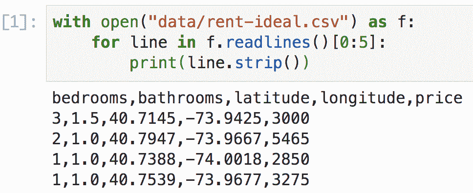
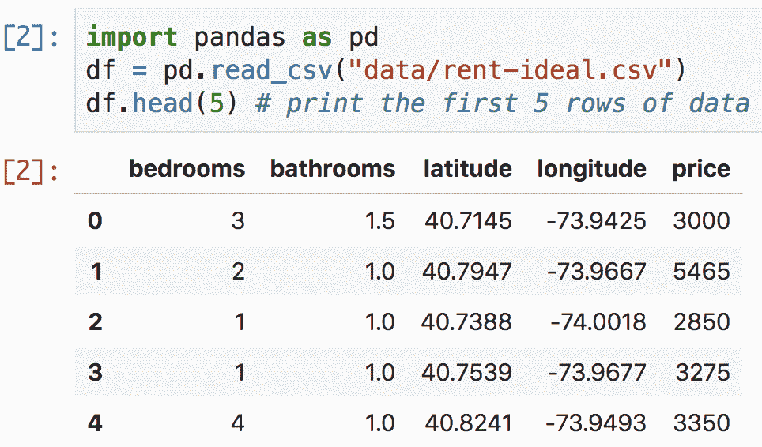
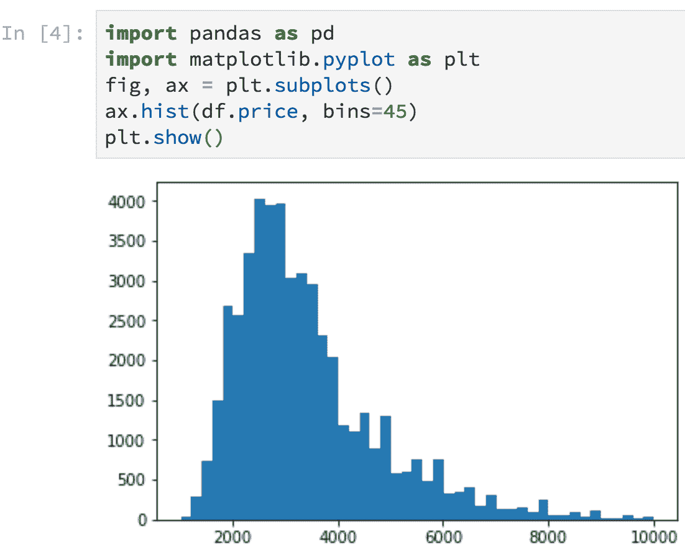
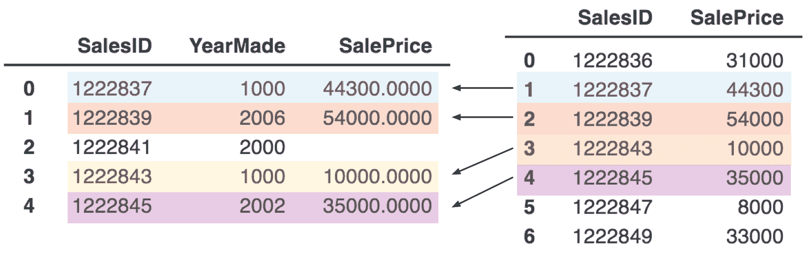

# 4 开发工具

> 原文：[`mlbook.explained.ai/tools.html`](https://mlbook.explained.ai/tools.html)

[Terence Parr](http://parrt.cs.usfca.edu) 和 [Jeremy Howard](http://www.fast.ai/about/#jeremy)

版权所有 © 2018-2019 Terence Parr。保留所有权利。

*请勿在网络上复制或以任何方式重新分发。*

本书由 markup+markdown+python+latex 源代码生成，使用 [Bookish](https://github.com/parrt/bookish)。

你可以通过访问此页面的注释版本来对页面进行**注释或标注**。你将看到现有的标注部分以黄色突出显示。它们是**公开可见的**。或者，你可以直接向 Terence 发送评论、建议或修正。

目录

+   你的机器学习开发环境

+   数据框道场

    +   加载数据并检查数据

    +   提取子集

    +   数据框索引

    +   数据框查询

    +   注入新的数据框列

    +   字符串和日期操作

    +   合并数据框

    +   以 feather 格式保存和加载数据

+   使用 matplotlib 生成绘图

+   使用 NumPy 表示和处理数据

在我们深入机器学习之前，让我们熟悉我们的主要开发工具。本书中的代码示例明确或隐式地使用了以下重要的库，这些库构成了使用 Python 进行结构化数据机器学习的核心：

+   [Pandas](https://pandas.pydata.org/)提供了我们用来存储训练和验证集的关键数据结构：数据框和序列（数据列）。

+   [NumPy](http://www.NumPy.org/)提供了一个高效的 n 维数组数据结构，被其他库使用。

+   [matplotlib](https://matplotlib.org/)提供了复杂的 2D 和 3D 绘图功能；Pandas 将绘图委托给 matplotlib。

+   [scikit-learn](http://scikit-learn.org/)，简称`sklearn`，包含机器学习模型、验证函数、错误度量以及广泛的数据处理功能。

在上一章中，我们尝试了使用 sklearn 来训练模型，因此在这一章中，我们将重点关注 pandas、NumPy 和 matplotlib 的基础知识。我们推荐的开发环境是[Jupyter Lab](http://jupyterlab.readthedocs.io/en/latest/getting_started/overview.html)，但你可以自由选择你感到舒适的环境。如果你急于开始构建模型，可以跳过这一章，但至少浏览这一章，了解在继续之前这些库能做什么。

## 4.1 你的机器学习开发环境

在过去的 30 年里，IDEs（集成开发环境）的发展取得了显著的进步，使得程序员的工作效率大大提高，例如 Intellij、Eclipse、VisualStudio 等。然而，它们的焦点在于创建和导航大型程序，这与我们的小型机器学习脚本正好相反。更重要的是，这些 IDEs 对交互式编程的支持很少甚至没有，但这正是我们在机器学习中需要有效利用的。虽然 Terence 和 Jeremy 是 IDEs 的强烈支持者，但在机器学习的特殊情况下，IDEs 的作用较小。

1 本书中看到的所有代码片段，即使是生成图形的代码，都可以在从本书生成的[notebooks](https://mlbook.explained.ai/notebooks/index.html)中找到。

相反，我们推荐[Jupyter Notebooks](https://jupyter-notebook.readthedocs.io/en/stable/notebook.html)，它们是基于网络的文档，具有嵌入的代码，类似于[literate programming](https://en.wikipedia.org/wiki/Literate_programming)，生成的输出与代码交织在一起。Notebooks 非常适合开发和演示。为了访问 notebooks，我们将使用最近引入的[Jupyter Lab](http://jupyterlab.readthedocs.io/en/latest/getting_started/overview.html)，因为它具有改进的用户界面。（在你阅读这本书的时候，它应该已经脱离测试阶段了。）让我们启动一个 notebook 来欣赏它与传统 IDE 之间的区别。

首先，让我们确保我们拥有 Jupyter Lab 的最新版本，通过在 Mac/Unix 命令行或 Windows“anaconda prompt”（从开始菜单搜索“anaconda prompt”）中运行以下命令：

```py
conda install -c conda-forge jupyterlab
```

`conda`程序是一个类似于常规 Python `pip`工具的打包系统，但它有一个优点，即它还可以安装非 Python 文件（例如，出于性能原因，科学包经常使用的 C/Fortran 代码。）

在启动 jupyter 之前，创建并跳转到可以保存这本书所有工作的目录是个好主意。例如，您可能需要执行以下命令序列（或与您的操作系统 GUI 等效）：

```py
cd /Users/YOURID 
mkdir mlbook
cd mlbook
```

在 Windows 上，您的用户目录是`C:\Users\YOURID`。

让我们在`/Users/YOURID/mlbook`下也创建一个数据目录，这样我们的笔记本就可以轻松访问数据文件：

```py
mkdir data
```

为了让我们有一些数据可以操作，请下载并解压[data/rent-ideal.csv.zip](https://mlbook.explained.ai/data/rent-ideal.csv.zip)文件到`/Users/YOURID/mlbook/data`目录。

通过在命令行中运行`jupyter lab`来启动提供界面的本地 Jupyter 网络服务器：

```py
$ jupyter lab
[I 11:27:00.606 LabApp] [jupyter_nbextensions_configurator] enabled 0.2.8
[I 11:27:00.613 LabApp] JupyterLab beta preview extension loaded from /Users/parrt/anaconda3/lib/python3.6/site-packages/jupyterlab
[I 11:27:00.613 LabApp] JupyterLab application directory is /Users/parrt/anaconda3/share/jupyter/lab
[W 11:27:00.616 LabApp] JupyterLab server extension not enabled, manually loading...
...
```


**图 4.1**. 初始 Jupyter Lab 屏幕

**图 4.2**. 创建 Python 3 笔记本后的 Jupyter Lab

运行该命令还应该打开一个看起来像 **图 4.1** 的浏览器窗口。该笔记本通过古老的 http 协议与 Jupyter Lab 服务器通信。在“笔记本”类别下点击“Python 3”图标，将创建并打开一个看起来像 **图 4.2** 的新笔记本窗口。将以下代码复制到空白的 *笔记本单元格* 中，并根据您的目录结构适当替换数据文件名（我们的设置中在 `mlbook/data` 子目录中有文件 `rent-ideal.csv`）。

```py
with open("data/rent-ideal.csv") as f:
    for line in f.readlines()[0:5]:
        print(line.strip())
```



**图 4.3**. 带有一个代码单元格和输出的 Jupyter Lab

在单元格中粘贴后，按 shift-enter 键（同时按住 shift 键然后按 enter），这将执行并显示类似于 **图 4.3** 的结果。当然，这也可以从通常的交互式 Python 命令行中工作：

```py
$ python
Python 3.6.6 |Anaconda custom (64-bit)| (default, Jun 28 2018, 11:07:29) 
[GCC 4.2.1 Compatible Clang 4.0.1 (tags/RELEASE_401/final)] on darwin
Type "help", "copyright", "credits" or "license" for more information.
>>> with open("data/rent-ideal.csv") as f:
...     for line in f.readlines()[0:5]:
...         print(line.strip())
... 
bedrooms,bathrooms,latitude,longitude,price
3,1.5,40.7145,-73.9425,3000
2,1.0,40.7947,-73.9667,5465
1,1.0,40.7388,-74.0018,2850
1,1.0,40.7539,-73.9677,3275
>>>
```

我们也可以将这段代码片段保存到一个名为 `dump.py` 的文件中并运行它，无论是从像 [PyCharm](https://www.jetbrains.com/pycharm/) 这样的 Python 开发环境内部，还是从命令行：

```py
$ python dump.py
bedrooms,bathrooms,latitude,longitude,price
3,1.5,40.7145,-73.9425,3000
2,1.0,40.7947,-73.9667,5465
1,1.0,40.7388,-74.0018,2850
1,1.0,40.7539,-73.9677,3275
```



**图 4.4**. Jupyter Lab 中的 pandas CSV 加载单元格

**图 4.5**. 包含图形输出的笔记本

笔记本相对于交互式 Python 命令行有一些很大的优势。因为 Python 命令行使用的是老式的终端，所以它的显示选项非常有限，而笔记本可以很好地显示表格，甚至可以内嵌图形。例如，**图 4.4** 展示了 pandas 数据框在 Jupyter Lab 中的样子。**图 4.5** 阐述了如何在代码后面立即生成租金价格的直方图。点击笔记本标签页上的“+”按钮以获取一个新的单元格（如果需要），粘贴以下代码，然后按 shift-enter。

```py
import pandas as pd
import matplotlib.pyplot as plt
df = pd.read_csv("data/rent-ideal.csv")
fig, ax = plt.subplots()
ax.hist(df.price, bins=45)
plt.show()
```

（我们将在下面学习更多关于加载数据框和创建图形的知识。）

Python 命令行也有一个缺点，那就是当我们退出 shell 时，我们输入的所有代码都会消失。笔记本也通过 Python 命令行（在 Jupyter Lab 的网络服务器中运行）执行代码，但笔记本本身是以 `.ipynb` 文件的形式存储在磁盘上的。终止与笔记本关联的 Python 进程不会影响或删除笔记本文件。不仅如此，当你重新启动笔记本时，上一次运行期间捕获的所有输出都会缓存在笔记本文件中，并在 Jupyter Lab 启动时立即显示。

使用传统的 Python `.py` 文件进行编程意味着当 Python 退出时，我们不会丢失我们的工作，但我们失去了交互式编程。由于其迭代性，创建和测试机器学习模型在很大程度上依赖于交互式编程以执行大量的小实验。如果仅加载数据就需要，比如说，5 分钟，我们就不能为每个实验重新启动整个程序。我们需要快速迭代的能力。使用 IDE 内的 Python 调试器确实可以让我们检查程序每个步骤的结果，但编程部分不是交互式的；在做出更改后，我们必须重新启动整个程序。

笔记本结合了 Python 壳的交互式重要性和文件的持久性。因为笔记本将图形和其他输出保留在包含代码的文档中，所以很容易看到程序正在做什么。这对于展示结果或继续他人的工作特别有用。当然，您可以使用您觉得舒适的任何开发环境，但我们强烈推荐 Jupyter 笔记本。如果您遵循这个建议，查看一些 Jupyter 教程和视频是个好主意，以便熟悉您的工具。

## 4.2 数据分析道场

在我们可以使用 sklearn 中的机器学习模型之前，我们必须加载和准备数据，我们将使用 pandas 来完成这项工作。我们建议您获取 Wes McKinney 的书籍《Python for Data Analysis》的副本，但本节涵盖了 pandas 功能的关键子集，以便您开始。（您也可以查看 McKinney 书籍中的 [notebooks](https://github.com/wesm/pydata-book)。）这里的目的是让您从基础知识开始，以便您能够理解本书中的示例，并且可以通过 stackoverflow 和其他资源自行学习更多。

### 4.2.1 加载数据和检查

机器学习流程的第一步是加载感兴趣的数据。在许多情况下，数据存储在逗号分隔值（CSV）文件中，pandas 提供了一个快速灵活的 CSV 读取器：

```py
import pandas as pd   # import the library and give a short alias: pd
df = pd.read_csv("data/rent-ideal.csv")
df.head()
```

|   | 卧室 | 卫生间 | 纬度 | 经度 | 价格 |
| --- | --- | --- | --- | --- | --- |
|  |
| --- |
| 0 | 3 | 1.5000 | 40.7145 | -73.9425 | 3000 |
| 1 | 2 | 1.0000 | 40.7947 | -73.9667 | 5465 |
| 2 | 1 | 1.0000 | 40.7388 | -74.0018 | 2850 |
| 3 | 1 | 1.0000 | 40.7539 | -73.9677 | 3275 |
| 4 | 4 | 1.0000 | 40.8241 | -73.9493 | 3350 |

`head()` 方法显示数据框中的前五条记录，但我们可以传递一个参数来指定记录数。具有许多列的数据集通常太宽，无法在屏幕上滚动查看，我们可以通过使用 `T` 属性翻转数据框来解决这个问题：

```py
df.head(2).T
```

|   | 0 | 1 |
| --- | --- | --- |
|  |
| --- |
| 卧室 | 3.0000 | 2.0000 |
| 卫生间 | 1.5000 | 1.0000 |
| 纬度 | 40.7145 | 40.7947 |
| 经度 | -73.9425 | -73.9667 |
| 价格 | 3000.0000 | 5465.0000 |

以这种方式，列变成了行，宽数据框变成了高数据框。要获取数据框的元信息，使用方法 `info()`：

```py
df.info()

```

<class 'pandas.core.frame.DataFrame'> 范围索引：48300 个条目，0 到 48299 数据列（总计 5 列）：卧室 48300 个非空 int64 卫生间 48300 个非空 float64 纬度 48300 个非空 float64 经度 48300 个非空 float64 价格 48300 个非空 int64 数据类型：float64（3），int64（2）内存使用：1.8 MB

获取列名列表通常很有用，我们可以通过数据框属性轻松实现：

```py
print(df.columns)
```

索引(['卧室', '卫生间', '纬度', '经度', '价格'], 数据类型='object')

要了解数据本身的一些信息，请使用 `describe()`：

```py
df.describe()
```

|   | 卧室 | 卫生间 | 纬度 | 经度 | 价格 |
| --- | --- | --- | --- | --- | --- |
|  |
| --- |
| 计数 | 48300.0000 | 48300.0000 | 48300.0000 | 48300.0000 | 48300.0000 |
| 平均值 | 1.5088 | 1.1783 | 40.7508 | -73.9724 | 3438.2980 |
| 标准差 | 1.0922 | 0.4261 | 0.0396 | 0.0296 | 1401.4222 |
| 最小值 | 0.0000 | 0.0000 | 40.5712 | -74.0940 | 1025.0000 |
| 25% | 1.0000 | 1.0000 | 40.7281 | -73.9917 | 2495.0000 |
| 50% | 1.0000 | 1.0000 | 40.7516 | -73.9779 | 3100.0000 |
| 75% | 2.0000 | 1.0000 | 40.7740 | -73.9547 | 4000.0000 |
| 最大值 | 8.0000 | 10.0000 | 40.9154 | -73.7001 | 9999.0000 |

也有方法可以提供该信息的子集，例如每列的平均值：

```py
print(df.mean())
```

卧室 1.508799 卫生间 1.178313 纬度 40.750782 经度 -73.972365 价格 3438.297950 数据类型：float64

要获取具有特定数量卧室的公寓数量，请使用 `value_counts()` 方法：

```py
print(df.bedrooms.value_counts())
```

1 15718 2 14451 0 9436 3 6777 4 1710 5 169 6 36 8 2 7 1 名称：卧室，数据类型：int64

我们还可以轻松按特定列对数据框进行排序：

```py
df.sort_values('price', ascending=False).head()
```

|   | 卧室 | 卫生间 | 纬度 | 经度 | 价格 |
| --- | --- | --- | --- | --- | --- |
|  |
| --- |
| 47540 | 6 | 3.0000 | 40.7287 | -73.9856 | 9999 |
| 27927 | 3 | 3.0000 | 40.7934 | -73.9743 | 9999 |
| 17956 | 6 | 3.0000 | 40.7287 | -73.9856 | 9999 |
| 2282 | 3 | 2.0000 | 40.7802 | -73.9565 | 9995 |
| 16122 | 5 | 2.5000 | 40.7103 | -74.0060 | 9995 |

### 4.2.2 提取子集

准备数据用于模型通常意味着提取子集，例如列的子集或行的子集。在 pandas 中，获取单个数据列特别方便，因为每个列看起来都像一个数据框对象属性。例如，以下是如何从数据框 `df` 中提取 `price` 列作为 `Series` 对象：

```py
print(type(df.price))
print(df.price.head(5))
```

<class 'pandas.core.series.Series'> 0 3000 1 5465 2 2850 3 3275 4 3350 名称：价格，数据类型：int64

`df.price` 等同于稍微冗长的 `df['price']`，但 `df.price` 在尝试创建新列时不能用于赋值操作左侧（见**第 4.2.5 节** *注入新的数据框列*）。

一旦我们有一个序列，就有很多有用的函数可以调用，例如以下这些。

```py
prices = df.price
print(prices.min(), prices.mean(), prices.max())

```

1025 3438.297950310559 9999

If we need more than one column, we can get a dataframe with a subset of the columns (not a list of `Series` objects):

```py
bedprice = df[['bathrooms','price']]
print(type(bedprice))
bedprice.head()
```

<class 'pandas.core.frame.DataFrame'>

|   | 卫生间 | 价格 |
| --- | --- | --- |
|  |
| --- |
| 0 | 1.5000 | 3000 |
| 1 | 1.0000 | 5465 |
| 2 | 1.0000 | 2850 |
| 3 | 1.0000 | 3275 |
| 4 | 1.0000 | 3350 |

Data sets typically consist of multiple columns of features and a single column representing the target variable. To separate these for use in training our model, we can explicitly select all future columns or use `drop()`:

```py
X = df.drop('price', axis=1) # get all but price column
y = df['price']
X.head(3)
```

|   | 卧室 | 卫生间 | 纬度 | 经度 |
| --- | --- | --- | --- | --- |
|  |
| --- |
| 0 | 3 | 1.5000 | 40.7145 | -73.9425 |
| 1 | 2 | 1.0000 | 40.7947 | -73.9667 |
| 2 | 1 | 1.0000 | 40.7388 | -74.0018 |

The `axis=1` bit is a little inconvenient but it specifies we'd like to drop a column and not a row (`axis=0`). The `drop()` method does not alter the dataframe; instead it returns a view of the dataframe without the indicated column.

Getting a specific row or a subset of the rows by row number involves using the `iloc` dataframe property. For example, here's how to get the first row of the dataframe as a `Series` object:

```py
print(type(df.iloc[0]))
print(df.iloc[0])
```

<class 'pandas.core.series.Series'> 卧室 3.0000 卫生间 1.5000 纬度 40.7145 经度 -73.9425 价格 3000.0000 名称: 0, 数据类型: float64

and here's how to get the first two rows as a dataframe:

```py
df.iloc[0:2]
```

|   | 卧室 | 卫生间 | 纬度 | 经度 | 价格 |
| --- | --- | --- | --- | --- | --- |
|  |
| --- |
| 0 | 3 | 1.5000 | 40.7145 | -73.9425 | 3000 |
| 1 | 2 | 1.0000 | 40.7947 | -73.9667 | 5465 |

Those `iloc` accessors implicitly get all columns, but we can be more explicit with the `:` slice operator as the second dimension:

```py
print(df.iloc[0,:])
```

卧室 3.0000 卫生间 1.5000 纬度 40.7145 经度 -73.9425 价格 3000.0000 名称: 0, 数据类型: float64

Or, we can use a list of integer indexes to get specific columns:

```py
print(df.iloc[0,[0,4]])
```

卧室 3.0 价格 3000.0 名称: 0, 数据类型: float64

Generally, though, it's easier to access columns by name by using `iloc` to get the row of interest and then using dataframe column indexing by name:

```py
print(df.iloc[0][['bedrooms','price']])
```

卧室 3.0 价格 3000.0 名称: 0, 数据类型: float64

### 4.2.3 数据框索引

Data frames have indexes that make them behave like dictionaries, where a key maps to one or more rows of a dataframe. By default, the index is the row number, as shown here as the leftmost column:

```py
df.head(3)
```

|   | 卧室 | 卫生间 | 纬度 | 经度 | 价格 |
| --- | --- | --- | --- | --- | --- |
|  |
| --- |
| 0 | 3 | 1.5000 | 40.7145 | -73.9425 | 3000 |
| 1 | 2 | 1.0000 | 40.7947 | -73.9667 | 5465 |
| 2 | 1 | 1.0000 | 40.7388 | -74.0018 | 2850 |

The `loc` property performs an index lookup so `df.loc[0]` gets the row with key 0 (the first row):

```py
print(df.loc[0])

```

卧室 3.0000 卫生间 1.5000 纬度 40.7145 经度 -73.9425 价格 3000.0000 名称: 0, 数据类型: float64

Because the index is the row number by default, `iloc` and `loc` give the same result. But we can set index to a column in our dataframe:

```py
dfi = df.set_index('bedrooms') # set_index() returns new view of df
dfi.head()
```

|   | 卫生间 | 纬度 | 经度 | 价格 |
| --- | --- | --- | --- | --- |
| 卧室 |
| --- |
| 3 | 1.5000 | 40.7145 | -73.9425 | 3000 |
| 2 | 1.0000 | 40.7947 | -73.9667 | 5465 |
| 1 | 1.0000 | 40.7388 | -74.0018 | 2850 |
| 1 | 1.0000 | 40.7539 | -73.9677 | 3275 |
| 4 | 1.0000 | 40.8241 | -73.9493 | 3350 |

使用索引，我们可以获取所有 3 卧室公寓：

```py
dfi.loc[3].head()
```

|   | 卫生间 | 纬度 | 经度 | 价格 |
| --- | --- | --- | --- | --- |
| 卧室 |
| --- |
| 3 | 1.5000 | 40.7145 | -73.9425 | 3000 |
| 3 | 1.0000 | 40.7454 | -73.9845 | 4395 |
| 3 | 1.0000 | 40.7231 | -74.0044 | 3733 |
| 3 | 1.0000 | 40.7660 | -73.9914 | 4500 |
| 3 | 2.0000 | 40.7196 | -74.0109 | 6320 |

现在索引与默认行号索引不同，`dfi.loc[3]`和`dfi.iloc[3]`不再获取相同的数据；`dfi.iloc[3]`获取第 4 行（从 0 开始索引）。

将数据框索引设置为“卧室”列意味着“卧室”不再作为列可用，这虽然不方便，但需要注意的一个特性：`dfi['bedrooms']`会得到错误`KeyError: 'bedrooms'`。通过重置索引，`bedrooms`将重新作为列出现，默认行号索引也将重新出现：

```py
dfi = dfi.reset_index() # overcome quirk in Pandas
dfi.head(3)
```

|   | 卧室 | 卫生间 | 纬度 | 经度 | 价格 |
| --- | --- | --- | --- | --- | --- |
|  |
| --- |
| 0 | 3 | 1.5000 | 40.7145 | -73.9425 | 3000 |
| 1 | 2 | 1.0000 | 40.7947 | -73.9667 | 5465 |
| 2 | 1 | 1.0000 | 40.7388 | -74.0018 | 2850 |

在尝试组织或减少数据框中的数据时，会出现索引。例如，按特定列中的值对行进行分组，则该列成为索引。以下是按浴室数量分组数据并计算其他列平均值的示例：

```py
bybaths = df.groupby(['bathrooms']).mean()
bybaths
```

|   | 卧室 | 纬度 | 经度 | 价格 |
| --- | --- | --- | --- | --- |
| 卫生间 |
| --- |
| 0.0000 | 0.8300 | 40.7561 | -73.9701 | 3144.8700 |
| 1.0000 | 1.2522 | 40.7509 | -73.9720 | 3027.0071 |
| 1.5000 | 2.2773 | 40.7489 | -73.9659 | 4226.3364 |
| 2.0000 | 2.6874 | 40.7495 | -73.9756 | 5278.5957 |
| 2.5000 | 2.8632 | 40.7562 | -73.9651 | 6869.0474 |
| 3.0000 | 3.2966 | 40.7597 | -73.9676 | 6897.9746 |
| 3.5000 | 3.8571 | 40.7487 | -73.9548 | 7635.3571 |
| 4.0000 | 4.6222 | 40.7563 | -73.9563 | 7422.8889 |
| 4.5000 | 1.0000 | 40.8572 | -73.9350 | 2050.0000 |
| 10.0000 | 2.0000 | 40.7633 | -73.9849 | 3600.0000 |

如果我们想要一个包含“卫生间”作为列的数据框，我们必须重置索引。无法访问`bybaths[['bathrooms','price']]`，必须先重置：

```py
bybaths = bybaths.reset_index() # overcome quirk in Pandas
bybaths
```

|   | 卫生间 | 卧室 | 纬度 | 经度 | 价格 |
| --- | --- | --- | --- | --- | --- |
|  |
| --- |
| 0 | 0.0000 | 0.8300 | 40.7561 | -73.9701 | 3144.8700 |
| 1 | 1.0000 | 1.2522 | 40.7509 | -73.9720 | 3027.0071 |
| 2 | 1.5000 | 2.2773 | 40.7489 | -73.9659 | 4226.3364 |
| 3 | 2.0000 | 2.6874 | 40.7495 | -73.9756 | 5278.5957 |
| 4 | 2.5000 | 2.8632 | 40.7562 | -73.9651 | 6869.0474 |
| 5 | 3.0000 | 3.2966 | 40.7597 | -73.9676 | 6897.9746 |
| 6 | 3.5000 | 3.8571 | 40.7487 | -73.9548 | 7635.3571 |
| 7 | 4.0000 | 4.6222 | 40.7563 | -73.9563 | 7422.8889 |
| 8 | 4.5000 | 1.0000 | 40.8572 | -73.9350 | 2050.0000 |
| 9 | 10.0000 | 2.0000 | 40.7633 | -73.9849 | 3600.0000 |

然后我们可以访问感兴趣的列：

```py
bybaths[['bathrooms','price']]
```

|   | 卫生间 | 价格 |
| --- | --- | --- | --- | --- | --- |
|  |
| --- |
| 0 | 0.0000 | 3144.8700 |
| 1 | 1.0000 | 3027.0071 |
| 2 | 1.5000 | 4226.3364 |
| 3 | 2.0000 | 5278.5957 |
| 4 | 2.5000 | 6869.0474 |
| 5 | 3.0000 | 6897.9746 |
| 6 | 3.5000 | 7635.3571 |
| 7 | 4.0000 | 7422.8889 |
| 8 | 4.5000 | 2050.0000 |
| 9 | 10.0000 | 3600.0000 |

(注意，没有浴室的公寓的平均价格是 $3145。哇。评估 `len(df[df.bathrooms==0])` 告诉我们，有 300 套没有浴室的公寓！)

通过索引访问数据帧行本质上是在执行一个查询，以匹配特定值的索引键的所有行，但我们可以执行更复杂的查询。

### 4.2.4 数据帧查询

Pandas 数据帧有点像组合电子表格和数据库表，本节说明了我们将用于清理数据集的一些基本查询。

机器学习模型通常不接受缺失值，因此我们需要处理数据集中的任何缺失值。`isnull()` 方法是一个内置查询，它对序列中的每个缺失元素返回真：

```py
print(df.price.isnull().head(3))
```

0 False 1 False 2 False 名称：价格，数据类型：布尔值

或者甚至整个数据帧：

```py
df.isnull().head(3)
```

|   | 卧室 | 卫生间 | 纬度 | 经度 | 价格 |
| --- | --- | --- | --- | --- | --- |
|  |
| --- |
| 0 | False | False | False | False | False |
| 1 | False | False | False | False | False |
| 2 | False | False | False | False | False |

当然，我们真正关心的是是否有任何值缺失，`any()` 如果序列或数据帧中至少有一个真值，则返回真：

```py
print(df.isnull().any())
```

卧室 False 卫生间 False 纬度 False 经度 False 价格 False 数据类型：布尔值

就像数据库的 `WHERE` 子句一样，pandas 支持丰富的条件表达式来筛选感兴趣的数据。查询返回一系列真和假，根据条件表达式的结果：

```py
print((df.price>3000).head())
```

0 False 1 True 2 False 3 True 4 True 名称：价格，数据类型：布尔值

然后，布尔序列可以用作数据帧的索引，数据帧将返回与真值关联的行。例如，以下是如何获取所有价格超过 $3000 的行：

```py
df[df.price>3000].head(3)
```

|   | 卧室 | 卫生间 | 纬度 | 经度 | 价格 |
| --- | --- | --- | --- | --- | --- |
|  |
| --- |
| 1 | 2 | 1.0000 | 40.7947 | -73.9667 | 5465 |
| 3 | 1 | 1.0000 | 40.7539 | -73.9677 | 3275 |
| 4 | 4 | 1.0000 | 40.8241 | -73.9493 | 3350 |

要查找范围内的价格，我们需要两个比较运算符：

```py
df[(df.price>1000) & (df.price<3000)].head(3)
```

|   | 卧室 | 卫生间 | 纬度 | 经度 | 价格 |
| --- | --- | --- | --- | --- | --- |
|  |
| --- |
| 2 | 1 | 1.0000 | 40.7388 | -74.0018 | 2850 |
| 8 | 1 | 1.0000 | 40.8234 | -73.9457 | 1725 |
| 10 | 0 | 1.0000 | 40.7769 | -73.9467 | 1950 |

注意，比较子表达式周围需要括号来覆盖`&`运算符的高优先级。（如果没有括号，Python 将尝试评估`1000 & df.price`。）

复合查询可以引用多个列。例如，以下是获取至少有两间卧室且价格低于$3000 的所有公寓的方法：

```py
df[(df.bedrooms>=2) & (df.price<3000)].head(3)
```

|   | 卧室 | 卫生间 | 纬度 | 经度 | 价格 |
| --- | --- | --- | --- | --- |
|  |
| --- |
| 21 | 2 | 1.0000 | 40.7427 | -73.9794 | 2999 |
| 34 | 2 | 1.0000 | 40.8440 | -73.9404 | 2300 |
| 54 | 2 | 2.0000 | 40.7059 | -73.8339 | 2100 |

### 4.2.5 注入新的数据框列

在使用查询选择特征（列）并清理数据集后，数据科学家通常会创建新的数据列以改善模型性能。使用 pandas 创建新列很容易，只需为新列名赋值。以下是复制原始`df`并然后在新的数据框中创建一列全零的方法：

```py
df_aug = df.copy()
df_aug['junk'] = 0
df_aug.head(3)
```

|   | 卧室 | 卫生间 | 纬度 | 经度 | 价格 | 废物 |
| --- | --- | --- | --- | --- | --- |
|  |
| --- |
| 0 | 3 | 1.5000 | 40.7145 | -73.9425 | 3000 | 0 |
| 1 | 2 | 1.0000 | 40.7947 | -73.9667 | 5465 | 0 |
| 2 | 1 | 1.0000 | 40.7388 | -74.0018 | 2850 | 0 |

那个例子只是展示了基本机制；我们很少会找到设置零列是有用的。另一方面，我们可能想要一列随机数来查看它如何影响模型性能。以下是使用 NumPy 数组中的随机数覆盖`junk`列的方法：

```py
import numpy as np
df_aug['junk'] = np.random.random(size=len(df_aug))
df_aug.head(3)
```

|   | 卧室 | 卫生间 | 纬度 | 经度 | 价格 | 废物 |
| --- | --- | --- | --- | --- | --- | --- |
|  |
| --- |
| 0 | 3 | 1.5000 | 40.7145 | -73.9425 | 3000 | 0.7624 |
| 1 | 2 | 1.0000 | 40.7947 | -73.9667 | 5465 | 0.9703 |
| 2 | 1 | 1.0000 | 40.7388 | -74.0018 | 2850 | 0.0397 |

在向数据框子集注入新列时有一个警告。当向整个数据框，例如`df`，注入新列时没有问题，只要`df`不是子集（有时称为视图）。例如，在下面的代码中，`bedsprices`是原始`df`的子集；pandas 返回的是数据视图而不是低效地创建副本。

```py
bedsprices = df[['bedrooms','price']] # a view or a copy of df?
bedsprices['beds_to_price_ratio'] = bedsprices.bedrooms / bedsprices.price
```

尝试注入新列会导致 pandas 发出警告：

```py
A value is trying to be set on a copy of a slice from a DataFrame.
Try using .loc[row_indexer,col_indexer] = value instead
```

实际上，pandas 不知道我们是否打算修改原始`df`或将`bedsprices`变成副本并修改它但不是`df`。最安全的途径是明确地创建副本：

```py
bedsprices = df[['bedrooms','price']].copy() # make a copy of 2 cols of df
bedsprices['price_to_beds_ratio'] = bedsprices.price / bedsprices.bedrooms
bedsprices.head(3)
```

|   | 卧室 | 价格 | 价格与卧室比率 |
| --- | --- | --- | --- |
|  |
| --- |
| 0 | 3 | 3000 | 1000.0000 |
| 1 | 2 | 5465 | 2732.5000 |
| 2 | 1 | 2850 | 2850.0000 |

有关更多详细信息，请参阅 pandas 文档中的[返回视图与副本](https://pandas.pydata.org/pandas-docs/version/0.20/indexing.html#indexing-view-versus-copy)。

### 4.2.6 字符串和日期操作

DataFrame 有字符串和日期相关的函数，这在派生新列或清理现有列时非常有用。为了演示这些功能，我们需要一个包含更多列的数据集，因此请下载并解压 [rent.csv.zip](https://mlbook.explained.ai/data/rent.csv.zip) 到您的 `mlbook/data` 目录。然后使用 `read_csv` 读取 `rent.csv` 文件并显示五列：

```py
df_raw = pd.read_csv("data/rent.csv", parse_dates=['created'])
df_rent = df_raw[['created','features','bedrooms','bathrooms','price']]
df_rent.head()
```

|   | created | features | bedrooms | bathrooms | price |
| --- | --- | --- | --- | --- | --- |
|  |
| --- |
| 0 | 2016-06-24 07:54:24 | [] | 3 | 1.5000 | 3000 |
| 1 | 2016-06-12 12:19:27 | ['Doorman', 'Elevator', '... | 2 | 1.0000 | 5465 |
| 2 | 2016-04-17 03:26:41 | ['Laundry In Building', '... | 1 | 1.0000 | 2850 |
| 3 | 2016-04-18 02:22:02 | ['Hardwood Floors', 'No F... | 1 | 1.0000 | 3275 |
| 4 | 2016-04-28 01:32:41 | ['Pre-War'] | 4 | 1.0000 | 3350 |

`parse_dates` 参数确保 `created` 列被解析为日期而不是字符串。`features` 列是一个字符串列（pandas 将其标记为 `object` 类型），其值是逗号分隔的、用方括号括起来的特征列表，就像 Python 显示字符串列表的方式一样。以下是 `rent.csv` 中所有列的类型信息：

```py
df_rent.info()

```

<class 'pandas.core.frame.DataFrame'> RangeIndex: 49352 entries, 0 to 49351 Data columns (total 5 columns): created 49352 non-null datetime64[ns] features 49352 non-null object bedrooms 49352 non-null int64 bathrooms 49352 non-null float64 price 49352 non-null int64 dtypes: datetime64ns, float64(1), int64(2), object(1) memory usage: 1.9+ MB

字符串相关的方法可以通过 *series*`.str.`*method*`()` 获取；`str` 对象只是将方法分组。例如，将字符串类型的特征进行归一化处理是个好主意，这样 `doorman` 和 `Doorman` 就会被视为同一个单词：

```py
df_aug = df_rent.copy()  # alter a copy of dataframe
df_aug['features'] = df_aug['features'].str.lower() # normalize to lower case
df_aug.head()
```

|   | created | features | bedrooms | bathrooms | price |
| --- | --- | --- | --- | --- | --- |
|  |
| --- |
| 0 | 2016-06-24 07:54:24 | [] | 3 | 1.5000 | 3000 |
| 1 | 2016-06-12 12:19:27 | ['doorman', 'elevator', '... | 2 | 1.0000 | 5465 |
| 2 | 2016-04-17 03:26:41 | ['laundry in building', '... | 1 | 1.0000 | 2850 |
| 3 | 2016-04-18 02:22:02 | ['hardwood floors', 'no f... | 1 | 1.0000 | 3275 |
| 4 | 2016-04-28 01:32:41 | ['pre-war'] | 4 | 1.0000 | 3350 |

作为归一化过程的一部分，将任何缺失值替换为空格，以及将任何空的 `features` 列值 `[]` 替换为空格是个好主意：

```py
df_aug['features'] = df_aug['features'].fillna('') # fill missing w/blanks
df_aug['features'] = df_aug['features'].replace('[]','') # fill empty w/blanks
df_aug.head()
```

|   | created | features | bedrooms | bathrooms | price |
| --- | --- | --- | --- | --- | --- |
|  |
| --- |
| 0 | 2016-06-24 07:54:24 |  | 3 | 1.5000 | 3000 |
| 1 | 2016-06-12 12:19:27 | ['doorman', 'elevator', '... | 2 | 1.0000 | 5465 |
| 2 | 2016-04-17 03:26:41 | ['laundry in building', '... | 1 | 1.0000 | 2850 |
| 3 | 2016-04-18 02:22:02 | ['hardwood floors', 'no f... | 1 | 1.0000 | 3275 |
| 4 | 2016-04-28 01:32:41 | ['pre-war'] | 4 | 1.0000 | 3350 |

Pandas 使用 "非数字"，NumPy 的 `np.nan` 作为不可用值的占位符，即使是对于非数字字符串和日期列。因为 `np.nan` 是一个浮点数，缺失的整数会将整个列的类型转换为 `float`。有关更多详细信息，请参阅 [处理缺失数据](https://pandas.pydata.org/pandas-docs/stable/missing_data.html)。

查看特征列中的字符串值，有很多信息可能会提高模型的表现。通常模型无法自动提取有用的特征，因此我们需要帮助它们。以下代码创建了两个新列，表示公寓是否有门卫或洗衣（`"laundry|washer"` 是一个正则表达式，如果存在洗衣或洗衣机，则匹配）。

```py
df_aug['doorman'] = df_aug['features'].str.contains("doorman")
df_aug['laundry'] = df_aug['features'].str.contains("laundry|washer")
df_aug.head()
```

|   | created | features | bedrooms | bathrooms | price | doorman | laundry |
| --- | --- | --- | --- | --- | --- | --- | --- |
|  |
| --- |
| 0 | 2016-06-24 07:54:24 |  | 3 | 1.5000 | 3000 | False | False |
| 1 | 2016-06-12 12:19:27 | ['门卫', '电梯', '... | 2 | 1.0000 | 5465 | True | False |
| 2 | 2016-04-17 03:26:41 | ['building 内的洗衣', '... | 1 | 1.0000 | 2850 | False | True |
| 3 | 2016-04-18 02:22:02 | ['硬木地板', '无烟... | 1 | 1.0000 | 3275 | False | False |
| 4 | 2016-04-28 01:32:41 | ['pre-war'] | 4 | 1.0000 | 3350 | False | False |

最终，模型只能使用数值或布尔数据列，因此这些转换非常常见。一旦我们从原始字符串列中提取了所有有用的信息，我们通常会删除该 `features` 列。

有时，我们不是创建新列，而是将字符串列转换为数值列。例如，`rent.csv` 数据集中的 `interest_level` 列是三个字符串之一（低、中等和高）：

```py
df_aug = df_raw[['created','interest_level']].copy()
print(f"type of interest_level is {df_aug.interest_level.dtype}")
df_aug.head()
```

interest_level 的类型是 object

|   | created | interest_level |
| --- | --- | --- |
|  |
| --- |
| 0 | 2016-06-24 07:54:24 | 中等 |
| 1 | 2016-06-12 12:19:27 | 低 |
| 2 | 2016-04-17 03:26:41 | 高 |
| 3 | 2016-04-18 02:22:02 | 低 |
| 4 | 2016-04-28 01:32:41 | 低 |

将其转换为数值列的一个简单方法是将每个字符串映射到一个唯一的值：

```py
m = {'low':1,'medium':2,'high':3}
df_aug['interest_level'] = df_aug['interest_level'].map(m)
print(f"type of interest_level is {df_aug.interest_level.dtype}")
df_aug.head()
```

interest_level 的类型是 int64

|   | created | interest_level |
| --- | --- | --- |
|  |
| --- |
| 0 | 2016-06-24 07:54:24 | 2 |
| 1 | 2016-06-12 12:19:27 | 1 |
| 2 | 2016-04-17 03:26:41 | 3 |
| 3 | 2016-04-18 02:22:02 | 1 |
| 4 | 2016-04-28 01:32:41 | 1 |

对于大型数据集，有时将数值减少到可以包含所有值的最小实体是有用的。在这种情况下，`interest_level` 值可以轻松地适应一个字节（8 位），这意味着如果我们将列从 `int64` 转换为 `int8`，我们可以节省大量空间：

```py
df_aug['interest_level'] = df_aug['interest_level'].astype('int8')
print(f"type of interest_level is {df_aug.interest_level.dtype}")

```

interest_level 的类型是 int8

| `df_prices`:

```py
df_aug['dayofweek'] = df_aug['created'].dt.dayofweek  # add dow column
df_aug['day'] = df_aug['created'].dt.day
df_aug['month'] = df_aug['created'].dt.month
df_aug[['created','dayofweek','day','month']].head()
```

|   | created | dayofweek | day | month |
| --- | --- | --- | --- | --- |
| 想象我们有一个包含大量销售交易特征的 `df_sales` 数据框，但为了讨论的目的，我们将其简化为只有两列。我们面临的问题是价格信息在另一个数据框中，可能是因为我们从不同的来源提取了数据。这两个数据框看起来如下所示。 |
|   | --- | --- | --- |
| 0 | 1222837 | 1000 |  |
| 0 | 2016-06-24 07:54:24 | 4 | 24 | 6 |
|   | SalesID | YearMade |  |
| 1 | 2016-06-12 12:19:27 | 6 | 12 | 6 |
| 2 | 1222839 | 54000 |  |
|   | --- | --- | --- |

|

### | 6 | 1222849 | 33000 |  |

| 2 | 2016-04-17 03:26:41 | 6 | 17 | 4 |

| 0 | 1222836 | 31000 |  |

| 4 | 1222845 | 35000 |  |

| 3 | 1222843 | 10000 |  |

|

|

| 2 | 1222841 | 2000 |  |

类似于字符串列，模型不能直接使用日期列，但我们可以将日期分解成多个组成部分，并从中提取关于该日期的新信息。例如，想象训练一个预测杂货店销售的模型。星期几，甚至月份的某一天，可能对销售有预测作用。人们通常在周六和周日购物比工作日多，也许在每月发薪日购物更多。也许在像十二月（圣诞节期间）这样的月份会有更多的销售。Pandas 提供了方便的方法，分组在属性 `dt` 中，用于提取各种日期属性，我们可以使用这些属性来推导新的模型特征：

一旦我们提取了所有有用的数值数据，我们就会在数据集上训练模型之前删除列 `created`。

|   | SalesID | SalePrice |  |

|

|

4.2.7 合并数据框

|   | SalesID | YearMade | SalePrice |

| `df_sales`

| 4 | 2016-04-28 01:32:41 | 3 | 28 | 4 |

左数据框中任何没有在右数据框中对应记录的记录都会得到 `np.NaN`（不是一个数字）来表示缺失条目。

| 1 | 1222839 | 2006 |  |

我们的目标是在 `df_sales` 中创建一个新的列，其中包含每个记录的适当 `SalePrice`。为此，我们需要一个在两个表中都通用的键，在这个例子中是 `SalesID`。例如，`df_sales` 中 `SalesID` 为 1222843 的记录应该获得一个新的 `SalesPrice` 条目为 10000。在数据库术语中，我们需要一个 *左连接*，它保留左数据框中的所有记录，并忽略右数据框中不匹配的 `SalesID` 记录：

在 Python 中，合并操作看起来如下：

| 3 | 2016-04-18 02:22:02 | 0 | 18 | 4 |

|

| --- | --- | --- | --- | --- |

|

| 1 | 1222837 | 44300 |  |



| 5 | 1222847 | 8000 |  |

| 3 | 1222843 | 1000 |  |

```py
df_merged = df_sales.merge(df_prices, on='SalesID', how='left') # merge in prices
df_merged
```

| 4 | 1222845 | 2002 |  |
| --- | --- | --- | --- |
|  |
| --- |
| 0 | 1222837 | 1000 | 44300.0000 |
| 1 | 1222839 | 2006 | 54000.0000 |
| 2 | 1222841 | 2000 |  |
| 3 | 1222843 | 1000 | 10000.0000 |
| 4 | 1222845 | 2002 | 35000.0000 |

有时当我们看到 *右连接* 时，左连接会更有意义。右连接保留右数据框中的所有记录，对于不匹配的键使用 `np.NaN` 填充记录值：

```py
df_merged = df_sales.merge(df_prices, on='SalesID', how='right')
df_merged.sort_values('SalesID')
```

|   | 销售 ID | 制造年份 | 销售价格 |
| --- | --- | --- | --- |
|  |
| --- |
| 4 | 1222836 |  | 31000 |
| 0 | 1222837 | 1000.0000 | 44300 |
| 1 | 1222839 | 2006.0000 | 54000 |
| 2 | 1222843 | 1000.0000 | 10000 |
| 3 | 1222845 | 2002.0000 | 35000 |
| 5 | 1222847 |  | 8000 |
| 6 | 1222849 |  | 33000 |

### 4.2.8 以 feather 格式保存和加载数据

数据文件通常是 CSV 格式，因为它是一种通用格式，可以被任何编程语言读取。但是，将 CSV 文件加载到数据框中并不高效，这在机器学习模型高度迭代的开发过程中是一个问题。pandas 的作者 Wes McKinney 和知名统计学家、R 语言程序员 Hadley Wickham 最近开发了一种名为 [feather](https://github.com/wesm/feather) 的新格式，它比 CSV 文件加载大型数据文件要快得多。给定一个数据框，以下是将其保存为 feather 文件并读取回来的方法：

```py
df.to_feather("data/data.feather")        # save df as feather file
df = pd.read_feather("data/data.feather") # read it back
```

我们进行了一个快速实验，模仿 McKinney 和 Wickham 在他们 2016 年的 [原始博客文章](https://blog.rstudio.com/2016/03/29/feather/) 中所做的实验。给定一个包含 10 列的数据框，每列有 10,000,000 个浮点数，pandas 将其写入 CSV 格式到快速 SSD 驱动器大约需要两分钟。相比之下，写入等效的 feather 文件只需要 1.5 秒。此外，CSV 文件大小为 1.8G，而 feather 文件仅为 800M。读取 CSV 文件需要 22 秒，而 feather 文件只需要 6 秒。以下是测试平台，改编自 McKinney 和 Wickham：

```py
import pandas as pd
import numpy as np
arr = np.random.randn(10000000)
arr[::10] = np.nan  # kill every 10th number
df = pd.DataFrame({'column_{0}'.format(i): arr for i in range(10)})
%time df.to_csv('/tmp/foo.csv')
%time df.to_feather('/tmp/foo.feather')
%time df = pd.read_csv('/tmp/foo.csv')
%time df = pd.read_feather('/tmp/foo.feather')
```

现在我们已经了解了如何加载、保存和操作数据框，让我们来探索可视化 DataFrame 数据的基本方法。

## 4.3 使用 matplotlib 生成图表

[Matplotlib](https://matplotlib.org/) 是一个免费且广泛使用的 Python 绘图库。虽然有很多其他选择，但 matplotlib 的支持非常完善，很难考虑使用其他任何东西。例如，目前有 34,515 个关于 matplotlib 的 [stackoverflow 问题](https://stackoverflow.com/questions/tagged/matplotlib)。尽管如此，我们发现它有点古怪，学习曲线相当陡峭。基本图表的制作没有问题，但高度定制的图表需要大量查阅文档和进行网络搜索。本节的目标是展示如何创建三种最常见的图表：散点图、折线图和直方图。

每个 matplotlib 图表都由一个`Figure`对象表示，它只是绘图表面。我们在图中绘制的图表或图形称为`Axes`（由于与“axis”相似，这个名字可能有些令人质疑），但最好将 axes 视为子图。每个图都有一个或多个子图。以下是创建图表的基本模板：

```py
import matplotlib.pyplot as plt
fig, ax = plt.subplots()  # make one subplot (ax) on the figure
plt.show()
```

让我们使用这个模板来创建一个散点图，使用每个卧室数量的平均公寓价格。首先，我们将`df`中的租金数据按卧室数量分组，并请求平均值（均值）。要绘制卧室与价格的关系图，我们使用`ax`子图对象的`scatter`方法：

» 由代码生成的左侧


```py
bybeds = df.groupby(['bedrooms']).mean()
bybeds = bybeds.reset_index() # make bedrooms column again

fig, ax = plt.subplots()
ax.scatter(bybeds.bedrooms, bybeds.price, color='#4575b4')
ax.set_xlabel("Bedrooms")
ax.set_ylabel("Price")
plt.show()
```

通过一些自解释的方法，例如`set_xlabel()`，我们还可以设置 X 轴和 Y 轴的标签。在点之间画线，而不是仅仅散点图，可以使用`plot()`方法完成：

» 由代码生成的左侧


```py
fig, ax = plt.subplots()
ax.plot(bybeds.bedrooms, bybeds.price, color='#4575b4')
ax.set_xlabel("Bedrooms")
ax.set_ylabel("Price")
plt.show()
```

如果我们有一个要在某个范围内绘制的函数，而不是数据，我们仍然可以使用`plot()`。函数提供 Y 值，但我们需要提供 X 值。例如，假设我们想绘制 0.01 到 100 的范围内的对数（以 10 为底）函数。为了使其平滑，我们应该在 1000 个点上评估对数函数；NumPy 的`linspace()`非常适合创建 X 值。以下是绘制图表并标注轴的代码：

» 由代码生成的左侧


```py
x = np.linspace(0.01, 100, 1000)
y = np.log10(x) # apply log10 to each x value
fig, ax = plt.subplots()
ax.plot(x, y, color='#4575b4')
plt.ylabel('y = log_base_10(x)')
plt.xlabel('x')
plt.show()
```

使用`hist()`方法从 DataFrame 列创建直方图非常简单：

» 由代码生成的左侧


```py
fig, ax = plt.subplots()
ax.hist(df.price, color='#4575b4', bins=50)
ax.set_xlabel("Price")
ax.set_ylabel("Count of apts")
plt.show()
```

这样的图表近似表示变量的分布，直方图是可视化具有大量数据点的列的非常有用方式。在这里，我们看到平均价格大约是$3000，并且存在一个长的“右尾”（一些非常昂贵的公寓）。

我们在这里要考虑的最后一种技巧是将多个图表放入同一个图中。让我们将前两个图表并排放置到单个图中。生成单个图表的代码是相同的，只是我们用于绘图的`Axes`对象不同。使用`subplots()`方法，我们可以指定我们想要的子图行数和列数，以及图的大小（以英寸为单位）：

```py
fig, axes = plt.subplots(1,2,figsize=(6,2)) # 1 row, 2 columns
axes[0].plot(bybeds.bedrooms, bybeds.price, color='#4575b4')
axes[0].set_ylabel("Price")
axes[0].set_xlabel("Bedrooms")

axes[1].hist(df.price, color='#4575b4', bins=50)
axes[1].set_ylabel("Count of apts")
axes[1].set_xlabel("Price")
plt.tight_layout()
plt.show()
```


由于某种原因，matplotlib 不会自动调整子图之间的空间，所以我们通常需要调用`plt.tight_layout()`，它试图调整填充。如果没有这个调用，图表会重叠。

在数据科学代码中，你还会遇到一个库，那就是 Numpy。我们已经用它来创建随机数和表示“非数字”(`np.nan`)。

## 4.4 使用 NumPy 表示和处理数据

Pandas 数据框旨在表示具有异构类型的表格数据，例如字符串、日期和数字。[NumPy](http://www.NumPy.org/)另一方面，旨在对数字的 n 维数组执行数学运算。（见[NumPy 快速入门](https://docs.scipy.org/doc/NumPy-1.15.1/user/quickstart.html)。）pandas、matplotlib、NumPy 和 sklearn 之间的界限变得模糊，因为它们具有出色的互操作性。我们可以从 NumPy 数组创建数据框，也可以从 pandas 数据框获取数组。Matplotlib 和 sklearn 函数接受 pandas 和 NumPy 对象，自动执行任何必要的类型转换。

NumPy 的基本数据类型是`np.ndarray`，它是一个 n 维数组数据结构。一个 1D `ndarray`就是一个看起来像数字列表的向量。一个 2D `ndarray`是一个看起来像数字列表列表的矩阵。自然地，一个 3D `ndarray`是一个数字的矩形体积（矩阵列表），以此类推。其底层实现是高度优化的 C 代码，NumPy 操作比在 Python 代码中执行等效循环要快得多。缺点是我们还有更多需要学习和记忆的库函数和对象。

让我们从创建一个数字的一维向量开始。虽然底层数据结构是`ndarray`类型，但构造函数是`array()`：

```py
import numpy as np    # import with commonly-used alias np

a = np.array([1,2,3,4,5]) # create 1D vector with 5 numbers
print(f"type is {type(a)}")
print(f"dtype is {a.dtype}")
print(f"ndim is {a.ndim}")
print(a)

```

类型是 <class 'numpy.ndarray'> 数据类型是 int64 维数是 1 [1 2 3 4 5]

默认情况下，数组使用 64 位整数，但如果我们想使用更小的整数，也可以：

```py
a = a.astype(np.int8)
print(a.dtype)
print(a)

```

int8 [1 2 3 4 5]

要初始化一个零向量，我们调用`zeros`函数，并传递一个表示我们想要数组的形状的元组或列表。在这种情况下，假设我们想要五个整数零：

```py
z = np.zeros(shape=[5], dtype=np.int8)
print(z)
```

[0 0 0 0 0]

2 我们也可以使用 Python 元组语法，`(5,)`，但这个单元素元组的语法有点尴尬。`(5)`在 Python 中仅评估为`5`，因此 Python 语言设计者定义了`(5,)`来表示单元素元组。如果你在某个一维数组`a`上请求`a.shape`，你会得到`(5,)`而不是`[5]`。

形状信息对于 n 维数组始终是一个长度为 n 的列表或元组。形状规范中的每个元素是该维度的元素数量。在这种情况下，我们想要一个包含五个元素的向量，所以我们使用形状`[5]`。2

类似地，以下是初始化全为 1 的数组的方法：

```py
ones = np.ones([5])
print(ones)
```

[1. 1. 1. 1. 1.]

Python 的`range`函数的等价函数是`arange()`：

```py
print(np.arange(1,11))
```

[ 1 2 3 4 5 6 7 8 9 10]

当创建一个等间距的浮点数序列时，使用`linspace`（就像我们上面创建 0.1 到 100 之间的值来绘制对数函数那样）。以下是创建从 1 到 2（包括 2）的 6 个值的方法：

```py
print(np.linspace(1,2,6))
```

[1. 1.2 1.4 1.6 1.8 2. ]

使用原始 Python，我们可以轻松地将两个数字列表相加以得到第三个列表，但对于长列表，速度可能成为问题。将向量加法、乘法和其他算术运算符委托给 NumPy 可以大幅提升性能。此外，数据科学家需要习惯于用向量（和矩阵）而不是原子数进行算术运算。以下是在一维数组上执行的一些常见向量操作：

```py
print(f"{a} + {a} = {a+a}")
print(f"{a} - {ones} = {a-ones}")
print(f"{a} * {z} = {a*z}") # element-wise multiplication
print(f"np.dot({a}, {a}) = {np.dot(a,a)}") # dot product

```

[1 2 3 4 5] + [1 2 3 4 5] = [ 2 4 6 8 10] [1 2 3 4 5] - [1. 1. 1. 1. 1.] = [0. 1. 2. 3. 4.] [1 2 3 4 5] * [0 0 0 0 0] = [0 0 0 0 0] np.dot([1 2 3 4 5], [1 2 3 4 5]) = 55

**操作符重载的工作原理**

Python 支持操作符重载，这允许库定义标准算术运算符（以及其他运算符）在应用于自定义对象时的行为。基本思想是 Python 通过将其转换为 `a.__add__(b)` 来实现加法运算符，例如 `a+b`。如果 `a` 是你控制的类定义的一个实例，你可以重写 `__add__()` 方法来实现你类中的加法意义。以下是一个简单的一维向量类定义，展示了如何重载 `+` 来表示向量加法：

```py
class MyVec:
    def __init__(self, values):
        self.data = values
    def __add__(self, other):
        newdata = [x+y for x,y in zip(self.data,other.data)]
        return MyVec(newdata)
    def __str__(self):
        return '['+', '.join([str(v) for v in self.data])+']'

a = MyVec([1,2,3])
b = MyVec([3,4,5])
print(a + b)
print(a.__add__(b)) # how a+b is implemented

```

[4, 6, 8] [4, 6, 8]

除了算术运算符之外，还有很多[常用数学函数](https://docs.scipy.org/doc/numpy-1.15.0/reference/routines.math.html)，我们可以直接应用于数组，而无需求助于 Python 循环：

```py
prices = np.random.randint(low=1, high=10, size=5)
print(np.log(prices))
print(np.mean(prices))
print(np.max(prices))
print(np.sum(prices))

```

[1.09861229 1.94591015 2.19722458 2.19722458 0.69314718] 6.0 9 30

表达式 `np.log(prices)` 等价于以下循环和数组构造器，但循环要慢得多：

```py
np.array([np.log(p) for p in prices])
```

我们进行了一个简单的测试，比较了 `np.log(prices)` 在 50M 随机数上的速度与通过 Python 循环对单个数字进行 `np.log` 操作的速度。NumPy 需要 0.5 秒，但 Python 循环需要超过 1 分钟。这就是为什么学习如何使用这些库很重要，因为使用简单的循环通常对于大数据集来说太慢了。

现在，让我们转向矩阵，二维数组。使用相同的 `array()` 构造函数，我们可以传入数字的列表的列表。以下是创建两个 4 行 5 列矩阵 `t` 和 `u` 并打印矩阵 `t` 信息的代码：

```py
t = np.array([[1,1,1,1,1],
              [0,0,1,0,0],
              [0,0,1,0,0],
              [0,0,1,0,0]])
u = np.array([[1,0,0,0,1],
              [1,0,0,0,1],
              [1,0,0,0,1],
              [1,1,1,1,1]])

print(f"type is {type(t)}")
print(f"dtype is {t.dtype}")
print(f"ndim is {t.ndim}")
print(f"shape is {t.shape}")
print(t)

```

类型是 <class 'numpy.ndarray'> 数据类型是 int64 维数是 2 形状是 (4, 5) [[1 1 1 1 1] [0 0 1 0 0] [0 0 1 0 0] [0 0 1 0 0]]

作为 matplotlib 的另一个例子，让我们将这些矩阵视为二维图像，并使用 `imshow()` 方法（图像显示）来显示它们：

> *由代码生成左侧内容*

(images/tools/tools_np_11.svg)

```py
fig, axes = plt.subplots(1,2,figsize=(2,1)) # 1 row, 2 columns
axes[0].axis('off')
axes[1].axis('off')
axes[0].imshow(t, cmap='binary')
axes[1].imshow(u, cmap='binary')
plt.show()
```

此外，还有一些内置函数可以创建零矩阵：

```py
print(np.zeros((3,4)))
```

[[0. 0. 0. 0.] [0. 0. 0. 0.] [0. 0. 0. 0.]]

以及随机数等：

```py
a = np.random.random((2,3)) # 2 rows, 3 columns
print(a)

```

[[0.51437402 0.46566841 0.20536907] [0.82139522 0.11044102 0.66979215]]

1 维 NumPy 数组的索引与 Python 数组索引的整数索引和切片类似，但 NumPy 数组还支持查询和索引列表，我们将在稍后看到。以下是一些 1 维索引的示例：

```py
a = np.arange(1,6)
print(a)
print(a[0],a[4]) # 1st and 5th item
print(a[1:3])    # 2nd and 3rd items
print(a[[2,4]])  # 3rd and 5th item

```

[1 2 3 4 5] 1 5 [2 3] [3 5]

对于矩阵，NumPy 索引与 pandas `iloc`索引非常相似。以下是一些示例：

```py
print(t[0,:])     # 1st row
print(t[:,2])     # middle column
print(t[2,3])     # element at 2,3
print(t[0:2,:])   # 1st two rows
print(t[:,[0,2]]) # 1st and 3rd columns

```

[1 1 1 1 1] [1 1 1 1] 0 [[1 1 1 1 1] [0 0 1 0 0]] [[1 1] [0 1] [0 1] [0 1]]

与 pandas 类似，我们可以对 NumPy 数组执行查询以进行过滤。比较运算符返回一个布尔值列表，每个值对应数组中的一个元素：

```py
a = np.random.random(5) # get 5 random numbers in 0..1
print(a)
print(a>0.3)

```

[0.63507935 0.51535146 0.34574814 0.38985047 0.92781766] [ True True True True True]

然后，我们可以使用布尔数组来索引该数组，甚至另一个相同长度的数组：

```py
b = np.arange(1,6)
print(b[a>0.3])

```

[1 2 3 4 5]

与一维数组、向量类似，NumPy 为矩阵定义了算术运算符。例如，以下是添加并打印两个矩阵的方法：

```py
print(t+u)

```

[[2 1 1 1 2] [1 0 1 0 1] [1 0 1 0 1] [1 1 2 1 1]]

如果我们创建一个矩阵数组，我们得到一个 3 维数组：

```py
u = np.array([[1,0,0,0,1],
              [1,0,0,0,1],
              [1,0,0,0,1],
              [1,1,1,1,1]])
X = np.array([t,u])
print(f"type is {type(X)}")
print(f"dtype is {X.dtype}")
print(f"ndim is {X.ndim}")
print(X)

```

类型是 <class 'numpy.ndarray'>，数据类型是 int64，维度是 3，结构如下：

有时，我们可能希望走相反的方向，将多维数组展开（`ravel`是展开的同义词）。想象一下，我们想要处理矩阵中的每个元素。我们可以使用嵌套循环遍历行和列，但使用单个循环遍历矩阵的扁平化、1 维版本更容易。例如，以下是计算矩阵`u`元素总和的方法：

```py
# loop equivalent of np.sum(u.flat)
n = 0
for v in u.flat:
    n += v
print(n)

```

11

`flat`属性是一个比遍历`u.ravel()`（`u.ravel()`是矩阵元素的 1 维数组）更节省空间的迭代器。如果你不需要物理列表，只需使用`flat`迭代器进行迭代。

```py
u_flat = u.ravel()       # flattens into new 1D array
print(np.sum(u.flat))    # flat is an iterator
print(u_flat)

```

11 [1 0 0 0 1 1 0 0 0 1 1 0 0 0 1 1 1 1 1 1]

要遍历矩阵的行而不是单个元素，可以使用矩阵本身作为迭代器：

```py
for i,row in enumerate(t):
    print(f"{i}: {row}")

```

0: [1 1 1 1 1] 1: [0 0 1 0 0] 2: [0 0 1 0 0] 3: [0 0 1 0 0]

NumPy 有一个用于重塑 n 维数组的通用方法。该方法参数表示维数的数量以及每个维度中的元素数量。

```py
a = np.arange(1,13)
print( "4x3\n", a.reshape(4,3) )
print( "3x4\n", a.reshape(3,4) )
print( "2x6\n", a.reshape(2,6) )

```

4x3 [[ 1 2 3] [ 4 5 6] [ 7 8 9] [10 11 12]] 3x4 [[ 1 2 3 4] [ 5 6 7 8] [ 9 10 11 12]] 2x6 [[ 1 2 3 4 5 6] [ 7 8 9 10 11 12]]

一个维度参数可以是-1，这有点像占位符。给定数组中的总值数和 n-1 个维度，NumPy 无法确定剩余的维度。当我们知道需要多少行或列时，这非常方便，因为我们不需要计算其他维度的尺寸。以下是使用相同数据创建 4 行矩阵和 2 列矩阵的方法：

```py
print( "4x?\n", a.reshape(4,3) )
print( "?x2\n", a.reshape(-1,2) )

```

4x? [[ 1 2 3] [ 4 5 6] [ 7 8 9] [10 11 12]] ?x2 [[ 1 2] [ 3 4] [ 5 6] [ 7 8] [ 9 10] [11 12]]

当我们想要将单个测试向量通过机器学习模型时，`reshape`方法就派上用场了。让我们使用`price`作为目标变量，在`rent-idea.csv`数据上训练一个随机森林回归器模型：

```py
import pandas as pd
from sklearn.ensemble import RandomForestRegressor

df = pd.read_csv("data/rent-ideal.csv")
X, y = df.drop('price', axis=1), df['price']

rf = RandomForestRegressor(n_estimators=100, n_jobs=-1)
rf.fit(X, y)

```

此外，这里有一个描述我们想要预测价格的公寓的测试向量。sklearn 的`predict()`方法期望一个测试向量矩阵，而不是单个测试向量。

```py
test_vector = np.array([2,1,40.7947,-73.9957])

```

如果我们尝试传入测试向量，`rf.predict(test_vector)`，我们会得到错误：

```py
ValueError: Expected 2D array, got 1D array instead:
array=[  2\.       1\.      40.7947 -73.9957].
Reshape your data either using array.reshape(-1, 1) if your data has a single feature or array.reshape(1, -1) if it contains a single sample.
```

一维向量和一维矩阵（只有一行或一列）之间有很大的区别。由于 sklearn 期望一个矩阵，我们需要传入一个单行的矩阵，我们可以方便地将测试向量转换为单行矩阵，使用`reshape(1,-1)`：

```py
test_vector = test_vector.reshape(1,-1)
pred = rf.predict(test_vector)
print(f"{test_vector} -> {pred}")

```

[[ 2\. 1\. 40.7947 -73.9957]] -> [4873.48418398]

注意，我们同样会得到一个预测向量（只有一个元素），因为`predict()`函数被设计成将多个测试向量映射到多个预测结果。

让我们通过查看如何从 pandas 数据框中提取 NumPy 数组来结束对 NumPy 的讨论。给定一个数据框或列，使用`values`数据框属性以 NumPy 数组的形式获取数据。以下是一些使用`df`中的租金数据的示例：

```py
print(df.price.values)
```

[3000 5465 2850 ... 2595 3350 2200]

```py
print(df.iloc[0].values)
```

[ 3.00000e+00 1.50000e+00 4.07145e+01 -7.39425e+01 3.00000e+03]

```py
print(df[['bedrooms','bathrooms']].values)
```

[[3\. 1.5] [2\. 1\. ] [1\. 1\. ] ... [1\. 1\. ] [0\. 1\. ] [2\. 1\. ]]

这就结束了我们对关键库的快速浏览，包括 pandas、matplotlib 和 NumPy。让我们将它们应用到一些机器学习问题中。在下一章中，我们将重新审视**第三章** *应用机器学习的初尝* 中使用的公寓数据集，以训练一个回归器模型，但这次使用原始数据集。原始数据存在一些问题，阻止我们立即使用它来训练模型并获得良好的结果。在训练模型之前，我们必须探索数据并进行一些预处理。
