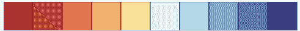

# 5 探索和去噪您的数据集

> 原文：[`mlbook.explained.ai/prep.html`](https://mlbook.explained.ai/prep.html)

[特伦斯·帕特](http://parrt.cs.usfca.edu) 和 [杰里米·霍华德](http://www.fast.ai/about/#jeremy)

版权所有 © 2018-2019 特伦斯·帕特。保留所有权利。

*请勿在网络上复制或以任何方式重新分发。*

本书由 markup+markdown+python+latex 源代码生成，使用 [Bookish](https://github.com/parrt/bookish)。

您可以通过访问此页面的注释版本来**评论或注释**此页。您会看到现有的注释部分以黄色突出显示。它们是**公开可见的**。或者，您可以直接向 特伦斯 发送评论、建议或修正。

目录

+   快速嗅探数据

+   训练和评估初始模型

+   探索和去噪公寓租金数据

    +   检查数据分布

    +   去除异常值

+   比较在去噪数据上训练的模型

+   登录，退出

“*在没有数据之前就进行理论假设是一个严重的错误。不知不觉中，人们开始扭曲事实以适应理论，而不是让理论适应事实。*” —— 亚瑟·柯南·道尔（1891）在《波希米亚丑闻》中

在 **第三章** *初尝应用机器学习滋味* 中，我们成功训练了一个随机森林（RF）模型来预测纽约市租金价格，但是在理想条件下：数据已经以模型可接受的形式存在，并且大部分数据没有错误、异常和其他噪声。不幸的现实是，真实数据集很混乱，因此在本章中，我们将学习如何逐步处理 Kaggle 上的原始数据，直到它看起来像那个理想数据集。机器学习世界的隐藏秘密是，从业者大约花费 75%的时间用于获取、清理和准备数据以供训练。（本书不会介绍数据获取部分，但你可以查看特伦斯的免费[数据获取课程笔记](https://github.com/parrt/msan692)。）

要训练一个模型，数据集必须遵循两个基本规则：所有数据必须是数值型的，并且不能有任何缺失值。我们必须从非数值特征（如字符串、日期和分类变量如`SalesID`）中推导出数值特征。或者，我们可以简单地删除非数值特征。这项准备工作本身就是一个大话题，我们将在 **第六章** *分类讨论* 和 **第七章** *探索和清理推土机数据集* 中讨论。在本章中，我们将继续使用之前使用的数值字段（浴室、卧室、经度、纬度）。

即使是纯数值数据，也可能需要进行一些清理工作。数据可能包含异常值、错误或矛盾信息。例如，在我们的公寓数据中，有一个地方声称有 2 个卧室但 10 个浴室，而其他公寓声称位于赤道！凭借数据集的图表或统计信息，我们转向具有领域专业知识的人来解释我们所观察到的。（特伦斯的妹妹住在纽约市，并证实纽约不在赤道，尽管在 8 月份通常感觉如此。）

我们还必须从模型确切想要做什么的角度来审视所有数据清理操作。在我们的案例中，我们想要一个能够预测公寓价格的模型，但仅限于纽约市，并且仅限于价格合理的公寓。不幸的是，我们的数据集中有许多记录不符合这些限制。例如，数据集中有一个异常公寓每月租金为 449 万美元（它必须有停车位），还有一个公寓的经纬度将其放置在波士顿。我们将删除这些以及其他一些类似的记录，仅仅是因为它们超出了我们的关注范围。正如我们在**第三章** *A First Taste of Applied Machine Learning*中学到的，模型只能根据提供给它们的训练数据进行预测，我们应该避免在不适用的样本上训练它们。

在本章中，我们将探索 Kaggle 的原始公寓数据集，[Two Sigma Connect: Rental Listing Inquiries](https://www.kaggle.com/c/two-sigma-connect-rental-listing-inquiries)，寻找并纠正可疑的记录和元素。为此，我们将学习多种有用的技术来检查和操作 pandas 数据框。在这个过程中，我们还将使用 matplotlib 生成一些看起来很酷的图表，并使用 sklearn 来考虑数据清理如何影响模型精度。

## 5.1 快速查看数据

一旦我们确定了解决的确切问题，机器学习项目的第一步就是查看数据，但只是快速地闻一闻。（使用 Jupyter 笔记本、Excel、编辑器或其他任何方便的工具。）我们需要了解数据的样子，因此我们第一次检查数据应该得到列名、它们的数据类型以及目标列是否有数值或类别值。（如果我们正在创建回归器，这些值必须是数值；如果我们正在分类，这些值必须是类别。）

要开始，请确保您在运行 Jupyter 的`data`目录下有文件`rent.csv`。（有关从 Kaggle 下载 JSON 租金数据并创建 CSV 文件的说明，请参阅**第 3.2.1 节** *加载和嗅探训练数据*。）然后，通过点击“+”按钮并在“Notebook”选项卡下选择“Python 3”来创建一个新的 Jupyter 笔记本。这将创建一个与您启动`jupyter lab`的同一目录中的文件（除非您已经使用左侧实验室浏览器窗口上的“文件”选项卡跳来跳去）。通过右键单击当前显示为`Untitled.ipynb`的笔记本选项卡，给文件起一个合适的名字，如`clean.ipynb`可能是个好主意。您可能还会发现从自动从各章节代码片段中导出的[notebooks](https://mlbook.explained.ai/notebooks/)方便使用。

现在，让我们在笔记本中输入一些代码来使用 pandas 读取 CSV 数据，以便我们首次查看原始数据：

```py
import pandas as pd
df = pd.read_csv("data/rent.csv")
print(df.shape) # print rows, columns
df.head(2)       # dump first 2 rows
```

(49352, 15)

|   | bathrooms | bedrooms | building_id | created | description | display_address | features | latitude | listing_id | longitude | manager_id | photos | price | street_address | interest_level |
| --- | --- | --- | --- | --- | --- | --- | --- | --- | --- | --- | --- | --- | --- | --- |
|  |
| --- |
| 0 | 1.5000 | 3 | 53a5b119ba8f7b61d4e010512... | 2016-06-24 07:54:24 | A Brand New 3 Bedroom 1.5... | Metropolitan Avenue | [] | 40.7145 | 7211212 | -73.9425 | 5ba989232d0489da1b5f2c45f... | ['https://photos.renthop.... | 3000 | 792 Metropolitan Avenue | medium |
| 1 | 1.0000 | 2 | c5c8a357cba207596b04d1afd... | 2016-06-12 12:19:27 |  | Columbus Avenue | ['Doorman', 'Elevator', '... | 40.7947 | 7150865 | -73.9667 | 7533621a882f71e25173b27e3... | ['https://photos.renthop.... | 5465 | 808 Columbus Avenue | low |

有许多列，其中一些列非常宽，所以让我们将显示方式转置，使列垂直（`.T`对数据帧执行转置，翻转行和列）：

```py
df.head(2).T
```

|   | 0 | 1 |
| --- | --- | --- |
|  |
| --- |
| bathrooms | 1.5000 | 1.0000 |
| bedrooms | 3 | 2 |
| building_id | 53a5b119ba8f7b61d4e010512... | c5c8a357cba207596b04d1afd... |
| created | 2016-06-24 07:54:24 | 2016-06-12 12:19:27 |
| description | A Brand New 3 Bedroom 1.5... |  |
| display_address | Metropolitan Avenue | Columbus Avenue |
| features | [] | ['Doorman', 'Elevator', '... |
| latitude | 40.7145 | 40.7947 |
| listing_id | 7211212 | 7150865 |
| longitude | -73.9425 | -73.9667 |
| manager_id | 5ba989232d0489da1b5f2c45f... | 7533621a882f71e25173b27e3... |
| photos | ['https://photos.renthop.... | ['https://photos.renthop.... |
| price | 3000 | 5465 |
| street_address | 792 Metropolitan Avenue | 808 Columbus Avenue |
| interest_level | medium | low |

这使得查看列名、列数据类型以及每个列的样本数据值变得更容易。我们看到许多非数值字段，包括一些看起来像将事物打包成单个字符串的列表的列，例如 `photos` 和 `features`。`description` 似乎是一段自由文本字符串。如果我们请求 `info()`，Pandas 可以更具体地告诉我们数据类型：

```py
df.info()

```

<class 'pandas.core.frame.DataFrame'> RangeIndex: 49352 entries, 0 to 49351 Data columns (total 15 columns): bathrooms 49352 non-null float64 bedrooms 49352 non-null int64 building_id 49352 non-null object created 49352 non-null object description 47906 non-null object display_address 49217 non-null object features 49352 non-null object latitude 49352 non-null float64 listing_id 49352 non-null int64 longitude 49352 non-null float64 manager_id 49352 non-null object photos 49352 non-null object price 49352 non-null int64 street_address 49342 non-null object interest_level 49352 non-null object dtypes: float64(3), int64(3), object(9) memory usage: 5.6+ MB

数据类型位于最后一列，例如 `float64` 表示“使用 64 位（8 字节）内存的浮点数”。`object` 数据类型是 pandas 中字符串数据类型的等价物。除了 `float` 和 `int` 之外的所有内容都是非数值数据类型。因为我们目前不知道如何处理非数值数据类型，所以我们可以直接删除这些列。我们只关心数值字段：浴室数量、卧室数量、经度、纬度、价格。

要获取数据帧的子集，我们可以从 `df` 中删除列，但通过列名列表进行索引来获取列的子集更为明确：

```py
df_num = df[['bathrooms', 'bedrooms', 'longitude', 'latitude', 'price']]
df_num.head(2)
```

|   | 浴室 | 卧室 | 经度 | 纬度 | 价格 |
| --- | --- | --- | --- | --- | --- |
|  |
| --- |
| 0 | 1.5000 | 3 | -73.9425 | 40.7145 | 3000 |
| 1 | 1.0000 | 2 | -73.9667 | 40.7947 | 5465 |

在数据帧上进行索引时预期的是一个列名或列名列表，所以 `df['price']` 只获取价格列。因为 Python 列表字面量使用方括号，`['bathrooms',`...`]`，就像索引一样，双括号符号看起来有点奇怪。数据帧 `df_num` 在结构上看起来像是 `df` 的一个副本，只包含这五个列，但 `df_num` 实际上是一个视图或视角，限制在五个列上。到目前为止，我们的数据看起来与第三章 **A First Taste of Applied Machine Learning** 中的 `rent-idea.csv` 非常相似。

因为模型无法处理缺失值，另一个标准检查是查看数据集中是否有缺失值：

```py
print(df_num.isnull().any())
```

浴室 False 卧室 False 经度 False 纬度 False 价格 False dtype: bool

在这个数据集中没有缺失值需要处理，但在 [chp:feateng] 中我们可能就不会这么幸运了。

你看数据越多，就越有可能过拟合。

我们可以进一步探索数据，但我们到底在寻找什么？作为一个一般原则，尽量避免过多关注数据值。根据我们人类观察的缺陷，很容易做出判断或过早地操纵数据。记住，如果人类能够仅仅通过观察大数据集就能做出正确、无偏见的预测，我们就无需机器学习。例如，如果我们看到一个有很多缺失值的列，我们可能会倾向于将其从考虑特征中去除。相反，让模型告诉你哪些特征是重要的。

## 5.2 训练和评估初始模型

2 现在的潮流是，人们会说“那里没有信号”，以表明特征和目标之间不存在关系。

除了知道数据框中的所有列都是数值之外，我们并没有非常深入地查看训练数据。下一步是训练一个模型，看看特征和目标之间是否存在关系以及这种“信号”有多强。2

一旦我们有了正确准备好的数据框 `df_num`，它只包含数值且没有缺失值，以下是训练模型的步骤：

1.  区分特征列和目标列。

    ```py
    X_train = df_num.drop('price', axis=1)
    y_train = df_num['price']

    ```

1.  创建一个具有合适超参数的适当模型。

    ```py
    from sklearn.ensemble import RandomForestRegressor
    rf = RandomForestRegressor(n_estimators=100,
                               n_jobs=-1)        # train w/all CPU core

    ```

1.  将模型拟合到训练数据。

    ```py
    rf.fit(X_train, y_train)

    ```

现在，让我们使用 `score()` 来衡量模型拟合训练数据的好坏，它返回一个称为  的常见错误指标（字面意思是“[确定系数](https://en.wikipedia.org/wiki/Coefficient_of_determination)”）：

```py
r2 = rf.score(X_train, y_train)
print( f"{r2:.4f}" )

```

0.8649

完美的训练  分数是 1.0，这意味着模型完美地回忆了训练数据。 分数为 0 表示模型的表现不比总是返回平均价格好。不幸的是，高训练  分数（低误差）并没有告诉我们太多。高分仅仅意味着特征和目标之间可能存在关系，并且被模型捕捉到。然而，如果我们无法获得高  分数，这表明没有关系或模型根本无法捕捉它。随机森林（RF）非常强大，甚至可以捕捉随机变量之间的关系，因此预期随机森林训练  分数会很高。

**解释 R² 分数**

将分数视为衡量我们的模型相对于总是返回目标（公寓价格）平均值的简单模型表现如何。任何低于该值的分数，一直低到负无穷大，都表明模型在某种程度上表现不完美。因为模型可以任意糟糕，所以分数可以是任意负数。分数的一个优点是它是归一化的：分数总是在 1.0 到负无穷大的范围内，而不是以公寓租金价格或内罗毕的平均降雨量为单位。只需记住，1.0 表示完美，0.0 表示不如返回平均值。更多内容请参阅第十二章*评估回归器性能*。

正如我们在第 3.2.4 节*检查模型一般性*中讨论的那样，我们关心的是验证或测试向量上的预测误差，而不是训练误差。我们使用保留法来评估模型在未用于训练目的的验证数据上的性能。编写代码来分割验证集很麻烦，并且会减少训练集的大小。

喜欢随机森林的另一个原因是，它们在训练模型的同时可以有效地估计预测误差，完全避免了需要单独的验证集的需求。误差分数被称为*离包分数*，是典型的计算指标。（*Bag*是*bootstrap aggregation*的缩写，我们将在第十七章*随机决策树森林*中详细探讨。）回想一下，随机森林是一组决策树，每棵树都是在训练数据的一个子集上训练的。离包分数（*OOB*）通过只使用那些没有在该记录上训练的树来查看特定记录的预测准确性。统计学家已经证明，离包分数可以很好地估计模型的一般性，其真实的预测误差。

离包分数在计算上仍然不是免费的，我们必须通过向 RF 的构造函数提供一个参数`oob_score=True`来请求计算。以下是训练一个计算并打印 OOB 分数的模型的步骤：

```py
rf = RandomForestRegressor(n_estimators=100,
                           n_jobs=-1,
                           oob_score=True)   # get error estimate
rf.fit(X_train, y_train)
noisy_oob_r2 = rf.oob_score_
print(f"OOB score {noisy_oob_r2:.4f}")

```

OOB 分数 -0.0076

这个分数非常糟糕，大约和只预测平均公寓租金价格一样糟糕。因为这是我们第一次接触，让我们通过验证平均绝对误差（MAE）在美元上的表现也是糟糕的来更加熟悉它。为了获得一个验证集，我们必须保留一个随机的 20%子集。在噪声数据集中，我们选择的 20%中的值范围可能在每次运行中显著变化，所以让我们获得一些 MAE 数字进行比较。以下是一个简单的测试装置，其中强调了与模型相关的代码：

```py
from sklearn.model_selection import train_test_split
from sklearn.metrics import mean_absolute_error
import numpy as np

X, y = df_num.drop('price', axis=1), df_num['price']

errors = []
print(f"Validation MAE trials:", end='')
for i in range(7):
 X_train, X_test, y_train, y_test = \
 train_test_split(X, y, test_size=0.20)
 rf = RandomForestRegressor(n_estimators=100, n_jobs=-1)
 rf.fit(X_train, y_train)
 y_predicted = rf.predict(X_test)
 e = mean_absolute_error(y_test, y_predicted)
    print(f" ${e:.0f}", end='')
    errors.append(e)
print()
noisy_avg_mae = np.mean(errors)
print(f"Average validation MAE ${noisy_avg_mae:.0f}")

```

验证 MAE 试验：$411 $872 $851 $498 $901 $395 $425 平均验证 MAE $622

这些验证错误肯定比我们在**第三章** *《应用机器学习的第一口滋味》*中看到的干净数据集的大约$300 平均误差要差。此外，误差值波动很大，这意味着数据集的不同子样本具有不同的特征。这种行为与 RF 的低 OOB分数一致，表明在原始数据集上训练的模型结果不佳。

考虑到 RFs（随机森林）的强度，性能不佳可能表明公寓特征和租金价格之间几乎没有或没有可捕捉的关系，或者这可能意味着数据不一致或存在异常值。保留验证错误的变异性暗示数据可能不一致或存在异常值，因此让我们再次审视数据集。

## 5.3 探索和去噪公寓租金数据

正如我们提到的，我们想要避免在数据中过度挖掘，因为这会诱使我们开始做出可能对模型泛化产生负面影响的判断。但是，在这种情况下，较差的分数和不稳定的验证错误是一个合理的理由。在数据中四处探索的一般概念被称为*探索性数据分析*（EDA）。我们将带着明确的目的去探索数据，以寻找异常值。我们模型的重点是典型价格的公寓，并且仅限于纽约市本身，这意味着我们将寻找极端的租金值和纽约市外的公寓。

在查看数据之前决定这些界限至关重要。不要先查看数据，然后再决定异常值的定义。你可能会因为数据看起来不方便或可能混淆模型而删除或更改数据。对于公寓数据来说，可以安全地说，在纽约市价格低于 1000 美元的公寓可能缺少一些关键元素，如窗户和门，因此这应该是我们的最低价格。在高端，我们将 10000 美元视为“合理价格”范围之外。

在确定了这些界限之后，让我们从高层次上审视完整的数据集。以下是如何获取一些基本统计信息的方法：

```py
df_num.describe()
```

|   | 卫生间 | 卧室 | 经度 | 纬度 | 价格 |
| --- | --- | --- | --- | --- | --- |
|  |
| --- |
| 计数 | 49352.0000 | 49352.0000 | 49352.0000 | 49352.0000 | 49352.0000 |
| 平均值 | 1.2122 | 1.5416 | -73.9557 | 40.7415 | 3830.1740 |
| 标准差 | 0.5014 | 1.1150 | 1.1779 | 0.6385 | 22066.8659 |
| 最小值 | 0.0000 | 0.0000 | -118.2710 | 0.0000 | 43.0000 |
| 25% | 1.0000 | 1.0000 | -73.9917 | 40.7283 | 2500.0000 |
| 50% | 1.0000 | 1.0000 | -73.9779 | 40.7518 | 3150.0000 |
| 75% | 1.0000 | 2.0000 | -73.9548 | 40.7743 | 4100.0000 |
| 最大值 | 10.0000 | 8.0000 | 0.0000 | 44.8835 | 4490000.0000 |

每一列的最小值和最大值都出现了一些异常。有一个地方有 10 个浴室，另一个地方有 8 个卧室。还有一个经度为 0 的参考，这是本初子午线（英国格林尼治），还有一个纬度为 0 的参考，即赤道。哦，别忘了那个每月租金为 449 万美元的公寓，或者那个每月租金仅为 43 美元的有趣地方（可能是一辆废弃的车辆或目前正在着火的公寓）。

### 5.3.1 检查数据分布

在我们开始对数据集进行砍伐和焚烧之前，让我们更仔细地看看特征的*分布*。一个特征的分布是一个术语，大致上描述了该特征值在该特征值范围内的分布情况。（统计学家将分布称为*密度函数*，它将特征值映射到发生概率。）我们可以以多种方式检查分布，例如按价格降序排序并查看最高价格值：

```py
print(df_num.price.sort_values(ascending=False).head(10))
```

19558 4490000 9590 1150000 30689 1070000 29665 1070000 10581 135000 25538 111111 45674 100000 29082 90000 7336 85000 47995 80000 名称：价格，数据类型：int64

哇，看起来有很多非常昂贵的公寓（右侧列的值）。与特征或目标空间（范围）中的其他值相比，数值差异很大的值被称为*异常值*。异常值可能是噪声的结果，但某些数据集的异常值是正确的值，就像这里的情况一样。在纽约市，肯定有一些超昂贵的公寓，以及一些从那里到仅仅是非常昂贵的公寓的公寓。 （评估 `len(df[df.price>10_000])` 显示有 878 套公寓的租金超过 10,000 美元。）

另一种探索性方法是询问 pandas 对特定列中每个唯一值的计数，例如具有特定数量浴室和卧室的公寓数量。

|

```py
print(df_num.bathrooms.value_counts())
```

1.0 39422 2.0 7660 3.0 745 1.5 645 0.0 313 2.5 277 4.0 159 3.5 70 4.5 29 5.0 20 5.5 5 6.0 4 6.5 1 10.0 1 7.0 1 名称：浴室，数据类型：int64 |

```py
print(df_num.bedrooms.value_counts())
```

1 15752 2 14623 0 9475 3 7276 4 1929 5 247 6 46 8 2 7 2 名称：卧室，数据类型：int64 |

看起来只有少数几套公寓被列为拥有超过六个浴室（44,416 套中的几套）和只有少数几套拥有超过六个卧室。我们还可以将此数据以直方图的形式进行可视化，它将值范围分成固定大小的区间，然后计算每个区间中有多少个值：

» *由左侧代码生成*


```py
bookcolors = { # our usual book color palette
         'crimson': '#a50026', 'red': '#d73027',
         'redorange': '#f46d43', 'orange': '#fdae61',
         'yellow': '#fee090', 'sky': '#e0f3f8',
         'babyblue': '#abd9e9', 'lightblue': '#74add1',
         'blue': '#4575b4', 'purple': '#313695'}
fig,ax = plt.subplots()
ax.set_xlabel('Num Bedrooms')
ax.set_ylabel('Num Apts')
ax.hist(df_num.bedrooms, color=bookcolors['blue'])
plt.show()
```

（有关 `bookcolors['blue']` 表达式的更多信息，请参阅有关调色板的附加说明。）

**使用一致的调色板**

我们看到学生中常见的错误是使用基本上是随机的颜色，或者至少在图表中使用不一致的颜色。在一个图表中，特征价格是紫色，而在下一个图表中，相同的特征是绿色。人类对颜色非常敏感，并会在潜意识中赋予各种颜色意义，因此在不同可视化中保持一致性很重要。当手动绘制图表时，选择一个一致的调色板也是一个好主意。对于这本书，我们选择了

作为我们的调色板，并在绘制图表时从这些颜色中选择。本书剩余部分使用的 Python 代码将通过简单的字典机制从该调色板中选择颜色：

```py
bookcolors = {
         'crimson': '#a50026', 'red': '#d73027',
         'redorange': '#f46d43', 'orange': '#fdae61',
         'yellow': '#fee090', 'sky': '#e0f3f8',
         'babyblue': '#abd9e9', 'lightblue': '#74add1',
         'blue': '#4575b4', 'purple': '#313695'
     }

```

我们将使用`bookcolors['blue']`来查找我们的蓝色调色板，而不是依赖于 matplotlib 的默认蓝色颜色。

你选择的调色板也应该对色盲人士友好，并确保文本与其背景之间的对比度足够高，以便视觉障碍人士也能看清楚。Chrome 的访问性开发者工具为你提供了一个出色的审计功能。一个不错的颜色调板选择网站是[colorbrewer2.org](http://colorbrewer2.org/#type=sequential&scheme=BuGn&n=3)；请确保勾选“色盲安全”选项，以便它只显示色盲安全调板。当你绘制图表时，你也可以通过上传该图像到[vischeck](http://www.vischeck.com/vischeck/vischeckImage.php)来检查色盲人士看到的图表是什么样的。

经纬度特征也存在一些奇怪的现象，这些现象也出现在`df_num.describe()`中（见经度和纬度的最小值和最大值）。在位置 0,0 有 12 套公寓：

```py
print(len(df[(df.longitude==0.0) & (df.latitude==0.0)]))
```

12

而不是将 0,0 字面解释为漂浮在非洲西海岸的公寓，这些值可能代表缺失数据（管理员太懒，没有查找）。另一方面，实际值为 0 在技术上不是缺失值，因此我们也可以将这些值视为错误或更常见的*噪声*。其他噪声来源包括人类输入的打字错误或物理设备，如故障温度传感器。

噪声和异常值可能是潜在问题，因为它们可能导致不一致。*不一致*是一组具有相似或相同特征向量但目标值差异很大的特征向量。例如，如果我们聚焦于纽约市包含两个超过 100 万美元的公寓的区域，我们会看到其他具有相同特征但价格合理的公寓：

```py
df_local = df[(df.latitude>40.764) & (df.latitude<40.7678) &
              (df.longitude>=-73.9844) & (df.longitude<=-73.9842) &
           (df.bathrooms==1) & (df.bedrooms==1)]
df_local[['bedrooms','bathrooms','street_address','price']].sort_values('price')
```

|   | 卧室 | 卫生间 | 街道地址 | 价格 |
| --- | --- | --- | --- | --- |
|  |
| --- |
| 39939 | 1 | 1.0000 | west 54 st & 8 ave | 2300 |
| 21711 | 1 | 1.0000 | 300 West 55th Street | 2400 |
| 15352 | 1 | 1.0000 | 300 West 55th Street | 3350 |
| 48274 | 1 | 1.0000 | 300 West 55th Street | 3400 |
| 29665 | 1 | 1.0000 | 333 West 57th Street | 1070000 |
| 30689 | 1 | 1.0000 | 333 West 57th Street | 1070000 |

那些价格离谱的公寓可能是错误或仅仅是异常值，但无论机器学习模型多么强大，这种不一致的数据都会导致预测不准确。随机森林（RFs）预测所有特征聚类在一起的公寓的平均价格（本例中为 `np.mean(local.price)`=$358575.000），这意味着所有公寓的预测都将偏离数十万美元。

现在我们对数据集中的异常和噪声有一些了解，让我们做一些清理工作。

### 5.3.2 删除异常值

我们可以选择保留嘈杂或异常记录不变、删除或“修复”记录，但你应该选择保留记录不变。我们选择哪种替代方案取决于对这个领域的了解、模型的目标、异常的数量以及我们在具有异常值的单个记录中看到的内容。（缺失数据增加了另一个复杂因素。）

在构建模型时，没有领域知识是无法替代的。

应用最重要的过滤器与我们的模型目标相关，在这种情况下，是纽约市合理价格的公寓。我们可以有信心删除这些界限之外的任何记录。Pandas 提供了出色的功能来选择记录的子集。例如，`df_num.price>1_000` 会根据价格列中的每个值计算出一个包含真和假值的列。然后我们可以使用这个布尔值列作为数据框的多值索引，从而只选择与真值相关的行。因此，`df_num[df_num.price>1_000]` 返回 `df_num` 中价格大于 $1,000 的记录子集。我们也可以同时进行这两个比较，并将数据框赋值回一个新的 `df_clean` 变量：

```py
# filter all records (training/testing)
df_clean = df_num[(df_num.price>1_000) & (df_num.price<10_000)]

```

选择行子集是 pandas “视图”的一个例子，它返回对原始数据的过滤视角，而不是创建副本。

为了可视化清理后的价格分布，我们再次使用直方图：

> *由左侧代码生成*

(images/prep/prep_sniff_22.svg)

```py
fig,ax = plt.subplots()
ax.set_xlabel('Clipped Price')
ax.set_ylabel('Num Apts at that price')
ax.hist(df_clean.price, bins=45, color=bookcolors['blue'])
plt.show()
```

在识别异常值时，始终最好使用领域知识，但如果我们对适当的范围不确定，我们可以使用一些 NumPy 代码始终剪切掉底部和顶部的 1%。中间 98% 的价格分布看起来与剪切版本非常相似：

> *由左侧代码生成*

(images/prep/prep_sniff_23.svg)

```py
upper, lower = np.percentile(df.price, [1,99]) # find middle 98% of prices
clipped = np.clip(df.price, upper, lower)
fig,ax = plt.subplots()
ax.set_xlabel('Prices in middle 98% range')
ax.set_ylabel('Num Apts at that price')
ax.hist(clipped, bins=45, color=bookcolors['blue'])
plt.show()
```

看起来我们现在已经控制了价格，所以让我们转向删除纽约市以外的记录。我们之前看到有一些经纬度为零的记录。这些很可能代表缺失值，通常应该使用 [chp:feateng] 中的技术来处理缺失值。然而，在这种情况下，我们发现只有少数这样的记录：

```py
df_missing = df_clean[(df_clean.longitude==0) | (df_clean.latitude==0)]
print(len(df_missing))
```

11

我们可以删除这 11 条记录，而不会对训练集产生重大影响：

```py
df_clean = df_clean[(df_clean.longitude!=0) | (df_clean.latitude!=0)]

```

几个公寓的 GPS 坐标将它们定位在波士顿，而不是纽约市（例如，纬度 40.5813，经度-74.5343）。这些坐标可能是打字错误，或者是公寓经理进行的错误查询。通过仔细审查记录，我们可能能判断出这是否是打字错误，但由于数量很少，我们可以直接删除它们。纽约市并不完美地适合在一个方形区域内，但我们仍然可以围绕它确定一个边界框，然后删除该框外的记录。在[gps-coordinates.org](https://gps-coordinates.org/new-york-city-latitude.php)上快速查看，给出了纽约市的大致轮廓，左下角的纬度是 40.55，经度是-74.1，右上角的纬度是 40.94，经度是-73.67。我们可以使用另一个查询来过滤`df_clean`以获取这个边界框：

```py
df_clean = df_clean[(df_clean['latitude']>40.55) &
                    (df_clean['latitude']<40.94) &
                    (df_clean['longitude']>-74.1) &
                    (df_clean['longitude']<-73.67)]

```

移除这些记录是“合法”的，因为它们不符合之前为模型设定的目标。我们并不是任意删除记录。

下一步可能是检查那些具有极端数量卧室或浴室的少量记录，但由于数量很少，它们不太可能扭曲数据集。这尤其在我们移除了价格异常值之后是正确的，所以让我们保留这些记录不变。

## 5.4 比较在去噪数据上训练的模型

到目前为止，我们已经清理了数据集，使其符合我们模型的重点，即纽约市合理价格的部门。我们已经达到了与**第三章** *《应用机器学习的初尝》*中使用的文件`rent-idea.csv`相同的数据集。我们现在可以在这个去噪数据集上训练一个模型，看看模型性能是否有所提高：

```py
X, y = df_clean.drop('price', axis=1), df_clean['price']
rf = RandomForestRegressor(n_estimators=100,
                           n_jobs=-1,        # parallelize
                           oob_score=True)   # get error estimate
rf.fit(X, y)
clean_oob_r2 = rf.oob_score_
print(f"Validation OOB score {clean_oob_r2:.4f}")

```

验证 OOB 分数 0.8677

让我们也验证一下 MAE 是否与我们在理想数据集中看到的一致（为了简洁起见，只显示了输出）：

验证 MAE 试验：$293 $293 $296 $290 $293 $300 $296 平均清洁验证 MAE $294

太好了！我们现在已经得到了一个具有合理的预测误差的预测模型！我们是否已经完成了？这取决于“足够好”的定义以及我们是否认为我们可以做得更好。想象一下一个网站，它使用我们的模型来预测用户输入的公寓特征所对应的租金价格。很可能存在一个阈值，低于这个阈值用户不会觉得预测有用。如果我们有合适的方式来测试“足够好”，这应该指导我们是否继续寻找改进。

不要尝试太多的模型，因为这是一种过度拟合的形式。最终，你可能会找到一个错误地发现关系的模型。

假设我们想要提高模型的精度。我们可以尝试不同的模型，但它们不太可能表现出显著的改进，而且许多模型的表现会更差。例如，一个名为 [Lasso 回归](https://goo.gl/A9C1Sf) 的线性预测模型通常是一个很好的基线，但它无法计算训练后的  分数，因此我们必须保留一个验证集。以下是一个训练模型并打印训练集和测试集的  分数的代码片段：

```py
from sklearn.linear_model import Lasso

X_train, X_test, y_train, y_test = train_test_split(X, y, test_size=0.20)
lm = Lasso(alpha=0.5) # create linear model
lm.fit(X_train, y_train)
print(f"LM Training score {lm.score(X_train, y_train):.4f}")
print(f"LM Validation score {lm.score(X_test, y_test):.4f}")

```

LM 训练分数 0.5764 LM 验证分数 0.5740

即使是线性模型的 *训练*  也明显比 RF 的验证分数差。线性模型甚至无法捕捉到特征与公寓价格之间的关系，即使是训练数据。

通常，需要对超参数进行网格搜索以调整模型并获取最佳精度，但默认参数的梯度提升在此数据集上并不如 RF 表现得好。

梯度提升 模型是另一个流行且强大的模型（基于与 RF 类似的决策树），但它也未能像 RF 那样捕捉到关系：5

```py
from sklearn.ensemble import GradientBoostingRegressor

gbr = GradientBoostingRegressor(n_estimators = 2000)
gbr.fit(X_train, y_train)
print(f"GB Training score {gbr.score(X_train, y_train):.4f}")
print(f"GB Validation score {gbr.score(X_test, y_test):.4f}")

```

GB 训练分数 0.8425 GB 验证分数 0.8046

考虑到我们的 RF 模型的  和 MAE 分数，以及该模型与其他模型的良好比较，宣布解决这个问题是合理的。我们的解决方案来自于清理数据，使模型更容易处理，而不是在原始数据集上选择正确的模型。

我们对清理数据的关注程度取决于我们使用的模型以及违规值是否在预测变量（特征）或目标中。RF 的一项优点是它们能够优雅地处理预测变量中的错误和异常值。RF 的行为类似于最近邻模型，特征异常值会自动分区到特征空间的孤立角落。目标变量中的异常值也不是问题，除非它们导致不一致，即具有相同或相似特征向量但目标值差异巨大的样本。没有模型能够很好地处理不一致的训练数据。

这个公寓数据集中的不一致性源于异常值：目标变量中看到的极端公寓租金价格。这就是为什么将这些记录剪掉作为“无关紧要的”可以提高模型性能，但还有一个你应该知道的最终技巧，那就是将这些极端值压低。

## 5.5 登录，退出

当存在无法过滤掉的异常值（因为它们对模型很重要）时，对预测变量或目标变量的对数是有用的。

将目标变量（使用数学的*对数*函数）转换为一个更紧凑、更均匀的空间，使任何模型的生活更加容易。从某种意义上说，对数技巧是我们在本章中迄今为止所做技术的相反，我们检查了数据并进行了大量的“小手术”操作。现在，我们将执行一个单一的清理转换，并获得相当准确的精度，而无需查看数据，也不需要纽约市公寓领域的专业知识。

唯一的问题是，虽然执行起来容易，但要理解为什么对目标变量取对数有效以及它如何影响训练/测试过程，在智力上具有挑战性。（特伦斯和杰里米都认为，一开始，这种转换给我们增加了非同小可的认知负担。）如果你愿意，现在可以跳过这一部分，但请记住，这项技术存在，如果将来需要，请再次查看此处。


**图 5.1**. 价格剪裁至 20,000 美元以下并放大以使长右尾更明显；三角形标记的是平均价格。

平均值对异常值非常敏感；考虑一下你 10 个朋友的平均工资，然后再加上比尔·盖茨的工资，这会将平均值大幅提升。

为了达到对数技巧，让我们再次看看价格分布。**图 5.1**显示了价格剪裁至 20,000 美元以下并放大以显示长右尾的一部分。长尾本身并不一定是问题；由异常值引起的不一致性导致了不准确的模型。在训练过程中，随机森林通过平均相同或几乎相同的公寓的价格将它们结合起来，从而为这些公寓形成预测。但是，异常价格会极大地扭曲平均价格，因此模型的预测可能会非常不准确。7


**图 5.2**. 未剪裁异常值的自然对数（价格）直方图；三角形标记的是平均对数价格。

理想情况下，价格分布将是一个狭窄的“钟形曲线”分布，没有尾部。这将使基于平均价格进行的预测更加准确。我们需要一个数学运算，将广泛分布的目标价格转换到新的空间。由于异常值，“价格在美元空间”有一个长长的右尾，我们希望将其挤压到一个新的空间，该空间是正态分布的（“钟形曲线”）。更具体地说，我们需要大量缩小大值，稍微缩小小值。这个神奇的操作称为对数或简称为 log。**图 5.2** 展示了从数据集中所有价格取对数得到的直方图。我们得到了一个没有剪裁异常值的好看的正态分布的价格分布。（有关对数的更多信息，请参阅 **第 19.3 节** 对数、数量级和欧拉数。）

这是一个重塑价格分布的酷技巧，但让我们看看它对一些实际价格的实际影响。之前，我们查看了一些来自纽约市一小块区域的记录，其中有一些极端的异常值价格。这里再次展示那些记录（在变量 `df_local` 中），但新增了一列，显示价格的对数，以查看它如何缩小值：

|    | 卧室 | 卫生间 | 街道地址 | 价格 | log(price) |
| --- | --- | --- | --- | --- | --- |
|  |
| --- |
| 39939 | 1 | 1 | west 54 st & 8 ave | 2300 | 7.7407 |
| 21711 | 1 | 1 | 300 West 55th Street | 2400 | 7.7832 |
| 15352 | 1 | 1 | 300 West 55th Street | 3350 | 8.1167 |
| 48274 | 1 | 1 | 300 West 55th Street | 3400 | 8.1315 |
| 29665 | 1 | 1 | 333 West 57th Street | 1070000 | 13.8832 |
| 30689 | 1 | 1 | 333 West 57th Street | 1070000 | 13.8832 |

在原始价格上训练的 RF 模型会预测一个糟糕的平均价格 `np.mean(df_local.price)`=$358575.000，而基于价格对数训练的 RF 模型则预测平均值为 `np.mean(np.log(df_local.price))`=9.923。至少在价格对数空间中，预测平均值似乎是一个不错的赌注，因为平均对数价格更接近合理价格公寓的对数价格。为了将价格转换回美元空间，我们使用对数的逆运算，即指数函数 exp，得到预测值为 $20395.690。通过在价格对数空间而不是原始价格上取平均值，平均价格对异常值更不敏感，因为我们已经压缩了空间（异常值被拉近）。

好吧，所以取对数是有意义的，因为它将偏斜分布转换为正态分布，并且似乎在数据的一个部分中很有用。让我们看看对目标变量取对数是否会影响在原始、有噪声的数据集上训练的模型的总体准确性。

```py
X, y = df_num.drop('price', axis=1), df_num['price']
y_log = np.log(y) # apply log to each price

rf = RandomForestRegressor(n_estimators=100, n_jobs=-1, oob_score=True)
rf.fit(X, y_log)
log_oob_r2 = rf.oob_score_
print(f"OOB R² score for log(price) {log_oob_r2:.4f}")

```

OOB R² 分数对于 log(price) 为 0.8767

回想一下，对于在原始价格上训练的模型，其为-0.008 的糟糕表现。通过取价格的对数，我们的模型在验证集上的与仅对低于 10,000 美元的公寓进行训练的模型的 0.868 相匹配。无需清理数据或了解任何关于该领域的知识，我们就达到了与在干净数据集上训练的模型相同的评分！

然而，为了对某些`X_test`进行实际预测，我们必须取模型预测的指数，以得到以美元为单位的价格而不是对数美元（ = x）：

```py
y_predicted_log = rf.predict(X_test)
y_predicted = np.exp(y_predicted_log)
```

如果你正使用作为评估模型性能的指标，那么你已经完成了。但是，评分并不是衡量性能的唯一方式。我们已经看到了 MAE（平均绝对误差），还有许多其他指标，每个指标都测量与实际价格和预测价格相关的不同方面。例如，尽管得到了一个好的，但对于在价格的对数上训练的模型的 MAE 评分远不如在干净数据上训练的模型的 MAE 评分。如果我们更关心 MAE 而不是，那么清理数据比仅仅取价格的对数能让我们得到更好的模型。在下一章中，我们将学习更多关于评估回归器性能的知识，以及我们如何根据应用需求仔细选择合适的指标。
