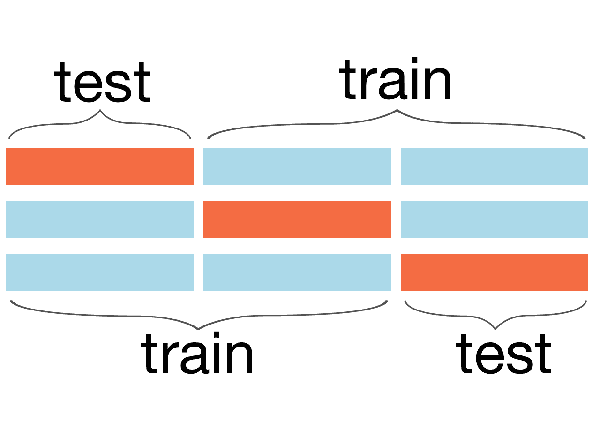
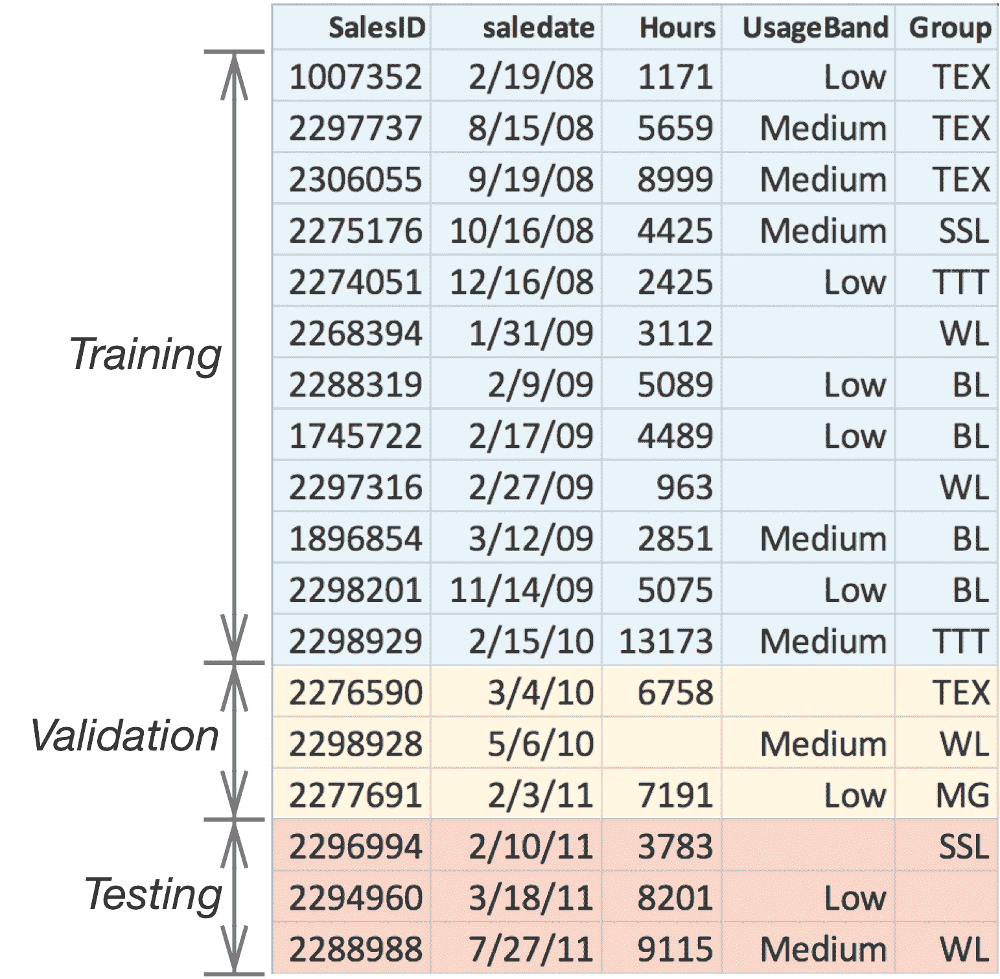
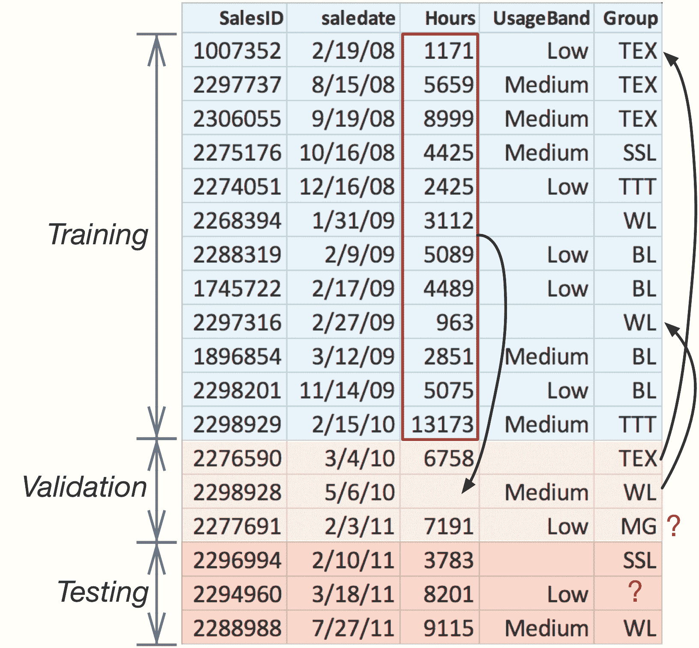
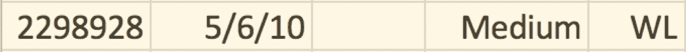

# 9 训练、验证、测试

> 原文：[`mlbook.explained.ai/bulldozer-testing.html`](https://mlbook.explained.ai/bulldozer-testing.html)

[特伦斯·帕特](http://parrt.cs.usfca.edu) 和 [杰里米·霍华德](http://www.fast.ai/about/#jeremy)

版权所有 © 2018-2019 特伦斯·帕特。保留所有权利。

*请勿在网络上复制或以任何方式重新分发。*

这本书是从 markup+markdown+python+latex 源代码生成的，使用了[Bookish](https://github.com/parrt/bookish)。

您可以通过访问此页面的注释版本来**评论或注释**此页。您会看到现有的注释部分以黄色突出显示。它们是**公开可见的**。或者，您可以直接将评论、建议或修复发送到特伦斯。

目录

+   测试三部曲

    +   分割对时间不敏感的数据集

    +   分割对时间敏感的数据集

+   校正训练和验证集

    +   准备训练集

    +   准备一致的训练和验证集

    +   获得基线验证指标

+   调整随机森林模型

    +   选择对时间敏感的训练集

    +   选择 max_features 和 min_samples_leaf

    +   删除无关特征

    +   调整通货膨胀价格

+   获得真正的泛化度量

+   摘要

能够正确测量模型的准确度是机器学习从业者的一项关键技能，本章的目标是通过将其应用于我们的推土机数据集来获得这项技能。评估模型的准确度需要两个关键要素：

1.  一个量化预测值和真实值之间准确度的指标

1.  一组位于训练数据之外的观察结果，其预测值由该指标进行测试

在训练数据上表现不佳的模型永远不会很好地泛化到他们从未见过的数据。在训练数据上表现良好的模型可能或可能不会很好地泛化。

**第 5.2 节** *训练和评估初始模型*介绍了和 MAE（平均绝对值）指标，我们将在**第十一章** *测量回归模型性能*中探讨更多指标。在**第 3.2.4 节** *检查模型泛化性*中，我们将验证数据与训练数据分开，因为我们关心模型对未来观察结果的表现，而不是它在自身训练数据上的表现。

然而，保持独立的训练和验证集可能会很麻烦，正如我们在本章中将会看到的。为了避免这些麻烦，到目前为止，我们一直在使用 RF 模型的便捷的 OOB（袋外）样本作为验证集的替代品。一般来说，从 OOB 样本中得出的准确度指标是真实验证分数的优秀估计，但仅适用于对时间不敏感的数据。

2 线性回归模型另一方面，确实假设了特征和价格之间的线性关系，这使得它们可以进行外推。

时间敏感的数据集，如推土机数据集，根据时间段的不同可能看起来非常不同。仅通货膨胀就意味着未来的价格将远远高于训练期。在 2000-2005 年期间训练的 RF 推土机价格预测器不会对 2020 年销售的推土机做出准确的预测。因此，从 OOB 样本中得出的指标对模型的泛化能力和未来预测的表现过于乐观。根据**第 3.4.3 节** *将数字分类器的性能与线性模型进行比较*，RF 模型对特征和目标变量之间的潜在关系没有任何假设，这意味着 RF 不能超出其训练经验的范围进行外推。2 参见 Rachel Thomas 的[如何（以及为什么）创建一个好的验证集](https://www.fast.ai/2017/11/13/validation-sets/)文章。

这意味着我们必须获得一个验证集，它超出了训练集的日期范围，以便正确测量 RF 在时间敏感数据上的准确性。我们将通过在**第 9.1 节** *测试三部曲*中分割出一个验证集来开始本章。不幸的是，使用单独的验证集来衡量准确性会引发一些不愉快的事情，我们将在**第 9.2 节** *校正训练集和验证集*中体验到这一点。简而言之，我们必须确保训练集和验证集中的类别使用相同的编码，并且缺失的数值值必须用仅从训练集计算出的中位数填充。一旦我们通过验证集获得了一个有用的准确性度量，我们将在**第 9.3 节** *调整随机森林模型*中调整我们的模型以提高其准确性和泛化能力。

我们模型开发过程的最后一步是在测试集上评估模型的性能，我们将在**第 9.4 节** *获得真正的泛化度量*中这样做。测试集与验证集一样，位于训练集之外，但必须隐藏起来，并且永远不要通过中间模型运行。这个最终测试报告的指标是模型泛化能力的唯一客观估计。

## 9.1 测试三部曲

模型泛化的唯一真正度量来自于在从未通过模型运行过的测试集上计算指标。

开发一个机器学习模型需要三组观察数据：训练集、验证集和测试集。模型仅在训练集上训练，并在开发过程中使用验证集来评估模型精度。在验证集上调整模型后，我们将测试集通过模型运行以获取模型精度和泛化能力的最终度量。如果我们查看测试集并通过一个中间模型而不是最终模型运行它，测试集就变成了另一个验证集。在数据集上测试模型后对模型所做的任何更改，都会使模型适应该数据集；该数据集就不再是泛化能力的客观度量。

在实践中开发模型时，我们通常只得到一个数据集，而不是分开的训练、验证和测试集。这意味着我们需要一个通用的程序来适当地分割数据集。

### 9.1.1 分割时间不敏感的数据集

对于在感兴趣的时间段内变化不大的数据集，我们希望使用记录的随机抽样来提取验证集和测试集。这被称为**保留法**。为了将大约 70%的数据框`df`用于训练，15%用于验证和测试集，我们可以这样做：

```py
from sklearn.model_selection import train_test_split
df = df.sample(frac=1) # shuffle data
df_dev, df_test = train_test_split(df, test_size=0.15)
df_train, df_valid = train_test_split(df_dev, test_size=0.15)
```

**注意**：将`df_test`测试子集存放在保险库中，以便在最终测试时单次使用。

使用`df_train`训练模型后，我们会将`df_valid`数据通过模型运行并计算一个指标，例如。然后我们会调整模型，使其在`df_valid`数据上更准确。当我们对模型满意时，我们最终会使用`df_test`来衡量泛化能力。

由于我们是随机选择验证集和测试集，这些集可能包含不成比例的异常记录，例如非常昂贵的推土机。这样的测试不具有代表性，并产生悲观的精度指标。循环运行拆分-训练-验证序列，每次都会提取不同的子集，并且产生的精度指标会波动。（注意，只有突出显示的`train_test_split()`行将是循环的一部分；永远不要重新计算`df_test`。）因此，一个很好的策略是取多次运行的平均精度指标。



**图 9.1**. 3 折交叉验证训练在两个（蓝色）块上，在第三个（橙色）块上测试，直到模型为所有三个块计算精度指标

这种程序的轻微变化被称为**k 折交叉验证**，将数据集分成 k 个大小相等的块。我们在 k-1 个块上训练模型，在另一个块上测试，重复 k 次，以确保每个块都用作验证集，如图**9.1**所示。整体验证误差是 k 个验证误差的平均值。以下是使用 RF 模型进行 5 折交叉验证的 sklearn 用法：

```py
from sklearn.model_selection import cross_val_score
rf = RandomForestRegressor(...)
scores = cross_val_score(rf, X, y, cv=5) # k=5
print(scores.mean())
```

交叉验证和重复子采样是衡量模型准确性的优秀技术，但它们不适用于对时间敏感的数据集。

### 9.1.2 分割时间敏感数据集

当观测特征或目标变量随时间有意义地变化时，随机提取验证集是不合适的。随机分割数据集会产生在时间上重叠的训练集和验证集。这是一个问题，因为它允许模型在未来的数据上训练，并且验证指标会过于乐观。想象一下你的模型在实际应用中的使用情况。在某个时候，你必须使用你拥有的数据来训练模型，然后部署它。随后提交给模型进行预测的任何观测值必然是来自训练模型所使用数据的结束日期之后的日期。训练应该始终模仿部署，因此我们的验证集应该来自训练集结束日期之后的日期。

提取时间敏感数据的训练、验证和测试集的过程是：

1.  按日期排序记录，从最早到最新

1.  提取最后，比如说，15%的记录作为`df_test`

1.  提取倒数第二的 15%的记录作为`df_valid`

1.  原始数据的剩余 70%是`df_train`

例如，**图 9.2**展示了从推土机数据集派生出的玩具数据集的分割过程，其中记录已按 2/19/08 到 07/27/11 的顺序排序。记住，我们的最终模型将在`df_test`上进行测试，但在训练集和验证集的合并数据上训练。

**图 9.2**. 对测试时间敏感数据进行排序和分割

对于实际的推土机数据集，Kaggle 提供了一个包含 401,126 条记录的训练集和一个包含 11,574 条记录的验证集。因为我们需要三个数据集，所以让我们使用提供的验证集作为我们的测试集，并从训练集的末尾分割出 12,000 条记录作为我们的验证集。剩下的就是我们的训练集。以下是非重叠的日期范围：

| 子集 | 开始日期 | 结束日期 | 记录数 |
| :-: | :-: | :-: | :-: |
| 训练 | 1989-01-17 | 2011-08-19 | 389,126 |
| 验证 | 2011-08-19 | 2011-12-30 | 12,000 |
| 测试 | 2012-01-01 | 2012-04-28 | 11,574 |

如果你查看`data`目录下的`prep-bulldozer.py`文件，你会看到以下类似的代码，它将原始的 Kaggle 训练集分为训练集和验证集：

```py
df = df.sort_values('saledate')
n_valid = 12000  # same as Kaggle's test set size
n_train = len(df)-n_valid
df_train = df[:n_train].reset_index(drop=True)
df_valid = df[n_train:].reset_index(drop=True)
```

## 9.2 矫正训练和验证集

在理想的世界里，数据集应该是纯数字的，并且没有缺失值。特征工程仍然是有用的，但将数据数值化，例如对分类变量进行编码，就不必要了。我们也不必创造缺失值。然而，现实世界的数据集充满了分类变量，并且充满了缺失值，这会在训练集和验证/测试集之间引入同步问题。**图 9.2**展示了若干潜在的风险：

1.  如果列 `UsageBand` 中的类别 `TEX` 在训练集中编码为整数值 1，则验证集和测试集必须使用相同的编码 1。

1.  所有集合中缺失的类别值应编码为整数 0。

1.  列 `Hours` 中缺失的数值应使用训练集中 `Hours` 的中位数进行填充。

1.  验证集或测试集中不存在于训练集中的类别值，例如列 `Group` 中的 `MG`，应编码为整数 0；模型从未见过 `MG`，因此我们将这些值编码为缺失值。

我们可以将这个列表抽象成以下重要规则，用于准备分离的训练集和测试集：

1.  必须对数据子集中的特征应用一致的转换。

1.  验证集和测试集的转换只能使用从训练集派生出的数据。

要遵循这些规则，我们必须记住对训练集所做的所有转换，以便稍后应用于验证集和测试集。在实践中，这意味着跟踪所有数值列的中位数、所有类别到代码映射，以及哪些类别被进行了一热编码。需要特别注意确保一热编码变量在训练集和测试集中使用相同的名称和列数。听起来很简单，但很容易搞错训练集和测试集之间的同步。同步错误通常表现为模型精度差，而不是像程序异常这样的明显问题。

### 9.2.1 准备训练集

在过去的两章中，我们一直在推土机训练集上纯粹进行清理、编码和特征工程。现在，是时候学习如何正确地准备单独的训练集和验证集了。我们将像以前一样准备数据，但也会跟踪我们执行的数据转换。然后，我们可以将这些转换应用于验证集。我们将尽可能多地重用前几章中的函数，但一些函数将需要一些更新，我们将一些代码片段组织到新的函数中。你可以在这个章节中找到所有代码的自动生成的[notebook](https://mlbook.explained.ai/notebooks/bulldozer-testing/prep.ipynb)。

要开始，将上一章中使用的常用导入语句复制粘贴到一个新的笔记本中。然后，复制函数 `test()`、`fix_missing_num()`、`extract_sizes()`、`df_normalize_strings()`、`df_cat_to_catcode()` 和 `df_split_dates()`。现在，让我们将我们在**第七章** *探索和清理推土机数据集* 中所做的所有清理工作封装到一个 `clean()` 函数中，以便稍后用于验证集和测试集：

```py
def clean(df):
    del df['MachineID'] # dataset has inconsistencies
    del df['SalesID']   # unique sales ID so not generalizer

    df['auctioneerID'] = df['auctioneerID'].astype(str)

    df_normalize_strings(df)

    extract_sizes(df, 'Tire_Size')
    extract_sizes(df, 'Undercarriage_Pad_Width')

    df.loc[df['YearMade']<1950, 'YearMade'] = np.nan
    df.loc[df.eval("saledate.dt.year < YearMade"), 'YearMade'] = \
        df['saledate'].dt.year

    df.loc[df.eval("MachineHoursCurrentMeter==0"),
           'MachineHoursCurrentMeter'] = np.nan

```

在**第八章** *推土机特征工程*中，我们对 `ProductSize` 进行了序数编码：

```py
def df_order_product_size(df):
    sizes = {np.nan:0, 'mini':1, 'compact':1, 'small':2, 'medium':3,
             'large / medium':4, 'large':5}
    df['ProductSize'] = df['ProductSize'].map(sizes).values

```

以及一热编码的特征 `Hydraulics_Flow` 和 `Enclosure`。这是一个用于一热编码类别变量的通用函数：

```py
def onehot(df, colname):
    ascat = df[colname].astype('category').cat.as_ordered()
    onehot = pd.get_dummies(df[colname], prefix=colname, dtype=bool)
    del df[colname]
    df = pd.concat([df, onehot], axis=1)
    # return altered dataframe and column training categories
    return df, ascat.cat.categories

```

特征 `fiProductClassDesc` 有很多有趣的信息，我们将其拆分为四个新的特征：

```py
def split_fiProductClassDesc(df):
    df_split = df.fiProductClassDesc.str.split(' - ',expand=True).values
    df['fiProductClassDesc'] = df_split[:,0] 
    df['fiProductClassSpec'] = df_split[:,1] # temporary column
    pattern = r'([0-9.\+]*)(?: to ([0-9.\+]*)|\+) ([a-zA-Z ]*)'
    spec = df['fiProductClassSpec']
    df_split = spec.str.extract(pattern, expand=True).values
    df['fiProductClassSpec_lower'] = pd.to_numeric(df_split[:,0])
    df['fiProductClassSpec_upper'] = pd.to_numeric(df_split[:,1])
    df['fiProductClassSpec_units'] = df_split[:,2]
    del df['fiProductClassSpec'] # remove temporary column

```

正如我们在清理过程中所做的那样，让我们将特征工程工作封装到一个函数中，因为我们稍后需要在不同数量的训练数据上重用此函数：

```py
def feature_eng(X): # for later use
    df_split_dates(X, 'saledate')
    df_order_product_size(X)
    split_fiProductClassDesc(X)

    X, hf_cats = onehot(X, 'Hydraulics_Flow')
    # normalize categories first then one-hot encode
    X['Enclosure'] = X['Enclosure'].replace('erops w ac', 'erops ac')
    X['Enclosure'] = X['Enclosure'].replace('no rops', np.nan)
    X, enc_cats = onehot(X, 'Enclosure')
    catencoders = {'Hydraulics_Flow':hf_cats,
                   'Enclosure':enc_cats}

    return X, catencoders

```

记住稍后在验证集上对 `Hydraulics_Flow` 和 `Enclosure` 进行一维编码很容易，但我们仍然需要跟踪训练类别。如果训练集和验证集中的类别相同，我们就不需要跟踪任何东西；我们只需将 `onehot()` 应用到验证集上。然而，如果验证集包含训练集中没有的类别，那么验证集和训练集中的列数将不同。在执行一维编码之前，我们必须对齐训练集和验证集中的类别。关于这一点，稍后会有更多说明。

在清理和特征工程之后，是“数值化”阶段，该阶段修复任何缺失值并使用我们的默认标签编码对分类变量进行编码，以消除任何剩余的非数值值。这意味着跟踪所有数值列的平均值并记录标签编码。

而不是手动识别数值列，我们可以通过 `is_numeric_dtype()` 来询问 Pandas，这为我们提供了一个通用的机制，用于替换数值列中的缺失值并记录它们的平均值：

```py
def df_fix_missing_nums(df:pd.DataFrame) -> dict:
    medians = {}  # column name to median
    for colname in df.columns:
        if is_numeric_dtype(df[colname]):
            medians[colname] = df[colname].median(skipna=True)
            fix_missing_num(df, colname)
    return medians

```

你可能想知道为什么我们即使数值训练列没有缺失值也要创建 `_na` 列。原因是我们必须准备好处理验证集或测试集中的缺失数据，这需要 `_na` 列。RF 模型不会因为一列全是 `False` 值而困惑，所以注入最终变得多余的列是安全的。

对于我们的数据集，`df_fix_missing_nums()` 的返回值如下：

```py
{'ModelID': 4642.0,
 'datasource': 136.0,
 'YearMade': 2002.0,
 'MachineHoursCurrentMeter': 3290.0,
 'saledate': 1.2511584e+18,
 ...}
```

为了在训练集和验证集上持续应用标签编码转换，我们必须更新 **第七章** *探索和清理推土机数据集* 中的 `df_string_to_cat()`，使其返回一个将列名映射到类别索引的字典。Pandas 的关键功能是 `df[colname].cat.categories`：

```py
def df_string_to_cat(df:pd.DataFrame) -> dict:
    catencoders = {}
    for colname in df.columns:
        if is_string_dtype(df[colname]) or is_object_dtype(df[colname]):
            df[colname] = df[colname].astype('category').cat.as_ordered()
            catencoders[colname] = df[colname].cat.categories
    return catencoders

```

这是 `catencoders['Ripper']` 中存储的类别字典的一个示例：

```py
Index(['multi shank', 'single shank', 'yes'], dtype='object')
```

在这些函数到位后，我们可以使用包装函数封装数值化阶段：

```py
def numericalize(X, catencoders):
    medians = df_fix_missing_nums(X)            
    e = df_string_to_cat(X)
    catencoders.update(e)
    df_cat_to_catcode(X)    
    return medians

```

到目前为止，我们有了应用清理、特征工程和数值化流程的函数。让我们加载数据并获取最后 100,000 条记录：

```py
df = pd.read_feather("data/bulldozer-train.feather")
df = df.iloc[-100_000:] # same 100,000 records as before
X, y = df.drop('SalePrice', axis=1), df['SalePrice']

```

然后，我们的完整准备流程简化为以下简单序列：

```py
y = np.log(y)
clean(X)
X, catencoders = feature_eng(X)
medians = numericalize(X, catencoders)

```

变量 `medians` 和 `catencoders` 跟踪我们需要的信息，以便一致地将我们的转换应用于验证集和测试集。我们还需要记住，我们已将 `Hydraulics_Flow` 和 `Enclosure` 进行了一维编码。

一旦我们确认所有列都是数值的，并且没有缺失值，我们就可以训练一个模型。

```py
rf, r2_train = test(X, y, n_estimators=150)

```

使用 14,865,112 个树节点，45.0 的中等树高度，OOB R² 0.91907

从 OOB 样本计算出的那个缺失的指标与我们在上一章末尾看到的大致相同，这是一个很好的合理性检查。由于 OOB 样本与训练样本处于相同的日期范围内，OOB 的指标过于乐观。为了更好地估计模型的一般性，我们真的需要一个验证集。

### 9.2.2 准备一致的训练和验证集

为了使用验证集评估我们的模型，我们需要加载原始验证数据，然后像处理训练集那样转换它。关键区别在于我们只能使用训练集中的数据来对类别进行标签编码，并在验证集中修复缺失值，这些值我们已经保存在变量`catencoders`和`medians`中。模型永远不应该在未来的数据上训练，因为这是一种数据泄露。部分答案已经泄露到训练数据中。

这是一个非常微妙的问题，因此值得通过注释**图 9.2**来强调其潜在风险，如图**图 9.3**所示。

**图 9.3**. 分割训练和测试子集的潜在风险

验证集中缺失的`Hours`值应该用仅来自训练集的`Hours`值的中位数来替换。在生产环境中对一组未来记录进行测试时，我们不会使用那些未来记录重新训练模型。因此，为了获得未来性能的准确图景，验证集或测试集中的数据永远不应该用于模型的训练。

我们当然不应该用验证数据的中位数（6758 和 7191）来替换验证集中缺失的值。一种突出中位数数据泄露问题的方法是想象测试一个带有缺失值的单个未来记录：



当实际上没有其他`Hours`值可以用来计算中位数时，我们唯一的选择就是仅从训练数据中计算中位数。这是一个用训练数据中的中位数填充缺失值的函数：

```py
def df_fix_missing_test_nums(df_test, medians):
    for colname in medians:
        df_test[colname+'_na'] = pd.isnull(df_test[colname])
        df_test[colname].fillna(medians[colname], inplace=True)

```

在处理缺失的数值后，下一个大问题是训练集和验证集中标签编码的不一致性。一致性需要：

1.  每个类别必须在所有训练和测试集中编码为相同的数值类别代码。

1.  任何集合中缺失的分类值必须最终以整数代码 0 结束。

1.  在测试集中找到但在训练集中未找到的类别必须编码为缺失值，并最终编码为代码 0。

以下函数根据那些一致性规则转换所有分类变量，使用训练集的类别索引。

```py
def df_apply_cats(df_test:pd.DataFrame, catencoders:dict):
    for colname,encoder in catencoders.items():
        # encode with categories from training set
        df_test[colname] = \
            pd.Categorical(df_test[colname],
                           categories=encoder, ordered=True)

```

调用此函数后，训练集和验证集中的缺失类别值将是`np.nan`值，在最终数值化步骤中调用`df_cat_to_catcode()`后，这些值将变为零。

确保一致的单一热编码是另一个相关风险。训练集和验证集中列的名称和数量必须相同。这种一致性只有在验证集中存在训练集所不知道的类别时才成问题。这些未知类别应在验证集中编码为缺失值，正如我们在第 8.3 节**单热编码水力学流**的 CS/数学/物理示例中看到的那样。该模型对该类别没有经验，所以我们将其与缺失值一起归为一类。

为了确保一致性，我们只需在单热编码之前将训练类别索引应用于验证集列*x*：

```py
def onehot_apply_cats(df_test, colname, catencoders):
    df_test[colname] = \
        pd.Categorical(df_test[colname],
                       categories=catencoders[colname],
                       ordered=True)
    onehot = pd.get_dummies(df_test[colname], prefix=colname, dtype=bool)
    del df_test[colname]
    df_test = pd.concat([df_test, onehot], axis=1)
    del catencoders[colname] # simplify df_apply_cats()
    return df_test

```

我们从`catencoders`中删除类别索引的原因是为了简化`df_apply_cats()`中的循环。该函数不需要测试`colname in df_test`以避免从`df_test[colname]`中出现的索引异常。（在单热编码后，原始的类别列*x*将不会出现在`df_test`中。）

在验证集上执行特征工程时，我们像之前一样分割日期，编码产品尺寸，并将产品描述分开。唯一的不同之处在于我们应用单热编码的方式：

```py
def feature_eng_test(df_test, catencoders):
    df_split_dates(df_test, 'saledate')
    df_order_product_size(df_test)
    split_fiProductClassDesc(df_test)

    df_test = onehot_apply_cats(df_test, 'Hydraulics_Flow', catencoders)
    df_test['Enclosure'] = df_test['Enclosure'].replace('erops w ac', 'erops ac')
    df_test['Enclosure'] = df_test['Enclosure'].replace('no rops', np.nan)
    df_test = onehot_apply_cats(df_test, 'Enclosure', catencoders)

    return df_test

```

为了将验证集数值化，我们使用`df_apply_cats()`应用类别，而不是调用`df_string_to_cat()`，使用训练集的中位数来修复任何缺失值，然后进行通常的类别到代码的转换：

```py
def numericalize_test(df_test:pd.DataFrame, medians:dict, catencoders:dict):
    df_apply_cats(df_test, catencoders)
    df_fix_missing_test_nums(df_test, medians)
    df_cat_to_catcode(df_test)

```

**防御性编程**

机器学习模型难以调试，因为错误通常只表现为模型精度的波动。练习一些防御性编程是个好主意。以下是在我们将特征推入模型之前对特征进行一些基本合理性检查的两个函数：

```py
def sanity_check(df):
    for col in df.columns:
        if is_string_dtype(df[col]) or is_object_dtype(df[col]):
            print(f"Col {col} is still a string")
        if df[col].isnull().any():
            print(f"Col {col} still has missing values")

def check_types(df1,df2):
    if df1.shape[1] != df2.shape[1]:
        print(f"Num columns differs: {df1.shape[1]} != {df2.shape[1]}")
    cols1 = set(df1.columns)
    cols2 = set(df2.columns)
    if cols1 != cols2:
        print(f"Column names differ:")
        if len(cols1-cols2)>0:
            print(f"\tIn df1 not df2: {cols1-cols2}")
        if len(cols2-cols1)>0:
            print(f"\tIn df2 not df1: {cols2-cols1}")
    for col in cols1.intersection(cols2): # check those in common
        if df1[col].dtype != df2[col].dtype:
            print(f"Col {col} dtypes differ {df1[col].dtype} != {df2[col].dtype}")
```

这是一个常见的调用序列：

```py
sanity_check(X)
sanity_check(X_valid)
check_types(X, X_valid)
```

拥有所有这些函数后，我们终于准备好使用以下简单的代码序列加载和准备一个验证集：

```py
df_valid = pd.read_feather("data/bulldozer-valid.feather")
X_valid, y_valid = df_valid.drop('SalePrice', axis=1), df_valid['SalePrice']

y_valid = np.log(y_valid)
clean(X_valid)
X_valid = feature_eng_test(X_valid, catencoders)
numericalize_test(X_valid, medians, catencoders)

```

到目前为止，我们在`X`和`y`中准备好了训练数据，在`X_valid`和`y_valid`中准备好了验证数据；让我们看看模型在验证集上的表现如何。

### 9.2.3 获取基线验证指标

对于这个推土机数据集，我们一直使用无单位的分数（范围从负无穷大到 1.0）来衡量模型性能，因为这是 sklearn 的 RF 实现为我们提供的易于获取的 OOB 样本。然而，MAE 度量更容易解释，因此我们也为验证集预测计算那个。为了比较我们的模型与 Kaggle 竞争对手的表现，我们还需要计算所谓的*均方对数误差*（*RMSLE*）（见*常见回归指标*框）。因为我们已经对`y_valid`取了对数，所以平方预测值和真实值之间的差异然后取平方根就得到了 RMSLE。对于这个数据集，好的 RMSLE 误差接近 0.23。

**常见的回归指标**

有许多非常常见且非常相似的指标用于评估回归器的准确性。我们已经使用了平均绝对值，MAE，它只是预测值和真实值之间平均绝对差异：

```py
def MAE(y_pred, y_true):
    return np.mean(np.abs(y_pred - y_true))
```

绝对值防止了负偏差和正偏差相互抵消。我们不是取绝对值，而是平方差异，得到*均方误差*（*MSE*）。平方差异还有强调任何与真实值相差很远的预测的效果：

```py
def MSE(y_pred, y_true):
    return np.mean((y_pred - y_true)**2)
```

忽略一些显著偏离的预测，使用 MAE（平均绝对误差）比 MSE（均方误差）更好。这完全取决于你关心的是什么。

由于 MSE 的单位是目标变量单位的平方，例如平方美元，从业者通常使用*均方根误差*（*RMSE*）：

```py
def RMSE(y_pred, y_true):
    return np.sqrt(MSE(y_pred, y_true))
```

如果我们取目标变量的对数，就像我们在推土机数据集（`y=np.log(y)`）中所做的那样，那么计算 MSE 实际上是在计算*均方对数误差*（*MSLE*）。同样，如果我们取那个数的平方根，我们得到*均方对数误差*（*RMSLE*）。

通过确保验证集的列与训练集的列对齐来避免一个常见的错误。在将验证集通过模型运行之前，使用 Pandas 的`reindex()`函数。

模型`rf`已经在`X`和`y`上训练，但我们不能立即为`X_valid`中的观测值请求预测。验证集列的顺序可能与训练集不同，因为转换和注入新列的顺序可能不同。sklearn 模型在`fit()`和`predict()`中将 Pandas 数据框转换为 numpy 2D 数组，而不考虑列顺序，所以让我们确保它们对齐：

```py
X_valid = X_valid.reindex(columns=X.columns)

```

现在，我们可以从`X_valid`中进行预测，并计算 RMSLE、MAE 分数：

```py
from sklearn.metrics import mean_squared_error, mean_absolute_error

y_pred = rf.predict(X_valid)
# Use np.exp(y_valid) to get back into dollars space
mae_valid_baseline = mean_absolute_error(np.exp(y_valid), np.exp(y_pred))
rmsle_valid_baseline = np.sqrt( mean_squared_error(y_valid, y_pred) )
r2_valid_baseline = rf.score(X_valid, y_valid)
print(f"Validation R² {r2_valid_baseline:.5f}, "+
      f"RMSLE {rmsle_valid_baseline:.5f}, "+
      f"MAE ${mae_valid_baseline:.0f}")

```

验证集 R² 0.88148，RMSLE 0.24890，MAE 5939

平均推土机价格约为 31,000 美元，因此偏差 5939 美元并不理想，但我们可以通过调优模型来稍微提高分数。就 Kaggle 竞赛而言，这个分数将使我们处于前 10%的边缘，前提是我们的验证集与私有排行榜测试集相同。（竞赛已经结束，所以我们无法在相同的测试集上测试我们的模型；与排行榜的比较仅为我们提供了一个大致的性能指标。）

## 9.3 调优随机森林模型

随机森林模型的一个很好的特性是它们不需要很多调优就能获得良好的准确性。然而，为了获得最大化的准确性，有三个常见的超参数我们可以调整：森林中决策树的数量（`n_estimators`）、在树的每个节点训练期间考虑的随机选择特征的数量（`max_features`），以及分组到叶节点中的最小样本数（`min_samples_leaf`）。我们将在第十七章“随机决策树森林”中精确地定义这些超参数，但现在，让我们假设它们很重要。

调优模型涉及反复调整超参数、重新训练模型，并基于验证集的预测计算一个指标。最佳超参数是那些给我们带来最佳验证指标的参数。在模型开发和与特征工程相关的实验中，我们更关心的是短训练时间，而不是寻找最佳超参数。只有在我们的特征工程大致完成之后，我们才会调整超参数，寻找最佳模型。作为最后的调优步骤，我们将尝试移除不重要的特征。

为了加快我们尝试不同模型的速度，我们希望保持训练时间低，所以我们通常使用训练数据的一个子集，并在 RF 模型中使用 20 到 50 棵树。（到目前为止，我们已经使用了大约 400,000 条记录中的 100,000 条。）我们有时会将`min_samples_leaf`设置为仍然能给我们提供良好准确性的最高值，因为更大的`min_samples_leaf`值会减小树的大小，而较小的树构建得更快。`min_samples_leaf`=1 是默认值，它能在训练数据中找到最详细的特征，但会导致树变得最大。

当是时候调整模型以提升准确度时，我们逐渐增加树的数量，直到准确度趋于平稳。在上一章中，我们在特征工程期间使用了 150 棵树，因为我们想通过一个相当稳定的指标来比较各种特征的效果。由于模型构建的随机性，相同的指标在相同的数据和相同的超参数上将会波动。树的数量越少，指标波动越大。在本章的剩余部分，我们将树的数量增加到 200，希望挤出一点更多的准确度并提高指标稳定性。在调整模型时，我们希望知道准确度的差异是由于超参数的变化，而不是随机波动。

实践者通常会使用一种称为*网格搜索*的技术来调整超参数，这将尝试很多组合，寻找最佳的超参数集。这样的搜索需要花费很长时间，对于 RF 模型来说并不必要。我们可以按顺序选择超参数。首先，增加树的数量，直到准确度不再提高。接下来，使用第一步中的树的数量，尝试几个`max_features`（`'sqrt'`, 0.1 到 0.6）的值，并选择给出最佳指标的值。最后，使用最佳的`max_features`，从 1 到大约 15 运行`min_samples_leaf`，再次选择最佳值。

### 9.3.1 选择时间敏感的训练集

在尝试调整模型之前，始终选择训练集和验证集。想法是从影响准确度最大的特征开始，逐步过渡到通过调整模型超参数获得的更小的改进。

在我们开始调整过程之前，让我们选择一个比我们之前使用的 10 万条记录更大的训练集。一般来说，我们希望使用我们拥有的所有训练数据，但在时间敏感的数据集中，如这个例子，情况并不总是如此。显然，训练集开始时的 1989 年的价格对于 2011 年销售的推土机来说将是低估的价格。我们需要在使用更多训练数据和早期观察的偏差价格之间找到一个平衡。通过实验，我们通过迭代多个训练集日期范围，得到了一个包含 2007 年和以后所有样本的训练数据集。以下是加载该训练集的方法：

```py
df = pd.read_feather("data/bulldozer-train.feather")
df = df.query('saledate.dt.year>=2007').copy()
X, y = df.drop('SalePrice', axis=1), df['SalePrice']

```

使用新的训练数据时，我们必须运行与之前相同的数据准备流程。这意味着还需要重新处理验证集，因为我们的`中位数`和`catencoders`已经改变，因为它们是从训练集计算得出的。以下是准备训练集和验证集的完整序列：

```py
y = np.log(y)
clean(X)
X, catencoders = feature_eng(X)
medians = numericalize(X, catencoders)

df_valid = pd.read_feather("data/bulldozer-valid.feather")
X_valid, y_valid = df_valid.drop('SalePrice', axis=1), df_valid['SalePrice']
y_valid = np.log(y_valid)
clean(X_valid)
X_valid = feature_eng_test(X_valid, catencoders)
df_apply_cats(X_valid, catencoders)
df_fix_missing_test_nums(X_valid, medians)
df_cat_to_catcode(X_valid)

```

让我们再创建一个方法，该方法训练模型，测量准确度，并报告一些指标：

```py
def test_valid(X, y, X_valid, y_valid, n_estimators=200,
               max_features='auto', min_samples_leaf=1):
    X_valid = X_valid.reindex(columns=X.columns)
    rf = RandomForestRegressor(n_estimators=n_estimators,
                               n_jobs=-1,
                               oob_score=True,
                               max_features=max_features, 
                               min_samples_leaf=min_samples_leaf)
    rf.fit(X, y)
    n = rfnnodes(rf)
    h = np.median(rfmaxdepths(rf))
    y_pred = rf.predict(X_valid)
    mae_valid = mean_absolute_error(np.exp(y_valid), np.exp(y_pred))
    rmsle_valid = np.sqrt( mean_squared_error(y_valid, y_pred) )
    r2_score_valid = rf.score(X_valid, y_valid)
    print(f"OOB R² {rf.oob_score_:.5f} using {n:,d} tree nodes {h} median tree height")
    print(f"Validation R² {r2_score_valid:.5f}, RMSLE {rmsle_valid:.5f}, MAE ${mae_valid:.0f}")
    return rf, r2_score_valid, rmsle_valid, mae_valid

```

这是我们在较大的训练集上训练并在更新的验证集上测试的模型的指标：

```py
rf, r2_score_2007, rmsle_2007, mae_2007 = \
    test_valid(X, y, X_valid, y_valid)

```

OOB R² 0.91934，使用 34,346,352 个树节点，45.0 的中位树高，验证 R² 0.88339，RMSLE 0.24688，MAE $5967

这些结果略好于仅使用 100,000 个训练记录所得到的指标。RMSLE 从 0.2489 降低到 0.2469。有了这个新的基线，让我们调整超参数。

### 9.3.2 选择 max_features 和 min_samples_leaf

当构建决策树节点时，RF 模型会随机选择并检查特征集的一个子集。该特征集的大小会影响多个方面，包括准确性和泛化性。我们允许模型为每个节点考虑的特征越多，准确性就越高，但模型的泛化性就越低。（如果我们允许模型考虑所有特征，模型就会过拟合，泛化性就会降低。）通过一个简单的循环，我们可以尝试不同的 `max_features` 值，例如从 0.1 到 0.6，步长为 0.1（即尝试 10% 到 60% 的特征）：

```py
ntrees = 200
minleaf = 1
for maxf in np.arange(.1,.6,.1):
    print(f"n_estimators={ntrees}, max_features={maxf:.1f}, min_samples_leaf={minleaf}")
    test_valid(X, y, X_valid, y_valid,
               max_features=maxf, min_samples_leaf=minleaf)

```

n_estimators=200, max_features=0.1, min_samples_leaf=1 OOB R² 0.91818 使用 38,555,212 个树节点 45.0 中值树高 验证 R² 0.88949, RMSLE 0.24034, MAE $6036 n_estimators=200, max_features=0.2, min_samples_leaf=1 OOB R² 0.92319 使用 37,329,962 个树节点 44.0 中值树高 验证 R² 0.89522, RMSLE 0.23402, MAE $5746 n_estimators=200, max_features=0.3, min_samples_leaf=1 OOB R² 0.92398 使用 36,429,076 个树节点 44.0 中值树高 验证 R² 0.89574, RMSLE 0.23344, MAE $5681 n_estimators=200, max_features=0.4, min_samples_leaf=1 OOB R² 0.92372 使用 35,765,980 个树节点 44.0 中值树高 验证 R² 0.89454, RMSLE 0.23479, MAE $5704 n_estimators=200, max_features=0.5, min_samples_leaf=1 OOB R² 0.92345 使用 35,358,180 个树节点 45.0 中值树高 验证 R² 0.89359, RMSLE 0.23584, MAE $5732

看起来 `max_features`=0.3 提供了最低的 RMSLE 错误，所以在我们优化下一个超参数 `min_samples_leaf` 的同时，让我们保持 `max_features` 不变：

```py
maxf = .3
for minleaf in range(2,7):
   print(f"n_estimators={ntrees}, max_features={maxf}, min_samples_leaf={minleaf}")
   test_valid(X, y, X_valid, y_valid,
              max_features=maxf, min_samples_leaf=minleaf)

```

n_estimators=200, max_features=0.3, min_samples_leaf=2 OOB R² 0.92170 使用 17,839,822 个树节点 40.0 中值树高 验证 R² 0.89650, RMSLE 0.23259, MAE $5678 n_estimators=200, max_features=0.3, min_samples_leaf=3 OOB R² 0.91926 使用 11,489,890 个树节点 38.0 中值树高 验证 R² 0.89635, RMSLE 0.23276, MAE $5696 n_estimators=200, max_features=0.3, min_samples_leaf=4 OOB R² 0.91697 使用 8,470,446 个树节点 36.0 中值树高 验证 R² 0.89558, RMSLE 0.23362, MAE $5734 n_estimators=200, max_features=0.3, min_samples_leaf=5 OOB R² 0.91485 使用 6,710,466 个树节点 35.0 中值树高 验证 R² 0.89463, RMSLE 0.23468, MAE $5762 n_estimators=200, max_features=0.3, min_samples_leaf=6 OOB R² 0.91304 使用 5,555,130 个树节点 34.0 中值树高 验证 R² 0.89401, RMSLE 0.23537, MAE $5792

`min_samples_leaf` 的值为 2 或 3 时，根据运行情况，可以得到最低的错误，因此现在我们有了两个超参数的合理值。后续的验证测试将类似于以下内容：

```py
rf, r2_score_valid, rmsle_valid, mae_valid = \
    test_valid(X, y, X_valid, y_valid,
               max_features=.3, min_samples_leaf=2)

```

OOB R² 0.92182 使用 17,843,764 个树节点 40.0 中值树高 验证 R² 0.89639, RMSLE 0.23272, MAE $5687

调整后的模型比未调整的模型得分更高。均方根对数似然误差（RMSLE）从 0.2469 降至 0.2327。如果我们在一个激烈的 Kaggle 竞赛中全力以赴，这将是一个很大的提升，但对于实际模型来说并不是一个巨大的胜利。模型的离线平均值为 5687。

### 9.3.3 删除无关特征

RF 模型在忽略对目标变量没有预测性的特征方面做得很好，但它们并非万能。我们通常可以通过删除一些不重要的特征来提高模型的总体性能。删除特征可能会降低一些记录的准确性，但在这个案例中，我们的目标是减少 Kaggle 竞赛中使用的总体 RMSLE 误差。通过选择性地删除最不重要的特征，我们将从原始的 83 个特征中得出一个包含 33 个特征的特征集，这会给我们带来略微更好的准确性。（在这个特征子集上训练模型也是一个额外的优点。）

(images/bulldozer-testing/bulldozer-testing_prep_34.svg)

我们的战略将是反复在当前特征集上训练模型，计算特征重要性，并从特征集中删除最不重要的 10%。查看特征重要性图中的前 30 名，我们会看到重要性迅速下降。我们希望丢弃最无帮助的特征，但我们不能通过只取重要性阈值以上的所有特征来一次性完成。

这些图中使用的排列重要性机制有效地在共线性特征之间共享重要性，这些特征彼此之间并不独立。`YearMade`和`age`是共线性特征的很好例子。如果我们删除`YearMade`，那么`age`就会变得非常重要。这两个特征的重要性值非常大，我们永远不会删除它们，但较不重要的特征之间的共线性意味着我们必须采取保守的方法。在删除了 10%的最不重要的特征后，我们将重新计算特征重要性，以重新检查模型在删除下一个 10%之前认为哪些特征是重要的，依此类推。以下函数体现了这种策略。

```py
def select_features(X, y, X_valid, y_valid, drop=0.10):
   min_rmsle = 99999
   X_valid = X_valid.reindex(columns=X.columns)
   rf, _, rmsle, _ = test_valid(X, y, X_valid, y_valid,
                                max_features=.3, min_samples_leaf=2)
   I = importances(rf, X_valid, y_valid)
   features = list(I.index)
   keep = best_features = features
   n = int(.9/drop) # how many iterations? get to 90%
   for i in range(1,n+1):
       X2 = X[keep]
       X_valid2 = X_valid[keep]
       print(f"\nNum features = {len(keep)}")
       rf2, _, rmsle, _ = test_valid(X2, y, X_valid2, y_valid,
                                     max_features=.3, min_samples_leaf=2)
       if rmsle < min_rmsle:
           min_rmsle = rmsle
           best_features = keep
       I2 = importances(rf2, X_valid2, y_valid) # recompute since collinear
       features = list(I2.index)
       keep = features[0:int(len(features)*(1-drop))]

   return min_rmsle, best_features

```

我们可以使用该函数来选择最佳特征集：

```py
min_rmsle, best_features = \
    select_features(X, y, X_valid, y_valid, drop=0.10)
print(f"{len(best_features)} features is best:")
print(best_features)
```

由于每次迭代都需要重新训练模型，所以运行时间很长，但输出结果如下：

```py
OOB R² 0.92191 using 0 tree nodes 0 median tree height
Validation R² 0.89617, RMSLE 0.23296, MAE $5682
...
Num features = 53
OOB R² 0.91312 using 0 tree nodes 0 median tree height
Validation R² 0.89148, RMSLE 0.23816, MAE $5996
...
Num features = 33
OOB R² 0.90824 using 0 tree nodes 0 median tree height
Validation R² 0.89824, RMSLE 0.23062, MAE $5649
33 features is best:
['YearMade', 'ProductSize', 'fiProductClassSpec_lower', ...]
```

使用`best_features`中的 33 个特征，让我们训练一个模型并获取一些指标：

```py
X = X[best_features]
X_valid = X_valid[best_features]
rf, r2_score_bestf, rmsle_bestf, mae_bestf = \
    test_valid(X, y, X_valid, y_valid,
               max_features=.3, min_samples_leaf=2)

```

OOB R² 0.90841，使用 14,362,342 个树节点，39.0 的中位树高，验证 R² 0.89852，RMSLE 0.23031，MAE 5642

通过选择正确的特征子集，RMSLE 从 0.2327 降至 0.2303。使用更少的特征也显著减少了模型中树的大小。

### 9.3.4 调整价格以应对通货膨胀

通货膨胀导致价格随时间增长，推土机数据集大约有 20 年的数据。训练集中的早期记录的平均售价通常低于后期记录。1990 年和 2010 年销售的相同推土机会有显著不同的价格，这会给模型提供相互矛盾的训练信息。RF 模型预测所有相同或几乎相同的推土机的平均价格。因此，我们的模型在验证集中必须系统地低估推土机价格。事实上，我们可以很容易地验证这一点：

```py
y_valid_pred = rf.predict(X_valid)
underprediction = np.mean(y_valid-y_valid_pred)
dollars = np.mean(np.exp(y_valid)-np.exp(y_valid_pred))
print(f"Model underpredicts by ${dollars:.0f}, {underprediction:.5f} log(dollars)")

```

模型低估了$2352，0.03588 log(dollars)

由于价格的增长趋势，我们的模型系统地低估了几千美元，但这种低估只是一个平均值。在某些情况下，模型会高估。虽然妥善处理时间敏感型数据集超出了本书的预期范围，我们仍然可以简要说明这个问题，然后在我们继续前进之前对模型进行一些小的调整以提高整体准确性。

带有价格的时间敏感型数据集尤其难以预测，因为除了通货膨胀之外还有许多其他因素。随着时间的推移，推土机的平均价格并不是简单地稳步增长，如图**9.4**所示。（本章节中该图的代码在[notebook](https://mlbook.explained.ai/notebooks/bulldozer-testing/trend.ipynb)中。）例如，2000 年和 2007 年的金融危机显示出推土机平均价格相当大的下降。在这些价格上训练模型过于紧密可能会使模型期望未来的危机，尽管预测市场通常是不可能的。相反，更安全的方法是假设价格平均沿着橙色趋势线增长，这有效地平滑了这些价格崩溃。

**图 9.4**. 平均推土机价格

不幸的是，根据整体价格趋势线调整模型只会影响整体准确性。如果我们想提高个别推土机或人口群体的准确性，我们需要每个群体的趋势线。例如，大型推土机应该比小型推土机贵，这在**图 9.5**中可以看到。（本章节中该图的代码在[notebook](https://mlbook.explained.ai/notebooks/bulldozer-testing/prod-trend.ipynb)中。）为了得到更准确的模型，我们需要根据`ProductSize`调整价格。可能有大量特征和特征的组合决定了价格波动。为了提高准确性，我们需要结合多个模型的努力，这些模型从训练集的不同方面进行观察。（参见 Kaggle 上的[获奖者讨论](https://www.kaggle.com/c/bluebook-for-bulldozers/discussion/4368)。）

**图 9.5**. 平均按产品尺寸划分的推土机价格

在这本书中，我们坚持使用单个模型，但我们可以通过添加从验证集计算出的低估量来调整该模型的输出。这会损害一些预测并帮助其他预测，但平均而言，调整将提高 RMSLE：

```py
y_valid_pred = rf.predict(X_valid) + underprediction
mae_best = mean_absolute_error(np.exp(y_valid), np.exp(y_valid_pred))
rmsle_best = np.sqrt( mean_squared_error(y_valid, y_valid_pred) )
r2_score_best = r2_score(y_valid, y_valid_pred)
print(f"Adjusted-model validation R² {r2_score_best:.5f}, RMSLE {rmsle_best:.5f}, MAE {mae_best:.0f}")

```

调整后的模型验证 R² 0.90098，RMSLE 0.22750，MAE 5464

突出的代码行是对模型预测的简单调整。我们的 RMSLE 错误从 0.2303 降至 0.2275。我们可以将`低估`视为新元模型的一个参数，或者我们可以将`低估`视为一个第二（加性）模型，它接受先前模型的输出并生成新的输出。无论如何，我们都是根据验证集结果的信息更新我们的模型，就像我们处理超参数一样，这意味着我们已经根据这个验证集调整了我们的模型。尽管如此，这个调整对于任何其他我们拥有的测试集仍然有用，只要它们在不久的将来。

{待办：关于在模型中添加"DaysSinceFirstSale"特征以去趋势，有何看法？}

## 9.4 获得泛化的真实度量

到目前为止，我们有一个基于所选训练子集、特征子集、调整的超参数和调整通货膨胀的调整的最终模型。我们在验证集上的最佳 RMSLE 为 0.2275，但由于我们在验证集上调整了模型超参数并计算了通货膨胀调整，从验证集导出的指标过于乐观。这就是为什么我们划分出一个测试集，我们直到现在才完全忽略它。我们最终可以使用这个测试集来获得模型泛化的客观度量。

首先，让我们加载并准备一个包含验证集的训练集，以便尽可能多地使用训练数据。（文件`bulldozer-train-all.feather`由`data`目录中的`prep-bulldozer.py`创建。）

```py
df = pd.read_feather("data/bulldozer-train-all.feather")
df = df.query('saledate.dt.year>=2007').copy()
X, y = df.drop('SalePrice', axis=1), df['SalePrice']
y = np.log(y)
clean(X)
X, catencoders = feature_eng(X)
medians = numericalize(X, catencoders)
X = X[best_features]

```

接下来，加载并准备测试集，就像我们为验证集所做的那样：

```py
df_test = pd.read_feather("data/bulldozer-test.feather")
X_test, y_test = df_test.drop('SalePrice', axis=1), df_test['SalePrice']
y_test = np.log(y_test)
clean(X_test)
X_test = feature_eng_test(X_test, catencoders)
df_apply_cats(X_test, catencoders)
df_fix_missing_test_nums(X_test, medians)
df_cat_to_catcode(X_test)
X_test = X_test[best_features]

```

然后使用测试集训练模型并计算指标：

```py
rf, r2_score_test, rmsle_test, mae_test = \
    test_valid(X, y + underprediction,
               X_test, y_test,
               max_features=.3, min_samples_leaf=2)

```

使用 15,344,480 个树节点，OOB R² 0.90900，中值树高度 39.0，验证 R² 0.89356，RMSLE 0.23961，MAE $6018

那么，我们的模型有多好？这取决于我们关心什么。模型最重要的特性之一是它从训练数据到未见过的未来数据的泛化能力。从这个角度来看，我们的模型非常好，因为测试 RMSLE 错误为 0.2396，与验证 RMSLE 0.2275 非常相似。模型没有过度拟合训练数据，因此当我们从验证集移动到测试集时，模型不会崩溃。

如果我们关心我们的模型与 Kaggle 竞争者的表现，我们的模型在测试集上的准确率也非常出色。Kaggle [私有排行榜](https://www.kaggle.com/c/bluebook-for-bulldozers/leaderboard)列出了竞争者模型在未见过的测试集上的表现，就像我们对我们测试集所做的那样。但是，Kaggle 比赛现在已经结束，所以我们不能使用比赛实际使用的最终测试集来评估我们的模型。虽然两个测试集并不完全相同，但比较分数可以给我们一个大致估计，我们的模型在比赛中的表现会如何。我们的模型得分为 0.2396，将使我们处于大约第 20 位，大约在顶部 5%左右。（在 475 名竞争者中，最高分，最低 RMSLE 是 0.22909。）

如果你比较私有和公共排行榜，你会看到在提供的验证集中，475 名参赛者中有 108 人能够将 RMSLE 降至 0.0。换句话说，如果你创建足够多的模型并非常努力地工作，你可以调整你的模型以完美预测一个已知的验证集。这些模型几乎肯定过度拟合，这也是为什么它们在未见过的测试集上表现非常糟糕，其结果在私有排行榜上显示。108 个模型在可见的验证集上获得了满分，但在未见过的测试集上的排名 108 低于 Kaggle 提供的基准模型。比基准分数还差的分数对比赛来说毫无意义。重点是，有可能找到特定的模型和特征组合，以完美匹配特定的已知数据集，但这并不意味着模型是有用的。模型只有当它们很好地泛化到未见过的数据集时，才具有潜在的有用性。

而不是询问我们的模型与其他模型相比如何，一个更好的问题是我们的模型是否有用。让我们看看在各个训练和测试阶段后得到的各种分数：

|   | OOB R² | RMSLE | MAE |
| --- | --- | --- | --- |
| 阶段 |
| --- |
| 训练 10 万条记录 | 0.8815 | 0.2489 | 5939 |
| 训练集 >= 2007 | 0.8834 | 0.2469 | 5967 |
| 调优后 | 0.8964 | 0.2327 | 5687 |
| 最佳特征子集 | 0.8985 | 0.2303 | 5642 |
| 调整通货膨胀后 | 0.9010 | 0.2275 | 5464 |
| 测试集 | 0.8936 | 0.2396 | 6018 |

在使用验证集对模型进行所有这些艰苦的工作之后，平均推土机价格预测仍然偏离了 5464 美元。我们开始于 5939 美元，但这可能对实际系统来说不是有意义的改进。价格预测在验证集上偏离了超过 15%，在测试集上大约偏离了 20%。另一方面，如果我们的模型比人类更准确，它仍然是有用的。

## 9.5 摘要

我们刚刚完成了一个关于推土机数据集的三章序列。我们学习了一些新的数据清洗和字符串归一化技术，但更重要的是，我们学习了如何处理缺失值。在特征工程中，我们将日期分开，并使用顺序编码和独热编码对分类变量进行编码。在本章中，我们看到了如何为时间敏感数据创建验证集和测试集，并研究了如何使它们与训练数据保持一致。让我们总结本章的技术。

要将机器学习应用于实践，我们需要一个训练集、一个验证集和一个测试集。首先提取测试集，并将其保留以供我们的最终模型一次性使用，作为泛化性的客观衡量标准。我们在训练集上训练模型，并在验证集上测试它。通过观察改变超参数对验证集指标的影响来进行模型调优。我们决不在测试集上调整模型，也决不将测试集通过中间模型运行。如果数据是时间敏感的，我们无法提取随机子集进行验证和测试。我们按日期排序，然后分割出最后 15%作为测试集；倒数第二的 15%是验证集。

我们必须以相同的方式准备训练集和验证集，但存在许多一致性风险。对训练集的每次转换都必须跟踪以应用于验证集。例如，在本章中，我们跟踪了所有数值列的中位数、我们进行独热编码的分类变量以及所有分类列的类别索引。为了防止独热编码引入额外的列，应用训练集中的分类索引，使得之前未见的类别成为缺失值。在使用验证集进行预测之前，确保两个数据集中列的顺序相同。记住一般规则，对验证集所做的转换只能使用从训练集计算出的数据，例如用中位数填充缺失值。

调整你的模型可能包括选择合适的训练集，尤其是对于时间敏感的数据。有时最近的数据能提供对未来更准确的预测。有三个关键的 RF 超参数需要调整：树的数量、每个决策节点考虑的特征数量以及决策树叶子的最小大小。使用尝试大量组合的网格搜索，我们发现逐个尝试并按此顺序进行是有效的。在调整超参数后，按照以下程序删除无关特征：在当前特征集上训练模型，计算特征重要性，从特征集中删除最不重要的 10%，重复此过程。

作为最后一步，拿出你的测试集并通过模型运行它。你得到的分数，无论好坏，都是你泛化能力的客观衡量标准。如果测试指标远低于验证指标，那么你的模型对验证数据过拟合了。记住，每次你尝试一个新的模型或模型组合，都是找到在验证集上恰好表现良好的模型的机会。
