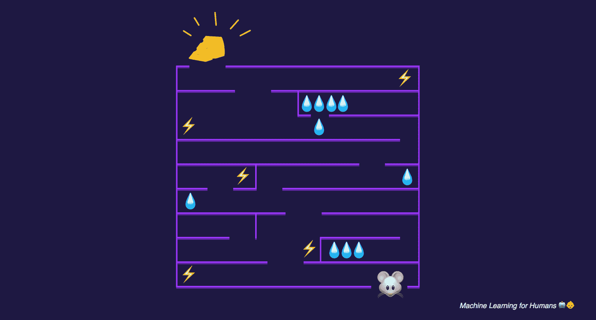
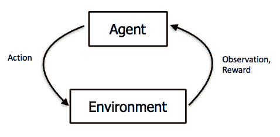
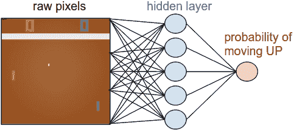
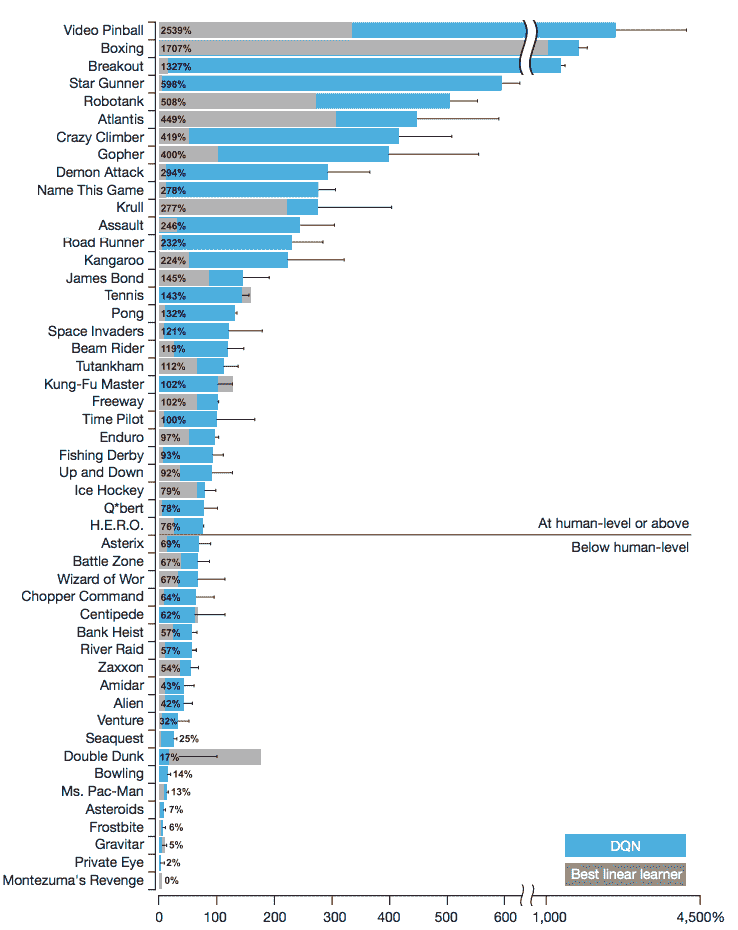

# 五、强化学习

> 原文：[Machine Learning for Humans, Part 5: Reinforcement Learning](https://medium.com/machine-learning-for-humans/reinforcement-learning-6eacf258b265)

> 作者：[Vishal Maini](mailto:ml4humans@gmail.com)

> 译者：[飞龙](https://github.com/wizardforcel)

> 协议：[CC BY-NC-SA 4.0](http://creativecommons.org/licenses/by-nc-sa/4.0/)

> 探索和利用。马尔科夫决策过程。Q 学习，策略学习和深度强化学习。

> 我刚刚吃了一些巧克力来完成最后这部分。

在监督学习中，训练数据带有来自神一般的“监督者”的答案。如果生活可以这样，该多好！

在强化学习（RL）中，没有这种答案，但是你的强化学习智能体仍然可以决定如何执行它的任务。在缺少现有训练数据的情况下，智能体从经验中学习。在它尝试任务的时候，它通过尝试和错误收集训练样本（这个动作非常好，或者非常差），目标是使长期奖励最大。

在这个“写给人类的机器学习”的最后一章中，我们会探索：

+   探索和利用的权衡
+   马尔科夫决策过程（MDP），用于 RL 任务的经典配置
+   Q 学习，策略学习和深度强化学习
+   最后，价值学习的问题

最后，像往常一样，我们编译了一些最喜欢的资源，用于深入探索。

## 让我们在迷宫中放一个机器老鼠

思考强化学习的最简单的语境是一个游戏，它拥有明确的目标和积分系统。

假设我们正在玩一个游戏，其中我们的老鼠正在寻找迷宫的尽头处的奶酪的终极奖励（🧀 + 1000 分），或者沿路的水的较少奖励（💧 + 10 分）。同时，机器老鼠打算避开带有电击的区域（⚡ - 100 分）。

> 奖励就是奶酪

在一些探索之后，老鼠可能找到三个水资源的小型天堂，并且花费它的时间来利用它的发现，通过不断积累水资源的小型奖励，永远不深入迷宫来追求更大的奖励。

但是你可以看到，老鼠会错误迷宫深处的一片更好的绿洲，它就是尽头处的奶酪的终极奖励。

这就产生了探索和利用的权衡。老鼠的一种用于探索的简单策略是，在大多数情况下（可以是 80%），做出最佳的已知动作，但是偶尔探索新的，随机选取的方向，即使它可能远离已知奖励。

这个策略叫做 epsilon 贪婪策略，其中 epsilon 就是“给定全部已知知识的条件下，智能体做出随机选取的动作，而不是更可能最大化奖励的动作”的时间百分比（这里是 20%）。我们通常以大量探索起步（也就是较高的 epsilon 值）。一会儿之后，随着老鼠更加了解迷宫，以及哪个操作产生更大的长期奖励，它会将 epsilon 逐渐降到 10%，或者甚至更低，因为它习惯于利用已知。

重要的是要记住，奖励并不总是立即的：在机器老鼠的示例中，迷宫里可能有狭长的通道，你需要走过它，在你到达奶酪之前可能有好几个决策点。

> 智能体观测环境，做出动作来与环境互动，并接受正向或者负向的奖励。图片来自 [UCB CS 294：深度强化学习](https://rll.berkeley.edu/deeprlcourse-fa15/)，由 John Schulman 和 Pieter Abbeel 讲授

## 马尔科夫决策过程

老鼠迷宫之旅可以形式化为马尔科夫决策过程。这是一个过程，状态到状态的转移拥有特定的概率。我们会通过参考我们的机器老鼠的示例来解释。MDP 包含：

+   有限的状态集。我们的老鼠在迷宫中有可能的位置。
+   每个状态上的可用的动作集。这个就是走廊中的“前进，后退”，或者十字路口中的“前进，后退，左转，右转”。
+   状态之间的转换。例如，如果在十字路口左转，你就会到达一个新的位置。一系列概率可能链接到至少一个状态上（也就是，当你在口袋妖怪游戏中使用招式的时候，可能没打中，造成一些伤害，或者造成足够的伤害来击倒对手）。
+   和每个转换有关的奖励。在机器老鼠的例子中，多数奖励都是 0，但是如果你到达了一个位置，那里有水或者奶酪，就是正的，如果有电击就是负的。
+   0 和 1 之间的折现系数`γ`。它量化了立即奖励和未来奖励的重要性的差异。例如，如果`γ`是 0.9，并且 3 步之后奖励为 5，那么奖励的当前值就是`0.9 ** 3 * 5`。
+   无记忆。一旦知道了当前状态，老鼠的历史迷宫踪迹可以擦除，因为马尔科夫的当前状态包含来自历史的所有拥有信息。换句话说，“了解现在的情况下，未来不取决于历史”。

既然我们知道了 MDP 是什么，我们可以形式化老鼠的目标。我们尝试使长期奖励之和最大。

让我们逐项观察这个和式。首先，我们所有时间中对步骤`t`求和。让我们在这里将`γ`设为 1 并忘掉它。`r(x,a)`是奖励函数。对于状态`x`和动作`a`（也就是在十字路口左转），它会带给你奖励，和状态`s`上的动作`a`相关。回到我们的方程，我们尝试使未来奖励的和最大，通过在每个状态做出最佳动作。

既然我们建立了我们的强化学习问题，并形式化了目标，让我们探索几种可能的解决方案。

## Q 学习：学习动作-分值函数

Q 学习是一种技巧，它基于动作-分值函数求解了要做出哪个动作，这个函数确定了在特定状态下做出特定行为的分值。

我们拥有一个函数`Q`，它接受一个状态和一个动作作为输入，并返回这个动作（以及所有后续动作）在这个状态上的预期奖励。在我们探索环境之前，`Q`提供相同（任意）的固定值。但是之后，随着我们探索了更多环境，`Q`向我们提供动作`a`在状态`s`上的分值的，不断优化的近似。我们在这个过程中更新我们的函数`Q`。

这个方程来自维基百科的 Q 学习页面，很好解释了它。他展示了，我们如何更新 Q 的值，基于我们从环境中得到的奖励：

让我们忽略折现系数`γ`，再次将其设为 1。首先要记住，Q 应该为所有奖励之和，来自所选动作 Q 和所有后续的最优动作。

现在让我们从左到右浏览方程。让我们在状态`st`上做出动作，我们更新我们的`Q(st,at)`的值，通过向其添加一项。这一项包含：

+   学习率`alpha`：这表示在更新我们的值时，我们有多激进。当`alpha`接近 0 时，我们更新得不是很激进。当`alpha`接近 1 时，我们简单将原值替换为新的值。
+   奖励`reward`就是我们通过在状态`st`做出动作`at`得到的奖励。所以我们将这个奖励添加到原有的估计中。
+   我们也添加了估计的未来奖励，它就是`xt+1`上的所有可用动作的，最大的可实现的奖励`Q`。
+   最后，我们减掉原有值`Q`，来确保我们仅仅增加或减少估计值的差（当然要乘上`alpha`）。

既然对于每个状态-动作的偶对，我们拥有了值的估计，我们可以选取要做出哪个动作，根据我们的动作-选取策略（我们每次不一定选择导致最大预期奖励的动作，也就是使用 epsilon 贪婪探索策略，我们以一定百分比做出随机的动作）。

在机器老鼠的例子中，我们可以使用 Q 学习来找到迷宫中每个位置的分值，以及每个位置上动作“前进，后退，左转，右转”的分值。之后我们可以使用我们的动作-选取策略，来选择老鼠在每一步实际上做什么。

## 策略学习：状态到动作的映射

在 Q 学习方式种，我们习得了一个分值函数，它估计了每个状态-动作偶对的分值。

策略学习是个更直接的替代，其中我们习得一个策略函数`π`，它是每个状态到最佳对应动作的直接映射。将其看做一个行为策略：“当我观测到状态`s`时，最好执行动作`a`。”例如，一个自动驾驶的策略可能包括：“如果我看到黄灯，并且我离十字路口超过 100 英尺，我应该停下来。否则，继续向前移动。”

> 策略是状态到动作的映射

所以我们习得了一个函数，它会使预期奖励最大。我们知道，什么最擅长习得复杂的函数呢？深度神经网络！

Andrej Karpathy 的 [Pong from Pixels](https://karpathy.github.io/2016/05/31/rl/) 提供了一个杰出的示例，关于习得一个用于 Atari 游戏 Pong 的策略，它接受来自游戏的原始像素作为输入（状态），并输出向上或向下移动拍子的概率（动作）。

> 在策略梯度网络中，智能体习得最优策略，通过基于来自环境的奖励信号，使用梯度下降来调整它的权重。图片来自 <http://karpathy.github.io/2016/05/31/rl/>

如果你打算亲自试一试深度 RL，查看 Andrej 的文章。你会在 130 行代码内实现一个二层的策略网络，并且会学到如何切入 OpenAI 的训练场，它允许你实现并运行你的第一个强化学习算法，在大量游戏上测试它，并且查看它的表现与其它记录相比怎么样。

## DQN，A3C，和深度 RL 中的进展

在 2015 年，DeepMind 使用了一个叫做深度 Q 网络（DQN）的方法，使用深度神经网络近似 Q 函数，以便在许多 Atari 游戏中击败人类：

> 我们展示了深度 Q 网络的智能体，仅接收像素和游戏得分作为输入，能够超越所有以前的算法的表现，并在一组 49 个游戏中，达到专业人类游戏测试人员的相当水平，使用相同的算法，网络架构和超参数。 这项工作弥合了高维感知输入和动作之间的鸿沟，产生了第一个人工智能体，它能够在多种挑战性任务中，学着变得优秀。（[Silver 等，2015](https://storage.googleapis.com/deepmind-media/dqn/DQNNaturePaper.pdf)）

这里是一个截图，展示了在不同领域中，与线性学习器和人类相比，DQN 的位置。

> 这些按照职业人类游戏测试者来正则化：0% = 随便玩玩，100% = 人类的表现。来源：DeepMind 的 DQN 论文，[通过深度强化学习的人类级别控制](https://storage.googleapis.com/deepmind-media/dqn/DQNNaturePaper.pdf)

为了帮助你构建一些直觉，关于这些进展在 RL 研究中产生，这里是一些改进的例子，关于非线性 Q 函数上的尝试，它可以改善性能和稳定性。

+   经验重放，通过随机化之前的观测值的更长的序列，以及对应的奖励，来避免近期经验的过拟合。这个思路由生物大脑启发：例如老鼠走迷宫，在睡觉期间“重放”神经活动的模式，以便提升迷宫中的未来表现。

+   循环神经网络（RNN）扩展的 DQN。当一个智能体只能看到它的直接环境时（也就是机器老鼠只能看到迷宫的特定区域，而一只鸟可以看到整个迷宫），智能体需要记住更大的地图，以便它记住东西都在哪里。这类似于人类婴儿如何发展出“[物体恒存性](https://en.wikipedia.org/wiki/Object_permanence)”（object permanence），来了解东西是存在的，即使它们离开了婴儿的视野范围。RNN 是循环的，也就是，它们允许信息长时间存在。这里是深度循环 Q 网络（DQRN）玩 Doom 的视频，令人印象深刻。

<https://medium.com/media/2286543cfd01ba0ac858ada4857dc635?postId=6eacf258b265>

> 论文：<https://arxiv.org/abs/1609.05521>。来源：Arthur Juliani 的“[使用 TensorFlow 的简单的强化学习](https://medium.com/emergent-future/simple-reinforcement-learning-with-tensorflow-part-6-partial-observability-and-deep-recurrent-q-68463e9aeefc%23.gi4xdq8pk)”系列。

2016 年，仅仅在 DQN 论文的一年之后，DeepMind 发布了另一个算法，叫做 Asynchronous Advantage Actor-Critic（A3C），在训练一半的时间之后，超过了 Atari 游戏的最先进的表现（[Mnih 等，2016](https://arxiv.org/pdf/1602.01783.pdf)）。A3C 是一种行动-评判算法，组合了我们之前探索的两种方式：它使用行动器（一个决定如何行动的策略网络），以及一个评判器（一个 Q 网络，决定什么是有价值的东西）。Arthur Juliani 写了一个不错的，特别关于 A3C 网络是什么样。A3C 现在是 [OpenAI 的 Universe Starter Agent](https://github.com/openai/universe-starter-agent)。

从那个时候之后，就有了无数吸引人的突破 -- 从 AI 发明自己的语言，到教会他们自己在多种[地形](https://deepmind.com/blog/producing-flexible-behaviours-simulated-environments/)中行走。这个系列仅仅涉及了 RL 前沿的表面，但是我希望它可以作为未来探索的起始点。

另外，我们打算分享这个 DeepMind 智能体学习走路的视频...并且带有声音。拿一些爆米花，打开声音，然后兼证人工智能的所有荣耀。

<https://medium.com/media/e7187ecd760a815468c4e79c622dc625?postId=6eacf258b265>

> 😱😱😱

## 练习材料和扩展阅读

### 代码

+   Andrej Karpathy 的 [Pong from Pixels](https://karpathy.github.io/2016/05/31/rl/) 会让你实现并运行第一个强化学习智能体。文章描述了，“我们会学着玩 ATARI 游戏（乒乓），使用 PG，从零开始，来自像素，使用深度神经网络，并且整个东西是 130 行的 Python 代码，仅仅使用 NumPy 作为依赖（[Gist 链接](https://gist.github.com/karpathy/a4166c7fe253700972fcbc77e4ea32c5)）”。

+   下面，我们高度推荐 Arthur Juliani 的 [使用 TensorFlow 的简单强化学习](https://medium.com/emergent-future/simple-reinforcement-learning-with-tensorflow-part-0-q-learning-with-tables-and-neural-networks-d195264329d0)教程。它浏览了 DQN，策略学习，行动-评判方法，以及使用 TensorFlow 实现的探索策略。尝试理解它，之后重复实现涉及到的方法。

### 阅读 + 讲义

+   Richard Sutton 的书，[Reinforcement Learning: An Introduction（强化学习导论）](https://people.inf.elte.hu/lorincz/Files/RL_2006/SuttonBook.pdf)，一本神奇的书，非常值得一读
+   John Schulman 的 [CS294：深度强化学习](https://rll.berkeley.edu/deeprlcourse/)（UCB）
+   David Silver 的[强化学习](https://www0.cs.ucl.ac.uk/staff/d.silver/web/Teaching.html)课程（UCL）

## 到此为止了！

> 如果你到达了这里，这就是我们希望的所有奖励。

> 我们希望你将这个系列看做机器学习的简介。我们在附录中编译了一些我们最喜欢的 ML 资源，如果你准备好来看看兔子洞有多深的话。

> 请不要犹豫，向我们提供思路，问题，反馈，或者你最喜欢的 GIF。

> 下次再见，

> Vishal 和 Samer

---

> 总结

> 这里是一个基础的问题，它启发了这个系列，我们打算也将它给你。

> 作为人类，我们的目标函数是什么？我们如何定义，我们在现实生活中使其最大化的奖励？在基本的快乐和痛苦中，我们的奖励定义也倾向于包含混乱的事情，像是正确和错误，满足，爱情，精神，和目的。

> 有一些智力领域，在远古时期，它们就致力于“我们的目标函数是什么，或者应该是什么”的问题，它叫做“伦理学”。伦理学的核心问题是：我们应该做什么？我们应该怎么样或者？什么行为是正确或者错误的？答案非常简洁：它取决于你的价值观。

> 随着我们创造出越来越多的高级 AI，它会开始远离玩具问题的领域，像是 Atari 游戏，其中“奖励”仅仅由游戏中赢得了多少积分定义。并且它们越来越出现在现实世界。例如自动驾驶，需要使用更复杂的奖励定义做决策。最开始，奖励可能绑定在一些东西上，例如“安全到达目的地”。但是如果强制让它选择，保持原路线并撞击五个行人，还是转向并撞击一个行人，那么它应该不应该转向呢？如果一个行人是孩子，或者持枪的歹徒，或者下一个爱因斯坦呢？这样如何改变决策，以及为什么？如果转向也会毁掉一些值钱的艺术品呢？突然我们有了更加复杂的问题，当我们尝试定义目标函数，并且答案并不简单的时候。

> 这个系列中，我们探索了为什么难以对计算机显式规定猫是什么样子 -- 如果你问我们自己是怎么知道的，答案很简单，“直觉” -- 但是我们探索了机器视觉的方式，让计算机自己习得这个直觉。与之类似，在机器道德的领域，可能难以准确规定，如何求解一个行为对于另一个的正确性和错误性，但是，或许机器可以用某种方式习得这些值。这叫做“价值学习问题”，并且它可能是人类需要解决的，最重要的技术问题之一。

> 对于这个话题的更多东西，请见 [Risks of Artificial Intelligence（人工智能风险）](https://thinkingwires.com/posts/2017-07-05-risks.html)的概要性文章。以及随着你深入到让机器更聪明的世界中，我们鼓励你记住，AI 的进步是个双刃剑，它的两侧都特别锋利。
