# 前言

在本书中，你将使用一个名为 Machine Learning for Kids 的免费教育工具来构建 ML 项目。本章将介绍该工具的工作原理，你将如何在每个项目中使用它，以及你的父母或老师如何为你设置它。

你可以在[`MachineLearningForKids.co.uk/`](https://MachineLearningForKids.co.uk/)找到《Machine Learning for Kids》。这个网址很长，所以第一次访问时最好保存为书签。

主页如图 2-1 所示。（和所有网站一样，设计会随着时间略有变化，因此它可能看起来与此处所示略有不同。）

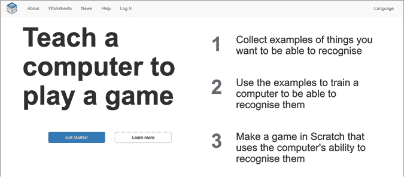

图 2-1:《Machine Learning for Kids》主页

## 登录

本书中每个项目的第一步是访问 Machine Learning for Kids 网站并登录。

点击顶部菜单栏中的**登录**。你将看到如图 2-2 所示的登录界面。

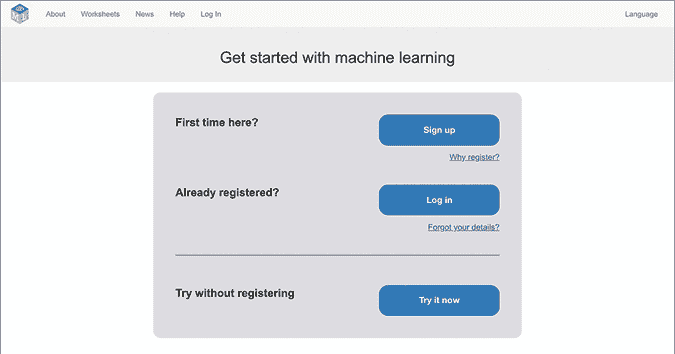

图 2-2: 《Machine Learning for Kids》登录页面

你有两个选择：

1.  登录  如果你的父母或老师已经为你创建了免费账户，点击**登录**并输入你的用户名和密码。登录后，你可以保存你的项目，并在以后回来继续。

1.  现在尝试  如果你还没有账户，点击**现在尝试**。你仍然可以进行项目，但仅限四个小时。这足以完成本书中的任何项目，但你无法稍后回来继续这些项目。**

**注册按钮，在这里你的父母或老师为你创建一个免费的账户，具体内容请参见第 14 页的“创建账户”。**

## 创建一个新的 ML 项目

登录后，你将进入你的项目列表，如图 2-3 所示。你可以随时通过点击顶部菜单栏中的“项目”来返回该列表。

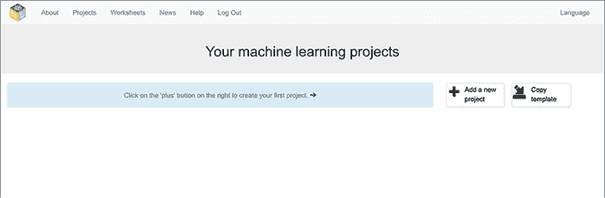

图 2-3: 空的项目列表

要创建一个新项目，请按照以下步骤操作：

1.  点击**添加新项目**（见图 2-3）。

1.  在“项目名称”文本框中输入项目名称，如图 2-4 所示。

    书中的每一章都会建议项目名称，但如果你喜欢，也可以在这里输入不同的名称。

    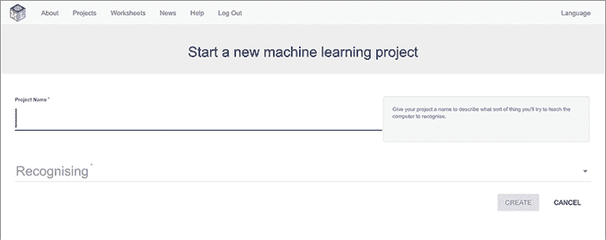

    图 2-4: 创建一个新的 ML 项目

1.  点击**识别**，如图 2-4 所示。你应该会看到一个下拉列表，列出了不同类型的 ML 项目（图 2-5）。在这里，你可以选择想要教计算机识别的类别（例如文本或图片）。书中的每个项目都会告诉你在这里选择哪个选项。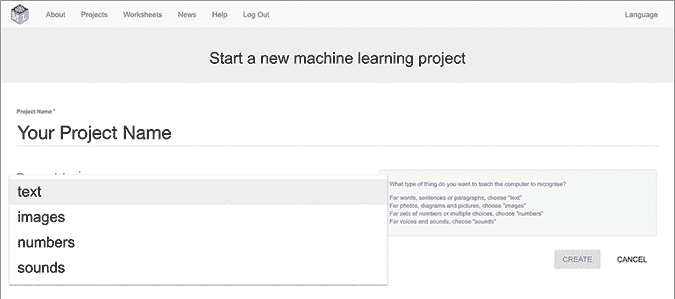

    图 2-5: 选择 ML 项目的类型

1.  点击**创建**。

1.  系统会带你返回项目列表，如图 2-6 所示。点击你刚创建的项目名称以开始。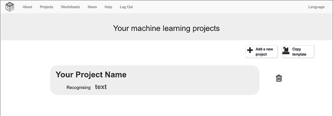

    图 2-6: 更新后的项目列表

## 机器学习项目的阶段

每个项目有三个主要阶段：训练、学习与测试和制作（见图 2-7）。

你可以通过点击蓝色按钮切换到每个阶段。项目说明会告诉你何时进入每个阶段。

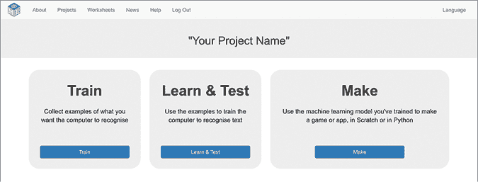

图 2-7: 机器学习项目的阶段

### 训练

在训练阶段，你将收集计算机需要学习识别的示例。

你将为每个子类别创建一个桶，让计算机学习识别。每个桶都有一个灰色的边框，如图 2-8 所示。

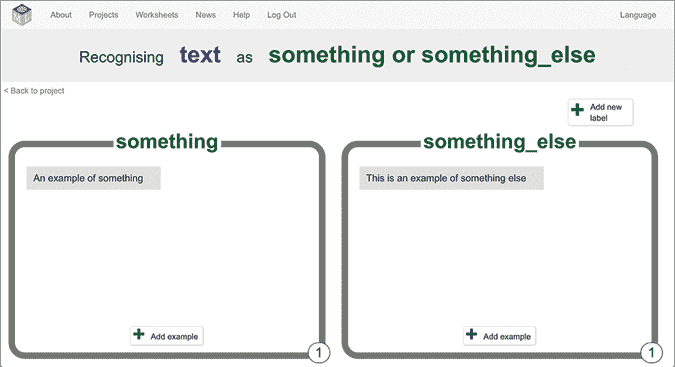

图 2-8: 训练阶段

接下来，你将为每个桶填充示例。对于文本项目，这意味着收集属于每个子类别的写作示例。在图 2-8 中，桶包含了*某些*和*其他某些*子类别的文本示例。（在实际项目中，对于文本子类别*好*，你可能会添加赞美的示例，而对于文本子类别*恶意*，你可能会添加侮辱的示例。）对于图像项目，你将为每个桶填充说明该子类别的图片示例。对于声音项目，你将收集符合该子类别的声音录音示例。

每个桶右下角的数字是一个方便的计数器，显示你已收集的示例数量。

如果你不小心将一个示例添加到桶中并想将其删除，将鼠标指针移到该示例上，然后点击红色的 X。

如果你想删除整个桶，包括所有训练示例，将鼠标指针移到桶的右上角，然后点击红色的 X。请确保这样做，因为一旦删除桶，就无法恢复！

### 学习与测试

一旦你收集了足够的示例，你就可以开始用它们来训练一个机器学习*模型*了。（下一章将进一步讲解模型的内容。）

要开始训练过程，点击**训练新的机器学习模型**（见图 2-9）。

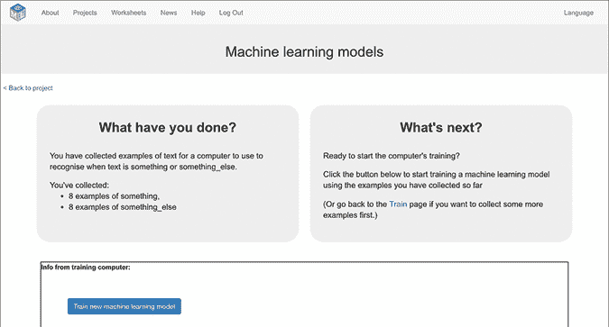

图 2-9: 训练模型

这个过程需要多长时间取决于项目的类型和你收集的示例数量。图像项目比文本项目需要更长时间（因为计算机理解图像比理解文本或数字要困难得多）。你的示例越多，训练时间就越长。有时，机器学习计算机服务器会很忙，可能需要稍长的时间。

训练过程可能需要 30 秒，也可能需要几分钟。请耐心等待！页面底部有一个小测验，可以在等待时尝试。

如果你没有收集足够的示例，你将看不到“训练新机器学习模型”按钮。请返回到训练阶段添加更多示例。

### 制作

一旦你拥有了机器学习模型，你就可以用它来创建项目。

你可以构建不同类型的项目，但本书中的所有项目都使用 Scratch 3。点击**Scratch 3**，如图 2-10 所示。

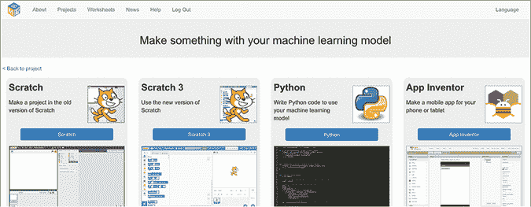

图 2-10: 创建机器学习项目

现在你准备好开始本书中的项目了！但请记住，如果你想使用“登录”选项（而不是“立即试用”），以便保存你的项目，你需要请一位成年人为你创建一个账户。让我们现在来看看如何操作。

## 创建账户

创建账户是免费的，只需要一次操作。共有 10 个步骤，注册过程最多可能需要 10 分钟。此部分涵盖了你的家长、教师或编程俱乐部领导需要遵循的说明。

1.  点击**注册**（如图 2-2 所示）。

1.  点击按钮确认你是家长、教师或编程俱乐部领导。

1.  在“创建一个未管理的班级账户”下点击**注册**。这意味着你将负责你的账户并自行设置。

1.  填写图 2-11 中显示的表格。选择一个用户名并输入一个可以联系到你的电子邮件地址。你还可以选择性地描述你打算如何使用这个网站。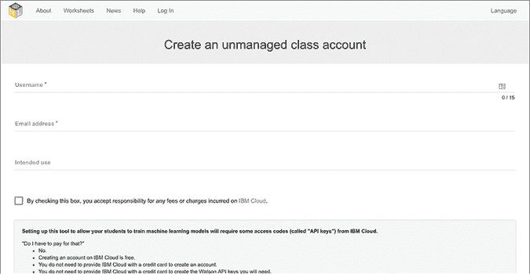

    图 2-11: 创建家长/教师账户

1.  你将收到一封电子邮件，以验证你的电子邮件地址。在继续下一步之前，请点击电子邮件中的链接。

1.  一旦使用家长/教师账户登录，你将可以访问图 2-12 中显示的管理页面。点击顶部菜单栏中的**教师**，进入管理页面。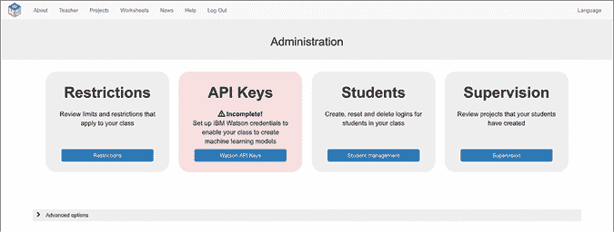

    图 2-12: 家长/教师界面

1.  点击**限制**，查看你账户的默认限制。一些限制可以根据你的偏好进行修改。

1.  点击**API 密钥**，输入来自 IBM Cloud 的代码，这些代码将为你的项目提供机器学习技术。你需要一个 Watson Assistant 的 API 密钥。

    要创建这些代码，你需要在 IBM Cloud 上创建一个免费账户。Watson Assistant 密钥代码无需收费。

    如果你不习惯面向软件开发者的网站，IBM Cloud 网站可能会让你感到有些困惑。[`machinelearningforkids.co.uk/apikeys-guide/`](https://machinelearningforkids.co.uk/apikeys-guide/)上的逐步指南会详细解释该如何操作。**

***   点击**学生**，为将进行本书项目的学生创建用户名。如果有多个学生将一起构建这些项目，你可以创建多个用户名。

    学生无需使用真实姓名或提供任何联系信息。

    学生的用户账户比教师的账户简单。学生不需要担心 IBM 的 API 密钥或任何其他技术细节。

    如果他们忘记了密码，你可以在学生页面为他们重置密码。

    +   点击**监督**查看学生创建的项目列表。

    除非有很多学生同时在使用本书，否则你不太可能达到你所添加 API 密钥的限制。如果发生这种情况，你将能够看到哪些项目正在使用这些 API 密钥。**

**## 你学到了什么

《儿童机器学习》是你将在本书中使用的免费工具。该工具会引导你完成 ML 项目的主要阶段。项目说明将明确告诉你在每个阶段该做什么，以及何时进行下一阶段或返回上一个阶段。

如果你想保存你的项目，你需要让一个成年人为你创建一个账户。创建账户稍微有点复杂，可能需要大约 10 分钟，但这个过程是免费的，只需做一次，并且有详细的在线说明。****
