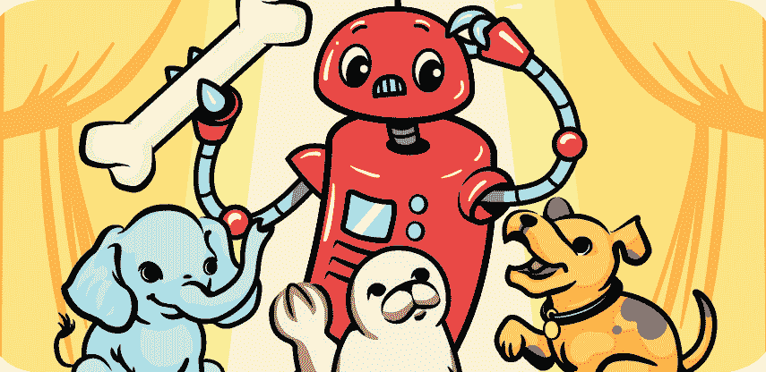

# 第一章：分类动物照片

我们都喜欢图片。每年我们拍摄超过一万亿张数字照片，这还不包括我们制作的其他类型的图片，如绘画和画作。

使用计算机对图片进行排序并帮助我们找到需要的图片，这叫做*图像识别*。为了创建一个图像识别系统，我们收集大量相同主题的图片。然后，我们使用这些图片来训练一个 ML*模型*，它能够识别这些图片的共同点，并利用这些信息来识别新的图片。

*例如，如果我们想训练计算机识别小猫的照片，我们会收集大量小猫的照片。ML 系统通过这些照片学习小猫照片中常出现的形状、模式和颜色。然后，模型可以识别照片中是否有小猫。*

人们每天都在使用图像识别技术。在线照片共享工具用它来帮助整理我们上传的照片。网站用它来描述照片的内容，帮助视力障碍的人即使看不见照片，也能知道照片里有什么。社交媒体网站用它来识别我们发布的照片中的朋友和家人的面孔。公司用它来跟踪他们的 logo 或产品何时出现在网上的照片中，以便了解他们在社交媒体上的讨论情况。更重要的是，医生用它来帮助识别患者扫描和照片中的医疗状况。医生需要记住许多不同的疾病症状和体征，因此图像识别系统可以帮助他们识别照片中的皮肤肿瘤或细胞显微照片中的癌症。

在本章中，你将通过训练一个 ML 模型来创建自己的图像识别系统，用于识别和自动分类动物照片。让我们开始吧！

## 构建你的项目

首先，选择两种你希望计算机识别的动物。对于本章，我选择了牛和羊，制作一个农场主题的 Scratch 项目（参见图 3-1）。你可以选择任何两种动物，只要你能轻松找到它们的许多照片。

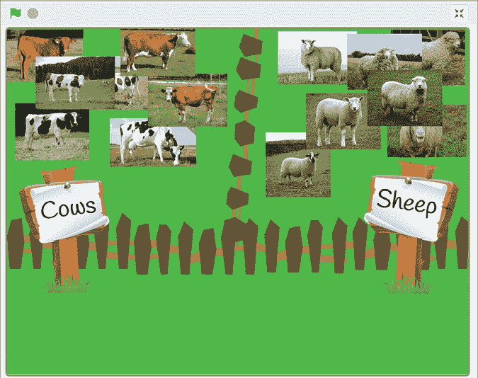

图 3-1: 将动物照片分类成不同的组

### 训练你的模型

为了训练计算机识别你选择的两种动物的不同图片，你需要收集大量这些动物的图片，并利用这些图片来训练一个 ML 模型。

1.  创建一个新的 ML 项目，输入`动物分类器`作为项目名称，并设置其学习识别图片。

1.  点击**训练**，如图 3-2 所示。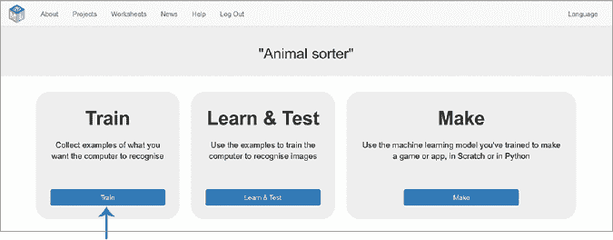

    图 3-2: 训练是 ML 项目的第一阶段。

1.  点击**添加新标签**（参见图 3-3）。然后输入你选择的第一种动物的名称。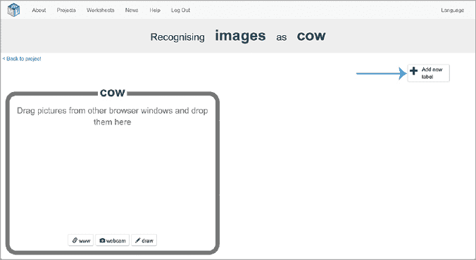

    图 3-3: 点击**添加新标签**来创建一个新的训练示例桶。

1.  在你的网页浏览器中打开第二个窗口（通常通过选择**文件**▶**新建窗口**），并将两个窗口并排放置，如图 3-4 所示。在第二个窗口中，搜索第一种动物的照片。在我的案例中，我搜索了牛的照片。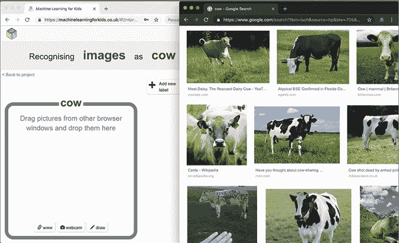

    图 3-4: 将两个网页浏览器窗口并排放置。

1.  从搜索窗口中拖动一张照片，放入你的第一种动物的训练桶中。你应该在训练桶中看到这张照片的缩略图，如图 3-5 所示。如果你没有看到它，尝试再次拖放该照片。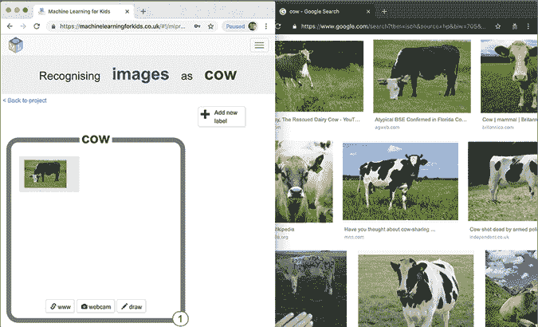

    图 3-5: 将牛的照片放入我的训练桶

1.  重复步骤 5，直到你拥有至少 10 张该动物的不同照片，如图 3-6 所示。

    图 3-6: 我的用于识别牛的照片的训练数据

1.  重复步骤 3 到 6，直到你为每种动物收集到至少 10 张不同的照片，如图 3-7 所示。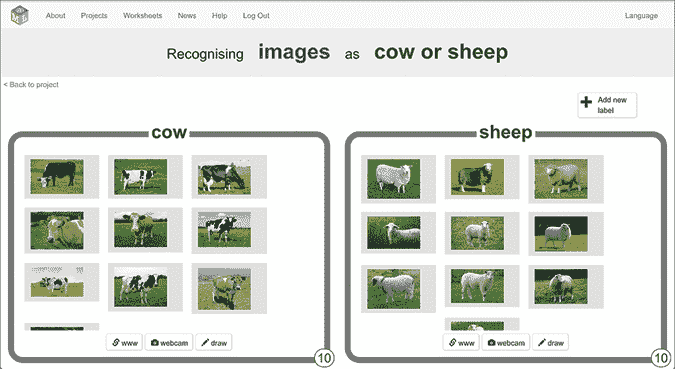

    图 3-7: 我的农场主题项目的训练数据

1.  点击屏幕左上角的**返回项目**。

1.  点击**学习与测试**（见图 3-8）。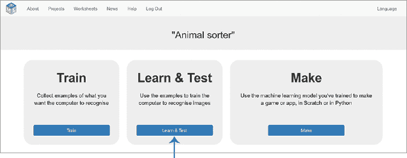

    图 3-8: 学习与测试是机器学习项目的第二个阶段。

1.  点击**训练新的机器学习模型**（见图 3-9）。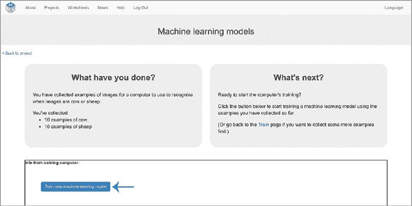

    图 3-9: 点击**训练新的机器学习模型**开始训练。

    计算机会使用你收集的示例学习每种动物照片的共同特征。这可能需要几分钟，但你可以在等待时继续使用第二个网页浏览器窗口进行下一个步骤。

### 准备你的项目

为了测试你的机器学习模型，你需要一些新的照片，这些照片没有用于训练。计算机会使用你从训练样本中学到的内容，尝试在这些新照片中识别你选择的两种动物。然后，你将创建一个 Scratch 项目来测试你的模型的表现。

1.  搜索你选择的动物的更多照片，并将它们保存到你的计算机中。要保存照片，右键点击并选择**保存图片**或**另存图片为**，如图 3-10 所示。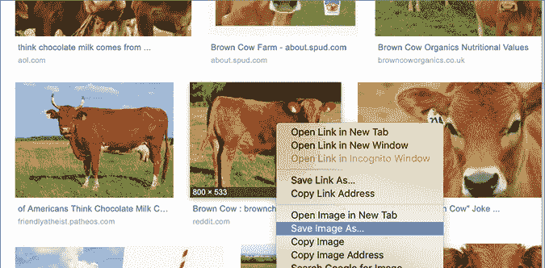

    图 3-10: 将测试照片保存到计算机

1.  确保每种动物至少有五张测试照片，如图 3-11 所示。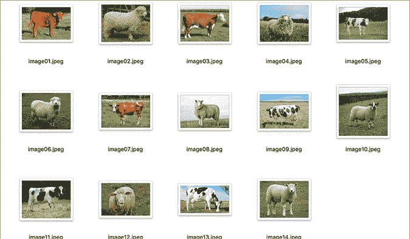

    图 3-11: 我的牛和羊测试照片文件夹

1.  点击屏幕左上角的**返回项目**。

1.  点击**制作**（见图 3-12）。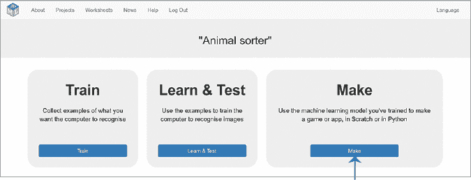

    图 3-12: **制作**是机器学习项目的第三个阶段。

1.  点击 **Scratch 3**，然后点击 **在 Scratch 3 中打开** 以在新窗口中打开 Scratch。

    你应该会在工具箱中看到代表你 ML 模型的新模块，如 图 3-13 所示。

    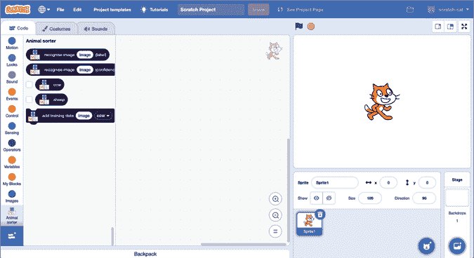

    图 3-13: 新的模块将自动添加到你的 ML 项目中的 Scratch 工具箱。

1.  为你的项目创建一个背景。

    在 Scratch 窗口的右下角，将鼠标指针移动到选择背景图标上，如 图 3-14 所示。

    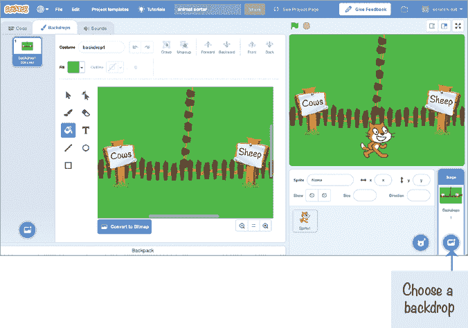

    图 3-14: 我的农场背景，用于将牛和羊分成两组。

    这里有几种选择。如果你不喜欢绘画，可以点击 **选择背景** 来选择默认背景，或者点击 **上传背景** 来使用互联网中的图片。要为你的动物设计自己的背景，点击 **绘画** 并使用代码画布左侧的绘图和上色工具，在*绘画编辑器*中进行创作。

    无论你选择哪种选项，都要确保为每种动物类型在背景中添加清晰标记的区域。

    我选择了农场动物，所以我画了一个农场场景，并标注了“牛”和“羊”两个标志。你可以画一些与所选动物相匹配的东西。例如，如果你选择了狗和猫，可以画一个宠物店。如果你选择了狮子和大象，可以画一个动物园。

1.  *点击猫精灵，然后在屏幕左下角，将鼠标指针移动到选择服装图标上。点击 **上传服装**，如 图 3-15 所示。*

**选择你在步骤 2 中保存的所有测试照片，一次性上传所有照片。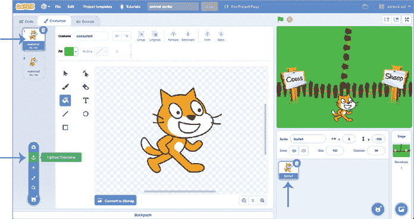

    图 3-15: 点击 **上传服装** 来添加你的测试照片。你可以从左侧的服装面板中删除猫的服装。

    +   如果你漏掉了某些测试照片，点击 **上传服装** 再次上传，直到你上传了步骤 2 中的所有测试照片。

    我们不需要 Scratch 猫的服装，所以你可以删除它们。在最左边的*服装面板*中（见 图 3-15），点击服装，然后点击右上角的垃圾桶图标删除它。

    确保为同一个精灵上传服装，如 图 3-16 所示。不要将每张照片作为一个新精灵上传。

    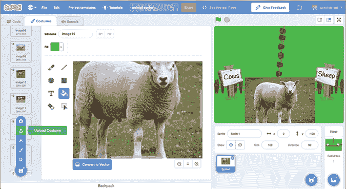

    图 3-16: 上传额外的服装到*同一个*精灵。

    +   点击 **代码** 标签，复制 图 3-17 中显示的脚本。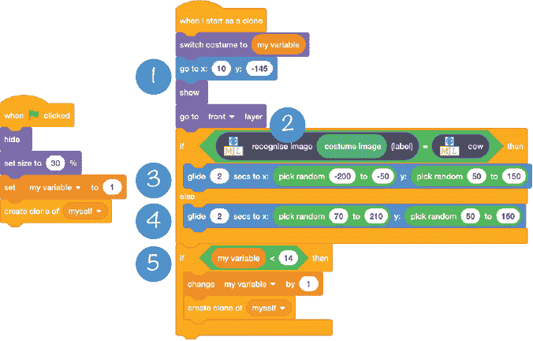

    图 3-17: 排序动物照片的示例代码*

*这段代码将遍历你所有的测试照片服装，利用你的 ML 模型识别动物并将其移到正确的区域。

1.  `go to x: 10 y: -145` 块 1 设置了每张照片的起始位置。这个脚本将从屏幕底部中间开始每张照片。调整这些坐标以适应你的背景的起始位置。

1.  `recognise image` 块 2 使用你的机器学习模型来识别照片。

1.  `glide to x: pick random -200 to -50 y: pick random 50 to 150` 块 3 将照片移动到屏幕左上角的随机位置。调整这些坐标，以使你的第一类动物的照片出现在背景上的位置。

1.  `glide to x: pick random 70 to 210 y: pick random 50 to 150` 块 4 将照片移动到屏幕右上角的随机位置。调整这些坐标，以使你的第二类动物的照片出现在背景上的位置。

1.  `if my variable is < 14`5 中的数字指的是你有多少张测试照片。将这个值设置为你在第 2 步保存并在第 8 步上传的测试服装数量。我有 14 个服装在我的测试精灵中，所以我的脚本会处理 14 张测试照片。

### 测试你的模型

要测试你创建的模型，请点击左上角的绿色旗帜，正如图 3-18 所示。你的模型会将测试照片分类为两组动物。

计算你的模型将多少张照片移到正确的一侧。这是衡量你的项目如何将两种动物的照片分类的简单方法。

图 3-18: 识别照片并将其分类

如果你的模型出错很多，你可以尝试通过更多的训练样本来改进它。返回训练阶段，拖入更多每种动物的照片。然后回到学习与测试阶段，训练新的改进过的机器学习模型。再次运行你的 Scratch 脚本，看看新模型是否能更好地分类你的测试照片。

## 审查和改进你的项目

你已经成功训练了一个机器学习模型来识别动物的照片！这个项目并不是基于规则的。你没有描述不同动物的外观，也没有给计算机提供具体的识别指令。相反，你使用机器学习训练计算机去做这件事。这个方法叫做*监督学习*，*因为你通过准备训练样本集来监督这个过程，让计算机使用这些样本。*

*只要你的测试照片与训练照片相似，你的模型应该能正常工作。然而，如果你用与训练照片有所不同的图片来测试模型，你可能会得到不同的结果。*

例如，我尝试将我 Scratch 项目中的服装替换为牛和羊的卡通插图，而不是照片。然后，我通过点击绿色旗帜重新运行了代码。正如你在图 3-19 中看到的，我的新模型错误很多。

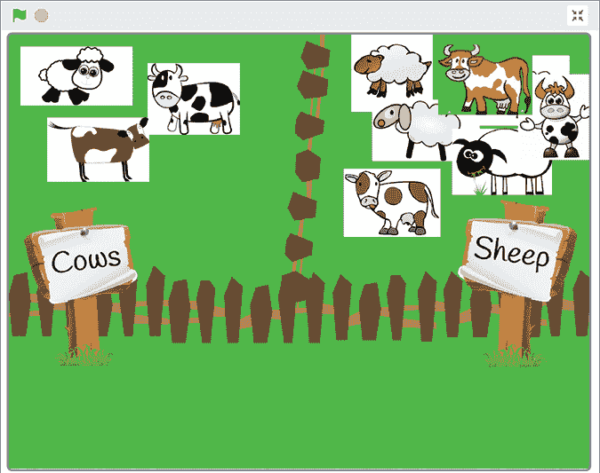

图 3-19: 如果测试输入与训练输入不相似，机器学习模型会出错很多。

我得到这些结果是因为我的模型从训练照片中学到的模式对帮助它识别卡通画没有用。如果你希望计算机能够识别照片*和*卡通画，你需要同时用这两者来训练它。

返回到训练阶段，并创建一个新的训练示例集，其中包括照片和卡通画，如图 3-20 所示。我在每个桶中收集了 10 张照片和 10 张卡通画示例。

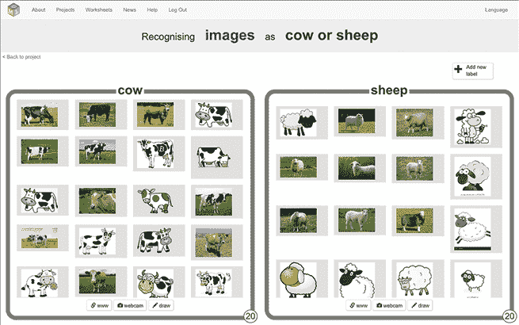

图 3-20: 训练计算机识别照片和卡通画

然后返回到学习与测试阶段，使用你的新训练示例集训练一个新的机器学习模型。这个新示例集应该教会计算机识别照片和卡通画中的模式，这样它就能同时识别两者。图 3-21 展示了我的更新版机器学习模型的表现有多么出色。

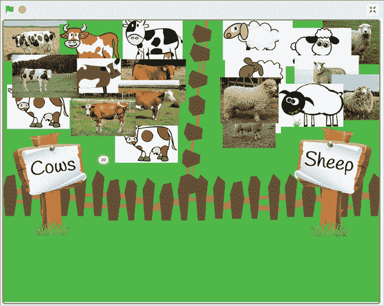

图 3-21: 用混合照片和画作进行测试

如你所见，测试图像越接近计算机从中学习的训练图像，机器学习模型的表现就越好。

你还能做什么其他改进来提升你的模型？

## 你学到了什么

在本章中，你使用机器学习（ML）创建了一个图像识别系统，能够识别并分类动物图片。你学到了一些机器学习项目中的关键原则，比如通过增加训练图像数量来改进结果，并确保这些图像与计算机需要识别的图像相似。

你还学到了如何通过用测试图片测试图像识别系统来衡量它的表现，看看它能正确识别多少张。你亲自尝试过，通过在 Scratch 中创建一个项目来测试你的机器学习模型如何分类一组动物照片。

在下一章中，你将训练另一个图像识别系统，并用它制作一个游戏。你还将了解机器学习项目可能出错的一些方式。***
