# 第二章：与计算机玩剪刀石头布

在第三章中，你使用机器学习创建了一个图像识别系统，可以对动物照片进行分类。你学习了如何通过收集希望计算机识别的图片样本来创建图像识别系统。

在本章中，你将训练一个机器学习模型，识别在剪刀石头布游戏中你做出的不同手势（见图 4-1），然后编程让计算机与你对战。

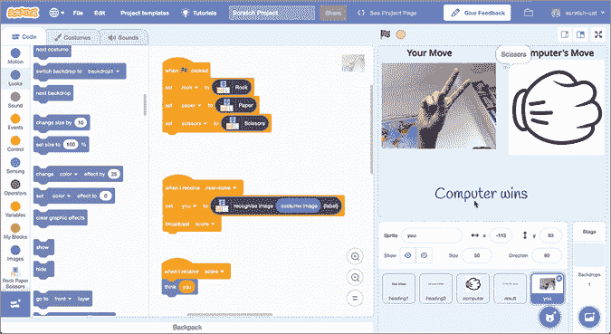

图 4-1: 玩剪刀石头布

开始吧！

## 构建你的项目

对于这个项目，你将拍摄你的手部照片，因此你需要一个网络摄像头。

### 训练你的模型

1.  创建一个新的机器学习项目，将其命名为`Rock Paper Scissors`，并设置为学习如何识别图像。

1.  点击**训练**，如图 4-2 所示。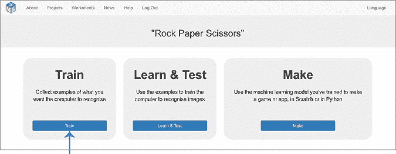

    图 4-2: 训练是机器学习项目的第一阶段。

1.  点击**添加新标签**以创建一个训练桶，并输入名称`Rock`。然后创建两个名为`Paper`和`Scissors`的训练桶，如图 4-3 所示。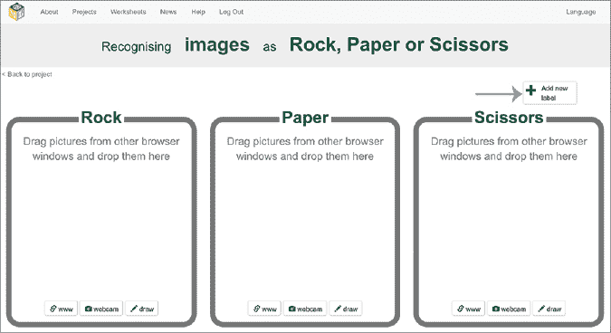

    图 4-3: 点击**添加新标签**以创建你的训练桶。

1.  点击**网络摄像头** ****在**Rock**桶中，并在你的网络摄像头前做出拳头动作，如图 4-4 所示。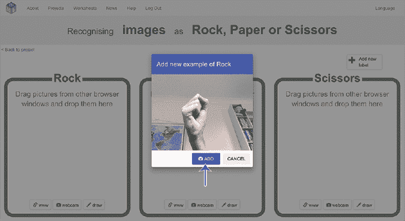

    图 4-4: 使用网络摄像头拍摄你的第一张训练照片。****

*****   当你准备好时，点击**添加**（见图 4-4）。一张拳头照片应该被添加到 Rock 桶中，如图 4-5 所示。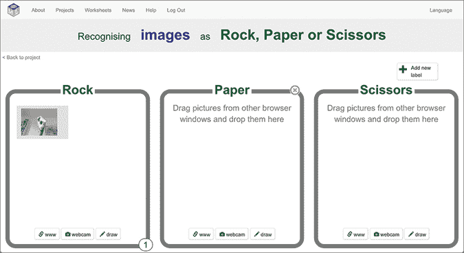

    图 4-5: 你的照片缩略图显示在训练桶中。

    +   使用网络摄像头按钮，重复步骤 4 和 5，为“Paper”和“Scissors”训练桶拍摄照片。继续进行，直到在 Rock 桶中拍摄到 10 张拳头照片，在 Paper 桶中拍摄到 10 张平手照片，在 Scissors 桶中拍摄到 10 张两指照片，如图 4-6 所示。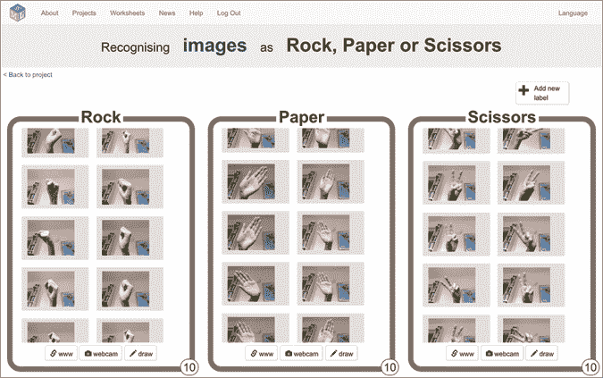

    图 4-6: 剪刀石头布的训练图像 *   点击屏幕左上角的**返回项目**。*   点击**学习与测试**，如图 4-7 所示。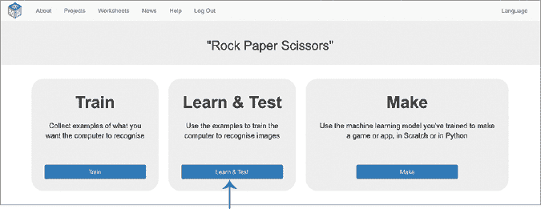

    图 4-7: 学习与测试是机器学习项目的第二阶段。

    +   点击**训练新机器学习模型**，如图 4-8 所示。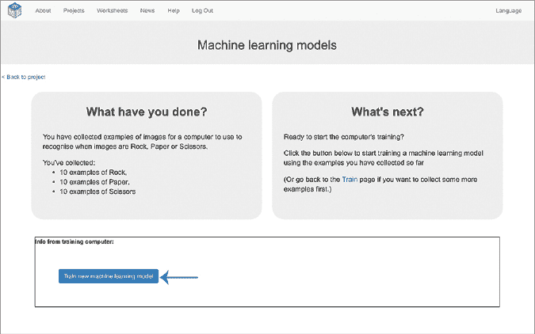

    图 4-8: 点击**训练新机器学习模型**开始训练模型。****

****你拍摄的示例照片将用于训练 ML 模型。计算机会学习每个文件夹中照片的共性，以便能够识别不同的手势形状。这个过程可能需要几分钟，但你可以在等待时继续进行下一个部分，开始准备你的游戏。

### 准备你的游戏

你将在 Scratch 中创建一个脚本，利用你的 ML 模型与电脑玩剪刀石头布。该脚本将使用你的摄像头拍摄你的手势照片，然后你的模型会识别出你手势的形状。

1.  点击左上角的**返回项目**。

1.  点击**制作**。

1.  点击**Scratch 3**，然后点击**在 Scratch 3 中打开**，以打开一个新的 Scratch 窗口。

    你应该会在工具箱中看到代表你的 ML 模型的新积木块，如图 4-9 所示。

1.  在 Scratch 窗口的顶部，点击**项目模板**，如图 4-9 所示。

    这将让你访问各种示例和起始项目，应该能节省你的时间。

    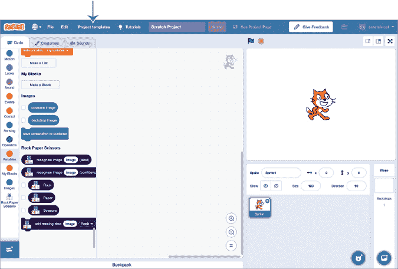

    图 4-9: 从顶部菜单中打开项目模板

1.  在项目模板列表中点击**剪刀石头布**。（你可以在搜索框中输入名称，或者点击**图像项目**以更快找到它。）

    这个模板给了你一个完整的、可工作的剪刀石头布游戏。接下来的步骤将向你展示如何将 ML 添加到 Scratch 项目中，但在开始之前，试着阅读代码，了解它是如何工作的。

1.  点击**你**角色，然后找到`当绿旗被点击`和`当我收到新动作`脚本，如图 4-10 所示。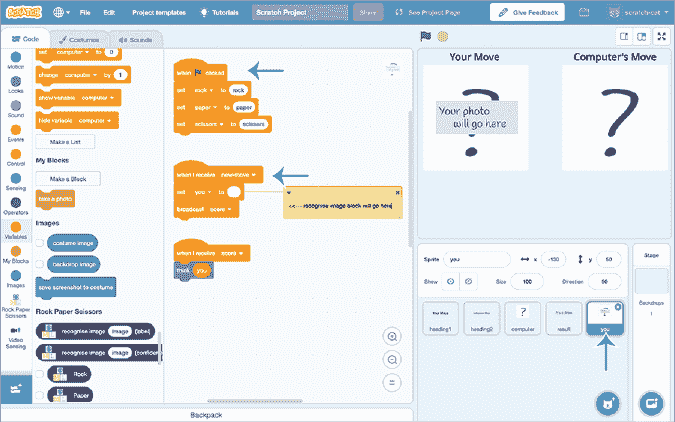

    图 4-10: 找到要修改的脚本，位于**你**角色中。

1.  将代表你的**剪刀石头布**ML 训练文件夹的积木块拖入`当绿旗被点击`脚本中，如图 4-11 所示。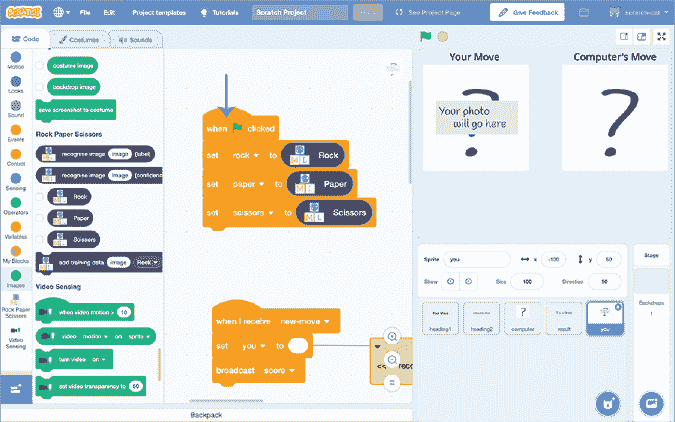

    图 4-11: 更新`当绿旗被点击`脚本，添加你项目的相关积木块。

1.  将`识别图像（标签）`积木块拖入`当我收到新动作`脚本中，然后将`服装图像`积木块拖入该积木块中，如图 4-12 所示。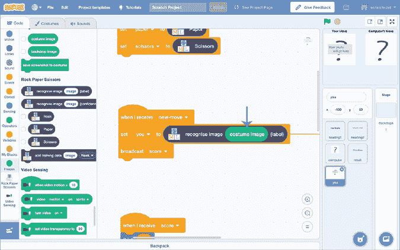

    图 4-12: 更新`当我收到新动作`脚本，添加你项目的相关积木块。

### 测试你的游戏

现在是时候尝试你的项目了！

点击绿旗图标开始与电脑进行剪刀石头布的对战。

将你的手放在摄像头前，形成剪刀、石头或布的手势，然后按下键盘上的 P 键拍照。

计算机会从剪刀、石头和布中随机选择一个，并显示一个卡通图像表示其动作。它将使用你的 ML 模型根据你的手势识别你的动作，然后显示一条信息，说明谁赢了（参见图 4-13）。

图 4-13： 玩石头、剪刀、布

## 审查和改进你的项目

你已经训练了一个机器学习模型来识别三种不同手型的照片！试着实验一下，看看什么能让它表现得很好，什么会让它出错。

记住，机器学习模型并不是从了解“石头、剪刀、布”游戏或你不同手型的含义开始的。它只能从你拍摄的示例照片中的模式中学习。

假设你把所有的石头训练示例照片拍成你的手非常非常接近摄像头，看起来手非常大，而把所有的剪刀训练示例照片拍成你的手远远离开摄像头，看起来手非常小。计算机可能会假设这个大小模式很重要，并学会了大手意味着“石头”，小手意味着“剪刀”。这意味着它可以将任何大手的照片识别为“石头”，不管手型如何。

现在假设你把所有的石头训练示例照片都拍成你的手从左边进入，而所有的布训练示例照片都拍成你的手从右边进入，如图 4-14 所示。计算机可能会假设这个方向模式很重要，并学会了手朝右意味着“石头”，而手朝左意味着“布”。这意味着它可以将任何手型朝右的照片识别为“石头”。

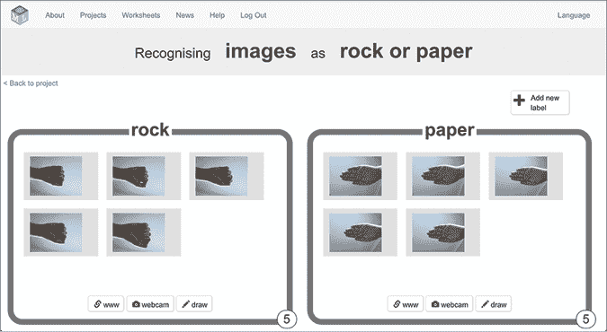

图 4-14： 计算机可以从训练数据中的意外模式中学习。

我们只使用训练桶上的标签来帮助我们组织项目。计算机在寻找训练示例中的模式时并不会考虑这些标签。如果你隐藏了标签，并请一个朋友猜测图 4-14 中每组照片的共同点，他们可能会说：“这些手都是朝右的，而那些手都是朝左的。”机器学习模型的工作方式类似，它们也可能学会识别出误导性的模式。

照片的背景也可能产生类似的影响。我曾经帮助过一个学生，他在创建这个项目时偶然发现了这一点。他的脸出现在所有的石头和布的训练照片中，而在所有的剪刀训练照片中，他的脸和一位同学的脸都会出现。

当他在 Scratch 中测试他的项目时，似乎能很好地识别他的手型，直到我站在他旁边观看。当我站在他旁边时，无论他做什么手势，他的项目几乎总是认为他在做剪刀。

尽管他一开始没有意识到这一点，但他已经训练他的机器学习模型来识别照片中一人或两人的区别。它学会了将两个人的照片识别为“剪刀”。

如果你不希望这些误导性的模式影响你的机器学习模型，最好在你的训练示例中加入**多样性**。当你的训练照片包括大量不同的同一对象的照片时，项目会表现得最好。在拍摄岩石训练照片时，尽量从每个不同的角度和方向拍摄岩石的形状。拍一些近距离的大照片，也拍一些远距离的小照片。如果你能拍摄不同背景的照片，那就更好了。如果你的岩石训练示例之间唯一的共同点是拳头形状，那么计算机就会学会识别这个模式。

**我们将在第十四章学习更多关于如何混淆机器学习模型的内容，但现在请记住：*如果每个训练桶中的照片之间只有一个共同点，那么机器学习模型将只会学会识别这个模式*。

## 你学到的内容

在这一章，你已经训练了另一个机器学习模型来识别照片。在第三章，你用它做了一个任务：整理照片。这一次，你用它来和计算机玩剪刀石头布游戏，让它识别你的手形。这两个项目展示了*图像识别*，*并且是它每天应用的好例子*。

*你已经学到，训练计算机进行图像识别的基本方法是收集示例照片，而且你已经学到了避免训练数据中出现误导性模式的重要教训，这将有助于提高你的结果。*

然而，计算机不仅能学会识别照片中的内容，在下一章你将看到机器学习模型可以学习的其他模式。*******
