# 第三章：识别电影海报

在过去的两章中，你收集了训练图像，创建了一个机器学习系统，通过学习识别训练图像中共同的颜色、形状和图案，从而识别某个物体的图片。

在这一章，你将使用相同的技术训练一个模型，识别图片的风格而不是其内容。例如，如果你将水彩画的样本放入一个训练桶，将钢笔画的样本放入另一个训练桶，你可以训练一个机器学习模型来识别一张图片是水彩画还是钢笔画。

这种技术在现实生活中最常见的例子就是搜索引擎。图像搜索引擎可以识别图像的视觉风格，允许你按类型（如剪贴画、线条图、照片等）筛选图像搜索结果。这些搜索引擎使用一个经过大量不同风格图像示例训练的机器学习模型，能够识别每个搜索结果的类型。

有些人使用机器学习系统来创造全新的图片。这涉及到训练计算机识别某种风格的艺术作品中的模式，然后让计算机利用它所学到的知识生成该风格的新艺术作品。2018 年，一个人工智能系统创作了一幅画，作为艺术作品拍卖，成交价超过了 40 万美元。

这种项目被称为*计算创意*，*并且已经被用来创造各种各样的东西。人工智能系统已经创作了新的音乐作品，甚至发明了食谱和菜肴。*

*在这一章，你将训练一个机器学习模型，该模型可以仅根据一幅艺术作品的图片来识别它的类型。*

想一想某些电影类型的海报有哪些共同点。例如，惊悚片的海报通常有深色背景和大字体。浪漫片的海报通常有浅色背景和花哨的字体。科幻片的海报通常有飞船、星星、行星和黑色背景。

我们都学会了这些模式，往往没有意识到，以至于我们可以仅凭看到电影海报就识别出电影的类型（参见图 5-1）。

在这个项目中，你将训练计算机识别特定类型艺术作品的共同特征。例如，动作电影的海报是否有共同之处？赛车视频游戏的盒装艺术？说唱专辑的封面艺术？你将观察计算机是否能学习识别这些模式，从而仅凭一本书的封面或海报图片，就能识别其类型。

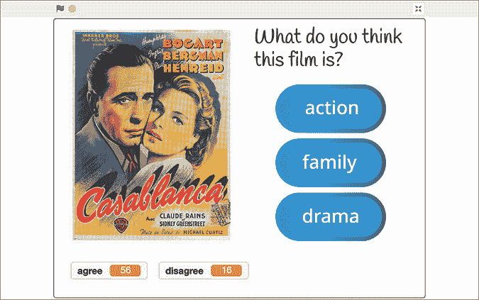

图 5-1： 机器学习模型可以学习识别电影类型。

让我们开始吧！

## 构建你的项目

选择一种可以按类型分组的艺术形式，并且有图形封面或海报来表示。

例如，你可以选择：

+   书籍，通过书籍封面表示书籍，通过书籍封面表示书籍，通过书籍封面表示书籍，通过书籍封面表示书籍，通过书籍封面表示书籍，通过书籍封面表示

+   电影，通过电影海报表示

+   视频游戏，通过盒装艺术作品表示

+   音乐专辑，通过专辑封面表示

你需要收集你所选择的艺术作品的图片，作为本项目的训练示例。寻找按类别分类的书籍、电影、游戏或专辑的网站。如果你选择了书籍，书店或图书馆的网站是很好的训练示例来源。如果你选择了音乐专辑或视频游戏，零售商网站也是不错的选择。

接下来，选择一些你希望训练计算机能够识别的类别。如果你选择的类别差异非常明显，那么训练计算机会更容易。例如，识别动作片和浪漫片的海报差异要比识别动作片和冒险片的海报差异容易。

对于本项目中的截图，我训练了一个机器学习模型来识别三种类型的电影——动作片、家庭片和剧情片——基于它们的电影海报。

一旦你选择了艺术类型和类别，就可以开始训练你的模型了。

### 训练你的模型

1.  创建一个新的机器学习项目，命名为`Judge a book by its cover`，并设置为学习识别图片。

1.  点击**训练**，如图 5-2 所示。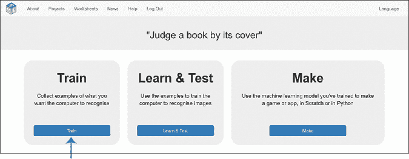

    图 5-2: 训练是机器学习项目的第一阶段。

1.  点击**添加新标签**，如图 5-3 所示，输入你的第一个类别名称。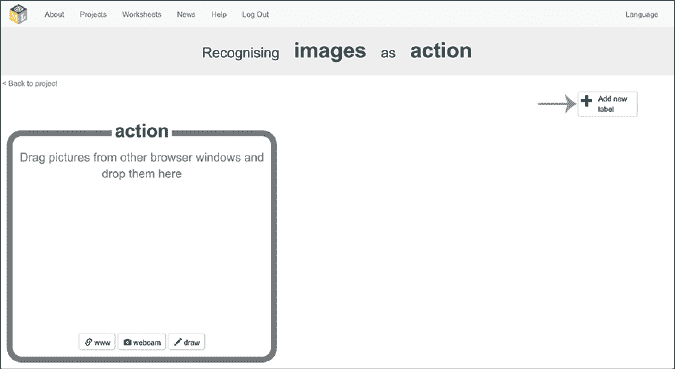

    图 5-3: 点击**添加新标签**为你的类别创建训练桶。

1.  在你的网页浏览器中打开第二个窗口（通常通过选择**文件**▶**新建窗口**），并将两个窗口并排排列，如图 5-4 所示。在第二个窗口中，搜索与你的第一个类别匹配的图片。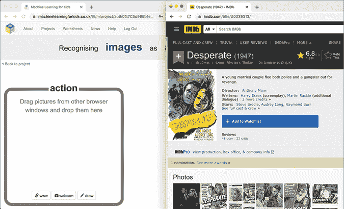

    图 5-4: 将你的两个网页浏览器窗口并排排列。

1.  拖动一张图片（书籍封面、电影海报、游戏盒装或专辑封面）到你项目中的训练桶里，用于你的第一个类别。

    你应该会看到训练桶中的图片缩略图，如图 5-5 所示。如果没有看到，尝试再次拖放图片。

    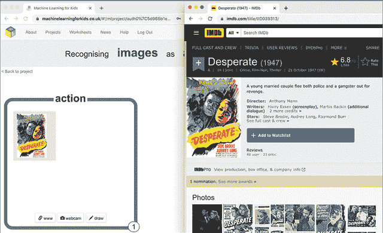

    图 5-5: 我的第一个训练示例，用于识别动作片

1.  重复步骤 5，直到你有至少 10 个该类别的作品示例，如图 5-6 所示。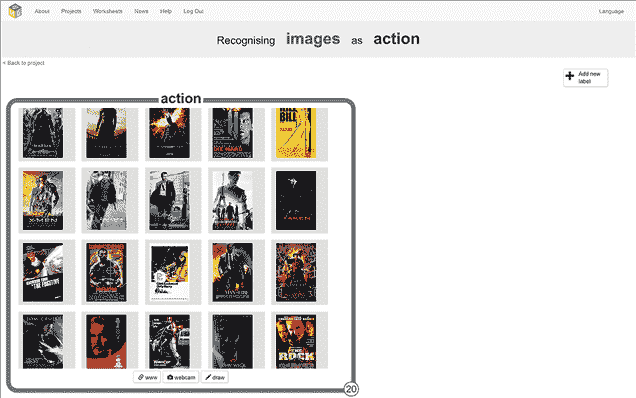

    图 5-6: 动作片海报的训练示例

1.  对您希望您的模型能够识别的所有类别，重复步骤 3 到 6，如图 5-7 所示。

    尝试为每个类别收集类似数量的示例。换句话说，避免在一个类别中有大量示例，而在另一个类别中几乎没有。

    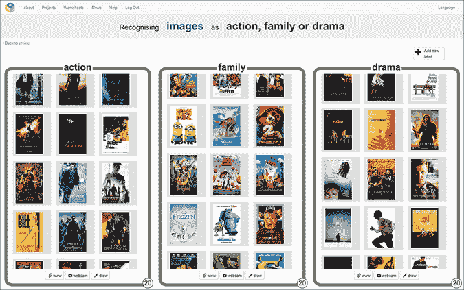

    图 5-7: 用于识别不同类型电影海报的训练示例

1.  点击屏幕左上角的**返回项目**。

1.  点击**学习与测试**，如图 5-8 所示。

    图 5-8: 学习与测试是 ML 项目的第二阶段。

1.  点击**训练新机器学习模型**，如图 5-9 所示。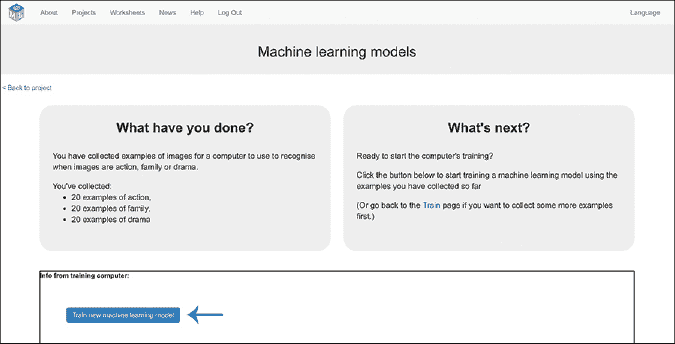

    图 5-9: 点击**训练新机器学习模型**以开始训练过程。

计算机将使用您收集的示例，寻找不同类别封面或海报中的模式。训练模型可能需要几分钟时间，具体取决于您收集的示例数量，但您可以在等待时切换到第二个浏览器窗口继续项目的下一步。

### 准备您的模型

您需要测试您的 ML 模型是否能够识别它之前未见过的图片中的某个类型。为了测试模型，您需要保存一些未用于训练的新图片，并创建一个 Scratch 脚本来用这些图片测试您的模型。

1.  搜索您选择的每个类别的更多图片并将其保存到计算机中。要保存照片，右键点击图像并选择**保存图片**或**图片另存为**，如图 5-10 所示。x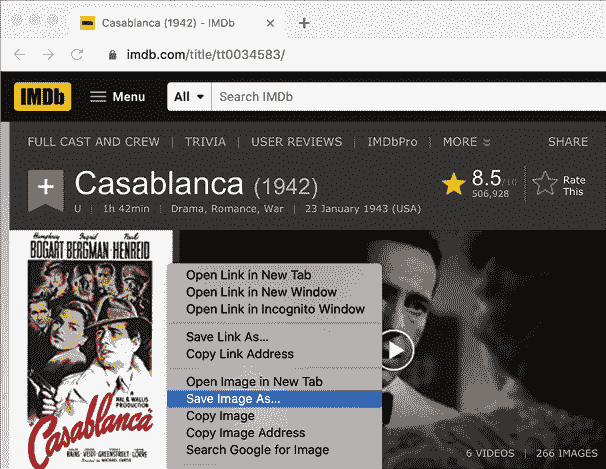

    图 5-10: 将测试照片保存到您的计算机

    将这些测试照片保存在计算机上的一个文件夹中，如图 5-11 所示。保存的照片越多，您可以用来测试您的 ML 模型的图片也就越多。

    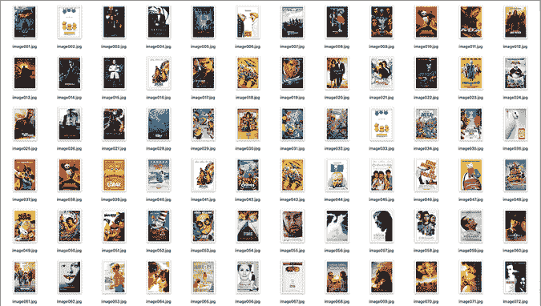

    图 5-11: 准备测试照片

1.  点击屏幕左上角的**返回项目**。

1.  点击**创建**，如图 5-12 所示。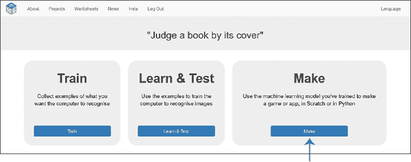

    图 5-12: 创建是 ML 项目的第三阶段。

1.  点击**Scratch 3**，然后点击**在 Scratch 3 中打开**以打开一个新的 Scratch 窗口。

1.  *点击屏幕右下角精灵窗格中的猫精灵（**Sprite1**）。然后，点击左上角的**服装**标签。*

**将鼠标指针移动到屏幕左下角的“选择服装”图标上。点击**上传服装**，然后找到您在计算机上保存下载的测试图片的文件夹。*选择您在第 1 步保存的所有测试照片，将它们作为猫精灵的服装一次性上传。*   更改*猫精灵的名字**Sprite1**，通过在精灵文本框中输入`test images`，如图 5-13 所示。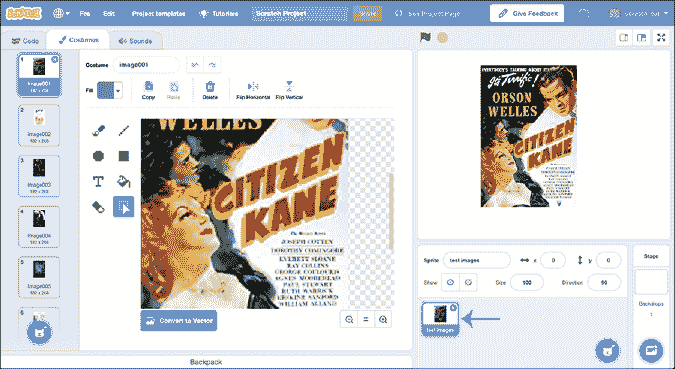

    图 5-13: 创建一个精灵来存放测试图片。* **你需要一些按钮精灵来为你的 Scratch 项目使用。将鼠标指针移动到右下角的选择精灵图标上。  

    要绘制自己的按钮，点击**绘画**以访问绘图和着色工具。如果在绘图时犯了错误，不用担心——只需点击服装名称旁边的蓝色撤销箭头。  

    如果你不喜欢绘图，点击**选择精灵**，从 Scratch 精灵库中选择一个，如图 5-14 所示。  

    为每个类型创建一个按钮。  

    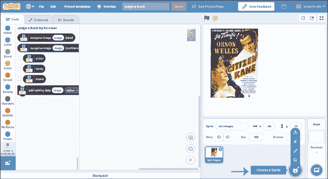  

    图 5-14: 通过点击**选择精灵**访问精灵库。  

    +   将你的按钮精灵重命名为与类型相匹配，如图 5-15 所示。我将我的三个按钮命名为动作、家庭和剧情。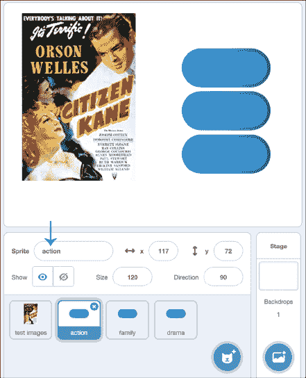  

    图 5-15: 为每个类型创建按钮。* 点击**服装**标签，并选择文本工具（看起来像一个 T）为按钮添加标签。使用填充工具选择标签颜色。使你的标签与类型名称匹配，如图 5-16 所示。* 接下来，你将创建三个变量。点击**代码**标签，点击工具箱中的**变量**，然后点击**创建变量**，如图 5-17 所示。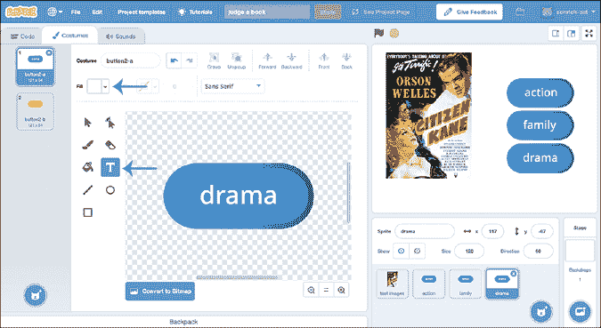  

    图 5-16: 我使用文本和填充工具为每个按钮添加了白色标签。

    其中两个变量用于计算你同意或不同意计算机决策的次数。将第一个变量命名为`agree`，第二个变量命名为`disagree`。  

    第三个变量存储计算机为最新图片选择的类型。将此变量命名为`computer`。  

      

    图 5-17: 点击**创建变量**以创建项目的三个变量。* 确保`agree`和`disagree`变量旁边的复选框已选中。这将它们显示在舞台上，以便在测试项目时查看分数。取消选中**computer**变量旁的框。* 点击**测试图片**精灵（该精灵的服装是你的测试图片）。* 复制图 5-18 所示的脚本。  

    在`switch costume`积木中，使用下拉箭头将服装设置为你的第一张测试图片（在图 5-18 中，我的第一张测试图片叫做*image001*）。  

    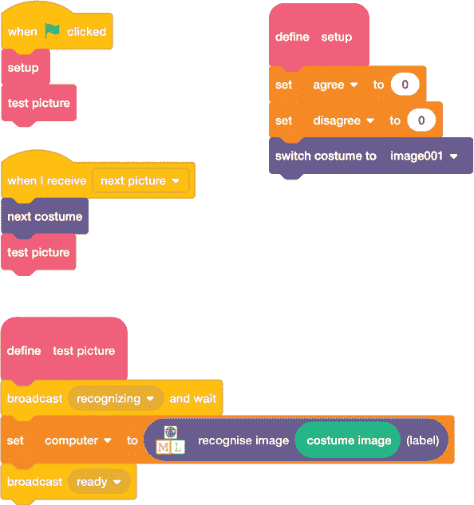  

    图 5-18: 识别电影海报的代码  

    +   点击你第一个类型按钮精灵，如图 5-19 所示。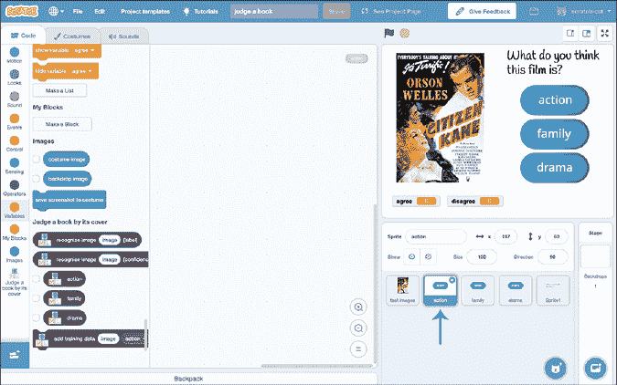  

    图 5-19: 类型按钮 * 复制图 5-20 所示的脚本，将`action`积木更改为与你的第一个类型按钮的标签匹配。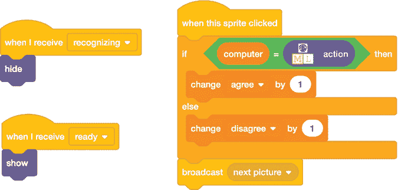  

    图 5-20: 第一个类型按钮的代码  

    当用户点击按钮时，计算机会使用这段代码来猜测类型。如果用户的选择与模型识别的结果匹配，`agree`计数将增加 1。如果不匹配，`disagree`计数则会增加。

    +   点击下一个类型按钮的精灵，并复制步骤 17 中的脚本，如图 5-21 所示。如前所述，将类型与按钮上的标签匹配。对于我的项目，第二个按钮是家庭电影类型的按钮。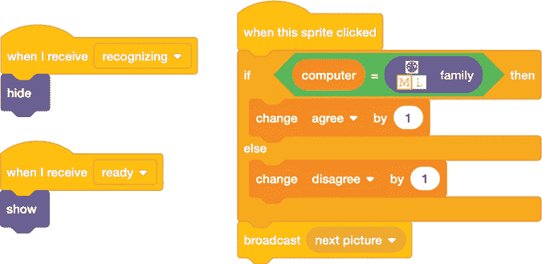

    图 5-21: 第二个类型按钮的代码 *   重复步骤 17，直到你的所有类型按钮都复制了脚本，如图 5-22 所示。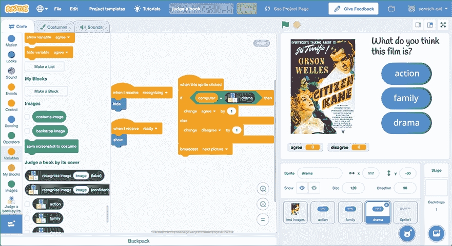

    图 5-22: 每个类型按钮都需要一个脚本副本。**

**现在是测试你的机器学习项目的时候了！

### 测试你的模型

尝试找其他人来测试你的机器学习项目，因为最好是测试项目的人没有看到你下载的测试图片。

一旦他们点击绿色旗帜，Scratch 将展示每张测试图片，并要求他们判断认为该艺术作品属于哪个类型。你的 Scratch 代码将记录他们与机器学习模型一致和不一致的次数，如图 5-23 所示。

图 5-23: 测试你的机器学习模型

要求测试你项目的人员*只*通过图片来决定点击什么，即使他们已经认出这件艺术作品并且知道一些关于它的信息。

## 审查并改进你的项目

在这个项目中，你训练了一个机器学习模型来识别不同类型的图像中常见的视觉风格。

如果你的机器学习模型表现不佳，意见不合的次数远远多于一致的次数，试着在训练阶段向你的训练数据桶中添加更多的例子，然后在学习与测试阶段用这些新例子重新训练机器学习模型。通常来说，机器学习模型从更多的训练例子中学习，结果会更好。

## 你学到了什么

在本章中，你训练了另一个机器学习模型来识别图片。在前两章中，你训练了图像识别系统来识别图片中的物体。这一次，你用一个模型来识别图片的风格，而不是内容。

你也看到，我们常用的一种方法来衡量机器学习系统的效果是将它给出的测试问题答案与人们给出的答案进行比较。

在下一章，你将学习另一个有用的图像识别应用：手写识别。***
