# 第四章：邮件分类

在过去几章中，您一直在训练计算机识别图像。如果计算机知道如何看，便有许多有用的工作可以帮助我们完成。一个这样的工作是*光学字符识别* ***(OCR)*，即计算机在看到大量该字符的例子后，能够识别字母或数字的图片。**

**一台经过训练的计算机可以读取报纸和书籍中的印刷文字。**

当与文本转语音系统结合时，可以大声朗读识别出的文字，OCR 可帮助视力障碍者阅读他们可能无法自己看到的文本。

历史学家、图书馆员和档案管理员使用 OCR 来研究历史书籍和印刷文献。机器学习使得通过几百年前的出版物进行搜索成为可能，因为 OCR 可以识别单词。

在我们的道路上，OCR 系统识别车牌上的字母和数字。*自动车牌识别* *(ANPR)* 用于通过实现快速高效的收费系统来保持交通流畅，并通过识别车辆通过检查点时的速度来提高道路安全性。

商业用 OCR 帮助处理表格和文档。如果您填写表格或写支票，机器学习系统通常会使用 OCR 自动识别您写的内容。

如果您曾经出国旅行，您可能使用过翻译应用。您可以将智能手机对准外语的标牌或菜单，手机会将其翻译成您自己的语言。OCR 用于识别图片中的单词和字母。

OCR 的一个常见应用是帮助分类邮件，这也是我们在本章中要做的事情。您将训练一台计算机识别手写内容，并看看 OCR 如何快速地对信件进行分类。您将在 Scratch 中创建一个邮件分类办公室，可以通过识别信封上写的邮政编码来自动分类信件（参见图 6-1）。

让我们开始吧！

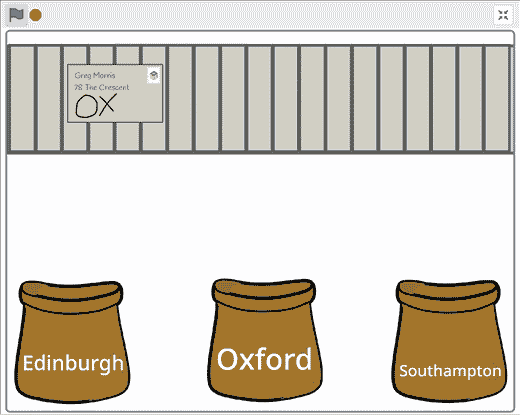

图 6-1: 通过识别邮政编码来排序信件

## 构建您的项目

首先，选择您希望排序办公室能够识别信件的三个大城市。

对于我的截图，我选择了英国的三个城市：爱丁堡、牛津和南安普敦。

接下来，您需要选择一些可以用来识别这些城市的代码。在我所在的英国，这些被称为*邮政编码*。（在美国，它们被称为 ZIP 码。）为了加快这个项目的进度，我使用了每个邮政编码的前几个字母。

对于我的项目，我使用了：

+   EH 作为爱丁堡地址的邮政编码

+   OX 作为牛津地址的邮政编码

+   SO 作为南安普敦地址的邮政编码

如果您在美国，您可以使用州的邮政缩写来代替邮政编码。例如，您可以使用 TX 代表达拉斯的地址，或 MA 代表波士顿的地址。

选择*三个*城市，并为它们选择*三个不同的短编码*来代表它们。

### 训练你的模型

为了训练计算机识别你选择的邮政编码，你需要绘制这些编码的示例，并用它们来训练机器学习模型。

1.  创建一个新的机器学习项目，命名为`Sorting office`，并设置它学习识别图像。

1.  点击**训练**，如图 6-2 所示。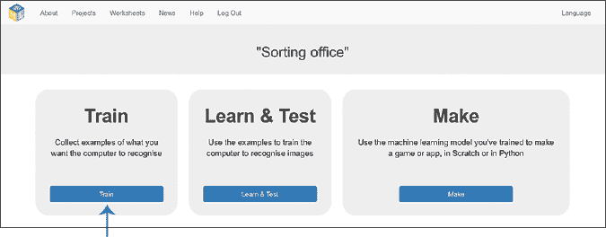

    图 6-2: 训练是机器学习项目的第一阶段。

1.  点击**添加新标签**，如图 6-3 所示。然后输入你第一个城市的名称。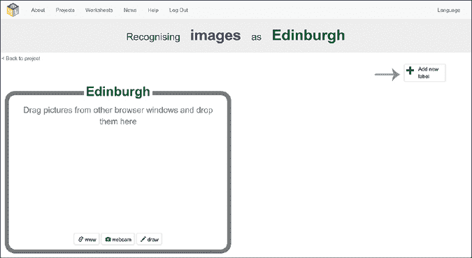

    图 6-3: 点击**添加新标签**来为你的城市创建训练桶。

1.  点击你城市训练桶底部的**绘图**，如图 6-4 所示。

    在弹出的窗口中，在框内绘制你想要训练计算机识别的编码。

    完成绘制后，点击**添加**。

    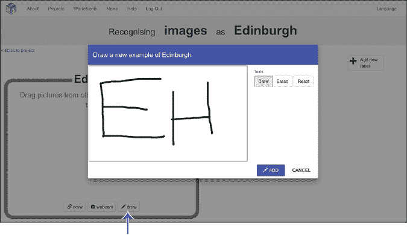

    图 6-4: 点击**绘图**来添加新示例。

1.  重复第 4 步，直到你为第一个城市绘制了至少 10 个手写编码示例，如图 6-5 所示。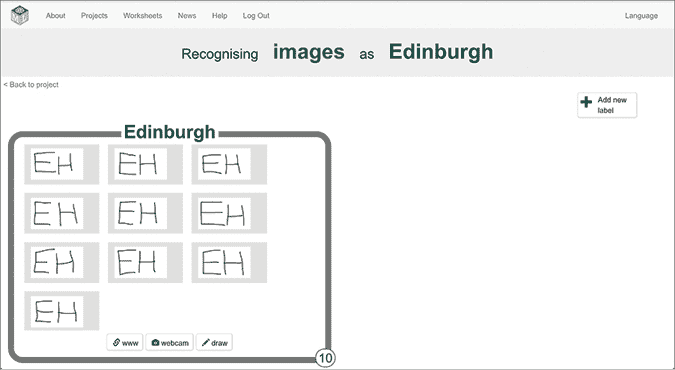

    图 6-5: 识别爱丁堡邮政编码的训练示例

1.  对接下来的两个城市重复步骤 3 到 5，直到每个城市的邮政编码都有至少 10 个示例，如图 6-6 所示。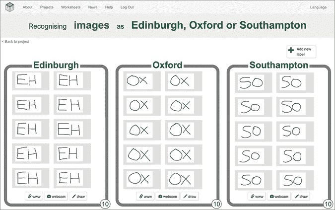

    图 6-6: 三个城市的邮政编码训练示例

1.  点击屏幕左上角的**返回项目**。

1.  点击**学习与测试**，如图 6-7 所示。

    图 6-7: 学习与测试是机器学习项目的第二阶段。

1.  点击**训练新机器学习模型**，如图 6-8 所示。

    计算机将使用你绘制的示例学习如何识别不同城市的编码。由于你所有的示例都是用相同的“笔”并且用相同的颜色绘制的，计算机可能最擅长识别这样写的编码。

    训练过程可能需要几分钟。

    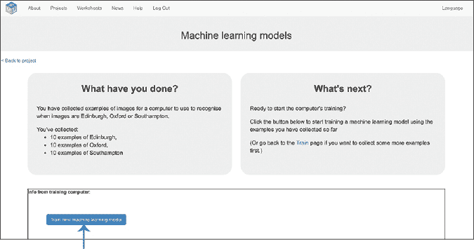

    图 6-8: 训练一个新的机器学习模型来识别邮政编码。

1.  现在是测试你的机器学习模型的时候了！在之前的项目中，你是通过直接进入 Scratch，看看计算机如何识别并整理你从互联网下载或用网络摄像头拍摄的照片来进行测试的。这一次，我们将在这里先测试我们的模型，确保它符合我们的要求，然后再去 Scratch。

    通过点击**通过绘图测试**来测试你的机器学习模型，如图 6-9 所示。尝试为你的城市写编码，看看计算机识别你写的内容的准确度如何。

    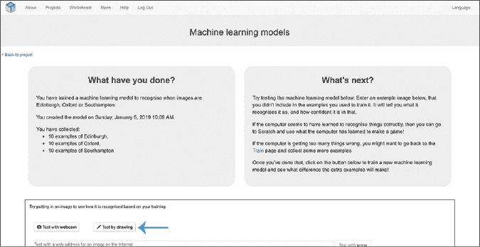

    图 6-9: 测试是机器学习项目中的重要环节。

    如果你没有看到“通过绘图测试”按钮，说明你的机器学习模型尚未完成训练。你可能需要再等一分钟或两分钟。

    如果你对你的机器学习模型识别邮政编码的效果不满意，可以返回训练阶段并添加更多示例。通常，你使用的训练示例越多，机器学习模型的表现就会越好。记得再次点击**训练新机器学习模型**，以便用新的示例更新你的机器学习模型。

### 准备你的项目

现在你将通过在 Scratch 中创建一个虚拟的邮件分拣办公室，进一步测试你的机器学习模型，该分拣办公室使用你的 OCR 系统来分拣信封。

1.  点击屏幕左上角的**返回项目**。

1.  点击**制作**，如图 6-10 所示。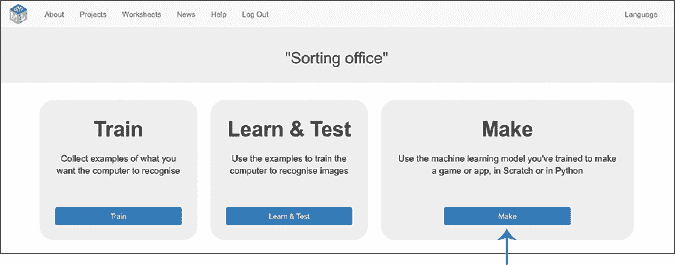

    图 6-10：制作是机器学习项目的第三阶段。

1.  点击**Scratch 3**，然后点击**在 Scratch 3 中打开**以在新窗口中打开 Scratch。你应该能在工具箱中看到一个新部分，如图 6-11 所示，其中包含来自你的排序办公室项目的积木。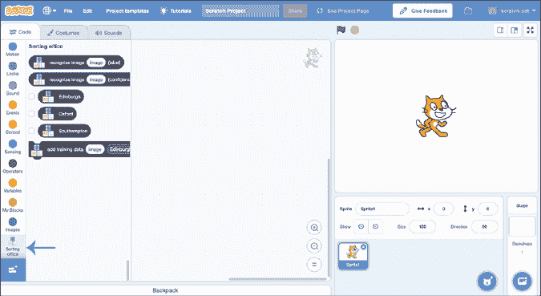

    图 6-11：带有你的机器学习模型积木的 Scratch 3

1.  在 Scratch 窗口顶部，点击**项目模板**，如图 6-12 所示。

    这让你可以访问示例项目和启动代码，帮助你节省时间。

    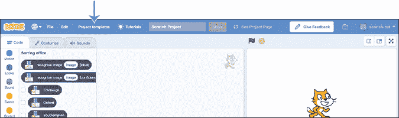

    图 6-12：点击顶部菜单中的**项目模板**。

1.  点击**排序办公室**模板，如图 6-13 所示。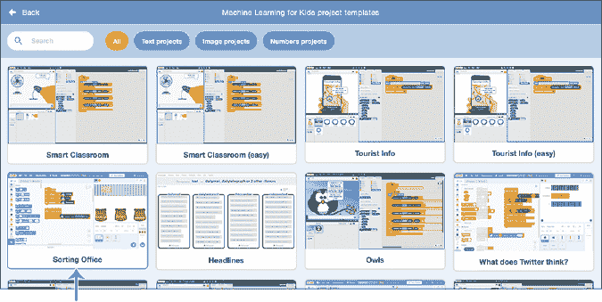

    图 6-13：排序办公室项目模板

1.  点击**舞台**背景，如图 6-14 所示。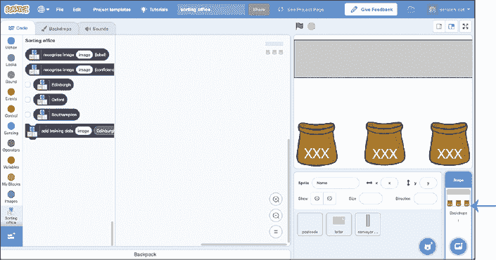

    图 6-14：点击**舞台**背景，进入排序办公室项目。

1.  点击**背景**标签，如图 6-15 所示。

1.  使用文本工具编辑邮件袋上的标签。编辑所有三个袋子，使它们的标签与所选城市的名称匹配。如果城市的完整名称无法容纳，你可以只使用邮政编码。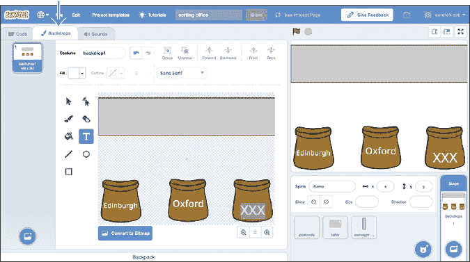

    图 6-15：编辑邮件袋的标签，使它们与你选择的城市相匹配。

1.  点击**邮政编码**精灵，然后点击**服装**标签，如图 6-16 所示。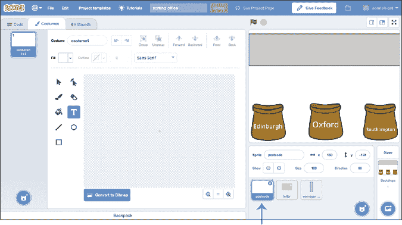

    图 6-16：你将在精灵列表中找到邮政编码精灵。

1.  使用画笔工具在画布上写下其中一个城市的字母。

    如果你将线条风格与之前写的训练示例匹配，效果会更好，因此请将**填充**设置为黑色，并将线条宽度设置为大约**20**，如图 6-17 所示。

    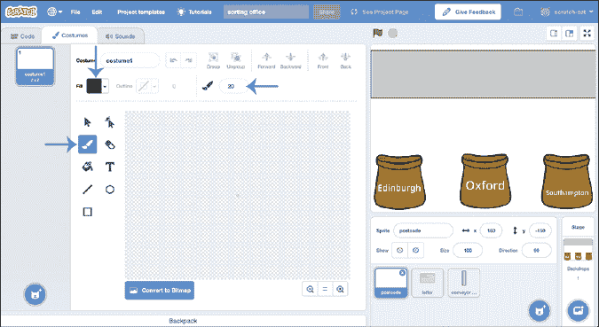

    图 6-17：设置画笔工具以匹配你的训练示例。

1.  完成后，点击左下角的**绘画**按钮，添加一个新服装，如图 6-18 所示。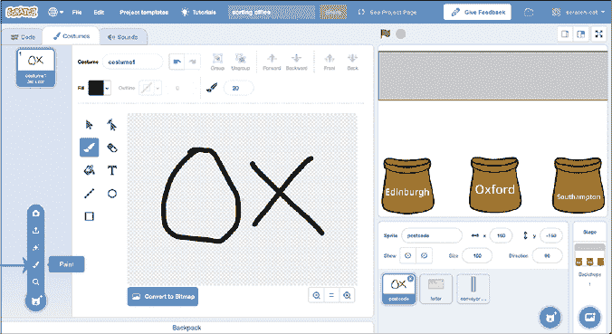

    图 6-18: 点击**绘画**按钮，向邮政代码精灵添加新服装。

1.  重复步骤 10 和 11，直到你在邮政代码精灵中有多个服装。像图 6-19 所示那样多次绘制每个城市的代码。

    如果在绘制时犯了错误，不用担心——只需点击服装名称旁边的蓝色撤销箭头。

    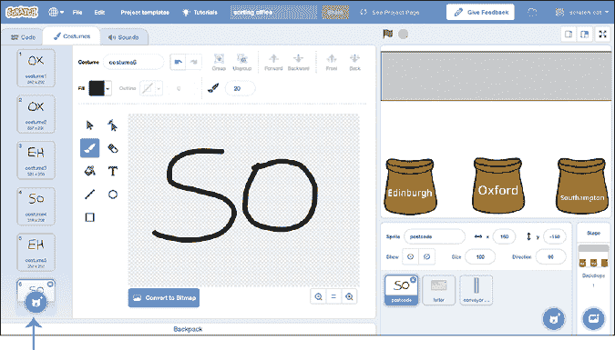

    图 6-19: 在邮政代码精灵中绘制多个测试服装。

1.  点击**代码**选项卡并找到`when Green Flag clicked`脚本，如图 6-20 所示。

    你可能需要滚动一下才能找到这个脚本。它应该位于代码区域的左上角。

    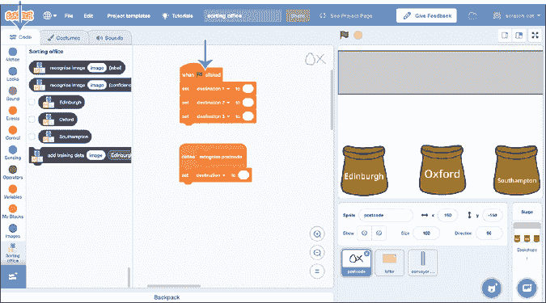

    图 6-20: 在邮政代码精灵中找到`when Green Flag clicked`脚本。

1.  将包含城市名称的积木拖入`when Green Flag clicked`脚本中，如图 6-21 所示。

    在代码区域中有不止一个`when Green Flag clicked`脚本，因此请滚动查找看起来像图 6-21 中脚本的那个。

    重要的是，你要确保与背景中邮袋上的名称匹配顺序。左边的袋子是`destination1`，中间的袋子是`destination2`，右边的袋子是`destination3`。

    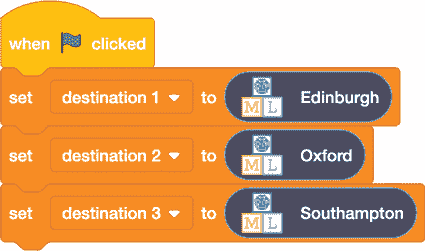

    图 6-21: 确定你项目中城市的名称。

1.  在代码区域中找到`recognise postcode`脚本，它应该紧接在前一步的`when Green Flag clicked`脚本下方，仍然在**邮政代码**精灵上。

1.  将`recognise image (label)`积木拖入`recognise postcode`脚本中，然后将`costume image`积木拖入`recognise image (label)`积木中，如图 6-22 所示。

    图 6-22: 用于识别信封上邮政编码的脚本

### 测试你的项目

现在是时候尝试排序一些信件了！

点击绿旗图标，观看你的机器学习模型运行。

屏幕顶部的传送带将开始运行，你写下的邮政编码信件将开始滚动，像图 6-23 所示。

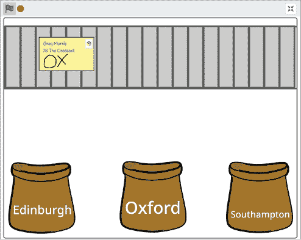

图 6-23: 传送带上的测试信封

当信封在机器学习模型试图识别你写的内容时，它会放大。

一旦它识别了你的图片，脚本将把信封发送到相应的邮袋，像图 6-24 所示。

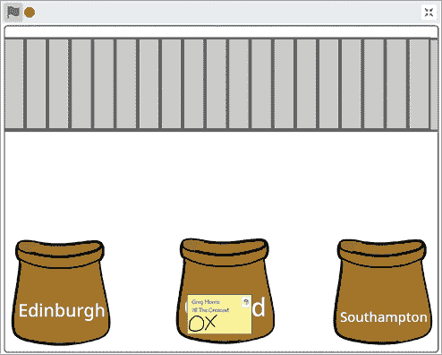

图 6-24: 识别邮政编码的测试结果

## 回顾并改进你的项目

你已经训练了一个机器学习模型来识别信封上的手写文字，并且你在 Scratch 中创建了一个使用 OCR 自动排序信件的项目！

你能如何改进你的项目？

尝试让别人来测试你的项目。它能识别他们的手写字吗？如果模型在识别他们的手写字时出现很多错误，请让他们在训练阶段向你的训练数据桶中添加一些示例。（确保在学习与测试阶段重新训练一个新的机器学习模型，这样计算机才能从你们两个的示例中学习。）

你用来训练计算机的示例种类越多，机器学习模型在识别不同手写风格时的效果就越好。

你还可以做些什么来改进你的项目？

## 你学到了什么

排序邮件是*光学字符识别*的一个常见应用。全球各地的大型邮件处理中心使用 OCR 系统在瞬间识别和排序信件。你的项目刚刚识别了一个邮政编码，但现实中的多行光学字符识别仪器可以识别多行地址。基本原理非常相似，它有助于大规模邮件排序的高效性和实用性。

**到目前为止，你的所有项目都使用了图像，但计算机也可以训练来识别许多不同类型的数据。在下一章，你将训练一个机器学习模型来识别文本！**
