# 第五章：侮辱计算机

 在本章中，我们将探讨如何训练计算机识别书面文本中的不同语气和情感，这种技术称为*情感分析*。

*想象你需要写几句话，说明你明天要去动物园。*

想想，如果你对去动物园感到非常开心和兴奋，你会写什么？你喜欢动物园，迫不及待想去。你会使用什么样的词汇？你的兴奋会影响你写句子的方式吗？

现在想想，如果你因为不得不去而生气时会写什么。你讨厌动物园，明天有其他事情你更想做，而且你很生气有人让你去。那这种情绪会如何体现在你的写作中？你的烦恼是否会让你使用和你高兴时不同的词汇？你会以不同的方式表达句子吗？

这两段文字的基本含义相同（即你明天要去动物园），但它们的语气和情感会有所不同。计算机可以通过训练来识别我们在烦恼时和高兴时写作方式中的模式。通过足够多的情感和情绪示例文本，你可以训练一个机器学习模型，根据计算机学习识别的词汇和语法模式，识别新写作中的情感或语气。

经过训练的机器学习系统可以识别文本中的情感和情绪，用于了解人们对事物的感受。例如，企业利用情感分析来了解人们对其产品或服务的看法，方法是将他们的机器学习模型指向数百万篇博客、论坛、新闻组和社交媒体帖子——这是他们自己无法阅读的数量。情感分析可以告诉他们反馈中有多少看起来是正面的，多少看起来是负面的，以及最常见的投诉和批评是什么。

情感分析不仅仅应用于互联网上大量的文本。公司通常会利用它来帮助分类和优先处理客户支持信件和电子邮件，首先回复那些看起来最生气或最烦恼的信件和邮件。

类似地，公司也会在内部讨论中使用情感分析，作为估算员工幸福感的方式，并看看是否有需要关注的问题或顾虑。

在本章中，你将训练一个机器学习模型，来识别两种不同类型文本所表达的情感：赞美和侮辱。

## 构建你的项目

在这个项目中，你将创建一个角色，它会对你输入的消息做出反应（见图 7-1）。如果你给角色一个赞美，它会显得很开心。如果你侮辱它，它会显得很伤心。

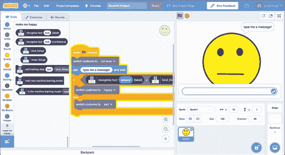

图 7-1: 识别赞美和侮辱

### 准备你的游戏

首先，开始设计你的角色。对于我的截图，我绘制了一个简单的面孔。你可以画任何你喜欢的，只要能够看出它是开心还是难过。你可以画一个动物、机器人、外星人，或者任何你能想到的东西。

1.  访问 [`machinelearningforkids.co.uk/scratch3/`](https://machinelearningforkids.co.uk/scratch3/) 开始一个新的 Scratch 项目。

1.  点击**服装**标签，如图 7-2 所示。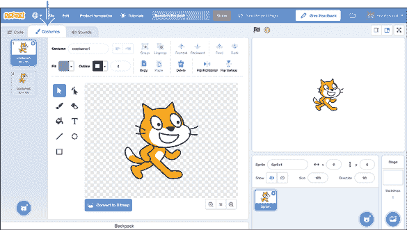

    图 7-2: 在服装标签中设计角色

1.  将鼠标指针移到屏幕左下角的猫脸图标上，查看添加服装的选项，如图 7-3 所示。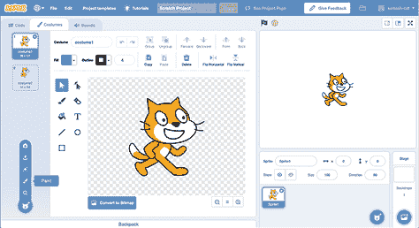

    图 7-3: 添加新服装

    如果你想绘制自己的角色，点击**绘画**。对于我的截图，我通过绘制几个彩色圆圈并加上一些头发，画了一个简单的绿色外星人角色（见图 7-4）。

    如果你不想自己绘制角色，可以选择其他几种方式。如果你的电脑有摄像头，并且想使用你的面部照片，点击**相机**。或者，如果你想使用已保存的图片（例如从互联网下载的图片），点击**上传服装**。如果你想从 Scratch 服装库中选择一个服装，点击**选择服装**。

    无论你选择哪种方式，完成此步骤后，你应该能够在画布上看到角色。

    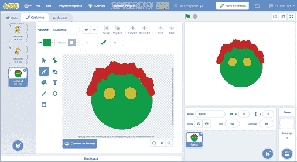

    图 7-4: 绘制你的角色

1.  在服装面板中右击角色服装，点击**复制**，如图 7-5 所示。你需要三个副本。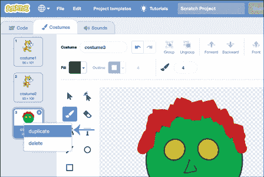

    图 7-5: 复制服装

1.  通过点击服装面板中的角色服装，然后在画布上方的**服装**文本框中输入新名称来重命名每个角色副本，如图 7-6 所示。分别命名为`waiting`、`feeling happy`和`feeling sad`。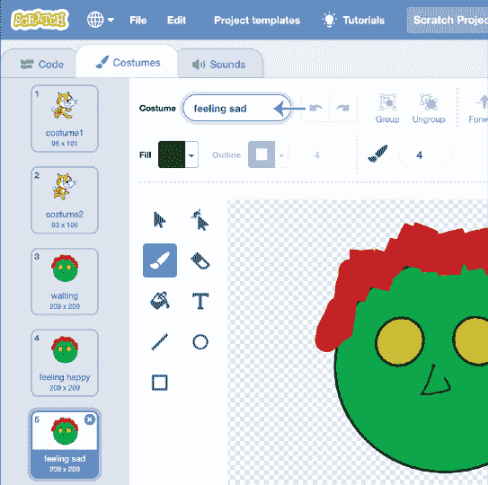

    图 7-6: 重命名你的角色服装

1.  点击服装面板中的每个角色服装，并绘制一个与其名称匹配的表情，如图 7-7 所示。

    `feeling happy` 服装应该看起来开心。如果是脸部，你可以让它微笑。如果是动物，你可以改变尾巴或耳朵的位置。或者，你也可以画出角色举着写有其感受的标语牌。

    `feeling sad` 服装应该看起来很难过。如果是脸部，你可以画一个皱眉或眼泪。

    `waiting` 服装将在角色等待你与其对话时使用，因此它既不应该看起来开心，也不应该看起来难过。

    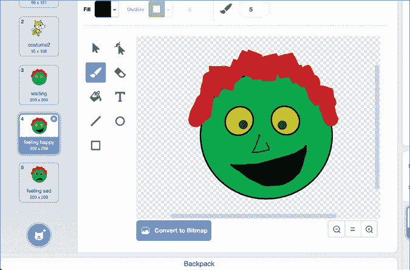

    图 7-7: 为不同的角色服装添加表情

1.  通过点击**文件**▶**保存到你的计算机**来保存你的 Scratch 项目。

### 在没有机器学习的情况下编写游戏

在开始使用 ML 之前，尝试不使用 ML 编写这个 AI 项目，了解 ML 带来的差异是很有用的。但如果你更愿意直接使用 ML，可以跳过这部分。

1.  点击**代码**选项卡，如图 7-8 所示。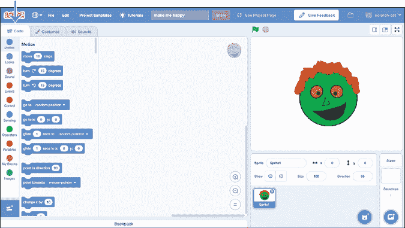

    图 7-8: 代码选项卡

1.  复制图 7-9 中显示的脚本。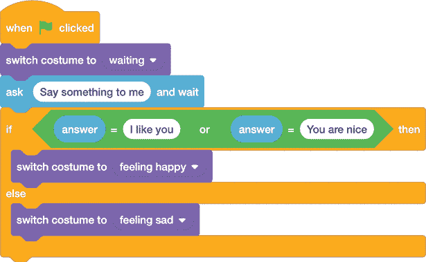

    图 7-9: 编写没有 ML 的项目代码

1.  使用**文件**▶**保存到你的计算机**来保存你的项目。

1.  通过点击绿色旗标图标来测试你的项目。你的角色会要求你对它说些什么。输入`I like you` 或 `You are nice`，你的角色会看起来很高兴。如果你输入其他任何内容，你的角色会看起来很伤心。

    现在输入`You are lovely`。为什么你的角色看起来不高兴？

    你需要对代码做出什么改变才能让它识别“我喜欢你”和“你很好”*以及*“你很可爱”作为赞美呢？

    你认为你能写出一个脚本，涵盖*所有可能的方式*来表达每一种可能的赞美和侮辱吗？

在第一章中，我提到过，机器学习（ML）并不是创建 AI 系统的唯一方式。在这里，你通过*基于规则*的方法创建了一个 AI 程序。你可以看到，尽管像这样的基于规则的技术仍然用于一些非常简单的 AI 项目，但对于更复杂的项目，ML 是首选方法。接下来我们将按照这种方式训练我们的项目，稍后在本章中我们将看到 ML 代码与基于规则的代码相比的表现。

### 训练你的模型

为了训练计算机识别赞美和侮辱，你需要收集两者的示例，并用它们来训练一个 ML 模型。

1.  创建一个新的 ML 项目，命名为`Make me happy`，并设置为学习识别你所选语言中的文本。

1.  点击**训练**，如图 7-10 所示。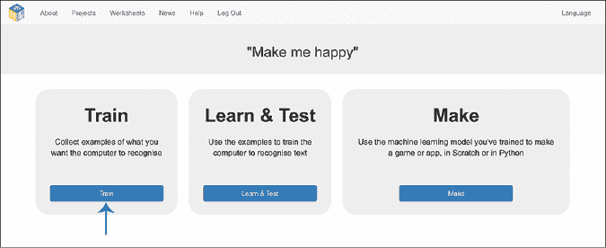

    图 7-10: 训练是 ML 项目的第一阶段。

1.  点击**添加新标签**，如图 7-11 所示。将此训练桶命名为`compliments`。然后，创建第二个训练桶并将其命名为`insults`。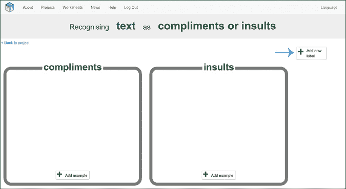

    图 7-11: 使用**添加新标签**准备两个训练桶。

1.  点击**添加示例** **在**`compliments`**桶中，如图 7-12 所示，并输入你能想到的最好的赞美词。

    重复此步骤，至少添加五个可以让你的角色高兴的赞美示例。这些是你的 ML 模型将用来学习什么是赞美的示例，所以尽量考虑多种不同的方式。

    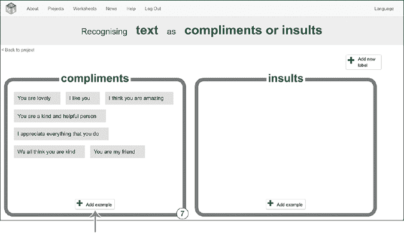

    图 7-12: 用于识别赞美的训练示例

*** 点击**添加示例**在**侮辱**桶中，如图 7-13 所示，并输入你能想到的最恶毒、最残忍的侮辱。

    重复这个步骤，至少添加*五个*让你的角色感到难过的侮辱性示例。同样，这些是你的机器学习模型用来学习侮辱是什么样子的示例，因此尽量想出几个不同的变体。

    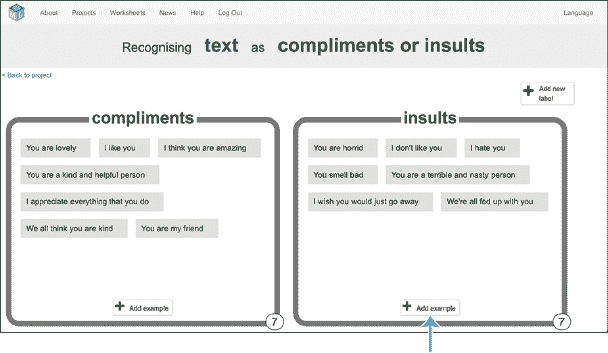

    图 7-13: 识别侮辱的训练示例 *   点击屏幕左上角的**返回项目**。*   点击**学习与测试**。*   点击**训练新机器学习模型**，如图 7-14 所示。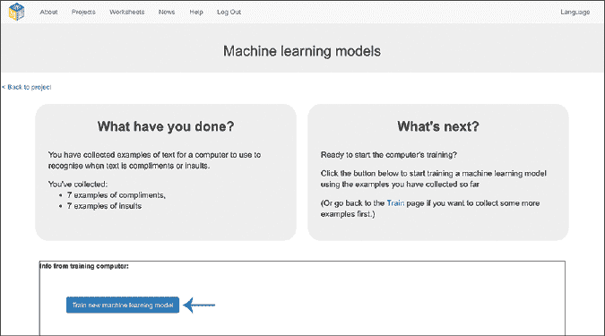

    图 7-14: 训练一个新的机器学习模型

    计算机将使用你刚刚创建的示例来学习如何识别称赞和侮辱。

    为此，它将查找你写的示例中的模式。它将从你选择的词汇和你组织句子的方式中学习。然后，它会使用这些模式来识别我们将在下一步发送给它的消息的含义。

    训练模型可能需要一分钟，但你会发现它比你在前几章中训练的图像分类器要快得多。计算机学习文本中的模式比学习图像中的模式要容易得多。

    +   通过在**测试**框中输入称赞或侮辱来测试你的机器学习模型，如图 7-15 所示。

    重要的是，你要用那些没有包含在训练桶中的示例来测试它。你在测试计算机如何识别它从未见过的新示例，而不是测试它如何记住你已经给它的示例。

    如果你的模型出现错误，返回训练阶段并添加更多示例。然后，返回学习与测试阶段，训练一个新的机器学习模型。

    继续进行，直到你对计算机的表现满意。在下一章，你将学习更好的机器学习模型测试方法，但现在，简单地尝试几次模型就是一个很好的开始。

    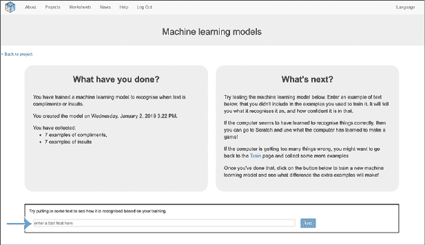

    图 7-15: 测试是机器学习的重要部分。**

**### 用机器学习编写你的游戏

现在你已经有了一个能够识别称赞和侮辱的机器学习模型，你将修改之前的项目，使用你的机器学习模型，而不是之前使用的规则。

1.  点击屏幕左上角的**返回项目**。

1.  点击**制作**，如图 7-16 所示。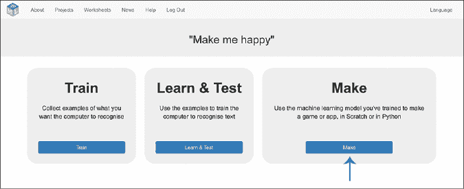

    图 7-16: 一旦你对你的机器学习模型满意，就该用它制作一些东西了！

1.  点击**Scratch 3**，然后点击**在 Scratch 3 中打开**，以在新窗口中打开 Scratch。

    你应该会在工具箱中看到代表你机器学习模型的新积木，如图 7-17 所示。

    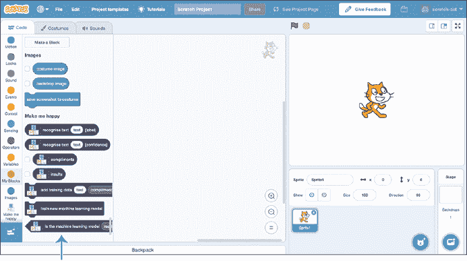

    图 7-17: Scratch 会打开一个包含新积木集的项目。

1.  通过点击**文件**▶**从电脑加载**来打开你保存的项目，如图 7-18 所示。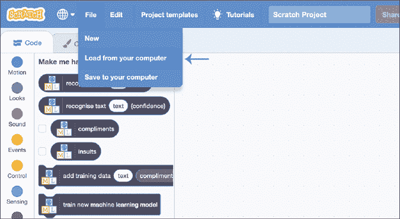

    图 7-18: 打开你之前创建的基于规则的项目。

1.  如果你之前创建了基于规则的脚本，请更新它以匹配图 7-19。如果你跳过了基于规则的项目方法，请创建图 7-19 中显示的整个脚本。

    图 7-19: 使用机器学习编码的项目

    在这个脚本中，你的角色会要求你对它说些什么。这个脚本使用你的机器学习模型来识别你输入的消息是赞美还是侮辱。它会根据识别的结果展示你绘制的其中一套服装，让它看起来像是你的角色在对你是赞美还是侮辱做出反应！

    如果你之前没有使用机器学习编写这个项目，比较一下这个脚本和之前的版本。你能看到机器学习如何让创建一个能够对更多种类的消息做出反应的项目变得更加容易吗？

### 测试你的游戏

现在是时候测试你的项目了。点击绿色旗帜，尝试输入一些信息。即使你输入了训练中没有使用的内容，希望角色也能正确反应你的消息。如果没有，你总是可以回到训练阶段，添加更多示例，然后重新训练一个新的机器学习模型。

你已经成功创建了一个能够识别并对你给予的赞美或侮辱做出反应的角色！

## 审查并改进你的项目

让我们看看你可以改进这个项目的几种方法。

### 使用语音输入代替打字

那么，怎样改进你的项目，使你可以通过说出赞美和侮辱而不是输入文字呢？

你需要在计算机上连接麦克风才能使用语音输入，并且你需要从 Scratch 扩展库中添加语音转文本扩展。要访问扩展库，请点击工具箱底部的“添加扩展”图标（看起来像两个带加号的模块，+）。这个库包含了你可以在项目中使用的额外模块。

找到并点击**语音转文本**扩展，将这些模块添加到你的工具箱中，然后更新你的脚本，使其像图 7-20 所示。

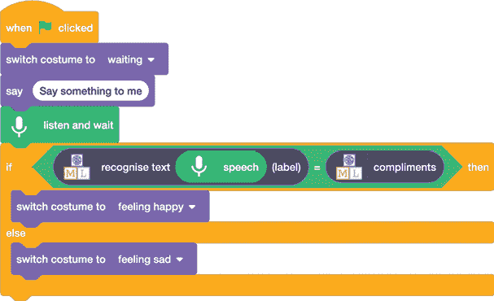

图 7-20: 使用语音识别的“让我开心”项目

*语音识别* *是机器学习的另一个应用。在这个改进中，你不是自己训练语音机器学习模型，而是使用别人为你训练好的模型。但是语音模块创建的基本原理与创建打字版的赞美和侮辱示例类似。*

*你还可以做些什么来改进你的项目？*

### 识别不是赞美或侮辱的语音

对你的角色说`What is the time?`。它可能认为这个问题是赞美并表现得很高兴，或者它可能把这个问题识别为侮辱并表现得很难过。

这两种反应都不是正确的做法。你可以更新代码，使它在收到既不是赞美也不是侮辱的消息时完全不做反应。

当你在“学习与测试”阶段测试 ML 模型时，你可能注意到置信度分数显示了计算机对识别消息的信心有多大。

现在再次输入`What is the time?`，如图 7-21 所示。

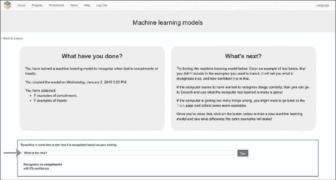

图 7-21: 测试“What is the time?”分类的置信度

你应该会看到这个消息的置信度分数非常低。这是 ML 模型告诉你它没有识别出该文本的方式。它在说，在你给它的所有训练样本中，它没有见过类似的内容，因此无法识别该消息是赞美还是侮辱。

我的 ML 模型在对“What is the time?”的分类中给出的置信度分数为 0。你的 ML 模型可能得分稍高，具体取决于你如何训练它。例如，如果你在侮辱类别中包括了很多像“你怎么了？”这样的句子，那么你的 ML 模型可能会对“What is the time?”有 10%的置信度认为它是侮辱，单单因为它是一个问题。这仍然是有用的信息，因为它告诉你有 90%的可能性这个消息不是侮辱。它在说，这个消息在某些方面与它从侮辱中学到的模式相似，但它不能*自信*地确定这个消息是侮辱。

尝试不同的测试句子，这些句子既不是赞美也不是侮辱，看看你能得到什么样的置信度分数。将这些与测试 ML 模型时得到的关于真实赞美和侮辱的置信度分数进行比较。

当你的 ML 模型正确识别出一个真实的赞美或侮辱时，它给出的置信度分数是多少？

你可以在你的 Scratch 项目中使用置信度分数，如图 7-22 所示。

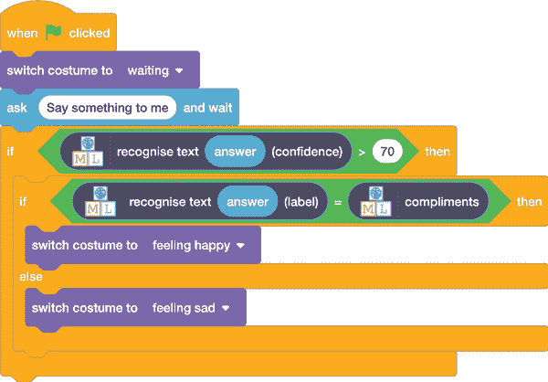

图 7-22: 在代码中使用置信度分数

这个脚本只有在 ML 模型至少有 70%的置信度确认它识别了你给出的消息时才会让角色做出反应。否则，脚本会忽略该消息。

你需要将`70`更改为适合你 ML 模型的百分比，具体取决于你自己的测试。

还有其他什么方法可以改进你的项目吗？

### 从错误中学习

当有人使用 ML 系统时，他们通常会知道计算机是否犯了错误。改进 ML 项目的一种方式是让它从这些错误中学习。

给用户一个方式来告诉项目 ML 模型是否犯了错误。可以是一个按钮，或者是一个文本框，用户在其中输入“yes”或“no”，以回答“我做对了吗？”这个问题。

图 7-23 中显示的脚本将询问机器学习（ML）模型是否正确。如果你输入“no”，计算机未正确识别的文本将被添加到训练示例中。每新增五个训练示例，就会训练一个新的 ML 模型。

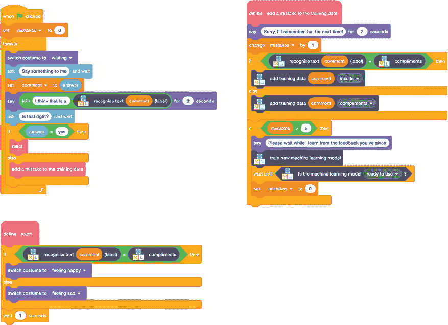

图 7-23： 从错误中学习的一个示例

训练你的模型从错误中学习，随着使用时间的推移，它会变得更加智能。想想当你的角色误解了你时，你希望如何告诉它，并使用类似这样的脚本，这样它就可以从你的反馈中学习。

## 你学到了什么

在本章中，你学习了*情感分析*，即使用机器学习识别文本中的语气和情感。你了解到企业和组织如何使用情感分析从互联网上获取客户的宝贵反馈和见解，优先处理客户服务响应，并衡量员工满意度。

你发现，与简单的基于规则的方法相比，机器学习在为复杂项目构建 AI 系统时是一个更好的选择。你还学习了如何通过置信度得分来判断机器学习模型对其预测的确定性，并看到了如何通过帮助模型从错误中学习来改善它们。

在下一章中，你将使用类似于情感分析的方法来训练一个模型，识别不同的写作风格。****
