# 第六章：识别报纸中的语言

在上一章中，你看到计算机可以被训练来识别写作的不同特征。在那个项目中，你训练了一个机器学习模型来识别赞美和侮辱。计算机也可以学习识别许多其他写作风格。

例如，你可以训练一个机器学习模型来识别正式写作与非正式写作之间的区别，方法是训练它识别人们选择的词汇和使用的表达方式中的模式。

不同的报纸和新闻网站使用不同的词汇和短语来描述相同的故事。在本章中，你将通过创建一个能够识别头条所属报纸类型的机器学习模型，训练计算机识别媒体中语言的使用方式（见图 8-1）。

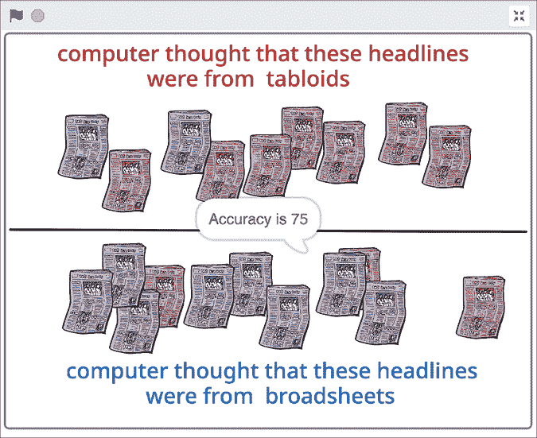

图 8-1： 识别报纸头条

让我们开始吧！

## 构建你的项目

本项目的目的是看看计算机是否能学会识别报纸使用语言的方式。在本章的截图中，我训练了一个机器学习模型来识别*小报*（包含八卦故事和大量照片的小型报纸）与*大报*（传统的、全尺寸的报纸，通常有更多严肃的文章）之间的头条区别。

你也可以选择相同的主题，或者设计自己的项目。如果你选择设计自己的项目，你应该选择*一个*特征来训练计算机进行识别。你可以调查很多方面。例如，你可以根据以下内容来设计项目：

1.  英国报纸（与美国报纸相比）  美国报纸与英国报纸在语言使用上有何不同？

1.  夏季头条（与冬季头条相比）  不同季节的头条写法有何不同？

1.  国家报纸（与地方报纸相比）  国家级报纸的头条与地方报纸的头条写法是否有所不同？

1.  周末头条（与工作日头条相比）  报纸在工作日和学校日使用的语言与周末是否不同？

1.  来自两份不同报纸的文章   如果你选择两份特定的报纸，你能训练计算机识别其中一份报纸的文章吗？

1.  1950 年代的头条（与今天的头条相比）  今天的头条写法与过去有何不同？

你需要一些报纸文章或头条的例子，用来训练机器学习（ML）模型进行识别。你可以利用很多网站来寻找这些例子。以下是一些建议：

1.  [`www.thepaperboy.com/`](https://www.thepaperboy.com/)

1.  [`www.ukpressonline.co.uk/`](https://www.ukpressonline.co.uk/)

1.  [`www.time.com/vault/`](https://www.time.com/vault/)

想一想您认为有趣的比较，然后看看是否能找到足够的示例，以便轻松实现。

您将需要两个组来训练 ML 模型：

+   您希望模型识别的报纸文章/头条新闻类型的示例

+   不具备该特征的报纸文章/头条新闻示例

尝试在第二组中只改变一个特征。例如，*1970 年代英国小报头条*类别有三个变量：国家（英国）、报纸类型（小报）和时间段（1970 年代）。那么，您会在第二组中放入什么？

您可以将其填充为 1970 年代美国小报头条的示例，这样计算机就可以学习识别 1970 年代英国和美国小报头条的区别。或者，您可以将其填充为今天英国小报的头条新闻示例，这样计算机就能学习识别 1970 年代和现在英国小报头条的区别。

您**不应**做的是，例如，使用当前美国大报的头条新闻。这将改变所有三个变量，导致模型难以识别一致的模式。

作为另一个示例，如果您想训练计算机识别*每日时报*的文章写作方式，第二组中可以包括同一天来自不同报纸的文章。更好的是，您可以尝试选择关于相同主题的文章。这样，您的 ML 模型将不会学习识别文章的主题，而是学习*每日时报*描述相同主题的方式。

为了训练我的 ML 模型识别小报的头条新闻，我将小报的头条新闻与大报的头条新闻进行了比较。以下是我保持一致的内容：

+   我使用的是*相同时间段*的报纸：2015 年 3 月到 2015 年 4 月。

+   我使用了每份报纸的*相同版面*：首页最大字号的头条新闻。

+   我使用的是*相同类型*的报纸：全国性平日报纸。

+   我使用的是*相同国家*的报纸：英国。

### 训练您的模型

1.  创建一个新的 ML 项目，命名为`Newspapers`，并设置为学习识别您首选语言中的文本。

1.  点击**训练**，如图 8-2 所示。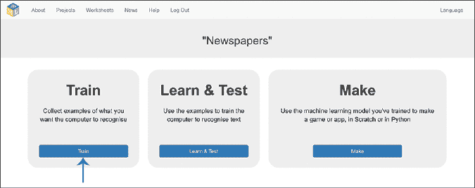

    图 8-2: 训练是 ML 项目的第一阶段。

1.  点击**添加新标签**，如图 8-3 所示，为您在项目中要比较的两个组创建训练桶。

    对于我的项目，我使用了小报和大报。

    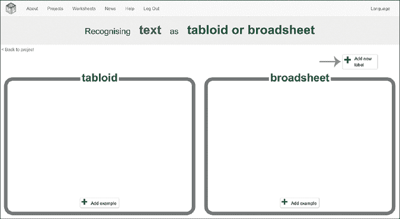

    图 8-3: 为两个组创建训练桶以进行比较。

1.  查找并复制您第一组的示例。这将取决于您正在做的项目。如果您正在做关于头条新闻的项目，那可能是报纸的头条新闻。如果您在比较不同报纸如何写同一主题的文章，那可能是文章的第一段。

    在我的项目中，我从一个展示英国国家报纸首页的网站上复制了标题。

1.  点击每个训练桶中的**添加示例**，如图 8-4 所示，并粘贴你找到的示例。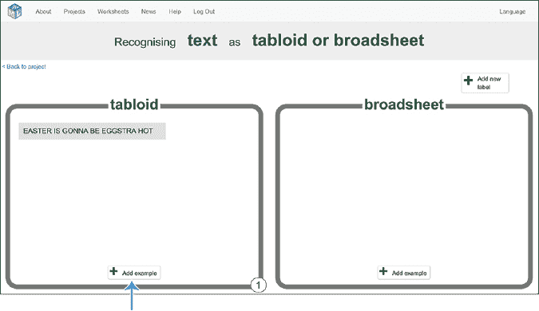

    图 8-4： 报纸项目的第一个训练示例

1.  重复步骤 4 和 5，直到每个训练桶中至少有 20 个示例，如图 8-5 所示。

1.  点击屏幕左上角的**返回项目**。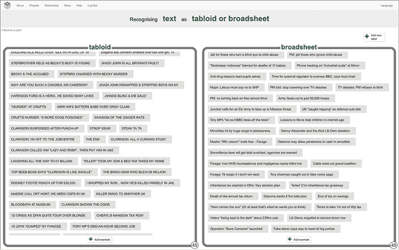

    图 8-5： 报纸项目的训练数据

1.  点击**学习与测试**，如图 8-6 所示。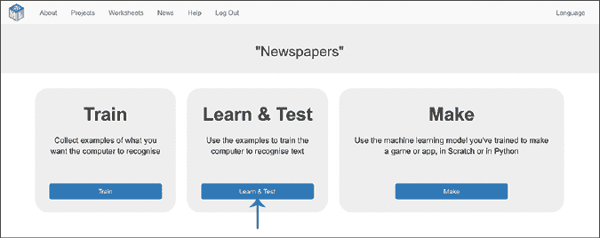

    图 8-6： 学习与测试是机器学习项目的第二阶段。

1.  点击**训练新机器学习模型**，如图 8-7 所示。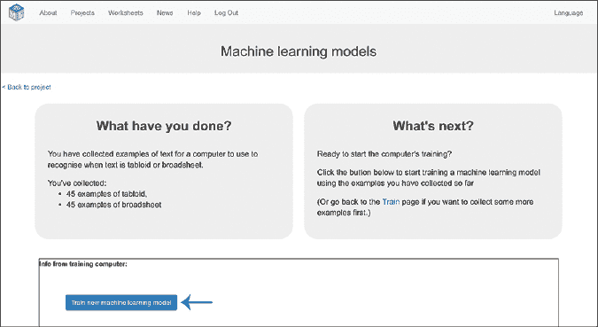

    图 8-7： 点击**训练新机器学习模型**以开始训练。

    计算机可能需要一分钟来从你收集的示例中学习。在等待时，考虑这些问题：

    +   在将示例复制到训练桶中时，你是否发现了两组示例之间的任何模式？

    +   是否有某些话题或主题在一组中比另一组更常出现？

    +   是否有某些词汇、术语或短语在一组中使用得比另一组更多？

    +   句子的结构方式是否有差异？有一组的句子比另一组长吗？有一组更频繁地使用大写字母吗？

    +   使用的单词类型是否存在模式？例如，一组是否使用更简单的语言或更短的单词？一组是否使用更多的情感词汇？

    尝试猜测你的机器学习模型可能从你提供的训练示例中学习到哪些模式。

### 准备你的项目

在你迄今为止制作的项目中，你通过尝试模型来测试了你的机器学习（ML）模型。在本章中，你将看到一些机器学习项目在现实世界中如何正式进行测试。

1.  点击屏幕左上角的**返回项目**。

1.  点击**制作**。

1.  点击**Scratch 3**，然后点击**在 Scratch 3 中打开**，以打开一个新的窗口并启动 Scratch。

1.  删除**Sprite1**猫精灵，因为你不需要它。点击其右上角的垃圾桶图标。此时，服装标签应已被背景标签取代。

1.  点击**背景**标签，并绘制一个将你的 Scratch 项目分为上下两部分的背景，如图 8-8 所示。

    *上半部分*将用于与您训练机器学习模型识别的报纸*匹配*的部分。

    *下半部分*将用于与您训练机器学习模型识别的报纸*不匹配*的部分。

    为每一半选择一种颜色。我使用了红色表示上半部分，蓝色表示下半部分。

    在两半之间画一条线，以划分空间。

    你应该最终得到类似图 8-8 的效果。

1.  通过将鼠标指针移动到屏幕右下角的选择精灵图标（猫脸）上来添加一个精灵。这个精灵将代表你训练的机器学习模型应该识别的报纸头条，因此，在画布上方的**服装**文本框和屏幕右下角的**精灵**文本框中都给它起个合适的名字。

    要绘制你自己的报纸，选择**绘画**。

    要上传你保存到计算机中的报纸图片，点击**上传精灵**。

    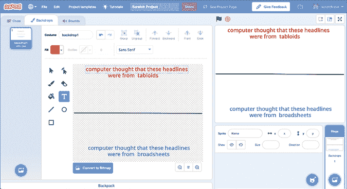

    图 8-8: 为报纸项目准备背景。

1.  点击**服装**标签并使用绘图工具将报纸涂色，使其与背景的上半部分相匹配。

    对于我的项目，我画了一个红色的报纸精灵来代表小报的头条，并命名为“小报”，如图 8-9 所示。

    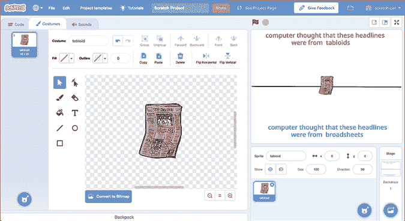

    图 8-9: 绘制第一个报纸精灵。

1.  点击**代码**标签，点击工具箱中的**变量**，然后点击**创建列表**，如图 8-10 所示。

    确保选择了**所有精灵**，并根据你训练机器学习模型识别的内容为你的列表命名。

    对于我的项目，我创建了一个名为“小报头条”的列表。

    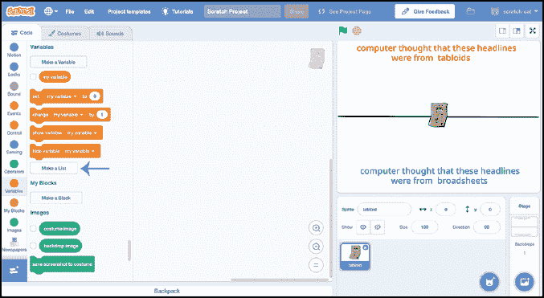

    图 8-10: 为第一组头条创建一个列表。

1.  如图 8-11 所示，至少在列表中输入 10 个示例。点击列表左下角的加号按钮添加新行。你可以拖动列表右下角的等号，使列表变宽，这样可以更容易查看你输入的内容。

    你在这个列表中输入的文本应该是报纸头条或文章的示例，这些内容符合你训练机器学习模型所识别的标准。

    重要的是，这些头条应该是你在训练示例中没有使用过的新头条。它们应该是计算机之前没有见过的头条，这样你才能正确测试它是否能够识别新的头条，而不仅仅是记住它们。

    当你完成输入测试头条到列表中后，取消勾选工具箱中的列表，以将其隐藏在舞台上。

    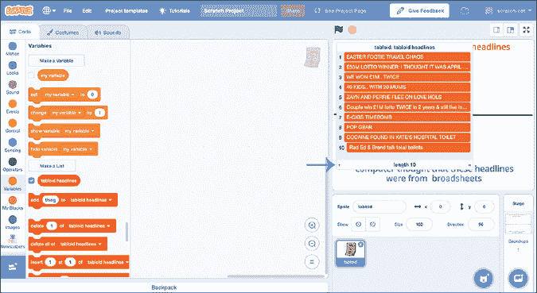

    图 8-11: 测试第一组示例

1.  点击**代码**标签并复制图 8-12 中显示的脚本。

    用你在项目中训练计算机识别的标签替换小报块。

    

    图 8-12: 报纸项目的第一个代码脚本

    这个脚本将遍历我的每个小报头条，如果机器学习模型识别它为小报头条，它将把该头条移动到屏幕的上半部分。否则，它将把头条移动到屏幕的下半部分。

    你在第三章做过类似的事情，当时你根据机器学习模型识别精灵的外观来排序动物精灵。这一次，你是根据机器学习模型识别列表中的某些文本来排序精灵。

1.  点击绿旗，观察脚本运行。

    你的机器学习模型表现如何？它可能会有些错误答案，但希望它能大多数都做对。你可以在图 8-13 中看到我的机器学习模型的表现。

    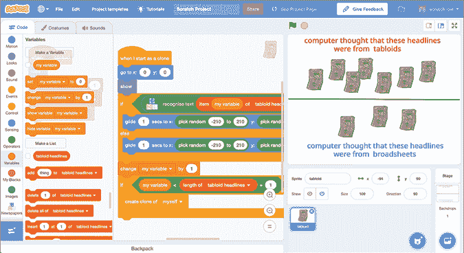

    图 8-13: 报纸项目的第一次测试

    但仅凭这些报纸精灵的分组，你无法判断我的机器学习模型是否能够区分小报头条与大报头条。也许它将几乎所有东西都识别为小报头条。为了知道我的模型是否也能识别大报头条，我需要在列表中添加一些大报头条的例子。

1.  按照第 6 步中的说明创建一个新精灵，这次代表应出现在你创建的背景下半部分的头条/文章。将精灵的颜色设置为与你绘制背景时选择的下半部分颜色匹配，并给精灵和服装命名，使其符合你训练模型识别的内容。

    对于我的项目，我绘制了一个蓝色的报纸精灵来表示大报头条，并将其命名为 broadsheet，如图 8-14 所示。

    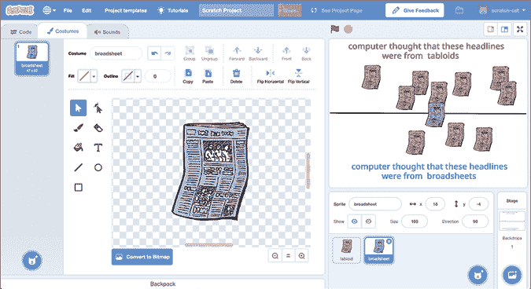

    图 8-14: 第二个精灵用于报纸项目

1.  在**代码**选项卡中，点击工具箱中的**变量**，然后点击**创建一个列表**。将至少 10 个应该出现在背景下半部分的头条/文章添加到此列表中。

    如前所述，确保**选择了所有精灵**，并将列表命名为与第二组相匹配的名称。

    对于我的项目，我创建了一个名为"broadsheet headlines"的列表，并将 10 个大报头条的例子填入其中，如图 8-15 所示。

    在将测试头条输入列表后，取消选中工具箱中的列表，以便在舞台上隐藏该列表。

1.  创建一个变量来计数这些头条，方法是点击你的第二个报纸精灵，点击工具箱中的**变量**，然后点击**创建一个变量**。为变量命名，以与你的第二组名称相符。

    对于我的项目，我创建了一个名为"broadsheet"的变量，如图 8-15 所示。

    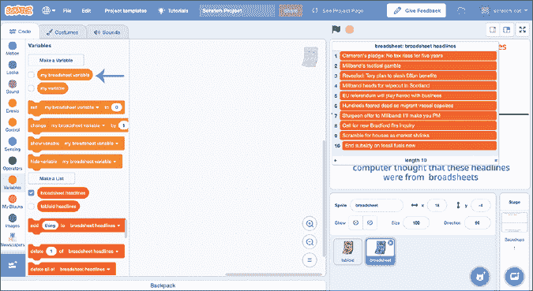

    图 8-15: 为第二组报纸准备数据

1.  复制图 8-16 中显示的脚本，用于第二个报纸精灵。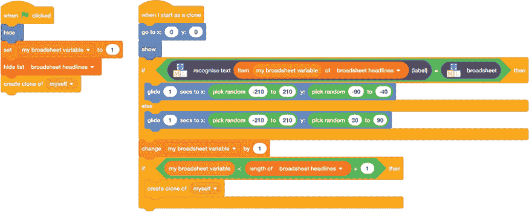

    图 8-16: 报纸项目的第二次测试

    这些脚本与你在第 9 步中为第一个报纸精灵创建的脚本类似。

    这段代码将遍历第二个列表中的示例。对于每个示例，它将创建一个精灵，如果机器学习模型识别该示例属于第二组，代码将把它移到屏幕的下半部分。否则，代码将把示例移到上半部分。

    小心不要使用第一个精灵中的列表或变量。我的第一个脚本是关于小报头条的，第二个脚本则是关于大报头条的。

    请注意，脚本中的坐标也必须不同，这样正确匹配的项目才能显示在屏幕的下半部分。

1.  再次点击绿色旗帜，观察你的脚本运行。

    如前所述，如果你的机器学习模型没有完全正确也没关系。你可以查看我的机器学习模型在图 8-17 中的表现。

    你的机器学习模型表现如何？

    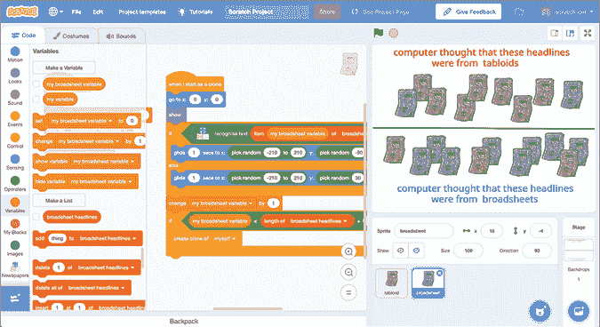

    图 8-17: 第二次测试的报纸项目结果

## 审查并改进你的项目

你已经训练了一个机器学习模型来识别媒体中的语言使用！你还使用 Scratch 制作了一个简单的测试，来可视化你的机器学习模型的效果。

如果我的机器学习模型表现完美，它应该会把所有的红色报纸移到上半部分，把所有的蓝色报纸移到下半部分。

它没有做到。

正确识别 100%的头条新闻是不太可能的，因为我只给了我的模型少量的训练数据。随着更多的训练样本，我预计结果会有所改善，但即便如此，机器学习系统也很少能做到完美。

但是它到底有多好呢？

我们可以通过许多方法来描述机器学习系统的性能。

### 性能测量：准确度

我们用来描述机器学习模型性能的一个指标是*准确度*，即计算机器学习模型正确回答的数量。

*创建一个新变量，选择**所有精灵**，并命名为`correct`。

修改第一个精灵的脚本（图 8-12 中的报纸应显示在上半部分），使其与图 8-18 中的脚本匹配。

请注意，你需要删除脚本中的最后一个`if`块，并用`if...else`块替换它。

现在修改第二个精灵的脚本（图 8-16 中的报纸应显示在下半部分），使其与图 8-19 中的脚本匹配。

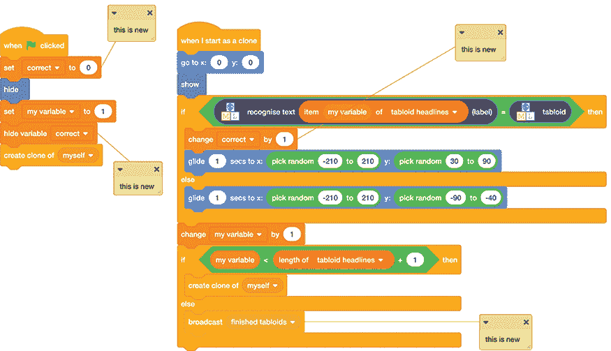

图 8-18: 修改第一个测试脚本（来自图 8-12）以计算正确答案的数量。

请注意，你还需要将此脚本中的最后一个`if`块替换为`if...else`块。

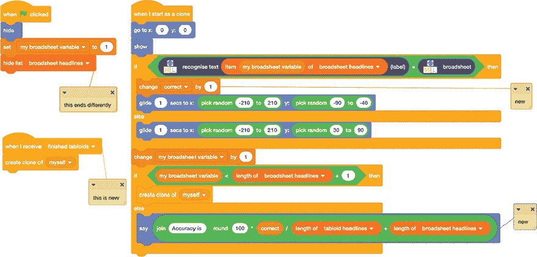

图 8-19: 修改第二个测试脚本（来自图 8-16）以计算正确答案的数量。

使用这些更新后的脚本，你的 Scratch 项目将计算机器学习模型的准确度，并在测试结束时显示结果。公式为：

```
**correct answers / ( (number of tabloid headlines) + (number of broadsheet headlines) )** 
```

如图 8-20 所示。


图 8-20： 计算准确率（Scratch 将列表中的项数称为*列表的长度*）

换句话说，准确率是指机器学习模型正确分类的头条的百分比。

我的机器学习模型的准确率如图 8-21 所示。它与您的项目相比如何？


图 8-21： 显示准确度

### 性能测量：混淆矩阵

准确率是一个有用的衡量标准，也许是最著名的一个。但它通常不够，因此通常不是现实世界中机器学习系统唯一使用的衡量标准。

你能想到准确率的任何问题吗？

如果我的机器学习模型认为所有的都是大报头条，如图 8-22 所示，那怎么办？

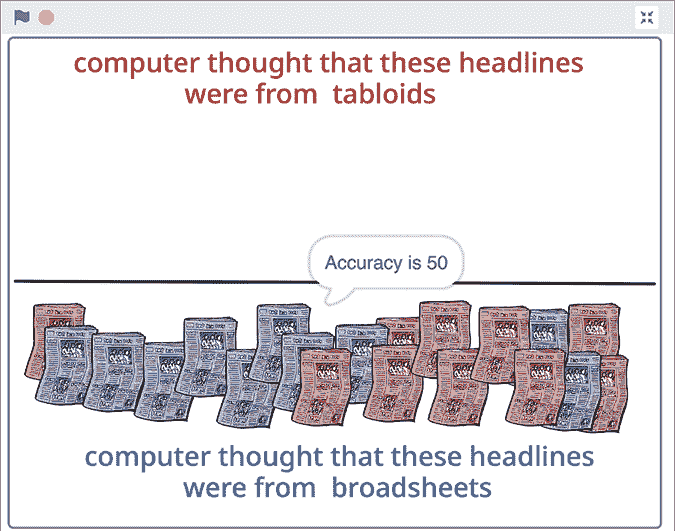

图 8-22： 将每个头条分类为大报

准确率将是 50%，因为模型会将所有 10 个大报报纸放在正确的位置，但会将所有 10 个小报报纸放错地方。

但“50%准确率”并不是对一个始终给出相同答案的系统的良好描述。我们需要一种更好的方式来描述我们的机器学习模型的性能，避免这种误导性的结果。

*混淆矩阵*是一种工具，您可以在其中统计机器学习模型正确和错误的数量，然后将这些结果按表格排列。让我们看一个例子。

创建四个新变量，选择**所有精灵**，并将它们命名为`真正例`、`真负例`、`假正例`和`假负例`。确保在工具箱中选择了这四个变量的复选框，如图 8-23 所示。

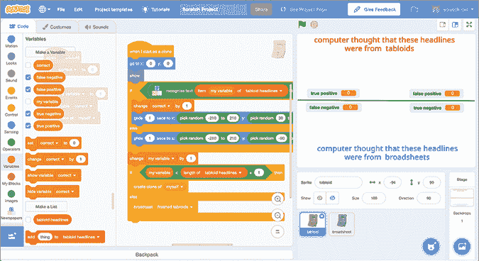

图 8-23： 为混淆矩阵准备变量

按照图 8-24 中的示例，将变量安排在舞台上。

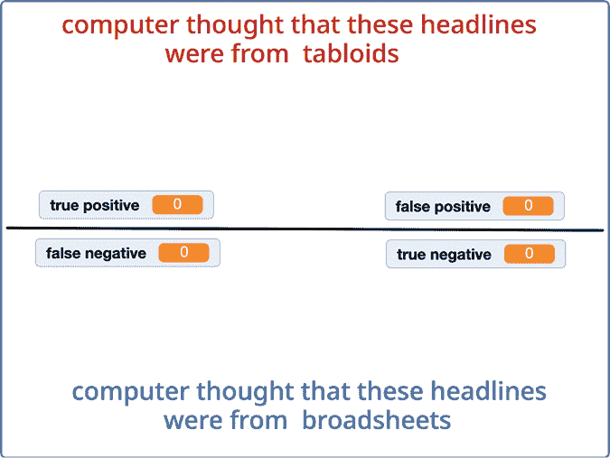

图 8-24： 在 Scratch 中创建混淆矩阵

修改第一个精灵的脚本（即图 8-18 中的报纸，应该放在上半部分），使其与图 8-25 中的脚本匹配。

这有点长，但请慢慢来，仔细对照，确保正确复制。如之前一样，我已经添加了注释以突出变化。

我们增加了**真正例**和**假负例**的计数，并且调整了滑块的**x**值，使得小报保持在屏幕的左侧。

****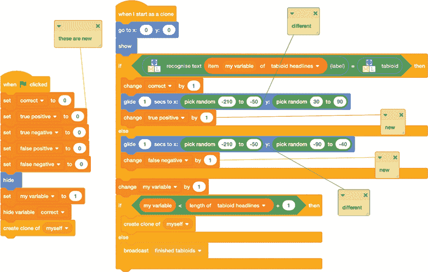

图 8-25： 修改第一个脚本（来自图 8-18）以计算混淆矩阵值。

修改第二个精灵的脚本（即图 8-19 中的报纸，应该放在下半部分），使其与图 8-26 中的脚本匹配。

我们正在增加**真正负例**和**假正例**的计数，并改变滑行模块的**x**值，以便大报能够保持在屏幕的右侧。

****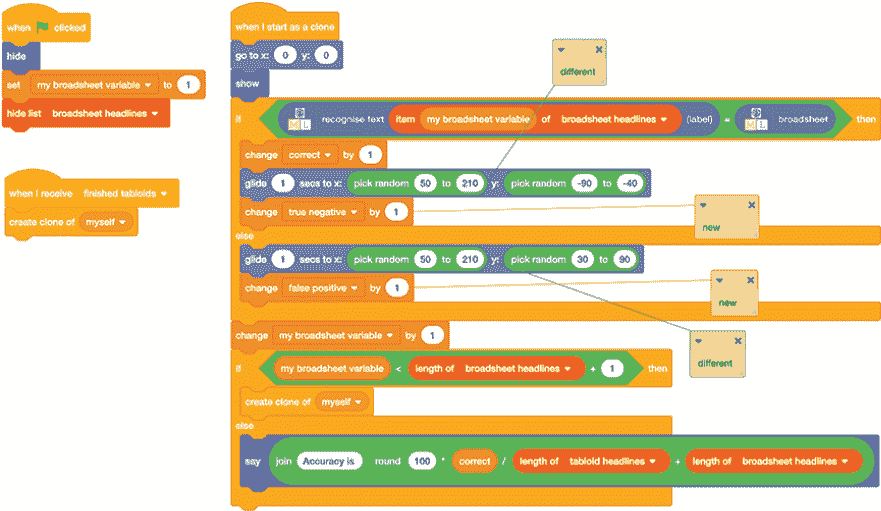

图 8-26: 修改第二个脚本（来自图 8-19）以计算混淆矩阵的值。

点击绿色旗帜再次测试你的机器学习模型。我的结果显示在图 8-27 中。

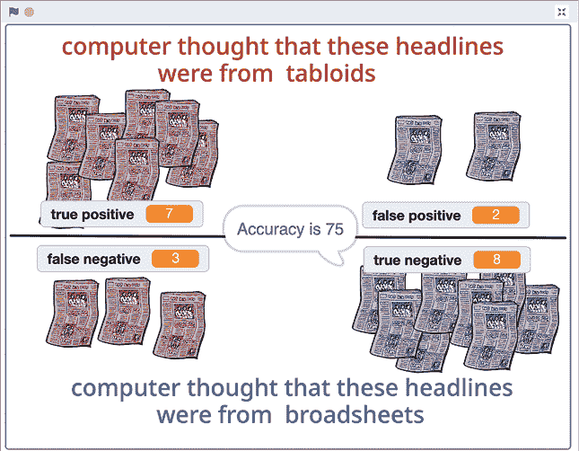

图 8-27: 在 Scratch 中显示混淆矩阵

表 8-1 显示了我的机器学习模型结果，排列成混淆矩阵。

表 8-1：在混淆矩阵中排列结果

| **真正例** 头条来自小报。机器学习模型认为它来自小报。

(正确) | **假正例** 头条不是来自小报。机器学习模型认为它来自小报。

(不正确) |

| **假负例** 头条来自小报。机器学习模型认为它不是来自小报。

(不正确) | **真正负例** 头条不是来自小报。机器学习模型认为它不是来自小报。

(正确) |

这是一种有用的方式，可以描述机器学习模型的表现，它能提供比准确度单独能提供更多的信息。

如果我的机器学习模型认为所有内容都来自大报，那么混淆矩阵将如图 8-28 所示。

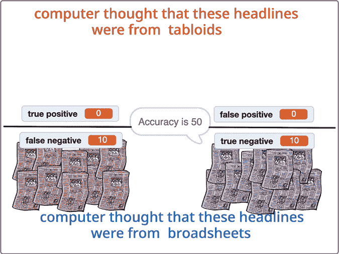

图 8-28: 混淆矩阵示例

### 测量性能：精度和召回率

描述机器学习模型表现的另一种方式是使用*精度*和*召回率*。

**精度计算公式为 `真正例 / (真正例 + 假正例)`。

召回率计算公式为 `真正例 / (真正例 + 假负例)`。

你可以更新你的脚本，包含图 8-29 中显示的计算方式。将它们添加到第二个精灵的`当我作为克隆开始时`脚本的末尾，`说`模块之后。

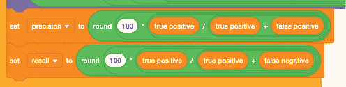

图 8-29: 在 Scratch 中计算精度和召回率

我将这个计算添加到了我的机器学习模型脚本中。图 8-30 显示了我得到的结果。

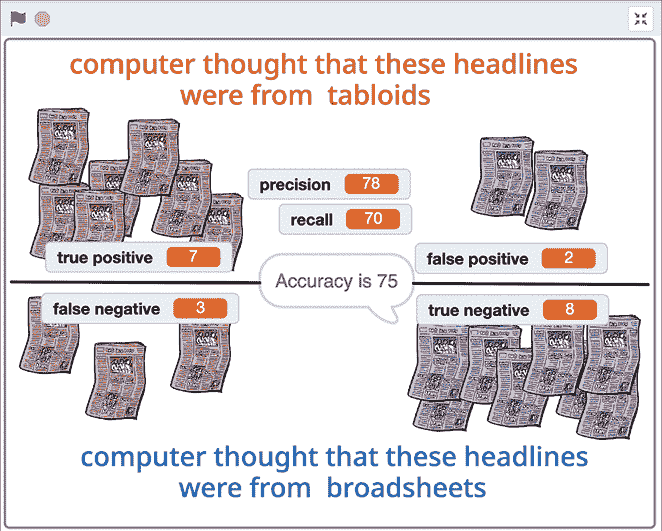

图 8-30: 在 Scratch 中显示精度和召回率

精度分数意味着，当我的机器学习模型认为某个内容是小报头条时，它正确的概率是 78%。

召回率分数意味着它找到了测试集中的 70%小报头条。

准确度分数意味着机器学习模型给出的答案中，有 75%是正确的。

精度、召回率和准确度有助于全面描述机器学习模型的表现。

例如，图 8-31 展示了两种不同机器学习模型的结果，这两种模型的准确率均为 50%。其他得分有助于描述模型工作方式的差异。

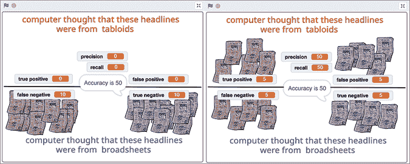

图 8-31: 不同的机器学习模型，准确率为 50%

与我们在上一章中通过手动输入测试值并直观了解模型正确次数的测试方法相比，使用衡量值是一种更一致、更有效的方式来描述 ML 模型的性能。我们将在下一章中讨论图像识别项目中性能衡量值的另一种应用。

### 改进您的 ML 模型

尝试为您在训练阶段的两个训练桶各添加另外 10 个示例，并使用这些示例训练一个新的 ML 模型，然后进入学习和测试阶段。

一旦新的 ML 模型完成训练，请重新运行您的 Scratch 脚本。

增加训练样本数量对您的精度、召回率和准确度评分有什么影响？

## 您学到了什么

从您自己的所有项目中可以看出，ML 并不完美，也会犯错误。然而，ML 不需要完美才能有用。ML 系统通过快速工作来弥补它们的错误，分析大量的文本，而这些文本是一个人一生也读不完的。即使它每 10 次就出错一次，ML 系统在发现需要关注的事项时仍然能发挥作用。但了解一个 ML 系统犯错的次数是非常重要的，这有助于衡量它的表现如何。

在这一章中，您了解了测试 ML 系统和衡量它们表现的多种方法，这些方法可以帮助我们决定如何使用它们给出的结果。

在下一章中，您将学习如何通过将问题分解成单独的部分，让 ML 模型识别，从而解决更复杂的问题，您还将再次使用混淆矩阵来查看这种方法的效果。
