# 第七章：在图片中找到物体

在前几章中，你学到了如何训练一个机器学习系统，让它能够识别图片中的物体。这在整张图片都是你感兴趣的东西时非常有用，就像你在第四章制作石头、剪刀、布游戏时那样。在那个游戏中，你的手占据了整张照片的画面。但有时我们希望计算机学会找到图片中只有一小部分的物体。在这一章中，你将看到如何将一个复杂的任务拆分成几个更简单的部分，然后分别使用机器学习来处理每一部分。

例如，假设你想使用机器学习来找出树在图 9-1 中的位置。

图 9-1: 树在哪里？

基本的想法是，你训练一个机器学习模型来识别树的图片，就像你在第三章中训练它来识别某些动物的图片一样。然后，你将这张新照片拆分成更小的部分，并使用该机器学习模型检查每一部分，看看哪一部分看起来像是一张树的照片。

例如，图 9-1 的左上角部分在图 9-2 中有所显示。机器学习模型不会将这张图片识别为树，所以我们可以说树并不在图片的左上角。

图 9-2: 图 9-1 的左上角

或者，我们可以尝试图 9-3 中显示的右下部分。机器学习模型也不会将这张图片识别为树，所以我们可以说树并不在图片的右下角。

图 9-3: 图 9-1 的右下角

我们继续进行，直到尝试测试类似图 9-4 的图片。当我们得到一个机器学习模型高可信度认为是树的图片部分时，我们就知道已经找到了树的位置。

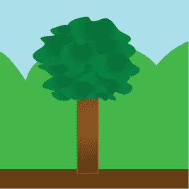

图 9-4: 图 9-1 的左下角

一个很好的思考方式是，你将图片拆分成多个小块，并单独测试每一块。在这一章中，你将亲自体验这种方法是如何工作的，同时训练一个机器学习模型来找到随机生成场景中物体的位置。

## 构建你的项目

在这一章中，我们将使用一个 Scratch 项目，它会选择一个随机背景，然后将十几个精灵随机分布在舞台上。其中一个精灵是一只鸭子。这个项目的目标是仅通过查看舞台来找到那只鸭子，而不是通过使用精灵的坐标来作弊（见图 9-5）。

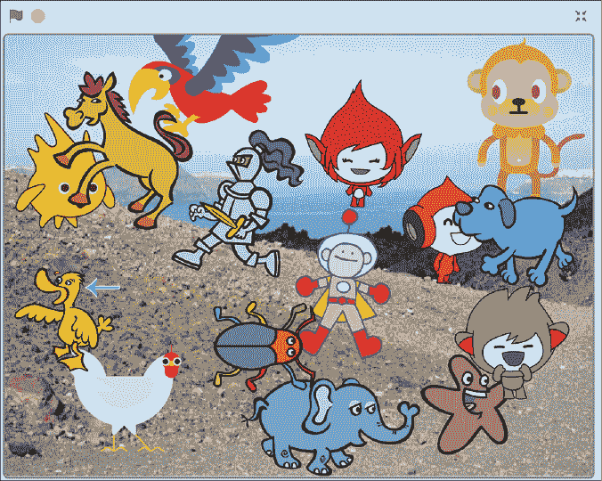

图 9-5: 这个项目的目标是找到那只鸭子。

### 训练你的模型

1.  创建一个新的机器学习项目，命名为`找到鸭子`，并设置它学习识别图片。

1.  点击**训练**，如图 9-6 所示。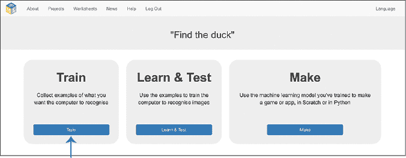

    图 9-6： 训练是机器学习项目的第一阶段。

1.  点击**添加新标签**，如图 9-7 所示。然后输入`Duck`。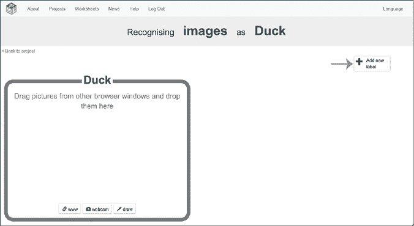

    图 9-7： 创建一个用于存储鸭子图片示例的训练桶。

1.  再次点击**添加新标签**，并将此桶命名为`Not the Duck`，如图 9-8 所示。（下划线会自动添加。）

    这个桶将用于存储*负训练示例*，即那些*不是*你希望计算机学习识别的内容。

    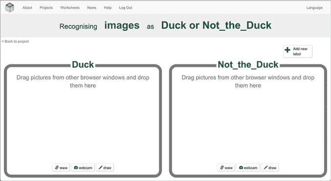

    图 9-8： 创建一个用于存储非鸭子图片示例的训练桶。

1.  点击屏幕左上角的**返回项目**。

1.  点击**制作**。

1.  点击**Scratch 3**，如图 9-9 所示。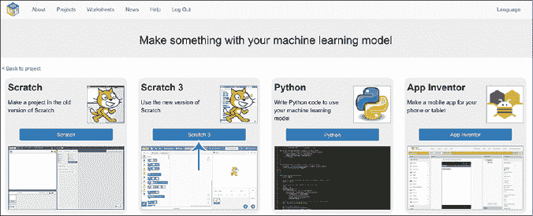

    图 9-9： 点击**Scratch 3**。

    你会看到一个警告，提示你还没有机器学习模型。没关系，因为你将使用 Scratch 来收集训练示例。

1.  点击**直接进入 Scratch**，如图 9-10 所示。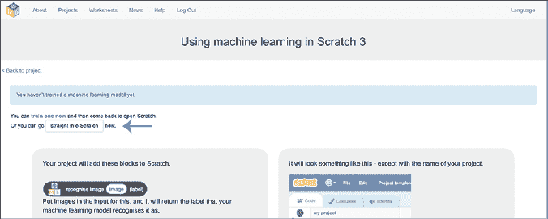

    图 9-10： 点击**直接进入 Scratch**打开没有机器学习模型的 Scratch。

1.  在顶部菜单中点击**项目模板**。然后点击显示的模板列表中的**查找鸭子**。

    该项目有 12 个精灵，排列在舞台上形成 3×4 的图块网格。当你首次加载模板时，精灵是隐藏的，但它们的名称如图 9-11 所示。

    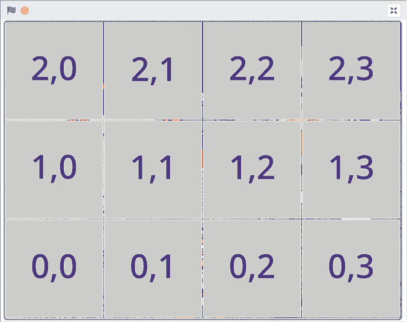

    图 9-11： 查找“查找鸭子”模板中的精灵。

1.  点击右下角精灵列表中的**0,0**精灵。在代码区的左上角，在黄色的 TRAINING 注释下，找到`store training data example of the duck`和`store training data example of NOT the duck`块，如图 9-12 所示。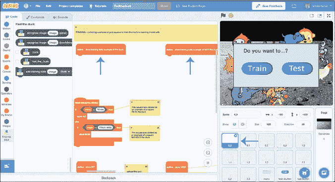

    图 9-12： 查找**0,0**精灵的脚本块。

1.  点击左侧工具箱中的**查找鸭子**组，然后在两个脚本中都添加一个`add training data`块。接着，从**图像**组中，将一个`backdrop image`块拖到两个`add training data`块中，如图 9-13 所示。

    将第一个脚本设置为将背景添加到“鸭子”训练桶，第二个脚本设置为将背景添加到“非鸭子”训练桶。

    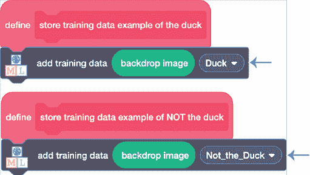

    图 9-13： 向两个训练桶添加训练示例。

1.  对所有 12 个精灵重复第 11 步（参见图 9-14）。完成后，点击任何一个图块都可以将示例添加到你的训练数据中。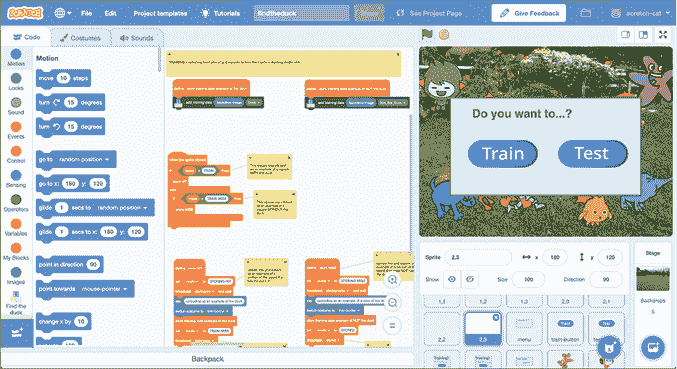

    图 9-14： 将脚本块添加到所有 12 个精灵。

1.  现在是收集训练示例的时间了！点击绿旗开始。当项目询问你是否想要训练或测试时，点击**训练**。

    当系统询问你是否点击鸭子时，点击**确定**，然后点击包含鸭子的瓷砖。你点击的瓷砖将被添加到你的鸭子训练桶中，如图 9-15 所示。

1.  当系统询问你是否点击一个没有鸭子的瓷砖时，点击**确定**。确保点击一个没有显示*任何*鸭子部分的瓷砖。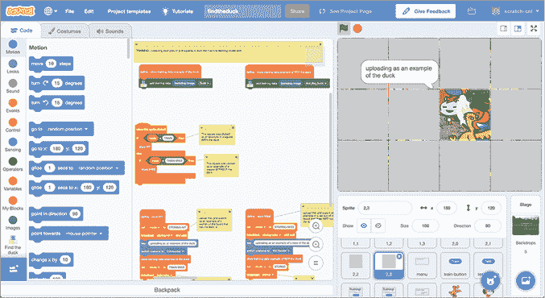

    图 9-15: 将鸭子的示例添加到训练数据中

1.  在“Machine Learning for Kids”网站上，点击**返回项目**，然后点击**训练**，确保一切正常工作。你应该能看到你点击的两个瓷砖，如图 9-16 所示。检查它们是否在正确的桶中。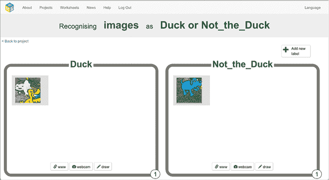

    图 9-16: 训练示例应该出现在训练阶段的正确桶中。

1.  在 Scratch 中重复步骤 13 到 15，直到每个桶中有 10 个示例，如图 9-17 所示。

    这里有两个关于**不是鸭子**训练示例的小贴士：

    +   确保每次为你的**不是鸭子**桶点击的角色都不相同。你不希望它成为识别鹦鹉等的训练集。制作一个好的**不是鸭子**训练集的最佳方法是点击其他角色的均匀混合。

    +   第二，尽量包含一些没有任何字符的瓷砖。你希望计算机学习到空瓷砖也是*不是鸭子*。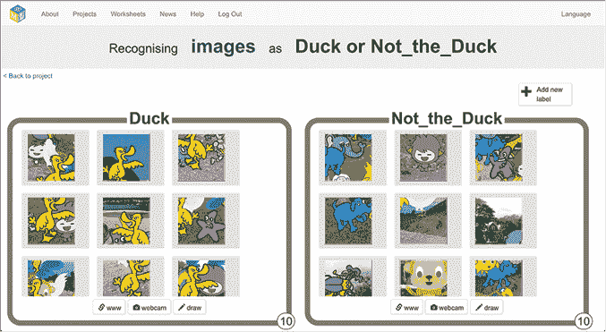

    图 9-17: *用于寻找鸭子的训练数据*

1.  点击**返回项目**，然后点击**学习与测试**。点击**训练新的机器学习模型**，如图 9-18 所示。

    等待模型完成训练，这可能需要几分钟时间。

    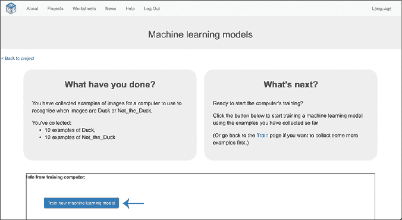

    图 9-18: 使用你收集的示例训练一个 ML 模型。

### 准备你的项目

接下来，你需要修改你的 Scratch 项目来完成测试脚本。

1.  点击右下角角色列表中的**0,0**角色，在代码区域找到`当我收到 test-0,0`脚本。它位于你之前编辑过的脚本右侧，如图 9-19 所示。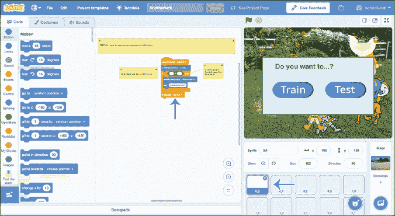

    图 9-19: 在**0,0**角色中找到测试脚本。

1.  在`当我收到 test-0,0`脚本中，从**找鸭子**组中拖入一个`识别图像（标签）`块，并按照图 9-20 所示进行更新。

    这个脚本将使用你的 ML 模型来测试左下角的瓷砖是否包含鸭子，如果是，它将显示“这里有鸭子吗？”的信息。

    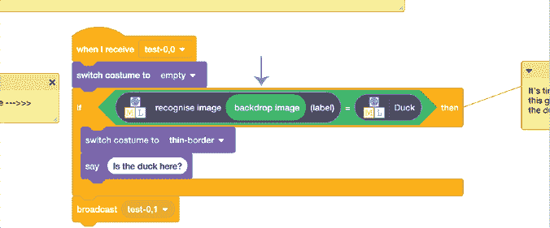

    图 9-20: 更新测试脚本以使用你的 ML 模型。

1.  对所有 12 个精灵重复步骤 2（见图 9-21）。一旦完成，你的机器学习模型就能检查所有瓷砖，找出鸭子所在的位置。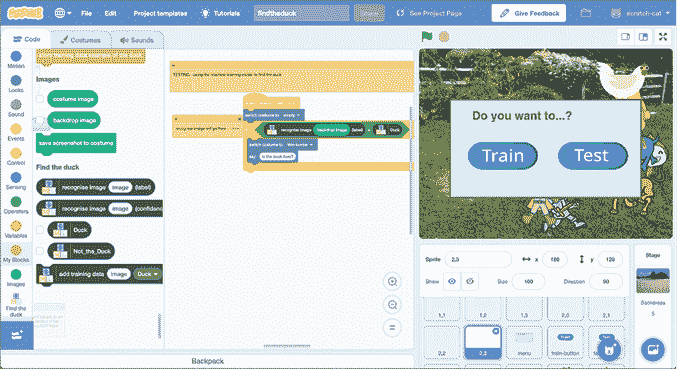

    图 9-21: 将测试块添加到所有 12 个精灵上。

### 测试你的项目

是时候测试你的机器学习模型了！

1.  点击绿色旗帜，然后点击舞台上的**测试**，以测试 Scratch 项目。

    你的项目将使用机器学习模型来测试每个瓷砖，并突出显示它识别为鸭子的任何瓷砖，如图 9-22 所示。

    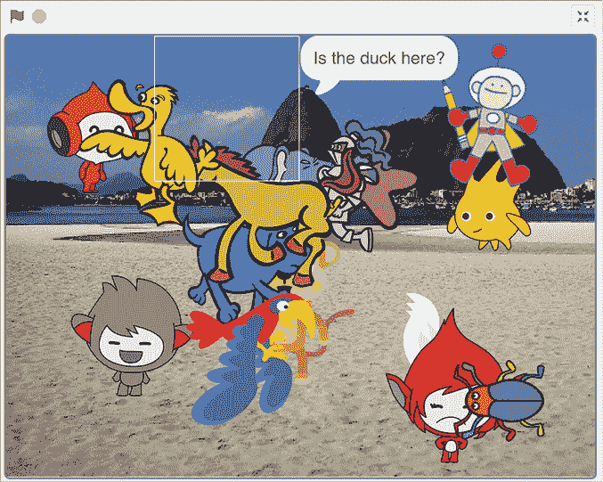

    图 9-22: 测试你的机器学习模型

1.  尝试几次，看看你的模型多经常正确识别。找到大场景中的小图像是一个复杂的任务，所以仅用 10 个训练样本，模型可能会犯一些错误。

1.  通过点击绿色旗帜并点击**训练**，如之前所做，向每个桶中再添加 10 个训练样本。你可以在训练阶段查看新的训练样本，如图 9-23 所示。

    点击**返回项目**，然后点击**学习与测试**，用更大的训练样本集来训练一个新的机器学习模型。

    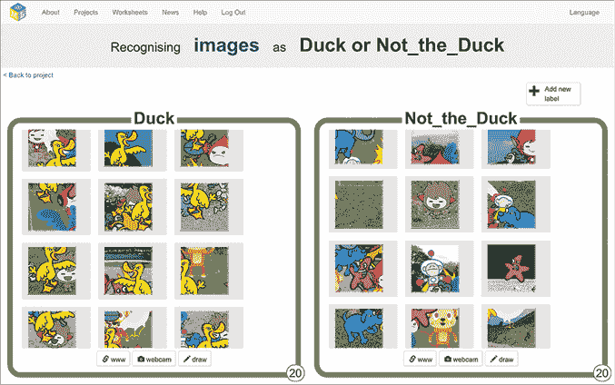

    图 9-23: 尝试使用每组 20 个样本训练新的机器学习模型。

1.  像之前那样重新测试。你的新机器学习模型是否更擅长找到鸭子？

## 审查并改进你的项目

你怎么描述机器学习模型的表现如何？

在第八章中，你学到了如何记录计算机正确与错误的次数：

1.  真阳性    计算机认为包含鸭子的瓷砖，且确实包含

1.  假阳性    计算机认为包含鸭子的瓷砖，实际并不包含

1.  真阴性    计算机认为不包含鸭子的瓷砖，且确实不包含

1.  假阴性    计算机认为不包含鸭子的瓷砖，实际却包含

你可以使用这个计数来绘制混淆矩阵，并计算机器学习模型的准确率、召回率和精度。

例如，查看图 9-24 中的测试图像。

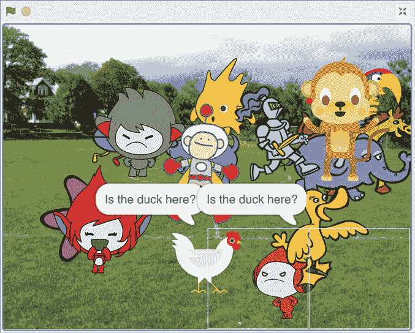

图 9-24: 测试图像，右下角的两个瓷砖被识别为匹配

鸭子出现在棋盘右下角的四个瓷砖中。我的机器学习模型识别出了其中两个，另外两个则漏掉了。所以，我的混淆矩阵看起来是这样的：

| **真阳性** 2 | **假阳性** 0 |
| --- | --- |
| **假阴性** 2 | **真阴性** 8 |

这个混淆矩阵给出了：

1.  精度：100%

    （每次我的机器学习模型认为看到了鸭子时，那里确实有一只鸭子。）

1.  召回率：50%

    （我的机器学习模型找到了包含鸭子的瓷砖的一半。）

1.  准确率：83%

    （我的机器学习模型给出了 12 个答案中的 10 个正确答案。）

你需要一个更大的样本量，包括不同的背景，才能真正信任这些数字。

我进行了五次测试，整体结果如下：

| **真阳性** 9 | **假阳性** 0 |
| --- | --- |
| **假阴性** 6 | **真阴性** 45 |

1.  精确度：100%

1.  召回率：60%

1.  准确率：90%

这些数字为我们提供了一种更有意义的方式来描述机器学习模型的表现。

我的模型只使用了少量示例进行训练，似乎非常精确（当它识别出一只鸭子时，总是正确的）。然而，它有时会遗漏一些内容。

我们描述了一个有时会遗漏内容的精确模型，称其为*偏向精确而非召回*。这种方法适用于那些不能错误识别事物的项目。

对于那些更重要的是不遗漏任何东西，并且偶尔犯错也无妨的项目，你应该训练机器学习模型，使其*偏向召回而非精确*。

你的项目表现如何？

## 复杂图像识别系统的实际应用

你可能以前训练过类似的图像识别机器学习模型。你有没有曾被网站要求通过点击街道标志图像来证明你是人类，如图 9-25 所示？或者是自行车？或者出租车？

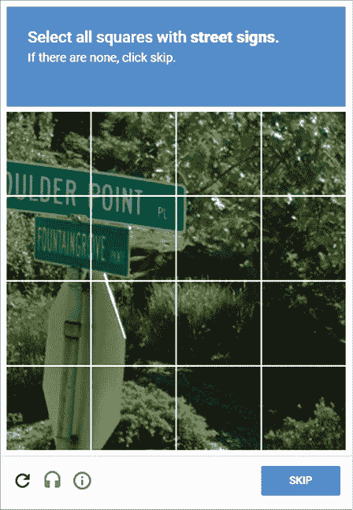

图 9-25： 帮助训练机器学习模型

希望你能理解这种图像识别应用程序，即*验证码*，将是收集大量训练样本的绝佳方式，以便训练一个能够在街道上识别不同物体的图像识别系统。你认为这对自动驾驶汽车的开发有帮助吗？

*这里的基本思想在章节的介绍部分有描述。如果我们想在更大的图像中找到某个小物体，我们就将图像分割成更小的图块，并使用训练好的机器学习模型分别测试每个图块，以识别该物体。

你可能已经对这种技术的挑战有了一些了解，尤其是亲自训练过它之后。例如，最大的挑战之一就是决定使用什么尺寸的图块。记得在图 9-1 中寻找树木的例子吗？

如果你将图块做得太小，你可能永远只能看到你想找的物体的一小部分，而无法识别出它。例如，你的机器学习模型可能无法将图 9-26 识别为树木。

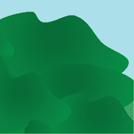

图 9-26： 只包含树木一部分的图块

另一方面，如果你将图块做得太大，如图 9-27 所示，你仍然会遇到图中有过多的非树木部分，这会挑战训练识别树木图像的机器学习模型。

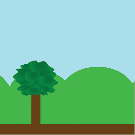

图 9-27： 一个过大，无法聚焦于树木的图块

如果你知道你在图像中寻找的物体的可能尺寸，你可以合理地估算使用什么尺寸的图块。有些系统甚至会要求用户指定图块的尺寸。

如果这两种解决方案都不可行，你可以尝试多种瓦片大小，并使用能让模型获得最高信心的结果，如图 9-28 所示。

即使你获得了正确的网格大小，你寻找的物体也不一定会完美地出现在瓦片的中心（就像你可能在鸭子示例中注意到的那样）。

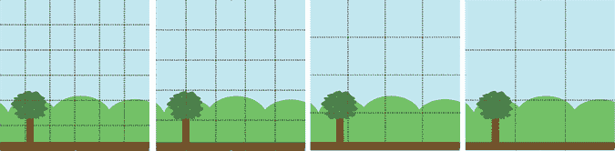

图 9-28： 如果你无法知道最佳大小，尝试各种瓦片大小。

为了提高在瓦片中心找到你想要的物体的机会，你还需要尝试不同的起始位置。

使用这些技术组合的系统可以非常有效。例如，在 2015 年，由于加利福尼亚州的干旱导致的紧急状态中，一个机器学习模型被用来寻找影响水使用的草坪、游泳池和其他特征。

将整个州的卫星图像切割成瓦片，就像你在项目中做的那样，这意味着每个瓦片都可以单独分类。主要的不同之处在于，加利福尼亚的机器学习（ML）模型不仅仅是识别一种物体，而是识别多种不同的事物，这些事物影响着水的使用。（你在第三章中看到了如何训练机器学习模型来识别不同物体的图片。）将图像识别与地图结合意味着加利福尼亚的官员可以快速了解全州水资源使用的影响。

加利福尼亚是一个庞大的州，手动进行这样的普查或调查需要很长时间。机器学习是一种快速且高效的方式来得出有用的估计，而在紧急情况下，速度和效率是非常重要的。

机器学习图像识别技术也经常在商业中使用。例如，无人机可以在飞越建筑物、屋顶、桥梁、太阳能板、管道等时拍摄高分辨率的照片。这些照片随后被切割成瓦片，并由一个经过训练的机器学习模型进行测试，用来识别损坏或维护不良的迹象。基于与本章项目相同原理的自动图像识别系统被应用于多个领域，如土木工程（用于检查桥梁和建筑物）、农业（用于识别健康或生病的植物和作物），甚至公共安全（例如在澳大利亚，机器学习被用于救生无人机，可以从空中识别鲨鱼）。

## 你学到了什么

在本章中，你训练了一个机器学习模型来识别作为更大场景一部分的物体。这是你迄今为止做过的最复杂的项目，但希望你现在对如何构建复杂的图像识别系统有了很好的理解。你学到了一些训练此类系统的挑战，比如知道如何将复杂的任务拆分为更简单的任务（例如选择正确的瓦片大小），并且你获得了一些解决这些问题的技巧。你还看到了这些复杂机器学习系统的一些实际应用，以及它们使用的领域实例。

在下一章，我们将探讨机器学习的另一个常见应用：智能助手*。
