# 第八章：智能助手

 在本章中，我们将看一下机器学习的一个常见家庭应用：智能助手，如 Siri、Alexa 或 Google Home，当你请求时，它们可以为你完成一些简单的任务，比如设定闹钟、启动计时器或播放音乐。

智能助手是经过机器学习训练的系统，能够识别文本的含义。你已经看到，你可以训练计算机，使它在你提供文本时，能够理解你想要表达的意思。如果计算机能理解你想说的，它就能理解你让它做什么。

要创建一个基于识别文本意图（*意图分类*）的文本分类程序，我们收集大量每种命令类型的示例，并使用机器学习来训练模型。

从你到目前为止完成的项目中，你已经熟悉了*分类* *意图分类*的部分。例如，消息可以被分类为赞美或侮辱，报纸头条可以被分类为小报或大报。计算机知道一些写作类别，当你给它一些文本时，它会尝试*分类*这些文本，或者找出这些文本应该归入哪个类别。*意图*部分是因为我们利用分类文本的能力来识别其意图。

*意图分类对于构建我们可以自然互动的计算机系统非常有用。例如，计算机可以识别出当你说“打开灯”时，意图是打开灯。这被描述为*自然语言接口**。换句话说，你不需要按开关来打开灯，而是使用*自然语言*——一种在人类中自然演变出来的语言，而不是为计算机设计的语言——来传达这个意图。**

**计算机通过我们提供的示例中的模式来学习——例如我们选择的单词、命令的措辞方式、我们如何将单词组合成特定类型的命令，以及我们在使用短命令与长命令时的不同，只是其中的一些例子。

在本章中，你将制作一个虚拟智能助手，它可以识别你的命令并执行你的指令（参见图 10-1）。

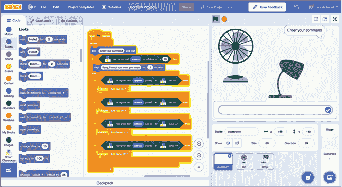

图 10-1: 在 Scratch 中制作智能助手

让我们开始吧！

## 创建你的项目

首先，你将训练机器学习模型来识别命令，以控制两个设备——风扇和灯——的开关。

### 在没有机器学习的情况下编写你的项目

正如我们在第七章中所看到的，通过先尝试编写一个没有使用机器学习的 AI 项目，来了解机器学习带来的差异是很有用的。如果你已经很好地理解了基于规则的方法与机器学习之间的区别，并且更愿意直接使用机器学习，可以跳过这一步。

1.  访问 Scratch 网站 [`machinelearningforkids.co.uk/scratch3/`](https://machinelearningforkids.co.uk/scratch3/)。

1.  点击屏幕顶部的**项目模板**，如图 10-2 所示。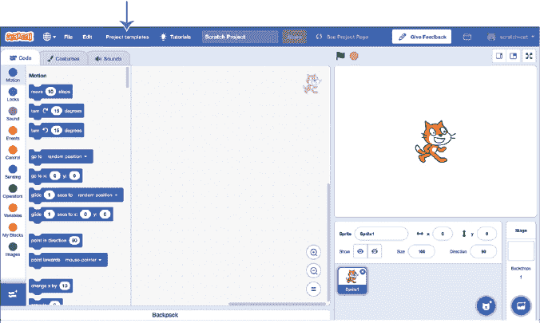

    图 10-2: 项目模板包含了起始项目，可以节省你的时间。

1.  点击**智能教室**模板。

1.  复制图 10-3 中显示的脚本。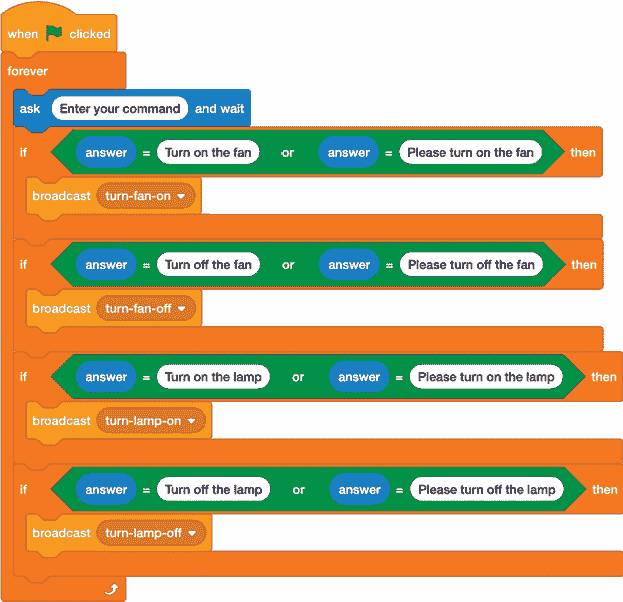

    图 10-3: 使用规则编码智能助手

    该脚本要求你输入一个命令。如果你输入`Turn``on`（或`off`）`the``fan`（或`lamp`），Scratch 将播放相应的动画。让我们试试看。

1.  通过点击绿色旗帜来测试你的项目。输入命令`Turn on the fan`并检查风扇是否真的开始转动。

    如果拼写错误会发生什么？如果更改措辞会发生什么（例如，“请开风扇”）？如果没有提到*fan*这个词会发生什么（例如，“我很热，我们需要一些空气！”）？

    为什么这些不起作用？

    你认为可以编写一个脚本来处理这四个命令的任何措辞吗？

回想一下第一章中的定义，我提到过，机器学习（ML）并不是创建 AI 系统的唯一方式。在这里，你通过基于规则的方法而不是机器学习（ML）创建了一个 AI 项目。通过尝试其他技术并了解它们的不足之处，你可以更好地理解为什么机器学习在许多项目中被优先选择。

### 训练你的模型

1.  创建一个新的机器学习（ML）项目，命名为`智能教室`，并设置它学习识别你喜欢的语言的文本。

1.  点击**训练**，如图 10-4 所示。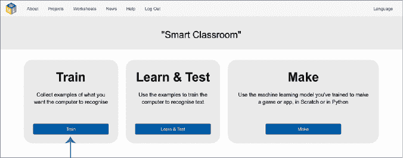

    图 10-4: 第一阶段是收集训练示例。

1.  点击**添加新标签**，如图 10-5 所示，创建一个名为`fan on`的训练桶。重复此步骤，创建三个名为`fan off`、`lamp on`和`lamp off`的训练桶。（下划线会自动添加。）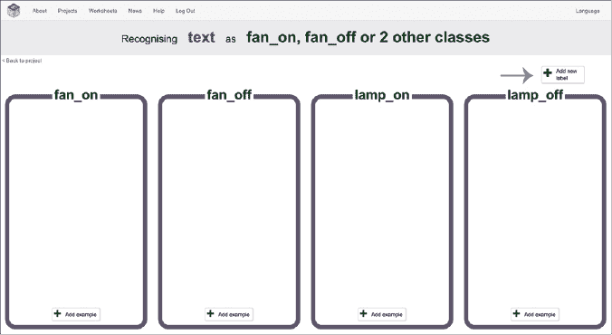

    图 10-5: 创建训练桶以识别命令。

1.  点击**添加示例**，**在**fan_on**桶中输入一个示例，说明你会如何请求别人打开风扇，如图 10-6 所示。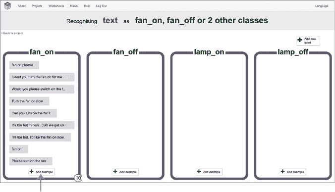

    图 10-6: 收集如何请求打开风扇的示例

    它可以简短（例如，“fan on please”）或较长（“你现在能为我打开风扇吗？”）。

    它可以是礼貌的（“请你开一下风扇吗？”）或不太礼貌（“现在把风扇打开”）。

    它可以包含单词*fan*和*on*（“你能开一下风扇吗？”）或两者都不包含（“这里太热了。我们能开点空气吗？”）。

    输入你能想到的尽可能多的示例，如图 10-6 所示。你需要至少五个示例，但我已经给了你六个，所以这应该不难！**

***点击**添加示例**，在**fan_off**桶中，如图 10-7 所示。

    这次，输入你能想到的尽可能多的请求别人关闭风扇的示例。你需要至少五个示例。这些将是你的 ML 模型用来学习“关闭风扇”命令的示例。

    尝试包括一些没有包含*风扇*或*关闭*这两个词的示例。

    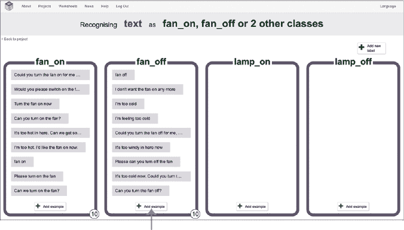

    图 10-7: 收集如何请求关闭风扇的示例

    +   对最后两个桶执行相同操作，直到你为所有四个命令至少提供五个示例，如图 10-8 所示。

    图 10-8: 智能助手项目的训练数据 * 点击屏幕左上角的**返回项目**。* 点击**学习与测试**。* 点击**训练新的机器学习模型**，如图 10-9 所示。

    计算机会使用你写的示例来学习如何识别你的四个命令。这可能需要一点时间。

    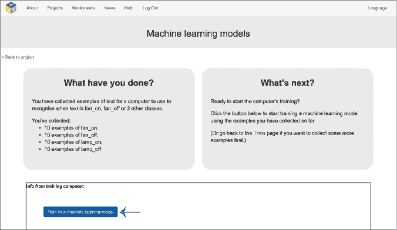

    图 10-9: 为你的智能助手训练一个 ML 模型。

    +   在训练了 ML 模型后，我们测试它，以查看它在识别新命令方面的表现。在**测试**框中输入一个命令，如图 10-10 所示。

**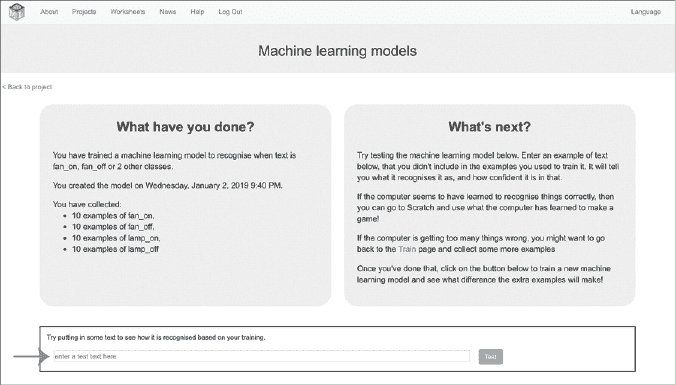**

图 10-10: 测试你的 ML 模型

如果模型犯错，你可以回到训练阶段，添加更多的命令示例，尤其是模型经常出错的命令。这就像教师通过学生的考试成绩差来找出学生需要复习的科目，以帮助提高学生的理解。

一旦你添加了更多示例，回到学习与测试阶段，训练一个新的 ML 模型。然后再次测试它，看看计算机是否能更好地识别命令。

### 用 ML 编程你的项目

现在你已经有了一个能够识别你命令的 ML 模型，你可以重新创建之前的项目，使用 ML 来代替你之前使用的规则。

1.  点击屏幕左上角的**返回项目**。

1.  点击**创建**。

1.  点击**Scratch 3**，然后点击**在 Scratch 3 中打开**以在 Scratch 中打开一个新窗口。

    你应该会在工具箱中看到一组新的块，用于你的 ML 项目，如图 10-11 所示。

    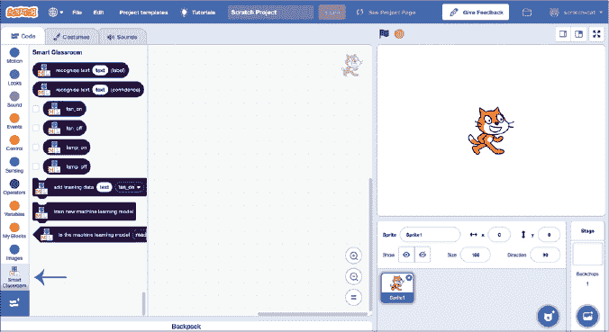

    图 10-11: 你的机器学习（ML）项目将被添加到 Scratch 工具箱中。

1.  点击顶部菜单栏中的**项目模板**，然后选择**智能课堂**模板。

1.  复制图 10-12 中显示的脚本。

    当你给这个脚本命令时，它将使用你的 ML 模型来识别命令并执行指令。

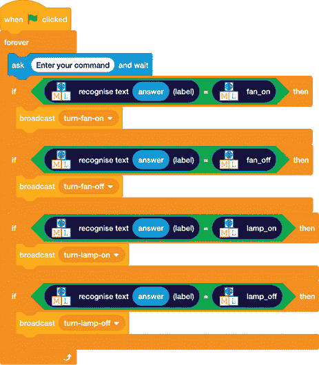

图 10-12: 智能助手的 ML 方法

### 测试你的项目

通过点击绿色旗帜并输入各种不同方式表述的命令来测试你的项目。看看你的智能助手与没有使用 ML 版本相比表现如何。

## 审查并改进你的项目

你已经创建了自己的智能助手：一个虚拟版的亚马逊 Alexa 或苹果 Siri，可以理解并执行你的命令！你可以做些什么来改善它的表现？

### 使用你的模型的置信度评分

返回到“学习与测试”阶段时，你应该已经注意到测试模型时显示的置信度评分。这告诉你计算机对识别命令的信心程度。

现在返回到“学习与测试”阶段，尝试输入一些不符合计算机已学习识别的四个命令的内容。

例如，你可以尝试提问“法国的首都是什么？” 如图 10-13 所示。

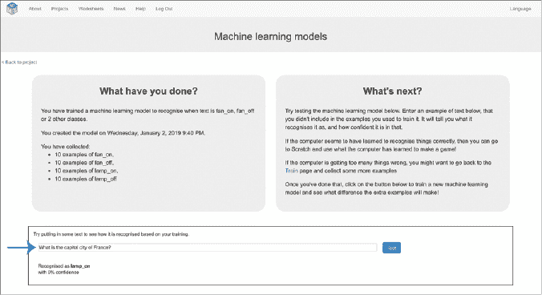

图 10-13： 测试你的智能助手

我的机器学习模型将其识别为“灯开”，但它对这个分类的置信度为 0%。那是机器学习模型告诉我它没有识别出该命令的方式。

“法国的首都是什么？”看起来不像我给机器学习模型提供的任何示例。这个问题与我用于训练模型的示例中识别的模式不匹配。这意味着它无法自信地识别这个问题为它已训练的四个命令之一。

你的机器学习模型可能有高于 0 的置信度，但它应该仍然是一个相对较低的数字。（如果不是，尝试添加更多示例来训练你的机器学习模型。）

尝试其他与风扇或灯具无关的问题和命令。将你的机器学习模型给出的置信度评分与它识别实际的风扇开、风扇关、灯开和灯关命令时显示的置信度评分进行比较。你的机器学习模型在正确识别某个命令时给出的置信度评分是什么？

一旦你熟悉了你的机器学习模型的置信度评分如何工作，你可以在你的 Scratch 项目中使用它。更新你的脚本，使其看起来像图 10-14 所示。

现在，如果模型的信心值不到 80%，它将显示一个“抱歉”的回应，持续 2 秒钟，并且不会执行该操作。

你需要将脚本中的`80`值更改为与你的机器学习模型行为相匹配的百分比。

你还能做些什么来改善你的项目？

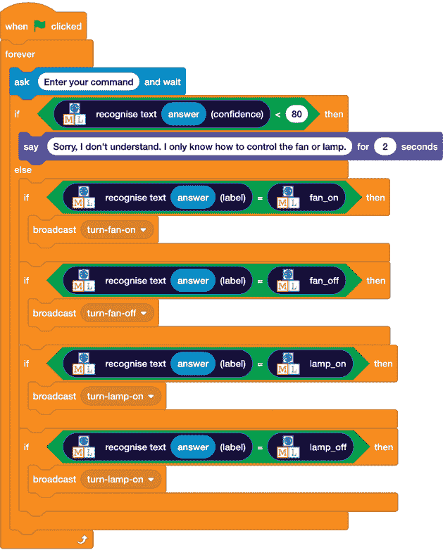

图 10-14： 在你的机器学习项目中使用置信度评分

### 使用语音输入代替键盘输入

你可以通过使用语音输入代替键盘输入，使你的项目更像现实中的智能助手。

在工具箱中，点击“扩展库”图标（看起来像两个方块和一个加号），添加**语音转文本**扩展，并更新你的脚本，如图 10-5 所示。

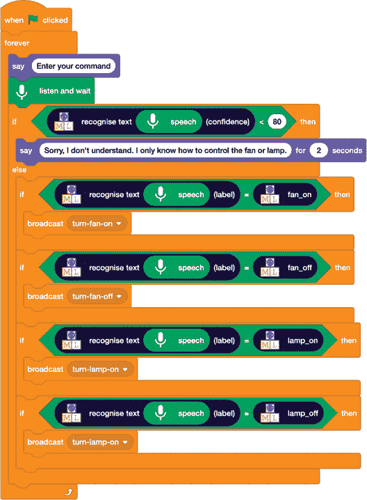

图 10-15： 为你的智能助手添加语音识别

你还能做些什么来改善你的项目？

### 收集训练数据

机器学习通常用于识别文本，因为它比编写规则更快。但正确训练模型需要大量的例子。要在现实世界中构建这些系统，我们需要比单纯自己输入所有例子更高效的收集方法。例如，与其让一个人写 100 个例子，不如让 100 个人每人写一个例子。或者是 1000 个人，或者是 10000 个人。

如果你能找出你的机器学习模型在哪些地方出错，你就可以收集更多的例子添加到训练集。例如，如果机器学习模型的置信度得分很低怎么办？或者如果某人不断以稍微不同的方式给出相似的命令怎么办？这可能意味着机器学习模型没有正确识别命令或没有按照用户的意图执行操作，这对你的训练来说是有用的反馈。如果用户点击了“我不满意”的大拇指向下按钮怎么办？如果他们最终按下了一个按钮去做某事怎么办？如果他们听起来越来越烦躁怎么办？

有很多方法可以猜测某些事情没有做得很好。每当发生这种情况时，这都是你可以收集的一个例子，并将其添加到你的训练集，以便下一个更新的机器学习模型在下一次能够做得更好。

我们使用所有这些技术（从大量人群中收集训练例子、获取用户反馈等等）来帮助我们构建可以理解你意思的计算机和设备。

## 你学到了什么

在本章中，我们研究了机器学习是如何用来识别文本的含义，以及它如何用来构建能够理解我们意思并按照我们要求行动的计算机系统。

在你的项目中，你使用了与*智能助手*相同类型的机器学习技术，*例如亚马逊的 Alexa、谷歌的 Google Home、微软的 Cortana 和苹果的 Siri。* *自然语言界面* *让我们通过使用像英语这样的语言告诉设备我们想让它们做什么，而不是仅仅通过按屏幕或按钮来操作。*

**当你询问智能手机时间，或要求设置闹钟、定时器，或播放你最喜欢的歌曲时，计算机需要对该命令进行分类。它需要将你选择的一系列词语进行分析，识别其意图。**

智能手机和智能助手的制造商通过制定一系列类别来训练机器学习模型，以识别用户命令的含义——所有他们认为用户可能想要给出的命令。然后，对于每个命令，他们收集了大量的例子，展示了用户可能会如何给出这些命令。

在这个项目和现实世界中，过程是这样的：

1.  预测你可能给出的命令。

1.  收集每个命令的例子。

1.  使用这些例子来训练机器学习模型。

1.  编写脚本或代码，让计算机在识别到每个命令时执行相应的操作。

要创建一个真正的智能助手，你需要为成千上万个命令重复这些步骤，而不仅仅是四个。并且，每个命令你都需要成千上万的示例。

在下一章，你将利用这个能力构建能够回答问题的程序。*******
