# 第九章：聊天机器人

在上一章中，我们讨论了*意图分类**：构建能够识别文本含义（意图）的机器学习系统。我们讨论了意图分类的一种常见应用，即构建能够理解我们指令并执行命令的智能助手。*

*在本章中，我们将讨论如何利用能够理解文本含义的机器学习模型来构建*问答（QA）* **系统**。QA 系统能够识别并回应我们的问题，从一组文档中自动发现答案。*

*与搜索引擎返回网页列表不同，QA 系统会对特定问题返回具体答案。这更具挑战性，因为它要求对问题及可能包含答案的网页或文档的含义有深入的理解。例如，问题“克利夫兰总统的妻子是谁？”的正确答案是“弗朗西斯·福尔森”，而不是包含美国总统传记的文档列表。*

QA 一直是人工智能研究的目标和活跃领域。例如，美国国家标准与技术研究院（NIST）自 1999 年起每年举办 QA 竞赛，大学和公司竞争看哪种计算机系统能够正确回答最多的问题。

或许更为人知的是 IBM 的 QA 计算机系统 Watson，正如第一章提到的，它曾参加美国电视智力竞赛节目*Jeopardy!*并击败了两位冠军。*Jeopardy!*以提出复杂且有时具有挑战性的问题而闻名，涵盖各种主题，因此它是对计算机系统的一项特别具有挑战性的测试。

*聊天机器人**，模拟人类对话的程序，对于计算机而言，比 QA 系统简单得多，原因有很多。首先，聊天机器人通常是为了回答单一相对较小且特定的主题的问题，而 QA 系统则试图回答关于任何主题的问题。*

*此外，聊天机器人回复通常是预先准备好的。简单的聊天机器人通常不期望自己能够找到答案。复杂的聊天机器人可能有更详细的脚本，允许跟进或澄清问题，但一般原则是相同的。*

聊天机器人正变得越来越普遍。它们通常用于客户服务，帮助公司回答公众关于产品和服务的问题。常见问题可以快速有效地得到回答，而更复杂的问题则会迅速转交给人工客服代表。

你可以在许多网站和手机应用程序上找到聊天机器人和虚拟助手——它们可以接收你的比萨订单，推荐衣物和时尚配件，回答关于天气的问题，管理你的银行账户，安排会议和预约，寻找餐厅并预定座位，提供帮助你管理疾病的建议等等。

在这个项目中，你将创建自己的聊天机器人，并训练它回答你选择的主题上的问题（如图 11-1 所示）。我们将遵循以下过程：

1.  预测用户可能会问的问题。

1.  收集这些问题的提问方式示例。

1.  使用这些示例来训练机器学习模型。

1.  准备计算机在识别到每个问题时应该给出的答案。

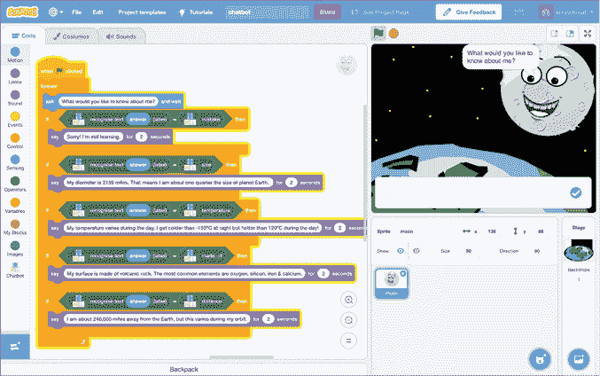

图 11-1: 聊天机器人使用机器学习回答我们的问题。

让我们开始吧！

## 构建你的项目

决定你希望你的聊天机器人回答关于什么问题。这个主题可以是任何你喜欢的，以下是一些建议，如果你想不出主题，可以参考：

+   你最喜欢的书

+   你最喜欢的电视节目

+   你最喜欢的运动队

+   你最喜欢的演员、作者或音乐艺术家

+   太空、行星和太阳系

+   恐龙

+   一段历史时期，比如古罗马或维京时代

在本章的截图中，我制作了一个回答关于月亮问题的聊天机器人。

### 准备你的角色

访问 Scratch 网站 [`machinelearningforkids.co.uk/scratch3/`](https://machinelearningforkids.co.uk/scratch3/)，并为你的问答聊天机器人添加一个背景和角色。

确保你创建的场景与主题匹配。例如，如果你制作一个聊天机器人来回答关于罗马帝国的问题，你可以绘制一位罗马军团士兵在战场上的图像。

对于我的关于月亮的聊天机器人，我绘制了一个太空主题的背景，如图 11-2 所示。

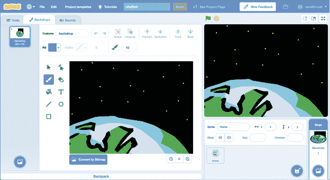

图 11-2: 为你的聊天机器人角色创建自定义背景。

对于我的聊天机器人角色，我制作了一个月亮精灵，并添加了卡通眼睛和嘴巴，如图 11-3 所示。

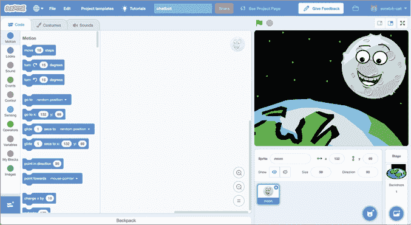

图 11-3: 为你的聊天机器人角色创建自定义精灵。

如果你不想自己绘制，你可以点击“选择背景”或“选择精灵”来选择一个现成的选项。或者，你也可以点击“上传精灵”或“上传背景”，使用你从网上保存的图片。例如，如果你正在制作一个关于你最喜欢的乐队的聊天机器人，你可以使用他们的照片。如果你正在制作一个关于学校或公司的聊天机器人，你可以使用它们的标志。

一旦你创建了你的聊天机器人场景，确保保存你的 Scratch 项目，因为之后会用到。如果你不确定如何操作，请阅读介绍部分的“保存你的工作”一节，第 xxiv 页。

### 训练你的模型

1.  创建一个新的机器学习（ML）项目，命名为`Chatbot`，并设置为学习识别你喜欢的语言中的文本。

1.  点击**训练**，如图 11-4 所示。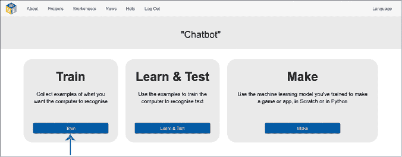

    图 11-4: 训练是机器学习项目的第一阶段。

1.  想一想人们可能会问的关于你选择的主题的最常见问题。

    对于我的主题——月亮，我猜人们会问月亮有多大。

    当你选择了第一个问题后，点击**添加新标签**，如图 11-5 所示，输入一个或两个词，代表这个问题。例如，我为我的训练桶标签使用了“大小”一词。  

    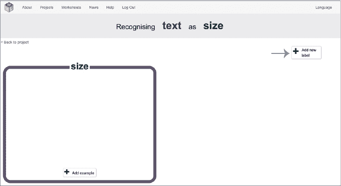  

    图 11-5: 创建一个桶来表示第一个问题的示例。

1.  点击**添加示例**，**并输入一种提问方式，如图 11-6 所示。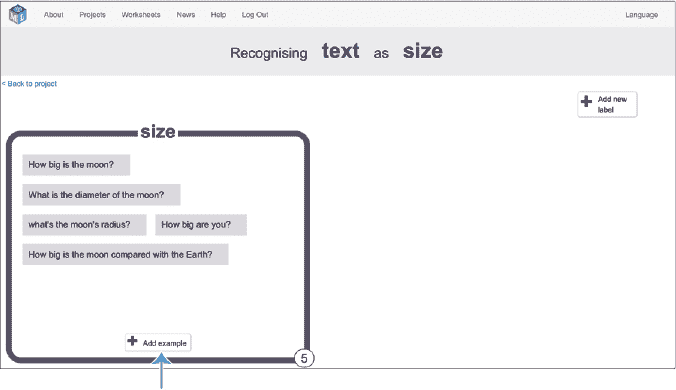  

    图 11-6: 添加提问第一问题的不同方式示例。  

    思考不同的人可能会如何表述这个问题。现在不需要担心答案。  

    输入尽可能多的提问方式，确保至少有五个示例。这些示例将用于训练 ML 模型，帮助其识别用户何时提出这个问题。  

    如果你的聊天机器人看起来像你正在提问的主题（比如我的卡通月亮正在回答关于月亮的问题），那么你可以包含一些向角色提问的示例问题，比如“你有多大？”**  

***  思考更多关于你主题的问题类型。再次点击**添加新标签**为每种问题类型创建一个训练桶，并点击**添加示例**，以添加如何提问该问题的示例。和之前一样，每种问题类型至少需要五个示例。  

    对于我的项目，我从四种类型的问题开始，每种问题提供五个示例（见图 11-7）。你的项目会根据主题的不同以及你能想到的问题数量而有所变化。  

    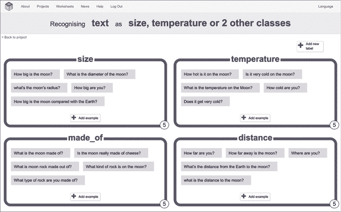  

    图 11-7: 写下不同类型的问题示例，用户可能会提问这些问题。  

    对于你的主题，你需要猜测最常见的问题，并想象人们可能提出这些问题的不同方式。现实中的 ML 项目通常会从实际客户或用户那里收集这些示例，以便计算机能学习到实际的提问方式和内容。例如，一个商店正在训练虚拟助手回答关于电视设置的问题时，会记录客户曾经打电话询问过的问题；或者一个银行正在训练虚拟助手回答关于储蓄账户的问题时，会记录客户在银行网站上通过聊天窗口提问的问题。这些公司可以利用真实的提问示例来训练他们的 ML 模型。  

    我们在第三章中看到，当机器学习（ML）模型使用与项目需求相似的数据进行训练时，它们能提供更好的答案。你了解到，如果想让 ML 模型识别不同动物的照片，你应该用照片进行训练；如果你想让它识别卡通图像，则应用卡通图像进行训练。  

    文本 ML 模型的工作方式类似。当我们用人们实际提问的方式训练它们时，它们会给出更好的答案。对现实世界 ML 项目来说，最好的做法是找现有的示例，而不是像我们在这个项目中所做的那样自己编造问题。*   点击屏幕左上角的**返回项目**。*   点击**学习与测试**，如图 11-8 所示。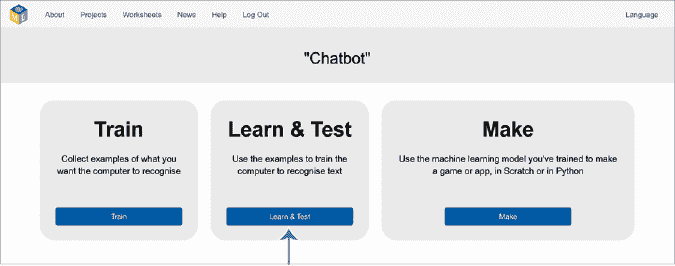

    图 11-8: 学习与测试是 ML 项目的第二个阶段。

    +   点击**训练新的机器学习模型**，如图 11-9 所示。

    计算机会使用你编写的示例来学习如何识别人们关于你选择的主题提出的问题。这个过程可能需要一分钟左右的时间。计算机利用这段时间学习每个训练类别中的问题的共性，例如你使用的词汇、问题的表述方式、问题的长短等。

**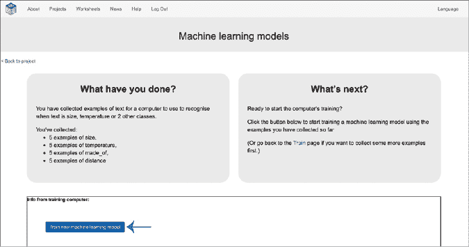**

图 11-9: 使用你编写的示例训练 ML 模型。

### 准备你的项目

现在你已经有了角色和 ML 模型，接下来是将它们结合起来创建你的聊天机器人。

1.  点击屏幕左上角的**返回项目**。

1.  点击**制作**，如图 11-10 所示。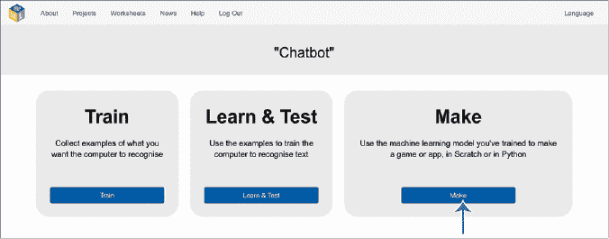

    图 11-10: 制作是 ML 项目的第三个阶段。

1.  点击**Scratch 3**，然后点击**在 Scratch 3 中打开**。Scratch 将会以新的区块集打开你的聊天机器人 ML 项目。

1.  点击**文件**▶ **从计算机加载**，如图 11-11 所示，打开你之前保存的带有聊天机器人场景的项目。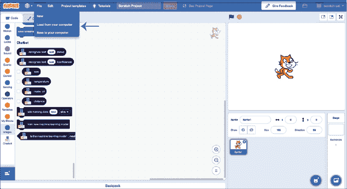

    图 11-11: 打开之前创建的场景项目。

1.  复制图 11-12 中显示的脚本。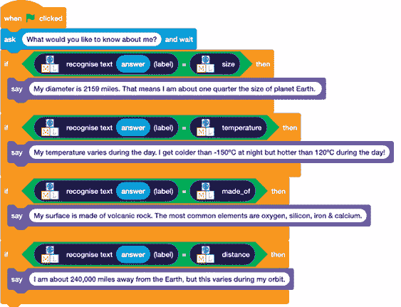

    图 11-12: 创建简单聊天机器人的示例脚本

    这个脚本会要求你输入一个问题，然后使用你训练的 ML 模型来识别你提问的内容。

    你的脚本应该和我的不同，因为我的脚本包含了关于月球的问题，这些问题是我用来训练我的 ML 模型的。一定要使用你自己的问题类型。

    你还需要在这里添加你选择的主题的答案。如果你不知道答案，现在正是进行一些研究，找出你的聊天机器人应该给出哪些答案的时候！

1.  点击**文件**▶**保存到你的计算机**以保存你的项目。

### 测试你的项目

点击绿色旗帜并尝试向你的聊天机器人提问。它能给出正确答案吗？

## 审查并改进你的项目

你已经创建了一个简单的聊天机器人，能够识别并回答你选择的主题的常见问题。做得好！

你可以做些什么来改进你的聊天机器人？

### 回应与记录用户报告的错误

AI 系统无法正确理解所有内容，因此你可以通过训练机器学习模型来处理错误，从而改进你的机器学习项目。处理错误的一个好方法是训练你的机器学习模型，识别出有人对它给出的结果表示抱怨。

回到训练阶段，添加一个新的训练桶，命名为`mistake`。并按图 11-13 所示，填充用户可能抱怨机器学习模型出错的示例。

例如，你可以将`That's not what I meant`添加到错误桶中。

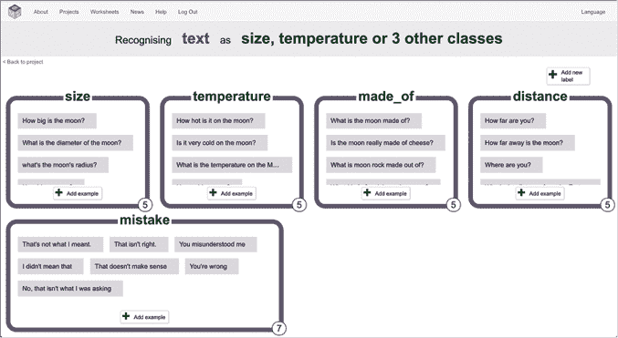

图 11-13: 收集用户可能抱怨模型犯错误的示例。

一旦你添加了至少五个示例，你需要回到学习与测试阶段，训练一个新的机器学习模型。

当你的聊天机器人识别到有人抱怨时，它可以给出的最简单回应就是向他们道歉。按图 11-14 所示更新你的脚本。

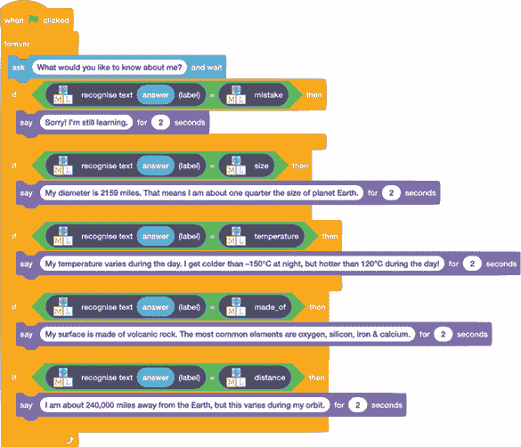

图 11-14: 更新你的脚本，使其在用户抱怨时进行道歉。

你可以通过记录错误来让你的项目变得更好。例如，我创建了一个新列表，叫做`mistakes`（为此，点击**变量**在工具箱中，点击**创建列表**，并输入名称`mistakes`），并按照图 11-15 所示更新了脚本，这样如果有人抱怨他们得到的答案，他们的问题就会被添加到列表中。

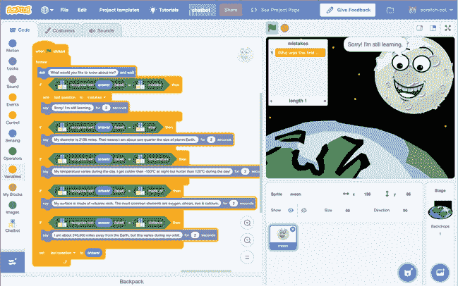

图 11-15: 保持记录聊天机器人出错的问题。

当我问，“谁是第一个登上月球的人？”时，我的模型告诉我月球离地球有多远。然后，当我回复“不是，我不是问这个”时，我关于第一个登月者的问题被添加到了错误列表中。

追踪错误是提高实际机器学习项目的常见技术。错误列表作为示例集合，用于训练机器学习模型的下一个版本。

你还可以做些什么来改进你的聊天机器人？

### 识别用户不高兴的时刻

你的聊天机器人用户可能不会总是告诉你机器学习系统出错了。那么，你能通过其他方式发现它犯错误吗？

在第七章中，你学到了如何训练机器学习模型识别写作中的语气和情感。你可以将该技术与这个项目结合起来，让你的聊天机器人识别出用户何时生气或恼火。

训练两个机器学习模型：一个用来识别问题的含义（就像你刚刚做的那样），另一个用来识别情感（比如“恼火”和“没有恼火”，类似于你在第七章中的项目）。如果第二个机器学习模型非常确信用户听起来很恼火，那么你的聊天机器人应该道歉，而不是再次尝试回答问题。

检测用户的语气，并在必要时道歉，是一种常见的技术，通常用于与公众沟通的聊天机器人，比如客服。人们如果发现某些技术不断误解他们，可能会感到恼火。如果系统能够识别出情况不佳并进行道歉，客户可能会更开心。在这种情况下，这些系统通常还会请求一位人类客服代表或经理加入对话并提供帮助。

还有什么其他方法可以改进你的项目吗？

### 只有在机器学习模型有信心时才回答问题

识别用户是否感到恼火是一件好事。但通常最好是避免一开始就让用户感到恼火！你可以利用置信度得分来防止你的聊天机器人给出错误的答案。

在第七章中你学到，置信度得分是由机器学习模型返回的一个百分比，表示模型对自己正确识别所训练内容的信心。

在这个项目中，如果置信度得分较低，意味着机器学习模型不确定是否理解了问题。你可以按照图 11-16 中所示的方式修改你的聊天机器人代码，使得如果模型未能理解问题，聊天机器人会道歉，而不是简单地猜测答案，并且将该问题添加到未来用于训练模型的示例列表中。

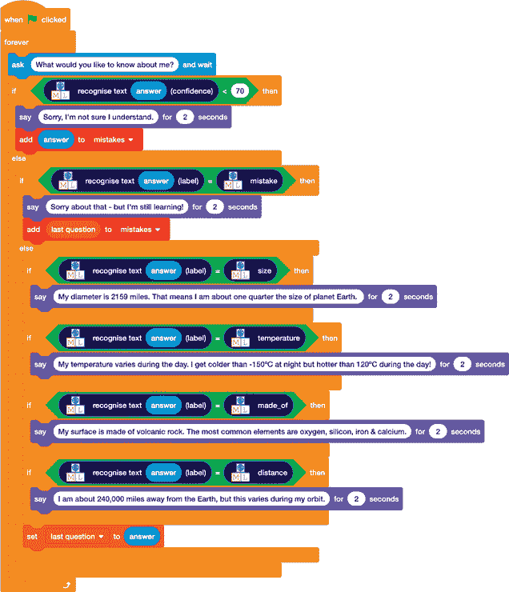

图 11-16: 通过记录问题来处理低置信度得分，以便在未来的训练中使用。

## 机器学习与伦理

这些改进你项目的建议基于现实世界中常见的机器学习项目方法。正如你所看到的，收集训练数据需要大量的时间和精力。为了节省时间，一些使用机器学习的公司收集足够的训练示例，以使机器学习模型基本能工作，然后让他们的客户开始使用它（有时将其描述为*测试版*来解释为什么它仍然会犯一些错误）。之后，他们会收集客户在使用机器学习模型时遇到的不良体验，以便改进训练数据。这可能意味着收集那些机器学习模型置信度得分较低的客户提问示例，或者客户报告说答案没有帮助。公司随后会审查这些客户问题，并将其分类到正确的训练数据集。

公司表示，他们这样做是因为这意味着他们的机器学习模型在未来能够更好地回答问题。他们用来训练的示例越具有代表性，系统就能提供更好的答案。但有时候，这会让那些没有意识到智能设备制造商可能会记录他们向设备提出的问题的人感到惊讶。试着在网上搜索关于你最喜欢的智能设备制造商监听用户提问的新闻故事。你能找到多少篇文章？你如何看待这些反应？

你认为这对创建机器学习系统的人员责任意味着什么？你认为机器学习开发者从他们的客户或用户那里收集训练样本是道德的吗？你认为他们应该告诉用户这一点吗？如果有用户不知道什么是训练样本，或者不知道它们对训练机器学习系统为何如此重要，你会如何向他们解释？

## 你所学到的

在本章中，你学到了机器学习模型可以被训练来理解和回应人们提出的问题。你了解了问答系统（QA）与其更简单的对手——聊天机器人之间的区别。接着，你设计了一个自定义聊天机器人，并训练了一个机器学习模型，以识别你选择的主题中最常见的问题。你看到了几种可以扩展聊天机器人以提高其性能和准确性的方法，比如跟踪错误、根据客户的反馈和语气做出适当的回应，并使用置信度评分来决定何时将问题转交给人工处理（例如在客户服务环境中）。最后，你了解了在使用真实人类反馈训练机器学习模型时需要考虑的一些伦理问题。

在下一章，我们将切换话题，首次训练一个机器学习模型来识别简化版视频游戏*吃豆人*中的数字。*****
