# 第十章：避开怪物

我和机器学习对未来电脑游戏具有激动人心的潜力，例如能够理解你话语和动作的电脑游戏角色。目前已经有一些游戏，游戏角色的行为类似于你在上一章中学习到的聊天机器人。然而，真正智能的游戏机会是巨大的，它们能够在游戏过程中自我适应。

在本章中，我们将讨论相反的情况：不是 AI 如何促进游戏开发，而是游戏如何在 AI 开发中发挥作用。

游戏提供了一个具有明确目标的模拟环境，一个收集训练样本的方法，以及衡量效果的方法，这使得它们成为计算机系统学习研究和开发的绝佳平台。

*吃豆人*（和*小姐吃豆人*）是一个经典的电脑游戏，经常被用于 AI 研究。*小姐吃豆人 AI 竞赛*，学者们提交机器学习系统，竞争看哪个系统在玩游戏时表现最好，自 2007 年以来已举行多次，并且至今仍被用作 AI 学生和研究人员的任务。*

*在本章中，你将尝试训练一个机器学习系统来玩简化版的*吃豆人*，目标是在迷宫中引导角色避开怪物（参见图 12-1）。

开始吧！

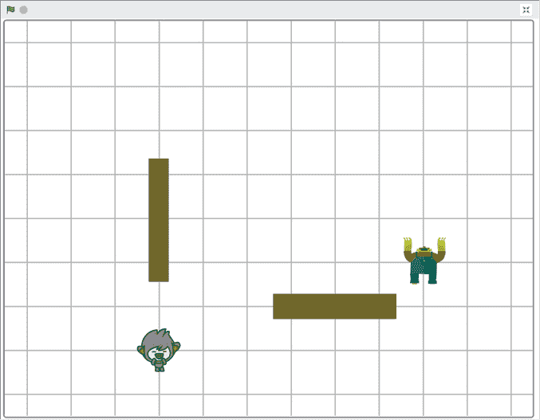

图 12-1: 我们可以训练一个机器学习系统来玩的简单视频游戏

## 构建你的项目

在我们开始之前，先亲自体验一下游戏，了解我们将训练计算机做什么。首先，访问[`machinelearningforkids.co.uk/scratch3/`](https://machinelearningforkids.co.uk/scratch3/)，然后点击顶部菜单栏中的**项目模板**，如图 12-2 所示。

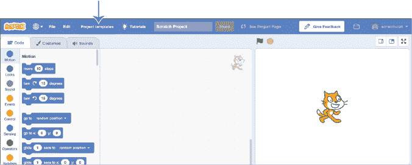

图 12-2: 从**项目模板**菜单中访问游戏。

点击**避开怪物**游戏，如图 12-3 所示。

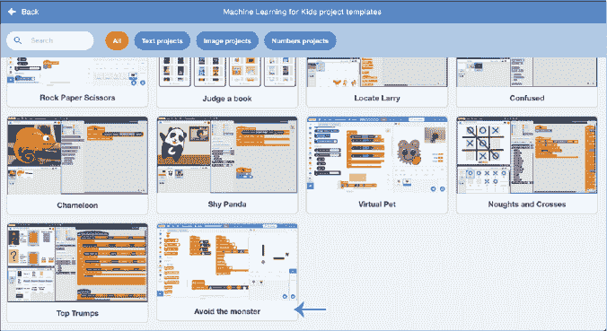

图 12-3: 在项目模板列表中点击**避开怪物**。

在这款游戏中，你扮演角色*nano*，它从舞台的左下角开始。你的目标是尽可能长时间避免怪物，怪物从舞台的右上角开始。

你可以通过方向键控制 nano 改变方向。Nano 只能沿着网格移动，所以你只能上下左右移动，不能斜着移动。

当你没有按下方向键时，nano 会继续沿着你上次按下的方向前进。

Nano 的移动速度不能超过怪物。游戏的代码使用定时器，使得 nano 和怪物每秒只能移动一次。

有两堵墙挡在路上。无论是 nano 还是怪物，都不能穿过这些墙。

尝试一下游戏。点击右上角控制面板中的全屏图标，然后点击绿色旗帜。

你能躲避怪物多久？

### 描述游戏状态

游戏板可以表示为图形，如图 12-4 所示。

图 12-4: 将游戏板看作是一个带有 x 轴和 y 轴的图形。

使用这个图形，你可以将 nano 和怪物的位置描述为一对坐标。例如，在图 12-4 中，怪物的位置是*x* = 7，*y* = 3。

我们将使用这种游戏表示方式来向计算机描述游戏。

我们希望给计算机四个数字，让它决定让 nano 向上、向下、向左或向右移动，以躲避怪物。

例如，如果我们输入图 12-5 中显示的坐标，计算机可能决定让 nano 向上移动。

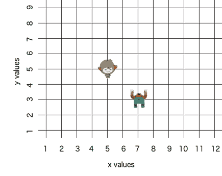

图 12-5: Nano 位于*x* = 5，*y* = 5，怪物位于*x* = 7，*y* = 3。

这个项目的目标是训练一个机器学习模型，决定最佳方向以躲避怪物。

### 训练你的模型

为了训练计算机玩游戏，你需要收集游戏进行时的示例。最好的方法是你自己玩游戏，并利用你的操作来训练计算机。

第一步是准备存储你所做动作示例的训练桶。

1.  访问* [`machinelearningforkids.co.uk/`](https://machinelearningforkids.co.uk/)*。创建一个新的机器学习项目，命名为`避免怪物`，并设置为学习识别数字。

1.  点击**添加值**，输入`nano x`作为值名称，并将**值类型**设置为**数字**。点击**添加另一个值**，然后添加三个值，分别命名为`nano y`、`monster x`和`monster y`，如图 12-6 所示。添加完这四个值后，点击**创建**。

    这些值将存储图形中两个角色的坐标。

    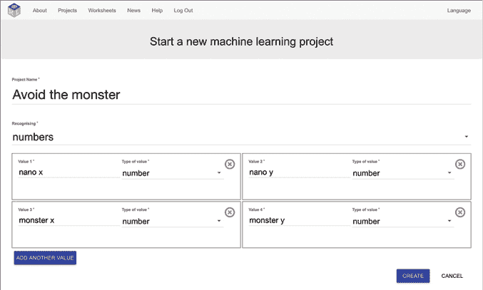

    图 12-6: 为“避免怪物”项目准备值。

1.  点击**训练**，如图 12-7 所示。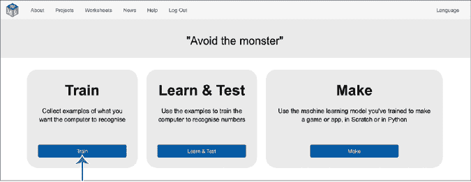

    图 12-7: 点击**训练**以准备你的训练桶。

1.  点击**添加新标签**，如图 12-8 所示，为 nano 可以移动的四个方向创建四个训练桶。命名为`go left`、`go right`、`go up`和`go down`。（下划线会自动添加。）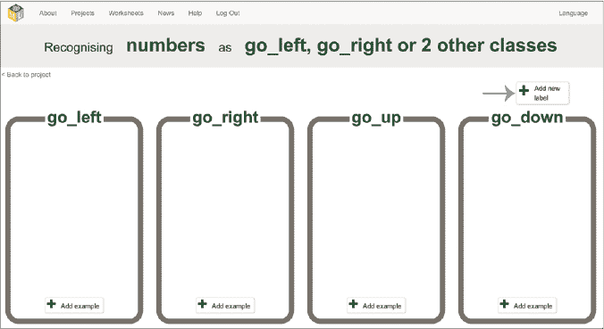

    图 12-8: 为 nano 可以移动的四个方向准备四个训练桶。

    例如，假设 nano 位于坐标*x* = 2，*y* = 3，而怪物位于坐标*x* = 6，*y* = 7，当你在玩游戏时，如果你按下右箭头让 nano 向右移动，这组数字将被添加到 go_right 训练桶中，如图 12-9 所示。

    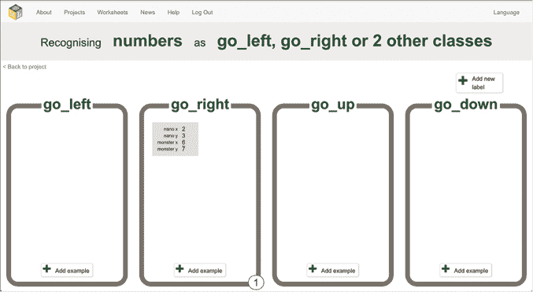

    图 12-9: 你在玩游戏时的移动将被添加到训练桶中。

    下一步是收集大量的示例，用于训练 ML 模型。我们将通过玩游戏来收集训练示例。

1.  点击**Back to project**，然后点击**Make**，如图 12-10:所示。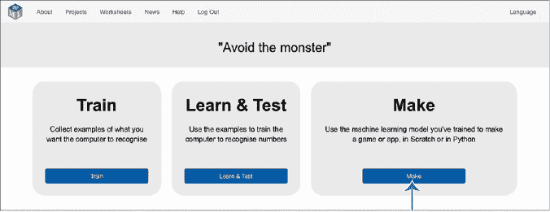

    图 12-10: 点击**Make**以在 Scratch 中使用你的项目。

1.  点击**Scratch 3**，如图 12-11:所示。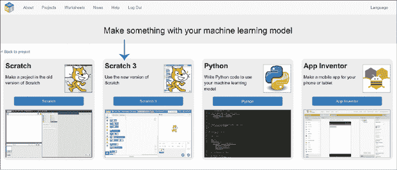

    图 12-11: 点击**Scratch 3**返回到 Scratch。

1.  点击**straight into Scratch**，如图 12-12:所示。

1.  点击顶部菜单栏中的**Project templates**。

1.  点击**Avoid the monster**再次打开模板，这一次包含来自你 ML 项目的积木块。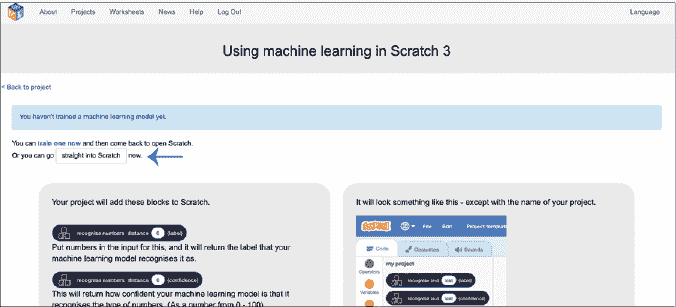

    图 12-12: 即使你还没有 ML 模型，点击**straight into Scratch**。

1.  点击屏幕右下角的**Stage**背景。在代码区域，找到第一个`When Green Flag clicked`脚本，如图 12-13:所示。

    图 12-13: 在代码区域找到第一个较短的绿旗脚本。

1.  在工具箱中点击**Avoid the monster**，将你训练桶的名称块拖入脚本，如图 12-14:所示。确保方向匹配；例如，将`go_left`拖入`set left to`块中。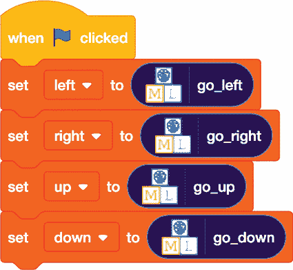

    图 12-14: 将你的项目标签添加到脚本中。

1.  在代码区域向下滚动，找到`define nano-decision`脚本，如图 12-15:所示。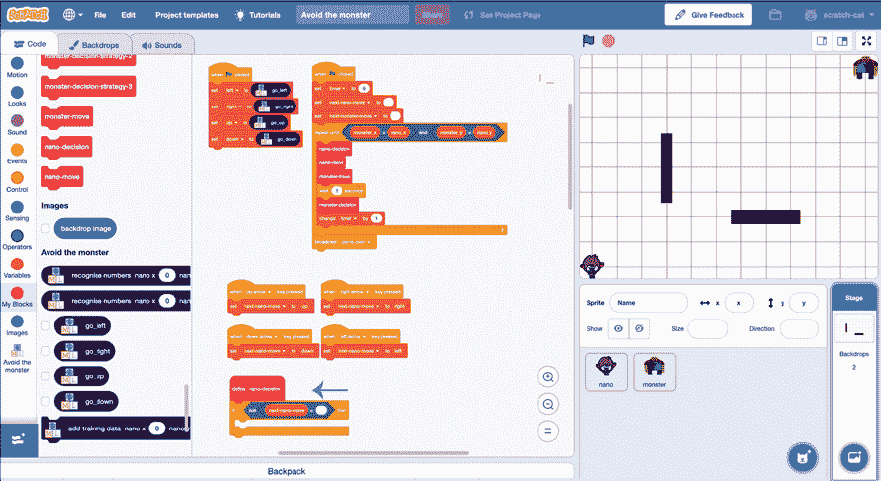

    图 12-15: 找到`define nano-decision`脚本。

1.  从工具箱中的**Avoid the monster**组中，拖动一个新的`add training data`块到脚本中，如图 12-16:所示。这个积木将把你在玩游戏时的每个动作添加到你的训练示例中。

    在工具箱中点击**Variables**，然后将图 12-16:中显示的积木拖入`add training data`块。每次移动时，角色和怪物的坐标将与所做的决策一起添加到你的训练示例中。

    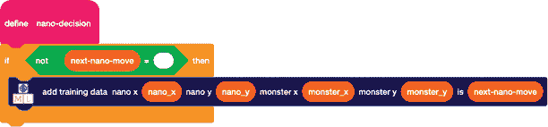

    图 12-16: 更新`define nano-decision`脚本。

1.  现在你需要保存项目，以便以后返回。在顶部菜单栏的**Scratch Project**文本框中，输入`Avoid the monster TRAINING`，如图 12-17:所示。这表明这是用来训练你的 ML 模型的项目版本。

    然后点击**File**▶**Save to your computer**。

    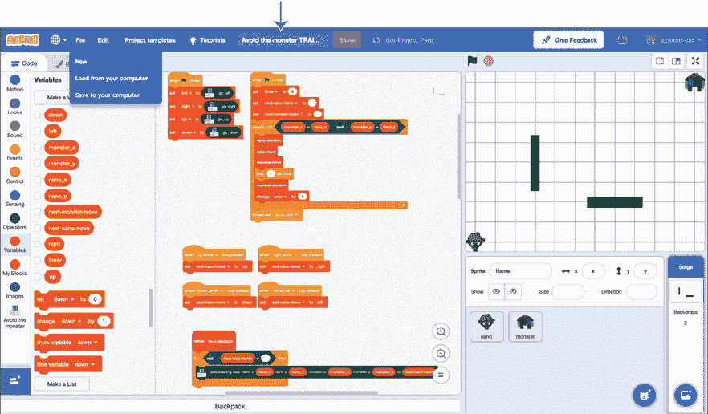

    图 12-17: 在保存此版本之前更新项目名称。

1.  玩游戏！

    在屏幕右上方的控制选项中，点击全屏图标，然后点击绿色旗帜开始游戏。使用方向键控制 nano 角色，就像你之前做的那样。

    尽力避免怪物，尽可能长时间保持躲避。你玩得越好，机器学习模型学习得也就越好。

    当你觉得玩得足够久时，点击红色的停止标志。

    如果你返回到训练阶段，可以看到你所做的动作，如图 12-18 所示。你可能需要刷新页面以查看最新的例子。

    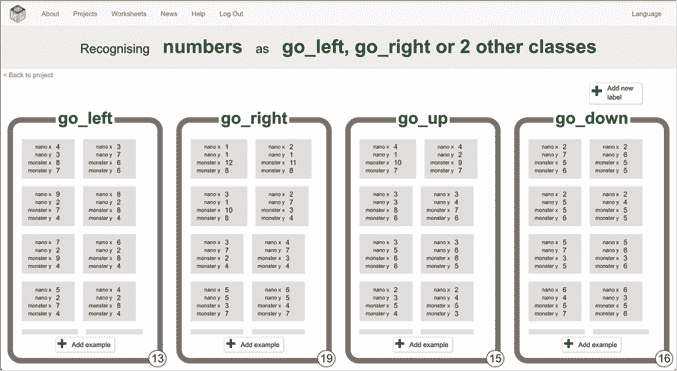

    图 12-18： 你在游戏中做的动作应该会显示在你的训练桶中。

1.  再玩几局，直到你认为已经收集了所有 nano 可能遇到的情况的例子。

1.  现在是时候使用你收集的例子训练机器学习模型了。点击**返回项目**，然后点击**学习与测试**，如图 12-19 所示。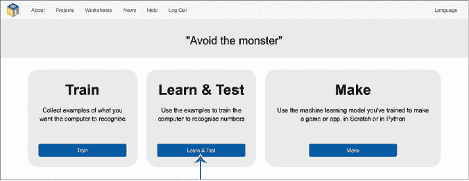

    图 12-19： 点击**学习与测试**，使用你收集的动作训练模型。

1.  点击**训练新机器学习模型**，如图 12-20 所示。

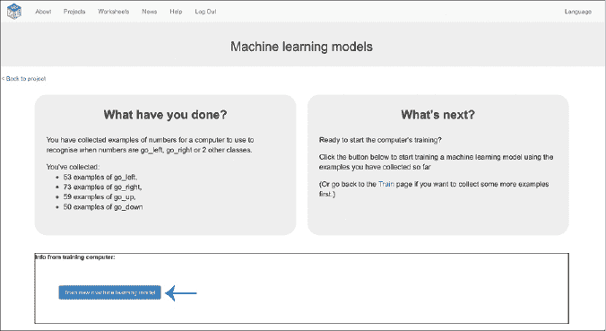

图 12-20： 使用你玩的动作训练一个新的机器学习模型。

### 测试你的游戏

你已经训练了一个机器学习模型来玩这个游戏！测试你模型的最佳方式是让机器学习模型控制 nano 角色，看看它能躲避怪物多久。

我们需要修改 Scratch 项目，使其能够由机器学习模型控制，而不是由方向键控制。

1.  在代码区域找到`when arrow key pressed`脚本。共有四个脚本，如图 12-21 所示：`when left arrow key pressed`，`when right arrow key pressed`，`when up arrow key pressed`，和`when down arrow key pressed`。

    删除这些脚本，可以通过点击每个模块并按删除键，或者通过右键点击每个模块并选择**删除模块**。确保删除所有四个脚本中的每一个模块，这样你就无法通过任何方向键控制角色了。

    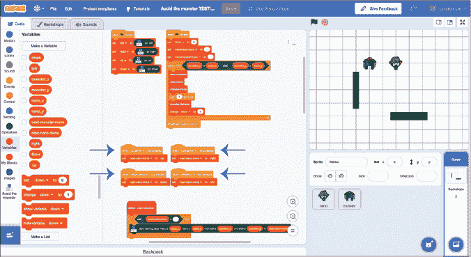

    图 12-21： 删除四个`when arrow key pressed`脚本，这样你就无法再控制 nano 了。

1.  找到你之前更新的`define nano-decision`模块。使用工具箱中的**变量**和**避免怪物**组中的模块，重新更新脚本，使其看起来像图 12-22 所示。

    现在，你不再让计算机从你的方向键学习，而是希望计算机使用你的机器学习模型做出决策。

    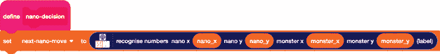

    图 12-22： 更新`define nano-decision`脚本，以便你的机器学习模型控制游戏。

1.  找到较长的`when Green Flag clicked`脚本，删除`wait 1 second`模块。

    这样可以让游戏运行得稍微快一些，这样你就不必等每个动作。更新后的脚本将如图 12-23 所示。（箭头显示了我移除该积木前的位置。）

    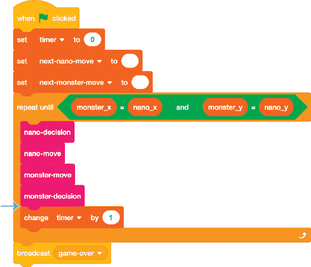

    图 12-23: 移除 `wait 1 second` 块。

1.  现在你需要再次保存你的项目，以便稍后能返回。此次，在文本框中输入名称`Avoid the monster` `TESTING`，这样你就能知道这个版本的项目是让机器学习模型来玩的。然后，点击**文件**▶**保存到你的电脑**。

1.  点击全屏图标，然后点击绿色旗帜。

    看着你的机器学习模型尝试保护纳米免受怪物的攻击（图 12-24）！

图 12-24: 你的机器学习项目运行中

## 审查并改进你的项目

你的机器学习模型表现如何？

它成功避开怪物的时间越长，表现就越好。如果你做得很好，它将能够永远避开怪物。因为怪物的移动速度和纳米一样，只要你的机器学习模型不犯错误，纳米有可能永远领先怪物。

训练量的差异有多大？

尝试打开你*训练*版的 Scratch 项目，通过玩游戏稍微长一点时间来添加更多的训练示例。然后，返回到学习与测试阶段，使用你额外的训练示例来训练一个新的机器学习模型。最后，打开你*测试*版的 Scratch 项目，观看新的机器学习模型玩游戏。

额外的训练有帮助吗？

尝试多做几次，看看训练量如何影响你的机器学习模型的表现。

你在这个项目中训练的机器学习模型类型被称为*决策树分类器*，因为模型根据下一步的决策方式可以绘制成一种树形结构，如图 12-25 所示。要查看你的机器学习模型的图示，在学习与测试阶段，点击**描述你的模型！**，位于测试按钮旁边。

*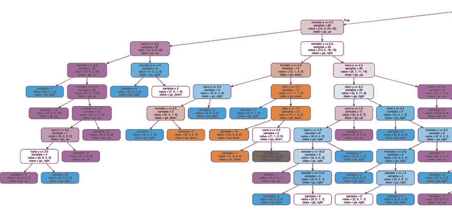

图 12-25: 决策树

决策树图示有助于你理解机器学习模型如何对每一步的结果做出*预测*。

树中的每个框代表一个测试；例如，怪物 x < 3 意味着“怪物的 x 坐标小于 3 吗？”如果测试为真，树将跟随左箭头。如果测试不成立，树将跟随右箭头。

机器学习模型从树的顶部开始，按照测试确定的箭头一路往下，直到到达树的底部。

要查看决策过程的示例，请在决策树右侧的框中输入 nano 和怪物的坐标，然后点击**测试**。图表将突出显示你的机器学习模型如何对这些坐标进行预测。当没有更多箭头可跟随并且到达树的底部时，你将找到最终的预测结果，如图 12-26 所示。

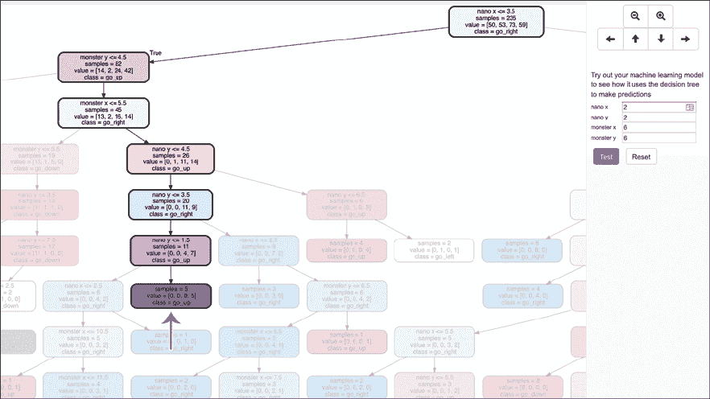

图 12-26: 突出显示用于预测移动结果的坐标

使用不同的坐标集测试你的模型，以了解它是如何学会做出预测的。

## 你学到了什么

在本章中，你学到了机器学习模型可以通过训练来识别数字集合中的模式。你使用了一个决策树分类器来训练一个模型，模拟玩简化版的游戏*吃豆人*，利用一组 x 和 y 坐标来基于预测结果决定其下一步动作。

决策树并不是训练机器学习模型以基于数字进行预测的唯一方法，但它是一个受欢迎的选择，因为它非常快速且是最容易理解的技术之一。在前面的章节中，你一直在使用神经网络，虽然它们可能更强大，但更复杂且难以理解。

你已经看到，与之前训练的其他机器学习模型一样，随着你收集更多的训练示例，模型的表现会逐渐提高。在下一章，你将了解训练数据量对机器学习项目的影响。**
