# 第十一章：井字游戏

 在上一章中，你看到了像*吃豆人*（Pac-Man）这样的计算机游戏是如何用于机器学习发展的。井字游戏（也叫零与叉，或 X 与 O）已经被用来帮助人们了解机器学习更长时间了。

例如，英国人工智能研究员唐纳德·米奇（Donald Michie）于 1960 年设计了*MENACE*，即*机器可教零与叉引擎*（Machine Educable Noughts and Crosses Engine）（见图 13-1）。它是第一个能够学会完美下井字游戏的程序之一。MENACE 的演示使用了火柴盒和彩色玻璃珠，这提醒我们，许多机器学习背后的原则是在几十年的时间里发展起来的。

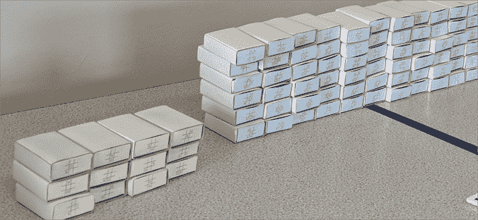

图 13-1: 唐纳德·米奇的机器可教零与叉引擎（MENACE）的重建（来源：Matthew Scroggs，[`commons.wikimedia.org/wiki/File:Mscroggs-MENACE-cropped.jpg`](https://commons.wikimedia.org/wiki/File:Mscroggs-MENACE-cropped.jpg)）

然而，井字游戏并不是唯一被用于推动人工智能发展的游戏。象棋是另一个很好的例子。在第一章中，我提到了 IBM 的计算机深蓝（Deep Blue），它击败了国际象棋世界冠军加里·卡斯帕罗夫。这是几十年努力的结果，目的是让计算机能够下象棋。早在 1950 年代，数学家艾伦·图灵就写了一篇名为《数字计算机在游戏中的应用》的论文，他在其中提出了一个问题：“是否能制造出一种机器来下象棋，并且能够通过不断的游戏积累经验，逐步提高其棋艺？”

近年来，人工智能社区将注意力转向了更复杂的游戏，比如围棋（*Go*）。由于围棋中有极其庞大的潜在走法和策略，依靠像深蓝那样的“暴力破解”方法（计算机检查所有可能的未来走法和棋局）是行不通的。2016 年，Google DeepMind 的计算机 AlphaGo 在人工智能研究中取得了一个里程碑，当时它击败了围棋世界冠军李世石（*Go*）。

*创建神经网络的工具变得越来越容易使用，而我们的计算机也变得更快更强大，超越了人工智能学生和研究人员的领域。如果你在网上搜索“超级马里奥神经网络”，你会找到数十个训练机器学习模型玩像*超级马里奥世界*这样的游戏的例子和教程。

然而，在本章中，我们将专注于基础内容。我们将在 Scratch 中构建唐纳德·米奇的 MENACE 设计的简化版本，并训练一个机器学习模型来玩井字游戏（见图 13-2）。

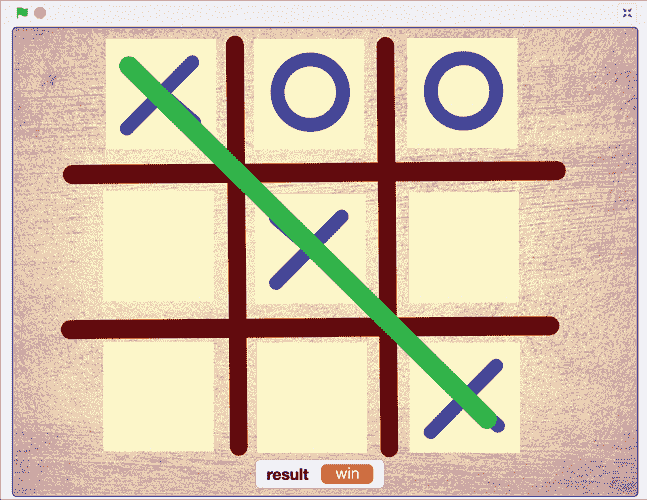

图 13-2: 井字游戏是一个非常适合机器学习研究的游戏。

让我们开始吧！

## 构建你的项目

你可能已经知道如何玩井字游戏，但让我们快速在 Scratch 中试一试，看看如何规划将机器学习引入其中。

访问[`machinelearningforkids.co.uk/scratch3/`](https://machinelearningforkids.co.uk/scratch3/)，然后点击顶部菜单栏中的**项目模板**，如图 13-3 所示。

在模板列表中，点击**圈圈叉叉**。该模板加载了一个简单的井字游戏在 Scratch 中。点击绿色旗帜试一试。

你在放置叉（X），计算机在放置圈（O）。计算机的策略并不聪明，但在这一章中，你将让它变得更智能。

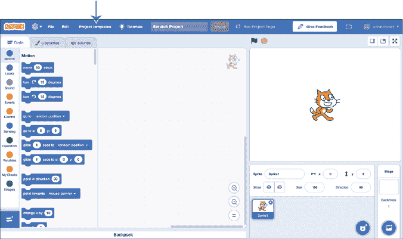

图 13-3: 从顶部菜单访问项目模板。

尝试找出计算机遵循的规则。计算机下一步走的位置逻辑都在代码区，因此你可以查看那里的脚本，看看自己是否猜对了。

有许多方式可以表示游戏棋盘，但为了开始，我们将使用一种非常简单的方法：给棋盘上的每个格子编号，从 1 到 9，如图 13-4 所示。

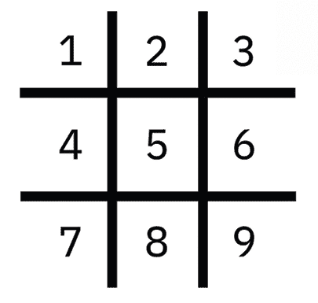

图 13-4: 一种表示棋盘的方法是给格子编号。

在 Scratch 项目模板中，格子也通过数字表示，如图 13-5 所示。

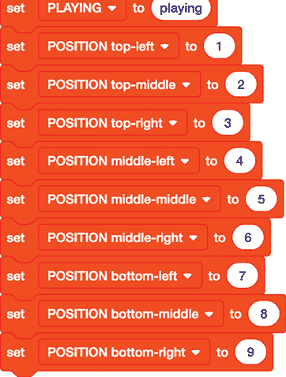

图 13-5: 在 Scratch 项目模板中定义的游戏棋盘表示

我们还需要描述棋盘上圈圈和叉叉的位置。我们希望从任何一方的胜利中学习（无论是圈圈还是叉叉获胜），因此为了清晰起见，我们会用*玩家*来描述获胜方的走法，用*对手*来描述失败方的走法。

例如，假设棋盘在游戏早期的样子像图 13-6，最终是叉（X）获胜。

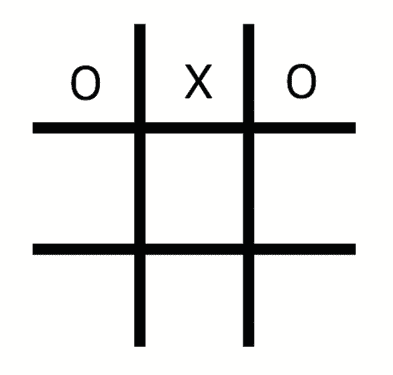

图 13-6: 一个示例游戏棋盘状态

我们可以这样描述这个棋盘：

| 左上 | 对手 |
| --- | --- |
| 上中 | 玩家 |
| 右上 | 对手 |
| 左中 | 空 |
| 中中 | 空 |
| 中右 | 空 |
| 左下 | 空 |
| 底部中间 | 空 |
| 右下 | 空 |

我们希望训练一个机器学习模型，使得给定像这样的棋盘状态时，它能够选择下一步走在哪里。为了实现这一目标，我们需要训练示例，这些示例包含了导致胜利的决策。每个示例需要包括：

+   走棋前棋盘的样子

+   哪一步是走的

训练示例仅会记录玩家获胜方的走法。如果你（叉）赢得了游戏，那么你希望用叉（X）的走法来训练模型。如果计算机（圈）赢得了游戏，那么你希望用圈（O）的走法来训练模型。

### 准备你的游戏

和上一章的*吃豆人*风格游戏一样，收集训练示例的最佳方法不是通过键入它们，而是亲自玩游戏。

第一步是准备训练数据桶，用于存储你所做的每个动作的示例。你将需要九个训练数据桶，每个桶对应游戏中的每个可能选择。

1.  访问*https://machinelearningforkids.co.uk/*，创建一个新的机器学习项目，命名为`Tic Tac Toe`，并设置为学习识别数字。

1.  点击**添加一个值**，输入`TopLeft`作为值名称，将**值类型**设置为**多选**。在**选择项**下，添加三个选择项：`EMPTY`、`PLAYER`和`OPPONENT`。然后点击**添加另一个值**，并添加八个具有相同三个选择项的多选值：

    1.  `TopMiddle`

    1.  `TopRight`

    1.  `MiddleLeft`

    1.  `MiddleMiddle`

    1.  `MiddleRight`

    1.  `BottomLeft`

    1.  `BottomMiddle`

    1.  `BottomRight`

    确保所有九个值的选择拼写*完全*相同，这样计算机才能知道每个游戏板上的空格所能选择的内容是相同的。如果你打错字，点击选择旁边的红色 X 删除它，然后重新添加。

    完成后，你的屏幕应显示如图 13-7 所示。

    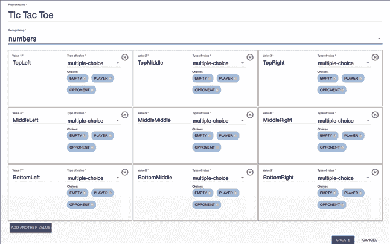

    图 13-7: 准备项目

1.  点击**创建**。

1.  点击**训练**，如图 13-8 所示。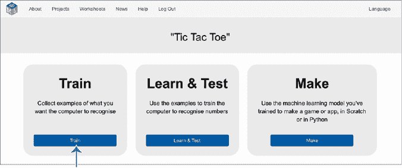

    图 13-8: 点击**训练**来准备训练数据桶。

1.  点击**添加新标签**，如图 13-9 所示，并创建九个训练数据桶来表示游戏板上的九个格子。命名为`top left`、`top middle`、`top right`、`middle left`、`middle middle`、`middle right`、`bottom left`、`bottom middle`和`bottom right`。（下划线将自动添加。）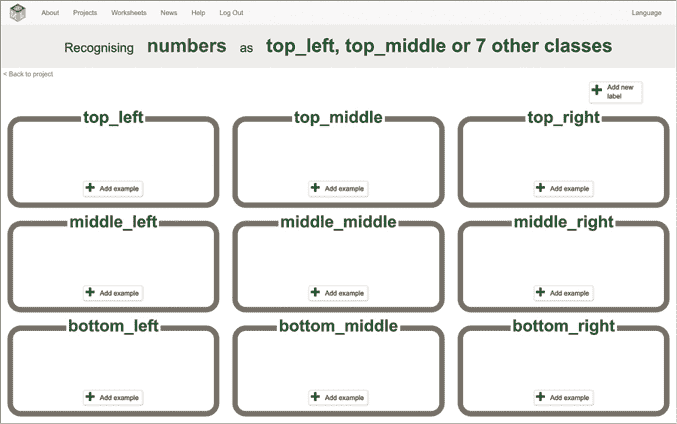

    图 13-9: 井字游戏的训练数据桶

    这些数据桶是存储你的训练示例的地方。例如，回顾图 13-6 所示的游戏板状态。如果玩家的下一步（X）落在`middle_middle`格子中，游戏板的状态将记录在训练数据中，如图 13-10 所示。

    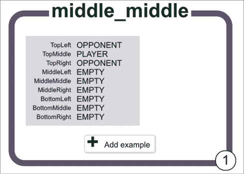

    图 13-10: 井字游戏的训练示例

    下一步是收集大量示例来训练机器学习模型。

1.  点击屏幕左上角的**返回项目**。

1.  点击**制作**。

1.  点击**Scratch 3**，然后点击**直接进入 Scratch**，如图 13-11 所示。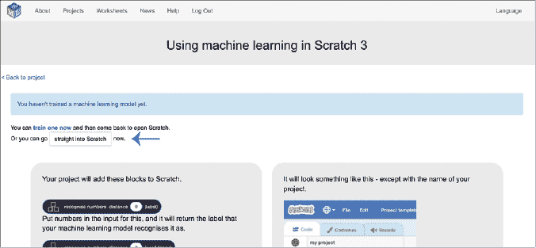

    图 13-11: 点击**直接进入 Scratch**，即使我们还没有机器学习模型。

1.  再次打开**井字游戏**项目模板。

    代码与之前打开该模板时相同，但现在你在工具箱中有额外的模块用于你的项目。

1.  点击屏幕右下角的 **舞台** 背景。在代码区域，找到 图 13-12 中所示的 `setup model labels` 脚本。该脚本设置了整个项目中使用的常量。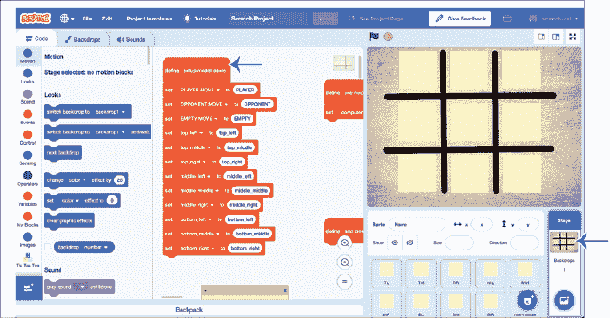

    图 13-12: 找到 `setup model labels` 脚本。

1.  在工具箱中，点击 **井字游戏**，并将训练桶的名称块拖入 `setup model labels` 脚本，如 图 13-13 所示。确保位置匹配；例如，将 `top_left` 拖入 `set top_left to` 块中。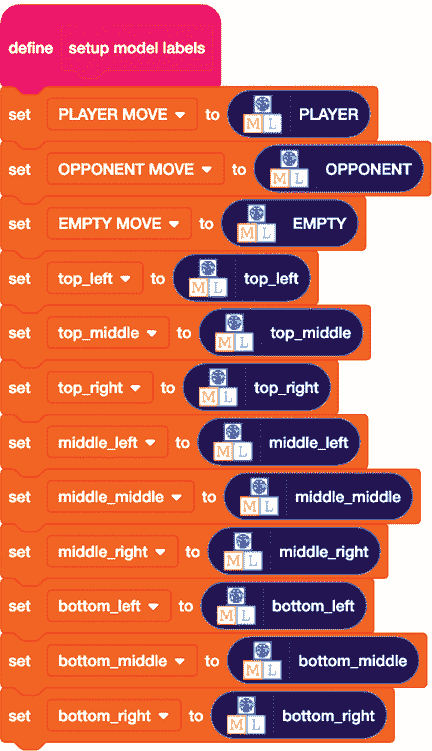

    图 13-13: 使用项目中的训练桶名称填充脚本。

1.  在代码区域中滚动，找到 `define` `add cross moves to training data` 和 `define` `add nought moves to training data` 脚本块，如 图 13-14 所示。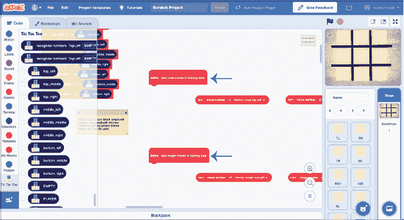

    图 13-14: 找到自定义的 `define` 块。

1.  在工具箱的 **井字游戏** 组中，将 `add training data` 块拖入两个 `define` 脚本中，如 图 13-15 所示。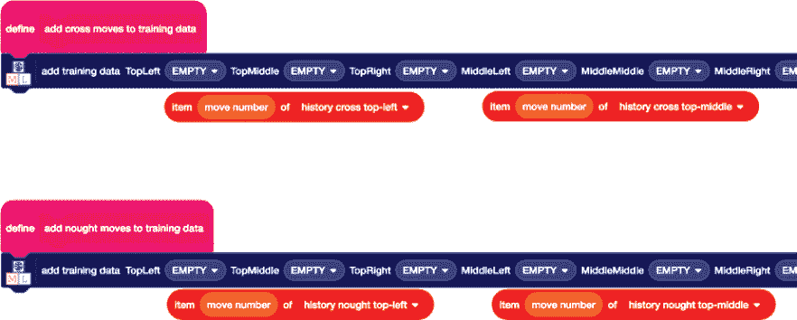

    图 13-15: 向两个 `define` 脚本中添加训练数据。

1.  按照 图 13-16 中所示更新 `add training data` 块。你需要的橙色块已经在项目模板中准备好，紧挨着它们应该放置的位置。*从左侧开始*，将每个块拖入它上方的空白位置。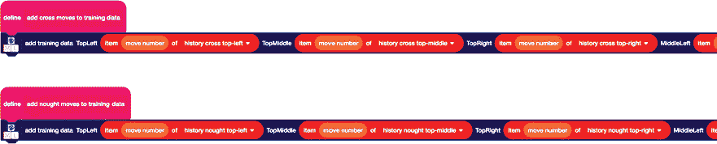

    图 13-16: 填充训练数据块。

    仔细检查脚本。历史交叉列表中的移动应该出现在 `add cross moves to training data` 脚本中，如 图 13-17 所示。

    

    图 13-17: 检查你是否已将交叉块与交叉脚本匹配。

    同样，历史圈子列表中的移动应该在 `add nought moves to training data` 脚本中使用。

    游戏棋盘上的位置名称也应该匹配。例如，`top-middle` 移动应该进入 `TopMiddle` 位置，如 图 13-18 所示。

    

    图 13-18: 检查你是否正确匹配了游戏棋盘位置的名称。

    确保你填充了所有块中的空白。你需要向右滚动才能完成这项操作，正如你在 图 13-19 中看到的那样。

    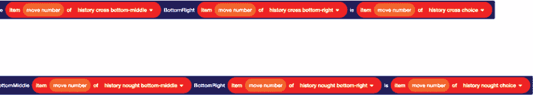

    图 13-19: 确保你填写了所有空白位置。

1.  现在找到 `when I receive game over` 脚本，如 图 13-20 所示。该脚本在每局游戏结束时运行，负责调用你刚设置的 `add moves to training data` 脚本。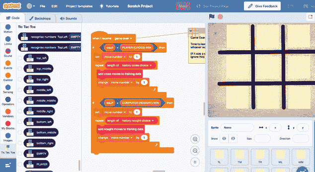

    图 13-20: 找到 `when I receive` `game over` 脚本。

    在`when I receive game over`脚本的末尾添加一个新的`train new machine learning model`区块，如图 13-21 所示。

    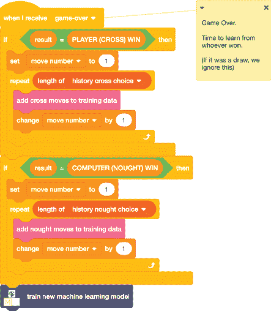

    图 13-21: 每局游戏后训练一个新的机器学习模型。

现在，每局游戏结束时，获胜者的操作将被添加到训练桶中，你将使用这个更新后的训练示例集来训练一个新的机器学习模型。这意味着，经过每一局游戏后，你的机器学习模型应该变得更聪明，表现得更好。

### 训练你的模型

是时候玩游戏了！

1.  点击全屏图标，然后点击屏幕右上角的绿色旗帜。像图 13-22 所示那样，玩一局井字游戏。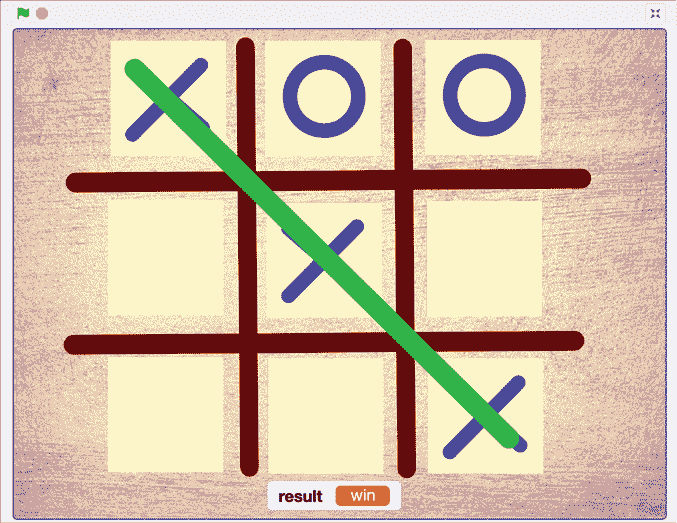

    图 13-22: 玩一局井字游戏。

1.  游戏结束后，点击**返回项目**，然后点击**训练**。你应该能看到获胜玩家的所有操作，如图 13-23 所示。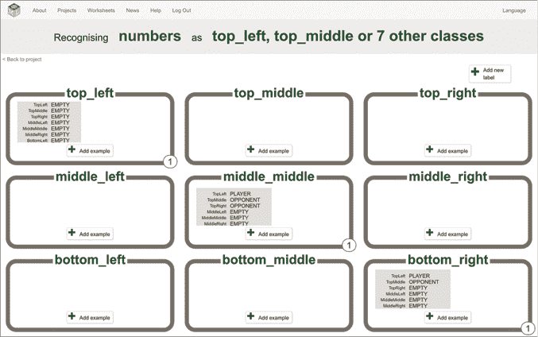

    图 13-23: 比较训练数据与图 13-22 中的游戏。

1.  现在你有了一个机器学习模型，是时候更新 Scratch 游戏，让计算机能够使用模型来决定它的下一步行动。在代码区域滚动，找到`define``use machine learning model`脚本，如图 13-24 所示。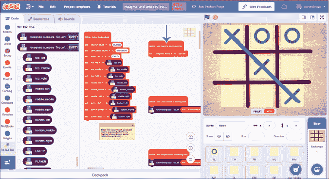

    图 13-24: 找到`define use machine learning model`脚本。

    更新脚本，如图 13-25 所示，使其使用你的机器学习模型来识别计算机的最佳移动。

    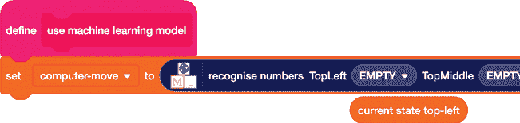

    图 13-25: 将`recognise numbers``(label)`区块添加到脚本中。

1.  将橙色区块拖到`recognise numbers``(label)`区块中，如图 13-26 所示。如之前所述，这些区块已经在它们应该放置的位置下方的模板中准备好了。这个代码块将提供游戏板当前的状态给机器学习模型，以便模型能用这些信息识别出最佳的下一步。

    确保你添加了所有九个区块，覆盖游戏板上的所有九个空间，并从左到右进行操作。还要确保区块名称匹配。例如，`current state top-middle`应放入`TopMiddle`位置。

图 13-26: 确保正确匹配区块名称。

### 测试你的游戏

现在是时候测试你的项目了！

因为你已经编写了让计算机在游戏中学习的项目代码，你应该看到计算机随着时间的推移变得越来越擅长这个游戏。但你怎么验证这一点是否发生呢？

一种方法是玩很多游戏，记录计算机获胜的次数，并绘制随着训练量增加，计算机获胜次数是否增加的图表。

我玩了 300 场井字棋游戏，并统计了我赢、输、平的场次。我将结果绘制在 图 13-27 中的柱状图中。每一列代表 10 场井字棋游戏。绿色表示我赢得的游戏。橙色表示平局的游戏。红色表示机器学习系统赢得的游戏。

最左侧的柱状图代表我玩过的前 10 场游戏。我赢了所有这 10 场游戏。

下一根柱状图代表我接下来的 10 场游戏。我同样赢了所有 10 场。

最右侧的柱状图代表我玩过的最后 10 场游戏。我赢了 2 场，打平了 4 场，输了 4 场。

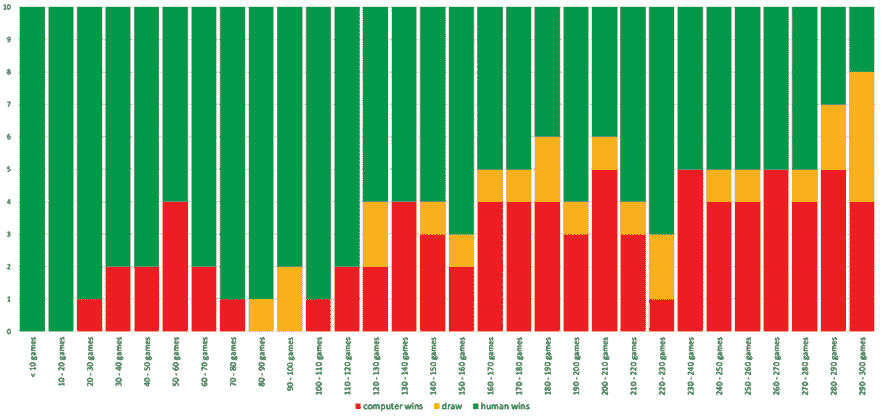

图 13-27： 我玩过的井字棋游戏的结果

我的前 10 场游戏非常容易赢。计算机做出了愚蠢的举动，我不需要费力就能获胜。然而，到我最后的 10 场游戏时，获胜变得更加困难。我必须集中精力，避免犯任何错误才能赢得比赛。虽然图表上无法显示我的感受，但我*感觉*计算机在我玩的时候变得越来越强。

每个机器学习项目的进展都会有所不同，因此尝试训练自己的模型并衡量您的项目是如何学习和改进的。希望你会发现，收集的训练样本越多，机器学习模型的表现越好。但你几乎肯定会看到一些变化，正如我所经历的那样。

## 审查并改进您的项目

你创建了一个机器学习系统，通过与您对弈来学习玩井字棋。训练这个系统的最大挑战是需要花费大量时间玩数百场训练游戏。是否有更高效的方法来获取更多的训练样本？

一种常见的方法是让更多的人帮忙。想象一下，如果不是自己玩 300 场游戏，而是保存了我的 Scratch 项目并将项目文件交给 30 个朋友，让他们每人玩 10 场游戏。分担工作会使训练变得更加轻松，因为每个人只需要玩 10 场游戏就能很快完成。

现在想象一下，如果我能找到 300 个人来帮忙，或者 3,000 个人！

希望你能看到将机器学习模型的训练工作分摊给大量人群的好处。这有时被称为 *众包*。当然，这也有一些挑战，比如如何找到一大群人，协调他们，向他们解释你想要的内容，确保他们都按照要求完成任务，并且不会让你的机器学习模型做出你不希望它做的事情，等等。但即便如此，对于很多复杂项目来说，使用大量人力进行训练仍然是最好的选择。

## 你学到了什么

在这一章，你了解到井字棋（Tic Tac Toe），也叫圈圈叉叉（Noughts and Crosses），已经被用来帮助人们理解机器学习数十年了。你训练了一个机器学习模型来识别数字，并构建了一个井字棋棋盘，棋盘上的编号单元格代表每一次走法。这个项目基于 1960 年英国人工智能研究员唐纳德·米奇（Donald Michie）的工作，他在 MENACE 项目中使用了火柴盒和玻璃珠。每个火柴盒代表游戏棋盘的一个可能状态，类似于你在训练数据中收集的示例。火柴盒中的玻璃珠数量就像一个示例出现在训练桶中的次数。

你还看到了拥有大量训练示例在随着时间推移提高机器学习模型性能方面的重要性。因为每场比赛后，训练集会更新赢家的走法，所以模型逐渐变得更强大，越来越难以击败。你了解到，众包或将训练模型的工作分配给一大群人，可以节省一些时间和精力，十分有用。

在下一章，你将开始学习机器学习项目可能出错的原因。*
