# 第十二章：混淆计算机

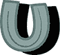直到现在，我们一直专注于机器学习能做的伟大事情，以及它在现实世界应用中如何被很好地使用。但是，正如你在整本书中所看到的，机器学习系统并不完美，也不是全知的。它们的行为取决于我们给它们的训练。我们如何训练我们的机器学习系统将会影响它们的反应，而不总是以积极的方式。在这一章中，我们将探讨创建人工智能系统时最常见的挑战之一：*偏见****。***

***本章中的项目基于一个旧故事，有时被称为*俄罗斯坦克问题**，这个故事经常讲给人工智能学生听。它可能不是真的，但它说明了偏见在机器学习训练数据集中的影响。***

*这里有一个故事的例子：

> 很久以前，美国军方决定使用机器学习识别隐藏在树林中树木后面的坦克。研究人员使用没有坦克的树林照片和同样树林中隐藏着坦克的照片来训练机器学习模型。
> 
> 该模型似乎在研究人员的图片上表现良好，但当美国军方测试他们的系统时，它的表现与随机猜测没有区别。
> 
> 事实证明，在研究人员的训练数据中，伪装坦克的照片是在多云的天气下拍摄的，而平原森林的照片是在阳光明媚的日子里拍摄的。机器学习模型学会了区分多云天气和晴天，而不是识别伪装的坦克。

这是另一个版本：

> 很久以前，美国军方曾尝试训练计算机识别俄美坦克的区别。研究人员使用他们拍摄的美国坦克照片和他们收集的俄罗斯坦克间谍照片来训练机器学习模型。
> 
> 该模型似乎在研究人员的图片上表现良好，但当美国军方测试他们的系统时，该机器学习模型的表现与随机猜测没有区别。
> 
> 结果发现，研究人员拍摄的美国坦克照片大多是大尺寸、高分辨率、高质量的，而他们能够获取的俄罗斯坦克间谍照片则全是模糊的、低分辨率的和颗粒感强的。
> 
> 机器学习模型学会了区分颗粒感照片和高质量照片，而不是区分俄罗斯和美国坦克。

作为另一个例子，当斯坦福大学的研究人员开发一种通过照片识别皮肤癌的机器学习系统时，他们不小心创建了一个识别尺子的机器学习模型，因为医学照片中通常会有尺子来显示病变或肿瘤的大小。

关键在于，由于无意的偏见，机器学习系统可能会学会识别出其创建者可能没有意识到的模式，或者并非故意作为模式处理的内容。

在本章中，你将训练一个图像分类器来识别物体的照片，但你会引入偏差让它出错。我们将亲眼看到哪些问题会导致机器学习模型出错，然后讨论如何避免这些问题并修正模型。

## 构建你的项目

选择两个你想让计算机识别的物体，挑选那些明显不同的物体。不要选择过于私人的物品，因为你需要将这些照片上传到互联网以完成这个项目。

对于我的截图，我选择了一个柠檬和一个葡萄柚，它们都在我的厨房里。你可以选择任何你喜欢的物体。

把第一件物体放在某个地方，拍摄 10 张看起来相似的照片。你不需要高分辨率的照片。小尺寸的照片（宽度小于 800 像素）效果最佳。

我把葡萄柚放在一个昏暗的房间的木地板上，拍摄了图 14-1 中显示的照片。

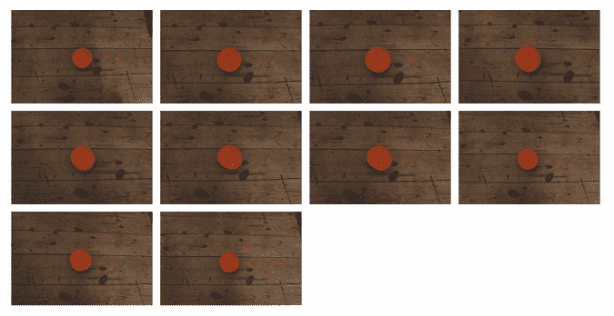

图 14-1: 我的第一件物体——葡萄柚的照片

把第二件物体放在不同的地方，拍摄 10 张照片。

我把柠檬放在一个奶油色的地毯上，拍摄了图 14-2 中显示的照片。

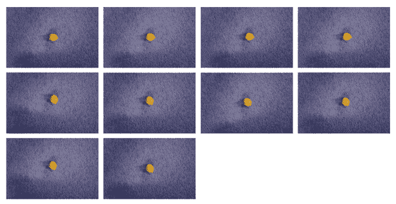

图 14-2: 我的第二件物体——一颗柠檬的照片

不要让物体在照片中显得太大。尽量保持每张照片中的物体位置一致，如图 14-1 和图 14-2 所示。

目的是让每组中的 10 张照片非常相似，但让一切——物体、背景、光线——在两组之间有所不同。例如，如果你拍摄的第一件物体的照片是在昏暗的背景下，那么拍摄第二件物体的照片时就要选择明亮的背景。但第一件物体的所有照片都应该是在昏暗的背景下拍摄，而第二件物体的所有照片都应该是在明亮的背景下拍摄。

这里有一些其他的建议，帮助你让两组照片有所不同。

| **如果你的第一件物体的照片全是…** | **拍摄第二件物体的所有照片…** |
| --- | --- |
| 在*昏暗*的背景下 | 在*明亮*的背景下 |
| 在*瓷砖*上 | 在*草地*上 |
| *明亮照明* | *昏暗的地方* |
| *清晰*、*明锐*、*聚焦* | *模糊*和*不清晰* |
| 背景是*户外*花园 | 背景是*室内*同一房间 |

再看看我的照片。图 14-1 中的照片有共同点：昏暗的光线、深棕色的表面和木质纹理的背景。图 14-2 中的照片有共同点：明亮的光线、奶油色的表面和斑点地毯的背景。

你不必完全复制我的照片。发挥创意吧！

一旦你拍摄了 20 张照片，你需要将它们上传到某个地方，使其可供训练使用。选择任何一个允许你免费将照片上传到互联网的照片托管服务。（如果你已经有一个照片分享服务的账户，你可能会想为这个项目创建一个新账户，因为你的这 20 张随机家庭物品的相似照片可能不太适合分享！）

最重要的是，将你的照片上传到可以无需登录即可访问的地方，这样你的机器学习系统就能访问并学习它们。

### 训练你的模型

1.  访问 *[`machinelearningforkids.co.uk/`](https://machinelearningforkids.co.uk/)*。创建一个新的机器学习项目，命名为 `Confuse the computer`，并设置为学习识别图像。

1.  点击 **训练**，如 图 14-3 所示。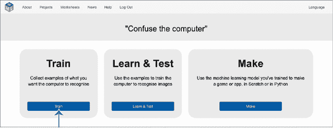

    图 14-3： 点击 **训练** 来准备你的训练桶。

1.  点击 **添加新标签**，创建两个训练桶，如 图 14-4 所示。根据你选择的两个物体命名它们。（你选择的名称不会影响训练，但对你来说很有用。）我给它们命名为葡萄柚和柠檬。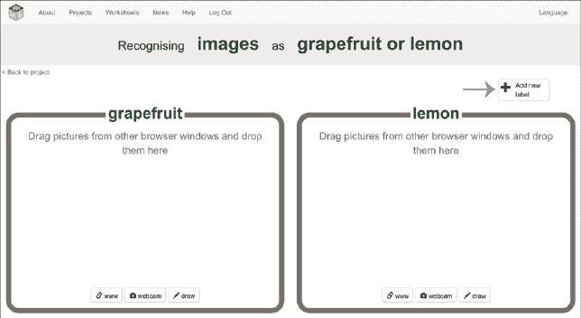

    图 14-4： 为你的物体准备两个训练桶。

1.  将训练图像添加到你的训练桶中。为此，请将两个浏览器窗口并排排列，如 图 14-5 所示。一个窗口应显示你的训练桶，另一个窗口应显示包含你照片的照片分享网站。

    将图片从照片分享网站拖拽并放入相应的训练桶中。

    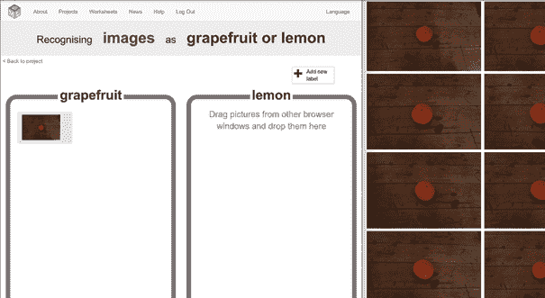

    图 14-5： 将两个浏览器窗口并排排列，并将照片拖放到你的训练桶中。

1.  重复步骤 4，直到你把所有 20 张照片都放入训练桶中，如 图 14-6 所示。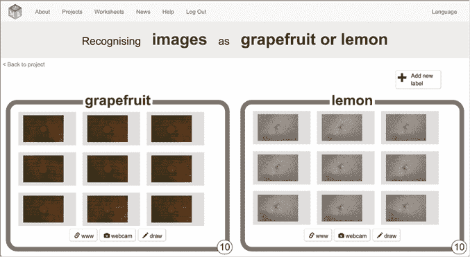

    图 14-6： 将所有照片拖入训练桶中。

1.  点击屏幕左上角的 **返回项目**。

1.  点击 **学习与测试**。

1.  点击 **训练新机器学习模型**，如 图 14-7 所示。

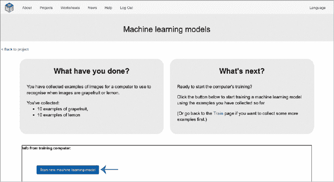

图 14-7： 开始训练一个机器学习模型。

训练你的机器学习模型需要几分钟时间。在等待的过程中，继续执行下一步来准备你的项目。

### 准备你的项目

给你的两个物体拍另一张照片，*但这次要交换背景**。*

*换句话说，在你拍摄第二个物体照片的地方拍摄第一个物体的照片；在你拍摄第一个物体照片的地方拍摄第二个物体的照片。*

对我来说，这意味着我拍摄了柠檬放在深色木地板上的照片，以及葡萄柚放在明亮的奶油色地毯上的照片。比较图 14-8 中我拍的测试照片和图 14-1 和图 14-2 中的训练照片。

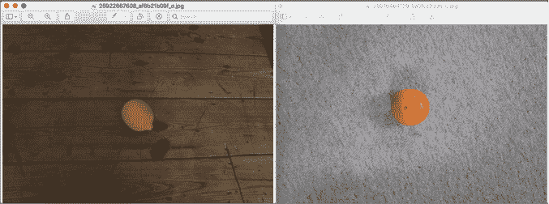

图 14-8: 为你的测试照片更换背景。

你不需要将这些照片上传到任何地方。只需要在你的计算机上访问它们，就能用来进行测试。

1.  点击**返回项目**，然后点击**制作**，如图 14-9 所示。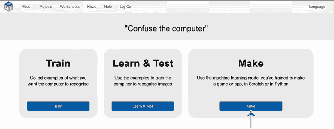

    图 14-9: 现在开始你的测试！

1.  点击**Scratch 3**，如图 14-10 所示。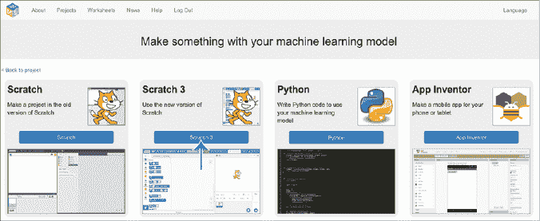

    图 14-10: 点击**Scratch 3**以测试你的模型。

1.  点击**在 Scratch 3 中打开**。

1.  将鼠标指针移动到右下角的“选择角色”图标（猫脸图标）。点击**上传角色**，如图 14-11 所示。上传你两张新测试照片中的一张。

    图 14-11: 上传一个新的角色。

1.  复制图 14-12 中显示的脚本。这个脚本尝试识别角色服装图像，并显示你的机器学习模型所识别的照片内容。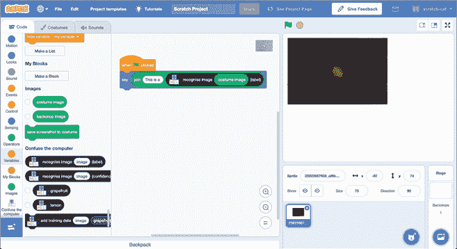

    图 14-12: 编写一个简短的测试脚本。

1.  再次点击**上传角色**以上传你的第二张测试照片。为你的第二个角色创建与之前相同的脚本，如图 14-13 所示。

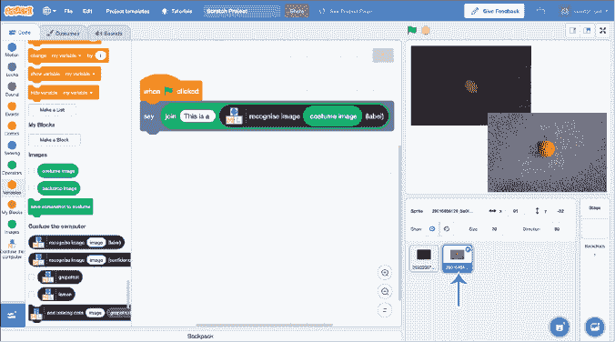

图 14-13: 上传第二个角色并添加另一个测试脚本。

### 测试你的项目

现在是时候运行你的测试了！你的脚本应该能够分类你的两张新测试照片，并显示你的机器学习模型所识别的内容。点击绿色旗帜开始测试你的机器学习模型。

我的结果显示在图 14-14 中。

正如你所料，你的机器学习模型可能会给出错误的答案。

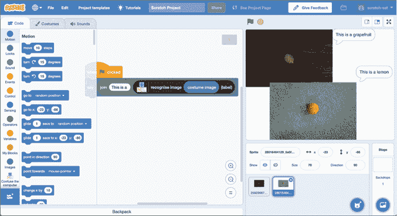

图 14-14: 我的机器学习模型的测试结果

我使用最先进的技术训练了一个机器学习模型，但它无法区分柠檬和葡萄柚——这是人类可以轻松做到的。

你认为为什么会出错呢？

## 审查并修复你的项目

我的机器学习模型给出错误答案的原因有几个。

想一想照片中占据的区域。物体大约占我照片总体面积的 5%。每张照片约 95%的面积是背景，如图 14-15 所示。

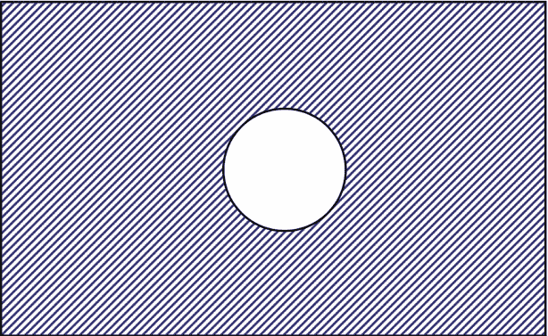

图 14-15: 我的照片大部分是背景。

当你收集训练样本以创建一个机器学习模型时，你要求计算机识别这些样本的共同点，以便它能够在未来遇到相似特征的东西时进行识别。

当我用柠檬的照片测试我的模型时，照片的 95%非常相似于图 14-1 中所有葡萄柚的训练照片的 95%。在我们训练 ML 模型的方式中，没有明确表明我们感兴趣的部分只是照片中间的那 5%，而不是其余部分。

当你把训练照片和测试照片并排放在一起时，你可以看到模型为什么做出了它的选择。

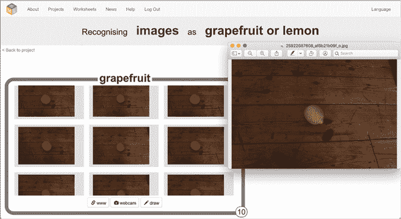

图 14-16： 比较测试和训练照片，了解为什么 ML 模型出错了。

将照片作为一个整体来看，我的测试照片中最大的部分（见图 14-16 右侧）与我标记为“葡萄柚”的每个训练照片中最大的部分非常相似。

ML 系统被设计用来识别和识别你给它们的示例中的模式，但*这些模式不一定是你打算的或者你会识别的模式*。

你能想到一种方法来修复你的项目吗？

有几件事情你可以做。例如，如果你的对象在整体图像中占据了更大的比例，就像图 14-17 所示，这可能会有所帮助。

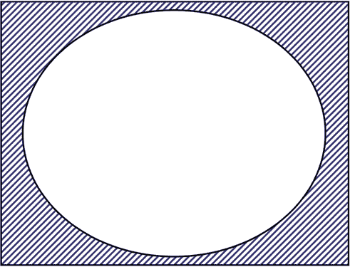

图 14-17： 尝试在照片中放大你的物体。

但这个解决方案只对你能确保所有测试图像显示相同大对象的项目有用。

对于这个项目，确保这一点的最佳方法是用不同的地方、背景、光线、大小、角度和方向拍摄你两个对象的大量照片。改变你能想到的每一件事情，使它们唯一的共同点只有物体本身。

例如，图 14-18 展示了一组更好的我的葡萄柚训练图像。

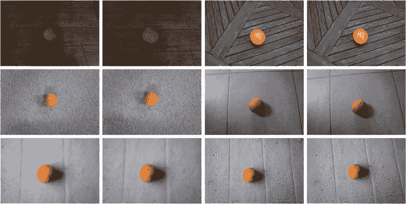

图 14-18： 训练 ML 模型的更好方法

改变训练图像的背景、光照和焦点水平是训练 ML 模型的一个良好起点，以便仅识别图像中的葡萄柚本身作为这些图像之间的共同因素。

我们甚至可以使训练变得更好。例如，这些训练图像中所有的葡萄柚都处于相同的位置和相同的大小。如果我能保证在测试模型时测试照片中的对象大小和位置相同，那就没问题了。但对于一个真正灵活的模型，我也可以添加葡萄柚在不同大小和位置的照片。

尝试改进你两个物体的训练示例，并训练一个新的 ML 模型。

如果你改变训练示例，模型能通过你的测试吗？

## 你学到了什么

在这一章中，你已经了解了在训练集里保持变异性的重要性。无论是一个军事项目，误将天气识别为伪装的坦克，还是一个大学研究项目，发明了一个卷尺检测器而不是皮肤癌分类器，或者只是一个无法区分葡萄柚和柠檬的系统，你已经看到了在用于训练机器学习模型的数据集中存在*无意偏差*的影响。

**在下一章中，你将看到在机器学习项目中引入*刻意偏差*的风险。**
