# 第十三章：偏见计算机

在上一章中，你看到了一种可能的情况：通过在训练示例中引入*偏见*，不小心训练出一个错误的 ML 系统，导致它给出错误的答案。

在这一章中，你将看到如何有时故意引入偏见，以影响 ML 系统给出的答案。你将创建一个应用，根据人们喜欢的电影类型推荐电影。但你会以一种让你能影响推荐结果的方式训练模型。

## 构建你的项目

选择三部电影来开始建立你的推荐应用将从中选择的电影库。

我希望我的推荐应用能够帮助人们找到经典电影，所以我选择了三部 1920 年代的电影，如图 15-1 所示，不过你可以根据你的项目选择更新的电影。

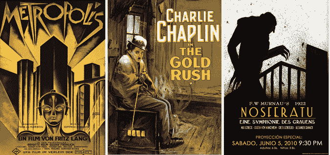

图 15-1： 我选择的三部电影来开始我的项目

选择三部完全不同的电影，吸引不同类型的人群。

我选择了科幻电影*大都会*，喜剧电影*淘金记*和恐怖片*诺斯费拉图*。

### 训练你的模型

1.  访问 *[`machinelearningforkids.co.uk`](https://machinelearningforkids.co.uk)/*。创建一个新的 ML 项目，命名为`Bias`，并设置为学习识别你首选语言中的文本。

1.  点击**训练**，如图 15-2 所示。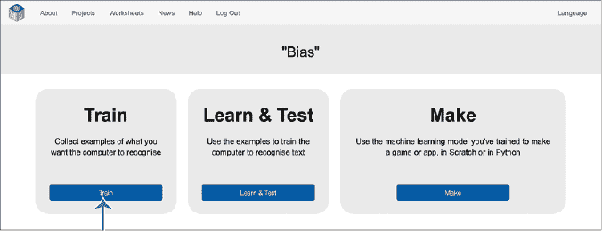

    图 15-2： 训练是 ML 项目的第一阶段。

1.  点击**添加新标签**，如图 15-3 所示，为每部电影添加一个训练桶。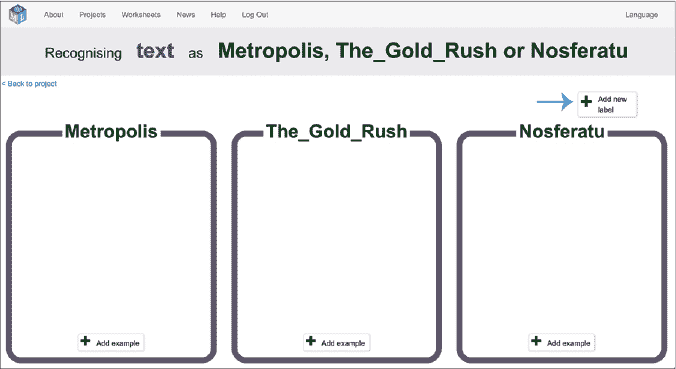

    图 15-3： 为每部电影创建一个训练桶。

1.  点击**添加示例**，如图 15-4 所示，在你第一个电影训练桶中。输入你认为喜欢第一部电影的人可能会说的话。

    比如，我的第一部电影，*大都会*，是一部设定在未来的科幻电影，所以我输入了`我喜欢未来题材的电影`。

    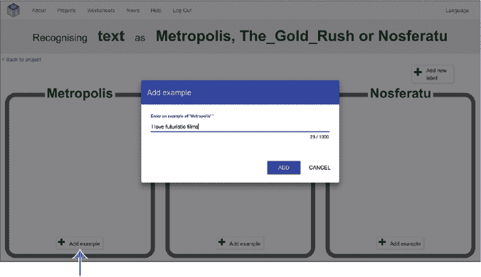

    图 15-4： 添加一个喜欢第一部电影的人可能会说的例子。

1.  点击**添加**。

1.  重复步骤 4 和 5，直到每部电影都有五个示例语句，如图 15-5 所示。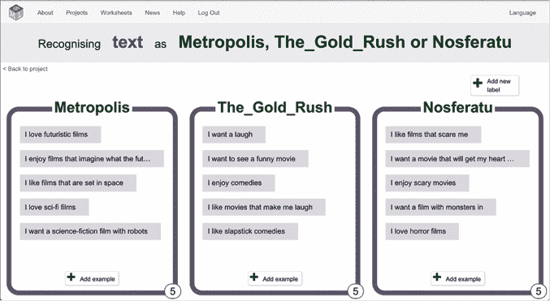

    图 15-5： 为每部电影添加五个示例。

1.  点击屏幕左上角的**返回项目**。

1.  点击**学习与测试**。

1.  点击**训练新的机器学习模型**，如图 15-6 所示。

    计算机需要一分钟时间从你的示例中学习并创建一个新的 ML 模型，但你可以在等待的同时继续进行下一步。

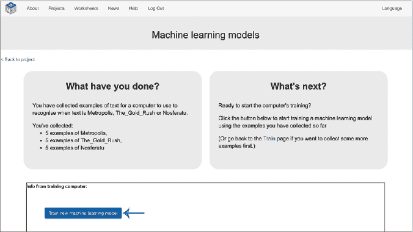

图 15-6： 创建一个 ML 模型。

### 准备你的项目

现在你有了一个 ML 模型，是时候创建一个将使用它的推荐应用了。

1.  点击屏幕左上角的**返回项目**。

1.  点击**制作**。

1.  点击**Scratch 3**，然后点击**在 Scratch 3 中打开**，以在新窗口中打开 Scratch。

1.  点击**服装**标签，将鼠标指针移动到左下角的选择服装图标（猫脸图标），然后点击**上传服装**以上传你的电影海报，如图 15-7 所示。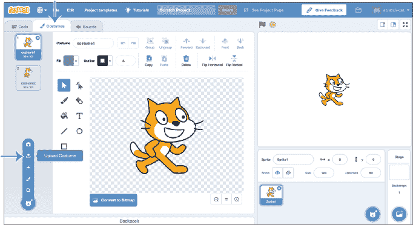

    图 15-7: 上传一个服装。

1.  上传你第一部电影的海报，如图 15-8 所示。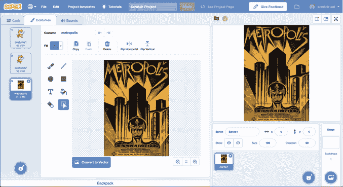

    图 15-8: 创建一个服装来代表你的第一部电影。

1.  重复步骤 4 和 5，为你的所有三部电影添加海报作为*同一精灵*的服装，这样它看起来像图 15-9。

    为每个服装命名，使其与电影标题相匹配。

    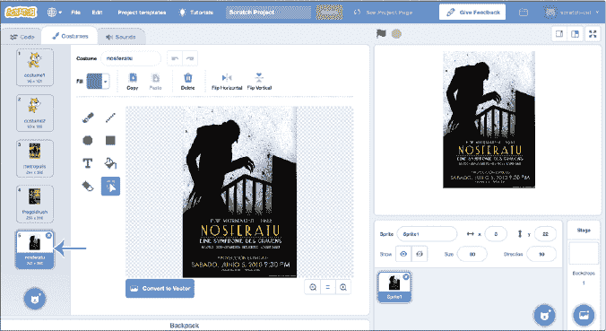

    图 15-9: 为每部电影创建一个服装。

1.  点击**代码**标签并复制图 15-10 中显示的脚本。你需要更新它，使用你三部电影的名称。

    这个脚本会询问某人喜欢什么类型的电影，然后使用你的机器学习模型从你的三部电影库中做出推荐。

    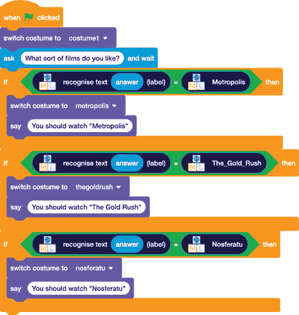

    图 15-10: 创建这个脚本。

1.  设计你的项目，使其看起来像你认为电影推荐应用应该有的样子。你可以使用绘画编辑器（第三章）、用网络摄像头拍照（第四章）、上传你保存到计算机中的图片（第五章），或者从 Scratch 库中选择一个现成的设计（第五章）来更新背景和精灵。发挥创意！图 15-11 展示了我的应用。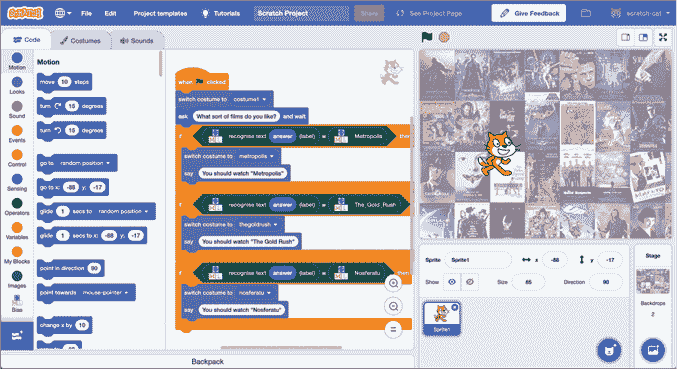

    图 15-11: 设计你的电影推荐应用。

1.  点击**文件**▶**保存到计算机**以保存你的项目。

### 测试你的项目

点击绿色旗帜，测试你的项目。

尝试输入描述你喜欢的电影的各种句子，看看你的项目推荐了什么。避免使用你在原始训练集中放入的词语或短语，以查看你的机器学习模型是否已学会识别新的句子。

### 引入偏差

点击**返回项目**，然后点击**训练**以返回训练阶段。

现在选择第四部与前三部电影稍微相似的电影。对于我的项目，我选择了*弗兰肯斯坦*，这是一部与*诺斯费拉图*有些相似的恐怖片。

点击**添加新标签**，为你的第四部电影添加一个新的训练集。

删除一些来自第一部电影的训练示例（在我的例子中是*诺斯费拉图*），并将它们添加到你的新电影（对我来说是*弗兰肯斯坦*）中。

你应该会得到类似图 15-12 的结果。

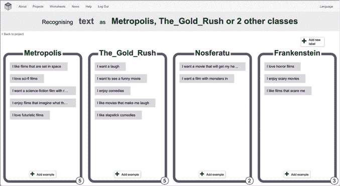

图 15-12: 将一些示例移动到新电影中。

为你的新电影添加另外 12 个示例。你应该会得到类似图 15-13 的结果。

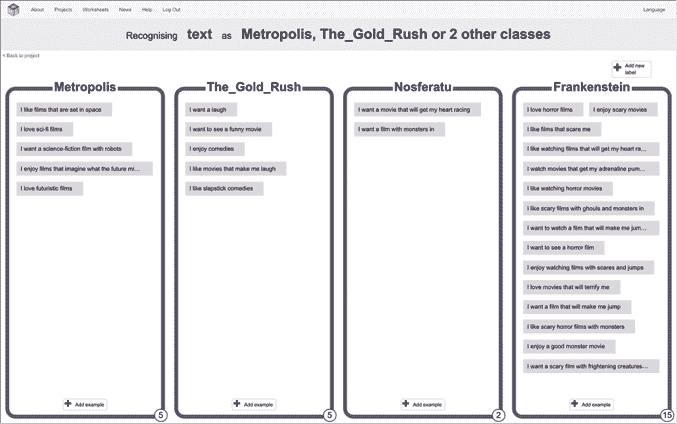

图 15-13: 新电影的训练示例

点击**返回项目**，然后**学习与测试**。使用更新后的训练示例训练一个新的机器学习模型。

当训练完成后，点击**返回项目**和**制作**，然后重新打开**Scratch 3**。

点击**文件**▶**从你的计算机加载**，打开你之前保存的 Scratch 项目。更新它以添加你的新电影。这意味着添加一张新电影的海报服装，并更新脚本，加入第四个`if`块，以识别并推荐你的新电影，如图 15-14 所示。

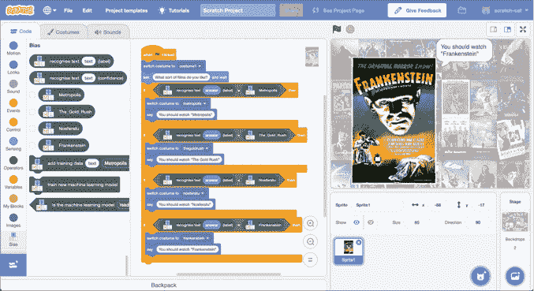

图 15-14: 更新项目以添加第四部电影。

### 测试你的偏向项目

尝试再次测试你的项目。你应该会发现它更倾向于推荐新的第四部电影，尤其是与类似电影相比。

对于我的项目，这意味着如果我提到任何关于恐怖片、让我心跳加速或肾上腺素激增的内容，或是怪物，我的机器学习模型现在总是会推荐*弗兰肯斯坦*——而不是之前的*诺斯费拉图*。它并没有在有时推荐一个、而有时推荐另一个之间保持平衡。它似乎对*弗兰肯斯坦*有偏好或倾向。事实上，除非我输入与我的训练示例完全相同的句子，否则很难让它推荐*诺斯费拉图*。

对你的项目进行实验，看看它的表现如何。每个机器学习模型的行为略有不同，因此尝试了解你训练的模型是如何工作的。

## 回顾你的项目

我们在第八章中讨论了衡量机器学习模型性能的方法，例如*精准度*和*召回率*。如果你在故意偏向你的机器学习模型之前和之后计算这些值，你可以衡量偏见对你的项目的影响。

**当你认为已经识别出你的机器学习模型行为的方式时，下一步是理解原因。再次查看图 15-13。为什么我的机器学习模型更频繁地推荐*弗兰肯斯坦*？**

当你收集训练样本时，你是在让计算机识别这些样本中的模式，计算机使用这些模式来学习如何在未来识别新样本。你将每个桶中放入的样本数量是计算机寻找模式的一个方面。通过将更多样本放入*弗兰肯斯坦*训练桶，我在一定程度上影响了机器学习模型，这种影响超出了单个训练样本的范围。

假设你在教一个孩子推荐电影。假设你告诉他们 5 次应该推荐电影 A，而告诉他们 1,000 次应该推荐电影 B。这会对他们的期望产生什么影响？如果你一次又一次地告诉他们正确的答案是电影 B，他们很可能会学到应该推荐的电影几乎总是电影 B。

这类似于机器学习系统的行为方式。计算机会从你的所有训练示例中以许多方式寻找模式。你的训练告诉它应该更多信任哪些方式。如果训练示例一遍又一遍地告诉它，导致答案电影 B 的模式、技巧和过程是正确的，它就会学会信任这些模式、技巧和过程。如果训练示例一遍又一遍地告诉它，导致答案电影 A 的模式、技巧和过程是错误的，它就学会不信任它们。

即使它识别出导致将来答案为电影 A 的模式、技巧和过程，你的训练示例却让它学会不信任这些模式，而是更倾向于信任那些暗示电影 B 的模式。

正如你所看到的，每个桶中的训练数据量是创建机器学习系统的重要因素。不同桶中训练样本数量的不平衡可能会导致我们所说的*有偏见*系统。

## 偏见的论点

在本书中的大多数项目中，我们试图保持每个桶中训练样本数量大致相同。这是许多机器学习项目中的一个常见原则，目的是尽量减少偏见。

尽管偏见是需要牢记的重要因素，但它并不一定总是坏事。

假设你正在训练一台计算机来区分三种可能的结果：X、Y 和 Z。假设 X 和 Y 非常常见；它们几乎总是正确答案。结果 Z 是可能的，但它非常非常罕见。即使 Z 几乎从未发生，你也希望训练计算机在 Z 发生时能识别出来。

在这里，一个平衡的训练样本集，其中 X、Y 和 Z 的示例数量相同，可能并不合适。如果 X 和 Y 的训练样本更多，而 Z 的样本更少，可能会训练出机器学习模型，使得 X 和 Y 更可能发生，而这种情况实际上是正确的。X 和 Y 的结果*更常见*，而 Z 是罕见的。这样的系统仍然是有偏见的，但这种偏见反映了不同结果的统计概率，因此它可能是合适且有益的。

## 人工智能与伦理

在本章中，我们已经看到，提供给机器学习系统的训练将会极大地影响其给出的答案。你认为这对创建人工智能系统的人的责任意味着什么？你认为人工智能开发者有道德责任平衡他们的训练数据，或避免创建有偏见的系统吗？

意图是否有影响？如果某人无意中开发了一个有偏见的系统，这比某人故意影响其系统输出并故意扭曲训练数据更道德，还是更不道德？

钱会产生影响吗？换句话说，如果我第四部电影的制作方支付了我大量资金，让我的电影推荐应用程序偏向他们的电影而非竞争对手的电影，这种做法是否比我制作一个没有个人利益的偏向性应用程序更不道德？

这个主题重要吗？换句话说，你认为偏向性的 AI 电影推荐应用比给医生做医疗治疗推荐的 AI 应用更不具有伦理问题吗？

想象一个机器学习推荐应用程序，它推荐应该给患者开哪些药物。每个训练类别代表一种药物，所包含的训练示例是患者的病历，这些患者在使用该药物时获得了最好的治疗效果。类似的系统现在已经在使用。机器学习系统可以学习识别大量详细病历中的模式，并将其与从同样大量的医学研究和文献中提取的证据结合起来。对于这种医疗人工智能助手应用来说，仍然处于初期阶段，但未来几年内其使用量将显著增加。

现在你亲眼看到了这样一个系统很容易受到影响，从而偏向某一个答案，这是否影响了你对这些系统应用方式的看法？理论上，某个药物的制造商可能会奖励医疗人工智能应用程序的开发者，以便通过偏向其机器学习模型，使该药物优先于其他制造商的药物。

我们越来越依赖机器学习系统来做出影响人们生活的重要决策。这不仅仅是在医疗保健领域。机器学习系统还做出金融推荐，银行和贷款公司使用它们来判断是否应该向某人提供保险，是否可以获得贷款，或者应该收取多少利率。机器学习系统很快就会驾驶我们道路上的汽车和卡车。还有很多其他例子。

强制公司透明化并披露它们的机器学习系统是如何训练的，可能是防止伦理问题的一种方式。但你已经看到了准备训练数据的艰难程度。公司在收集训练数据时投入了大量时间和金钱，以使它们的机器学习系统优于竞争对手，因此很多公司更愿意将它们的训练数据保密。你如何平衡这些伦理问题与公司的商业利益？

你认为是否需要对人工智能系统的训练或应用进行保护？如果需要，应该由单个公司还是政府制定人工智能伦理政策？

本章以更多的问题而非答案结束，这反映了当前人工智能伦理的现状。机器学习系统有潜力通过训练计算机执行我们原本无法做到的事情，从而改善我们的生活。然而，作为一个社会，我们需要解决许多问题，思考在应用这项技术时，我们有多舒适。

## 你所学到的

在这个最终项目中，你基于第十四章中关于偏差的知识，创建了一个电影推荐应用的机器学习模型，该模型偏好某个结果而非其他结果。你发现，训练机器学习模型时，样本数量的不平衡是故意将偏差引入系统的另一种方式。你还了解到，偏差不一定是坏事——在某些情况下甚至可能是合适的——但重要的是要意识到围绕偏差的伦理问题，尤其是在人工智能系统日益普及的背景下。**
