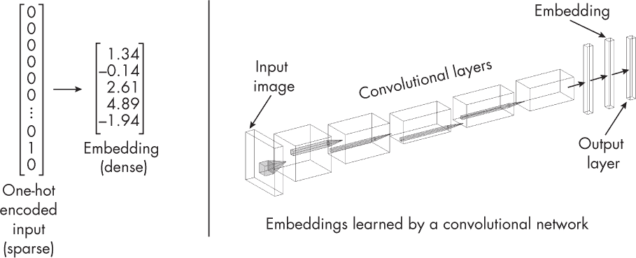
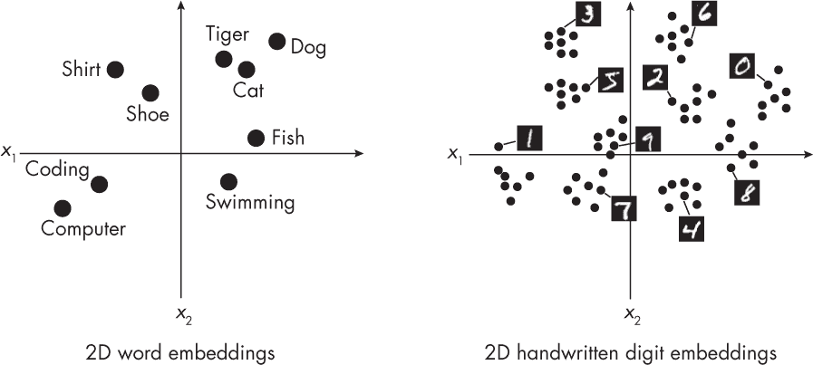
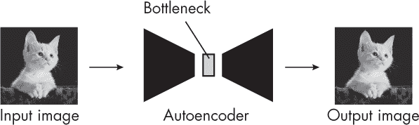
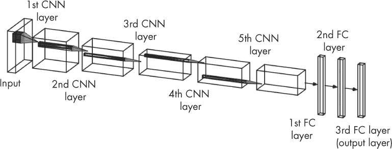

## 第一章：**嵌入、潜在空间和表示**

在深度学习中，我们常用术语*嵌入向量*、*表示*和*潜在空间*。这些概念有什么共同之处，它们有何不同？

虽然这三个术语常常互换使用，但我们可以对它们进行细微的区分：

+   嵌入向量是输入数据的表示，其中相似的项目彼此靠近。

+   潜在向量是输入数据的中间表示。

+   表示是原始输入的编码版本。

以下部分探讨嵌入、潜在向量和表示之间的关系，以及它们在机器学习中的功能和作用。

### **嵌入**

嵌入向量，简称*嵌入*，将相对高维的数据编码为相对低维的向量。

我们可以应用嵌入方法，从（稀疏的）独热编码创建一个连续的稠密（非稀疏）向量。*独热编码*是一种将分类数据表示为二进制向量的方法，每个类别被映射为一个向量，其中对应类别索引的位置为 1，其他位置为 0。这确保了分类值以某些机器学习算法可以处理的方式表示。例如，如果我们有一个名为 Color 的分类变量，包含三种类别：红色、绿色和蓝色，独热编码将红色表示为[1, 0, 0]，绿色表示为[0, 1, 0]，蓝色表示为[0, 0, 1]。这些独热编码的分类变量随后可以通过利用嵌入层或模块的学习权重矩阵映射到连续的嵌入向量。

我们还可以使用嵌入方法处理稠密数据，如图像。例如，卷积神经网络的最后几层可能会产生嵌入向量，如图 1-1 所示。

*图 1-1：一个输入嵌入（左）和来自神经网络的嵌入（右）*

从技术上讲，神经网络的所有中间层输出都可能产生嵌入向量。根据训练目标，输出层也可能产生有用的嵌入向量。为了简化，图 1-1 中的卷积神经网络将倒数第二层与嵌入关联。

嵌入可以比原始输入具有更高或更低的维度。例如，使用极端表达的嵌入方法，我们可以将数据编码为二维稠密且连续的表示形式，用于可视化和聚类分析，如图 1-2 所示。

*图 1-2：将单词（左）和图像（右）映射到二维特征空间*

嵌入的一个基本属性是它们编码*距离*或*相似性*。这意味着嵌入捕捉了数据的语义，使得相似的输入在嵌入空间中接近。

对于那些对使用数学术语进行更正式解释的读者，嵌入是输入空间*X*和嵌入空间*Y*之间的单射且结构保留的映射。这意味着相似的输入将在嵌入空间中靠近的位置，这可以看作是嵌入的“结构保留”特征。

### **潜在空间**

*潜在空间*通常与*嵌入空间*同义，即嵌入向量被映射到的空间。

相似的项目可以在潜在空间中靠近出现；然而，这不是严格要求的。更宽泛地说，我们可以将潜在空间看作是包含特征的任何特征空间，通常是原始输入特征的压缩版本。这些潜在空间特征可以通过神经网络学习，例如重建输入图像的自编码器，如图 1-3 所示。

*图 1-3：自编码器重建输入图像*

图 1-3 中的瓶颈表示一个小型的中间神经网络层，该层将输入图像编码或映射为低维表示。我们可以将这种映射的目标空间看作是潜在空间。自编码器的训练目标是重建输入图像，也就是说，最小化输入图像和输出图像之间的距离。为了优化训练目标，自编码器可能会学习将相似输入（例如，猫的图片）在潜在空间中放置得很近，从而创建有用的嵌入向量，使得相似的输入在嵌入（潜在）空间中接近。

### **表示**

*表示*是输入的编码，通常是中间形式。例如，嵌入向量或潜在空间中的向量就是输入的表示，如前所述。然而，表示也可以通过更简单的过程生成。例如，独热编码向量被视为输入的表示。

关键思想是表示捕捉了原始数据的一些基本特征或特性，使其对进一步分析或处理有用。

### **练习**

**1-1.** 假设我们正在训练一个卷积网络，具有五个卷积层，后接三个全连接（FC）层，类似于 AlexNet（*[`en.wikipedia.org/wiki/AlexNet`](https://en.wikipedia.org/wiki/AlexNet)*），如图 1-4 所示。

*图 1-4：AlexNet 的示意图*

我们可以将这些全连接层看作是一个多层感知机中的两个隐藏层和一个输出层。神经网络的哪些层可以用来生成有用的嵌入表示？感兴趣的读者可以在 Alex Krizhevsky、Ilya Sutskever 和 Geoffrey Hinton 的原始出版物中找到有关 AlexNet 架构和实现的更多细节。

**1-2.** 列举一些不是嵌入表示的输入表示类型。

### **参考文献**

+   描述 AlexNet 架构和实现的原始论文：Alex Krizhevsky、Ilya Sutskever 和 Geoffrey Hinton，"使用深度卷积神经网络进行 ImageNet 分类"（2012）， *[`papers.nips.cc/paper/4824-imagenet-classification-with-deep-convolutional-neural-networks`](https://papers.nips.cc/paper/4824-imagenet-classification-with-deep-convolutional-neural-networks)*。
