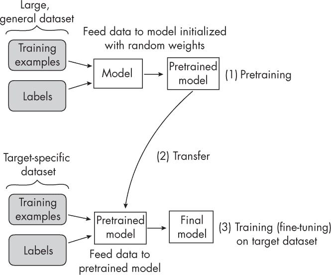
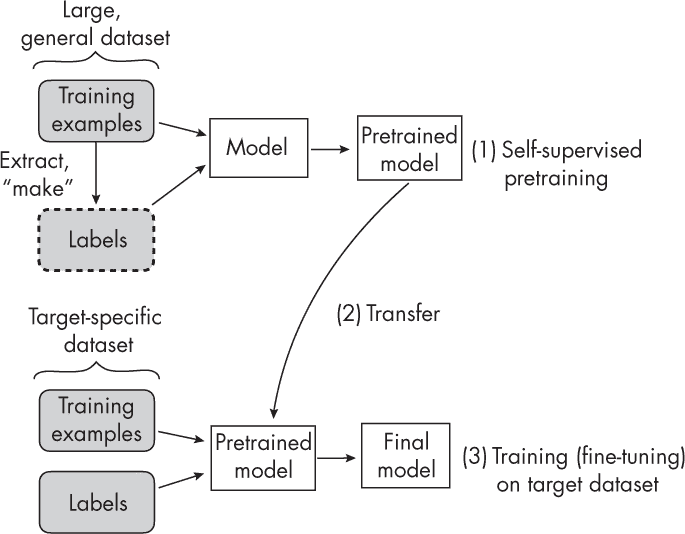
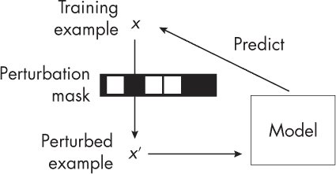
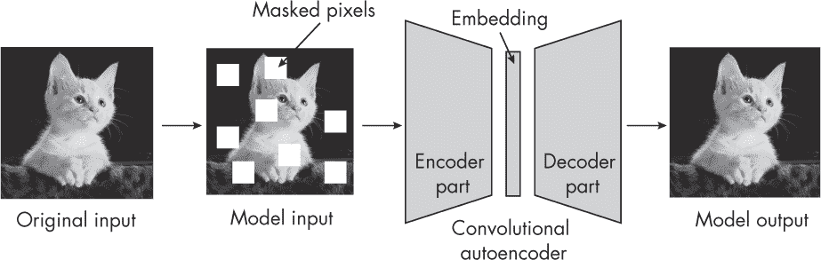
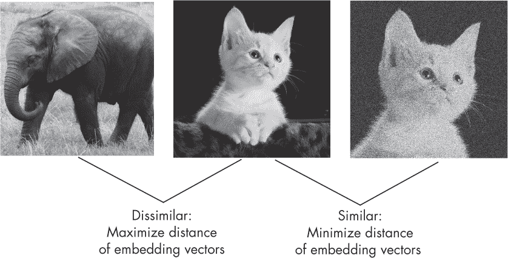
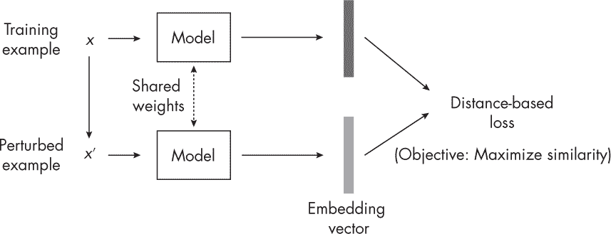

## 第二章：自监督学习**

什么是自监督学习，它在何时有用，实施它的主要方法是什么？

*自监督学习*是一种预训练过程，使神经网络能够以监督的方式利用大量无标签的数据集。本章将自监督学习与迁移学习进行比较，迁移学习是另一种相关的神经网络预训练方法，并讨论了自监督学习的实际应用。最后，本章概述了自监督学习的主要类别。

### **自监督学习与迁移学习**

自监督学习与迁移学习相关，迁移学习是一种技术，其中在一个任务上预训练的模型被重用作为第二个任务模型的起点。例如，假设我们有兴趣训练一个图像分类器来分类鸟类物种。在迁移学习中，我们会在 ImageNet 数据集上预训练一个卷积神经网络，ImageNet 是一个大型的、有标签的图像数据集，包含许多不同的类别，包括各种物体和动物。在对通用的 ImageNet 数据集进行预训练之后，我们会将该预训练模型应用于一个较小且更具体的目标数据集，该数据集包含我们感兴趣的鸟类物种。（通常，我们只需要更改类特定的输出层，但可以直接采用预训练的网络。）

图 2-1 展示了迁移学习的过程。

*图 2-1：使用传统迁移学习进行预训练*

自监督学习是迁移学习的另一种方法，其中模型不是在有标签的数据上预训练，而是在*无标签*的数据上进行预训练。我们考虑一个没有标签信息的无标签数据集，然后我们通过数据集的结构找到获取标签的方法，进而为神经网络制定预测任务，如图 2-2 所示。这些自监督训练任务也被称为*前置任务*。

*图 2-2：使用自监督学习进行预训练*

迁移学习与自监督学习之间的主要区别在于我们在图 2-1 和图 2-2 的步骤 1 中如何获得标签。在迁移学习中，我们假设标签是与数据集一起提供的；它们通常由人工标注者创建。在自监督学习中，标签可以直接从训练样本中推导出来。

一个自监督学习任务可以是在自然语言处理中的缺失词预测。例如，给定句子“It is beautiful and sunny outside”，我们可以将单词*sunny*掩码掉，将输入传入网络：“It is beautiful and [MASK] outside”，然后让网络预测[MASK]位置的缺失单词。类似地，我们可以在计算机视觉中去除图像块，让神经网络填补空白。这只是自监督学习任务的两个例子；还有许多其他方法和范式。

总结来说，我们可以将基于预文本任务的自监督学习看作是*表示学习*。我们可以利用预训练模型对目标任务进行微调（也称为*下游*任务）。

### **利用未标注数据**

大型神经网络架构需要大量标注数据才能有效执行并良好地推广。然而，对于许多问题领域，我们并没有访问大规模标注数据集。通过自监督学习，我们可以利用未标注数据。因此，当处理大型神经网络且标注训练数据有限时，自监督学习可能会非常有用。

作为大型语言模型（LLMs）和视觉转换器基础的基于 Transformer 的架构被认为需要通过自监督学习进行预训练才能表现良好。

对于像两层或三层的多层感知器这样的简单神经网络模型，自监督学习通常被认为既不实用也不必要。

自监督学习在传统的非参数模型（如基于树的随机森林或梯度提升法）中同样没有用处。传统的基于树的方法没有固定的参数结构（例如，与权重矩阵不同）。因此，传统的基于树的方法无法进行迁移学习，也与自监督学习不兼容。

### **自预测与对比自监督学习**

自监督学习主要有两类：自预测和对比自监督学习。在*自预测*中，如图 2-3 所示，我们通常改变或隐藏输入的部分，并训练模型重建原始输入，例如使用扰动掩码遮掩图像中的某些像素。

*图 2-3：应用扰动掩码后的自预测*

一个经典的例子是去噪自编码器，它学习从输入图像中去除噪声。或者，考虑一个掩码自编码器，它重建图像中缺失的部分，如图 2-4 所示。

*图 2-4：一个掩码自编码器重建掩码图像*

缺失（掩码）输入自预测方法在自然语言处理领域也经常使用。许多生成性大语言模型（LLM），如 GPT，是通过下一个词预测任务进行训练的（GPT 将在第十四章和第十七章中详细讨论）。在这里，我们向网络输入文本片段，网络需要预测序列中的下一个词（我们将在第十七章中进一步讨论）。

在*对比自监督学习*中，我们训练神经网络学习一个嵌入空间，其中相似的输入彼此接近，而不相似的输入彼此远离。换句话说，我们训练网络生成嵌入，使得相似的训练输入之间的距离最小化，而不相似的训练样本之间的距离最大化。

让我们通过具体的示例输入来讨论对比学习。假设我们有一个由随机动物图像组成的数据集。首先，我们随机绘制一张猫的图像（网络不知道标签，因为我们假设数据集是未标注的）。然后，我们对这张猫的图像进行增强、腐蚀或扰动，例如通过添加随机噪声层并以不同方式裁剪，如图 2-5 所示。

*图 2-5：对比学习中遇到的图像对*

这张扰动后的猫图像仍然展示了相同的猫，因此我们希望网络生成一个相似的嵌入向量。我们还考虑从训练集随机选取一张图像（例如，一张大象的图像，但同样，网络并不知道标签）。

对于猫和大象的配对，我们希望网络生成不相似的嵌入。这样，我们间接地迫使网络捕捉图像的核心内容，同时对小的差异和噪声保持一定的无关性。例如，最简单的对比损失形式是模型*M*（·）生成的嵌入之间的*L*[2]范数（欧几里得距离）。假设我们更新模型权重，以减少距离||*M*(cat) – *M*(cat*′*)||[2]，并增加距离||*M*(*cat*) – *M*(*elephant*)||[2]。

图 2-6 总结了在扰动图像情境下，对比学习的核心概念。模型被展示了两次，这被称为*连体网络*设置。基本上，同一个模型在两个实例中被使用：首先，生成原始训练示例的嵌入；其次，生成扰动版本样本的嵌入。

*图 2-6：对比学习*

这个示例概述了对比学习的主要思想，但有许多子变种。大体上，我们可以将其分为*样本*对比方法和*维度*对比方法。图 2-6 中的大象-猫示例展示了样本对比方法，在这种方法中，我们专注于学习嵌入，以最小化和最大化训练对之间的距离。另一方面，在*维度*对比方法中，我们专注于使相似训练对的嵌入表示中的某些变量彼此靠近，同时最大化其他变量之间的距离。

### **习题**

**2-1.** 我们如何将自监督学习应用于视频数据？

**2-2.** 自监督学习能否用于表示为行列形式的表格数据？如果可以，我们该如何着手？

### **参考文献**

+   关于 ImageNet 数据集的更多信息：*[`en.wikipedia.org/wiki/ImageNet`](https://en.wikipedia.org/wiki/ImageNet)*。

+   一个对比自监督学习方法的示例：Ting Chen 等人，《视觉表征对比学习的简单框架》（2020），*[`arxiv.org/abs/2002.05709`](https://arxiv.org/abs/2002.05709)*。

+   一个维度对比方法的示例：Adrien Bardes, Jean Ponce 和 Yann LeCun，《VICRegL：自监督学习局部视觉特征》（2022），*[`arxiv.org/abs/2210.01571`](https://arxiv.org/abs/2210.01571)*。

+   如果你计划在实践中应用自监督学习：Randall Balestriero 等人，《自监督学习食谱》（2023），*[`arxiv.org/abs/2304.12210`](https://arxiv.org/abs/2304.12210)*。

+   提出了一种迁移学习和自监督学习方法，用于在表格数据集上进行相对较小的多层感知器的论文：Dara Bahri 等人，《SCARF：使用随机特征腐蚀进行自监督对比学习》（2021），*[`arxiv.org/abs/2106.15147`](https://arxiv.org/abs/2106.15147)*。

+   第二篇提出这种方法的论文：Roman Levin 等人，《使用深度表格模型进行迁移学习》（2022），*[`arxiv.org/abs/2206.15306`](https://arxiv.org/abs/2206.15306)*。
