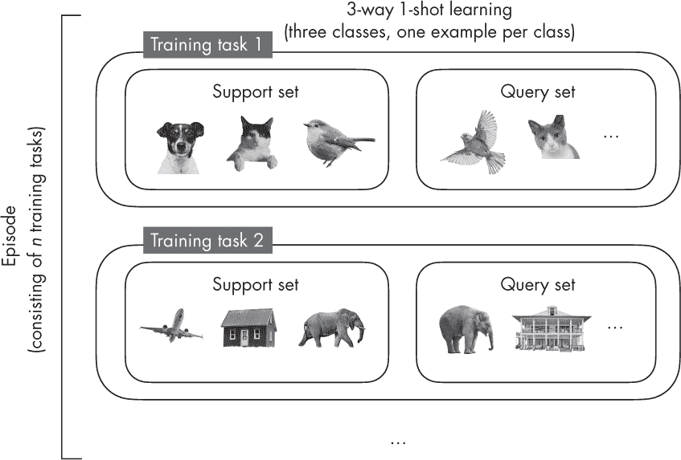
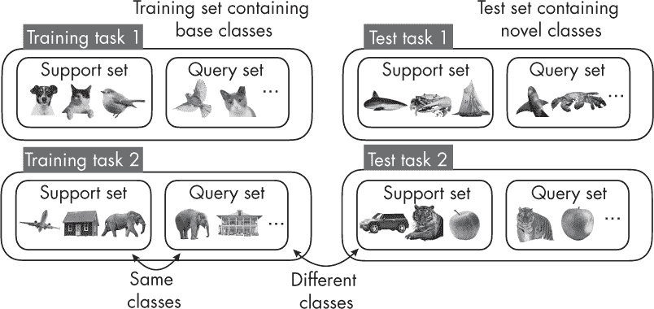
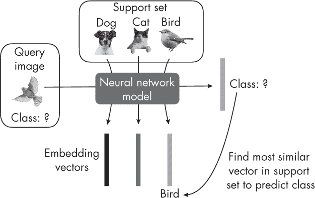

## 第三章：**少样本学习**

什么是少样本学习？它与传统的监督学习训练过程有何不同？

*少样本学习* 是一种监督学习方法，适用于样本与类别比非常小的小型训练集。在常规的监督学习中，我们通过多次迭代训练集来训练模型，模型始终会看到一组固定的类别。而在少样本学习中，我们在支持集上工作，从中创建多个训练任务以组装训练回合，每个训练任务包含不同的类别。

### **数据集和术语**

在监督学习中，我们在训练数据集上拟合模型，并在测试数据集上评估模型。训练集通常包含每个类别相对较多的样本。例如，在监督学习的上下文中，Iris 数据集每个类别有 50 个样本，被认为是一个小型数据集。而对于深度学习模型来说，像 MNIST 这样的数据集，每个类别有 5,000 个训练样本，也被认为是非常小的。

在少样本学习中，每个类别的样本数要小得多。在指定少样本学习任务时，我们通常使用术语 N-*way* K-*shot*，其中 *N* 代表类别数，*K* 代表每个类别的样本数。最常见的值是 *K* = 1 或 *K* = 5。例如，在一个 5-way 1-shot 问题中，有五个类别，每个类别只有一个样本。图 3-1 展示了一个 3-way 1-shot 设置，用一个较小的例子来说明这一概念。

*图 3-1：少样本学习中的训练任务*

我们可以将少样本学习视为“学习如何学习”，而不是像拟合模型到训练数据集那样。在与监督学习的对比中，少样本学习不是使用训练数据集，而是使用一个所谓的 *支持集*，从中抽取训练任务来模拟预测时的使用场景。每个训练任务都伴随有一个需要分类的查询图像。模型会在多个来自支持集的训练任务上进行训练，这个过程叫做 *回合*。

接下来，在测试阶段，模型会接收到一个新的任务，任务中的类别与训练时看到的类别不同。训练中遇到的类别也被称为 *基础类别*，而训练时使用的支持集通常也被称为 *基础集*。同样，任务是对查询图像进行分类。测试任务与训练任务相似，不同之处在于测试时的类别与训练时的类别没有重叠，正如图 3-2 所示。

*图 3-2：训练和测试中看到的类别*

正如图 3-2 所示，支持集和查询集在训练过程中包含来自同一类别的不同图像。在测试过程中也是如此。然而，请注意，支持集和查询集中的类别与训练过程中遇到的支持集和查询集的类别不同。

有许多不同类型的少样本学习。在最常见的*元学习*中，训练本质上是更新模型的参数，使其能够*适应*新任务。从高层次来看，一种少样本学习策略是学习一个模型，该模型生成嵌入，我们可以通过在支持集中的图像中进行最近邻搜索来找到目标类别。图 3-3 展示了这种方法。

*图 3-3：学习适合分类的嵌入*

该模型学习如何从支持集中生成良好的嵌入，以通过找到最相似的嵌入向量来分类查询图像。

### **练习**

**3-1.** MNIST（*[`en.wikipedia.org/wiki/MNIST_database`](https://en.wikipedia.org/wiki/MNIST_database)*) 是一个经典且流行的机器学习数据集，包含来自 10 个类别（对应数字 0 到 9）的 50,000 个手写数字。我们如何将 MNIST 数据集划分为一次性分类的上下文？

**3-2.** 少样本学习的现实世界应用或使用场景有哪些？
