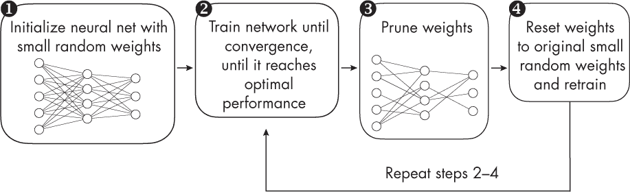

## 第四章：彩票假设**

彩票假设是什么？如果它成立，在实践中有什么用处？

彩票假设是神经网络训练中的一个概念，它认为在一个随机初始化的神经网络中，存在一个子网络（或称“中奖票”），当单独训练时，可以在测试集上达到与完整网络相同的准确度，而训练的步数与完整网络相同。这个概念最初由 Jonathan Frankle 和 Michael Carbin 在 2018 年提出。

本章逐步阐述了彩票假设，然后介绍了*权重修剪*，这是根据彩票假设方法论创建更小子网络的关键技术之一。最后，讨论了该假设的实际意义和局限性。

### **彩票假设训练过程**

图 4-1 展示了彩票假设的训练过程，共有四个步骤，我们将逐一讨论这些步骤，以帮助澄清这一概念。

*图 4-1：彩票假设训练过程*

在图 4-1 中，我们从一个大型神经网络 ➊ 开始，训练直到收敛 ➋，这意味着我们尽最大努力让它在目标数据集上表现得尽可能好（例如，最小化训练损失和最大化分类准确性）。这个大型神经网络像往常一样使用小的随机权重进行初始化。

接下来，如图 4-1 所示，我们修剪神经网络的权重参数➌，将它们从网络中移除。我们可以通过将权重设置为零来创建稀疏的权重矩阵。这里，我们可以选择修剪单个权重，这称为*非结构化*修剪，或者修剪更大“块”的部分，例如整个卷积滤波器通道。这称为*结构化*修剪。

原始的彩票假设方法遵循一个称为*迭代幅度修剪*的概念，其中幅度最小的权重会以迭代的方式被移除。（我们将在第六章中讨论减少过拟合的技术时重新回顾这个概念。）

在修剪步骤之后，我们将权重重置为图 4-1 中第 1 步使用的原始小随机值，并训练修剪后的网络 ➍。值得强调的是，我们不会使用任何小的随机权重重新初始化修剪后的网络（这是迭代幅度修剪中常见的做法），而是重新使用第 1 步中的权重。

然后我们重复剪枝步骤 2 至 4，直到达到所需的网络大小。例如，在原始彩票票假设论文中，作者成功地将网络大小减少到原始大小的 10%，而不牺牲分类精度。作为一个额外的好处，修剪后的（稀疏的）网络，即所谓的*中奖票*，甚至展示了比原始（大而密集）网络更好的泛化性能。

### **实践意义与局限性**

如果能够识别出那些预测性能与其最大可达十倍大网络相当的小型子网络，这将对神经网络训练和推理产生重大影响。鉴于现代神经网络架构的不断增大，这有助于降低训练成本和基础设施。

听起来像是太好了不真实？也许吧。如果能高效识别中奖票，那在实践中将非常有用。然而，在写作时，尚无方法能在不训练原始网络的情况下找到中奖票。包括剪枝步骤会使得这个过程比常规训练程序更昂贵。此外，在原始论文发布后，研究人员发现原始权重初始化可能无法在更大规模的网络中找到中奖票，需要进一步对修剪后的网络初始权重进行实验。

好消息是，中奖票确实存在。即使目前无法在不训练它们更大神经网络对等体的情况下识别它们，但在训练后，它们可以用于更高效的推理。

### **练习**

**4-1.** 假设我们在尝试彩票票假设方法时发现子网络的性能不太好（与原始网络相比）。我们可以尝试哪些下一步措施？

**4-2.** 修正线性单元（ReLU）激活函数的简洁性和高效性使其成为神经网络训练中最流行的激活函数之一，特别是在深度学习中，它有助于缓解如梯度消失等问题。ReLU 激活函数通过数学表达式 max(0, *x*)定义。这意味着，如果输入的*x*为正，函数返回*x*；但如果输入为负数或 0，函数返回 0。彩票票假设如何与使用 ReLU 激活函数训练神经网络相关联？

### **参考文献**

+   提出彩票票假设的论文：Jonathan Fran-kle 和 Michael Carbin，"The Lottery Ticket Hypothesis: Finding Sparse, Trainable Neural Networks"（2018），* [`arxiv.org/abs/1803.03635`](https://arxiv.org/abs/1803.03635)*。

+   提出结构化剪枝以移除网络中较大部分（例如整个卷积滤波器）的论文：Hao Li 等，"Pruning Filters for Efficient ConvNets"（2016），* [`arxiv.org/abs/1608.08710`](https://arxiv.org/abs/1608.08710)*。

+   关于彩票假设的后续工作，表明原始的权重初始化方法可能无法找到更大规模网络的“中奖票据”，需要对修剪后网络的初始权重进行额外实验：Jonathan Frankle 等人，"线性模式连接性与彩票票据假设"（2019），*[`arxiv.org/abs/1912.05671`](https://arxiv.org/abs/1912.05671)*。

+   一种改进的“彩票票据假设”算法，通过找到较小的网络，精确匹配更大网络的表现：Vivek Ramanujan 等人，"随机加权神经网络中隐藏的是什么？"（2020），*[`arxiv.org/abs/1911.13299`](https://arxiv.org/abs/1911.13299)*。
