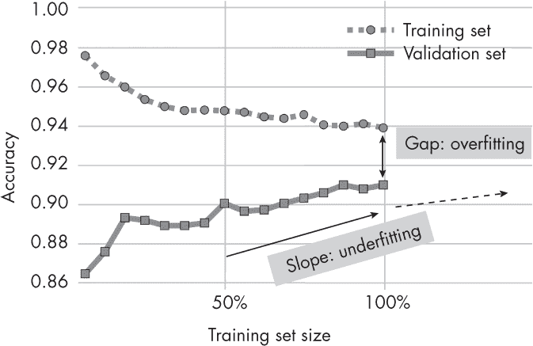
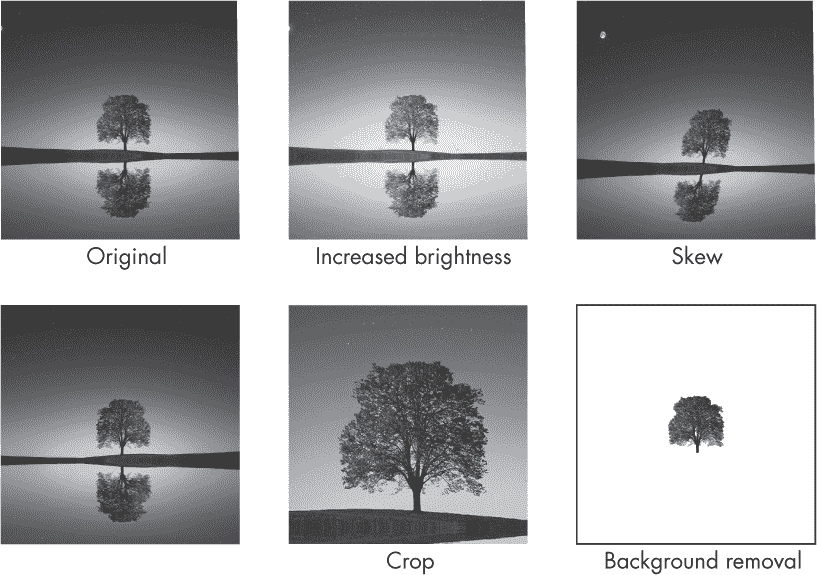

## 第五章：使用数据减少过拟合**

假设我们以监督方式训练神经网络分类器，并注意到它存在过拟合问题。通过改变或增加数据，有哪些常见的方式可以通过使用额外的数据来减少神经网络中的过拟合？

*过拟合*，是机器学习中常见的问题，当模型过于紧密地拟合训练数据时，学习了其中的噪声和异常值，而不是其潜在模式。因此，模型在训练数据上表现良好，但在未见或测试数据上表现不佳。虽然理想情况下应该预防过拟合，但通常不可能完全消除它。相反，我们的目标是尽可能地减少或最小化过拟合。

减少过拟合的最成功技术围绕着收集更多高质量标记数据展开。然而，如果收集更多标记数据不可行，我们可以增强现有数据或利用未标记数据进行预训练。

### **常见方法**

本章总结了经受住时间考验的与数据集相关的技术的最显著示例，将它们分为以下几类：收集更多数据、数据增强和预训练。

#### ***收集更多数据***

减少过拟合的最佳方法之一是收集更多（高质量的）数据。我们可以绘制学习曲线来确定一个给定模型是否会从更多数据中受益。为构建学习曲线，我们对不同大小的训练集（例如 10%，20%等）进行训练，并在同一固定大小的验证或测试集上评估训练好的模型。如图 5-1 所示，随着训练集大小的增加，验证准确率也会提高。这表明我们可以通过收集更多数据来改善模型的性能。

*图 5-1：适应不同训练集大小的模型的学习曲线图*

训练和验证性能之间的差距指示了过拟合的程度——差距越大，过拟合越严重。相反，验证性能提升的斜率表明模型欠拟合，并且可以从更多数据中受益。通常情况下，额外的数据可以减少欠拟合和过拟合。

#### ***数据增强***

数据增强指的是基于现有数据生成新的数据记录或特征。它允许扩展数据集而无需额外收集数据。

数据增强使我们能够创建原始输入数据的不同版本，从而提高模型的泛化性能。为什么？增强数据有助于模型提高其泛化能力，因为它使得通过训练样本或特征记住虚假信息变得更加困难——或者，在图像数据的情况下，针对特定像素位置的精确像素值。图 5-2 突出展示了常见的图像数据增强技术，包括增加亮度、翻转和裁剪。

*图 5-2：不同图像数据增强技术的选择*

数据增强通常是图像数据（参见图 5-2）和文本数据（在第十五章中进一步讨论）中的标准做法，但表格数据的增强方法也存在。

除了收集更多数据或增强现有数据，还可以生成新的合成数据。虽然图像数据和文本数据中更常见生成合成数据，但对于表格数据也可以生成合成数据。

#### ***预训练***

如第二章所述，自监督学习让我们能够利用大型未标注数据集对神经网络进行预训练。这也有助于减少在较小目标数据集上的过拟合。

作为自监督学习的替代方案，传统的迁移学习在大型标注数据集上也是一个选择。迁移学习在标注数据集与目标领域密切相关时最为有效。例如，如果我们训练一个模型来分类鸟类物种，我们可以在一个大型的通用动物分类数据集上进行预训练。然而，如果这样的动物分类数据集不可用，我们也可以在相对广泛的 ImageNet 数据集上预训练模型。

某个数据集可能非常小，不适合监督学习——例如，如果它每个类别只有少量标注样本。如果我们的分类器需要在一个无法收集更多标注数据的情境下工作，我们也可以考虑少样本学习。

### **其他方法**

前面的部分介绍了使用和修改数据集以减少过拟合的主要方法。然而，这并不是一个详尽无遗的列表。其他常见的技术包括：

+   特征工程和归一化

+   对抗样本、标签或特征噪声的包含

+   标签平滑

+   更小的批量大小

+   数据增强技术，如 Mixup、Cutout 和 CutMix

下一章将介绍从模型角度减少过拟合的额外技术，并以讨论我们在实践中应考虑的正则化技术作为结尾。

### **练习**

**5-1.** 假设我们训练一个 XGBoost 模型，基于从合作者那里手动提取的特征对图像进行分类。标注训练示例的数据集相对较小，但幸运的是，我们的合作者还拥有来自相关领域旧项目的标注训练集。我们正在考虑实施迁移学习方法来训练 XGBoost 模型。这是一个可行的选择吗？如果是的话，我们该如何操作？（假设我们只能使用 XGBoost，而不能使用其他分类算法或模型。）

**5-2.** 假设我们正在处理基于 MNIST 的手写数字识别图像分类问题。我们添加了相当多的数据增强以减少过拟合。不幸的是，我们发现分类精度比增强前差得多。这可能有哪些原因？

### **参考文献**

+   关于表格数据增强的论文：Derek Snow，"DeltaPy: A Framework for Tabular Data Augmentation in Python"（2020），* [`github.com/firmai/deltapy`](https://github.com/firmai/deltapy)*。

+   提出 GReaT 方法的论文，该方法使用自回归生成的大型语言模型生成合成表格数据：Vadim Borisov 等人，"Language Models Are Realistic Tabular Data Generators"（2022），* [`arxiv.org/abs/2210.06280`](https://arxiv.org/abs/2210.06280)*。

+   提出 TabDDPM 方法的论文，该方法使用扩散模型生成合成表格数据：Akim Kotelnikov 等人，"TabDDPM: Modelling Tabular Data with Diffusion Models"（2022），* [`arxiv.org/abs/2209.15421`](https://arxiv.org/abs/2209.15421)*。

+   Scikit-learn 的用户指南提供了一个关于数据预处理的章节，包含了像特征缩放和归一化这样的技术，可以增强模型的表现：* [`scikit-learn.org/stable/modules/preprocessing.html`](https://scikit-learn.org/stable/modules/preprocessing.html)*。

+   关于如何使用带噪标签稳健训练深度模型的调查，探讨了缓解错误或误导性目标值影响的技术：Bo Han 等人，"A Survey of Label-noise Representation Learning: Past, Present and Future"（2020），* [`arxiv.org/abs/2011.04406`](https://arxiv.org/abs/2011.04406)*。

+   理论和实证证据支持控制批量大小与学习率的比率在随机梯度下降中对深度神经网络建模性能的重要性：Fengxiang He、Tongliang Liu 和 Dacheng Tao，"Control Batch Size and Learning Rate to Generalize Well: Theoretical and Empirical Evidence"（2019），* [`dl.acm.org/doi/abs/10.5555/3454287.3454390`](https://dl.acm.org/doi/abs/10.5555/3454287.3454390)*。

+   包含对抗样本，这些输入样本旨在误导模型，通过使模型更加稳健来提高预测性能：Cihang Xie 等人，《对抗样本提高图像识别》（2019），* [`arxiv.org/abs/1911.09665`](https://arxiv.org/abs/1911.09665)*。

+   标签平滑是一种正则化技术，通过用软化的值替代硬性的 0 和 1 分类目标，从而减轻数据集中可能存在的错误标签的影响：Rafael Müller、Simon Kornblith 和 Geoffrey Hinton，《标签平滑何时有帮助？》（2019），* [`arxiv.org/abs/1906.02629`](https://arxiv.org/abs/1906.02629)*。

+   Mixup 是一种流行的方法，通过对混合数据对进行训练，提升神经网络的泛化能力和稳健性：Hongyi Zhang 等人，《Mixup: 超越经验风险最小化》（2018），* [`arxiv.org/abs/1710.09412`](https://arxiv.org/abs/1710.09412)*。
