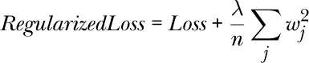
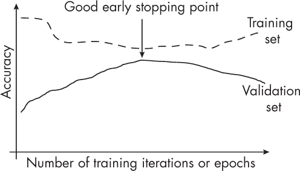
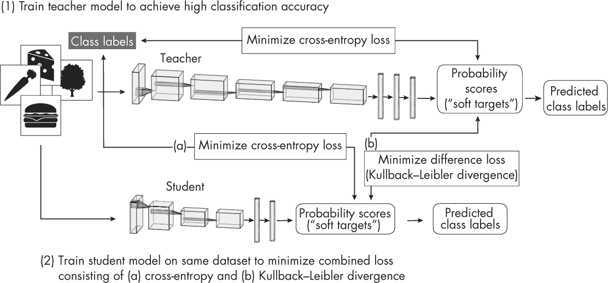
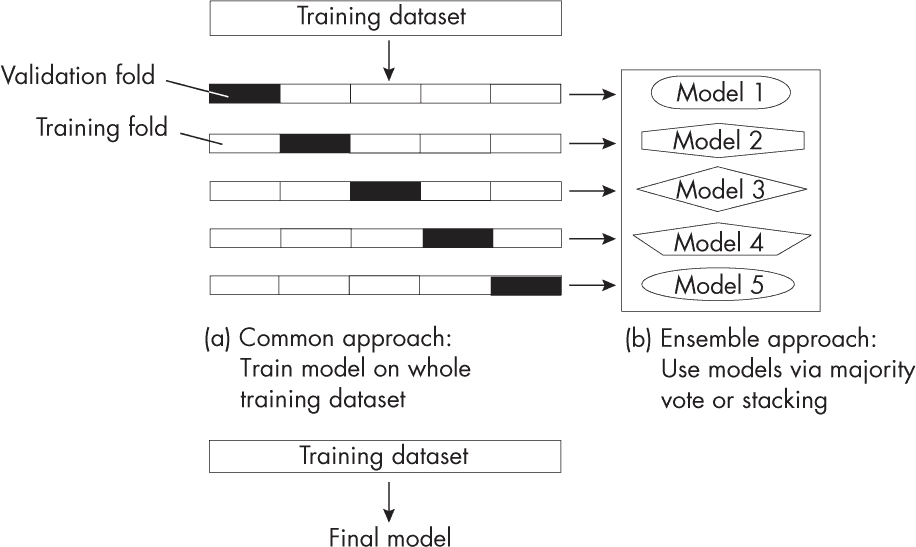

## 第六章：**通过模型修改减少过拟合**

假设我们以监督方式训练一个神经网络分类器，并且已经采用了各种与数据集相关的技术来减轻过拟合。我们如何改变模型或修改训练循环以进一步减少过拟合的影响？

对抗过拟合的最成功的方法包括正则化技术，如丢弃法和权重衰减。通常而言，参数较多的模型需要更多的训练数据才能很好地进行泛化。因此，减小模型的规模和容量有时也有助于减少过拟合。最后，构建集成模型是对抗过拟合最有效的方法之一，但它伴随了更高的计算开销。

本章概述了几种通过修改模型来减少过拟合的关键思想和技术，并将它们进行比较。最后，讨论了如何在所有过拟合减少方法中做出选择，包括前一章讨论的那些方法。

### **常见方法**

为了减少过拟合，诸多模型和训练相关的技术可以分为三大类：（1）添加正则化，（2）选择更小的模型，以及（3）构建集成模型。

#### ***正则化***

我们可以将正则化解释为对复杂度的惩罚。经典的神经网络正则化技术包括 *L*[2] 正则化和相关的权重衰减方法。我们通过向损失函数中添加一个惩罚项来实现 *L*[2] 正则化，该项在训练过程中被最小化。这个添加的项代表了权重的大小，比如权重的平方和。以下公式展示了一个 *L*[2] 正则化的损失函数。

其中 *λ* 是一个超参数，用于控制正则化的强度。

在反向传播过程中，优化器最小化修改后的损失函数，损失函数现在包括了额外的惩罚项，这会导致模型权重变小，从而提高模型对未见数据的泛化能力。

权重衰减类似于 *L*[2] 正则化，但它直接应用于优化器，而不是修改损失函数。由于权重衰减与 *L*[2] 正则化具有相同的效果，这两种方法通常可以互换使用，但根据实现细节和优化器的不同，可能会有细微差异。

还有许多其他技术具有正则化效果。为了简洁起见，我们只讨论两种更常用的方法：丢弃法（dropout）和提前停止（early stopping）。

丢弃法通过在训练过程中随机将一些隐藏单元的激活值设为零来减少过拟合。因此，神经网络不能依赖于某些特定的神经元被激活。相反，它学会使用更多的神经元和多种独立的数据表示，这有助于减少过拟合。

在早停法中，我们在训练过程中监控模型在验证集上的表现，并在验证集上的表现开始下降时停止训练过程，如图 6-1 所示。

*图 6-1：早停法*

在图 6-1 中，我们可以看到，随着训练和验证准确率差距的缩小，验证准确率逐渐提高。训练和验证准确率最接近的那个点通常是过拟合最少的点，通常是早停的最佳时机。

#### ***更小的模型***

经典的偏差-方差理论表明，减少模型大小可以降低过拟合。该理论的直觉是，作为一个经验法则，模型参数越小，它对数据中的噪声进行记忆或过拟合的能力就越小。接下来的段落讨论了减少模型大小的方法，包括剪枝（从模型中移除参数）和知识蒸馏（将知识转移到较小的模型中）。

除了作为超参数调优过程中的减少层数和缩小层宽度外，获取更小模型的另一种方法是*迭代剪枝*，即我们训练一个大型模型，使其在原始数据集上表现良好。然后我们反复去除模型的参数，重新训练它，使得它能够保持与原始模型相同的预测性能。（第四章中讨论的“彩票票据假说”使用了迭代剪枝。）

另一种常见的获取较小模型的方法是*知识蒸馏*。这种方法的基本思想是将来自一个大型、复杂模型（*教师*）的知识转移到一个较小的模型（*学生*）中。理想情况下，学生模型能够达到与教师模型相同的预测准确性，但由于模型较小，它能更高效地完成任务。作为一个附带的好处，较小的学生模型可能比较大的教师模型更少发生过拟合。

图 6-2 展示了原始的知识蒸馏过程。在这个过程中，教师模型首先通过常规的监督学习方式进行训练，以良好地分类数据集中的示例，使用常规的交叉熵损失来计算预测得分与真实类别标签之间的差异。与此同时，较小的学生网络在同一数据集上进行训练，训练目标是最小化（a）输出与类别标签之间的交叉熵损失，以及（b）其输出与教师输出之间的差异（使用*Kullback–Leibler*散度来衡量，Kullback–Leibler 散度量化了两个概率分布之间的差异，计算一个分布在信息内容上与另一个分布的偏离程度）。

*图 6-2：原始的知识蒸馏过程*

通过最小化 Kullback–Leibler 散度——教师和学生得分分布之间的差异——学生在变得更小、更高效的同时学会模仿教师。

#### ***较小模型的警告***

尽管修剪和知识蒸馏也可以增强模型的泛化性能，但这些技术并不是减少过拟合的主要或有效方法。

早期的研究结果表明，修剪和知识蒸馏能够提高泛化性能，可能是由于模型变得更小。然而，令人反直觉的是，最近的研究研究了诸如双重下降和“grokking”现象，发现较大、过度参数化的模型如果训练超越过拟合点，也能表现出更好的泛化性能。*双重下降*是指在模型的参数数量较少或极多时，具有较好的泛化性能，而在模型的参数数量等于训练数据点数时，泛化性能较差。*Grokking*揭示了随着数据集大小的减少，优化的需求增加，且泛化性能能够在超越过拟合点后继续改善。

我们如何调和修剪后的模型在泛化性能上可能更好的观察结果与来自双重下降和“grokking”现象研究的矛盾观察？最近的研究表明，改进的训练过程在一定程度上解释了由于修剪导致的过拟合减少。修剪涉及更长时间的训练周期和学习率调度的重复，这可能在一定程度上促进了泛化性能的提升。

修剪和知识蒸馏仍然是提高模型计算效率的优秀方法。然而，尽管它们也可以增强模型的泛化性能，但这些技术并不是减少过拟合的主要或有效方法。

#### ***集成方法***

集成方法结合多个模型的预测，以提高整体预测性能。然而，使用多个模型的缺点是增加了计算成本。

我们可以将集成方法看作是请一组专家委员会对某个决策进行评估，然后通过某种方式将他们的判断结合起来，做出最终决策。委员会成员通常具有不同的背景和经验。虽然他们在基本决策上往往意见一致，但他们可以通过多数规则推翻错误的决策。这并不意味着大多数专家总是正确的，但大多数委员会成员的判断，平均而言，比每一个单独的成员更有可能是正确的。

集成方法最基本的例子是多数投票法。在这里，我们训练*k*个不同的分类器，并从这些*k*个模型中收集每个模型对于给定输入的预测类别标签。然后，我们返回出现频率最高的类别标签作为最终预测。（对于平局，通常通过置信度得分、随机选择标签或选择具有最低索引的类别标签来解决。）

集成方法在经典机器学习中比在深度学习中更为常见，因为使用多个模型比依赖单个模型更为计算密集。换句话说，深度神经网络需要大量计算资源，使得它们不太适合用于集成方法。

随机森林和梯度提升是集成方法的常见示例。然而，通过使用多数投票或堆叠等方法，我们可以将任何一组模型结合在一起：一个集成可能由支持向量机、多层感知机和最近邻分类器组成。在这里，堆叠（也称为*堆叠泛化*）是多数投票的一种更高级的变体，涉及训练一个新的模型来结合多个其他模型的预测，而不是通过多数投票获得标签。

一种流行的行业技术是使用*k*-折交叉验证来构建模型，这是一种模型评估技术，在这种方法中，我们在*k*个训练折上训练和评估模型。然后，我们计算所有*k*次迭代的平均性能指标，以估计模型的整体性能度量。评估后，我们可以选择在整个训练数据集上训练模型，或者将单个模型作为集成进行组合，如图 6-3 所示。

*图 6-3：* k*-折交叉验证用于创建模型集成*

如图 6-3 所示，*k*-折集成方法在每一轮中将每个*k*模型在相应的*k* – 1 个训练折上进行训练。在对模型进行验证集折评估后，我们可以将它们组合成多数投票分类器，或者使用堆叠方法构建一个集成，堆叠方法是通过元模型结合多个分类或回归模型的技术。

尽管集成方法有可能减少过拟合并提高鲁棒性，但这种方法并不总是适用。例如，潜在的缺点包括管理和部署一个集成模型，这比使用单个模型更为复杂且计算开销更大。

### **其他方法**

到目前为止，本书已经介绍了一些最突出减少过拟合的技术。第五章介绍了从数据角度减少过拟合的技术。通过对模型的修改来减少过拟合的其他技术包括跳跃连接（例如，残差网络中的跳跃连接）、前瞻优化器、随机权重平均、多任务学习和快照集成。

虽然它们最初并非为减少过拟合而设计，但诸如批量归一化（BatchNorm）和层归一化（LayerNorm）等层输入归一化技术可以稳定训练，并且通常具有正则化效果，能够减少过拟合。权重归一化通过对模型权重进行归一化，而不是层输入，可能也会带来更好的泛化性能。然而，这一效果并不如权重衰减那样直接，因为权重归一化（WeightNorm）并不像权重衰减那样明确地充当正则化器。

### **选择正则化技术**

提高数据质量是减少过拟合的一个重要步骤。然而，对于具有大量参数的现代深度神经网络，我们需要做更多的工作才能实现可接受的过拟合水平。因此，数据增强和预训练，以及诸如 dropout 和权重衰减等已建立的技术，仍然是重要的过拟合减少方法。

在实践中，我们可以并且应该同时使用多种方法来减少过拟合，以实现加成效果。为了获得最佳结果，将选择这些技术视为超参数优化问题。

### **练习**

**6-1.** 假设我们使用早停作为减少过拟合的机制——特别是使用一种现代的早停变体，在训练过程中创建最佳模型的检查点（例如，具有最高验证准确度的模型），以便在训练完成后加载它。大多数现代深度学习框架中都可以启用此机制。然而，一位同事建议调整训练周期数。每种方法的优缺点是什么？

**6-2.** 集成模型已被证明是减少过拟合并增强预测建模可靠性的可靠且成功的方法。然而，这总是存在一个权衡。与集成技术相关的一些缺点是什么？

### **参考文献**

+   想了解更多关于 *L*[2] 正则化与权重衰减之间的区别，请参阅：Guodong Zhang 等人，“权重衰减正则化的三种机制”（2018），*[`arxiv.org/abs/1810.12281`](https://arxiv.org/abs/1810.12281)*。

+   研究结果表明，剪枝和知识蒸馏可以改善泛化性能，这可能是由于模型规模的减小：Geoffrey Hinton, Oriol Vinyals, 和 Jeff Dean，“神经网络中的知识蒸馏”（2015），*[`arxiv.org/abs/1503.02531`](https://arxiv.org/abs/1503.02531)*。

+   经典的偏差-方差理论表明，减小模型规模可以减少过拟合：Jerome H. Friedman, Robert Tibshirani, 和 Trevor Hastie, “模型选择与偏差-方差权衡，”*统计学习的元素*（Springer, 2009）第 2.9 章。

+   彩票票假设通过知识蒸馏找到具有与原始网络相同预测性能的更小网络：Jonathan Frankle 和 Michael Carbin，“彩票票假设：找到稀疏、可训练的神经网络”（2018 年）， *[`arxiv.org/abs/1803.03635`](https://arxiv.org/abs/1803.03635)*。

+   关于双重下降的更多信息： *[`en.wikipedia.org/wiki/Double_descent`](https://en.wikipedia.org/wiki/Double_descent)*。

+   Grokking 现象表明，泛化性能可以远远超过过拟合的点：Alethea Power 等人，“Grokking：在小型算法数据集上超越过拟合的泛化”（2022 年）， *[`arxiv.org/abs/2201.02177`](https://arxiv.org/abs/2201.02177)*。

+   最近的研究表明，改进的训练过程在一定程度上解释了由于修剪导致的过拟合减少：Tian Jin 等人，“从训练和正则化的角度看修剪对泛化的影响”（2022 年）， *[`arxiv.org/abs/2210.13738`](https://arxiv.org/abs/2210.13738)*。

+   Dropout 曾被讨论作为一种正则化技术，但它也可以被视为一种集成方法，近似多个网络的加权几何平均值：Pierre Baldi 和 Peter J. Sadowski，“理解 Dropout”（2013 年）， *[`proceedings.neurips.cc/paper/2013/hash/71f6278d140af599e06ad9bf1ba03cb0-Abstract.html`](https://proceedings.neurips.cc/paper/2013/hash/71f6278d140af599e06ad9bf1ba03cb0-Abstract.html)*。

+   正则化组合需要根据每个数据集进行调整：Arlind Kadra 等人，“调优得当的简单网络在表格数据集上的表现优秀”（2021 年）， *[`arxiv.org/abs/2106.11189`](https://arxiv.org/abs/2106.11189)*。
