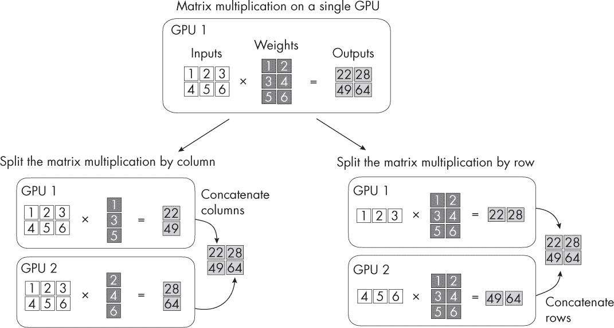
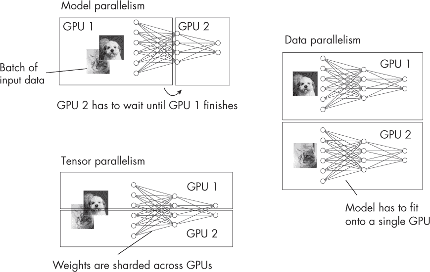
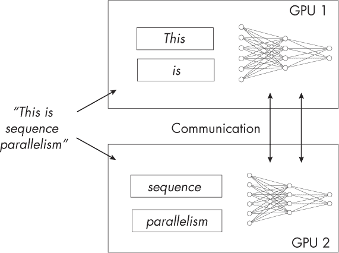

## 第七章：多 GPU 训练范式**

有哪些不同的多 GPU 训练范式，它们各自的优缺点是什么？

多 GPU 训练范式可以分为两类：一类是将数据划分进行并行处理，另一类是将模型划分到多个 GPU 上，以应对当模型大小超出单个 GPU 内存时的内存限制。数据并行属于第一类，而模型并行和张量并行属于第二类。像流水线并行这样的技术则融合了这两类思想。此外，当前的软件实现，如 DeepSpeed、Colossal AI 等，也将多种方法融合成一种混合技术。

本章介绍了几种训练范式，并提供了在实践中使用哪些范式的建议。

**注意**

*本章主要使用“GPU”一词来描述用于并行处理的硬件。然而，讨论的相同概念和技术也可以应用于其他专用硬件设备，如张量处理单元（TPU）或其他加速器，具体取决于系统的架构和需求。*

### **训练范式**

以下各节讨论了模型并行、数据并行、张量并行和序列并行的多 GPU 训练范式。

#### ***模型并行***

*模型并行*，或称*操作间并行*，是一种将大型模型的不同部分放置在不同 GPU 上的技术，这些部分按顺序计算，并在设备之间传递中间结果。这使得训练和执行可能无法完全适配单个设备的模型成为可能，但它可能需要复杂的协调来管理模型不同部分之间的依赖关系。

模型并行可能是最直观的设备间并行化形式。例如，对于一个仅包含两个层——隐藏层和输出层的简单神经网络，我们可以将一层放在一个 GPU 上，另一层放在另一个 GPU 上。当然，这可以扩展到任意数量的层和 GPU。

这是处理有限 GPU 内存的一个好策略，尤其是当整个网络无法完全加载到一个 GPU 时。然而，还有更高效的多 GPU 使用方式，如张量并行，因为模型并行中的链式结构（层 1 在 GPU 1 上*→* 层 2 在 GPU 2 上*→* . . .）会引入瓶颈。换句话说，模型并行的一个主要缺点是，GPU 必须互相等待，无法高效并行工作，因为它们依赖于彼此的输出。

#### ***数据并行***

*数据并行*已经成为多 GPU 训练的默认模式好几年了。在这种模式下，我们将一个小批次分割成更小的微批次。然后每个 GPU 分别处理一个微批次，以计算模型权重的损失和损失梯度。在每个设备处理完微批次后，梯度会被合并，计算出下一轮的权重更新。

数据并行相对于模型并行的一个优势是，GPU 可以并行运行。每个 GPU 处理训练小批次的一部分，也就是一个微批次。然而，一个警告是，每个 GPU 都需要完整的模型副本。如果我们有无法放入 GPU 显存的大型模型，显然这是不可行的。

#### ***张量并行***

*张量并行*，或称为*操作内并行*，是一种更高效的模型并行形式。在这种方式下，权重矩阵和激活矩阵被分布到多个设备上，而不是将整个层分布到不同设备：每个矩阵被拆分，因此我们可以将单个矩阵乘法分配到多个 GPU 上进行计算。

我们可以使用线性代数的基本原理实现张量并行；我们可以按行或按列的方式将矩阵乘法拆分到两个 GPU 上，如图 7-1 所示。 （这一概念可以扩展到任意数量的 GPU。）

*图 7-1：用于分布矩阵乘法的张量并行*

和模型并行一样，张量并行让我们可以绕过内存限制。同时，它也允许我们并行执行操作，类似于数据并行。

张量并行的一个小缺点是，它可能会导致多个 GPU 之间的高通信开销，尤其是在矩阵被拆分或分片时。例如，张量并行要求频繁地同步设备间的模型参数，这可能会减慢整个训练过程。

图 7-2 比较了模型、数据和张量并行。

*图 7-2：模型、数据和张量并行的比较*

在模型并行中，我们将不同的层放置到不同的 GPU 上，以绕过 GPU 内存的限制。在数据并行中，我们将一个批次分割到多个 GPU 上并行训练模型的副本，随后对梯度进行平均以更新权重。在张量并行中，我们将矩阵（输入和权重）分布到不同的 GPU 上进行并行处理，当模型太大而无法放入 GPU 内存时，这种方式尤其有效。

#### ***流水线并行***

在*流水线并行*中，激活值在前向传播时传递，就像在模型并行中一样。不同的是，输入张量的梯度会反向传递，以避免设备空闲。从某种意义上说，流水线并行是数据并行和模型并行的复杂混合版本。

我们可以将管道并行性视为一种模型并行性，它试图最小化顺序计算瓶颈，增强不同设备上单个层之间的并行性。然而，管道并行性也借鉴了数据并行性的一些思想，例如将小批量进一步划分为微批次。

管道并行性无疑是对模型并行性的改进，尽管它并不完美，仍然会有空闲气泡。管道并行性的一个进一步缺点是，它可能需要大量努力来设计和实现管道阶段及其相关的通信模式。此外，它所产生的性能提升可能不如其他并行化技术（如纯数据并行性）那么显著，特别是对于小模型或在通信开销较高的情况下。

对于那些过大以至于无法装入 GPU 内存的现代架构，现在更常用的是数据并行性和张量并行性技术的结合，而不是管道并行性。

#### ***序列并行性***

*序列并行性*旨在解决使用基于变换器的 LLM 处理长序列时的计算瓶颈。更具体地说，变换器的一个缺点是自注意力机制（原始的缩放点积注意力）随着输入序列长度的增加，计算量呈二次增长。当然，也有比原始注意力机制更高效的替代方案，能够线性扩展。

然而，这些高效的自注意力机制并不太流行，到目前为止，大多数人仍然更喜欢原始的缩放点积注意力机制。序列并行性，如图 7-3 所示，将输入序列拆分成较小的块，分配到多个 GPU 上，旨在减少自注意力机制的计算内存限制。

*图 7-3：序列并行性将长输入划分到多个 GPU 上。*

序列并行性如何与前面讨论的多 GPU 技术相关联？序列并行性专门处理顺序数据，张量并行性处理模型的内部结构，而数据并行性则处理训练数据的划分。理论上，由于这些并行策略各自解决计算挑战的不同方面，因此可以通过多种方式结合使用，以优化训练或推理过程。然而，序列并行性并不像其他并行化技术那样得到充分研究。

尽管序列并行性在实践中似乎有用，但它也带来了与上述并行化技术类似的额外通信开销。像数据并行性一样，它要求我们复制模型并确保它适配设备内存。对于变换器的多 GPU 训练，另一个缺点（取决于实现）是将输入序列分割成更小的子序列可能会降低模型的准确性（主要是在应用于较长序列时）。

### **建议**

实际建议取决于具体的情况。如果我们训练的小模型可以适应单个 GPU，那么数据并行性策略可能是最有效的。流水线并行性带来的性能提升可能不如其他并行化技术，如数据并行性，尤其是在小模型或通信开销较高的情况下。

如果模型太大，无法适配单个 GPU 的内存，我们需要探索模型或张量并行性。张量并行性天生更高效；因为没有像模型并行性那样的顺序依赖，GPU 可以并行工作。

现代的多 GPU 策略通常也结合了数据并行性和张量并行性。

### **练习**

**7-1.** 假设我们正在实现自己版本的张量并行性，当我们使用标准的随机梯度下降优化器训练模型时，它运行得很好。然而，当我们尝试使用 Diederik P. Kingma 和 Jimmy Ba 提出的 Adam 优化器时，遇到了设备内存不足的问题。是什么原因可能解释了这个问题？

**7-2.** 假设我们没有 GPU 可用，并且考虑在 CPU 上使用数据并行性。这是一个好主意吗？

### **参考文献**

+   关于 Adam 优化器的原始论文：Diederik P. Kingma 和 Jimmy Ba，《Adam: 一种用于随机优化的方法》（2014 年），*[`arxiv.org/abs/1412.6980`](https://arxiv.org/abs/1412.6980)*。

+   有关 DeepSpeed 和 Colossal-AI 在多 GPU 训练中的更多信息：*[`github.com/microsoft/DeepSpeed`](https://github.com/microsoft/DeepSpeed)* 和 *[`github.com/hpcaitech/ColossalAI`](https://github.com/hpcaitech/ColossalAI)*。

+   DeepSpeed 团队的流水线并行教程和研究：*[`www.deepspeed.ai/tutorials/pipeline`](https://www.deepspeed.ai/tutorials/pipeline)* 和 Yanping Huang 等人，《GPipe: 使用流水线并行高效训练巨型神经网络》（2018 年），*[`arxiv.org/abs/1811.06965`](https://arxiv.org/abs/1811.06965)*。

+   提出序列并行性用于基于变换器的语言模型的论文：Shenggui Li 等人，《序列并行性：从[系统]的角度看长序列训练》（2022 年），*[`arxiv.org/abs/2105.13120`](https://arxiv.org/abs/2105.13120)*。

+   扩展点积注意力机制是在原始的 Transformer 架构中提出的：Ashish Vaswani 等人，“Attention Is All You Need”（2017），*[`arxiv.org/abs/1706.03762`](https://arxiv.org/abs/1706.03762)*。

+   介绍了替代原始自注意力机制的方案，并且这些方案具有线性扩展性：Yi Tay 等人，“Efficient Transformers: A Survey”（2020），*[`arxiv.org/abs/2009.06732`](https://arxiv.org/abs/2009.06732)*。

+   介绍了提高 Transformer 训练效率的额外技术：Bohan Zhuang 等人，“A Survey on Efficient Training of Transformers”（2023），*[`arxiv.org/abs/2302.01107`](https://arxiv.org/abs/2302.01107)*。

+   现代多 GPU 策略通常结合数据并行性和张量并行性。流行的例子包括 DeepSpeed 阶段 2 和 3，这些在零冗余优化器的教程中有描述：*[`www.deepspeed.ai/tutorials/zero/`](https://www.deepspeed.ai/tutorials/zero/)*。
