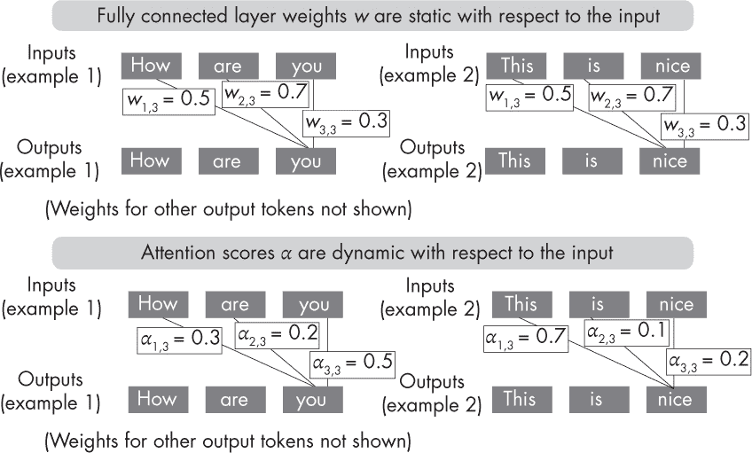
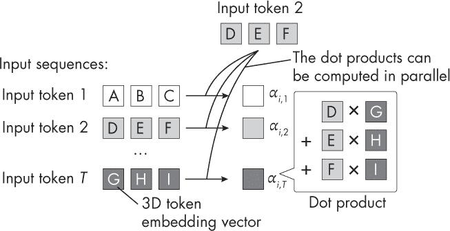

## 第八章：**变换器的成功**

变换器成功的主要因素有哪些？

近年来，变换器成为了最成功的神经网络架构，特别是在各种自然语言处理任务中。事实上，变换器现在也即将成为计算机视觉任务的最新技术。变换器的成功可以归因于几个关键因素，包括其注意力机制、易于并行化、无监督预训练和高参数量。

### **注意力机制**

变换器中使用的自注意力机制是使基于变换器的大型语言模型（LLM）如此成功的关键设计组件之一。然而，变换器并不是第一个利用注意力机制的架构。

注意力机制最早是在 2010 年图像识别的背景下发展起来的，之后被采用来帮助递归神经网络中的长句子翻译。（第十六章更详细地比较了递归神经网络和变换器中的注意力机制。）

上述的注意力机制灵感来源于人类视觉，每次专注于图像的特定部分（中央视网膜快照），以分层和顺序的方式处理信息。与此不同，变换器的基本机制是自注意力机制，主要用于序列到序列的任务，例如机器翻译和文本生成。它使得序列中的每个标记都能关注所有其他标记，从而提供每个标记的上下文感知表示。

是什么让注意力机制如此独特且有用？以下示例中，假设我们正在使用编码器网络来处理输入序列或图像的固定长度表示——这可以是全连接的、卷积的或基于注意力的编码器。

在变换器中，编码器使用自注意力机制来计算每个输入标记相对于序列中其他标记的重要性，从而使模型能够专注于输入序列中相关的部分。从概念上讲，注意力机制使得变换器能够关注序列或图像的不同部分。从表面上看，这听起来很像一个全连接层，其中每个输入元素通过权重与下一层中的输入元素相连接。在注意力机制中，注意力权重的计算涉及将每个输入元素与其他所有元素进行比较。通过这种方法得到的注意力权重是动态的且依赖于输入的。相比之下，卷积层或全连接层的权重在训练后是固定的，如图 8-1 所示。

*图 8-1：全连接层（上）和注意力得分（下）模型权重的概念差异*

如图 8-1 顶部所示，一旦训练完成，完全连接层的权重将保持固定，无论输入如何。相比之下，正如底部所示，自注意力机制的权重会根据输入的不同而变化，即便变换器已经训练完成。

注意力机制使神经网络能够有选择性地权衡不同输入特征的重要性，从而使模型能够专注于给定任务中最相关的输入部分。这提供了对每个单词或图像标记的上下文理解，从而允许更细致的解读，这是变换器如此高效的原因之一。

### **通过自监督学习进行预训练**

通过在大规模未标记数据集上使用自监督学习进行预训练是变换器成功的另一个关键因素。例如，在预训练过程中，变换器模型会训练去预测句子中缺失的单词或文档中的下一句话。通过学习预测这些缺失的单词或下一句话，模型被迫学习语言的通用表示，这些表示可以针对各种下游任务进行微调。

虽然无监督预训练在自然语言处理任务中非常有效，但其在计算机视觉任务中的有效性仍然是一个活跃的研究领域。（有关自监督学习的更详细讨论，请参见第二章。）

### **大量的参数**

变换器的一个显著特点是其大规模的模型。举例来说，2020 年流行的 GPT-3 模型包含了 1750 亿个可训练参数，而其他变换器，如 switch transformers，拥有万亿级的参数。

变换器的规模和可训练参数数量是其建模性能的关键因素，尤其是对于大规模自然语言处理任务。例如，线性缩放定律表明，随着模型规模的增加，训练损失按比例减少，因此模型规模加倍可以将训练损失减半。

这反过来可以提高下游目标任务的表现。然而，必须同时扩大模型的规模和训练标记的数量。这意味着每当模型规模加倍时，训练标记的数量也应加倍。

由于标注数据有限，因此在无监督预训练过程中利用大量数据至关重要。

总结来说，大规模模型和大规模数据集是变换器（transformers）成功的关键因素。此外，使用自监督学习，预训练变换器的能力与使用大规模模型和大规模数据集密切相关。这种结合对于变换器在广泛的自然语言处理任务中取得成功至关重要。

### **易于并行化**

在大型数据集上训练大型模型需要大量的计算资源，而关键在于计算能够并行化，以便充分利用这些资源。

幸运的是，变换器容易并行化，因为它们接受固定长度的单词或图像标记序列作为输入。例如，大多数变换器架构中使用的自注意力机制涉及计算一对输入元素之间的加权和。此外，这些成对标记的比较可以独立计算，如图 8-2 所示，从而使得自注意力机制能够相对容易地在不同的 GPU 核心之间进行并行化。

*图 8-2：没有权重参数的简化自注意力机制*

此外，自注意力机制中使用的各个权重矩阵（在图 8-2 中未显示）可以分布在不同的机器上进行分布式和并行计算。

### **练习**

**8-1.** 如本章所述，自注意力机制易于并行化，但由于自注意力机制的存在，变换器被认为计算开销较大。我们如何解释这一矛盾？

**8-2.** 由于自注意力分数表示各种输入元素的重要性权重，我们能否将自注意力视为一种特征选择的形式？

### **参考文献**

+   在图像识别中的一个注意力机制示例：Hugo Larochelle 和 Geoffrey Hinton，《学习将中心视野和三阶玻尔兹曼机结合起来》（2010），* [`dl.acm.org/doi/10.5555/2997189.2997328`](https://dl.acm.org/doi/10.5555/2997189.2997328) *。

+   引入自注意力机制和原始变换器架构的论文：Ashish Vaswani 等人，《Attention Is All You Need》（2017），* [`arxiv.org/abs/1706.03762`](https://arxiv.org/abs/1706.03762) *。

+   变换器可以拥有万亿个参数：William Fedus、Barret Zoph 和 Noam Shazeer，《Switch 变换器：通过简单高效的稀疏性扩展到万亿参数模型》（2021），* [`arxiv.org/abs/2101.03961`](https://arxiv.org/abs/2101.03961) *。

+   线性扩展法则表明，随着模型规模的增加，训练损失会按比例减少：Jared Kaplan 等人，《神经语言模型的扩展法则》（2020），* [`arxiv.org/abs/2001.08361`](https://arxiv.org/abs/2001.08361) *。

+   研究表明，在基于变换器的语言模型中，模型大小每增加一倍，训练标记应该增加一倍：Jordan Hoffmann 等人，《训练计算最优的大型语言模型》（2022），* [`arxiv.org/abs/2203.15556`](https://arxiv.org/abs/2203.15556) *。

+   想了解更多关于自注意力和交叉注意力机制中使用的权重，查看我的博客文章：“从零开始理解和编码大语言模型的自注意力机制”，链接为 *[`sebastianraschka.com/blog/2023/self-attention-from-scratch.html`](https://sebastianraschka.com/blog/2023/self-attention-from-scratch.html)*。
