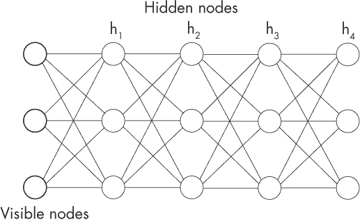
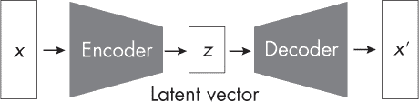
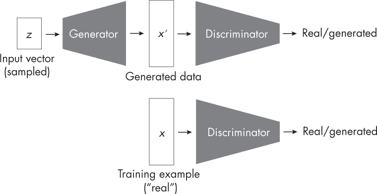
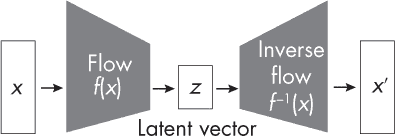
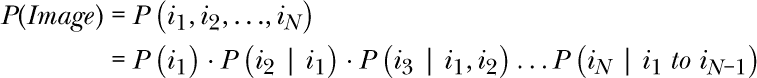
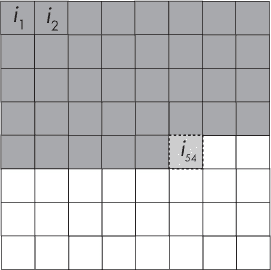
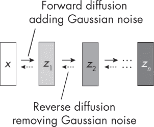
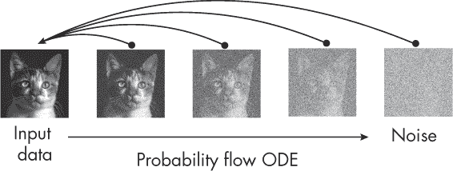

## 第九章：生成式 AI 模型**

深度学习中（也叫*生成 AI*）流行的生成模型分类有哪些，它们各自的缺点是什么？

许多不同类型的深度生成模型已经应用于生成不同类型的媒体：图像、视频、文本和音频。除了这些媒体类型，模型还可以重新用于生成特定领域的数据，例如有机分子和蛋白质结构。本章将首先定义生成建模，然后概述每种类型的生成模型，并讨论其优缺点。

### **生成式与判别式建模**

在传统的机器学习中，有两种主要的建模方法来描述输入数据（*x*）与输出标签（*y*）之间的关系：生成模型和判别模型。*生成模型*旨在捕捉输入数据的潜在概率分布*p*（*x*）或输入与标签之间的联合分布*p*（*x*, *y*）。相比之下，*判别模型*则侧重于建模给定输入的标签的条件分布*p*（*y*|*x*）。

一个经典的例子，突出展示这些方法之间差异的是比较朴素贝叶斯分类器和逻辑回归分类器。这两种分类器都估计类标签的概率*p*（*y*|*x*），并可以用于分类任务。然而，逻辑回归被视为判别模型，因为它直接建模类标签在给定输入特征下的条件概率分布*p*（*y*|*x*），而不对输入和标签的潜在联合分布做任何假设。另一方面，朴素贝叶斯被视为生成模型，因为它建模输入特征*x*和输出标签*y*的联合概率分布*p*（*x*, *y*）。通过学习联合分布，像朴素贝叶斯这样的生成模型捕捉到潜在的数据生成过程，这使得它能够在需要时从该分布中生成新的样本。

### **深度生成模型的类型**

当我们谈论*深度*生成模型或深度生成 AI 时，我们通常会放宽这个定义，将所有能够生成逼真数据（通常是文本、图像、视频和声音）的模型都包括在内。本章的其余部分将简要讨论用于生成此类数据的不同类型的深度生成模型。

#### ***基于能量的模型***

*基于能量的模型（EBM）*是一类生成模型，它学习一个能量函数，为每个数据点分配一个标量值（能量）。较低的能量值对应更可能的数据点。模型的训练目标是最小化真实数据点的能量，同时增加生成数据点的能量。EBM 的例子包括*深度玻尔兹曼机（DBM）*。作为深度学习的早期突破之一，DBM 提供了一种学习数据复杂表示的方式。你可以将它们看作是一种无监督的预训练形式，从而得到可以针对各种任务进行微调的模型。

与朴素贝叶斯和逻辑回归有些相似，深度玻尔兹曼机（DBM）和多层感知器（MLP）可以被视为生成模型和判别模型的对应物，DBM 侧重于捕捉数据生成过程，而 MLP 侧重于建模类之间的决策边界或将输入映射到输出。

DBM 由多个隐藏节点层组成，如图 9-1 所示。正如图所示，除了隐藏层外，通常还有一个可见层对应于可观察的数据。这个可见层作为输入层，将实际数据或特征输入网络。除了使用与 MLP 不同的学习算法（对比散度代替反向传播），DBM 还由二值节点（神经元）组成，而不是连续节点。

*图 9-1：一个四层的深度玻尔兹曼机，包含三堆隐藏节点*

假设我们有兴趣生成图像。DBM 可以学习一个简单图像数据集（如 MNIST）中像素值的联合概率分布。为了生成新图像，DBM 会通过执行一种叫做*吉布斯采样*的过程从这个分布中采样。在这里，DBM 的可见层表示输入图像。为了生成新图像，DBM 首先通过随机值初始化可见层，或者使用现有的图像作为种子。然后，在完成几次吉布斯采样迭代后，最终的可见层状态即为生成的图像。

DBM 作为最早的深度生成模型之一，曾在历史上发挥了重要作用，但现在它们在生成数据方面已不再那么流行。它们训练成本高且更加复杂，并且与接下来几节描述的新模型相比，它们的表达能力较低，这通常导致生成的样本质量较差。

#### ***变分自编码器***

*变分自编码器（VAE）*是建立在变分推理和自编码器架构原理基础上的。*变分推理*是一种通过优化一个更简单、可处理的分布，使其尽可能接近真实分布，从而逼近复杂概率分布的方法。*自编码器*是无监督神经网络，学习将输入数据压缩成低维表示（编码），并随后通过最小化重建误差从压缩的表示中重建原始数据（解码）。

VAE 模型由两个主要子模块组成：编码器网络和解码器网络。编码器网络例如接收输入图像，并通过学习潜在变量的概率分布将其映射到潜在空间。这个分布通常被建模为一个高斯分布，参数（均值和方差）是输入图像的函数。解码器网络则从学习到的潜在分布中采样，并根据该样本重建输入图像。VAE 的目标是学习一个紧凑且富有表现力的潜在表示，既能捕捉输入数据的基本结构，又能通过从潜在空间采样生成新图像。（有关潜在表示的更多细节，请参见第一章）

图 9-2 展示了自编码器的编码器和解码器子模块，其中*x′*表示重建的输入*x*。在标准变分自编码器中，潜在向量是从近似标准高斯分布的分布中采样的。

*图 9-2：自编码器*

训练 VAE 涉及优化模型的参数，以最小化由两个项组成的损失函数：重建损失和 Kullback–Leibler 散度（KL 散度）正则化项。重建损失确保解码后的样本与输入图像高度相似，而 KL 散度项作为一个代理损失，鼓励学习到的潜在分布接近预定义的先验分布（通常是标准高斯分布）。为了生成新图像，我们从潜在空间的先验（标准高斯）分布中采样点，并将其通过解码器网络，生成新的、具有多样性的图像，这些图像看起来类似于训练数据。

VAE 的缺点包括其复杂的损失函数，由不同的项组成，以及其通常较低的表达能力。后者可能导致生成的图像比其他模型（如生成对抗网络）模糊。

#### ***生成对抗网络***

*生成对抗网络（GANs）*是由互相作用的子网络组成的模型，旨在生成与给定输入数据集相似的新数据样本。虽然 GAN 和 VAE 都是通过从学习到的潜在空间进行采样来生成数据的潜变量模型，但它们的架构和学习机制是根本不同的。

GAN（生成对抗网络）由两个神经网络组成，一个生成器和一个判别器，它们以对抗的方式同时进行训练。生成器将来自潜在空间的随机噪声向量作为输入，生成合成数据样本（例如图像）。判别器的任务是区分来自训练数据的真实样本和生成器生成的假样本，如图 9-3 所示。

*图 9-3：生成对抗网络*

GAN 中的生成器在功能上有点类似于 VAE（变分自编码器）的解码器。在推理过程中，GAN 生成器和 VAE 解码器都会从已知分布（例如标准高斯分布）中抽取随机噪声向量，并将其转化为合成数据样本，如图像。

GAN 的一个显著缺点是由于损失函数和学习过程的对抗性，训练过程不稳定。平衡生成器和判别器的学习率可能会非常困难，往往导致振荡、模式崩塌或不收敛。GAN 的第二个主要缺点是生成的输出缺乏多样性，这通常是由于模式崩塌。此时，生成器能够通过一小部分样本成功欺骗判别器，而这些样本仅代表原始训练数据中的一小部分。

#### ***基于流的模型***

*基于流的模型*，也称为*归一化流*，其核心概念受长期以来统计学方法的启发。其主要目标是通过可逆变换将简单的概率分布（如高斯分布）转化为更复杂的分布。

尽管归一化流的概念在统计学领域已经存在很长时间，但早期基于流的深度学习模型，特别是用于图像生成的模型，还是相对较新的发展。其中一个开创性的模型是*非线性独立成分估计（NICE）*方法。NICE 从一个简单的概率分布开始，通常是一些简单的分布，如正态分布。你可以将其视为一种“随机噪声”或没有特定形状或结构的数据。然后，NICE 对这个简单的分布应用一系列变换。每个变换的目的是让数据看起来更像最终的目标（例如，真实世界图像的分布）。这些变换是“可逆的”，意味着我们可以始终将其反转回原始的简单分布。经过几次连续的变换，简单的分布已经转变为一个复杂的分布，这个复杂分布与目标数据（如图像）的分布非常接近。我们现在可以通过从这个复杂的分布中随机选择点来生成看起来像目标数据的新数据。

图 9-4 展示了基于流的模型的概念，该模型将复杂的输入分布映射到更简单的分布，然后再映射回来。

*图 9-4：基于流的模型*

初看起来，这个图示与图 9-2 中的 VAE 图示非常相似。然而，虽然 VAE 使用像卷积神经网络这样的神经网络编码器，基于流的模型使用的是更简单的解耦层，如简单的线性变换。此外，虽然 VAE 中的解码器与编码器是独立的，但基于流的模型中的数据变换函数是数学上可逆的，用来获得输出。

与 VAE 和 GAN 不同，基于流的模型提供精确的似然值，这使我们能够了解生成样本与训练数据分布的拟合程度。例如，这在异常检测或密度估计中可能非常有用。然而，基于流的模型生成图像数据的质量通常低于 GAN。基于流的模型还通常需要比 GAN 或 VAE 更多的内存和计算资源，因为它们必须存储和计算变换的逆。

#### ***自回归模型***

*自回归模型*旨在根据当前（和过去）的值预测下一个值。用于文本生成的 LLM（如 ChatGPT，详见第十七章）是这种模型的一个流行例子。

类似于一次生成一个单词，在图像生成的背景下，自回归模型如 PixelCNN 尝试根据已看到的像素预测一个像素，直到完成所有像素的生成。这样的模型可能会按从左上到右下的顺序（光栅扫描顺序）或任何其他定义的顺序预测像素。

为了说明自回归模型如何逐个像素生成图像，假设我们有一个大小为 *H × W* 的图像（其中 *H* 是高度，*W* 是宽度），为了简化起见，忽略颜色通道。该图像由 *N* 个像素组成，其中 *i* = 1, . . . , *N*。在数据集中观察到特定图像的概率为 *P*(*Image*) = *P*(*i*[1], *i*[2], . . . , *i[N]*)。根据统计学中的链式法则，我们可以将这个联合概率分解为条件概率：

在这里，*P*(*i*[1]) 是第一个像素的概率，*P*(*i*[2]|*i*[1]) 是给定第一个像素的情况下第二个像素的概率，*P*(*i*[3]|*i*[1], *i*[2]) 是给定第一个和第二个像素的情况下第三个像素的概率，以此类推。

在图像生成的背景下，自回归模型本质上是尝试逐个像素地预测，如前所述，给定它迄今为止所看到的像素。图 9-5 说明了这一过程，其中像素 *i*[1], . . . , *i*[53] 代表上下文，像素 *i*[54] 是下一个要生成的像素。

*图 9-5：自回归像素生成*

自回归模型的优势在于，下一像素（或单词）的预测相对直接且易于解释。此外，自回归模型可以精确计算数据的似然度，类似于基于流的模型，这对于异常检测等任务非常有用。此外，自回归模型比 GANs 更容易训练，因为它们不会遇到模式崩塌和其他训练不稳定性等问题。

然而，自回归模型在生成新样本时可能较慢。这是因为它们必须逐步生成数据（例如，逐个像素生成图像），这在计算上可能非常昂贵。自回归模型可能还难以捕捉长程依赖性，因为每个输出仅依赖于之前生成的输出。

就整体图像质量而言，自回归模型通常不如 GANs，但它们更容易训练。

#### ***扩散模型***

如前一节所述，基于流的模型通过应用一系列可逆且可微分的变换（流），将简单分布（如标准正态分布）转化为复杂分布（目标分布）。与基于流的模型类似，*扩散模型*也应用一系列变换。然而，基础概念是根本不同的。

扩散模型通过使用随机微分方程将输入数据分布转化为简单的噪声分布，这一过程是逐步进行的。扩散是一个随机过程，在这个过程中，噪声逐渐添加到数据中，直到它变得像更简单的分布，比如高斯噪声。为了生成新样本，这个过程被逆转，从噪声开始，并逐渐去除噪声。

图 9-6 概述了向输入图像*x*中添加和去除高斯噪声的过程。在推理过程中，反向扩散过程被用来生成新的图像*x*，从一个从高斯分布中采样的噪声张量*z[n]*开始。

*图 9-6：扩散过程*

尽管扩散模型和基于流的模型都是旨在学习复杂数据分布的生成模型，但它们从不同的角度解决这个问题。基于流的模型使用确定性的可逆变换，而扩散模型则使用上述的随机扩散过程。

最近的项目已经在生成高质量的图像方面取得了最先进的表现，图像具有逼真的细节和纹理。与生成对抗网络（GANs）相比，扩散模型的训练也更为简单。然而，扩散模型的缺点是，它们从模型中采样时较慢，因为它们需要执行一系列顺序步骤，这与基于流的模型和自回归模型类似。

#### ***一致性模型***

*一致性模型*训练一个神经网络，将有噪声的图像映射为干净图像。该网络在一个有噪声和干净图像的配对数据集上进行训练，并学习识别噪声改变后的干净图像中的模式。一旦网络训练完成，它就可以用于从有噪声的图像中在一步内生成重建图像。

一致性模型训练采用*常微分方程（ODE）*轨迹，即一个有噪声的图像在逐步去噪过程中所遵循的路径。ODE 轨迹由一组微分方程定义，这些方程描述了图像中的噪声如何随时间变化，正如在图 9-7 中所示。

*图 9-7：一致性模型在图像去噪中的轨迹*

正如图 9-7 所示，我们可以将一致性模型看作是学习从概率流 ODE 中映射任意点的模型，该 ODE 将数据平滑地转化为噪声，再转化回输入。

截至本文写作时，一致性模型是最新的生成性人工智能模型。根据提出此方法的原始论文，一致性模型在图像质量上可与扩散模型相媲美。一致性模型也比扩散模型更快，因为它们不需要迭代过程来生成图像；相反，它们通过单步生成图像。

然而，尽管一致性模型允许更快的推理过程，但它们的训练仍然非常昂贵，因为它们需要大量的有噪声和干净图像的配对数据集。

### **建议**

深度玻尔兹曼机从历史角度来看是很有趣的，因为它们是最早有效展示无监督学习概念的先驱性模型之一。基于流的模型和自回归模型可能在需要精确估计似然时非常有用。然而，在生成高质量图像时，其他模型通常是首选。

特别是，VAEs 和 GANs 多年来一直在竞争生成最佳高保真图像。然而，2022 年，扩散模型几乎完全接管了图像生成。尽管一致性模型是扩散模型的有前景的替代方案，但它是否会被更广泛采用以生成最先进的结果仍有待观察。这里的权衡是，扩散模型的采样通常较慢，因为它涉及一系列必须按顺序运行的去噪步骤，类似于自回归模型。这使得扩散模型在某些需要快速采样的应用中可能不那么实用。

### **练习**

**9-1.** 我们如何评估生成型 AI 模型所生成图像的质量？

**9-2.** 根据本章对一致性模型的描述，我们如何使用它们生成新图像？

### **参考文献**

+   提出了变分自编码器的原始论文：Diederik P. Kingma 和 Max Welling，"自编码变分贝叶斯"（2013），* [`arxiv.org/abs/1312.6114`](https://arxiv.org/abs/1312.6114)*。

+   引入生成对抗网络的论文：Ian J. Goodfellow 等人，"生成对抗网络"（2014），* [`arxiv.org/abs/1406.2661`](https://arxiv.org/abs/1406.2661)*。

+   引入 NICE 的论文：Laurent Dinh、David Krueger 和 Yoshua Bengio，"NICE：非线性独立成分估计"（2014），* [`arxiv.org/abs/1410.8516`](https://arxiv.org/abs/1410.8516)*。

+   提出了自回归 PixelCNN 模型的论文：Aaron van den Oord 等人，"使用 PixelCNN 解码器的条件图像生成"（2016），* [`arxiv.org/abs/1606.05328`](https://arxiv.org/abs/1606.05328)*。

+   引入流行的 Stable Diffusion 潜在扩散模型的论文：Robin Rombach 等人，"使用潜在扩散模型进行高分辨率图像合成"（2021），* [`arxiv.org/abs/2112.10752`](https://arxiv.org/abs/2112.10752)*。

+   Stable Diffusion 的代码实现：* [`github.com/CompVis/stable-diffusion`](https://github.com/CompVis/stable-diffusion)*。

+   最初提出一致性模型的论文：Yang Song 等人，"一致性模型"（2023），* [`arxiv.org/abs/2303.01469`](https://arxiv.org/abs/2303.01469)*。
