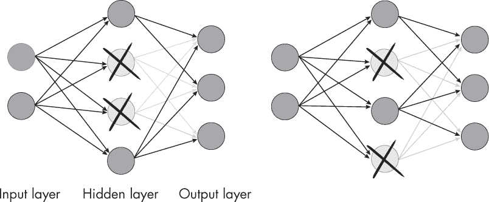
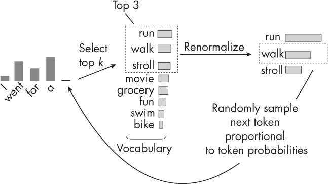
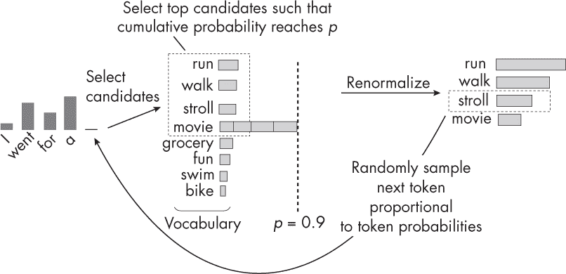

## 第十章：**随机性来源**


在训练深度神经网络时，哪些常见的随机性来源会导致训练和推理过程中行为不可重复？

在训练或使用机器学习模型，如深度神经网络时，多个随机性来源可能导致每次训练或运行这些模型时结果不同，尽管我们使用的是相同的总体设置。这些效果中有些是偶然的，有些是有意为之。接下来的章节将对这些不同的随机性来源进行分类并讨论。

大多数这些类别的可选实践示例可以在*补充/q10-random-sources*子文件夹中找到，网址为*[`github.com/rasbt/MachineLearning-QandAI-book`](https://github.com/rasbt/MachineLearning-QandAI-book)*。

### **模型权重初始化**

所有常见的深度神经网络框架，包括 TensorFlow 和 PyTorch，默认会随机初始化每一层的权重和偏置单元。这意味着每次开始训练时，最终的模型都会不同。当我们使用不同的随机权重启动训练时，训练出的模型会有所不同，其原因是损失函数的非凸性质，正如图 10-1 所示。图中显示，损失函数会根据初始权重的位置收敛到不同的局部最小值。


*图 10-1：不同的初始权重可能导致不同的最终权重。*

实际操作中，因此建议至少多次运行训练（如果计算资源允许）；不幸的初始权重有时会导致模型无法收敛，或者收敛到一个局部最小值，从而导致较差的预测准确度。

然而，通过给随机生成器设置种子，我们可以使随机权重初始化变得确定性。例如，如果我们将种子设置为特定的值（如 123），权重仍然会以小的随机值初始化。尽管如此，神经网络将始终使用相同的小随机权重初始化，从而确保结果的准确重现。

### **数据集抽样和洗牌**

当我们训练和评估机器学习模型时，通常会首先将数据集划分为训练集和测试集。这需要随机抽样，因为我们必须决定将哪些样本放入训练集，哪些放入测试集。

在实际操作中，我们通常使用模型评估技术，如*k*-折交叉验证或保留验证。在保留验证中，我们将训练集分成训练、验证和测试数据集，这些也是受随机性影响的抽样过程。类似地，除非使用固定的随机种子，否则每次划分数据集或调整/评估模型时，都会得到不同的模型，因为训练数据划分会有所不同。

### **非确定性算法**

我们可能根据架构和超参数选择包括随机组件和算法。一个常见的例子就是*dropout*。

Dropout 通过在训练过程中随机将一部分层的单元设置为零，帮助模型学习更加稳健和泛化的表示。这个“丢弃”通常在每次训练迭代中应用，概率为*p*，它是一个控制丢弃单元比例的超参数。*p*的典型值范围是 0.2 到 0.8。

为了说明这一概念，图 10-2 展示了一个小型神经网络，在每次训练的前向传播过程中，dropout 随机丢弃一部分隐藏层节点。



*图 10-2：在 dropout 中，隐藏节点在每次训练的前向传播中间歇性地被随机禁用。*

为了创建可重复的训练过程，我们必须在训练前对使用 dropout 的随机生成器进行初始化（类似于在初始化模型权重之前对随机生成器进行初始化）。在推理过程中，我们需要禁用 dropout 以保证结果的确定性。每个深度学习框架都有一个特定的设置来实现这一目的——一个 PyTorch 示例包含在*supplementary/q10-random-sources*子文件夹中，地址是*[`github.com/rasbt/MachineLearning-QandAI-book`](https://github.com/rasbt/MachineLearning-QandAI-book)*。

### **不同的运行时算法**

算法或方法的最直观或最简单的实现并不总是实践中最好的选择。例如，在训练深度神经网络时，我们常常使用高效的替代方案和近似值，以在训练和推理过程中获得速度和资源优势。

一个常见的例子是卷积神经网络中使用的卷积操作。有几种可能的方式来实现卷积操作：

**经典的直接卷积** 是通过输入和窗口之间的元素级乘积实现离散卷积的常见方法，接着将结果求和得到一个单一的数值。（关于卷积操作的讨论，请参见第十二章）

**基于 FFT 的卷积** 使用快速傅里叶变换（FFT）将卷积转换为频域中的元素级乘法。

**基于 Winograd 的卷积** 是一个高效的算法，适用于小的滤波器尺寸（例如 3×3），可以减少卷积所需的乘法次数。

不同的卷积算法在内存使用、计算复杂度和速度方面有不同的权衡。默认情况下，像 CUDA 深度神经网络库（cuDNN）这样的库，在 PyTorch 和 TensorFlow 中用于在 GPU 上运行深度神经网络时，可以选择不同的算法来执行卷积操作。然而，必须显式启用确定性算法选择。例如，在 PyTorch 中，可以通过设置来实现。

```
torch.use_deterministic_algorithms(True)
```

尽管这些近似结果相似，但在训练过程中，细微的数值差异可能会累积，导致训练收敛到稍微不同的局部最小值。

### **硬件与驱动程序**

在不同硬件上训练深度神经网络可能会产生不同的结果，尽管使用的是相同的算法且执行相同的操作，这些差异通常是由于浮点操作中的数值精度不同。然而，即使在相同精度下，硬件和软件的优化也可能导致小的数值差异。

例如，不同的硬件平台可能具有专门的优化或库，这些优化或库可能会稍微改变深度学习算法的行为。为了说明不同的 GPU 可能会产生不同的建模结果，以下是来自 NVIDIA 官方文档的引用：“在不同的架构之间，没有 cuDNN 例程能保证逐位重现性。例如，当比较在 NVIDIA Volta^(TM)和 NVIDIA Turing^(TM) [. . .]以及 NVIDIA Ampere 架构上运行的相同例程时，并不保证逐位重现性。”

### **随机性与生成式 AI**

除了之前提到的各种随机性来源之外，某些模型在推理过程中可能会表现出随机行为，我们可以将其视为“设计上的随机性”。例如，生成式图像和语言模型可能会为相同的提示生成不同的结果，从而产生多样的样本结果。对于图像模型，这通常是为了让用户选择最准确和最具美感的图像。对于语言模型，这通常是为了变化回答，例如，在聊天代理中，避免重复。

生成式图像模型在推理过程中预期的随机性通常是由于在反向过程的每一步采样不同的噪声值。在扩散模型中，噪声调度定义了在每一步扩散过程中添加的噪声方差。

自回归的语言模型（如 GPT）倾向于为相同的输入提示生成不同的输出（GPT 将在第十四章和第十七章中详细讨论）。ChatGPT 用户界面甚至有一个“重新生成回答”按钮来实现这一功能。模型能够生成不同结果的原因在于它们使用的采样策略。像 top-*k*采样、核采样和温度缩放等技术通过控制随机性程度来影响模型的输出。这是一个特性，而不是一个缺陷，因为它允许生成多样的回答，并防止模型产生过于确定性或重复的输出。（有关生成式 AI 和深度学习模型的更深入概述，请参见第九章；关于自回归语言模型的更多细节，请参见第十七章）。

如图 10-3 所示，*Top-*k *采样*通过在每一步生成下一个词时，从最有可能的前 *k* 个候选词中进行抽样来工作。



*图 10-3: Top-*k *采样*

给定一个输入提示，语言模型会对下一个词的整个词汇表（候选词）生成一个概率分布。每个词汇表中的词根据模型对上下文的理解被分配一个概率。然后，选出的前 *k* 个词会重新归一化，使它们的概率总和为 1。最后，从重新归一化后的 top-*k* 概率分布中抽取一个词，并将其附加到输入提示中。这个过程会重复进行，直到生成文本的长度达到预期，或者满足停止条件。

*核采样*（也叫做 *top-*p *采样*），如图 10-4 所示，是 top-*k* 采样的一个替代方法。



*图 10-4: 核采样*

与 top-*k* 采样类似，核采样的目标是在输出中平衡多样性和一致性。然而，核采样和 top-*k* 采样在每一步生成过程中选择候选词的方式上有所不同。Top-*k* 采样从语言模型生成的概率分布中选择 *k* 个最有可能的词，而不考虑它们的具体概率值。*k* 的值在整个生成过程中保持不变。另一方面，核采样是根据一个概率阈值 *p* 来选择词，如图 10-4 所示。它会按降序累积最有可能的词，直到它们的累积概率达到或超过阈值 *p*。与 top-*k* 采样不同，候选集（核）在每一步可能会有所变化。

### **练习**

**10-1.** 假设我们用 top-*k* 或核采样训练一个神经网络，其中 *k* 和 *p* 是超参数选择。我们是否可以在推理过程中使模型表现得像确定性一样，而不修改代码？

**10-2.** 在什么情况下，推理过程中的随机 dropout 行为是需要的？

### **参考文献**

+   关于不同的数据采样和模型评估技术，请参见我的文章：“机器学习中的模型评估、模型选择和算法选择”（2018），*[`arxiv.org/abs/1811.12808`](https://arxiv.org/abs/1811.12808)*。

+   最初提出 dropout 技术的论文：Nitish Srivastava 等人，"Dropout: A Simple Way to Prevent Neural Networks from Overfitting"（2014），*[`jmlr.org/papers/v15/srivastava14a.html`](https://jmlr.org/papers/v15/srivastava14a.html)*。

+   关于基于 FFT 卷积的详细论文：Lu Chi、Borui Jiang 和 Yadong Mu，“Fast Fourier Convolution”（2020），*[`dl.acm.org/doi/abs/10.5555/3495724.3496100`](https://dl.acm.org/doi/abs/10.5555/3495724.3496100)*。

+   基于 Winograd 的卷积详细信息：Syed Asad Alam 等人，《Winograd 卷积在深度神经网络中的应用：高效的点选择》（2022），*[`arxiv.org/abs/2201.10369`](https://arxiv.org/abs/2201.10369)*。

+   有关 Py-Torch 中确定性算法设置的更多信息：*[`pytorch.org/docs/stable/generated/torch.use_deterministic_algorithms.html`](https://pytorch.org/docs/stable/generated/torch.use_deterministic_algorithms.html)*。

+   有关 NVIDIA 显卡的确定性行为的详细信息，请参见 NVIDIA 官方文档中的“可复现性”部分：*[`docs.nvidia.com/deeplearning/cudnn/developer-guide/index.html#reproducibility`](https://docs.nvidia.com/deeplearning/cudnn/developer-guide/index.html#reproducibility)*。
