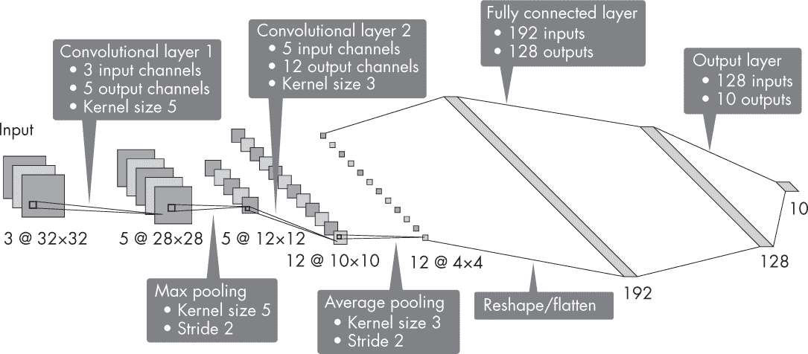
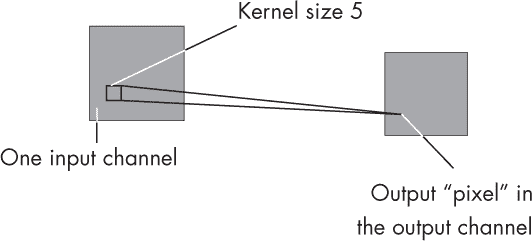
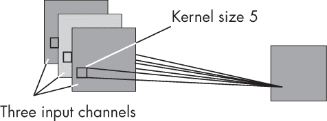
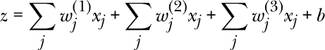
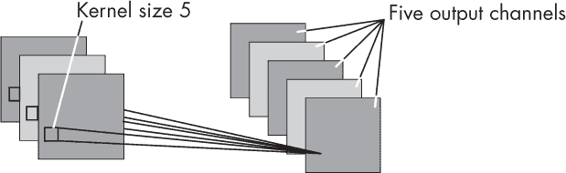
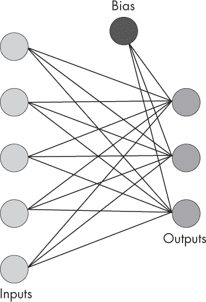

## 第十一章：**计算参数数量**

我们如何计算卷积神经网络中的参数数量，这些信息为什么有用？

了解模型中的参数数量有助于评估模型的大小，这直接影响存储和内存需求。接下来的部分将解释如何计算卷积层和全连接层的参数数量。

### **如何查找参数数量**

假设我们正在处理一个卷积网络，该网络有两个卷积层，分别具有 5 和 3 的卷积核大小。第一个卷积层有 3 个输入通道和 5 个输出通道，第二个卷积层有 5 个输入通道和 12 个输出通道。这些卷积层的步长为 1。此外，网络有两个池化层，一个池化层的卷积核大小为 3，步长为 2，另一个池化层的卷积核大小为 5，步长为 2。它还具有两个全连接隐藏层，每个隐藏层分别有 192 和 128 个隐藏单元，输出层是用于 10 类分类的分类层。该网络的架构如 图 11-1 所示。

*图 11-1：具有两个卷积层和两个全连接层的卷积神经网络*

这个卷积网络中的可训练参数数量是多少？我们可以从左到右处理这个问题，逐层计算每个层的参数数量，然后将这些数量相加以获得总的参数数量。每一层的可训练参数由权重和偏置单元组成。

#### ***卷积层***

在卷积层中，权重的数量取决于卷积核的宽度和高度，以及输入和输出通道的数量。偏置单元的数量仅取决于输出通道的数量。为了逐步演示计算，假设我们有一个宽度和高度为 5 的卷积核，一个输入通道和一个输出通道，如 图 11-2 所示。

*图 11-2：具有一个输入通道和一个输出通道的卷积层*

在这种情况下，我们有 26 个参数，因为我们通过卷积核得到 5 *×* 5 = 25 个权重，加上偏置单元。计算输出值或像素 *z* 的公式为 *z* = *b* + *∑[j] w[j] x[j]*，其中 *x[j]* 代表输入像素，*w[j]* 代表卷积核的权重参数，*b* 是偏置单元。

现在，假设我们有三个输入通道，如 图 11-3 所示。

*图 11-3：具有三个输入通道和一个输出通道的卷积层*

在这种情况下，我们通过对每个输入通道执行上述操作 *∑[j] w[j] x[j]* 来计算输出值，然后加上偏置单元。对于三个输入通道，这将涉及三个不同的卷积核，每个卷积核有一组权重：

由于我们有三组权重（*w*^((1))、*w*^((2)) 和 *w*^((3))，对于 *j* = [1, . . . , 25]），因此在该卷积层中有 3 *×* 25 + 1 = 76 个参数。

我们为每个输出通道使用一个卷积核，其中每个卷积核是专门针对特定输出通道的。因此，如果我们将输出通道的数量从一个扩展到五个，如图 11-4 所示，参数数量将增加五倍。换句话说，如果一个输出通道的卷积核有 76 个参数，那么需要为五个输出通道准备的五个卷积核将有 5 *×* 76 = 380 个参数。

*图 11-4：具有三个输入通道和五个输出通道的卷积层*

回到本节开始时展示的图 11-1 中的神经网络架构，我们基于卷积核的大小以及输入和输出通道的数量来计算卷积层中的参数。例如，第一个卷积层有三个输入通道、五个输出通道和一个大小为 5 的卷积核。因此，它的参数数量为 5 *×* (5 *×* 5 *×* 3) + 5 = 380。第二个卷积层有五个输入通道、12 个输出通道和一个大小为 3 的卷积核，其参数数量为 12 *×* (3 *×* 3 *×* 5) + 12 = 552。由于池化层没有可训练的参数，我们可以将卷积部分的参数数目计算为 380 + 552 = 932。

接下来，让我们看看如何计算全连接层的参数数量。

#### ***全连接层***

计算全连接层的参数数量相对简单。每个全连接节点将每个输入节点与每个输出节点连接，因此权重的数量是输入数量乘以输出数量，再加上添加到输出的偏置单元。例如，如果我们有一个具有五个输入和三个输出的全连接层，如图 11-5 所示，那么我们有 5 *×* 3 = 15 个权重和三个偏置单元，也就是总共 18 个参数。

*图 11-5：具有五个输入和三个输出的全连接层*

再次回到在图 11-1 中展示的神经网络架构，我们现在可以计算全连接层中的参数，如下所示：在第一个全连接层中，192 *×* 128 + 128 = 24,704，在第二个全连接层（输出层）中，128 *×* 10 + 10 = 1,290。因此，这个网络全连接部分的总参数为 24,704 + 1,290 = 25,994。将卷积层的 932 个参数与全连接层的 25,994 个参数相加，我们可以得出该网络的总参数数为 26,926。

作为额外的内容，感兴趣的读者可以在*[`github.com/rasbt/MachineLearning-QandAI-book`](https://github.com/rasbt/MachineLearning-QandAI-book)*的*supplementary/q11-conv-size*子文件夹中找到用于程序计算参数数量的 PyTorch 代码。

### **实际应用**

为什么我们关心参数的数量呢？首先，我们可以使用这个数字来估算模型的复杂度。作为经验法则，参数越多，我们就需要更多的训练数据来有效训练模型。

参数的数量还可以让我们估算神经网络的大小，进而帮助我们判断网络是否可以适配到 GPU 内存中。尽管在训练过程中，由于进行矩阵乘法和存储梯度所需的额外内存，内存需求通常会超过模型大小，但模型大小仍然可以帮助我们大致判断在给定硬件配置下训练该模型是否可行。

### **练习**

**11-1.** 假设我们想使用普通的随机梯度下降（SGD）优化器或流行的 Adam 优化器来优化神经网络。那么，SGD 和 Adam 分别需要存储多少参数？

**11-2.** 假设我们添加了三个批量归一化（BatchNorm）层：一个在第一个卷积层后，一个在第二个卷积层后，还有一个在第一个全连接层后（通常我们不希望在输出层添加 BatchNorm 层）。这三个 BatchNorm 层将会给模型增加多少额外的参数？
