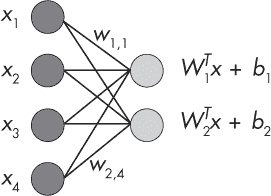
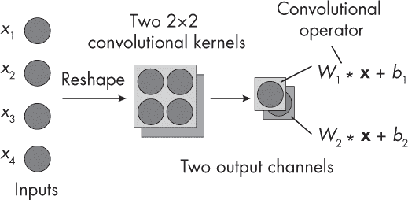
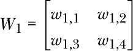
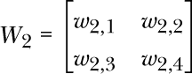
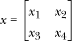
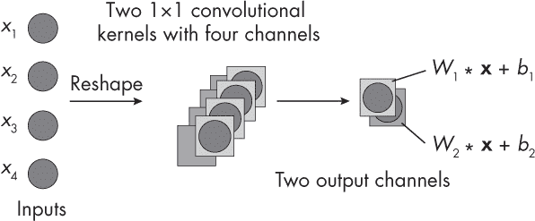
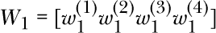
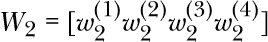

## 第十二章：**完全连接层和卷积层**

在什么情况下，我们可以用卷积层替代完全连接层，以执行相同的计算？

用卷积层替代完全连接层，可以在硬件优化方面提供优势，比如利用专门的硬件加速器来加速卷积操作。这对于边缘设备尤其相关。

有两种情况，完全连接层和卷积层是等价的：当卷积滤波器的大小等于感受野的大小时，以及当卷积滤波器的大小为 1 时。为了说明这两种情况，考虑一个具有两个输入和四个输出单元的完全连接层，如图 12-1 所示。

*图 12-1：通过八个权重参数连接的四个输入和两个输出*

该图中的完全连接层由八个权重和两个偏置单元组成。我们可以通过以下点积计算输出节点：

**节点 1** *w*[1,1] *× x*[1] + *w*[1,2] *× x*[2] + *w*[1,3] *× x*[3] + *w*[1,4] *× x*[4] + *b*[1]

**节点 2** *w*[2,1] *× x*[1] + *w*[2,2] *× x*[2] + *w*[2,3] *× x*[3] + *w*[2,4] *× x*[4] + *b*[2]

以下两节展示了卷积层可以定义的情况，这些情况能够产生与完全连接层描述的相同的计算。

### **当卷积核和输入大小相等时**

让我们从第一个情况开始，其中卷积滤波器的大小等于感受野的大小。回想一下在第十一章中，我们是如何计算具有一个输入通道和多个输出通道的卷积核中的参数数量的。我们有一个大小为 2*×*2 的卷积核，一个输入通道和两个输出通道。输入大小也是 2*×*2，这是图 12-2 中四个输入的重塑版本。

*图 12-2：一个 2×2 的卷积层，其卷积核等于输入大小，并具有两个输出通道*

如果卷积核的维度等于输入大小，如图 12-2 所示，则卷积层中没有滑动窗口机制。对于第一个输出通道，我们有以下一组权重：

对于第二个输出通道，我们有以下一组权重：

如果输入被组织为

我们计算第一个输出通道为 *o*[1] = *∑i*(*W*[1] ***x**)*[i]* + *b*[1]，其中卷积运算符 * 等于逐元素相乘。换句话说，我们在两个矩阵 *W*[1] 和 **x** 之间执行逐元素相乘，然后将这些元素的和作为输出；这等价于完全连接层中的点积。最后，我们加上偏置单元。第二个输出通道的计算方法类似：*o*[2] = *∑i*(*W*[2] * **x**)*[i]* + *b*[2]。

作为奖励，本书的补充材料包括 PyTorch 代码，展示了这个等效性，并且可以在 *[`github.com/rasbt/MachineLearning-QandAI-book`](https://github.com/rasbt/MachineLearning-QandAI-book)* 的 *supplementary/q12-fc-cnn-equivalence* 子文件夹中找到一个动手实践示例。

### **当卷积核大小为 1 时**

第二种情况假设我们将输入重塑为一个“图像”，其尺寸为 1*×*1，其中“颜色通道”的数量等于输入特征的数量，如图 12-3 所示。

*图 12-3：当卷积核大小等于输入大小时，输出节点的数量等于通道的数量。*

每个卷积核由一个与输入通道数相等的权重堆叠组成。例如，对于第一个输出层，权重为

同时，第二个通道的权重为：

为了更好地直观理解这个计算过程，请查阅第十一章中的插图，图中描述了如何计算卷积层中的参数。

### **建议**

尽管完全连接层可以作为等效的卷积层来实现，但在标准计算机上这并不会带来即时的性能或其他优势。然而，将完全连接层替换为卷积层，结合为卷积运算开发的专用硬件加速器，可能会带来优势。

此外，理解完全连接层与卷积层等效的场景有助于理解这些层的机制。它还使我们能够在不使用完全连接层的情况下实现卷积神经网络（如果需要的话），从而简化代码实现。

### **习题**

**12-1.** 增加步幅会如何影响本章讨论的等效性？

**12-2.** 填充是否会影响完全连接层与卷积层之间的等效性？
