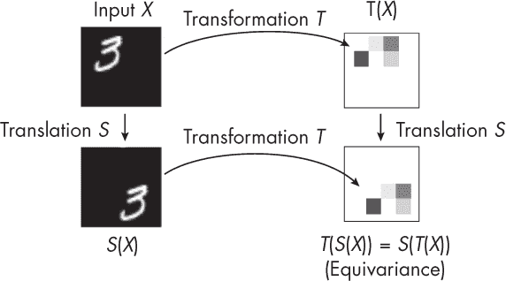
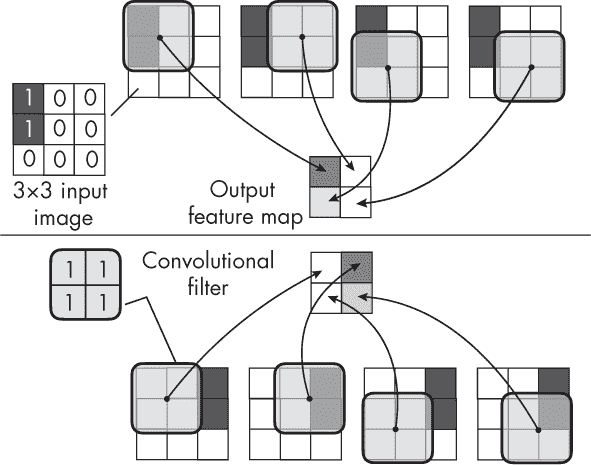
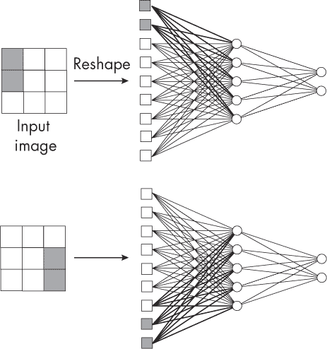
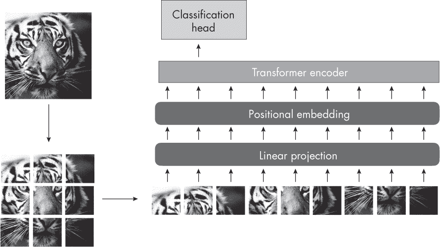

## 第十三章：**视觉变换器的大型训练集**

为什么视觉变换器（ViTs）通常需要比卷积神经网络（CNNs）更大的训练集？

每个机器学习算法和模型在其设计中都编码了一组特定的假设或先验知识，通常称为*归纳偏差*。有些归纳偏差是为了使算法在计算上更可行，其他归纳偏差则基于领域知识，还有一些归纳偏差同时包含两者。

CNNs 和 ViTs 可以用于相同的任务，包括图像分类、目标检测和图像分割。CNNs 主要由卷积层组成，而 ViTs 主要由多头注意力块构成（在第八章中讨论了针对自然语言输入的变换器）。

CNNs 具有更多硬编码的归纳偏差，这些偏差是算法设计的一部分，因此它们通常比 ViTs 需要更少的训练数据。从某种意义上说，ViTs 被赋予了更多的自由度，可以或必须从数据中学习某些归纳偏差（假设这些偏差有助于优化训练目标）。然而，一切需要学习的内容都需要更多的训练样本。

以下章节将解释在 CNNs 中遇到的主要归纳偏差，并说明视觉变换器（ViTs）如何在没有这些偏差的情况下仍能良好工作。

### **CNN 中的归纳偏差**

以下是主要的归纳偏差，它们在很大程度上定义了卷积神经网络（CNNs）的工作方式：

**局部连接** 在 CNNs 中，每个隐藏层中的单元只与前一层中的一部分神经元相连。我们可以通过假设相邻像素比远距离像素更相关来合理化这一限制。作为一个直观的例子，考虑一下这种假设如何应用于图像中识别边缘或轮廓的场景。

**权重共享** 通过卷积层，我们在整个图像中使用相同的小组权重（即卷积核或滤波器）。这反映了这样一个假设：相同的滤波器在图像的不同部分用于检测相同的模式。

**层次处理** CNNs 由多个卷积层组成，用于从输入图像中提取特征。随着网络从输入层到输出层的推进，低级特征依次结合形成越来越复杂的特征，最终导致对更复杂物体和形状的识别。此外，这些层中的卷积滤波器学习在不同的抽象层次上检测特定的模式和特征。

**空间不变性** CNNs 表现出空间不变性的数学特性，这意味着即使输入信号在空间域内被移动到不同位置，模型的输出仍然保持一致。这一特性源于局部连接、权重共享和先前提到的层次结构的结合。

CNN 中的局部连接性、权重共享和层次处理的结合导致了空间不变性，使得模型能够识别图像中无论其位置如何的相同模式或特征。

*平移不变性*是空间不变性的一个特例，其中输出在输入信号在空间域内发生平移或移位后保持不变。在这种情况下，重点仅在于将对象移动到图像中的不同位置，而不涉及其其他属性的旋转或变化。

实际上，卷积层和网络并不是真正的平移不变；它们实现的是某种程度的平移等变性。那么，平移不变性和平移等变性有什么区别呢？*平移不变性*意味着输出在输入平移时不会改变，而*平移等变性*则意味着输出会以相应的方式随着输入的平移而改变。换句话说，如果我们将输入对象向右平移，结果也会相应地向右平移，如图 13-1 所示。

*图 13-1：不同图像平移下的等变性*

如图 13-1 所示，在平移不变性的情况下，无论我们以何种顺序应用操作（先变换后平移，或先平移后变换），都能得到相同的输出模式。

如前所述，CNN 通过其局部连接性、权重共享和层次处理属性的结合实现了平移等变性。图 13-2 描绘了一个卷积操作，以说明局部连接性和权重共享的先验。这张图展示了 CNN 中平移等变性的概念，其中卷积滤波器捕捉输入信号（两个深色块），无论它位于输入的哪个位置。

*图 13-2：卷积滤波器和平移等变性*

图 13-2 显示了一个 3*×*3 的输入图像，该图像由左上角（图像上部分）或右上角（图像下部分）两个非零像素值组成。如果我们对这两种输入图像情况应用一个 2*×*2 的卷积滤波器，可以看到输出特征图包含相同的提取模式，这个模式分别位于左侧（图像上方）或右侧（图像下方），从而展示了卷积操作的平移等变性。

为了做对比，像多层感知机这样的全连接网络缺乏空间不变性或等变性。为了说明这一点，设想一个具有一个隐藏层的多层感知机。输入图像中的每个像素都与输出中的每个值连接。如果我们将输入图像平移一个或多个像素，将会激活一组不同的权重，如图 13-3 所示。

*图 13-3：全连接层中的位置特定权重*

和全连接网络一样，ViT 架构（以及一般的 transformer 架构）缺乏空间不变性或等变性的归纳偏置。例如，如果我们将相同的物体放置在图像中的两个不同位置，模型会产生不同的输出。这并不理想，因为物体的语义意义（物体所代表或传达的概念）在其位置变化时应该保持不变。因此，模型必须直接从数据中学习这些不变性。为了便于学习 CNN 中有用的模式，需要在更大的数据集上进行预训练。

在 ViT 中，常见的添加位置信息的变通方法是使用相对位置嵌入（也称为*相对位置编码*），它考虑输入序列中两个标记之间的相对距离。然而，尽管相对嵌入编码了有助于 transformer 跟踪标记相对位置的信息，transformer 仍然需要从数据中学习空间信息是否以及如何与当前任务相关。

### **ViT 可以超越 CNN**

通过前面章节中讨论的归纳偏置所做的硬编码假设，相较于全连接层，显著减少了 CNN 中的参数数量。另一方面，ViT 通常比 CNN 具有更多的参数，因此需要更多的训练数据。（有关如何精确计算全连接层和卷积层中参数数量的内容，请参考第十一章。）

与流行的 CNN 架构相比，ViT 在没有广泛预训练的情况下可能表现不佳，但在足够大的预训练数据集下，它们的表现可以非常好。与语言 transformer 不同，后者通常使用无监督预训练（如第二章中讨论的自监督学习），视觉 transformer 通常使用像 ImageNet 这样的标签数据集进行预训练，ImageNet 提供了数百万张带标签的图像用于训练，并进行常规的监督学习。

一个 ViTs 超越 CNN 预测性能的例子，可以从 ViT 架构的初步研究中看到，如论文《一张图像值 16x16 个词：用于大规模图像识别的变换器》中所示。该研究比较了卷积网络的一种类型 ResNet 与原始 ViT 设计，在不同数据集规模下进行预训练。研究结果还表明，ViT 模型只有在预训练了至少 1 亿张图像后，才能在预测性能上超越卷积方法。

### **ViTs 中的归纳偏差**

ViTs 也具有一些归纳偏差。例如，视觉变换器*将输入图像切分*，以便分别处理每个输入补丁。在这里，每个补丁可以关注所有其他补丁，从而使模型学习到输入图像中相距较远的补丁之间的关系，如图 13-4 所示。

*图 13-4：视觉变换器如何处理图像补丁*

切分补丁的归纳偏差使得 ViTs 能够扩展到更大的图像尺寸，而无需增加模型中的参数数量，这样可以减少计算开销。通过分别处理较小的补丁，ViTs 能够有效捕捉图像区域之间的空间关系，同时从自注意力机制捕捉的全局上下文中获益。

这引出了另一个问题：ViTs 从训练数据中学习到什么，如何学习？ViTs 在所有层中学习到更均匀的特征表示，自注意力机制使得全局信息能够更早地汇聚。此外，ViTs 中的残差连接强烈地将特征从较低层传播到较高层，这与 CNN 的层次结构不同。

ViTs 往往更关注全局而非局部关系，因为它们的自注意力机制使模型能够考虑输入图像不同部分之间的远距离依赖关系。因此，ViTs 中的自注意力层通常被认为是低通滤波器，更关注形状和曲率。

相比之下，CNN 中的卷积层通常被认为是高通滤波器，更注重纹理。然而，请记住，卷积层可以充当高通和低通滤波器，这取决于每层学习到的滤波器。高通滤波器检测图像的边缘、细节和纹理，而低通滤波器则捕捉更多全局的、平滑的特征和形状。CNN 通过应用不同大小的卷积核，并在每一层学习不同的滤波器来实现这一点。

### **建议**

如果有足够的数据进行预训练，ViTs 最近已经开始超越 CNN。然而，这并不意味着 CNN 会被淘汰，因为像流行的 EfficientNetV2 CNN 架构这样的技术更不那么依赖于内存和数据。

此外，最近的 ViT 架构不仅仅依赖于大数据集、参数数量和自注意力。相反，它们从卷积神经网络（CNN）中汲取灵感，增加了软卷积归纳偏置，甚至加入了完整的卷积层，从而获得两者的优势。

简而言之，没有卷积层的视觉变换器架构通常比卷积神经网络具有更少的空间和局部归纳偏置。因此，视觉变换器需要学习与数据相关的概念，例如像素之间的局部关系。因此，视觉变换器需要更多的训练数据才能达到良好的预测性能，并在生成建模场景中产生可接受的视觉表示。

### **练习**

**13-1.** 请考虑图 13-4 中显示的输入图像的块化。生成的块的大小控制了计算和预测性能之间的权衡。最佳的块大小取决于应用程序以及计算成本和模型性能之间的期望权衡。较小的块通常会导致更高还是更低的计算成本？

**13-2.** 接着上一问题，较小的块通常会导致更高还是更低的预测准确度？

### **参考文献**

+   提出原始视觉变换器模型的论文：Alexey Dosovitskiy 等人，“一张图片值 16x16 个词：用于大规模图像识别的变换器”（2020），*[`arxiv.org/abs/2010.11929`](https://arxiv.org/abs/2010.11929)*。

+   添加位置编码信息的一个解决方法是使用相对位置嵌入：Peter Shaw、Jakob Uszkoreit 和 Ashish Vaswani，“带有相对位置表示的自注意力”（2018），*[`arxiv.org/abs/1803.02155`](https://arxiv.org/abs/1803.02155)*。

+   ViT 中的残差连接强烈地将特征从低层传播到高层，这与 CNN 更加分层的结构形成对比：Maithra Raghu 等人，“视觉变换器是否像卷积神经网络一样看待问题？”（2021），*[`arxiv.org/abs/2108.08810`](https://arxiv.org/abs/2108.08810)*。

+   详细介绍 EfficientNetV2 CNN 架构的研究文章：Mingxing Tan 和 Quoc V. Le，“EfficientNetV2：更小的模型和更快的训练”（2021），*[`arxiv.org/abs/2104.00298`](https://arxiv.org/abs/2104.00298)*。

+   一种也包含卷积层的 ViT 架构：Stéphane d’Ascoli 等人，“ConViT：通过软卷积归纳偏置改进视觉变换器”（2021），*[`arxiv.org/abs/2103.10697`](https://arxiv.org/abs/2103.10697)*。

+   另一种使用卷积层的 ViT 示例：Haiping Wu 等人，“CvT：向视觉变换器引入卷积”（2021），*[`arxiv.org/abs/2103.15808`](https://arxiv.org/abs/2103.15808)*。
