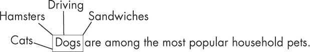
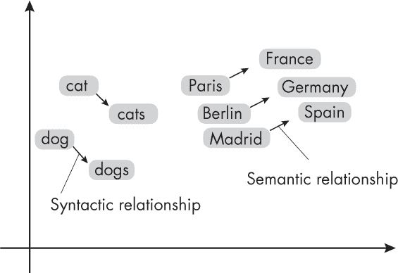
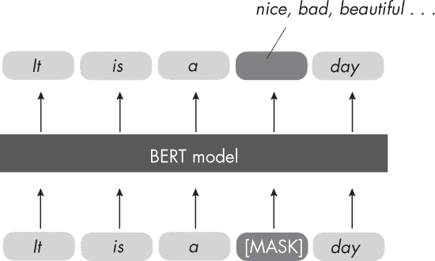
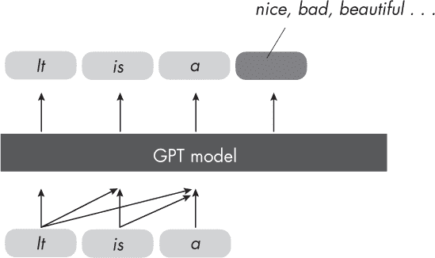

## 第十四章：**分布假设**

什么是自然语言处理（NLP）中的分布假设？它在哪里使用，它的适用范围有多广？

分布假设是一种语言学理论，建议在相同语境中出现的单词往往具有相似的含义，这一观点来源于 Zellig S. Harris 的原始著作《Distributional Structure》。简而言之，两个单词的含义越相似，它们出现在相似语境中的频率就越高。

以图 14-1 中的句子为例。*cats* 和 *dogs* 经常出现在相似的语境中，我们可以将 *cats* 替换为 *dogs*，而不至于使句子听起来别扭。我们也可以将 *cats* 替换为 *hamsters*，因为它们都是哺乳动物和宠物，句子仍然听起来合理。然而，如果将 *cats* 替换为一个不相关的词如 *sandwiches*，句子就会明显错误，而将 *cats* 替换为不相关的词 *driving* 也会使句子语法上不正确。

*图 14-1：在给定语境中的常见词和不常见词*

使用多义词很容易构造反例，即具有多重含义的词，这些含义相关但不完全相同。例如，考虑单词 *bank*。作为名词，它可以指代金融机构、"河岸的升高地带"、"山坡的陡峭倾斜" 或 "保护性衬垫边缘"（根据 Merriam-Webster 字典）。它甚至可以作为动词使用：to bank on something 意味着依赖或依靠某事。这些不同的含义有不同的分布特征，并不总是在相似的语境中出现。

尽管如此，分布假设仍然非常有用。像 Word2vec 这样的词嵌入（在第一章中介绍）以及许多大型语言变换模型都依赖于这一思想。这包括 BERT 中的掩码语言模型和 GPT 中用于预训练的下一个词任务。

### **Word2vec、BERT 和 GPT**

Word2vec 方法使用一个简单的、两层的神经网络将单词编码成嵌入向量，使得相似单词的嵌入向量在语义和句法上都接近。训练 Word2vec 模型有两种方式：连续词袋模型（CBOW）和跳字模型（skip-gram）。在使用 CBOW 时，Word2vec 模型通过使用周围的上下文单词来预测当前单词。相反，在跳字模型中，Word2vec 根据一个选定的单词预测上下文单词。虽然跳字模型对不常见单词更有效，但 CBOW 通常训练速度较快。

经过训练后，词嵌入被置于向量空间中，使得在语料库中具有共同上下文的词——即在语义和句法上相似的词——被定位得彼此接近，如图 14-2 所示。相反，不相似的词则被定位得相距较远。

*图 14-2：Word2vec 在二维向量空间中的嵌入*

BERT 是一种基于 Transformer 架构的 LLM（详见第八章），它采用掩蔽语言模型方法，涉及掩蔽（隐藏）句子中的一些词。它的任务是根据序列中的其他词预测这些被掩蔽的词，如图 14-3 所示。这是一种自监督学习的形式，用于预训练 LLM（有关自监督学习的更多内容，请参见第二章）。预训练模型生成的词嵌入中，相似的词（或标记）在嵌入空间中较为接近。

*图 14-3：BERT 的预训练任务涉及预测随机掩蔽的词。*

GPT 和 BERT 一样，也是基于 Transformer 架构的 LLM，它作为一个解码器工作。像 GPT 这样的解码器模型学习根据前面的词预测序列中的后续词，如图 14-4 所示。与 BERT 这种编码器模型不同，GPT 更侧重于预测后续内容，而不是同时编码整个序列。

*图 14-4：GPT 通过预测下一个词进行预训练。*

BERT 是一个双向语言模型，考虑整个输入序列，而 GPT 只严格解析前面的序列元素。这意味着 BERT 通常更适合分类任务，而 GPT 更适合文本生成任务。与 BERT 类似，GPT 生成的高质量上下文化词嵌入能够捕捉语义相似性。

### **假设是否成立？**

对于大型数据集，分布假设或多或少成立，这使得它在理解和建模语言模式、词关系和语义意义方面非常有用。例如，这一概念使得词嵌入和语义分析等技术成为可能，从而促进了自然语言处理任务，如文本分类、情感分析和机器翻译。

总之，尽管在某些反例中分布假设并不成立，但它仍是一个非常有用的概念，构成了现代语言 Transformer 模型的基石。

### **练习**

**14-1.** 在同音异义词的情况下，分布假设是否成立？比如像*there*和*their*这样的词，它们发音相同但含义不同。

**14-2.** 你能想到另一个类似于分布假设的领域吗？（提示：考虑神经网络的其他输入模式。）

### **参考文献**

+   描述分布假设的原始文献：Zellig S. Harris，“分布结构”（1954），*[`doi.org/10.1080/00437956.1954.11659520`](https://doi.org/10.1080/00437956.1954.11659520)*。

+   介绍 Word2vec 模型的论文：Tomas Mikolov 等人，“在向量空间中高效估计词表示”（2013），*[`arxiv.org/abs/1301.3781`](https://arxiv.org/abs/1301.3781)*。

+   介绍 BERT 模型的论文：Jacob Devlin 等人，“BERT：用于语言理解的深度双向变换器预训练”（2018），*[`arxiv.org/abs/1810.04805`](https://arxiv.org/abs/1810.04805)*。

+   介绍 GPT 模型的论文：Alec Radford 和 Karthik Narasimhan，“通过生成预训练提高语言理解”（2018），*[`www.semanticscholar.org/paper/Improving-Language-Understanding-by-Generative-Radford-Narasimhan/cd18800a0fe0b668a1cc19f2ec95b5003d0a5035`](https://www.semanticscholar.org/paper/Improving-Language-Understanding-by-Generative-Radford-Narasimhan/cd18800a0fe0b668a1cc19f2ec95b5003d0a5035)*。

+   BERT 生成的嵌入表示中，相似的词（或符号）在嵌入空间中靠得很近：Nelson F. Liu 等人，“上下文表示的语言知识与可迁移性”（2019），*[`arxiv.org/abs/1903.08855`](https://arxiv.org/abs/1903.08855)*。

+   证明 GPT 生成高质量上下文化词嵌入，能够捕捉语义相似性的论文：Fabio Petroni 等人，“语言模型作为知识库？”（2019），*[`arxiv.org/abs/1909.01066`](https://arxiv.org/abs/1909.01066)*。
