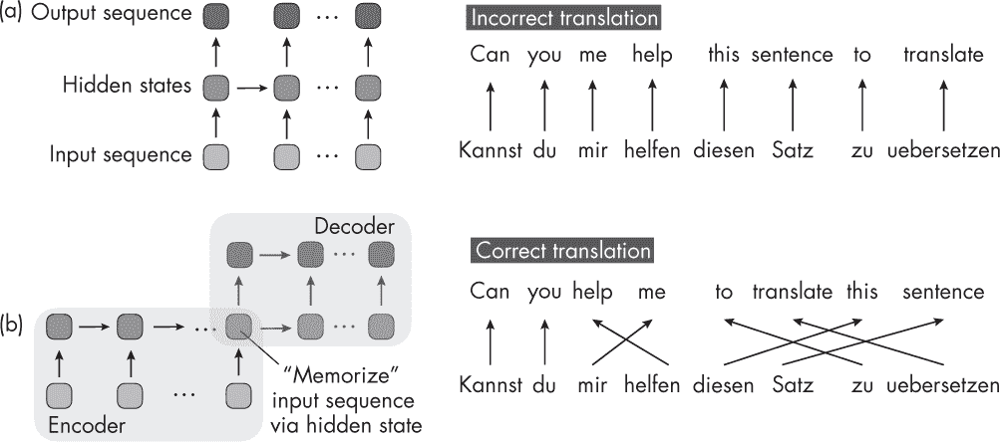
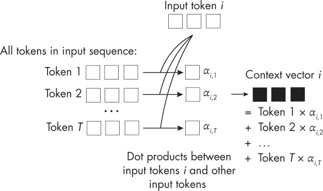

## 第十六章：自注意力**

自注意力的名称来源于哪里，它与以前开发的注意力机制有何不同？

*自注意力*使神经网络能够在关注某个特定部分时，参考输入的其他部分，本质上允许每个部分能够“关注”整个输入。为循环神经网络（RNN）开发的原始注意力机制应用于两个不同的序列之间：编码器和解码器嵌入。由于在基于变换器的大型语言模型中使用的注意力机制旨在作用于同一集合的所有元素，因此它被称为*自*注意力。

本章首先讨论为 RNN 开发的早期注意力机制——Bahdanau 机制，目的是阐明开发注意力机制的动机。然后，我们将 Bahdanau 机制与今天在变换器架构中流行的自注意力机制进行比较。

### **RNN 中的注意力**

一个用于处理长序列的 RNN 注意力机制的例子是*Bahdanau 注意力*。Bahdanau 注意力是为了使机器学习模型，特别是用于翻译语言的模型，更好地理解长句子而开发的。在这种注意力机制之前，整个输入（例如英语句子）会被压缩成一块信息，重要细节可能会丢失，尤其是当句子很长时。

为了理解常规注意力与自注意力的区别，我们先通过图 16-1 来说明 Bahdanau 注意力机制。

*图 16-1：Bahdanau 机制使用单独的 RNN 来计算注意力权重。*

在图 16-1 中，*α*值表示第二个序列元素与序列中从 1 到*T*的每个其他元素的注意力权重。此外，这种原始的注意力机制涉及两个 RNN。底部的 RNN 计算注意力权重，代表编码器，而顶部的 RNN 生成输出序列，是解码器。

简而言之，原始的 RNN 注意力机制应用于两个不同的序列之间：编码器和解码器嵌入。对于每个生成的输出序列元素，顶部的解码器 RNN 基于隐藏状态和编码器生成的上下文向量。这个上下文向量涉及输入序列的*所有*元素，并且是所有输入元素的加权和，其中注意力得分（*α*）代表加权系数。这使得解码器在每一步都能访问到所有输入序列元素（上下文）。关键思想是，注意力权重（和上下文）可能会在每一步动态变化。

这种复杂的编码器-解码器设计背后的动机是我们不能逐词翻译句子。这会导致语法错误的输出，正如图 16-2 中的 RNN 架构（a）所示。

*图 16-2：两种 RNN 架构设计用于文本翻译*

图 16-2 展示了两种不同的序列到序列 RNN 设计用于句子翻译。图 16-2(a)表示一个常规的序列到序列 RNN，可以逐词地将德语句子翻译成英语。图 16-2(b)描绘了一个编码器-解码器 RNN，它首先读取整个句子，然后再进行翻译。

RNN 结构（a）最适合用于时间序列任务，我们需要一次做出一个预测，例如逐日预测某个股票价格。对于像语言翻译这样的任务，我们通常选择编码器-解码器 RNN，如图 16-2 中的结构（b）。在这里，RNN 编码输入句子，将其存储在中间的隐藏表示中，并生成输出句子。然而，这会产生一个瓶颈，RNN 必须通过一个单一的隐藏状态记住整个输入句子，这对于较长的序列并不有效。

架构（b）中展示的瓶颈促使了 Bahdanau 注意力机制的最初设计，使解码器可以在每个时间步骤访问输入句子中的所有元素。注意力分数还会根据解码器生成的当前词，给不同的输入元素赋予不同的权重。例如，在生成输出序列中的词*help*时，德语输入句子中的词*helfen*可能会得到较大的注意力权重，因为在这个上下文中它是高度相关的。

### **自注意力机制**

Bahdanau 注意力机制依赖于一种稍显复杂的编码器-解码器设计，用于建模序列到序列语言建模任务中的长期依赖关系。大约在 Bahdanau 机制推出三年后，研究人员开始简化序列到序列建模架构，提出了是否还需要 RNN 主干才能实现良好的语言翻译性能的问题。这导致了最初的 Transformer 架构和自注意力机制的设计。

在自注意力中，注意力机制应用于同一序列中的所有元素之间（而不是涉及两个序列），正如图 16-3 中简化的注意力机制所示。类似于 RNN 的注意力机制，上下文向量是输入序列元素的注意力加权和。

*图 16-3：一个简单的自注意力机制，没有权重矩阵*

虽然 图 16-3 中没有包含权重矩阵，但变换器中使用的自注意力机制通常涉及多个权重矩阵来计算注意力权重。

本章为理解变换器模型及其注意力机制的内部工作原理奠定了基础。下一章将更详细地介绍不同类型的变换器架构。

### **练习**

**16-1.** 考虑到自注意力机制将每个序列元素与自身进行比较，那么自注意力的时间和内存复杂度是什么？

**16-2.** 我们在自然语言处理的背景下讨论了自注意力机制。这个机制是否也能在计算机视觉应用中发挥作用？

### **参考文献**

+   介绍原始自注意力机制的论文，也被称为 *缩放点积* 注意力：Ashish Vaswani 等人，“Attention Is All You Need” (2017)， *[`arxiv.org/abs/1706.03762`](https://arxiv.org/abs/1706.03762)*。

+   Bahdanau 注意力机制用于 RNN：Dzmitry Bahdanau、Kyunghyun Cho 和 Yoshua Bengio， “Neural Machine Translation by Jointly Learning to Align and Translate” (2014)， *[`arxiv.org/abs/1409.0473`](https://arxiv.org/abs/1409.0473)*。

+   想了解更多关于参数化自注意力机制的内容，请查看我的博客文章：“从零开始理解和编写大型语言模型的自注意力机制”，* [`sebastianraschka.com/blog/2023/self-attention-from-scratch.html`](https://sebastianraschka.com/blog/2023/self-attention-from-scratch.html)*。
