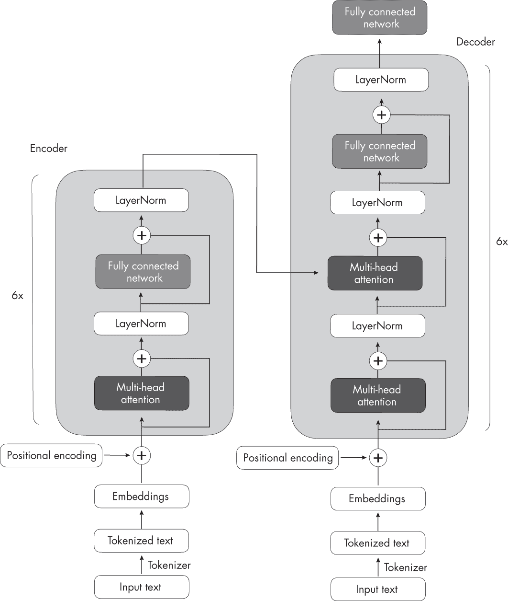
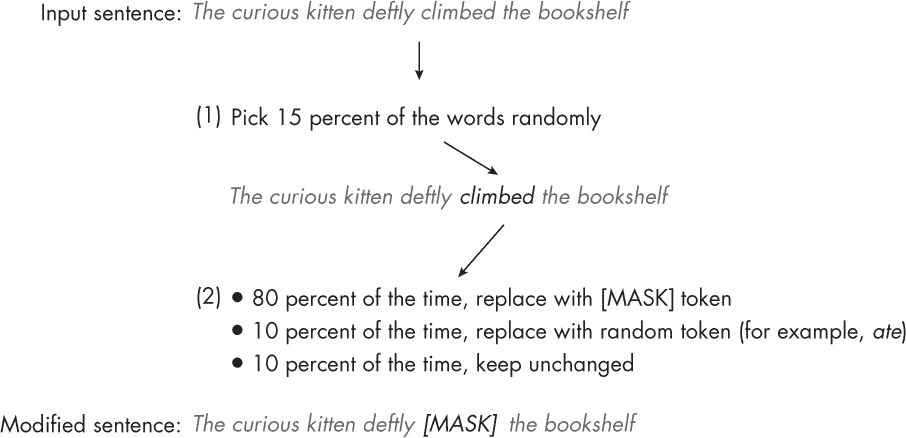
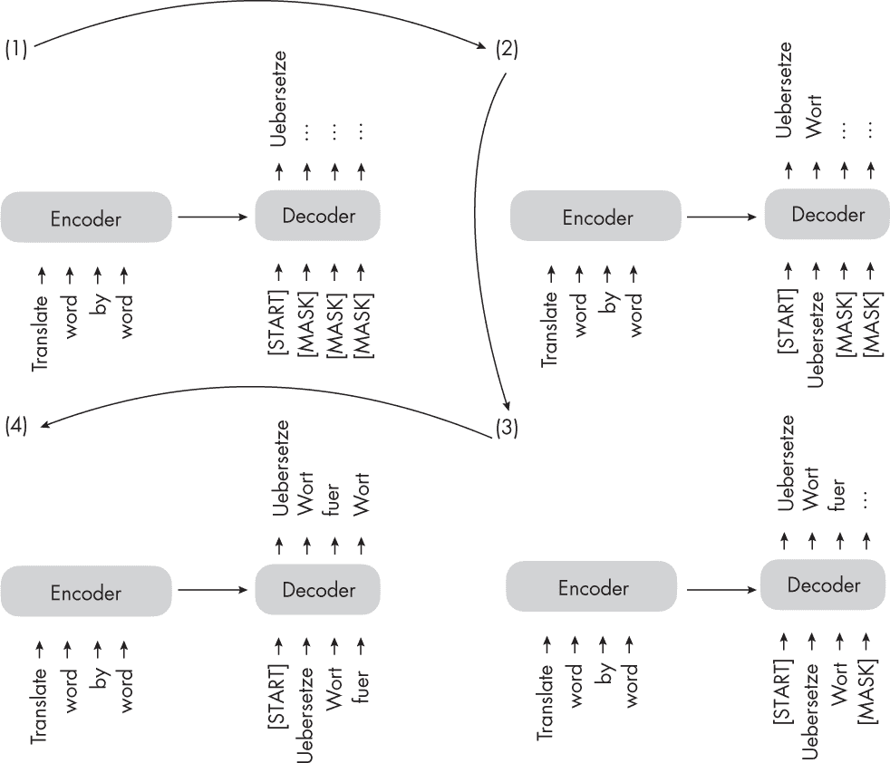
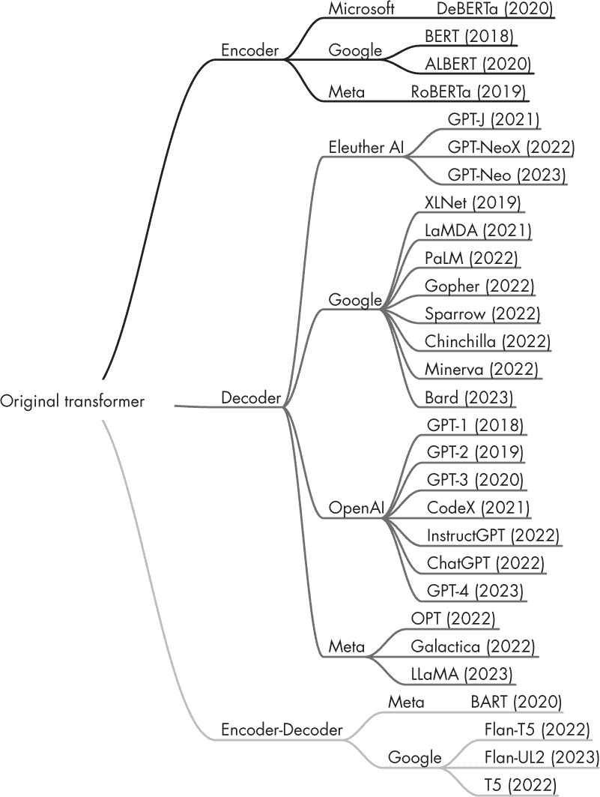

## 第十七章：编码器和解码器型 Transformer**

编码器和解码器型语言 Transformer 之间有什么区别？

编码器和解码器型架构都使用相同的自注意力层来编码单词标记。主要区别在于，编码器旨在学习可用于各种预测建模任务（例如分类）的嵌入。相比之下，解码器旨在生成新文本，例如回答用户查询。

本章首先描述了由编码器和解码器组成的原始 Transformer 架构，编码器处理输入文本，解码器生成翻译。接下来的部分描述了像 BERT 和 RoBERTa 这样的模型如何仅使用编码器来理解上下文，以及 GPT 架构如何强调仅使用解码器机制进行文本生成。

### **原始 Transformer**

在第十六章中介绍的原始 Transformer 架构是为英语到法语和英语到德语的语言翻译而开发的。它利用了编码器和解码器，如图 17-1 所示。

*图 17-1：原始的 Transformer 架构*

在图 17-1 中，输入文本（即需要翻译的文本句子）首先被分词为单个单词标记，然后通过嵌入层进行编码，之后进入编码器部分（有关嵌入的更多信息，请参见第一章）。在每个嵌入的单词上加上位置编码向量后，嵌入经过多头自注意力层。此层后面是一个加法步骤，如图 17-1 中所示，通过跳跃连接（也称为*残差*或*快捷*连接）执行层归一化并添加原始嵌入。接下来是一个 LayerNorm 模块，简称*层归一化*，它对前一层的激活进行归一化，以提高神经网络训练的稳定性。原始嵌入的加法和层归一化步骤通常被总结为*加法与归一化步骤*。最后，在进入全连接网络之后——一个由两个全连接层和一个非线性激活函数组成的小型多层感知机——输出再次被加法和归一化，然后传递到解码器的多头自注意力层。

图 17-1 中的解码器与编码器的总体结构相似。关键区别在于输入和输出的不同：编码器接收待翻译的输入文本，而解码器生成翻译后的文本。

#### ***编码器***

原始变换器中的编码器部分，如图 17-1 所示，负责理解和提取输入文本中的相关信息。然后，它输出输入文本的连续表示（嵌入），该表示被传递给解码器。最后，解码器基于从编码器接收到的连续表示生成翻译后的文本（目标语言）。

多年来，基于原始变换器模型的编码器模块，已开发出多种仅编码器架构。其中一个显著的例子是 BERT，它代表了来自变换器的双向编码器表示。

如第十四章所述，BERT 是基于变换器编码器模块的仅编码器架构。BERT 模型通过掩蔽语言建模和下一句预测任务在大型文本语料库上进行预训练。图 17-2 展示了 BERT 风格变换器中使用的掩蔽语言建模预训练目标。

*图 17-2：BERT 在预训练过程中随机掩蔽 15%的输入标记。*

如图 17-2 所示，掩蔽语言建模的主要思路是掩蔽（或替换）输入序列中的随机单词标记，然后训练模型根据周围的上下文预测原始被掩蔽的标记。

除了在图 17-2 中展示的掩蔽语言建模预训练任务外，下一句预测任务要求模型预测原文中两个随机打乱句子的顺序是否正确。例如，假设两个句子以随机顺序排列，并且它们之间由[SEP]标记分隔（*SEP*是*separate*的缩写）。方括号是该标记的符号的一部分，用于明确表示这是一个特殊标记，而不是文本中的普通单词。BERT 风格的变换器还使用[CLS]标记。[CLS]标记充当模型的占位符，提示模型返回*True*或*False*标签，表示句子顺序是否正确：

+   “[CLS] 吐司是一种简单而美味的食物。[SEP] 它通常与黄油、果酱或蜂蜜一起食用。”

+   “[CLS] 它通常与黄油、果酱或蜂蜜一起食用。[SEP] 吐司是一种简单而美味的食物。”

掩蔽语言和下一句预训练目标使 BERT 能够学习输入文本的丰富上下文表示，这些表示可以进一步微调以用于各种下游任务，如情感分析、问答和命名实体识别。值得注意的是，这种预训练是一种自监督学习（有关此类学习的更多细节，请参见第二章）。

RoBERTa（即稳健优化的 BERT 方法）是 BERT 的改进版。它保持与 BERT 相同的总体架构，但采用了若干训练和优化改进措施，如更大的批量大小、更多的训练数据，并去除了下一句预测任务。这些变化使得 RoBERTa 在各种自然语言理解任务中超过了 BERT，取得了更好的表现。

#### ***解码器***

回到图 17-1 中概述的原始 Transformer 架构，解码器中的多头自注意力机制与编码器中的类似，但它被掩蔽，以防止模型关注未来的位置，从而确保对位置 *i* 的预测只能依赖于位置小于 *i* 的已知输出。正如图 17-3 所示，解码器逐字生成输出词。

*图 17-3：原始 Transformer 中使用的下一句预测任务*

这种掩蔽（在图 17-3 中明确显示，尽管它在解码器的多头自注意力机制中是内部发生的）对于在训练和推理过程中保持 Transformer 模型的自回归特性至关重要。这个自回归特性确保模型一次生成一个输出标记，并将之前生成的标记作为上下文来生成下一个单词标记。

多年来，研究人员在原始的编码器-解码器 Transformer 架构的基础上，发展了几种仅包含解码器的模型，这些模型在各种自然语言处理任务中已被证明非常有效。最著名的模型包括 GPT 系列，我们在第十四章以及书中其他章节中简要讨论过这些模型。

*GPT* 代表 *生成式预训练变换器*。GPT 系列由仅包含解码器的模型组成，这些模型在大规模无监督文本数据上进行预训练，并针对特定任务（如文本分类、情感分析、问答和摘要）进行微调。GPT 模型，包括撰写时的 GPT-2、GPT-3 和 GPT-4，在各种基准测试中表现出色，目前是自然语言处理领域最流行的架构。

GPT 模型最显著的特点之一是其涌现特性。涌现特性是指模型由于下一词预测的预训练而发展出的能力和技能。尽管这些模型只被训练预测下一个词，经过预训练的模型却能够进行文本摘要、翻译、问答、分类等任务。此外，这些模型可以通过上下文学习在不更新模型参数的情况下执行新的任务，我们将在第十八章中更详细地讨论这一点。

### **编码器-解码器混合体**

除了传统的编码器和解码器架构外，新的编码器-解码器模型的开发也取得了进展，这些模型结合了两个组件的优势。这些模型通常采用新颖的技术、预训练目标或架构修改，以提升其在各种自然语言处理任务中的表现。一些值得注意的新型编码器-解码器模型包括 BART 和 T5。

编码器-解码器模型通常用于涉及理解输入序列和生成输出序列的自然语言处理任务，这些任务的输出序列往往具有不同的长度和结构。这些模型特别适用于输入与输出序列之间存在复杂映射关系的任务，尤其是在需要捕捉两个序列中元素之间关系的情况下。编码器-解码器模型的常见应用场景包括文本翻译和摘要生成。

### **术语**

所有这些方法——仅编码器、仅解码器和编码器-解码器模型——都是序列到序列模型（通常缩写为*seq2seq*）。虽然我们称 BERT 风格的方法为“仅编码器”，但这一描述可能会误导，因为这些方法在预训练过程中也会将嵌入解码为输出令牌或文本。换句话说，编码器-解码器架构和仅解码器架构都进行解码。

然而，与仅解码器和编码器-解码器架构不同，编码器-仅架构并不以自回归的方式进行解码。*自回归解码*指的是一次生成一个输出令牌，并根据先前生成的令牌来调整每个令牌的生成。仅编码器模型并不像这样生成连贯的输出序列。相反，它们专注于理解输入文本并产生任务特定的输出，如标签或令牌预测。

### **现代 Transformer 模型**

简而言之，编码器风格的模型通常用于学习用于分类任务的嵌入，编码器-解码器模型用于生成性任务，其中输出严重依赖输入（例如翻译和摘要生成），而仅解码器模型则用于其他类型的生成性任务，包括问答。自从第一个 Transformer 架构问世以来，已经开发出了数百种编码器-解码器、仅编码器、仅解码器混合型模型，如图 17-4 所示。

*图 17-4：按架构类型和开发者分类的一些最受欢迎的大型语言 Transformer 模型*

虽然仅编码器模型逐渐变得不那么流行，但像 GPT 这样的仅解码器模型却因通过 GPT-3、ChatGPT 和 GPT-4 在文本生成方面的突破而大爆发。然而，仅编码器模型在训练基于文本嵌入的预测模型时仍然非常有用，而不是用于文本生成。

### **练习**

**17-1.** 如本章所述，BERT 风格的编码器模型通过掩蔽语言模型和下一句预测预训练目标进行预训练。我们如何将这样一个预训练模型应用于分类任务（例如，预测文本是正面还是负面情感）？

**17-2.** 我们能否对仅解码器模型，如 GPT，进行微调以用于分类？

### **参考文献**

+   Bahdanau 注意力机制用于 RNN：Dzmitry Bahdanau、Kyunghyun Cho 和 Yoshua Bengio，“通过联合学习对齐和翻译的神经机器翻译”（2014 年），*[`arxiv.org/abs/1409.0473`](https://arxiv.org/abs/1409.0473)*。

+   最初的 BERT 论文，它通过掩蔽词和下一句预测预训练目标推广了编码器风格的变换器：Jacob Devlin 等，“BERT：用于语言理解的深度双向变换器预训练”（2018 年），*[`arxiv.org/abs/1810.04805`](https://arxiv.org/abs/1810.04805)*。

+   RoBERTa 通过优化训练程序、使用更大的训练数据集并移除下一句预测任务对 BERT 进行了改进：Yinhan Liu 等，“RoBERTa：一种强健优化的 BERT 预训练方法”（2019 年），*[`arxiv.org/abs/1907.11692`](https://arxiv.org/abs/1907.11692)*。

+   BART 编码器-解码器架构：Mike Lewis 等，“BART：用于自然语言生成、翻译和理解的去噪序列到序列预训练”（2018 年），*[`arxiv.org/abs/1910.13461`](https://arxiv.org/abs/1910.13461)*。

+   T5 编码器-解码器架构：Colin Raffel 等，“通过统一的文本到文本变换器探索迁移学习的极限”（2019 年），*[`arxiv.org/abs/1910.10683`](https://arxiv.org/abs/1910.10683)*。

+   提出首个 GPT 架构的论文：Alec Radford 等，“通过生成预训练提高语言理解”（2018 年），*[`cdn.openai.com/research-covers/language-unsupervised/language_understanding_paper.pdf`](https://cdn.openai.com/research-covers/language-unsupervised/language_understanding_paper.pdf)*。

+   GPT-2 模型：Alec Radford 等，“语言模型是无监督多任务学习者”（2019 年），*[`www.semanticscholar.org/paper/Language-Models-are-Unsupervised-Multitask-Learners-Radford-Wu/9405cc0d6169988371b2755e573cc28650d14dfe`](https://www.semanticscholar.org/paper/Language-Models-are-Unsupervised-Multitask-Learners-Radford-Wu/9405cc0d6169988371b2755e573cc28650d14dfe)*。

+   GPT-3 模型：Tom B. Brown 等，“语言模型是少量示例学习者”（2020 年），*[`arxiv.org/abs/2005.14165`](https://arxiv.org/abs/2005.14165)*。
