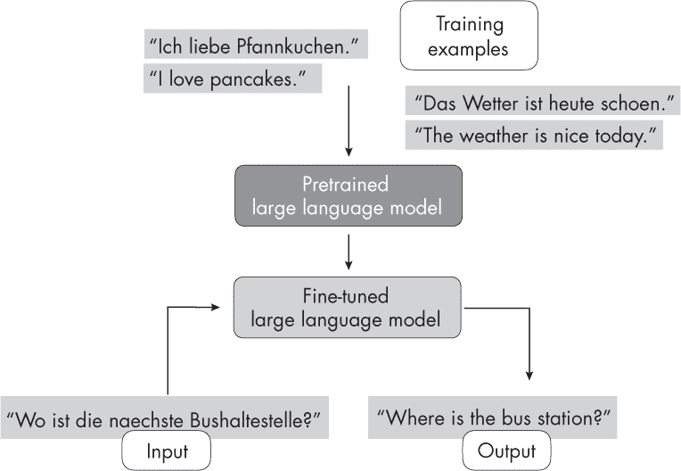
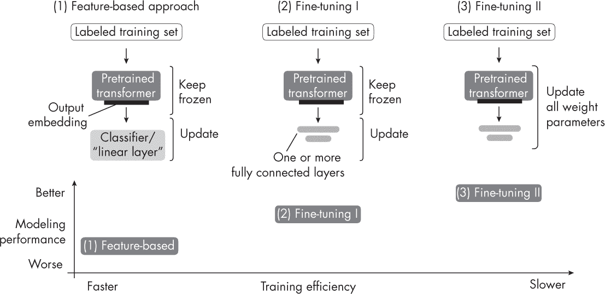
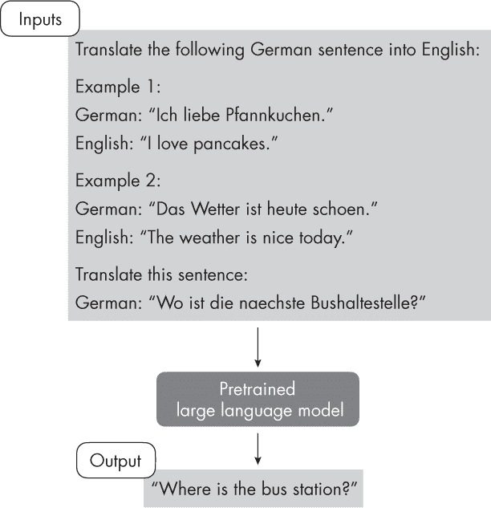
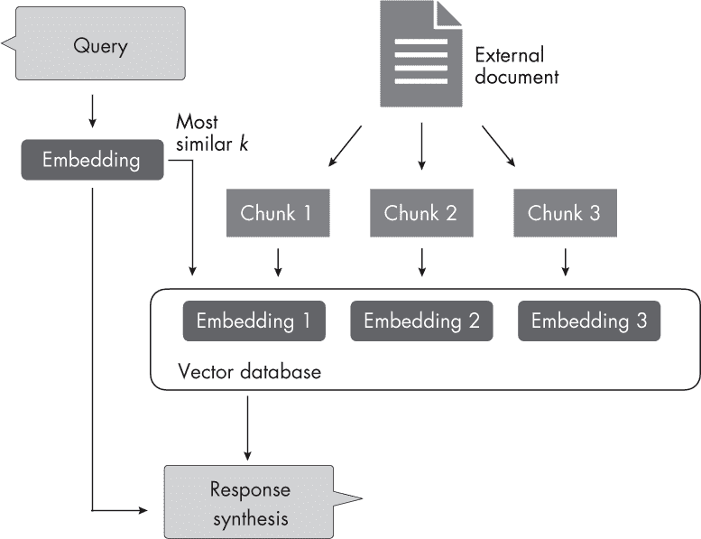
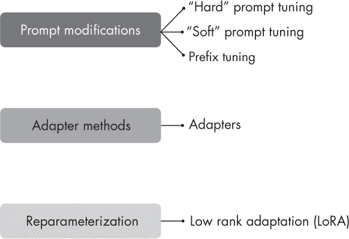
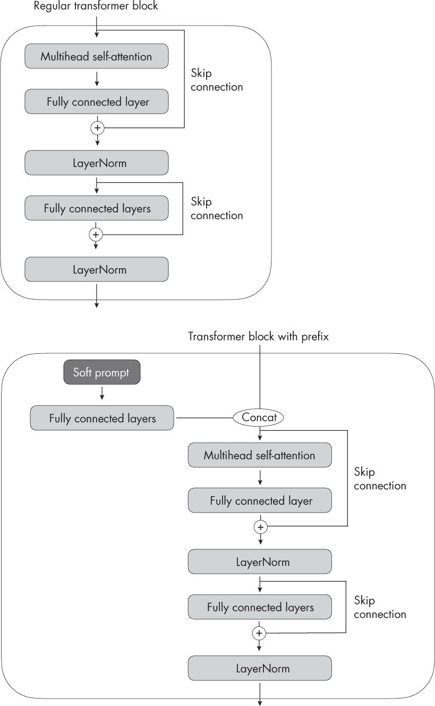
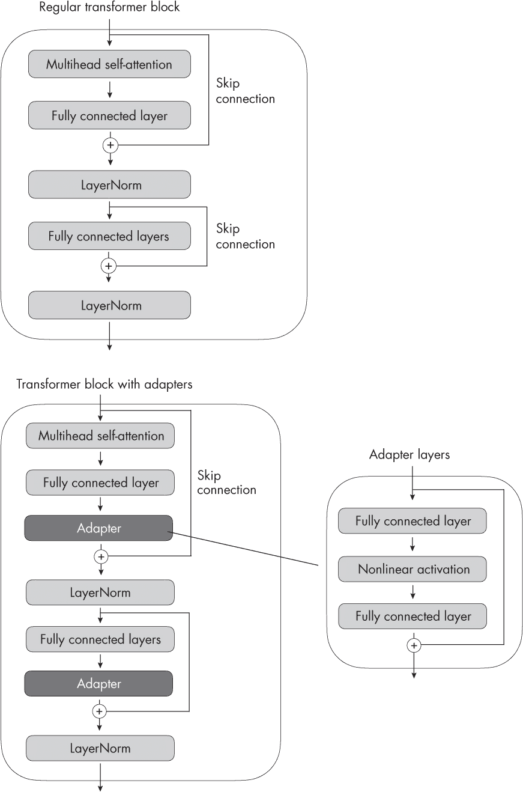

## 第十八章：使用和微调预训练变换器**


使用和微调预训练的大型语言模型有哪些不同的方法？

使用和微调预训练大型语言模型（LLMs）的三种最常见方法包括基于特征的方法、上下文提示和更新模型参数的子集。首先，大多数预训练的 LLMs 或语言变换器可以在不需要进一步微调的情况下使用。例如，我们可以使用基于特征的方法，通过预训练变换器生成的嵌入来训练一个新的下游模型，如线性分类器。第二，我们可以在输入本身展示一个新任务的示例，这意味着我们可以直接展示预期的结果，而无需模型进行任何更新或学习。这一概念也被称为*提示*。最后，我们也可以微调所有或仅少量的参数，以达到预期的结果。

以下部分将更深入地讨论这些方法。

### **使用变换器进行分类任务**

让我们从利用预训练变换器的传统方法开始：在特征嵌入上训练另一个模型、微调输出层和微调所有层。我们将在分类的背景下讨论这些方法。（稍后我们将在“上下文学习、索引和提示微调”部分的第 116 页中重新讨论提示。）

在基于特征的方法中，我们加载预训练模型并保持其“冻结”，这意味着我们不更新预训练模型的任何参数。相反，我们将模型视为一个特征提取器，应用到我们的新数据集上。然后，我们在这些嵌入上训练一个下游模型。这个下游模型可以是我们喜欢的任何模型（如随机森林、XGBoost 等），但线性分类器通常表现最佳。这可能是因为像 BERT 和 GPT 这样的预训练变换器已经从输入数据中提取了高质量、有用的特征。这些特征嵌入通常能够捕捉复杂的关系和模式，使得线性分类器能够有效地将数据分成不同的类别。此外，线性分类器，如逻辑回归机和支持向量机，通常具有较强的正则化特性。这些正则化特性有助于防止在使用由预训练变换器生成的高维特征空间时出现过拟合。这种基于特征的方法是最有效的，因为它完全不需要更新变换器模型。最后，嵌入可以为给定的训练数据集预先计算（因为它们不会改变），在多个训练周期中训练分类器时非常有用。

图 18-1 展示了 LLM 通常如何通过微调创建并应用于下游任务。在这里，一个预训练的模型，在一个通用文本语料库上进行训练，被微调用于执行像德语到英语翻译这样的任务。



*图 18-1：大型语言模型的通用微调工作流程*

对预训练 LLM 进行微调的传统方法包括仅更新输出层，我们将其称为 *微调 I*，以及更新所有层的方法，我们将其称为 *微调 II*。

微调 I 类似于前面描述的基于特征的方法，但它在 LLM 本身上添加了一个或多个输出层。LLM 的骨干部分保持冻结，我们仅更新这些新层中的模型参数。由于我们不需要对整个网络进行反向传播，因此该方法在吞吐量和内存需求方面相对高效。

在微调 II 中，我们加载模型并添加一个或多个输出层，类似于微调 I。然而，与仅通过最后一层反向传播不同，我们通过反向传播更新 *所有* 层，这使得这种方法成为最昂贵的方式。虽然这种方法在计算上比基于特征的方法和微调 I 更昂贵，但它通常能带来更好的建模或预测性能。对于更为专业化的领域特定数据集尤其如此。

图 18-2 总结了本节迄今为止描述的三种方法。



*图 18-2：利用预训练大型语言模型（LLMs）的三种传统方法*

除了本节描述的三种微调方法的概念总结外，图 18-2 还提供了这些方法在训练效率方面的经验法则。由于微调 II 涉及更新比微调 I 更多的层和参数，因此反向传播对于微调 II 的成本更高。出于类似的原因，微调 II 比更简单的基于特征的方法成本更高。

### **上下文学习、索引和提示调优**

像 GPT-2 和 GPT-3 这样的 LLM 推广了 *上下文学习* 的概念，在这个背景下，它通常被称为 *零-shot* 或 *few-shot learning*，这在图 18-3 中得到了说明。



*图 18-3：为上下文学习提示 LLM*

如图 18-3 所示，上下文学习旨在通过输入或提示提供任务的上下文或示例，从而使模型能够推断所需的行为并生成适当的响应。这种方法利用了模型在预训练期间从大量数据中学习的能力，这些数据包括各种任务和上下文。

**注意**

*少样本学习的定义，与基于上下文学习的方法同义，区别于第三章中讨论的传统少样本学习方法。*

例如，假设我们希望使用上下文学习进行少样本的德英翻译，使用像 GPT-3 这样的规模较大的预训练语言模型。为此，我们提供几个德英翻译的示例，以帮助模型理解所需任务，如下所示：

```
Translate the following German sentences into English:

Example 1:
German: "Ich liebe Pfannkuchen."
English: "I love pancakes."

Example 2:
German: "Das Wetter ist heute schoen."
English: "The weather is nice today."

Translate this sentence:
German: "Wo ist die naechste Bushaltestelle?"
```

通常，在上下文学习在某些任务或特定数据集上表现不如微调，因为它依赖于预训练模型从训练数据中泛化的能力，而不进一步调整模型的参数以适应当前任务。

然而，上下文学习也有其优势。当用于微调的标注数据有限或不可用时，它尤其有用。它还可以在没有微调模型参数的情况下快速实验不同的任务，特别是在我们无法直接访问模型，或者只通过用户界面（UI）或 API 与模型交互的情况下（例如，ChatGPT）。

与上下文学习相关的概念是*硬提示调优*，其中*硬*指的是输入标记的不可微分特性。与之前描述的微调方法通过更新模型参数来更好地执行任务不同，硬提示调优旨在优化提示本身以达到更好的性能。提示调优并不修改模型的参数，但它可能涉及使用较小的标注数据集来识别针对特定任务的最佳提示词形式。例如，为了改善之前的德英翻译任务的提示，我们可能会尝试以下三种提示变体：

+   `"将德语句子'{german_sentence}'翻译成英语：{english_translation}"`

+   `"德语：'{german_sentence}' | 英语：{english_translation}"`

+   `"从德语到英语：'{german_sentence}' -> {english_translation}"`

提示词调优是一种资源高效的替代方法，代替了参数微调。然而，提示词调优的性能通常不如完全模型微调，因为它并未更新模型的参数来针对特定任务进行调整，这可能会限制其适应任务特定细微差异的能力。此外，提示词调优可能需要大量人工干预，因为它需要人工对比不同提示词的质量，或使用类似的方法来完成这一任务。这通常被称为*硬*提示，因为输入的标记不可微分。除此之外，还有其他方法提议使用另一个大型语言模型（LLM）来自动生成和评估提示词。

另一种利用纯粹基于上下文学习的方法是*索引*，如图 18-4 所示。



*图 18-4：LLM 索引用于从外部文档中检索信息*

在大规模语言模型（LLMs）的上下文中，我们可以将索引视为一种基于上下文学习的解决方案，它允许我们将 LLM 转化为信息检索系统，从外部资源和网站中提取信息。在图 18-4 中，索引模块将文档或网站解析为更小的块，并将其嵌入到可以存储在向量数据库中的向量中。当用户提交查询时，索引模块计算嵌入查询与数据库中每个向量之间的向量相似度。最后，索引模块检索最相似的前*k*个嵌入，以合成响应。

### **参数高效微调**

近年来，已经开发出许多方法，以更高效地将预训练的变换器适配到新的目标任务。这些方法通常被称为*参数高效微调*，在撰写本文时，最流行的方法总结在图 18-5 中。



*图 18-5：参数高效微调技术的主要类别及其流行示例*

与前一节讨论的硬提示方法不同，*软提示*策略优化了提示的嵌入版本。在硬提示调优中，我们修改的是离散输入标记，而在软提示调优中，我们则使用可训练的参数张量。

软提示调优的思想是在嵌入查询标记之前添加一个可训练的参数张量（即“软提示”）。然后，该添加的张量通过梯度下降优化，以提高在目标数据集上的建模性能。在类似 Python 的伪代码中，软提示调优可以描述为：

```
x = EmbeddingLayer(input_ids)
x = concatenate([soft_prompt_tensor, x],
                 dim=seq_len)
output = model(x)
```

其中，`soft_prompt_tensor`与嵌入层产生的嵌入输入具有相同的特征维度。因此，修改后的输入矩阵具有额外的行（就像是用额外的标记扩展了原始输入序列，使其更长）。

另一种流行的提示调优方法是前缀调优。*前缀调优*与软提示调优类似，不同之处在于，在前缀调优中，我们将可训练的张量（软提示）添加到每个变换器块之前，而不仅仅是嵌入输入，这可以稳定训练过程。前缀调优的实现通过以下伪代码进行说明：

```
def transformer_block_with_prefix(x):
 ➊ soft_prompt = FullyConnectedLayers(# Prefix
      soft_prompt)                     # Prefix
 ➋ x = concatenate([soft_prompt, x],  # Prefix
                     dim=seq_len)      # Prefix
 ➌ residual = x
    x = SelfAttention(x)
    x = LayerNorm(x + residual)
    residual = x
    x = FullyConnectedLayers(x)
    x = LayerNorm(x + residual)
    return x
```

*列表 18-1：用于前缀调优的变换器块修改版*

让我们将列表 18-1 分为三个主要部分：实现软提示，将软提示（前缀）与输入连接，以及实现其余的变换器块。

首先，`soft_prompt`，一个张量，通过一组全连接层 ➊ 进行处理。其次，转换后的软提示与主输入 `x` ➋ 拼接。它们拼接的维度由 `seq_len` 表示，指的是序列长度维度。第三，后续的代码行 ➌ 描述了变换器块中的标准操作，包括自注意力、层归一化和前馈神经网络层，这些都包裹在残差连接中。

如代码示例 18-1 所示，前缀调优通过添加一个可训练的软提示来修改变换器块。图 18-6 进一步说明了常规变换器块和前缀调优变换器块之间的区别。



*图 18-6：常规变换器与前缀调优的比较*

软提示调优和前缀调优都被认为是参数高效的，因为它们只需要训练添加的参数张量，而不是大语言模型本身的参数。

*适配器方法* 与前缀调优相关，因为它们在变换器层中添加了额外的参数。在原始适配器方法中，在每个变换器块的多头自注意力和现有全连接层之后添加了额外的全连接层，如图 18-7 所示。



*图 18-7：常规变换器块（左）与带适配器层的变换器块比较*

使用原始适配器方法训练大语言模型时，仅更新新的适配器层，而其余变换器层保持冻结。由于适配器层通常较小——适配器块中的第一个全连接层将其输入投影到低维表示中，而第二层则将其投影回原始输入维度——这种适配器方法通常被认为是参数高效的。

在伪代码中，原始适配器方法可以写作如下：

```
def transformer_block_with_adapter(x):
    residual = x
    x = SelfAttention(x)
    x = FullyConnectedLayers(x)  # Adapter
    x = LayerNorm(x + residual)
    residual = x
    x = FullyConnectedLayers(x)
    x = FullyConnectedLayers(x)  # Adapter
    x = LayerNorm(x + residual)
    return x
```

*低秩适配（LoRA）*，另一种值得考虑的流行参数高效微调方法，指的是通过低秩变换重新参数化预训练大语言模型（LLM）权重。LoRA 与 *低秩变换* 的概念相关，低秩变换是一种使用低维表示来逼近高维矩阵或数据集的技术。低维表示（或 *低秩近似*）是通过找到一个较少维度的组合来有效捕获原始数据中的大部分信息。常见的低秩变换技术包括主成分分析和奇异值分解。

例如，假设∆*W*表示 LLM 权重矩阵的参数更新，矩阵维度为ℝ*^(A×B)*。我们可以将权重更新矩阵分解为两个较小的矩阵：∆*W* = *W[A]W[B]*，其中*W[A]∈* ℝ*^(A×h)*，*W[B]∈* ℝ*^(h×B)*。在这里，我们保持原始权重不变，只训练新的矩阵*W[A]*和*W[B]*。

如果我们引入新的权重矩阵，这种方法如何保持参数高效呢？这些新矩阵可以非常小。例如，如果*A* = 25 且*B* = 50，则∆*W*的大小为 25 *×* 50 = 1,250。如果*h* = 5，那么*W[A]*有 125 个参数，*W[B]*有 250 个参数，两个矩阵合起来总共有 125 + 250 = 375 个参数。

学习完权重更新矩阵后，我们可以编写全连接层的矩阵乘法，如下面的伪代码所示：

```
def lora_forward_matmul(x):
    h = x . W  # Regular matrix multiplication
    h += x . (W_A . W_B) * scalar
    return h
```

*清单 18-2：使用 LoRA 的矩阵乘法*

在清单 18-2 中，`scalar`是一个缩放因子，用于调整组合结果（原始模型输出加上低秩适配）的大小。这平衡了预训练模型的知识和新任务特定的适配。

根据介绍 LoRA 方法的原始论文，使用 LoRA 的模型在多个任务特定的基准测试中表现略好于使用适配器方法的模型。通常，LoRA 的表现甚至优于使用前面描述的微调 II 方法进行微调的模型。

### **带有人类反馈的强化学习**

前一节集中讨论了如何提高微调的效率。接下来，我们如何通过微调提高 LLM 的建模性能呢？

调整或微调 LLM 以适应新的目标领域或任务的传统方法是使用带标签目标数据的监督方法。例如，微调 II 方法允许我们适应一个预训练的 LLM，并在目标任务（如情感分类）上进行微调，使用包含情感标签如*positive*、*neutral*和*negative*的文本数据集。

监督微调是训练 LLM 的基础步骤。另一个更高级的步骤是*带有人类反馈的强化学习（RLHF）*，它可以进一步提高模型与人类偏好的对齐。例如，ChatGPT 及其前身 Instruct-GPT 是两个常见的预训练 LLM（GPT-3），它们通过 RLHF 进行微调。

在 RLHF 中，预训练模型通过监督学习和强化学习的结合进行微调。这种方法由最初的 ChatGPT 模型所普及，而 ChatGPT 又是基于 Instruct-GPT 的。人类反馈通过让人类对不同的模型输出进行排名或评分来收集，提供奖励信号。收集到的奖励标签可以用来训练奖励模型，然后用来指导大语言模型的适应过程，以符合人类偏好。奖励模型通过监督学习进行训练，通常使用预训练的大语言模型作为基础模型，然后通过额外的微调使预训练的大语言模型适应人类偏好。在这个额外的微调阶段，训练使用一种叫做*近端策略优化*的强化学习方法。

RLHF 使用奖励模型，而不是直接在人工反馈上训练预训练模型，因为将人类参与学习过程会造成瓶颈，因为我们无法实时获得反馈。

### **适应预训练语言模型**

虽然对预训练大语言模型进行全层微调仍然是适应新任务的黄金标准，但也有几种高效的替代方法可以利用预训练的变换器。例如，通过使用基于特征的方法、上下文学习或参数高效微调技术，我们可以在最大限度减少计算成本和资源的情况下，将大语言模型有效地应用于新任务。

三种传统方法——基于特征的方法、微调 I 和微调 II——提供了不同的计算效率和性能权衡。像软提示调优、前缀调优和适配器方法这样的参数高效微调方法进一步优化了适应过程，减少了需要更新的参数数量。同时，RLHF 提供了另一种监督微调的替代方法，可能提高建模性能。

总结来说，预训练大语言模型的多功能性和效率不断提升，为将这些模型有效适应各种任务和领域提供了新的机会和策略。随着这一领域研究的进展，我们可以期待在使用预训练语言模型方面的进一步改进和创新。

### **练习**

**18-1.** 在何种情况下使用上下文学习比微调更有意义，反之又如何？

**18-2.** 在前缀调优、适配器和 LoRA 中，我们如何确保模型保留（而不是遗忘）原有的知识？

### **参考文献**

+   介绍 GPT-2 模型的论文：Alec Radford 等人，“语言模型是无监督的多任务学习者”（2019）， *[`www.semanticscholar.org/paper/Language-Models-are-Unsupervised-Multitask-Learners-Radford-Wu/9405cc0d6169988371b2755e573cc28650d14dfe`](https://www.semanticscholar.org/paper/Language-Models-are-Unsupervised-Multitask-Learners-Radford-Wu/9405cc0d6169988371b2755e573cc28650d14dfe)*。

+   介绍 GPT-3 模型的论文：Tom B. Brown 等人，“语言模型是少量学习者”（2020），*[`arxiv.org/abs/2005.14165`](https://arxiv.org/abs/2005.14165)*。

+   自动化提示工程方法，提出使用另一个 LLM 进行自动提示生成和评估：Yongchao Zhou 等人，“大型语言模型是人类级别的提示工程师”（2023），*[`arxiv.org/abs/2211.01910`](https://arxiv.org/abs/2211.01910)*。

+   LlamaIndex 是一个利用上下文学习的索引方法示例：*[`github.com/jerryjliu/llama_index`](https://github.com/jerryjliu/llama_index)*。

+   DSPy 是一个流行的开源库，用于检索增强和索引：*[`github.com/stanfordnlp/dsp`](https://github.com/stanfordnlp/dsp)*。

+   第一个软提示的实例：Brian Lester、Rami Al-Rfou 和 Noah Constant，“规模的力量对参数高效提示调优的影响”（2021），*[`arxiv.org/abs/2104.08691`](https://arxiv.org/abs/2104.08691)*。

+   首次描述前缀调优的论文：Xiang Lisa Li 和 Percy Liang，“前缀调优：优化生成的连续提示”（2021），*[`arxiv.org/abs/2101.00190`](https://arxiv.org/abs/2101.00190)*。

+   介绍原始适配器方法的论文：Neil Houlsby 等人，“用于 NLP 的参数高效迁移学习”（2019），*[`arxiv.org/abs/1902.00751`](https://arxiv.org/abs/1902.00751)*。

+   介绍 LoRA 方法的论文：Edward J. Hu 等人，“LoRA：大规模语言模型的低秩适应”（2021），*[`arxiv.org/abs/2106.09685`](https://arxiv.org/abs/2106.09685)*。

+   涵盖 40 多篇研究论文的调查，讨论了参数高效微调方法：Vladislav Lialin、Vijeta Deshpande 和 Anna Rumshisky，“缩小规模以扩大规模：参数高效微调指南”（2023），*[`arxiv.org/abs/2303.15647`](https://arxiv.org/abs/2303.15647)*。

+   InstructGPT 论文：Long Ouyang 等人，“用人类反馈训练语言模型以遵循指令”（2022），*[`arxiv.org/abs/2203.02155`](https://arxiv.org/abs/2203.02155)*。

+   用于强化学习与人类反馈的邻近策略优化：John Schulman 等人，“邻近策略优化算法”（2017），*[`arxiv.org/abs/1707.06347`](https://arxiv.org/abs/1707.06347)*。
