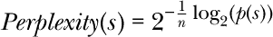
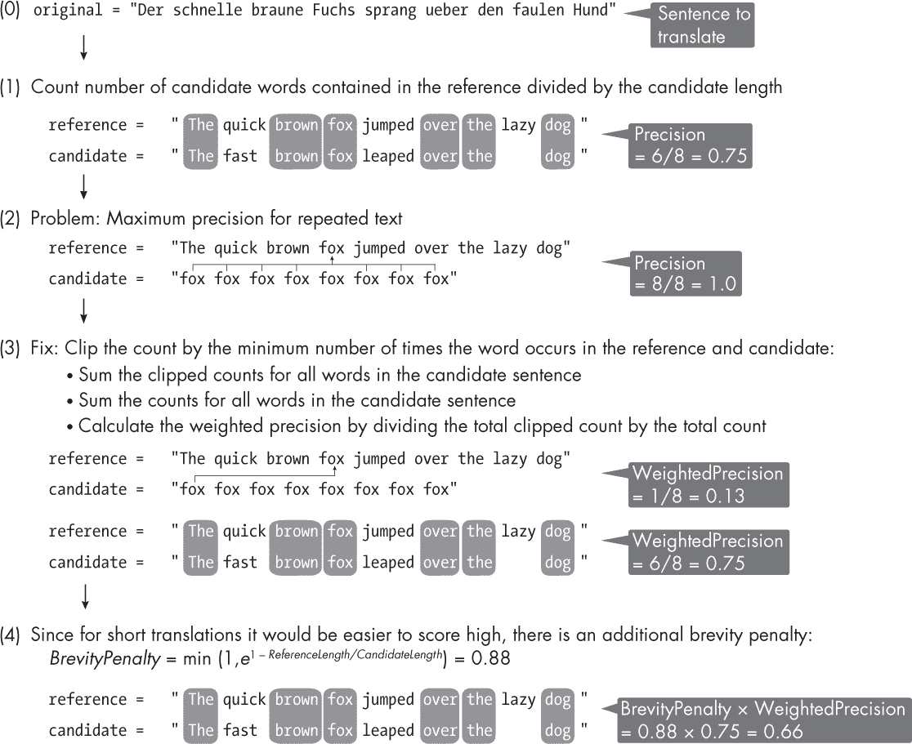
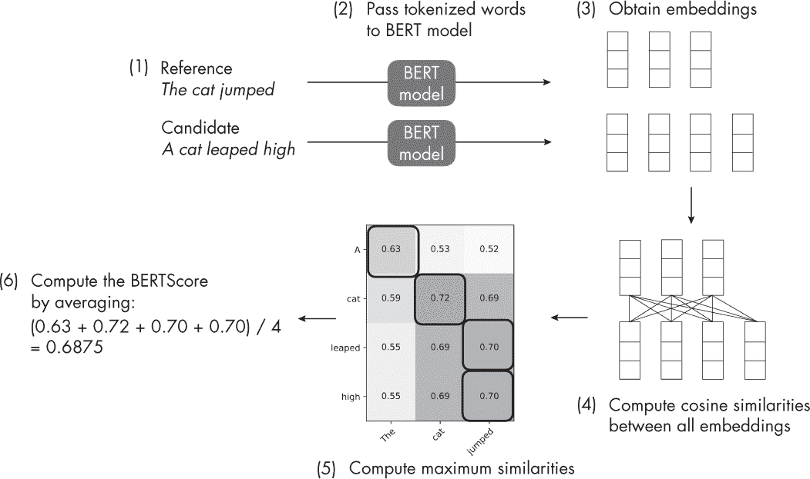

## 第十九章：**评估生成型大型语言模型**

用来评估大型语言模型生成文本质量的标准指标是什么？这些指标为何有用？

困惑度、BLEU、ROUGE 和 BERTScore 是自然语言处理领域中常用的几种评估指标，用于评估 LLM 在各种任务中的表现。尽管最终无法避免人工质量评估，但人工评估既繁琐又昂贵，且难以自动化且带有主观性。因此，我们开发了这些指标，以提供客观的总结分数来衡量进展并比较不同的方法。

本章讨论了评估大型语言模型（LLM）内在和外在性能指标的区别，接着深入探讨了像 BLEU、ROUGE 和 BERTScore 等流行指标，并提供了简单的实际操作示例以作说明。

### **LLM 评估指标**

*困惑度指标* 与用于预训练 LLM 的损失函数直接相关，并且通常用于评估文本生成和文本补全模型。它本质上量化了模型在给定上下文中预测下一个单词时的平均不确定性——困惑度越低，模型表现越好。

*双语评估下游任务（BLEU）* 分数是评估机器生成翻译质量的广泛使用的指标。它衡量机器生成翻译和一组人工生成参考翻译之间的 n-gram 重叠程度。较高的 BLEU 分数表示更好的表现，范围从 0（最差）到 1（最好）。

*召回导向下游任务评估（ROUGE）* 分数是主要用于评估自动摘要（有时也用于机器翻译）模型的指标。它衡量生成的摘要和参考摘要之间的重叠程度。

我们可以把困惑度视为*内在指标*，而把 BLEU 和 ROUGE 视为*外在指标*。为了说明这两种类型的指标之间的区别，可以想象优化传统的交叉熵来训练一个图像分类器。交叉熵是我们在训练过程中优化的损失函数，但我们的最终目标是最大化分类精度。由于分类精度无法在训练过程中直接优化，因为它不可微分，因此我们最小化像交叉熵这样的替代损失函数。最小化交叉熵损失或多或少与最大化分类精度相关。

困惑度（Perplexity）通常作为评估指标，用于比较不同语言模型的表现，但它并不是训练过程中的优化目标。BLEU 和 ROUGE 更与分类精度相关，或者说与精确度和召回率相关。实际上，BLEU 是一种类似精确度的分数，用来评估翻译文本的质量，而 ROUGE 是一种类似召回率的分数，用来评估摘要文本。

以下章节将更详细地讨论这些指标的机制。

#### ***困惑度（Perplexity）***

困惑度与训练过程中直接最小化的交叉熵密切相关，这也是我们将困惑度称为*内在指标*的原因。

困惑度被定义为 2^(*H*(*p*, *q*)/*n*)，其中*H*(*p*, *q*)是词的真实分布*p*和预测分布*q*之间的交叉熵，*n*是句子长度（单词数或标记数），用于标准化得分。随着交叉熵的减少，困惑度也会减少——困惑度越低，效果越好。虽然我们通常使用自然对数计算交叉熵，但为了保持直观的关系，我们使用以 2 为底的对数来计算交叉熵和困惑度。（然而，无论使用以 2 为底的对数还是自然对数，都是一个较小的实现细节。）

在实际应用中，由于目标句子中每个单词的概率始终为 1，我们将交叉熵计算为模型返回的概率分数的对数。换句话说，如果我们有每个单词的预测概率分数，我们可以直接计算困惑度，如下所示：

其中，*s*是我们要评估的句子或文本，例如“The quick brown fox jumps over the lazy dog.”，*p*(*s*)是模型返回的概率分数，*n*是单词数或标记数。例如，如果模型返回的概率分数是[0.99, 0.85, 0.89, 0.99, 0.99, 0.99, 0.99, 0.99]，则困惑度为：

如果句子是“The fast black cat jumps over the lazy dog.”，且概率为[0.99, 0.65, 0.13, 0.05, 0.21, 0.99, 0.99, 0.99]，则相应的困惑度为 2.419。

你可以在*supplementary/q19-evaluation-llms*子文件夹中的* [`github.com/rasbt/MachineLearning-QandAI-book`](https://github.com/rasbt/MachineLearning-QandAI-book) *找到这个计算的代码实现和示例。

#### ***BLEU 分数***

BLEU 是最受欢迎和最广泛使用的翻译文本评估标准。几乎所有具备翻译能力的大型语言模型（LLM）都使用它，包括 OpenAI 的 Whisper 和 GPT 模型等流行工具。

BLEU 是一种基于参考的度量标准，它将模型输出与人工生成的参考文本进行比较，最初开发的目的是捕捉或自动化人类评估的本质。简而言之，BLEU 通过基于精度的得分衡量模型输出与人工生成参考文本之间的词汇重叠。

更详细地说，作为一种基于精度的度量标准，BLEU 计算生成文本（候选文本）中有多少单词出现在参考文本中，并将其除以候选文本的长度（单词数），其中参考文本是由人工提供的样本文本翻译。例如，通常对 n-grams（n 元组）进行计算，而不是单个单词，但为了简便起见，我们将仅考虑单词或 1-gram。（在实际应用中，BLEU 通常是针对 4-gram 计算的。）

图 19-1 展示了 BLEU 分数的计算，使用了计算 1-gram BLEU 分数的例子。图 19-1 中的每个步骤说明了我们如何基于 BLEU 分数的各个组成部分来计算 1-gram BLEU 分数，即加权精确度乘以简洁性惩罚。你还可以在*supplementary/q15-text-augment*子文件夹中找到这个计算的代码实现，链接地址是*[`github.com/rasbt/MachineLearning-QandAI-book`](https://github.com/rasbt/MachineLearning-QandAI-book)*。

*图 19-1：计算 1-gram BLEU 分数*

BLEU 有几个缺点，主要是因为它衡量的是字符串相似性，而仅仅相似性不足以捕捉翻译质量。例如，句子中虽然单词相似但词序不同，可能仍然得分较高，尽管改变词序会显著改变句子的意义并导致语法结构差。此外，由于 BLEU 依赖于精确的字符串匹配，它对词汇变异非常敏感，无法识别使用同义词或释义的语义相似翻译。换句话说，BLEU 可能会给那些实际上是准确和有意义的翻译分配较低的分数。

原始的 BLEU 论文发现它与人工评估具有较高的相关性，尽管这一点后来被证明是错误的。

BLEU 有缺陷吗？是的。它仍然有用吗？也是的。BLEU 是一个有用的工具，可以用来衡量或评估模型在训练过程中是否有所改进，作为流利度的代理。然而，它可能不能可靠地评估生成翻译的质量，也不适合检测问题。换句话说，它最好作为模型选择工具，而不是模型评估工具。

在写作时，最流行的 BLEU 替代方法是 METEOR 和 COMET（有关更多详细信息，请参见本章末尾的“参考文献”部分）。

#### ***ROUGE 分数***

虽然 BLEU 通常用于翻译任务，但 ROUGE 是评分文本摘要的流行指标。

BLEU 和 ROUGE 之间有许多相似之处。基于精确度的 BLEU 分数检查候选翻译中有多少个单词出现在参考翻译中。ROUGE 分数也采取了相反的方式，检查参考文本中有多少个单词出现在生成的文本中（这里通常是摘要而非翻译）；这可以被解释为基于召回的分数。

现代的实现方式将 ROUGE 计算为一个 F1 分数，它是召回率（参考文本中有多少个单词出现在候选文本中）和精确率（候选文本中有多少个单词出现在参考文本中）的调和平均值。例如，图 19-2 展示了一个 1-gram ROUGE 分数的计算（尽管在实际操作中，ROUGE 通常计算的是 2-grams，即二元组）。

*图 19-2：计算 1-gram ROUGE*

除了 ROUGE-1（基于 F1 分数的 1-gram ROUGE 得分）之外，还有其他 ROUGE 变体：

**ROUGE-N**    衡量候选摘要和参考摘要之间的 n-gram 重叠。例如，ROUGE-1 会查看单个单词的重叠（1-gram），而 ROUGE-2 会考虑 2-gram（大二元组）的重叠。

**ROUGE-L**    衡量候选摘要和参考摘要之间的最长公共子序列（LCS）。该度量捕捉单词的最长共现顺序子序列，它们之间可能有空隙。

**ROUGE-S**    衡量*跳跃大二元组*（skip-bigrams）的重叠，即在两个单词之间有灵活数量的单词的词对。它有助于捕捉具有不同词序的句子之间的相似性。

ROUGE 与 BLEU 有相似的弱点。与 BLEU 一样，ROUGE 并不考虑同义词或释义。它衡量候选摘要和参考摘要之间的 n-gram 重叠，这可能导致语义相似但词汇不同的句子得分较低。然而，仍然值得了解 ROUGE，因为根据一项研究，2021 年计算语言学会议上所有介绍新总结模型的论文都使用了 ROUGE，其中 69%的论文仅使用了 ROUGE。

#### ***BERTScore***

另一个最近开发的外部度量是 BERTScore。

对于熟悉生成视觉模型的 inception score 的读者，BERTScore 采取了类似的方法，使用预训练模型的嵌入（有关嵌入的更多信息，请参见第一章）。在这里，BERTScore 通过利用 BERT 模型生成的上下文嵌入，衡量候选文本和参考文本之间的相似度（该 BERT 模型是第十七章中讨论的编码器式转换器）。

计算 BERTScore 的步骤如下：

1.  通过你想要评估的 LLM（如 PaLM、LLaMA、GPT、BLOOM 等）获取候选文本。

1.  将候选文本和参考文本进行词元化，最好使用与训练 BERT 时相同的分词器。

1.  使用预训练的 BERT 模型为候选文本和参考文本中的所有词元创建嵌入。

1.  将候选文本中每个词元的嵌入与参考文本中所有词元的嵌入进行比较，计算它们的余弦相似度。

1.  将候选文本中的每个词元与参考文本中具有最高余弦相似度的词元对齐。

1.  通过计算候选文本中所有词元的平均相似度分数来计算最终的 BERTScore。

图 19-3 进一步说明了这六个步骤。你也可以在*subfolder/q15-text-augment*子文件夹中找到一个计算示例，网址为*[`github.com/rasbt/MachineLearning-QandAI-book`](https://github.com/rasbt/MachineLearning-QandAI-book)*。

*图 19-3：逐步计算 BERTScore*

BERTScore 可以用于翻译和总结，并且比传统度量如 BLEU 和 ROUGE 更好地捕捉语义相似度。然而，BERTScore 在同义句生成方面比 BLEU 和 ROUGE 更强大，并且由于其上下文嵌入，它更好地捕捉语义相似性。此外，它可能比 BLEU 和 ROUGE 在计算上更昂贵，因为它需要使用预训练的 BERT 模型进行评估。尽管 BERTScore 提供了一个有用的自动评估指标，但它并不完美，应该与其他评估技术一起使用，包括人工判断。

### **替代度量**

本章涵盖的所有度量标准都是用于评估模型在衡量其与人类表现进行对比时的有用性的替代指标。如前所述，评估 LLM 的最佳方法是指定人工评分者来判断结果。然而，由于这通常成本较高且难以扩展，我们使用前述的度量标准来估算模型性能。引用《InstructGPT paper“用人类反馈训练语言模型遵循指令”》中的话：“公共 NLP 数据集并不能反映我们的语言模型是如何使用的... [它们] 旨在捕捉易于通过自动化度量评估的任务。”

除了困惑度（perplexity）、ROUGE、BLEU 和 BERTScore 之外，还使用了其他几种流行的评估度量来评估 LLM 的预测性能。

### **练习**

**19-1.** 在图 19-3 的第 5 步中，“cat”两个嵌入之间的余弦相似度并不是 1.0，其中 1.0 表示最大余弦相似度。为什么会这样？

**19-2.** 实际上，我们可能会发现 BERTScore 并不对称。这意味着交换候选句子和参考句子可能会导致某些文本的 BERTScore 不同。我们该如何解决这个问题？

### **参考文献**

+   提出原始 BLEU 方法的论文：Kishore Papineni 等，“BLEU：一种自动评估机器翻译的方法”（2002），* [`aclanthology.org/P02-1040/`](https://aclanthology.org/P02-1040/)*。

+   一项否定 BLEU 与人工评估高度相关性的后续研究：Chris Callison-Burch，Miles Osborne 和 Philipp Koehn，“重新评估 BLEU 在机器翻译研究中的作用”（2006），* [`aclanthology.org/E06-1032/`](https://aclanthology.org/E06-1032/)*。

+   BLEU 的缺点，基于 20 年来发布的 37 项研究：Benjamin Marie，"12 个 BLEU 的关键缺陷"（2022），* [`medium.com/@bnjmn_marie/12-critical-flaws-of-bleu-1d790ccbe1b1`](https://medium.com/@bnjmn_marie/12-critical-flaws-of-bleu-1d790ccbe1b1)*。

+   提出原始 ROUGE 方法的论文：Chin-Yew Lin，“ROUGE：一种自动评估摘要的工具包”（2004），* [`aclanthology.org/W04-1013/`](https://aclanthology.org/W04-1013/)*。

+   关于 ROUGE 在会议论文中的使用调查：Sebastian Gehrmann、Elizabeth Clark 和 Thibault Sellam，“修复裂缝：生成文本评估实践中的障碍调查”（2022），*[`arxiv.org/abs/2202.06935`](https://arxiv.org/abs/2202.06935)*。

+   BERTScore，一种基于大型语言模型的评估指标：Tianyi Zhang 等人，“BERTScore：使用 BERT 评估文本生成”（2019），*[`arxiv.org/abs/1904.09675`](https://arxiv.org/abs/1904.09675)*。

+   关于大型语言模型评估指标的综合调研：Asli Celikyilmaz、Elizabeth Clark 和 Jianfeng Gao，“文本生成评估：一项调查”（2021），*[`arxiv.org/abs/2006.14799`](https://arxiv.org/abs/2006.14799)*。

+   METEOR 是一种改进了 BLEU 的机器翻译指标，采用先进的匹配技术，旨在与人类判断在句子层面上实现更好的相关性：Satanjeev Banerjee 和 Alon Lavie，“METEOR：一种具有更好与人类判断相关性的自动机器翻译评估指标”（2005），*[`aclanthology.org/W05-0909/`](https://aclanthology.org/W05-0909/)*。

+   COMET 是一个神经网络框架，采用跨语言预训练模型和多种评估方式，为机器翻译质量与人类判断之间的相关性设定了新的标准：Ricardo Rei 等人，“COMET: 用于机器翻译评估的神经网络框架”（2020），*[`arxiv.org/abs/2009.09025`](https://arxiv.org/abs/2009.09025)*。

+   InstructGPT 论文：Long Ouyang 等人，“训练语言模型以遵循指令并获得人类反馈”（2022），*[`arxiv.org/abs/2203.02155`](https://arxiv.org/abs/2203.02155)*。
