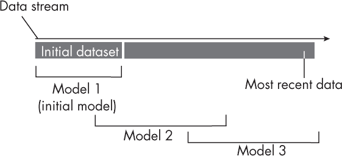
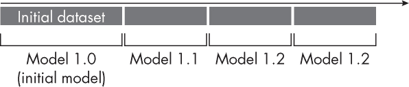

## 第二十章：**无状态与有状态训练**

在生产和部署系统的背景下，无状态和有状态训练工作流之间有什么区别？

无状态训练和有状态训练是训练生产模型的两种不同方式。

### **无状态（重新）训练**

在无状态训练中，这是一种更为传统的方法，我们首先在原始训练集上训练初始模型，然后随着新数据的到来重新训练模型。因此，无状态训练通常也被称为无状态*重新训练*。

如图 20-1 所示，我们可以将无状态重新训练视为一种滑动窗口方法，在这种方法中，我们会基于给定数据流的不同部分对初始模型进行重新训练。

*图 20-1：无状态训练定期替换模型。*

例如，为了将图 20-1 中的初始模型（模型 1）更新为更新模型（模型 2），我们会使用初始数据的 30% 和最新数据的 70% 来训练模型。

无状态重新训练是一种直接的方法，它通过在用户定义的检查点间隔内从头开始重新训练模型，使我们能够将模型适应数据和特征-目标关系中的最新变化。这种方法在传统的机器学习系统中很常见，尤其是那些不能作为迁移学习或自监督学习工作流的一部分进行微调的系统（参见第二章）。例如，基于树的标准模型实现，如随机森林和梯度提升（XGBoost、CatBoost 和 LightGBM），就属于这一类。

### **有状态训练**

在有状态训练中，我们在初始数据批次上训练模型，然后在新数据到达时定期更新它（而不是重新训练）。

如图 20-2 所示，我们不会从头开始重新训练初始模型（模型 1.0）；相反，我们会随着新数据的到来更新或微调它。这种方法对于与迁移学习或自监督学习兼容的模型特别有吸引力。

*图 20-2：有状态训练定期更新模型。*

有状态方法模仿了迁移学习或自监督学习的工作流，在这种方法中，我们采用预训练模型进行微调。然而，有状态训练与迁移学习和自监督学习有根本性的不同，因为它会更新模型，以适应概念、特征和标签的漂移。相比之下，迁移学习和自监督学习的目标是将模型应用于不同的分类任务。例如，在迁移学习中，目标标签通常不同；在自监督学习中，我们从数据集特征中获取目标标签。

有状态训练的一个显著优点是我们不需要存储数据进行重新训练；相反，我们可以在数据到达时立即用它来更新模型。当数据存储因隐私或资源限制而成为问题时，这一点尤为吸引人。

### **练习**

**20-1.** 假设我们使用随机森林模型训练一个用于股票交易推荐的分类器，将股票价格的移动平均作为特征。由于新的股市数据每天都会到达，我们正在考虑如何每天更新分类器以保持其最新状态。我们是应该采用无状态训练还是有状态重新训练的方法来更新分类器？

**20-2.** 假设我们部署一个大型语言模型（例如 Chat-GPT），该模型可以回答用户查询。对话界面包括点赞和点踩按钮，用户可以根据生成的查询直接反馈。在收集用户反馈时，我们不会在新反馈到达时立即更新模型。然而，我们计划每月至少发布一次新的或更新的模型。我们应该为这个模型使用无状态还是有状态重新训练？
