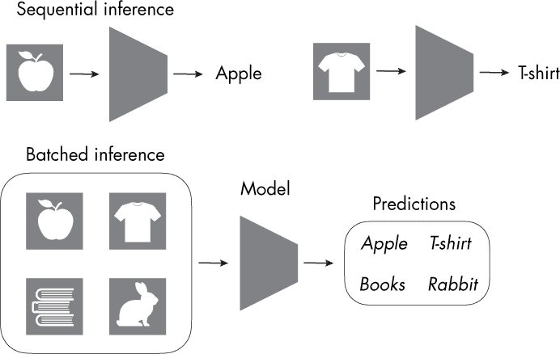
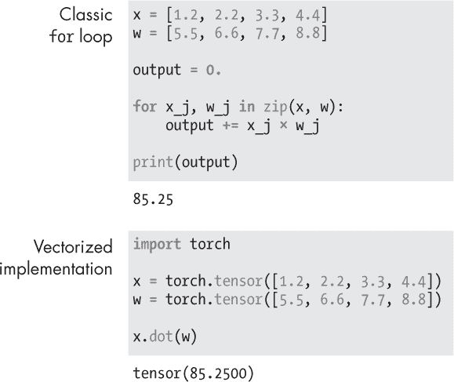
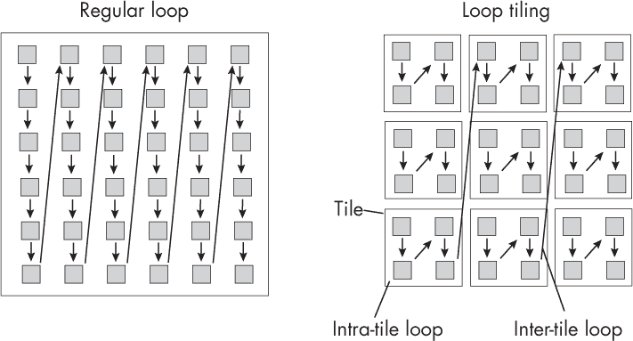
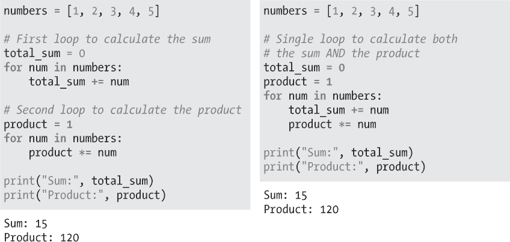

## 第二十二章：**加速推理**

有哪些优化技术可以加速模型推理，而不改变模型架构或牺牲准确性？

在机器学习和人工智能中，*模型推理*指的是使用训练好的模型进行预测或生成输出。提高推理性能的主要技术包括并行化、矢量化、循环平铺、操作符融合和量化，以下章节将详细讨论这些技术。

### **并行化**

提高推理期间并行化的常见方法之一是一次处理一批样本，而不是逐个处理单一样本。这有时也被称为*批量推理*，假设我们同时或在短时间窗口内接收多个输入样本或用户输入，如图 22-1 所示。

*图 22-1: 顺序推理与批量推理*

图 22-1 显示了顺序推理一次处理一个项目的方式，如果有多个样本等待分类，这会造成瓶颈。在批量推理中，模型同时处理所有四个样本。

### **矢量化**

*矢量化*指的是对整个数据结构（如数组（张量）或矩阵）进行操作，而不是使用`for`循环等迭代结构。通过矢量化，循环中的多个操作会通过单指令多数据（SIMD）处理同时执行，这在大多数现代 CPU 上都可以实现。

这种方法利用了许多计算系统中的低级优化，通常会显著提高速度。例如，它可能依赖于 BLAS。

*BLAS*（即*基本线性代数子程序*的缩写）是一种规范，规定了一组用于执行常见线性代数操作的低级例程，例如向量加法、标量乘法、点积、矩阵乘法等。许多数组和深度学习库，如 NumPy 和 PyTorch，都在幕后使用 BLAS。

为了通过一个例子说明矢量化，假设我们要计算两个向量的点积。非矢量化的做法是使用`for`循环，逐个遍历数组中的每个元素。然而，这种方法可能非常慢，特别是对于大型数组。通过矢量化，你可以一次性对整个数组执行点积操作，如图 22-2 所示。

*图 22-2: Python 中经典的* for *循环与矢量化点积计算*

在线性代数或深度学习框架（如 TensorFlow 和 PyTorch）中，矢量化通常是自动进行的。这是因为这些框架设计用于处理多维数组（也称为*张量*），其操作本质上是矢量化的。这意味着，当你使用这些框架执行函数时，自动利用了矢量化的优势，从而实现更快、更高效的计算。

### **循环分块**

*循环分块*（也常被称为*循环嵌套优化*）是一种先进的优化技术，通过将循环的迭代空间拆分成更小的块或“瓦片”来增强数据局部性。这确保了数据一旦加载到缓存中，在缓存清空之前，所有可能的计算都会在其上执行。

图 22-3 说明了二维数组中访问元素的循环分块概念。在常规的`for`循环中，我们一次迭代处理一个元素，遍历列和行，而在循环分块中，我们将数组细分为更小的块。

*图 22-3：二维数组中的循环分块*

请注意，在像 Python 这样的语言中，我们通常不会进行循环分块，因为 Python 和许多其他高级语言不像 C 和 C++ 这样的低级语言那样可以控制缓存内存。这类优化通常由底层库（如 NumPy 和 PyTorch）在对大数组进行操作时处理。

### **操作符融合**

*操作符融合*，有时也叫做*循环融合*，是一种优化技术，它将多个循环合并为一个循环。这在图 22-4 中得到了说明，其中两个独立的循环分别计算一个数字数组的和与积，被融合成了一个循环。

*图 22-4：将两个* for *循环（左）融合为一个（右）*

操作符融合可以通过减少循环控制的开销、通过提高缓存性能减少内存访问时间，并可能通过矢量化启用进一步的优化，从而提高模型的性能。

你可能会认为，矢量化行为与循环分块不兼容，因为在循环分块中，我们将一个`for`循环拆分为多个循环。然而，这些技术实际上是互补的，用于不同的优化，并适用于不同的场景。操作符融合旨在减少循环迭代的总次数，并在整个数据适合缓存时提高数据局部性。而循环分块则是在处理无法完全装入缓存的更大多维数组时，改进缓存利用率。

与操作符融合相关的是*重参数化*的概念，它通常也可以用来将多个操作简化为一个操作。流行的例子包括训练一个具有多分支架构的网络，在推理时将其重参数化为单流架构。与传统的操作符融合不同，这种重参数化方法并不会将多个操作合并为一个操作，而是重新排列网络中的操作，以创建更高效的推理架构。例如，在所谓的 RepVGG 架构中，每个分支在训练过程中由一系列卷积组成。一旦训练完成，模型就会重参数化为一个单一的卷积序列。

### **量化**

*量化*减少了机器学习模型的计算和存储需求，特别是深度神经网络。该技术涉及将浮点数（技术上是离散的，但在特定范围内表示连续值）用于实现训练好的神经网络中的权重和偏置转换为更离散、更低精度的表示形式，如整数。使用较低的精度可以减小模型的大小并加快执行速度，从而在推理过程中显著提高速度和硬件效率。

在深度学习领域，将训练好的模型量化为 8 位和 4 位整数已变得越来越常见。这些技术在大型语言模型的部署中尤为常见。

量化主要有两大类。*训练后量化*是先使用全精度权重进行常规训练，训练完成后再进行量化。*量化感知训练*则是在训练过程中引入量化步骤。这使得模型可以学习补偿量化的影响，从而有助于保持模型的准确性。

然而，值得注意的是，量化有时可能会导致模型准确度的降低。由于本章重点讨论在*不*牺牲准确度的情况下加速模型推理，因此量化不如前述技术适合本章内容。

**注意**

*提高推理速度的其他技术包括知识蒸馏和剪枝，这些在第六章中讨论过。然而，这些技术会影响模型架构，导致模型变小，因此不在本章问题的讨论范围内。*

### **练习**

**22-1.** 第七章介绍了几种多 GPU 训练范式，以加速模型训练。理论上，使用多个 GPU 也可以加速模型推理。然而，在实际操作中，这种方法通常并不是最有效或最实用的选择。为什么会这样呢？

**22-2.** 向量化和循环平铺是两种优化涉及访问数组元素操作的策略。在哪些理想情况下使用每种方法最合适？

### **参考文献**

+   官方 BLAS 网站：*[`www.netlib.org/blas/`](https://www.netlib.org/blas/)*。

+   提出循环平铺方法的论文：Michael Wolfe，“更多的迭代空间平铺”（1989），*[`dl.acm.org/doi/abs/10.1145/76263.76337`](https://dl.acm.org/doi/abs/10.1145/76263.76337)*。

+   RepVGG CNN 架构合并推理模式中的操作：Xiaohan Ding 等人，“RepVGG：让 VGG 风格的卷积神经网络再度伟大”（2021），*[`arxiv.org/abs/2101.03697`](https://arxiv.org/abs/2101.03697)*。

+   一种将大语言模型中的权重量化到 8 位整数表示的新方法：Tim Dettmers 等人，“LLM.int8()：大规模变换器的 8 位矩阵乘法”（2022），*[`arxiv.org/abs/2208.07339`](https://arxiv.org/abs/2208.07339)*。

+   一种将大语言模型中的权重量化到 4 位整数的新方法：Elias Frantar 等人，“GPTQ：生成预训练变换器的精确后训练量化”（2022），*[`arxiv.org/abs/2210.17323`](https://arxiv.org/abs/2210.17323)*。
