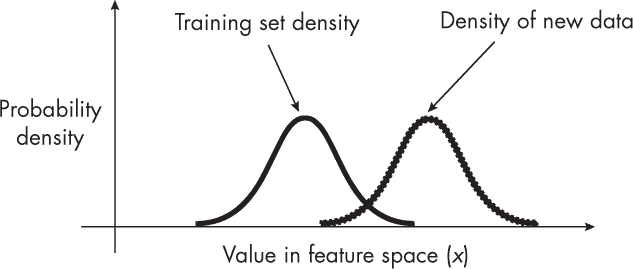
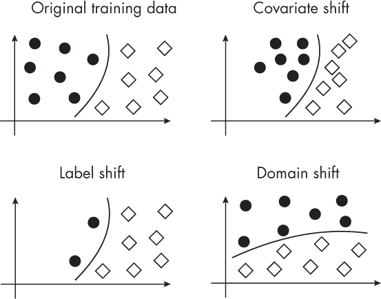

## 第二十三章：数据分布转移**

我们在模型部署后可能遇到的主要数据分布转移类型有哪些？

*数据分布转移* 是将机器学习和人工智能模型投入生产时最常见的问题之一。简而言之，它们指的是模型训练时使用的数据分布与模型在现实世界中遇到的数据分布之间的差异。通常，这些变化会导致模型性能显著下降，因为模型的预测不再准确。

数据分布转移有几种类型，其中有些比其他的更具挑战性。最常见的类型包括协变量转移、概念漂移、标签转移和领域转移；这些将在以下章节中详细讨论。

### **协变量转移**

假设 *p*(*x*) 描述了输入数据（例如特征）的分布，*p*(*y*) 指的是目标变量（或类别标签分布）的分布，而 *p*(*y*|*x*) 是给定输入 *x* 时，目标 *y* 的条件分布。

*协变量转移* 发生在输入数据 *p*(*x*) 的分布发生变化时，但给定输入时输出的条件分布 *p*(*y*|*x*) 保持不变。

图 23-1 说明了协变量转移，其中训练数据的特征值和生产过程中遇到的新数据都遵循正态分布。然而，新数据的均值已经与训练数据发生了变化。

*图 23-1：训练数据和新数据的分布在协变量转移下有所不同。*

例如，假设我们训练了一个模型来预测一封邮件是否为垃圾邮件，依据是特定的特征。现在，当我们将邮件垃圾邮件过滤器嵌入到邮件客户端后，客户收到的邮件信息具有截然不同的特征。例如，邮件内容要长得多，而且是从不同时间区的某个人发送的。然而，如果这些特征与邮件是否为垃圾邮件之间的关系没有变化，那么我们就遇到了协变量转移（covariate shift）。

协变量转移是部署机器学习模型时非常常见的挑战。它意味着模型在生产环境中接收到的数据与训练时使用的数据不同。然而，由于在协变量转移下，输入和输出之间的关系 *p*(*y*|*x*) 保持不变，因此可以采用一些技术来进行调整。

检测协变量漂移的一种常见技术是*对抗验证*，在第二十九章中有更详细的讨论。一旦检测到协变量漂移，常用的方法是*重要性加权*，它为训练样本分配不同的权重，以便在训练过程中强调或减弱某些实例。本质上，更可能出现在测试分布中的实例会被赋予更大的权重，而不太可能出现的实例则赋予较小的权重。这种方法使模型能够在训练过程中更多地关注代表测试数据的实例，从而使模型对协变量漂移更加鲁棒。

### **标签漂移**

*标签漂移*，有时也称为*先验概率漂移*，发生在类标签分布*p*(*y*)发生变化时，但类条件分布*p*(*y*|*x*)保持不变。换句话说，标签分布或目标变量发生了显著变化。

举一个这样的场景的例子，假设我们训练了一个电子邮件垃圾邮件分类器，训练数据集中的垃圾邮件和非垃圾邮件各占 50%。然而，在现实世界中，只有 10%的电子邮件是垃圾邮件。

解决标签漂移的一种常见方法是使用加权损失函数更新模型，尤其是当我们了解标签的新分布时。这本质上是一种重要性加权。通过根据新标签分布调整损失函数中的权重，我们鼓励模型更加关注在新数据中变得更加常见（或更少见）的某些类。这有助于使模型的预测更符合当前的实际情况，从而提高其在新数据上的表现。

### **概念漂移**

*概念漂移*指的是输入特征与目标变量之间映射的变化。换句话说，概念漂移通常与条件分布*p*(*y*|*x*)的变化相关，例如输入*x*与输出*y*之间的关系变化。

使用前一节中垃圾邮件分类器的例子，电子邮件的特征可能保持不变，但*这些特征与电子邮件是否是垃圾邮件的关系*可能会发生变化。这可能是由于一种新的垃圾邮件策略，这种策略在训练数据中并不存在。概念漂移比目前讨论的其他分布漂移更难处理，因为它需要持续监控并可能需要重新训练模型。

### **领域漂移**

在文献中，*领域漂移*和*概念漂移*这两个术语的使用有些不一致，有时被认为是可以互换的。实际上，这两者是相关但稍有不同的现象。*概念漂移*指的是从输入到输出的映射函数的变化，特别是指随着时间推移，收集更多数据时，特征与目标变量之间的关系发生变化的情况。

在*领域漂移*中，输入的分布 *p*(*x*) 和给定输入的输出条件分布 *p*(*y*|*x*) 都发生变化。这有时也被称为*联合分布漂移*，因为联合分布 *p*(*x* 和 *y*) = *p*(*y*|*x*) *· p*(*x*)。因此，我们可以将领域漂移视为协变量漂移和概念漂移的结合。

此外，由于我们可以通过对变量 *x* 上的联合分布 *p*(*x*, *y*) 积分来获得边际分布 *p*(*y*)（数学表达为 *p*(*y*) = ∫ *p*(*x*, *y*) *dx*），协变量漂移和概念漂移也意味着标签漂移。（然而，可能存在某些例外情况，其中 *p*(*x*) 的变化可以补偿 *p*(*y*|*x*) 的变化，从而 *p*(*y*) 可能不会改变。）相反，标签漂移和概念漂移通常也意味着协变量漂移。

再次以电子邮件垃圾分类为例，领域漂移意味着特征（电子邮件的内容和结构）*以及*特征与目标之间的关系随着时间的推移发生变化。例如，2023 年的垃圾邮件可能有不同的特征（新的钓鱼方案、新的语言等），并且垃圾邮件的定义可能也发生了变化。这种类型的漂移对于基于 2020 年数据训练的垃圾邮件过滤器来说是最具挑战性的场景，因为它必须适应输入数据和目标概念的变化。

领域漂移可能是最难处理的漂移类型，但随着时间的推移，监控模型性能和数据统计可以帮助及早检测到领域漂移。一旦检测到，缓解策略包括从目标领域收集更多的标注数据，并重新训练或调整模型。

### **数据分布漂移的类型**

图 23-2 提供了二分类问题背景下不同类型数据漂移的视觉总结，其中黑色圆圈表示来自一个类的示例，而菱形表示来自另一个类的示例。

*图 23-2：二分类背景下不同类型数据漂移的总结*

如前所述，某些类型的分布漂移比其他类型更具挑战性。最不具问题的是通常被称为协变量漂移。在这种情况下，输入特征的分布 *p*(*x*) 在训练数据和测试数据之间发生变化，但给定输入的输出条件分布 *p*(*y*|*x*) 保持不变。由于输入和输出之间的基本关系保持不变，因此基于训练数据训练的模型原则上仍可以应用于测试数据和新数据。

最具问题的分布偏移类型通常是联合分布偏移，其中输入分布 *p*(*x*) 和条件输出分布 *p*(*y*|*x*) 都发生变化。这使得模型特别难以调整，因为从训练数据中学到的关系可能不再成立。模型必须应对新的输入模式以及基于这些模式做出预测的新规则。

然而，偏移的“严重性”可能因实际情况而异。例如，即使是协变量偏移，如果偏移严重，或者模型无法适应新的输入分布，可能会变得非常棘手。另一方面，如果偏移相对较小，或者我们能够获得足够的新分布的标注数据以重新训练模型，那么联合分布偏移可能是可以管理的。

一般来说，监控模型的性能并意识到数据分布可能发生的变化至关重要，以便在必要时采取适当的措施。

### **练习**

**23-1.** 使用重要性加权作为缓解协变量偏移的技术存在什么主要问题？

**23-2.** 在实际场景中，尤其是当我们无法获得新数据的标签时，我们如何检测这些类型的偏移？

### **参考文献**

+   避免领域偏移的高级缓解技术推荐与指引：Abolfazl Farahani 等人，《领域适应的简要回顾》（2020），* [`arxiv.org/abs/2010.03978`](https://arxiv.org/abs/2010.03978) *。
