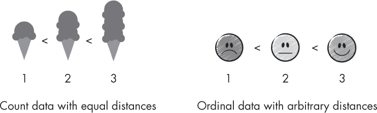

## 第二十四章：泊松回归与顺序回归**

何时应优先使用泊松回归而非顺序回归，反之亦然？

我们通常在目标变量表示计数数据（正整数）时使用泊松回归。举一个计数数据的例子，考虑飞机上感染的感冒次数，或者某天餐馆的客人数量。除了目标变量表示计数之外，数据还应符合泊松分布，这意味着均值和方差大致相同。（对于较大的均值，我们可以使用正态分布来近似泊松分布。）

*顺序数据*是类别数据的一个子类别，其中类别具有自然的顺序，例如 1 < 2 < 3，如图 24-1 所示。顺序数据通常表示为正整数，可能看起来类似于计数数据。例如，考虑亚马逊的星级评分（1 星，2 星，3 星，依此类推）。然而，顺序回归并不对排序类别之间的距离做任何假设。考虑以下疾病严重度的衡量标准：*严重 > 中等 > 轻微 > 无*。虽然我们通常将疾病严重度变量映射为整数表示（4 > 3 > 2 > 1），但并没有假设 4 和 3（严重和中等）之间的距离与 2 和 1（轻微和无）之间的距离相同。

*图 24-1：顺序类别之间的距离是任意的。*

简而言之，我们使用泊松回归处理计数数据。当我们知道某些结果是“更高”或“更低”时，但不确定具体差距或是否重要时，我们使用顺序回归。

### **习题**

**24-1.** 假设我们想预测一个足球运动员在特定赛季中进球的数量。我们应该使用顺序回归还是泊松回归来解决这个问题？

**24-2.** 假设我们让某人根据他们的偏好顺序排序他们最近观看的三部电影。忽略这个数据集对于机器学习来说有点太小，我们应该使用哪种方法来处理这种数据？
