## 第二十五章：**置信区间**

构建机器学习分类器置信区间的不同方法有哪些？

有几种构建机器学习模型置信区间的方法，这取决于模型类型和数据的性质。例如，某些方法在处理深度神经网络时计算成本高昂，因此更适合于资源较少的机器学习模型。其他方法则需要更大的数据集才能可靠。

下面是构建置信区间的最常见方法：

+   基于测试集构建正态近似区间

+   **自举训练集**

+   对测试集预测进行自举

+   使用不同的随机种子重新训练模型的置信区间

在更深入审查这些内容之前，让我们简要回顾一下置信区间的定义和解释。

### **定义置信区间**

*置信区间*是一种估计未知总体参数的方法。*总体参数*是统计总体的特定度量，例如平均值或比例。通过“特定”度量，我指的是对于整个总体而言，该参数有一个单一的确切值。尽管这个值可能未知并且通常需要从样本中估计，但它是总体的固定和确定的特征。*统计总体*则是我们研究的所有项目或个体的完整集合。

在机器学习的背景下，总体可以被认为是模型可能遇到的所有可能实例或数据点的整体集合，我们通常最感兴趣的参数是模型在这个总体上的真实泛化准确性。

我们在测试集上测量的准确性估计了真实的泛化准确性。但是，由于我们使用了特定的测试实例样本，这种测量受到随机误差的影响。这就是置信区间的概念发挥作用的地方。泛化准确性的 95%置信区间为我们提供了一个范围，在这个范围内我们可以相当确定真实的泛化准确性。

例如，如果我们取 100 个不同的数据样本，并为每个样本计算 95%置信区间，大约有 100 个置信区间中的 95 个将包含真实的总体值（例如泛化准确性），如图 25-1 所示。

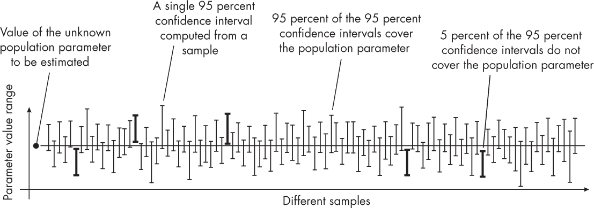

*图 25-1：95%置信区间的概念*

更具体地说，如果我们从总体中抽取 100 个不同的代表性测试集，并计算每个测试集的 95%置信区间，我们预期大约有 95 个这些区间将包含真实的泛化准确性。

我们可以通过几种方式来展示置信区间。常见的做法是使用条形图表示，其中条形的顶部代表参数值（例如，模型准确度），而胡须表示置信区间的上下限（图 25-2 的左侧图）。另外，也可以像图 25-2 的右侧图那样，直接展示没有条形的置信区间。

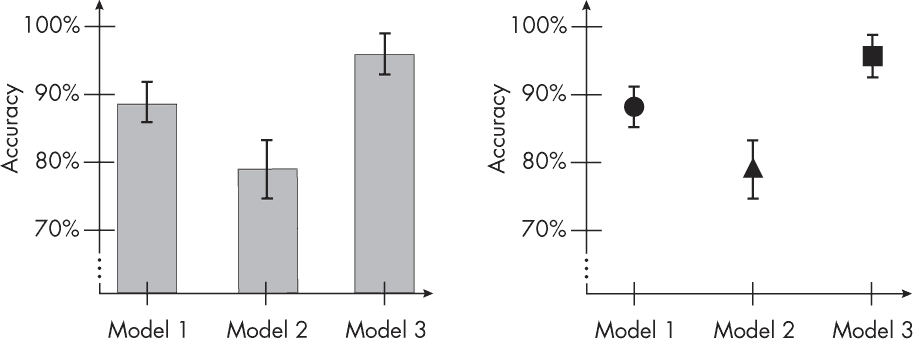

*图 25-2：两种常见的绘图变体用于说明置信区间*

这种可视化在多方面都非常有用。例如，当两个模型性能的置信区间*不*重叠时，这是一个强烈的视觉指示，表明两者的性能有显著差异。以统计显著性检验为例，如 t 检验：如果两个 95% 的置信区间不重叠，这强烈表明这两个测量值之间的差异在 0.05 的显著性水平上是统计显著的。

另一方面，如果两个 95% 的置信区间重叠，我们不能自动得出两个测量值之间没有显著差异的结论。即使置信区间重叠，仍然可能存在统计上显著的差异。

另外，为了提供更详细的关于确切数值的信息，我们可以使用表格视图来表达置信区间。两种常见的表示方法总结在表 25-1 中。

**表 25-1：** 置信区间

| 模型 | 数据集 A | 数据集 B | 数据集 C |
| --- | --- | --- | --- |
| 1 | 89.1% *±* 1.7% | . . . | . . . |
| 2 | 79.5% *±* 2.2% | . . . | . . . |
| 3 | 95.2% *±* 1.6% | . . . | . . . |
| **模型** | **数据集 A** | **数据集 B** | **数据集 C** |
| 1 | 89.1% (87.4%, 90.8%) | . . . | . . . |
| 2 | 79.5% (77.3%, 81.7%) | . . . | . . . |
| 3 | 95.2% (93.6%, 96.8%) | . . . | . . . |

如果置信区间是*对称的*，即上下端点距离估计参数的距离相等，那么通常更倾向于使用*±*符号。或者，也可以明确地写出上下置信区间。

### **方法**

接下来的部分将描述构建置信区间的四种最常见的方法。

#### ***方法 1：正态近似区间***

正态近似区间是通过单次训练-测试分割生成置信区间的。它通常被认为是计算置信区间最简单和最传统的方法。这种方法在深度学习领域特别受欢迎，因为训练模型的计算成本较高。当我们只对评估特定模型感兴趣，而不是像在*k*-折交叉验证中那样使用训练于不同数据划分的模型时，这种方法也更为理想。

它是如何工作的？简而言之，计算预测参数的置信区间的公式（例如，样本均值，用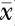表示），假设数据服从正态分布，可以表示为  *± z × SE*。

在这个公式中，*z*表示*z*-得分，它表示一个特定值距离标准正态分布均值的标准差数。*SE*表示预测参数的标准误差（在这种情况下，是样本均值）。

**注意**

*大多数读者应该熟悉* z*-得分表，这些表通常出现在入门统计学教材的后面。然而，更方便且更受欢迎的获取* z*-得分的方式是使用像 SciPy 的* stats.zscore *函数，它可以计算给定置信水平的* z*-得分。*

对于我们的场景，样本均值，用表示，等同于测试集准确度，ACC[test]，这是在二项分布比例置信区间中衡量成功预测的指标。

在正态近似下，标准误差可以按以下方式计算：

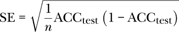

在这个方程中，*n*表示测试集的大小。将标准误差代入前面的公式中，我们得到以下结果：

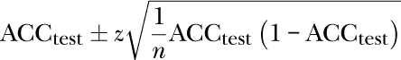

实现该方法的附加代码示例也可以在补充代码库的*补充/q25_confidence-intervals*子文件夹中找到，地址为*[`github.com/rasbt/MachineLearning-QandAI-book`](https://github.com/rasbt/MachineLearning-QandAI-book)*。

尽管由于其简单性，正态近似区间方法非常流行，但它也有一些缺点。首先，正态近似可能并不总是准确，尤其是对于小样本量或数据不服从正态分布的情况。在这种情况下，其他计算置信区间的方法可能更为准确。其次，使用单一的训练-测试划分不能提供关于模型在不同数据划分下表现的变异性的信息。如果模型的表现高度依赖于特定的划分，这可能会成为一个问题，尤其是在数据集较小或数据变异性较大时。

#### ***方法 2：自助法训练集***

置信区间作为一种工具，用于近似未知参数。然而，当我们仅限于一个估计时，比如从单一测试集中得出的准确度，我们必须做出一些假设才能使其有效。例如，当我们使用前面章节中描述的正态近似区间时，我们假设数据服从正态分布，但这可能成立，也可能不成立。

在一个完美的场景中，我们可以更深入地了解我们的测试集样本分布。然而，这需要访问许多独立的测试数据集，这通常是不可行的。一个解决方法是自助法，它通过重新抽样现有数据来估计抽样分布。

**注意**

*实际上，当测试集足够大时，由于中心极限定理，正态分布的近似将成立。该定理表明，大量独立同分布的随机变量的和（或平均值）将趋近于正态分布，无论个别变量的基础分布如何。很难确切指定什么样的测试集算足够大。然而，在比中心极限定理更强的假设下，我们至少可以利用贝里–埃森定理估计收敛到正态分布的速度，这为我们提供了收敛速度的量化估计。*

在机器学习中，我们可以取原始数据集并进行带有替换的随机抽样。如果数据集大小为 *n*，并且我们进行大小为 *n* 的带替换随机抽样，这意味着某些数据点可能会在这个新样本中重复，而其他数据点根本没有被抽取。然后，我们可以重复这个过程多次，得到多个训练集和测试集。这个过程称为 *袋外自助法*，如图 25-3 所示。

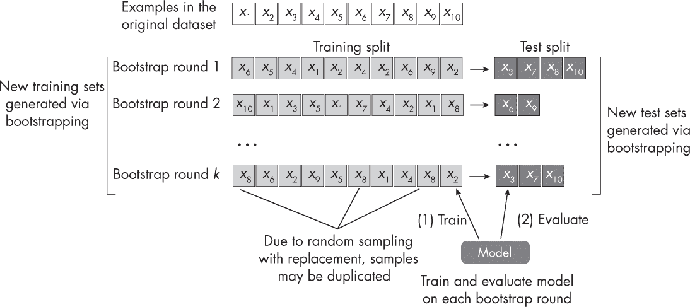

*图 25-3：袋外自助法在重新抽样的训练集上评估模型。*

假设我们构建了 *k* 个训练集和测试集。我们现在可以利用这些划分来训练和评估模型，以获得 *k* 次测试集的准确度估计值。考虑到这些测试集准确度估计值的分布，我们可以取 2.5 百分位和 97.5 百分位之间的范围来获得 95%的置信区间，如图 25-4 所示。

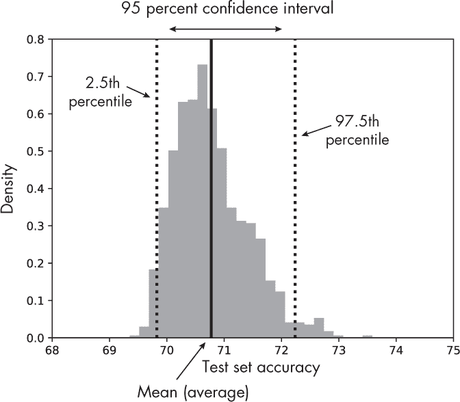

*图 25-4：来自 1,000 次自助样本的测试准确度分布，包括 95%的置信区间*

与正态近似区间方法不同，我们可以认为这种袋外自助法更不依赖于具体的分布。理想情况下，如果正态近似的假设得到满足，两种方法将会产生相同的结果。

由于自助法依赖于重新抽样现有的测试数据，它的缺点是无法引入来自更广泛人群或未见数据的任何新信息。因此，它可能无法始终将模型的表现推广到新的、未见的数据。

请注意，本章使用的是自助抽样方法，而不是通过*k*-折交叉验证获取训练-测试集划分，因为自助抽样方法在中央极限定理的理论基础上具有更强的支持。还有更高级的袋外自助抽样方法，如.632 和.632+估计，它们通过重新加权精度估计来进行改进。

#### ***方法 3：自助抽样测试集预测***

自助抽样训练集的替代方法是自助抽样测试集。其思想是按常规在现有的训练集上训练模型，然后在自助抽样的测试集上评估模型，如图 25-5 所示。在获得测试集的性能估计后，我们可以应用前一节中描述的百分位方法。

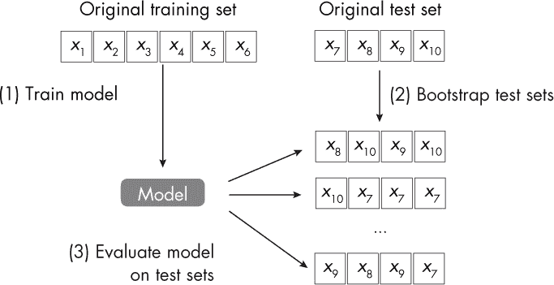

*图 25-5：自助抽样测试集*

与之前的自助抽样技术不同，这种方法使用已经训练好的模型，仅对测试集进行重采样（而不是训练集）。这种方法特别适用于评估深度神经网络，因为它不需要在新的数据划分上重新训练模型。然而，这种方法的一个缺点是，它不能评估模型对训练数据小变化的敏感性。

#### ***方法 4：使用不同随机种子重新训练模型***

在深度学习中，模型通常会使用不同的随机种子进行重新训练，因为某些随机权重初始化可能会导致比其他初始化更好的模型。我们如何从这些实验中构建置信区间？如果我们假设样本均值服从正态分布，那么我们可以采用之前讨论过的方法，在样本均值周围计算置信区间，记作 ，如下所示：

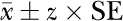

由于在这种情况下，我们通常处理的样本数量相对较少（例如，从 5 到 10 个随机种子的模型），因此假设*t*分布比正态分布更为适用。因此，我们在之前的公式中将*z*值替换为*t*值。（随着样本量的增加，*t*分布趋向于与标准正态分布相似，而临界值[*z*和*t*]也会越来越接近。）

此外，如果我们关心平均精度，记作 ，我们将 ACC[test, *j*]，即对应于唯一随机种子*j*的精度，视为一个样本。我们评估的随机种子数量将构成样本大小*n*。因此，我们将计算：

这里，SE 是标准误差，计算公式为 ，而

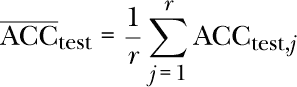

是平均精度，我们在*r*个随机种子上计算得到。标准差 SD 的计算公式如下：

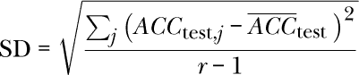

总结来说，使用不同随机种子计算置信区间是另一种有效的替代方案。然而，它主要对深度学习模型有益。与正态近似法（方法 1）和自助法测试集（方法 3）相比，它的成本更高，因为它需要重新训练模型。好的一面是，来自不同随机种子的结果为我们提供了对模型稳定性的深入理解。

### **建议**

构建置信区间的每种方法都有其独特的优缺点。正态近似区间计算便宜，但依赖于分布的正态性假设。袋外自助法对这些假设无偏见，但计算开销大。一个更便宜的替代方案是仅对测试集进行自助法，但这涉及对较小的数据集进行自助抽样，可能会对小规模或非代表性的测试集产生误导。最后，从不同的随机种子构建置信区间虽然计算成本高，但能为我们提供关于模型稳定性的额外见解。

### **练习**

**25-1.** 如前所述，最常见的置信度选择是 95%的置信区间。然而，90%和 99%也很常见。90%的置信区间比 95%的置信区间更小还是更大，为什么会这样？

**25-2.** 在《方法 3：自助法测试集预测》（第 169 页）中，我们通过自助抽样创建了测试集，然后应用已训练的模型计算每个数据集上的测试集准确性。你能想到一种方法或修改来更高效地获得这些测试准确性吗？

### **参考文献**

+   详细讨论了从不重叠置信区间得出统计显著性结论的陷阱：Martin Krzywinski 和 Naomi Altman，《误差条》（2013），*［https://www.nature.com/articles/nmeth.2659](https://www.nature.com/articles/nmeth.2659)*。

+   关于二项比例置信区间的更详细解释：*［https://en.wikipedia.org/wiki/Binomial_proportion_confidence_interval](https://en.wikipedia.org/wiki/Binomial_proportion_confidence_interval)*。

+   关于正态近似区间的详细解释，请参见我的文章第 1.7 节：“机器学习中的模型评估、模型选择和算法选择”（2018），*［https://arxiv.org/abs/1811.12808](https://arxiv.org/abs/1811.12808)*。

+   关于独立同分布随机变量的中心极限定理的更多信息：*［https://en.wikipedia.org/wiki/Central_limit_theorem](https://en.wikipedia.org/wiki/Central_limit_theorem)*。

+   更多关于 Berry–Esseen 定理的信息：*［https://en.wikipedia.org/wiki/Berry–Esseen_theorem](https://en.wikipedia.org/wiki/Berry%E2%80%93Esseen_theorem)*。

+   .632 自助法解决了常规袋外自助法方法的悲观偏差：Bradley Efron，“估计预测规则的错误率：交叉验证的改进”（1983），*[`www.jstor.org/stable/2288636`](https://www.jstor.org/stable/2288636)*。

+   .632+ 自助法修正了在 .632 自助法中引入的乐观偏差：Bradley Efron 和 Robert Tibshirani，“交叉验证的改进：.632+ 自助法”（1997），*[`www.jstor.org/stable/2965703`](https://www.jstor.org/stable/2965703)*。

+   讨论引导测试集预测的深度学习研究论文：Benjamin Sanchez-Lengeling 等人，“香气的机器学习：学习小分子的通用感知表示”（2019），*[`arxiv.org/abs/1910.10685`](https://arxiv.org/abs/1910.10685)*。
