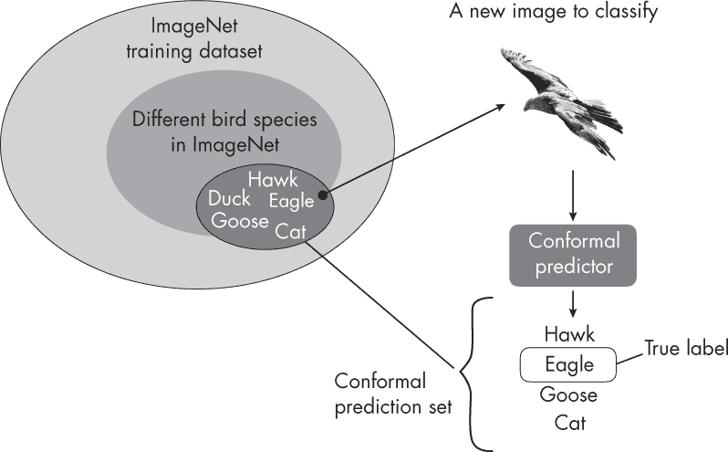

## 第二十六章：**置信区间与保守预测**

置信区间和保守预测之间的区别是什么，我们什么时候使用一个而非另一个？

置信区间和保守预测都是统计方法，用于估计未知总体参数的可能值范围。如第二十五章所讨论，置信区间量化了总体参数落在某个区间内的置信程度。例如，95%置信区间意味着，如果我们从总体中多次抽取样本，并为每个样本计算 95%置信区间，我们期望总体的真实均值（平均值）95%的时间会落在这些区间内。第二十五章介绍了几种应用该方法来估计机器学习模型预测性能的技术。另一方面，保守预测通常用于创建预测区间，旨在以某种概率覆盖真实结果。

本章简要解释了什么是预测区间以及它如何与置信区间不同，然后解释了保守预测是如何被松散地认为是一种构建预测区间的方法。

### **置信区间与预测区间**

而置信区间侧重于描述整个总体的参数，*预测区间*则提供单个预测目标值的范围。例如，考虑预测人们身高的问题。假设我们从总体中抽取了 10,000 人的样本，我们可能得出平均身高为 5 英尺 7 英寸的结论。我们还可能计算出该平均值的 95%置信区间，范围从 5 英尺 6 英寸到 5 英尺 8 英寸。

然而，*预测区间*关注的不是估计总体的高度，而是估计单个个体的高度。例如，假设体重为 185 磅，一个人的预测区间可能介于 5 英尺 8 英寸和 6 英尺之间。

在机器学习模型的背景下，我们可以使用置信区间来估计一个总体参数，比如模型的准确性（指的是在所有可能的预测场景中的表现）。相反，预测区间估计的是对于单个给定输入示例的输出值范围。

### **预测区间与保守预测**

保守预测和预测区间都是估计个体模型预测不确定性的统计技术，但它们通过不同的方式和不同的假设进行操作。

虽然预测区间通常假设特定的数据分布，并与特定类型的模型相关联，但保守预测方法是不依赖分布的，可以应用于任何机器学习算法。

简而言之，我们可以将符合预测看作是比预测区间更灵活、更具可泛化性的预测形式。然而，符合预测通常比传统的构建预测区间的方法需要更多的计算资源，而传统方法涉及重新采样或排列技术。

### **预测区域、区间和集合**

在符合预测的上下文中，术语*预测区间*、*预测集*和*预测区域*用于表示给定实例的可能输出。使用的术语类型取决于任务的性质。

在回归任务中，输出是连续变量，*预测区间*提供了一个范围，真实值预计会以一定的置信度落在该范围内。例如，一个模型可能预测房价在 20 万美元到 25 万美元之间。

在分类任务中，输出是离散变量（类标签），*预测集*包含了所有被认为是给定实例的可能预测的类标签。例如，一个模型可能预测图像显示的是猫、狗或鸟。

*预测区域*是一个更通用的术语，既可以指预测区间，也可以指预测集。它描述了模型认为可能的输出集合。

### **计算符合预测**

既然我们已经介绍了置信区间和预测区域之间的差异，并了解了符合预测方法与预测区间的关系，那么符合预测究竟是如何工作的呢？

简而言之，符合预测方法提供了一个框架，用于创建预测区域，即预测任务的潜在结果集合。根据构建这些区域所使用的假设和方法，这些区域被设计为以一定的概率包含真实结果。

对于分类器，给定输入的预测区域是一个标签集合，该集合包含具有给定置信度（通常为 95%）的真实标签，如图 26-1 所示。

*图 26-1：分类任务的预测区域*

如图 26-1 所示，ImageNet 数据集包含了一部分鸟类物种。在 ImageNet 中，一些鸟类物种属于以下几类之一：*鹰*、*鸭子*、*老鹰*或*鹅*。ImageNet 还包含其他动物，例如猫。对于一个新图像（这里是老鹰），符合预测集包含了那些类标签，其中真实标签*老鹰*以 95%的概率包含在此集合中。通常，这包括紧密相关的类别，如这里的*鹰*和*鹅*。然而，预测集也可能包含关系较远的类别标签，如*猫*。

为了逐步描述计算预测区域的概念，假设我们为图像训练一个机器学习分类器。在训练模型之前，数据集通常会分成三部分：训练集、校准集和测试集。我们使用训练集来训练模型，使用校准集来获取符合预测区域的参数。然后，我们可以使用测试集来评估符合预测器的性能。一个典型的分割比例可能是 60%的训练数据，20%的校准数据和 20%的测试数据。

在训练模型之后，第一步是定义一个*不符合度度量*，这是一个根据实例的“异常”程度将数值分配给每个校准集实例的函数。这可以基于与分类器决策边界的距离，或者更常见的是 1 减去类别标签的预测概率。得分越高，实例越异常。

在对新数据点使用符合预测之前，我们使用校准集中的不符合度得分来计算分位数阈值。这个阈值是一个概率水平，例如，在选择 95%的置信水平时，校准集中 95%的实例的不符合度得分低于此阈值。然后，使用该阈值来确定新实例的预测区域，确保预测符合所需的置信水平。

一旦我们获得了阈值，就可以计算新数据的预测区域。在这里，对于给定实例的每个可能的类别标签（分类器的每个可能输出），我们检查其不符合度得分是否低于阈值。如果低于该阈值，则将其包括在该实例的预测集内。

### **一个符合预测的例子**

让我们通过一个简单的符合预测方法，称为*得分方法*，来说明这个符合预测的过程。假设我们在训练集上训练了一个分类器，用于区分三种鸟类：麻雀、知更鸟和鹰。假设校准数据集的预测概率如下：

**麻雀**    [0.95, 0.9, 0.85, 0.8, 0.75]

**知更鸟**    [0.7, 0.65, 0.6, 0.55, 0.5]

**鹰**    [0.4, 0.35, 0.3, 0.25, 0.2]

如图所示，我们有一个包含 15 个示例的校准集，每个类别 5 个示例。请注意，分类器会为每个训练示例返回三个概率得分：一个对应于每个类别（*麻雀*、*知更鸟*和*鹰*）。然而，在这里我们只选择了真实类别标签的概率。例如，我们可能会得到[0.95, 0.02, 0.03]，这是第一个校准示例的预测概率，其真实标签是*麻雀*。在这种情况下，我们只保留了 0.95。

接下来，在获得之前的概率得分后，我们可以通过 1 减去概率来计算不符合度得分，如下所示：

**麻雀**    [0.05, 0.1, 0.15, 0.2, 0.25]

**知更鸟**    [0.3, 0.35, 0.4, 0.45, 0.5]

**鹰**    [0.6, 0.65, 0.7, 0.75, 0.8]

考虑到 0.95 的置信水平，我们现在选择一个阈值，使得 95%的非一致性分数低于该阈值。根据这个例子中的非一致性分数，阈值为 0.8。然后，我们可以使用这个阈值来构建我们想要分类的新实例的预测集。

现在假设我们有一个新的实例（一个新的鸟类图像），我们想要对其进行分类。我们计算该新鸟图像的非一致性分数，假设它属于训练集中的每个鸟类物种（类标签）：

**麻雀**    0.26

**知更鸟**    0.45

**鹰**    0.9

在这种情况下，*麻雀*和*知更鸟*的非一致性分数低于 0.8 的阈值。因此，这个输入的预测集为[*麻雀*，*知更鸟*]。换句话说，这告诉我们，平均而言，真实的类标签会在 95%的时间内被包含在预测集中。

一个实现分数方法的实用代码示例可以在*补充文件夹/q26_conformal-prediction*中找到，网址为*[`github.com/rasbt/MachineLearning-QandAI-book`](https://github.com/rasbt/MachineLearning-QandAI-book)*。

### **保守预测的好处**

与使用分类器返回的类成员概率不同，保守预测的主要优势在于其理论保证和普适性。保守预测方法并不对数据的分布或所使用的模型做出任何强假设，并且可以与任何现有的机器学习算法结合使用，以提供预测的置信度度量。

置信区间具有渐近覆盖保证，这意味着随着样本（测试集）大小趋于无穷大，覆盖保证保持有效。这并不意味着置信区间仅适用于非常大的样本大小，而是它们的性质随着样本大小的增加变得更加稳健。因此，置信区间依赖于渐近性质，意味着它们的保证在样本大小增长时变得更加强大。

相比之下，保守预测提供了有限样本的保证，确保无论样本大小如何，都能实现覆盖概率。例如，如果我们为保守预测方法指定 95%的置信水平，并生成 100 个校准集及其相应的预测集，该方法将确保 100 个测试点中有 95 个包含真实类标签。这一结果不受校准集大小的影响。

虽然保守预测有许多优点，但它并不总是提供最紧密的预测区间。有时，如果特定分类器的基本假设成立，该分类器自身的概率估计可能提供更紧密、更具信息性的区间。

### **建议**

置信区间告诉我们关于模型属性的不确定性水平，比如分类器的预测准确性。预测区间或符合性预测输出告诉我们关于模型中某个特定预测的不确定性水平。两者对于理解模型的可靠性和性能都非常重要，但它们提供的是不同类型的信息。

例如，模型预测准确性的置信区间有助于比较和评估模型，并决定部署哪个模型。另一方面，预测区间有助于在实践中使用模型并理解其预测。例如，它可以帮助识别模型不确定的情况，这时可能需要额外的数据、人类监督或采用不同的方法。

### **练习**

**26-1.** 预测集的大小可能会在不同实例之间有所不同。例如，对于一个实例，预测集的大小可能为 1，而对于另一个实例，预测集的大小可能为 3。预测集的大小告诉我们什么？

**26-2.** 第二十五章和第二十六章集中讨论了分类方法。我们能否也使用符合性预测和置信区间进行回归呢？

### **参考文献**

+   MAPIE 是一个流行的 Python 中用于符合性预测的库：*[`mapie.readthedocs.io/`](https://mapie.readthedocs.io/)*。

+   关于本章中使用的评分方法，详见：Christoph Molnar，*《Python 中的符合性预测介绍》*（2023），*[`christophmolnar.com/books/conformal-prediction/`](https://christophmolnar.com/books/conformal-prediction/)*。

+   除了评分方法外，还有几种符合性预测方法的变体。有关符合性预测文献和资源的全面集合，请参见 Awesome Conformal Prediction 页面：*[`github.com/valeman/awesome-conformal-prediction`](https://github.com/valeman/awesome-conformal-prediction)*。
