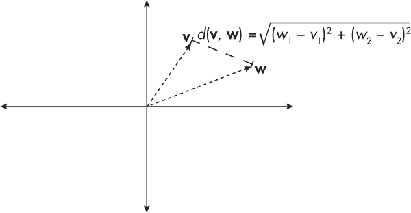
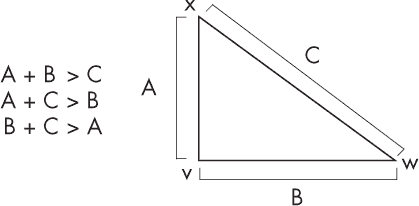
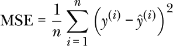
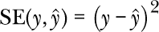
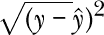
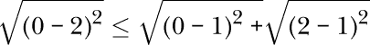
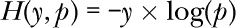
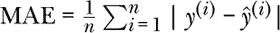
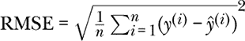

## 第二十七章：适当度量**

距离函数的三个性质是什么，才能使其成为*适当的*度量？

度量是数学、计算机科学以及其他多个科学领域的基础。了解定义良好的距离函数的基本性质，以衡量点或数据集之间的距离或差异是非常重要的。例如，在处理神经网络中的损失函数时，理解这些函数是否像适当的度量一样表现，可以帮助了解优化算法如何收敛到一个解。

本章分析了两种常用的损失函数——均方误差和交叉熵损失，以演示它们是否符合适当度量标准的要求。

### **标准**

为了说明适当度量的标准，我们考虑两个向量或点 **v** 和 **w** 以及它们之间的距离 *d*(**v**, **w**)，如图 27-1 所示。

*图 27-1：两个二维向量之间的欧几里得距离*

适当度量的标准如下：

+   两点之间的距离始终是非负的，*d*(**v**, **w**) *≥* 0，只有当两点相同，即**v** = **w**时，距离才为 0。

+   距离是对称的；例如，*d*(**v**, **w**) = *d*(**w**, **v**)。

+   距离函数满足三角不等式，对任意三个点：**v**、**w**、**x**，意味着 *d*(**v**, **w**) *≤* *d*(**v**, **x**) + *d*(**x**, **w**)。

为了更好地理解三角不等式，想象这些点是三角形的顶点。如果我们考虑任何一个三角形，两边之和总是大于第三边，如图 27-2 所示。

*图 27-2：三角不等式*

思考一下，如果图 27-2 中描述的三角不等式不成立，会发生什么。如果 AB 边和 BC 边的长度之和短于 AC 边，那么 AB 边和 BC 边就无法相交形成一个三角形；相反，它们会相互错开。因此，它们相交并形成三角形，证明了三角不等式的成立。

### **均方误差**

*均方误差 (MSE)* 损失计算目标变量 *y* 和预测目标值 *ŷ* 之间的平方欧几里得距离：

索引 *i* 表示数据集或样本中的第 *i* 个数据点。这个损失函数是适当的度量吗？

为了简化起见，我们将考虑两个数据点之间的*平方误差 (SE)* 损失（尽管以下的见解也适用于均方误差 MSE）。如以下公式所示，SE 损失量化了预测值与实际值之间的平方差，对于单个数据点而言，而 MSE 损失则是将这些平方差在数据集中的所有数据点上求平均：

在这种情况下，SE 满足第一个标准的第一部分：两个点之间的距离总是非负的。由于我们将差值平方，因此它不能是负数。

第二个标准如何呢？即只有当两个点相同时，距离才可以为 0？由于在平方误差（SE）中的减法操作，可以直观地看出，只有当预测值与目标变量匹配时，*y* = *ŷ*，它才能为 0。与第一个标准一样，我们可以通过平方来确认 SE 满足第二个标准：我们有(*y* – *ŷ*)² = (*ŷ* – *y*)²。

初看之下，似乎平方误差损失也满足第三个标准，即三角不等式。直观上，你可以通过选择三个任意数字来检查这一点，这里是 1, 2, 3：

+   (1 – 2)² *≤* (1 – 3)² + (2 – 3)²

+   (1 – 3)² *≤* (1 – 2)² + (2 – 3)²

+   (2 – 3)² *≤* (1 – 2)² + (1 – 3)²

然而，存在一些值使得此公式不成立。例如，考虑值 *a* = 0, *b* = 2, 和 *c* = 1。这样我们得到 *d*(*a*, *b*) = 4, *d*(*a*, *c*) = 1, 和 *d*(*b*, *c*) = 1，产生以下情形，这违反了三角不等式：

+   (0 – 2)² ≰ (0 – 1)² + (2 – 1)²

+   (2 – 1)² *≤* (0 –1)² + (0 – 2)²

+   (0 – 1)² *≤* (0 –2)² + (1 – 2)²

由于以上示例不满足三角不等式，我们得出结论，(均方)误差损失不是一个合适的度量标准。

然而，如果我们将平方误差转变为*根平方误差*

三角不等式可以得到满足：

**注意**

*你可能熟悉* L*[2] 距离或欧几里得距离，它已知满足三角不等式。这两种距离度量在考虑两个标量值时与根平方误差等价。*

### **交叉熵损失**

*交叉熵*用于衡量两个概率分布之间的距离。在机器学习中，当我们训练逻辑回归或神经网络分类器，在包含*n*个训练样本的数据集上时，我们使用类标签 *y* 和预测概率 *p* 之间的离散交叉熵损失（CE）：

这个损失函数是一个合适的度量标准吗？为了简单起见，我们将只考虑两个数据点之间的交叉熵函数(*H*)：

交叉熵损失满足第一个标准的一部分：距离始终非负，因为概率值是[0, 1]范围内的数字。因此，log(*p*)的范围在–*∞*到 0 之间。重要的是，*H*函数包含一个负号。因此，交叉熵的范围在*∞*和 0 之间，符合上面显示的第一个标准的一个方面。

然而，交叉熵损失在两个相同点时并不为 0。例如，*H*(0.9, 0.9) = –0.9 *×* log(0.9) = 0.095。

上面显示的第二个标准也被交叉熵损失违反，因为该损失不是对称的：–*y ×* log(*p*) ≠ –*p ×* log(*y*)。我们通过一个具体的数值例子来说明：

+   如果 *y* = 1 且 *p* = 0.5，那么 –1 *×* log(0.5) = 0.693。

+   如果 *y* = 0.5 且 *p* = 1，那么 –0.5 *×* log(1) = 0。

最后，交叉熵损失不满足三角不等式，*H*(*r*, *p*) *≥ H*(*r*, *q*) + *H*(*q*, *p*)。我们通过一个例子来说明这一点。假设我们选择 *r* = 0.9，*p* = 0.5 和 *q* = 0.4。我们得到：

+   *H*(0.9, 0.5) = 0.624

+   *H*(0.9, 0.4) = 0.825

+   *H*(0.4, 0.5) = 0.277

如你所见，0.624 *≥* 0.825 + 0.277 在这里不成立。

总结来说，尽管交叉熵损失是通过（随机）梯度下降训练神经网络时有用的损失函数，但它不是一个合适的距离度量，因为它不满足三个标准中的任何一个。

### **练习**

**27-1.** 假设我们考虑使用平均绝对误差（MAE）作为衡量机器学习模型表现的替代指标，而不是均方根误差（RMSE），其中  和 。然而，一位同事认为 MAE 不是度量空间中的合适距离度量，因为它涉及绝对值，因此我们应该使用 RMSE。这个论点是否正确？

**27-2.** 根据你对上一问题的回答，你认为 MAE 比 RMSE 更好还是更差？
