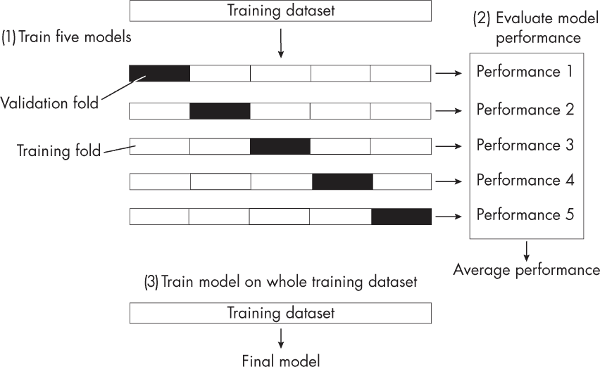
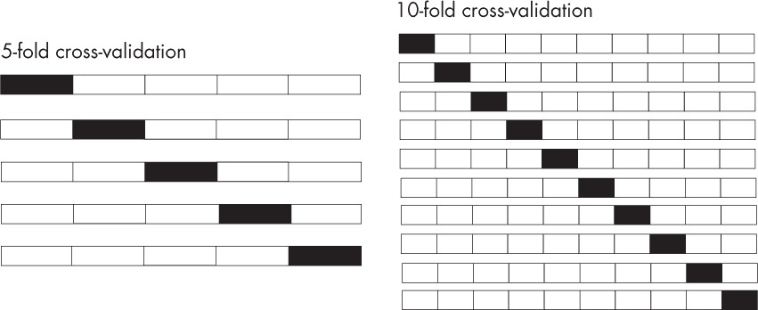

## 第二十八章：**K 折交叉验证中的 K 值**

*k*-折交叉验证是评估机器学习分类器的常见选择，因为它使我们能够使用所有训练数据来模拟机器学习算法在新数据上的表现。选择较大*k*的优缺点是什么？

我们可以将*k*-折交叉验证视为当数据有限时进行模型评估的一种解决方案。在机器学习模型评估中，我们关注模型的泛化性能，即它在新数据上的表现如何。在*k*-折交叉验证中，我们通过将训练数据划分为*k*个验证轮次和折叠，利用训练数据进行模型选择和评估。如果我们有*k*个折叠，我们就有*k*次迭代，产生*k*个不同的模型，如图 28-1 所示。

*图 28-1：一个*k*-折交叉验证用于模型评估的示例，其中*k*=5*

使用*k*-折交叉验证时，我们通常通过计算*k*个模型的平均表现来评估特定超参数配置的表现。这个表现反映或近似于在评估后通过完整训练数据集训练得到的模型的表现。

以下部分将讨论在*k*-折交叉验证中选择*k*值的权衡，并探讨较大*k*值及其计算需求，尤其是在深度学习背景下的挑战。接着我们将讨论*k*的核心用途，以及如何根据具体的建模需求选择适当的值。

### **选择 k 值时的权衡**

如果*k*过大，不同交叉验证轮次之间的训练集会过于相似。因此，*k*个模型与通过在整个训练集上训练得到的模型非常相似。在这种情况下，我们仍然可以利用*k*-折交叉验证的优势：通过每轮中保留的验证折叠来评估整个训练集的表现。（这里，我们通过将每次迭代中所有*k* - 1 个训练折叠连接在一起，得到训练集。）然而，大*k*的一个缺点是，分析具有特定超参数设置的机器学习算法在不同训练数据集上的表现变得更加困难。

除了数据集过于相似的问题，使用较大值的*k*进行 k 折交叉验证在计算上也更为复杂。较大的*k*会增加迭代次数和每次迭代中的训练集大小，因此计算成本更高。如果我们使用的是相对较大的模型，训练代价较高，如当代深度神经网络，这个问题尤为严重。

*k*的常见选择通常是 5 或 10，出于实际和历史原因。Ron Kohavi 的一项研究（请参见本章末的“参考文献”）发现，*k* = 10 对于经典机器学习算法（如决策树和朴素贝叶斯分类器）在一些小型数据集上的偏差和方差平衡效果良好。

例如，在 10 折交叉验证中，我们每轮使用 9/10（90%）的数据进行训练，而在 5 折交叉验证中，我们每轮仅使用 4/5（80%）的数据，如图 28-2 所示。

*图 28-2：5 折交叉验证与 10 折交叉验证的比较*

然而，这并不意味着大的训练集不好，因为如果我们假设模型训练可以从更多的训练数据中获益，较大的训练集可以减少性能估计的悲观偏差（这通常是件好事）。（有关学习曲线的示例，请参见图 5-1 在第 24 页的内容。）

在实际操作中，过小或过大的*k*可能会增加方差。例如，较大的*k*使得训练折叠之间的相似性更强，因为较小的比例数据被留作验证集。由于训练折叠之间更为相似，每轮中的模型也会更为相似。在实践中，我们可能会发现，较大的*k*值下，验证折叠得分的方差较小。另一方面，当*k*值较大时，验证集较小，因此可能包含更多的随机噪声，或更容易受到数据特征的影响，从而导致不同折叠间的验证得分差异更大。尽管模型本身更为相似（因为训练集更相似），但验证得分可能会更容易受到小型验证集的特殊性影响，从而导致整体交叉验证得分的方差更大。

### **确定适当的 k 值**

在决定适当的*k*值时，我们通常会受到计算性能和常规的指导。然而，定义使用*k*-折交叉验证的目的和背景是值得的。例如，如果我们主要关心近似最终模型的预测性能，使用较大的*k*值是有意义的。这样，训练折叠与合并的训练数据集非常相似，同时我们仍然可以通过验证折叠在所有数据点上评估模型。

另一方面，如果我们关心评估给定的超参数配置和训练管道对不同训练数据集的敏感性，那么选择一个较小的*k*值更为合理。

由于大多数实际场景包括两个步骤——调整超参数和评估模型性能——我们也可以考虑采用两步程序。例如，在调整超参数时，可以使用较小的*k*。这将有助于加速超参数搜索并探测超参数配置的鲁棒性（除了平均性能外，我们还可以将方差作为选择标准）。然后，在超参数调整和选择之后，我们可以增加*k*的值来评估模型。

然而，重复使用相同的数据集进行模型选择和评估会引入偏差，通常最好使用单独的测试集进行模型评估。此外，嵌套交叉验证可能是*k*-折交叉验证的替代方法。

### **练习**

**28-1.** 假设我们希望为模型提供尽可能多的训练数据。我们考虑使用*留一交叉验证（LOOCV）*，这是*k*-折交叉验证的特例，其中*k*等于训练样本的数量，这样验证集仅包含一个数据点。一位同事提到，对于不连续的损失函数和性能度量（如分类准确度），LOOCV 存在缺陷。例如，对于仅包含一个样本的验证集，准确率始终为 0（0％）或 1（99％）。这真的是一个问题吗？

**28-2.** 本章讨论了模型选择和模型评估作为*k*-折交叉验证的两个应用场景。你能想到其他应用场景吗？

### **参考文献**

+   如需更详细的解释，了解为何以及如何使用*k*-折交叉验证，请参阅我的文章：《机器学习中的模型评估、模型选择与算法选择》（2018），* [`arxiv.org/abs/1811.12808`](https://arxiv.org/abs/1811.12808) *。

+   推荐选择*k* = 5 和*k* = 10 的论文：Ron Kohavi，“《交叉验证与自助法在准确性估计和模型选择中的应用研究》”（1995），* [`dl.acm.org/doi/10.5555/1643031.1643047`](https://dl.acm.org/doi/10.5555/1643031.1643047) *。
