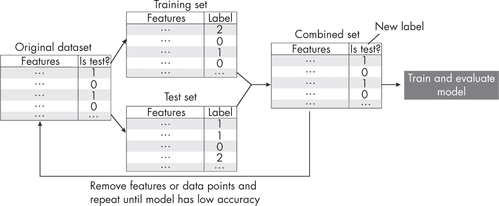

## 第二十九章：**训练集和测试集不一致**

假设我们训练的模型在测试集上的表现远好于在训练集上的表现。由于先前在类似数据集上，类似的模型配置表现良好，我们怀疑数据可能有些不对劲。我们可以采取哪些方法来检查训练集和测试集之间的差异，又可以使用哪些策略来缓解这些问题？

在更详细地调查数据集之前，我们应该检查数据加载和评估代码中的技术问题。例如，一个简单的合理性检查是暂时将测试集替换为训练集，并重新评估模型。在这种情况下，我们应该看到训练集和测试集的表现是相同的（因为这两个数据集现在是相同的）。如果我们发现差异，很可能是代码中有 bug；根据我的经验，这类 bug 常常与错误的洗牌或不一致（通常是缺失的）数据归一化有关。

如果测试集的表现远好于训练集的表现，我们可以排除过拟合的可能性。更有可能的是，训练集和测试集的分布存在显著差异。这些分布差异可能会影响特征和目标。在这种情况下，绘制训练集和测试集的目标或标签分布是一个好主意。例如，一个常见的问题是，如果数据集在划分为训练集和测试集之前没有正确洗牌，测试集可能会缺失某些类别标签。对于小型表格数据集，也可以通过直方图比较训练集和测试集中的特征分布。

查看特征分布对于表格数据是一个不错的方法，但对于图像和文本数据来说，这就比较棘手了。一种相对简单且更通用的方法来检查训练集和测试集之间的差异是对抗验证。

*对抗验证*，如图 29-1 所示，是一种识别训练数据和测试数据相似度的技术。我们首先将训练集和测试集合并成一个数据集，然后创建一个二元目标变量，用于区分训练数据和测试数据。例如，我们可以使用一个新的 *是否为测试集？* 标签，其中将标签 0 分配给训练数据，标签 1 分配给测试数据。接下来，我们使用 *k* 折交叉验证或重新划分数据集为训练集和测试集，并像往常一样训练机器学习模型。理想情况下，我们希望模型表现较差，这表明训练数据和测试数据的分布是相似的。另一方面，如果模型在预测 *是否为测试集？* 标签时表现良好，那么就表明训练集和测试集之间存在差异，我们需要进一步调查。

*图 29-1：用于检测训练集和测试集差异的对抗验证工作流*

如果我们在使用对抗性验证时检测到训练集和测试集之间的不一致，我们应该采用什么缓解技术？如果我们处理的是表格数据集，我们可以逐一去除特征，看看这是否有助于解决问题，因为一些虚假的特征有时可能与目标变量高度相关。为了实施这一策略，我们可以使用带有更新目标的顺序特征选择算法。例如，我们可以通过最小化分类准确率来代替最大化分类准确率。对于去除特征不那么简单的情况（例如图像和文本数据），我们还可以调查是否通过去除与测试集不同的单个训练实例来解决不一致问题。

### **练习**

**29-1.** 对于对抗性预测任务，什么是一个好的性能基准？

**29-2.** 由于训练数据集通常比测试数据集大，对抗性验证往往会导致一个不平衡的预测问题（大多数标记为*Is test?*的示例为假而不是正确）。这是否是一个问题？如果是，我们该如何缓解这一点？
