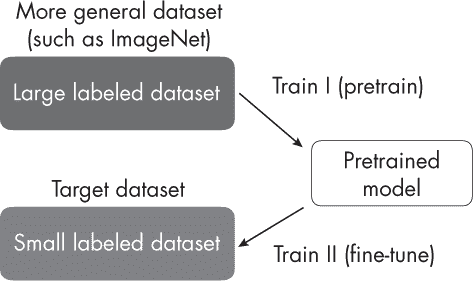
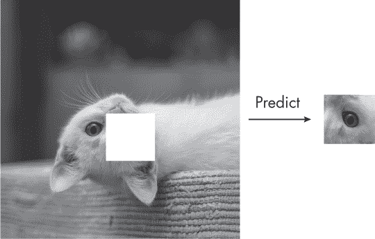
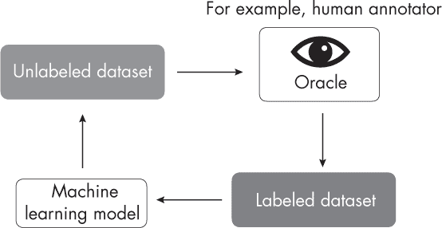
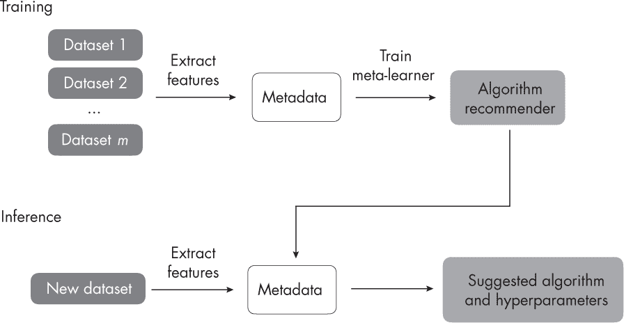
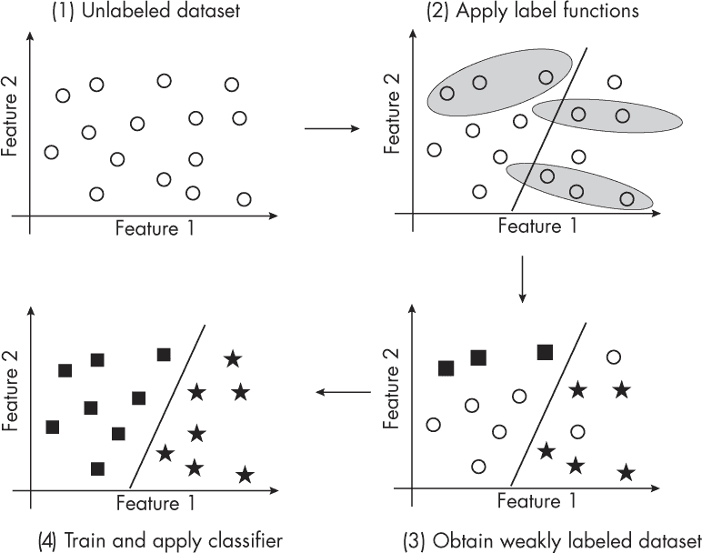
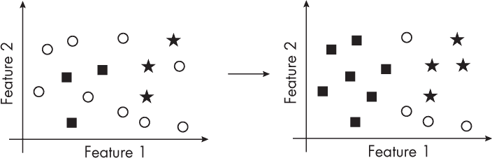
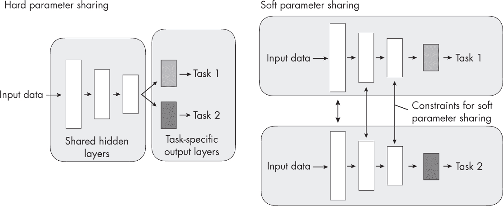
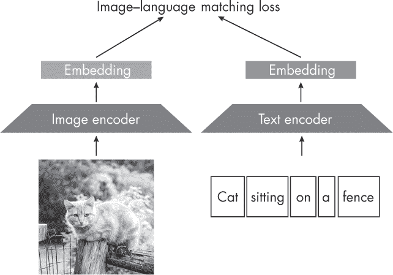
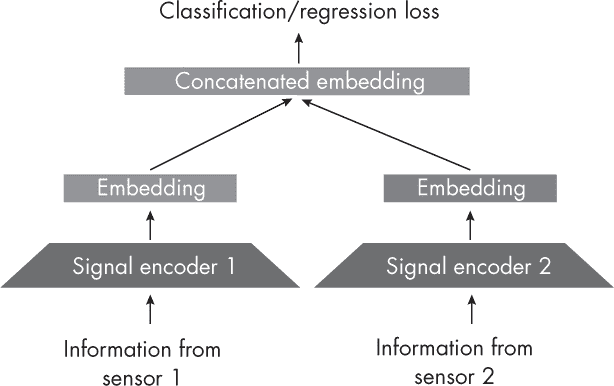
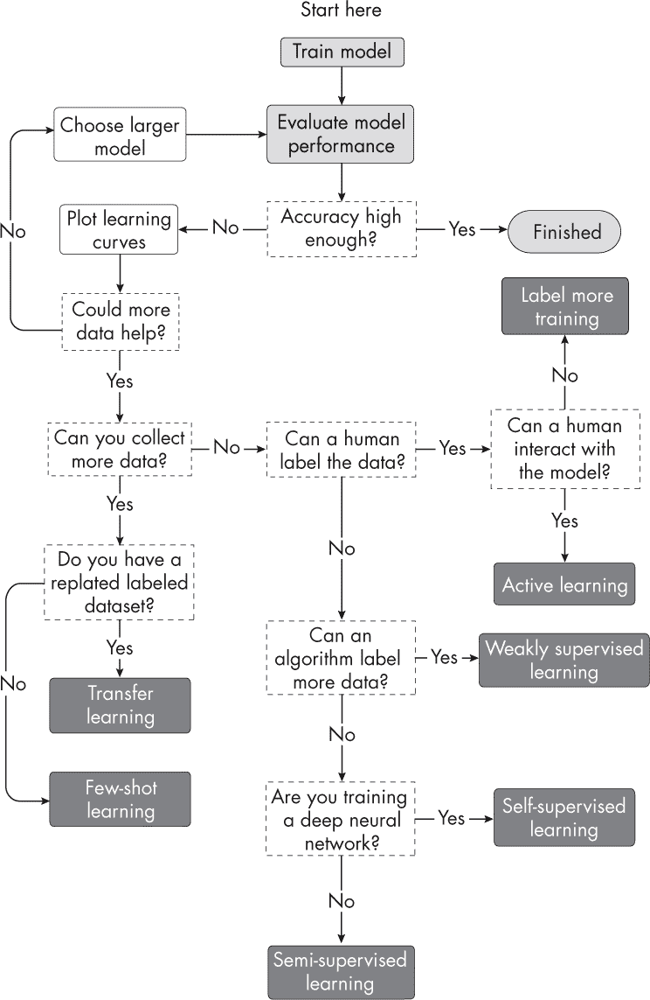

## 第三十章：**有限标签数据**

假设我们绘制一条学习曲线（例如，如图 5-1 所示，位于第 24 页），并发现机器学习模型出现过拟合，可能需要更多的训练数据。有哪些不同的方法可以处理监督学习中有限标签数据的问题？

在无法收集更多数据的情况下，我们可以使用一些与常规监督学习相关的方法，在有限标签数据的情况下提高模型性能。

### **在有限标签数据下提高模型性能**

以下章节探讨了在训练数据有限的情况下，有助于解决问题的各种机器学习范式。

#### ***标签更多数据***

收集更多的训练样本通常是提高模型性能的最佳方法（学习曲线是诊断这一点的好工具）。然而，在实际中，这往往是不可行的，因为获取高质量的数据可能很昂贵，计算资源和存储可能不足，或者数据可能难以获取。

#### ***引导数据***

类似于第五章中讨论的减少过拟合的技术，通过生成修改过的（增强的）或人工的（合成的）训练样本来“引导”数据，能够提升预测模型的性能。当然，提升数据质量也可以提高模型的预测性能，正如在第二十一章中讨论的那样。

#### ***迁移学习***

迁移学习描述了在通用数据集（例如 ImageNet）上训练一个模型，然后对预训练的目标数据集（例如一个包含不同鸟类物种的数据集）进行微调，如图 30-1 中所示。

*图 30-1：迁移学习的过程*

迁移学习通常是在深度学习的背景下进行的，其中模型的权重可以被更新。这与基于树的方法不同，因为大多数决策树算法是非参数模型，不支持迭代训练或参数更新。

#### ***自监督学习***

类似于迁移学习，在自监督学习中，模型会在不同的任务上进行预训练，然后微调以适应目标任务，而该任务只有有限的数据。然而，自监督学习通常依赖于可以直接从未标注数据中自动提取的标签信息。因此，自监督学习通常也被称为*无监督预训练*。

自监督学习的常见例子包括语言建模中的*下一个词*（例如 GPT 使用）或*掩蔽词*（例如 BERT 使用）预训练任务，更多细节请参见第十七章。另一个来自计算机视觉的直观例子是*图像修复*：预测随机移除的图像缺失部分，如图 30-2 所示。

*图 30-2：自监督学习中的图像修复*

关于自监督学习的更多细节，请参见第二章。

#### ***主动学习***

在主动学习中，如图 30-3 所示，我们通常涉及人工标注者或用户在学习过程中的反馈。然而，主动学习并不是一开始就标注整个数据集，而是通过优先级方案建议未标注的数据点进行标注，以最大化机器学习模型的性能。

*图 30-3：在主动学习中，模型向 oracle 请求标签。*

*主动学习*一词指的是模型主动选择数据进行标注。例如，最简单的主动学习形式是选择预测不确定性较高的数据点，由人工标注员进行标注（也称为*oracle*）。

#### ***少量样本学习***

在少量样本学习的场景中，我们通常处理的是包含每个类别仅少量示例的极小数据集。在研究中，1-shot（每个类别一个示例）和 5-shot（每个类别五个示例）学习场景非常常见。少量样本学习的极端案例是零样本学习，在这种情况下没有提供标签。零样本学习的流行例子包括 GPT-3 及相关语言模型，在这些模型中，用户必须通过输入提示提供所有必要的信息，如图 30-4 所示。

*图 30-4：使用 ChatGPT 进行零样本分类*

关于少量样本学习的更多细节，请参见第三章。

#### ***元学习***

元学习涉及开发方法来确定机器学习算法如何最好地从数据中学习。因此，我们可以将元学习看作是“学习如何学习”。机器学习社区已经开发了几种元学习方法。在机器学习社区中，*元学习*不仅代表多个子类别和方法；有时它也用来描述相关但不同的过程，导致其在解释和应用上的细微差别。

元学习是少样本学习的主要子类别之一。在这里，重点是学习一个好的特征提取模块，该模块将支持集和查询图像转换为向量表示。这些向量表示通过与支持集中的训练示例进行比较，优化用于确定查询示例的预测类别。（这种元学习形式在第三章的第 17 页中有说明。）

另一个与少样本学习方法无关的元学习分支，专注于从数据集中提取元数据（也称为*元特征*）用于监督学习任务，如图 30-5 所示。元特征是数据集本身的描述。例如，这些可以包括特征的数量和不同特征的统计数据（峰度、范围、均值等）。

*图 30-5：涉及提取元数据的元学习过程*

提取的元特征为选择适合当前数据集的机器学习算法提供了信息。通过这种方法，我们可以缩小算法和超参数的搜索空间，从而帮助减少数据集较小时的过拟合。

#### ***弱监督学习***

弱监督学习，如图 30-6 所示，涉及使用外部标签源为未标记的数据集生成标签。通常，弱监督标签函数生成的标签比人工或领域专家生成的标签更嘈杂或不准确，因此称为*弱监督*。我们可以开发或采用基于规则的分类器来创建弱监督学习中的标签；这些规则通常只涵盖未标记数据集的一个子集。

*图 30-6：弱监督学习使用外部标签函数来训练机器学习模型。*

让我们回到第二十三章中的电子邮件垃圾邮件分类示例，来说明一种基于规则的数据标注方法。在弱监督下，我们可以基于电子邮件主题行中的关键词*SALE*设计一个基于规则的分类器来识别一部分垃圾邮件。请注意，虽然我们可以使用此规则将某些电子邮件标记为垃圾邮件正例，但不应将没有*SALE*的邮件标记为非垃圾邮件。相反，我们应该将这些邮件保持未标记状态，或者为它们应用不同的规则。

弱监督学习有一个子类别称为 PU 学习。在*PU 学习*中，*PU*是*正样本-未标记学习*的缩写，我们只标记和学习正样本。

#### ***半监督学习***

半监督学习与弱监督学习密切相关：它也涉及为数据集中未标记的实例创建标签。这两种方法之间的主要区别在于*如何*创建标签。在弱监督中，我们使用外部标注函数创建标签，这些函数通常是嘈杂、不准确的，或者仅覆盖数据的一个子集。在半监督中，我们不使用外部标注函数；相反，我们利用数据本身的结构。例如，我们可以根据邻近已标记数据点的密度为额外的数据点打标签，如图 30-7 所示。

*图 30-7：半监督学习*

尽管我们可以将弱监督应用于完全未标记的数据集，半监督学习则要求至少有一部分数据是已标记的。在实践中，通常先应用弱监督对数据的一个子集进行标注，然后使用半监督学习对未被标注函数捕捉到的实例进行标注。

由于它们之间的紧密关系，半监督学习有时被称为弱监督学习的一个子类别，反之亦然。

#### ***自训练***

自训练介于半监督学习和弱监督学习之间。对于这种技术，我们训练一个模型来标注数据集，或者采用现有模型来完成同样的任务。这个模型也被称为*伪标签生成器*。

自训练并不能保证标签的准确性，因此它与弱监督学习相关。此外，尽管我们使用或采用机器学习模型进行伪标签生成，自训练也与半监督学习相关。

自训练的一个例子是知识蒸馏，在第六章中讨论过。

#### ***多任务学习***

多任务学习训练神经网络来处理多个理想上相关的任务。例如，如果我们训练一个分类器来检测垃圾邮件，那么垃圾邮件分类就是主要任务。在多任务学习中，我们可以为模型添加一个或多个相关任务来解决，这些被称为*辅助任务*。对于垃圾邮件的例子，一个辅助任务可能是对邮件的主题或语言进行分类。

通常，多任务学习是通过多个损失函数来实现的，这些损失函数需要同时优化，每个任务对应一个损失函数。辅助任务作为归纳偏置，引导模型优先选择能够解释多个任务的假设。这种方法通常会使模型在未见数据上的表现更好。

多任务学习有两个子类别：硬参数共享的多任务学习和软参数共享的多任务学习。图 30-8 展示了这两种方法之间的区别。

*图 30-8：多任务学习的两种主要类型*

在*硬*参数共享中，如图 30-8 所示，只有输出层是特定于任务的，而所有任务共享相同的隐藏层和神经网络骨干架构。相比之下，*软*参数共享使用独立的神经网络处理每个任务，但会应用正则化技术，如在参数层之间最小化距离，以鼓励网络间的相似性。

#### ***多模态学习***

多任务学习涉及使用多个任务和损失函数训练一个模型，而多模态学习则侧重于融合多种类型的输入数据。

多模态学习的常见示例是同时处理图像和文本数据的架构（尽管多模态学习不限于两种模态，可以应用于任意数量的输入模态）。根据任务的不同，我们可以使用匹配损失，迫使相关图像和文本之间的嵌入向量相似，如图 30-9 所示。（有关嵌入向量的更多信息，请参见第一章。）

*图 30-9：带有匹配损失的多模态学习*

图 30-9 展示了图像和文本编码器作为独立组件。图像编码器可以是卷积骨干网络或视觉变换器，而语言编码器可以是循环神经网络或语言变换器。然而，现如今，通常使用一个基于变换器的模块，可以同时处理图像和文本数据。例如，VideoBERT 模型有一个联合模块，处理视频和文本，用于动作分类和视频字幕生成。

如图 30-9 所示，优化匹配损失对于学习可应用于各种任务的嵌入是有用的，如图像分类或摘要。然而，也可以直接优化目标损失，如图 30-10 所示，进行分类或回归。

*图 30-10：用于优化监督学习目标的多模态学习*

图 30-10 展示了从两个不同传感器收集的数据。一个可能是温度计，另一个可能是视频摄像机。信号编码器将信息转换为嵌入（共享相同的维度数），然后将它们连接起来，形成模型的输入表示。

直观上，结合来自不同模态的数据的模型通常比单一模态模型表现更好，因为它们可以利用更多的信息。此外，最近的研究表明，多模态学习成功的关键在于潜在空间表示质量的提高。

#### ***归纳偏差***

选择具有更强归纳偏差的模型可以通过对数据结构做出假设，从而帮助减少数据需求。例如，由于卷积网络的归纳偏差，它们比视觉变换器需要更少的数据，正如第十三章中讨论的那样。

### **建议**

在所有这些减少数据需求的技术中，我们应如何决定在特定情况下使用哪些方法？

像收集更多数据、数据增强和特征工程这样的技术与本章讨论的所有方法兼容。多任务学习和多模态输入也可以与这里概述的学习策略结合使用。如果模型出现过拟合，我们还应该使用第五章和第六章中讨论的技术。

但我们如何在主动学习、少样本学习、迁移学习、自监督学习、半监督学习和弱监督学习之间做出选择呢？决定尝试哪种监督学习技术非常依赖于具体的情境。你可以参考图 30-11 中的图示，帮助你选择最适合你项目的方法。

*图 30-11：选择监督学习技术的建议*

请注意，图 30-11 中的黑色框不是终端节点，而是回到第二个框“评估模型性能”；为了避免视觉杂乱，省略了额外的箭头。

### **练习**

**30-1.** 假设我们被要求构建一个机器学习模型，该模型利用图像检测类似 iPad 的平板设备外壳上的制造缺陷。我们有数百万张未标记的各类计算设备图像，包括智能手机、平板电脑和计算机；成千上万张标记了不同类型损坏的智能手机图片；以及数百张专门与检测平板设备制造缺陷相关的标记图像。我们该如何通过自监督学习或迁移学习来解决这个问题？

**30-2.** 在主动学习中，选择困难的样本供人工检查和标注通常基于置信度评分。神经网络可以通过在输出层使用逻辑 sigmoid 或 softmax 函数来计算类别归属概率，从而提供这样的评分。然而，普遍认为，深度神经网络在面对分布外数据时表现出过度自信，这使得它们在主动学习中的应用变得低效。对于主动学习，如何使用深度神经网络获取置信度评分的其他方法有哪些？

### **参考文献**

+   尽管增量学习的决策树并不常见，但确实存在用于以迭代方式训练决策树的算法：*[`en.wikipedia.org/wiki/Incremental_decision_tree`](https://en.wikipedia.org/wiki/Incremental_decision_tree)*。

+   使用多任务学习训练的模型通常优于单一任务训练的模型：Rich Caruana，“多任务学习”（1997），*[`doi.org/10.1023%2FA%3A1007379606734`](https://doi.org/10.1023%2FA%3A1007379606734)*。

+   一个基于 Transformer 的单一模块，可以同时处理图像和文本数据：Chen Sun 等人，“VideoBERT：一种用于视频和语言表示学习的联合模型”（2019），*[`arxiv.org/abs/1904.01766`](https://arxiv.org/abs/1904.01766)*。

+   上述研究表明，多模态学习成功的关键是潜在空间表示质量的提升：Yu Huang 等人，“是什么使多模态学习比单一模态更好（可以证明）”（2021），*[`arxiv.org/abs/2106.04538`](https://arxiv.org/abs/2106.04538)*。

+   欲了解更多关于主动学习的信息：Zhen 等人，“深度主动学习的比较调查”（2022），*[`arxiv.org/abs/2203.13450`](https://arxiv.org/abs/2203.13450)*。

+   关于如何分布外数据可能导致深度神经网络过度自信的详细讨论：Anh Nguyen, Jason Yosinski 和 Jeff Clune，“深度神经网络容易被愚弄：对于无法识别图像的高置信度预测”（2014），*[`arxiv.org/abs/1412.1897`](https://arxiv.org/abs/1412.1897)*。
