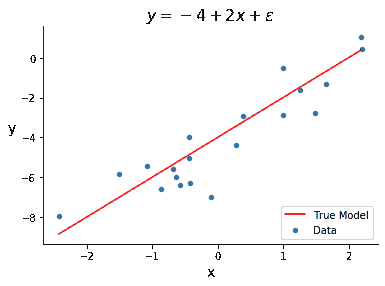
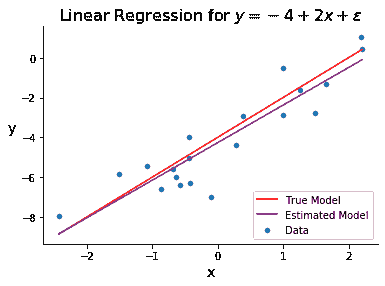

# 概念

> 原文：[`dafriedman97.github.io/mlbook/content/c1/concept.html`](https://dafriedman97.github.io/mlbook/content/c1/concept.html)

\[ \newcommand{\sumN}{\sum_{n = 1}^N} \newcommand{\sumn}{\sum_n} \newcommand{\bx}{\mathbf{x}} \newcommand{\bbeta}{\boldsymbol{\beta}} \newcommand{\btheta}{\boldsymbol{\theta}} \newcommand{\bbetahat}{\boldsymbol{\hat{\beta}}} \newcommand{\bthetahat}{\boldsymbol{\hat{\theta}}} \newcommand{\dadb}[2]{\frac{\partial #1}{\partial #2}} \newcommand{\by}{\mathbf{y}} \newcommand{\bX}{\mathbf{X}} \newcommand{\bphi}{\boldsymbol{\phi}} \newcommand{\bPhi}{\boldsymbol{\Phi}} \]

## 模型结构

*线性回归* 是一种相对简单的方法，它被极其广泛地使用。它也是更复杂方法的良好基石，使其成为首先研究的自然算法。

在线性回归中，目标变量 \(y\) 被假设为遵循一个或多个预测变量 \(x_1, \dots, x_D\) 的线性函数，加上一些随机误差。具体来说，我们假设样本中第 \(n^\text{th}\) 个观察的模型形式如下

\[ y_n = \beta_0 + \beta_1 x_{n1} + \dots + \beta_Dx_{nD} + \epsilon_n. \]

这里 \(\beta_0\) 是截距项，\(\beta_1\) 到 \(\beta_D\) 是特征变量的系数，\(\epsilon\) 是一个误差项，表示真实 \(y\) 值与预测变量的线性函数之间的差异。注意，下标带有 \(n\) 的项在不同观察之间是不同的，而下标不带 \(n\) 的项（即 \(\beta\)）是不变的。

当我们使用向量来表示我们的预测变量和系数时，线性回归背后的数学往往变得更简单。让我们如下定义 \(\bx_n\) 和 \(\bbeta\):

\[\begin{split} \begin{align} \bx_n &= \begin{pmatrix} 1 & x_{n1} & \dots & x_{nD} \end{pmatrix}^\top \\ \bbeta &= \begin{pmatrix} \beta_0 & \beta_1 & \dots & \beta_D \end{pmatrix}^\top. \end{align} \end{split}\]

注意，\(\bx_n\) 包含一个前导的 1，对应于截距项 \(\beta_0\)。使用这些定义，我们可以等价地表示 \(y_n\) 为

\[ y_n = \bbeta^\top \bx_n + \epsilon_n. \]

下面是一个为线性回归设计的示例数据集。输入变量是随机生成的，目标变量是输入变量的线性组合加上一个误差项。

```py
import numpy as np
import matplotlib.pyplot as plt
import seaborn as sns

# generate data
np.random.seed(123)
N = 20
beta0 = -4
beta1 = 2
x = np.random.randn(N)
e = np.random.randn(N)
y = beta0 + beta1*x + e
true_x = np.linspace(min(x), max(x), 100)
true_y = beta0 + beta1*true_x

# plot
fig, ax = plt.subplots()
sns.scatterplot(x, y, s = 40, label = 'Data')
sns.lineplot(true_x, true_y, color = 'red', label = 'True Model')
ax.set_xlabel('x', fontsize = 14)
ax.set_title(fr"$y = {beta0} + ${beta1}$x + \epsilon$", fontsize = 16)
ax.set_ylabel('y', fontsize=14, rotation=0, labelpad=10)
ax.legend(loc = 4)
sns.despine() 
```



## 参数估计

前一节涵盖了我们在线性回归中假设数据遵循的整个结构。然后，机器学习任务就是估计 \(\bbeta\) 中的参数。这些估计由 \(\hat{\beta}_0, \dots, \hat{\beta}_D\) 或 \(\bbetahat\) 表示。这些估计为我们目标变量的*拟合值*提供了，表示为 \(\hat{y}_n\)。

这个任务可以通过两种方式完成，尽管在概念上略有不同，但在数学上是相同的。第一种方法是通过 *最小化损失* 的视角。在机器学习中，选择一个损失函数来定义具有给定参数估计值的模型如何好地估计观察到的数据是一种常见做法。线性回归中最常见的损失函数是平方误差损失。这意味着我们的模型 *损失* 与真实 \(y_n\) 值和拟合值 \(\hat{y}_n\) 之间平方差的和成比例。然后我们通过找到最小化此损失函数的估计 \(\bbetahat\) 来 *拟合* 模型。这种方法在子节 方法 1：最小化损失 中进行了介绍。

第二种方法是通过 *最大化似然* 的视角。在机器学习中，另一种常见的做法是将目标建模为一个随机变量，其分布依赖于一个或多个参数，然后找到最大化其似然的参数。在这种方法下，我们将目标表示为 \(Y_n\)，因为我们将其视为一个随机变量。在线性回归中，\(Y_n\) 最常见的模型是具有均值 \(E(Y_n) = \bbeta^\top \bx_n\) 的正态随机变量。也就是说，我们假设

\[ Y_n|\bx_n \sim \mathcal{N}(\bbeta^\top \bx_n, \sigma²), \]

我们找到 \(\bbetahat\) 的值以最大化似然。这种方法在子节 方法 2：最大化似然 中进行了介绍。

一旦我们估计了 \(\bbeta\)，我们的模型就 *拟合* 好了，我们可以进行预测。下面的图表与上面的图表相同，但包括我们通过计算 \(\hat{\beta}_0\) 和 \(\hat{\beta}_1\) 得到的最佳拟合线。

```py
# generate data
np.random.seed(123)
N = 20
beta0 = -4
beta1 = 2
x = np.random.randn(N)
e = np.random.randn(N)
y = beta0 + beta1*x + e
true_x = np.linspace(min(x), max(x), 100)
true_y = beta0 + beta1*true_x

# estimate model 
beta1_hat = sum((x - np.mean(x))*(y - np.mean(y)))/sum((x - np.mean(x))**2)
beta0_hat = np.mean(y) - beta1_hat*np.mean(x)
fit_y = beta0_hat + beta1_hat*true_x

# plot
fig, ax = plt.subplots()
sns.scatterplot(x, y, s = 40, label = 'Data')
sns.lineplot(true_x, true_y, color = 'red', label = 'True Model')
sns.lineplot(true_x, fit_y, color = 'purple', label = 'Estimated Model')
ax.set_xlabel('x', fontsize = 14)
ax.set_title(fr"Linear Regression for $y = {beta0} + ${beta1}$x + \epsilon$", fontsize = 16)
ax.set_ylabel('y', fontsize=14, rotation=0, labelpad=10)
ax.legend(loc = 4)
sns.despine() 
```



## 普通线性回归的扩展

线性回归有许多重要的扩展，使模型更加灵活。这些包括 正则化回归——它平衡了高维回归模型中的偏差-方差权衡——贝叶斯回归——它允许对系数进行先验分布——以及 广义线性模型——它向回归模型引入非线性。这些扩展将在下一章中讨论。

## 模型结构

*线性回归* 是一种相对简单的方法，它被极其广泛地使用。它也是更复杂方法的良好基石，使其成为首先研究的自然算法。

在线性回归中，目标变量 \(y\) 被假设遵循一个或多个预测变量 \(x_1, \dots, x_D\) 的线性函数，以及一些随机误差。具体来说，我们假设样本中第 \(n^\text{th}\) 个观测值的模型形式如下

\[ y_n = \beta_0 + \beta_1 x_{n1} + \dots + \beta_Dx_{nD} + \epsilon_n. \]

这里 \(\beta_0\) 是截距项，\(\beta_1\) 到 \(\beta_D\) 是特征变量的系数，\(\epsilon\) 是一个误差项，它表示真实 \(y\) 值与预测变量的线性函数之间的差异。请注意，下标带有 \(n\) 的项在不同观测之间是不同的，而下标不带 \(n\) 的项（即 \(\beta\) 项）是不变的。

当我们使用向量来表示我们的预测变量和系数时，线性回归背后的数学通常会更简单。让我们定义 \(\bx_n\) 和 \(\bbeta\) 如下：

\[\begin{split} \begin{align} \bx_n &= \begin{pmatrix} 1 & x_{n1} & \dots & x_{nD} \end{pmatrix}^\top \\ \bbeta &= \begin{pmatrix} \beta_0 & \beta_1 & \dots & \beta_D \end{pmatrix}^\top. \end{align} \end{split}\]

注意，\(\bx_n\) 包含一个前导的 1，对应于截距项 \(\beta_0\)。使用这些定义，我们可以等价地表示 \(y_n\) 为

\[ y_n = \bbeta^\top \bx_n + \epsilon_n. \]

下面是一个为线性回归设计的示例数据集。输入变量是随机生成的，目标变量是输入变量的线性组合加上一个误差项。

```py
import numpy as np
import matplotlib.pyplot as plt
import seaborn as sns

# generate data
np.random.seed(123)
N = 20
beta0 = -4
beta1 = 2
x = np.random.randn(N)
e = np.random.randn(N)
y = beta0 + beta1*x + e
true_x = np.linspace(min(x), max(x), 100)
true_y = beta0 + beta1*true_x

# plot
fig, ax = plt.subplots()
sns.scatterplot(x, y, s = 40, label = 'Data')
sns.lineplot(true_x, true_y, color = 'red', label = 'True Model')
ax.set_xlabel('x', fontsize = 14)
ax.set_title(fr"$y = {beta0} + ${beta1}$x + \epsilon$", fontsize = 16)
ax.set_ylabel('y', fontsize=14, rotation=0, labelpad=10)
ax.legend(loc = 4)
sns.despine() 
```


## 参数估计

前一节涵盖了我们在线性回归中假设数据遵循的整个结构。那么，机器学习任务就是估计 \(\bbeta\) 中的参数。这些估计值由 \(\hat{\beta}_0, \dots, \hat{\beta}_D\) 或 \(\bbetahat\) 表示。这些估计值为我们目标变量的*拟合值*提供了信息，表示为 \(\hat{y}_n\)。

这个任务可以通过两种方式完成，虽然概念上略有不同，但数学上是相同的。第一种方法是通过*最小化损失*的视角。在机器学习中，选择一个损失函数来定义具有给定参数估计值的模型如何拟合观察到的数据是一种常见做法。线性回归中最常见的损失函数是平方误差损失。这意味着我们的模型*损失*与真实 \(y_n\) 值和拟合值 \(\hat{y}_n\) 之间平方差的和成正比。然后，我们通过找到最小化这个损失函数的估计 \(\bbetahat\) 来*拟合*模型。这种方法在子节方法 1：最小化损失中有详细说明。

第二种方法是通过*最大化似然*的视角。在机器学习中，将目标建模为依赖于一个或多个参数的随机变量，然后找到最大化其似然的参数是另一种常见做法。在这种方法下，我们将目标表示为 \(Y_n\)，因为我们将其视为一个随机变量。线性回归中 \(Y_n\) 的最常见模型是具有均值 \(E(Y_n) = \bbeta^\top \bx_n\) 的正态随机变量。也就是说，我们假设

\[ Y_n|\bx_n \sim \mathcal{N}(\bbeta^\top \bx_n, \sigma²), \]

我们找到 \(\bbetahat\) 的值以最大化似然。这种方法在子节方法 2：最大化似然中有详细说明。

一旦我们估计了 \(\bbeta\)，我们的模型就*拟合*好了，我们可以进行预测。下面的图表与上面的图表相同，但包括了我们的最佳拟合线估计，通过计算 \(\hat{\beta}_0\) 和 \(\hat{\beta}_1\) 得到。

```py
# generate data
np.random.seed(123)
N = 20
beta0 = -4
beta1 = 2
x = np.random.randn(N)
e = np.random.randn(N)
y = beta0 + beta1*x + e
true_x = np.linspace(min(x), max(x), 100)
true_y = beta0 + beta1*true_x

# estimate model 
beta1_hat = sum((x - np.mean(x))*(y - np.mean(y)))/sum((x - np.mean(x))**2)
beta0_hat = np.mean(y) - beta1_hat*np.mean(x)
fit_y = beta0_hat + beta1_hat*true_x

# plot
fig, ax = plt.subplots()
sns.scatterplot(x, y, s = 40, label = 'Data')
sns.lineplot(true_x, true_y, color = 'red', label = 'True Model')
sns.lineplot(true_x, fit_y, color = 'purple', label = 'Estimated Model')
ax.set_xlabel('x', fontsize = 14)
ax.set_title(fr"Linear Regression for $y = {beta0} + ${beta1}$x + \epsilon$", fontsize = 16)
ax.set_ylabel('y', fontsize=14, rotation=0, labelpad=10)
ax.legend(loc = 4)
sns.despine() 
```


## 普通线性回归的扩展

线性回归有许多重要的扩展，使模型更加灵活。这些扩展包括正则化回归—它平衡了高维回归模型的偏差-方差权衡—贝叶斯回归—它允许对系数进行先验分布—以及广义线性模型—它向回归模型引入非线性。这些扩展将在下一章中讨论。
