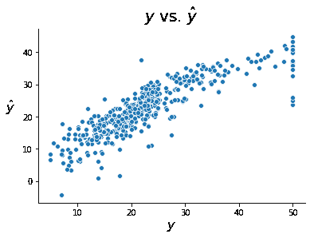

# 实现

> 原文：[`dafriedman97.github.io/mlbook/content/c1/code.html`](https://dafriedman97.github.io/mlbook/content/c1/code.html)

本节演示了如何在 Python 中实际拟合回归模型。Python 中拟合回归模型最常用的两个包是`scikit-learn`和`statsmodels`。两种方法都已在之前展示。

首先，让我们导入数据和必要的包。我们再次将使用来自`sklearn.datasets`的 Boston 住房数据集。

```py
import matplotlib.pyplot as plt
import seaborn as sns
from sklearn import datasets
boston = datasets.load_boston()
X_train = boston['data']
y_train = boston['target'] 
```

## Scikit-Learn

在`scikit-learn`中拟合模型与我们在上一节从头开始拟合模型的方式非常相似。模型的拟合分为两个步骤：首先实例化模型，然后使用`fit()`方法对其进行训练。

```py
from sklearn.linear_model import LinearRegression
sklearn_model = LinearRegression()
sklearn_model.fit(X_train, y_train); 
```

与之前一样，我们可以将拟合值与真实值进行绘图。要使用`scikit-learn`模型进行预测，我们可以使用`predict`方法。令人欣慰的是，我们得到了与之前相同的图表。

```py
sklearn_predictions = sklearn_model.predict(X_train)
fig, ax = plt.subplots()
sns.scatterplot(y_train, sklearn_predictions)
ax.set_xlabel(r'$y$', size = 16)
ax.set_ylabel(r'$\hat{y}$', rotation = 0, size = 16, labelpad = 15)
ax.set_title(r'$y$ vs. $\hat{y}$', size = 20, pad = 10)
sns.despine() 
```



我们还可以使用`coef_`属性来检查估计的参数，如下所示（注意只打印了前几个）。

```py
predictors = boston.feature_names
beta_hats = sklearn_model.coef_
print('\n'.join([f'{predictors[i]}: {round(beta_hats[i], 3)}' for i in range(3)])) 
```

```py
CRIM: -0.108
ZN: 0.046
INDUS: 0.021 
```

## Statsmodels

`statsmodels`是另一个在 Python 中运行线性回归时经常使用的包。在`statsmodels`中有两种运行回归的方式。第一种使用与上一节中相同的方式的`numpy`数组。以下是一个示例。

注意

注意这个模型与我们之前构建的模型之间的两个细微差别。首先，我们必须手动将常数添加到预测变量数据框中，以便给我们的模型提供一个截距项。其次，我们在实例化模型时提供训练数据，而不是在拟合时提供。

```py
import statsmodels.api as sm

X_train_with_constant = sm.add_constant(X_train)
sm_model1 = sm.OLS(y_train, X_train_with_constant)
sm_fit1 = sm_model1.fit()
sm_predictions1 = sm_fit1.predict(X_train_with_constant) 
```

在`statsmodels`中运行回归的第二种方式是使用`R`风格的公式和`pandas`数据框。这允许我们通过名称识别预测变量和目标变量。以下是一个示例。

```py
import pandas as pd
df = pd.DataFrame(X_train, columns = boston['feature_names'])
df['target'] = y_train
display(df.head())

formula = 'target ~ ' + ' + '.join(boston['feature_names'])
print('formula:', formula) 
```

|  | CRIM | ZN | INDUS | CHAS | NOX | RM | AGE | DIS | RAD | TAX | PTRATIO | B | LSTAT | 目标 |
| --- | --- | --- | --- | --- | --- | --- | --- | --- | --- | --- | --- | --- | --- | --- |
| 0 | 0.00632 | 18.0 | 2.31 | 0.0 | 0.538 | 6.575 | 65.2 | 4.0900 | 1.0 | 296.0 | 15.3 | 396.90 | 4.98 | 24.0 |
| 1 | 0.02731 | 0.0 | 7.07 | 0.0 | 0.469 | 6.421 | 78.9 | 4.9671 | 2.0 | 242.0 | 17.8 | 396.90 | 9.14 | 21.6 |
| 2 | 0.02729 | 0.0 | 7.07 | 0.0 | 0.469 | 7.185 | 61.1 | 4.9671 | 2.0 | 242.0 | 17.8 | 392.83 | 4.03 | 34.7 |
| 3 | 0.03237 | 0.0 | 2.18 | 0.0 | 0.458 | 6.998 | 45.8 | 6.0622 | 3.0 | 222.0 | 18.7 | 394.63 | 2.94 | 33.4 |
| 4 | 0.06905 | 0.0 | 2.18 | 0.0 | 0.458 | 7.147 | 54.2 | 6.0622 | 3.0 | 222.0 | 18.7 | 396.90 | 5.33 | 36.2 |

```py
formula: target ~ CRIM + ZN + INDUS + CHAS + NOX + RM + AGE + DIS + RAD + TAX + PTRATIO + B + LSTAT 
```

```py
import statsmodels.formula.api as smf

sm_model2 = smf.ols(formula, data = df)
sm_fit2 = sm_model2.fit()
sm_predictions2 = sm_fit2.predict(df) 
```

## Scikit-Learn

在`scikit-learn`中拟合模型与我们在上一节从头开始拟合模型的方式非常相似。模型的拟合分为两个步骤：首先实例化模型，然后使用`fit()`方法对其进行训练。

```py
from sklearn.linear_model import LinearRegression
sklearn_model = LinearRegression()
sklearn_model.fit(X_train, y_train); 
```

如前所述，我们可以将拟合值与真实值进行绘图。要使用`scikit-learn`模型进行预测，我们可以使用`predict`方法。令人欣慰的是，我们得到了与之前相同的图表。

```py
sklearn_predictions = sklearn_model.predict(X_train)
fig, ax = plt.subplots()
sns.scatterplot(y_train, sklearn_predictions)
ax.set_xlabel(r'$y$', size = 16)
ax.set_ylabel(r'$\hat{y}$', rotation = 0, size = 16, labelpad = 15)
ax.set_title(r'$y$ vs. $\hat{y}$', size = 20, pad = 10)
sns.despine() 
```


我们还可以使用`coef_`属性来检查估计的参数，如下所示（注意，这里只打印了前几个）。

```py
predictors = boston.feature_names
beta_hats = sklearn_model.coef_
print('\n'.join([f'{predictors[i]}: {round(beta_hats[i], 3)}' for i in range(3)])) 
```

```py
CRIM: -0.108
ZN: 0.046
INDUS: 0.021 
```

## Statsmodels

`statsmodels`是另一个在 Python 中运行线性回归时经常使用的包。在`statsmodels`中有两种运行回归的方式。第一种使用与上一节中相同的`numpy`数组。以下是一个示例。

注意

注意此模型与我们之前构建的模型之间的两个细微差别。首先，我们必须手动将常数添加到预测数据框中，以便给我们的模型提供一个截距项。其次，我们在实例化模型时提供训练数据，而不是在拟合时提供。

```py
import statsmodels.api as sm

X_train_with_constant = sm.add_constant(X_train)
sm_model1 = sm.OLS(y_train, X_train_with_constant)
sm_fit1 = sm_model1.fit()
sm_predictions1 = sm_fit1.predict(X_train_with_constant) 
```

在`statsmodels`中运行回归的第二种方式是使用`R`风格的公式和`pandas`数据框。这允许我们通过名称识别预测变量和目标变量。以下是一个示例。

```py
import pandas as pd
df = pd.DataFrame(X_train, columns = boston['feature_names'])
df['target'] = y_train
display(df.head())

formula = 'target ~ ' + ' + '.join(boston['feature_names'])
print('formula:', formula) 
```

|  | CRIM | ZN | INDUS | CHAS | NOX | RM | AGE | DIS | RAD | TAX | PTRATIO | B | LSTAT | target |
| --- | --- | --- | --- | --- | --- | --- | --- | --- | --- | --- | --- | --- | --- | --- |
| 0 | 0.00632 | 18.0 | 2.31 | 0.0 | 0.538 | 6.575 | 65.2 | 4.0900 | 1.0 | 296.0 | 15.3 | 396.90 | 4.98 | 24.0 |
| 1 | 0.02731 | 0.0 | 7.07 | 0.0 | 0.469 | 6.421 | 78.9 | 4.9671 | 2.0 | 242.0 | 17.8 | 396.90 | 9.14 | 21.6 |
| 2 | 0.02729 | 0.0 | 7.07 | 0.0 | 0.469 | 7.185 | 61.1 | 4.9671 | 2.0 | 242.0 | 17.8 | 392.83 | 4.03 | 34.7 |
| 3 | 0.03237 | 0.0 | 2.18 | 0.0 | 0.458 | 6.998 | 45.8 | 6.0622 | 3.0 | 222.0 | 18.7 | 394.63 | 2.94 | 33.4 |
| 4 | 0.06905 | 0.0 | 2.18 | 0.0 | 0.458 | 7.147 | 54.2 | 6.0622 | 3.0 | 222.0 | 18.7 | 396.90 | 5.33 | 36.2 |

```py
formula: target ~ CRIM + ZN + INDUS + CHAS + NOX + RM + AGE + DIS + RAD + TAX + PTRATIO + B + LSTAT 
```

```py
import statsmodels.formula.api as smf

sm_model2 = smf.ols(formula, data = df)
sm_fit2 = sm_model2.fit()
sm_predictions2 = sm_fit2.predict(df) 
```
