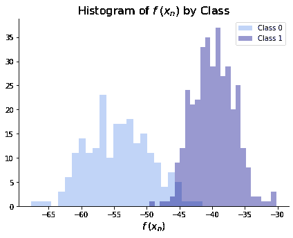

# 实现

> 原文：[`dafriedman97.github.io/mlbook/content/c3/code.html`](https://dafriedman97.github.io/mlbook/content/c3/code.html)

本节将演示如何使用 `scikit-learn` 来拟合本章讨论的判别分类器。请注意，其他库也经常被使用——例如，`statsmodels` 用于逻辑回归，而 `tensorflow` 用于感知机。

对于二元任务，我们将使用 乳腺癌 数据集，而对于多类任务，我们将使用 葡萄酒 数据集。

```py
import numpy as np 
import matplotlib.pyplot as plt
import seaborn as sns
from sklearn import datasets

# import data
cancer = datasets.load_breast_cancer()
X_cancer = cancer['data']
y_cancer = cancer['target']
wine = datasets.load_wine()
X_wine = wine['data']
y_wine = wine['target'] 
```

## 逻辑回归

### 二元逻辑回归

下面展示了 `scikit-learn` 的标准二元逻辑回归实现。请注意在实例化模型时设置的两个参数：`C` 是一个正则化项，其中较高的 `C` 表示对系数幅度的惩罚更少，而 `max_iter` 决定了求解器将使用的最大迭代次数。我们将 `C` 设置得任意高，以便实际上没有正则化，并将 `max_iter` 设置为 1,000，这对于此模型收敛来说是足够的。

```py
from sklearn.linear_model import LogisticRegression
binary_model = LogisticRegression(C = 10**5, max_iter = 1e5)
binary_model.fit(X_cancer, y_cancer) 
```

```py
LogisticRegression(C=100000, class_weight=None, dual=False, fit_intercept=True,
                   intercept_scaling=1, l1_ratio=None, max_iter=100000.0,
                   multi_class='auto', n_jobs=None, penalty='l2',
                   random_state=None, solver='lbfgs', tol=0.0001, verbose=0,
                   warm_start=False) 
```

`scikit-learn` 的逻辑回归模型可以返回两种预测形式：预测类别或预测概率。`.predict()` 方法为每个类别预测一个观察值，而 `.predict_proba()` 则给出训练集中包含的所有类别的概率（在本例中，仅为 0 和 1）。

```py
y_hats = binary_model.predict(X_cancer)
p_hats = binary_model.predict_proba(X_cancer)
print(f'Training accuracy: {binary_model.score(X_cancer, y_cancer)}') 
```

```py
Training accuracy: 0.984182776801406 
```

### 多类逻辑回归

在 `scikit-learn` 中，多类逻辑回归可以按照以下方式拟合。实际上，为了拟合多类模型而不是二元模型，不需要更改任何参数。然而，下面的实现增加了一个新的参数。将 `multiclass` 设置为 'multinomial' 明确告诉模型遵循在 概念部分 中介绍的算法。对于非二元问题，这将是默认行为，除非将 `solver` 设置为 'liblinear'。在这种情况下，它将拟合一个 “[一对多](https://www.google.com/search?q=one+versus+rest+classifier&oq=one+versus+rest+classifier&aqs=chrome..69i57j0l4j69i64.3569j0j1&sourceid=chrome&ie=UTF-8)” 模型。

```py
from sklearn.linear_model import LogisticRegression
multiclass_model = LogisticRegression(multi_class = 'multinomial', C = 10**5, max_iter = 10**4)
multiclass_model.fit(X_wine, y_wine) 
```

```py
LogisticRegression(C=100000, class_weight=None, dual=False, fit_intercept=True,
                   intercept_scaling=1, l1_ratio=None, max_iter=10000,
                   multi_class='multinomial', n_jobs=None, penalty='l2',
                   random_state=None, solver='lbfgs', tol=0.0001, verbose=0,
                   warm_start=False) 
```

同样，我们可以看到每个类别的预测类别和预测概率，如下所示。

```py
y_hats = multiclass_model.predict(X_wine)
p_hats = multiclass_model.predict_proba(X_wine)
print(f'Training accuracy: {multiclass_model.score(X_wine, y_wine)}') 
```

```py
Training accuracy: 1.0 
```

## 感知机算法

下面的代码实现了感知机算法。这个算法在实践中很少使用，但它是神经网络的一个重要组成部分，这是第七章的主题。

```py
from sklearn.linear_model import Perceptron
perceptron = Perceptron()
perceptron.fit(X_cancer, y_cancer); 
```

## 费舍尔线性判别

最后，我们使用 `scikit-learn` 的 `LinearDiscriminantAnalysis` 类拟合费舍尔线性判别。这个类也可以被视为一个生成模型，这将在下一章中讨论，但下面的实现简化为在概念部分推导出的判别分类器。指定 `n_components = 1` 告诉模型将数据降低到一维。这相当于生成

\[ f(\bx_n) = \bbeta^\top \bx_n \]

我们在概念部分看到的一些转换。然后我们可以通过检查以下两种情况来确定两个类别是否被分离：1) 对于类别 0 中的所有 \(n\) 和类别 1 中的所有 \(m\)，\(f(\bx_n) < f(\bx_m)\)；或者 2) 对于类别 0 中的所有 \(n\) 和类别 1 中的所有 \(m\)，\(f(\bx_n) > f(\bx_m)\)。等价地，我们可以在下面的直方图中看到两个类别没有被分离。

```py
from sklearn.discriminant_analysis import LinearDiscriminantAnalysis
lda = LinearDiscriminantAnalysis(n_components = 1)
lda.fit(X_cancer, y_cancer);

f0 = np.dot(X_cancer, lda.coef_[0])[y_cancer == 0]
f1 = np.dot(X_cancer, lda.coef_[0])[y_cancer == 1]
print('Separated:', (min(f0) > max(f1)) | (max(f0) < min(f1))) 
```

```py
Separated: False 
```

```py
fig, ax = plt.subplots(figsize = (7,5))
sns.distplot(f0, bins = 25, kde = False, 
             color = 'cornflowerblue', label = 'Class 0')
sns.distplot(f1, bins = 25, kde = False, 
             color = 'darkblue', label = 'Class 1')
ax.set_xlabel(r"$f\hspace{.25}(x_n)$", size = 14)
ax.set_title(r"Histogram of $f\hspace{.25}(x_n)$ by Class", size = 16)
ax.legend()
sns.despine() 
```



## 逻辑回归

### 二元逻辑回归

下面展示了 `scikit-learn` 的标准二元逻辑回归实现。注意在实例化模型时设置的两个参数：`C` 是一个正则化项，其中较高的 `C` 表示对系数幅度的惩罚较少，`max_iter` 决定了求解器将使用的最大迭代次数。我们将 `C` 设置得任意高，以便实际上没有正则化，并将 `max_iter` 设置为 1,000，这对于该模型收敛来说是足够的。

```py
from sklearn.linear_model import LogisticRegression
binary_model = LogisticRegression(C = 10**5, max_iter = 1e5)
binary_model.fit(X_cancer, y_cancer) 
```

```py
LogisticRegression(C=100000, class_weight=None, dual=False, fit_intercept=True,
                   intercept_scaling=1, l1_ratio=None, max_iter=100000.0,
                   multi_class='auto', n_jobs=None, penalty='l2',
                   random_state=None, solver='lbfgs', tol=0.0001, verbose=0,
                   warm_start=False) 
```

`scikit-learn` 的逻辑回归模型可以返回两种预测形式：预测类别或预测概率。`.predict()` 方法预测每个类别的观察值，而 `.predict_proba()` 则给出训练集中包含的所有类别的概率（在这种情况下，仅为 0 和 1）。

```py
y_hats = binary_model.predict(X_cancer)
p_hats = binary_model.predict_proba(X_cancer)
print(f'Training accuracy: {binary_model.score(X_cancer, y_cancer)}') 
```

```py
Training accuracy: 0.984182776801406 
```

### 多类逻辑回归

在 `scikit-learn` 中，多类逻辑回归可以按照以下方式拟合。实际上，为了拟合多类模型而不是二元模型，不需要更改任何参数。然而，下面的实现增加了一个新的参数。将 `multiclass` 设置为 'multinomial' 明确告诉模型遵循在 概念部分 中介绍的算法。对于非二元问题，这将是默认行为，除非将 `solver` 设置为 'liblinear'。在这种情况下，它将拟合一个 “[一对多](https://www.google.com/search?q=one+versus+rest+classifier&oq=one+versus+rest+classifier&aqs=chrome..69i57j0l4j69i64.3569j0j1&sourceid=chrome&ie=UTF-8)” 模型。

```py
from sklearn.linear_model import LogisticRegression
multiclass_model = LogisticRegression(multi_class = 'multinomial', C = 10**5, max_iter = 10**4)
multiclass_model.fit(X_wine, y_wine) 
```

```py
LogisticRegression(C=100000, class_weight=None, dual=False, fit_intercept=True,
                   intercept_scaling=1, l1_ratio=None, max_iter=10000,
                   multi_class='multinomial', n_jobs=None, penalty='l2',
                   random_state=None, solver='lbfgs', tol=0.0001, verbose=0,
                   warm_start=False) 
```

同样，我们可以在下面看到每个类别的预测类别和预测概率。

```py
y_hats = multiclass_model.predict(X_wine)
p_hats = multiclass_model.predict_proba(X_wine)
print(f'Training accuracy: {multiclass_model.score(X_wine, y_wine)}') 
```

```py
Training accuracy: 1.0 
```

### 二元逻辑回归

下面展示了 `scikit-learn` 的标准二元逻辑回归实现。注意在实例化模型时设置的两个参数：`C` 是一个正则化项，其中较高的 `C` 表示对系数幅度的惩罚较少，`max_iter` 决定了求解器将使用的最大迭代次数。我们将 `C` 设置得任意高，以便实际上没有正则化，并将 `max_iter` 设置为 1,000，这对于该模型收敛来说是足够的。

```py
from sklearn.linear_model import LogisticRegression
binary_model = LogisticRegression(C = 10**5, max_iter = 1e5)
binary_model.fit(X_cancer, y_cancer) 
```

```py
LogisticRegression(C=100000, class_weight=None, dual=False, fit_intercept=True,
                   intercept_scaling=1, l1_ratio=None, max_iter=100000.0,
                   multi_class='auto', n_jobs=None, penalty='l2',
                   random_state=None, solver='lbfgs', tol=0.0001, verbose=0,
                   warm_start=False) 
```

`scikit-learn` 的逻辑回归模型可以返回两种预测形式：预测类别或预测概率。`.predict()` 方法预测每个类别的观察值，而 `.predict_proba()` 则给出训练集中包含的所有类别的概率（在这种情况下，仅为 0 和 1）。

```py
y_hats = binary_model.predict(X_cancer)
p_hats = binary_model.predict_proba(X_cancer)
print(f'Training accuracy: {binary_model.score(X_cancer, y_cancer)}') 
```

```py
Training accuracy: 0.984182776801406 
```

### 多类逻辑回归

多类逻辑回归可以在 `scikit-learn` 中如下拟合。实际上，为了拟合多类模型而不是二类模型，不需要更改任何参数。然而，下面的实现增加了一个新的参数。将 `multiclass` 设置为 'multinomial' 明确告诉模型遵循在概念部分中介绍的算法。对于非二分类问题，这将是默认行为，除非将 `solver` 设置为 'liblinear'。在这种情况下，它将拟合一个“一对多”(one-versus-rest)模型。

```py
from sklearn.linear_model import LogisticRegression
multiclass_model = LogisticRegression(multi_class = 'multinomial', C = 10**5, max_iter = 10**4)
multiclass_model.fit(X_wine, y_wine) 
```

```py
LogisticRegression(C=100000, class_weight=None, dual=False, fit_intercept=True,
                   intercept_scaling=1, l1_ratio=None, max_iter=10000,
                   multi_class='multinomial', n_jobs=None, penalty='l2',
                   random_state=None, solver='lbfgs', tol=0.0001, verbose=0,
                   warm_start=False) 
```

再次，我们可以看到每个类别的预测类别和预测概率，如下所示。

```py
y_hats = multiclass_model.predict(X_wine)
p_hats = multiclass_model.predict_proba(X_wine)
print(f'Training accuracy: {multiclass_model.score(X_wine, y_wine)}') 
```

```py
Training accuracy: 1.0 
```

## 感知器算法

以下实现了感知器算法。这个算法在实际中很少使用，但它是神经网络的重要组成部分，这是第七章的主题。

```py
from sklearn.linear_model import Perceptron
perceptron = Perceptron()
perceptron.fit(X_cancer, y_cancer); 
```

## 鲍尔斯线性判别

最后，我们使用 `scikit-learn` 中的 `LinearDiscriminantAnalysis` 类来拟合鲍尔斯线性判别。这个类也可以被视为一个生成模型，这将在下一章中讨论，但下面的实现简化为概念部分推导出的判别分类器。指定 `n_components = 1` 告诉模型将数据降低到一维。这相当于生成

\[ f(\bx_n) = \bbeta^\top \bx_n \]

我们在概念部分看到的变换。然后我们可以通过检查以下任一条件来查看两个类别是否被分离：1) 对于类别 0 中的所有 \(n\) 和类别 1 中的所有 \(m\)，有 \(f(\bx_n) < f(\bx_m)\)；或者 2) 对于类别 0 中的所有 \(n\) 和类别 1 中的所有 \(m\)，有 \(f(\bx_n) > f(\bx_m)\)。等价地，我们可以在下面的直方图中看到两个类别没有被分离。

```py
from sklearn.discriminant_analysis import LinearDiscriminantAnalysis
lda = LinearDiscriminantAnalysis(n_components = 1)
lda.fit(X_cancer, y_cancer);

f0 = np.dot(X_cancer, lda.coef_[0])[y_cancer == 0]
f1 = np.dot(X_cancer, lda.coef_[0])[y_cancer == 1]
print('Separated:', (min(f0) > max(f1)) | (max(f0) < min(f1))) 
```

```py
Separated: False 
```

```py
fig, ax = plt.subplots(figsize = (7,5))
sns.distplot(f0, bins = 25, kde = False, 
             color = 'cornflowerblue', label = 'Class 0')
sns.distplot(f1, bins = 25, kde = False, 
             color = 'darkblue', label = 'Class 1')
ax.set_xlabel(r"$f\hspace{.25}(x_n)$", size = 14)
ax.set_title(r"Histogram of $f\hspace{.25}(x_n)$ by Class", size = 16)
ax.legend()
sns.despine() 
```


